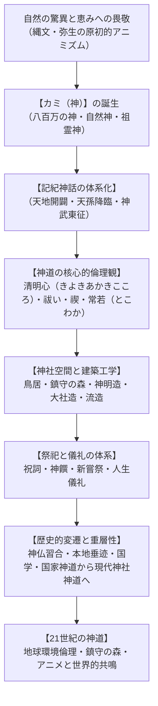
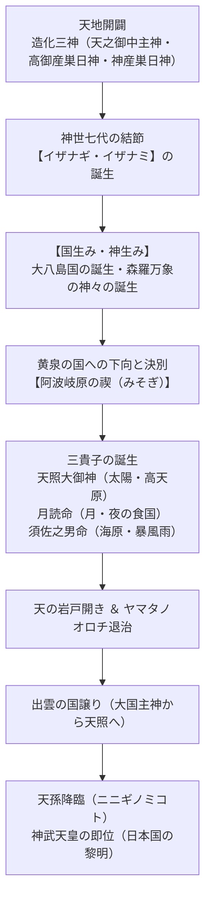
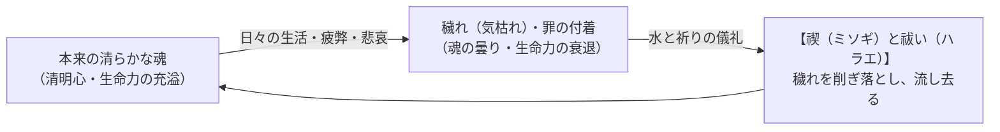
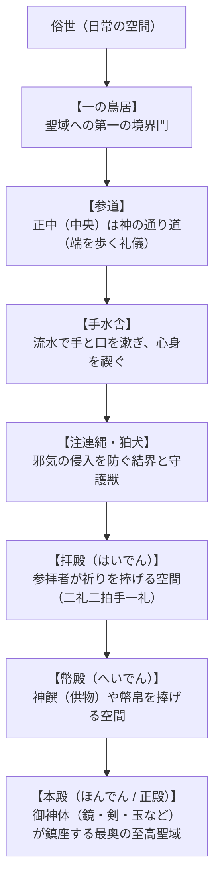

## 序論：教祖なき自然宗教――「神教（神道）」の世界的特異性とアニミズムの精華

日本列島において先史時代より綿々と受け継がれてきた「神道（しんとう）」、あるいは外来の宗教概念に対比して古くから「神教（しんきょう）」とも称されてきた信仰体系は、世界の諸宗教の常識を根底から覆す極めて稀有な特質を備えている。

世界宗教の多くには、教えを打ち立てた「教祖（預言者や覚者）」が存在し、絶対の権威を持つ「聖典（経典や聖書）」があり、信徒が遵守すべき厳格な「戒律」や信条体系が存在する。
しかし、神道には**「特定の教祖」が存在しない**。キリスト教の聖書やイスラム教のコーランに相当する**「絶対的聖典」も存在しない**。さらには、十戒や五戒のような**「成文化された教条的戒律」も持たない**。

神道とは、教義を頭で理解し信奉する宗教ではなく、**「風土、自然の森羅万象、共同体の営み、そして目に見えない崇高な気配（カミ）とともに生きる生活実践そのもの」**である。山、海、巨木、巨石、滝、風、雷、火、農作物、さらには人々の祖先の霊に至るまで、生命の宿るあらゆる存在に聖性を見出し、敬意を払い、感謝を捧げてきた古代のアニミズム（精霊信仰）が、外来文明（仏教、儒教、道教）との二千年近い共生と摩擦を経て、洗練された儀礼と空間美学（神社建築・庭園・鎮守の森）へと結晶化したものが神道である。

近代化が進み、合理主義と人間中心主義が極限に達した21世紀の今日、神道が太古より育んできた「人間は自然の支配者ではなく、大自然の懐に抱かれた一部である」という謙虚な世界観、老朽化した建物を定期的に造り替えて永遠の瑞々しさを保つ「常若（とこわか）」の思想、そして共同体で森を守り継ぐ「鎮守の森」のエコロジーは、地球規模の環境危機に直面する世界から熱い注目を浴びている。

本稿では、神道の本質から「カミ」の概念、記紀神話の壮大な物語、倫理観（清明心・穢れ・祓い）、神社建築の様式美、祭祀と人生儀礼、古代から現代に至る激動の歴史的変遷、そして現代社会とポップカルチャーにおける神道の生命力に至るまで、2万字を超える圧倒的な密度と学術的深度をもって徹底解読する。




## 第1章：「カミ（神）」の概念の本質――八百万の神と崇高なる気配

西欧の一神教（キリスト教・イスラム教）における「God」を日本語で「神」と訳したことは、明治以降の最大の誤訳の一つであるとしばしば指摘される。西欧のGodが、全知全能にして宇宙を無から創造した絶対の超越者であるのに対し、神道の**「カミ（神）」**は全く異なる存在様態を持つ。

### 1.1 本居宣長による不滅の定義
江戸時代の国学者・本居宣長（1730-1801）は、その不朽の名著『古事記伝』巻三において、「カミ」とは何かについて、今日に至るまで宗教学上最も精緻とされる定義を下している。

> 「さて、神といふ名は、古への御歌や文どもに見えたる神たちをはじめとして、それを祭れる社の御霊をも申し、また人をも、鳥獣草木海山など、よの常ならずすぐれたる徳（いさを）ありて、可畏（かしこ）きものを神とはいふなり。」

宣長によれば、「カミ」とは単に「善いもの」「気高いもの」だけを指すのではない。
- 人間をはるかに超えた神秘的な力、恐るべき威力、並外れた卓越性を持つもの。
- 畏敬の念（オゾン / Awe）、恐怖、驚嘆、感謝、戦慄を呼び起こすもの。
- 恵みをもたらす太陽や雨だけでなく、破滅をもたらす台風、地震、火山噴火、疫病神や怨霊、さらには獰猛な猛獣や奇異な形の巨石に至るまで、**「尋常ならざる力（可畏きもの）」**のすべてがカミとして感知される。

「カミ」の語源については、「上（かみ：高いところにあるもの）」「隠身（かくりみ：目に見えないもの）」「鏡（かがみ：光り輝くもの）」「醸（かむ：発酵し生成するもの）」など諸説あるが、いずれも人間の日常的認識を超えた「崇高な気配」を指し示している。

### 1.2 八百万（やおよろず）の神の三類型
神道において神々の数は無数であり、古くから**「八百万の神（やおよろずのかみ）」**と称されてきた。「八百万」とは具体的な数ではなく、「無限に多いこと、数え切れないほど無数であること」を象徴する表現である。これらの神々は、大きく三つの類型に分類することができる。

| カミの類型 | 具体例 | 性格と人間との関わり |
| :--- | :--- | :--- |
| **自然神（自然物・自然現象の神格化）** | 天照大御神（太陽）、月読命（月）、須佐之男命（海原・嵐）、火之迦具土神（火）、大山津見神（山）、志那都比古神（風） | 人間に生命の恵み（豊作・豊漁）をもたらすと同時に、暴威（災害）によって破滅をもたらす両義的（和魂・荒魂）な大自然の力そのもの。 |
| **祖霊神・人格神（先祖・英雄の神格化）** | 皇祖神、各氏族の氏神（うじがみ）、歴史上の英雄（ヤマトタケル、坂上田村麻呂、楠木正成、徳川家康＝東照大権現） | 共同体を守護し、子孫を繁栄させる守護霊。歴史の中で偉大な功績を残した人物が死後に神として祀られる。 |
| **怨霊神・御霊（非業の死を遂げた魂の鎮魂）** | 菅原道真（天満大自在天神）、崇徳上皇（白峰宮）、平将門（神田明神）、早良親王（崇道天皇） | 政治的陰謀や不当な死によって無念の死を遂げ、天変地異や疫病を引き起こした強力な怨霊を、神として手厚く祀り上げることで「強力な守護神」へと反転させる（御霊信仰）。 |

### 1.3 一霊四魂（いちれいしこん）と「荒魂・和魂」のダイナミズム
神道におけるカミや人間の魂は、固定的な静止物ではなく、ダイナミックに変化する四つの心の働き（四魂）を持っているとされる。
1. **荒魂（あらみたま）**：活動的で荒々しく、勇気、闘争、破壊、変革を司る力。自然災害や疫病として現れることもあるが、新天地を切り拓く強烈なエネルギーでもある。
2. **和魂（にぎみたま）**：調和、穏やかさ、慈愛、平和を司る力。さらに「幸魂（さきみたま：人々に幸福や繁栄を与える働き）」と「奇魂（くしみたま：不思議な智恵や治癒をもたらす働き）」に分かれる。

神社において、本宮に和魂を祀り、別宮に荒魂を祀ることが多いのは、自然と神が持つこの二面性を深く理解し、恐れ敬いながらもその恵みを受け取ろうとする古代人の知恵の現れである。


## 第2章：記紀神話とコスモロジー――『古事記』『日本書紀』の壮大なる宇宙劇

神道の神話的世界観は、8世紀初頭に編纂された現存する日本最古の歴史書『古事記』（712年）および国家の正史『日本書紀』（720年）――総称して「記紀（きき）」に鮮やかに記されている。

### 2.1 天地開闢と神世七代
世界の始まりにおいて、混沌とした原初状態から澄んだ軽い気配が上に昇って天となり、重く濁ったものが下に沈んで地となった。
天の上にまず現れたのが、**天之御中主神（あめのみなかぬしのかみ）**、続いて高御産巣日神（たかみむすひのかみ）、神産巣日神（かみむすひのかみ）の「造化三神（ぞうかさんしん）」である。彼らは姿を現さず、独りで生まれて姿を隠す「独神（ひとりがみ）」であった。
その後、次々と神々が現れ、第七代に至って初めて男女の性を持つ一対の神、**伊邪那岐命（イザナギノミコト）**と**伊邪那美命（イザナミノミコト）**が誕生した。



### 2.2 国生みと神生み――大地と万物の母
高天原の神々から「天沼矛（あめのぬぼこ）」を授かったイザナギとイザナミは、天の浮橋に立ち、矛の先を下ろして混沌とした海を「こをろこをろ」とかき鳴らし、引き上げた矛の先から滴り落ちた塩が固まって**「オノゴロ島」**ができた。
二神はオノゴロ島に降り立ち、巨大な「天の御柱」を立てて結婚の契りを結んだ。最初に淡路島、続いて四国、隠岐、九州、壱岐、対馬、佐渡、本州の八つの巨大な島を生み落とした。これを**大八島国（おおやしまのくに）**と呼ぶ。日本列島そのものが、神々の身体から生まれた神聖な生命体であるという世界観である。

続いて二神は、山、川、海、風、樹木など自然の神々を次々と生み出したが、最後に「火の神（火之迦具土神）」を生んだ際、イザナミは陰部に大火傷を負って命を落とし、死者の国である**「黄泉の国（よみのくに）」**へと去ってしまった。

### 2.3 黄泉の国への下向と阿波岐原の禊（みそぎ）
妻を深く愛していたイザナギは、彼女を連れ戻すために黄泉の国へと下向した。御殿の扉越しにイザナミは「黄泉の国の神と相談して参りますので、その間決して私の姿を見ないでください」と告げた。しかし待ちきれなくなったイザナギが櫛の歯に火を灯して中を覗くと、そこには腐乱してウジが湧き、八雷神（やついかづちのかみ）がまとわりついたイザナミの恐ろしい死骸が横たわっていた。

驚愕して逃げ出すイザナギを、恥をかかされた怒りに狂ったイザナミと黄泉の軍勢が追撃する。イザナギは黄泉比良坂（よもつひらさか）まで逃げ延び、千引の巨石で道を塞いだ。岩を挟んでイザナミは「愛しい夫よ、あなたがこんな仕打ちをするなら、私はあなたの国の人間を一日に千人絞め殺しましょう」と叫び、イザナギは「それならば私は一日に千五百の産屋を建て、千五百人の人間を生み落とそう」と答えた。これによって、人間の生死のサイクル（死を上回る生の誕生）が定まった。

黄泉の国の死の汚れ（ケガレ）を負ったイザナギは、日向の橘の小門の阿波岐原（あわきはら）において、海原の水に入って全身の汚れを洗い清める**「禊（みそぎ）」**を行った。
この禊のプロセスにおいて、左目を洗ったときに**天照大御神（アマテラスオオミカミ）**、右目を洗ったときに**月読命（ツクヨミノミコト）**、そして鼻を洗ったときに**須佐之男命（スサノオノミコト）**という、神道における最高神たち――**三貴子（さんきし）**が誕生したのである。「水で身を清めることで、汚れが祓われ、最高の生命力と神性が甦る」という禊の原体験がここに刻印されている。

### 2.4 天の岩戸開きと出雲神話
弟スサノオの度重なる乱暴狼藉に心を痛めたアマテラスが、高天原の**「天の岩戸（あめのいわと）」**に籠もって扉を閉ざしてしまった。太陽神が隠れたことで全宇宙は完全な暗闇に包まれ、あらゆる邪神や災厄が跋扈した。

困り果てた八百万の神々は天の安の河原に集まり、智恵の神・思金神（オモイカネ）の指揮のもとで知恵を絞った。常世の長鳴鳥を集めて鳴かせ、天の安の河の鉄で鏡（八咫鏡）を作り、玉祖命に勾玉（八坂瓊曲玉）を作らせた。そして**天宇受売命（アメノウズメノミコト）**が桶の上に乗り、胸をはだけて神がかりの踊りを狂乱のうちに踊ると、八百万の神々から割れんばかりの爆笑と歓声が沸き起こった。

「外で何が起きているのか？」と訝しんだアマテラスが岩戸を少し開けて外を覗いた瞬間、鏡に映った自らの光り輝く姿に目を奪われ、怪力無双の天手力男神（アメノタヂカラオ）がその手を取って外へ引き出し、注連縄を張って二度と戻れないようにした。こうして世界に再び光と命が蘇った。この神話は、日本の芸能（神楽）の起源であると同時に、笑いと祝祭による闇の克服の象徴である。

高天原を追放されたスサノオは出雲へと降り、八つの頭と八つの尾を持つ巨大な怪物・**八岐大蛇（ヤマタノオロチ）**を酒に酔わせて退治し、櫛名田比売（クシナダヒメ）を救い、オロチの尾から出た神剣「天叢雲剣（草薙剣）」をアマテラスに献上した。出雲ではその子孫である**大国主神（オオクニヌシノカミ）**が、少彦名神とともに日本列島の国造りを完成させた。

### 2.5 国譲りと天孫降臨
高天原のアマテラスは、「豊葦原の瑞穂の国（日本列島）は、我が子孫が治めるべき国である」として、建御雷神（タケミカヅチ）を出雲へ派遣した。オオクニヌシは「我が子どもたちに背く者がいなければ、この国をお譲りしましょう。その代わり、天の御子が住む宮殿と同じくらい壮大な神殿（現在の**出雲大社**）を建てて私を祀ってください」と申し出て、平和的に主権を委譲した（**国譲り**）。

アマテラスの孫である**邇邇芸命（ニニギノミコト）**は、三種の神器を授かり、高天原から日向の高千穂峰へと降り立った（**天孫降臨**）。ニニギの子孫である神日本磐余彦尊（カムヤマトイワレビコノミコト）が、瀬戸内海を東征して大和を平定し、紀元前660年（神話年代）に初代・**神武天皇**として橿原宮で即位したとされる。


## 第3章：神道の倫理観と美意識――清明心・穢れ・祓い・常若の思想

神道には戒律や教義がないと述べたが、それは「倫理やモラルが存在しない」ことを意味するのではない。神道には、古代から培われてきた極めて洗練された独自の倫理体系と美意識が貫かれている。

### 3.1 清明心（きよきあかきこころ）――内なる鏡の透明さ
神道において、人間が目指すべき最高の倫理的・精神的境地とされるのが**「清明心（きよきあかきこころ / せいめいしん）」**である。
- **清（きよき）**：濁り、曇り、汚れがなく、澄み渡っていること。
- **明（あかき）**：明るく、隠し事がなく、光に満ちていること。
- **直（なおき）**：歪みがなく、素直で、誠実であること。

神道では、人間は生まれながらに罪深い存在（原罪）とは考えない。人間は本来、神々と同じように清らかで尊い御霊（みたま）を授かって生まれてくる。しかし、日常生活の中で様々な欲や執着、恨みや苦しみ、環境の悪影響に晒されることによって、魂の表面に「塵」や「埃」が積もり、曇ってしまう。
神道の実践とは、道徳的命令を外から課すことではなく、**「魂の表面に積もった塵を払い、本来人間が持っている清らかで透明な心（内なる鏡）を取り戻すこと」**に他ならない。

### 3.2 「穢れ（ケガレ）」と「罪（ツミ）」のダイナミズム
神道における「悪」の概念は、絶対的・固定的な悪魔の存在ではなく、**「穢れ（ケガレ）」**と**「罪（ツミ）」**として捉えられる。
- **穢れ（ケガレ）の語源**：
  1. 「気枯れ（きがれ）」：生命力（気）が枯渇し、生き生きとしたエネルギーが衰弱した状態。
  2. 「汚れ（けがれ）」：清浄さが失われ、不潔で混濁した状態。
- **穢れの本質**：
  死、病気、流血、出産、天災などは、生命の力を減退させ、共同体の秩序を揺るがすため、「穢れ」として忌避された。重要なのは、**穢れとは「道徳的・人格的な悪」ではない**という点である。病気になった人や近親者を亡くした人が悪いのではない。ただ、生命力が枯渇している状態であるため、一時的に隔離し、休養し、儀礼によって生命力を充電・再生させる必要があると考えたのである。
- **罪（ツミ）**：
  「包み（つつみ）」が語源とされる。神と人、人と人の間にあるべき真実を覆い隠し、不調和をもたらす行為。古代の祝詞『大祓詞』には、農耕を妨害する「天つ罪（畔放ち、溝埋め、頻蒔きなど）」と、共同体の秩序や衛生を乱す「国つ罪（生身断ち、死身断ち、白人、胡久美、近親相姦など）」が詳細に列挙されている。

### 3.3 祓い（ハラエ）と禊（ミソギ）――原初への回帰
穢れや罪は、一度負ったら永遠に消えない刻印ではない。適切な儀礼によって、いつでも完全に取り除き、元の清らかな状態に戻すことができる。
- **禊（ミソギ）**：「身削ぎ（みそぎ）」あるいは「水そそぎ」。冷たい水、滝、海、川に身を沈め、身体に付着した穢れを直接洗い流す肉体的・精神的浄化法。神社参拝の際に手水舎で手と口を清める行為も、簡略化された禊である。
- **祓い（ハラエ）**：神職が「大麻（おおぬさ）」を振って罪穢れを打ち払ったり、人形（ひとがた）に自らの罪穢れを移して川や海に流したりする儀礼的浄化法。



### 3.4 「常若（とこわか）」の思想――式年遷宮が教える循環と永遠
神道の時間観と美意識の真髄をなすのが**「常若（とこわか）」**の概念である。

西洋の石造建築（ピラミッドやパルテノン神殿、ゴシック大聖堂）は、堅固な石を積み上げ、風化に耐えて「何千年間も形を変えずにそのまま残ること」によって永遠を表現しようとする。
これに対し、木と茅（かや）で作られた日本の神社建築は、わずか数十年で朽ち果てる脆弱な自然素材を用いている。神道は、朽ち果てることを否定しない。**「古くなったら解体し、隣の敷地に寸分違わぬ新しい社殿をゼロから建て直し、神体を遷す」**ことによって、常にみずみずしく、若々しい生命力を永遠に更新し続ける。

この常若の思想を20年に一度、1300年以上にわたって一度も絶やすことなく実践し続けているのが、伊勢神宮の**「式年遷宮（しきねんせんぐう）」**である。
20年ごとに神殿、御装束神宝（装飾品、刀剣、織物など）のすべてを最高峰の伝統工芸技術で新調することにより、古代の建築技術や工芸の技が途絶えることなく次の世代へと継承され、神宮は常に「20歳のみずみずしい姿」を保ち続ける。
破壊と再生のダイナミックな循環の中にこそ、真の永遠が存在するという世界観である。


## 第4章：聖域の空間構造と神社建築様式――神明造から権現造まで

神社は、神々が降臨し鎮座する聖なる空間であり、その配置、鳥居、建築様式には、古代からの自然観と空間美学が凝縮されている。

### 4.1 神社境内の空間構造と結界
俗世から聖域へと至る神社の境内は、多重の「結界（けっかい）」によって神聖さが守られている。



1. **鳥居（とりい）**：俗界と神域を分かつ象徴的な門。神話でアマテラスを岩戸から出すために鶏を鳴かせた「止り木」に由来するとも言われる。
2. **注連縄（しめなわ）**：神聖な場所を取り囲み、不浄や災厄の侵入を防ぐ結界の縄。白い紙垂（しで）は雷光を模したもので、神の威光を示す。
3. **狛犬（こまいぬ）**：神社の入口や社殿前に左右一対で置かれる守護獣。口を開けた「阿（あ：始まり）」と、口を閉じた「吽（うん：終わり）」で宇宙の息吹を表現している。
4. **手水舎（てみずや / ちょうずや）**：柄杓で水を汲み、左手、右手、口をすすぎ、柄を洗い流すことで、簡易的な禊を行う。

### 4.2 神社建築の主要様式
神社建築は、弥生時代の高床式穀物倉庫や古代の宮殿住居を原形として発展した。外来の寺院建築（反りのある瓦屋根、鮮やかな朱塗り）とは対照的に、直線的で簡素、白木（無塗装の木材）の木目を生かした素朴な美しさを特徴とするものが多い。

| 建築様式 | 代表的神社 | 構造的特徴と意匠 | 歴史的起源 |
| :--- | :--- | :--- | :--- |
| **神明造（しんめいづくり）** | **伊勢神宮（内宮・外宮）** | 平入（屋根の棟と平行な面に入口）、切妻造、掘立柱、直線的で装飾を排した素木造り、屋根に鰹木（かつおぎ）と千木（ちぎ）。 | 弥生時代の高床式穀倉の最も純粋な発展形。日本の原初の建築美。 |
| **大社造（たいしゃづくり）** | **出雲大社（島根県）** | 妻入（屋根の三角形の面に入口）、切妻造、平面が正方形（田の字型）、中央に巨大な「心御柱（しんのみはしら）」が立つ。 | 古代の豪族・首長の巨大な宮殿住居の形態。古代には高さ48メートルの超高層神殿であった。 |
| **住吉造（すみよしづくり）** | **住吉大社（大阪府）** | 妻入、切妻造、直線的な屋根、内部が前後二室に分かれる。柱は丹塗り（朱色）、壁は白胡粉塗り。 | 古代の内裏（天皇の居住空間）の最古の様式を伝える。 |
| **流造（ながれづくり）** | **賀茂別雷神社・賀茂御祖神社（上賀茂・下鴨神社）** | 平入、屋根の前方（正面）が優美な曲線を描いて長く延び、向拝（庇）を形成している。 | 奈良時代以降に成立。全国の神社の約7割を占める最も普及した様式。 |
| **春日造（かすがづくり）** | **春日大社（奈良県）** | 妻入、優美な反りを持った切妻屋根の正面に片流れの庇（向拝）が付く。朱塗りの華麗な装飾。 | 平安貴族の邸宅や仏教建築の影響を取り入れた優美な様式。 |
| **権現造（ごんげんづくり）** | **日光東照宮・北野天満宮** | 本殿と拝殿の間を「石の間（相の間）」で繋ぎ、一体化した複雑な屋根構造。極彩色の彫刻や金箔装飾。 | 中世・近世の神仏習合の爛熟期に発展。近世霊廟建築の最高峰。 |


## 第5章：祭祀と儀礼の体系――祝詞・神饌・人生儀礼の宇宙

神道の実践の中核をなすのが、神々に感謝と祈りを捧げる「祭祀（さいし / まつり）」である。「まつり」の語源は、「服ろふ（まつろふ：神に従う）」「待つ（神の降臨を待つ）」「奉る（たてまつる：供物を捧げる）」に通じている。

### 5.1 祭祀の基本構造：降神・神饌・祝詞・直会
すべての神道祭祀は、厳格で秩序ある一連のシークエンス（手順）に従って執り行われる。

1. **修祓（しゅばつ）**：祭典の冒頭、参列者、神職、供物のすべてを祓い清める。
2. **降神の儀（こうしんのぎ）**：「オー」という警蹕（けいひつ）の声を響かせ、神籬（ひもろぎ）や社殿に神の御霊をお招きする。
3. **献饌（けんせん）**：神々に食事である**「神饌（しんせん）」**を供える。米、酒、塩、水をはじめ、魚介類（鯛など）、海藻、野菜、果物、和菓子など、海・山・野の旬の恵みが美しく盛り付けられる。
4. **祝詞奏上（のりとそうじょう）**：斎主（神職）が、古代の美しいやまと言葉で綴られた**「祝詞（のりと）」**を独特の節回しで奏上する。神々の功績を称え、日々の平穏と豊作への感謝を述べ、国家の安寧と氏子の繁栄を祈願する。
5. **玉串拝礼（たまぐしはいれい）**：榊（さかき）の枝に紙垂をつけた「玉串」に自らの心を乗せ、神前に捧げて「二礼二拍手一礼」で祈る。
6. **撤饌・昇神の儀**：供物を下げ、神々にお戻りいただく。
7. **直会（なおらい）**：祭典の終了後、神前に供えた神饌や神酒（お神酒）を、神職と参列者全員で分かち合って飲食する。神と同じものを共に食すこと（**神人共食 / しんじんきょうしょく**）によって、神の生命力を自らの身体に取り込み、共同体の絆を強固に結び直す。

### 5.2 年中行事と農耕儀礼のサイクル
神道の祭りは、古代の稲作農耕のサイクルと完全に合致している。
- **春：祈年祭（としごいのまつり / 2月17日）**：春の耕作の初めに、その年の五穀豊穣を予祝して祈願する。
- **夏：夏越の祓（なごしのはらえ / 6月30日）**：半年間のうちに無意識に溜まった罪穢れを祓うため、神社の境内に設けられた「茅の輪（ちのわ）」をくぐる。
- **秋：新嘗祭（にいなめさい / 11月23日）**：秋に収穫された新穀を神々に捧げて感謝し、天皇自らも新穀を召し上がる最も重要な国家祭祀。皇位継承後の最初の新嘗祭を**大乗祭（だいじょうさい）**と呼ぶ。
- **冬：大祓（おおはらえ / 12月31日）**：一年の罪穢れを完全に祓い清め、清浄な心で新年を迎える。

### 5.3 人生儀礼（通過儀礼）と日本人の一生
日本人の人生の節目は、神道儀礼によって祝福され、守護される。
- **初宮参り（お宮参り）**：生後30日目前後、無事に誕生した赤子を地域の氏神に連れて行き、新しい氏子として承認を受け、健やかな成長を祈願する。
- **七五三（7歳・5歳・3歳）**：乳幼児の死亡率が高かった古代において、無事に節目を越えたことを感謝し、これからの長寿を祈る。
- **厄除け（厄払い）**：心身の変調や社会的な責任の変化が訪れる年齢（男性25・42・61歳、女性19・33・37歳など）に神社で厄を祓う。
- **神前結婚式**：明治以降に定着した形式。三三九度の盃を交わし、神の前で永遠の契りを結ぶ。
- **地鎮祭（じちんさい）**：家やビルを建設する際、その土地の神（産土神・大地主神）を鎮め、土地利用の許しを得て工事の安全と繁栄を祈る。現代の最新ハイテクビルや宇宙ロケットの発射場でも欠かさず執り行われている。


## 第6章：神道の歴史的変遷――神仏習合から国家神道、現代へ

神道は、孤立した純粋な形態で保存されてきたのではない。外来の仏教、儒教、道教と対峙し、混交し、時に激しく反発しながら重層的な歴史を紡いできた。

### 6.1 古代の祭政一致と『延喜式』神名帳
古代ヤマト王権において、政治（まつりごと）とは文字通り「祭事（神祭り）」そのものであった。天皇は国家の最高司祭者として天神地祇を祀り、律令国家の最高機関として太政官と並んで**「神祇官（じんぎかん）」**が設置された。
10世紀初頭に編纂された『延喜式』巻九・十の「神名帳」には、国家の幣帛を受けるべき全国2861社（3132座）の官社（式内社）が網羅されており、古代の国家的神社ネットワークが完成していた。

### 6.2 神仏習合と本地垂迹説（千年の共生）
6世紀に仏教が伝来すると、当初は「蕃神（となりのくにのかみ）」として警戒されたが、やがて「神々も迷いの中にあり、仏の教えによって救いを求めている」という**神身離脱説**が唱えられ、神社の境内に寺（神宮寺）が建立された。

平安時代から中世にかけて、この関係はさらに進展し、**「本地垂迹説（ほんじすいじゃくせつ）」**という精緻な神仏習合理論が確立された。
- **本地（真実の姿）**：究極の真理を体現する仏や菩薩。
- **垂迹（仮の姿）**：仏や菩薩が、日本という国の無知な民衆を救うために、神という親しみやすい姿となって現れ出たもの（権現 / ごんげん）。

例えば、伊勢神宮のアマテラスは大日如来の垂迹であり、八幡大菩薩は阿弥陀如来の垂迹、熊野権現は阿弥陀・薬師・観音の垂迹とされた。
この神仏習合の中で、天台宗と結びついた「山王神道」や、真言密教と結びついた「両部神道」など、高度な神道神学が形成され、明治維新までの千年間、日本人の精神生活において神と仏は分かち難く調和して共存していた。

```mermaid
flowchart LR
    subgraph 本地垂迹説（中世の神仏調和）
        A["【本地（仏・菩薩）】<br/>究極の真理（大日如来・阿弥陀如来）"] -->|"慈悲による仮の顕現"| B["【垂迹（日本のカミ）】<br/>天照大御神・八幡神・熊野権現"]
    end

    subgraph 近世の反転（神道独自の覚醒）
        C["国学（本居宣長）<br/>漢意（からごころ）の排除・古道復興"] --> D["明治の神仏分離・国家神道<br/>神宮・神社の国家管理"]
    end
    B -.->|"思想史的転換"| C
```

### 6.3 反本地垂迹説と国学の勃興
鎌倉時代末期から室町時代にかけて、蒙古襲来（元寇）の「神風」体験などを契機に、「日本は神国であり、神こそが根源であって仏がその現れに過ぎない」とする逆転の思想（**反本地垂迹説 / 神本仏迹説**）が、伊勢神道の度会家行らによって唱えられた。室町後期には吉田兼倶が**吉田神道（唯一神道）**を創始し、仏教や儒教を神道から派生した枝葉に過ぎないと主張した。

江戸時代、町人文化の爛熟の中で、儒教や仏教の教条的な枠組み（漢意 / からごころ）を排し、日本固有の古典（『古事記』『万葉集』）の実証的研究を通じて古代人の無垢で純粋な精神を復元しようとする**「国学（こくがく）」**が勃興した。
荷田春満、賀茂真淵、そして『古事記伝』を35年かけて完成させた**本居宣長**によって、神道は外来宗教の借用物ではない「独自の道（古道）」としての確固たる自覚を獲得した。

### 6.4 明治維新、神仏分離と国家神道
1868年の明治維新は、神道の歴史において最大の激動期となった。
新政府は「祭政一致」の古代精神への回帰を掲げ、**神仏判然令（神仏分離令）**を発布した。これにより、千年にわたり融合していた神社と寺院が強制的に切り離され、各地で狂気的な廃仏毀釈の嵐が巻き起こり、貴重な仏像や経典が破壊された。

欧米列強に対抗し近代国民国家を急速に統合するため、明治政府は天皇の神聖不可侵性を軸とする**「国家神道」**の体制を構築した。
政府は「神社は宗教ではなく、国民共通の国家道徳・儀礼の場である（神社非宗教論）」という法解釈をとり、内務省神社局のもとで全国の神社を官幣社・国幣社・郷社・村社などの近代社格制度に再編し、国家予算で保護・統制した。神社合祀令によって数十万の小神社や祠が統合され、学校教育を通じて記紀神話の皇国史観が徹底された。

### 6.5 GHQの「神道指令」から現代神社神道へ
1945年の太平洋戦争の敗戦により、連合国軍最高司令官総司令部（GHQ）は、軍国主義と国家主義の温床とみなした国家神道の完全解体を命じる**「神道指令」**を発出した。
- 神社に対する国家の公金支出と公的特権の全廃。
- 国家と宗教の厳格な分離（信教の自由、政教分離の確立）。
- 学校教育における神道儀礼・教義の禁止。

国家の後ろ盾を失った神社界は、1946年に民間の宗教法人として**「神社本庁（じんじゃほんちょう）」**を設立。現在、日本全国に存在する約8万社の神社の大部分（伊勢神宮を本宗とする）を包括し、氏子崇敬者の寄付と奉賛によって自律的に運営される体制へと移行した。


## 第7章：神道の祭具・装束と神宝の工芸工学――神聖を纏う美学

神道において用いられる祭具や装束は、単なる宗教的衣装や道具ではなく、神聖な神気を受け止め、穢れを寄せ付けないための高度な精神的・工芸的技術の結実である。

### 7.1 三種の神器（さんしゅのしんぎ）と皇位継承の秘宝
歴代天皇が皇位の正統性の証として受け継いできた**「三種の神器」**は、神道神話と王権が一体化した至高の神宝である。
1. **八咫鏡（やたのかがみ）**：伊勢神宮の内宮（皇大神宮）の御神体。アマテラスの御魂そのものとされ、「この鏡を私自身を見るように敬え」と神話で告げられた。円満な知恵と、曇りなき真実を映し出す「清明心」の象徴。
2. **八尺瓊勾玉（やさかにのまがたま）**：皇居の「剣璽の間」に実物が安置される唯一の神器。生命の瑞々しい躍動、優しさ、慈悲の象徴。胎児や動物の牙、魂の形を模したとされる。
3. **草薙剣（くさなぎのつるぎ / 天叢雲剣）**：熱田神宮の御神体（皇居には形代を安置）。ヤマタノオロチの尾から現れ、ヤマトタケルが東征の折に草を薙ぎ払って火難を逃れた伝説を持つ。勇気、決断力、正義、武勇の象徴。

儒学や神道思想においては、この三種の神器を「智（鏡）・仁（玉）・勇（剣）」の三徳の具現化として解釈してきた。

### 7.2 神職の階位と装束の体系
神社で奉仕する神職（宮司・禰宜・権禰宜など）は、神前に進む際に厳格な身分・格式に応じた伝統装束を身に纏う。
- **正装（衣冠 / いかん）**：宮中の貴族の正装に由来する。黒の冠（かんむり）、袍（ほう）、白袴、笏（しゃく）、浅沓（あさぐつ）。天皇陛下の勅祭や例祭など最重儀の祭典で着用される。
- **礼装（斎服 / さいふく）**：衣冠と同型であるが、冠から袍、袴に至るまで「一切の染色を行わない純白の麻や絹」で仕立てられた装束。清浄無垢を極限まで体現する。
- **日常着・小祭（狩衣 / かりぎぬ・浄衣 / じょうえ）**：平安貴族の狩猟・日常着に由来し、袖が大きく開いて動きやすい。一般の参拝者が目にする神職の姿は多くが狩衣または白一色の浄衣である。
- **笏（しゃく）と大麻（おおぬさ）**：神職が右手に持つ細長い木の板「笏」は、もとは儀式の次第をメモした紙を貼る板であったが、威儀を正し背筋を伸ばす象徴となった。また、榊の枝に紙垂や麻苧を付けた「大麻」は、左右左と振ることで空気中の穢れを祓い清める祭具である。

### 7.3 巫女（みこ）の装束と神楽舞
神社の社頭で奉仕する巫女の姿は、神道の清純さを象徴している。
純白の白衣（小袖）に、鮮やかな朱赤の**緋袴（ひばかま）**を穿ち、長い黒髪を水引で束ねる。大祭の際には、四季の花や鶴・松などが金糸銀糸で刺繍された薄絹の羽織**「千早（ちはや）」**を羽織り、頭に花のかんざしを戴く。
手には神楽鈴（三層の鈴）と檜扇を持ち、雅楽の調べに合わせて優雅に舞う**「神楽舞（浦安の舞、豊栄の舞など）」**は、かつて天の岩戸の前でアメノウズメが踊った神がかりの踊りを洗練・様式化させたものであり、神々の心を慰め、和らげる最高の祈りである。

### 7.4 神輿（みこし）と「魂振り（たまふり）」のエネルギー
夏や秋の例祭において、境内を飛び出して街中を巡行する**「神輿（御輿 / みこし）」**は、「移動する仮の神社（神の乗り物）」である。
本殿に鎮座する神の御魂を、神職が夜の闇の中で神輿へと遷し（御霊遷しの儀）、氏子たちが揃いの法被を着て肩に担ぎ、街中を練り歩く。

神輿を担ぐ人々が「ワッショイ」「セイヤ」と激しい掛け声を上げ、神輿を上下左右に激しく揺さぶり、揉み合う行為を**「魂振り（たまふり）」**と呼ぶ。
神道において、激しく揺さぶることは、停滞した生命力を揺り動かし、神の荒魂のエネルギーを活性化させ、大地と人々に新たな生命力を吹き込む呪術的意味を持っている。神のエネルギーが街中に満ち渡ることで、疫病が退散し、五穀豊穣と地域の繁栄がもたらされるのである。

## 第8章：日本全国の主要信仰体系と巨大神社ネットワーク

日本全国には約8万社もの神社が存在するが、その多くは特定の有力な本宮（総本社）から御分霊を勧請して全国へ広がった「神社ネットワーク（信仰体系）」を形成している。

| 信仰系統 | 全国社数 | 総本社 | 主祭神 | ご利益・信仰の特質 |
| :--- | :--- | :--- | :--- | :--- |
| **八幡信仰** | 約40,000社 | **宇佐神宮**（大分県）<br/>石清水八幡宮、鶴岡八幡宮 | 応神天皇（八幡大菩薩）、比売大神、神功皇后 | 国家鎮護、武運長久、開運勝利。源氏の氏神として武士階級に絶大な信仰を集めた。神仏習合の先駆け。 |
| **伊勢・神明信仰** | 約18,000社 | **伊勢神宮**（三重県） | 天照大御神、豊受大御神 | 皇室の祖神、国家安泰、五穀豊穣、万物の生命の親神。江戸時代には「お伊勢参り（おかげ参り）」が爆発的ブームに。 |
| **稲荷信仰** | 約30,000社 | **伏見稲荷大社**（京都府） | 宇迦之御魂神（倉稲魂神） | 五穀豊穣、商売繁盛、産業興隆、家内安全。キツネは神そのものではなく「神のお使い（神使）」。朱色の千本鳥居が有名。 |
| **天神信仰** | 約10,000社 | **太宰府天満宮**（福岡県）<br/>北野天満宮（京都府） | 菅原道真公（天満大自在天神） | 学問の神、受験合格、文芸・書道の上達。非業の死を遂げた怨霊を天神として祀り上げた御霊信仰の最高峰。 |
| **諏訪信仰** | 約10,000社 | **諏訪大社**（長野県） | 建御名方神、八坂刀売神 | 武勇の神、風の神、農業・狩猟の守護。7年に一度、巨大な樅の巨木を山から曳き落として境内に建てる「御柱祭」で名高い。 |
| **熊野信仰** | 約3,000社 | **熊野三山**（和歌山県）<br/>本宮・速玉・那智大社 | 家都美御子大神、熊野速玉大神、熊野夫須美大神 | 浄土信仰と結びついた「死と再生の聖地」。平安貴族から庶民に至るまで列をなした「蟻の熊野詣」。八咫烏（やたがらす）が神使。 |
| **祇園信仰** | 約3,000社 | **八坂神社**（京都府） | 須佐之男命、櫛稲田姫命、八柱御子神 | 厄除け、疫病退散。平安京の疫病を鎮めるために始まった「祇園祭」は日本三大祭りの一つ。牛頭天王との習合。 |
| **浅間信仰** | 約1,300社 | **富士山本宮浅間大社**（静岡県） | 木花之佐久夜毘売命（コノハナサクヤヒメ） | 富士山そのものを神体山とする火山信仰。噴火を鎮める女神として祀られ、富士講による登拝信仰が栄えた。 |

## 第9章：祝詞（のりと）の言霊思想と言語哲学――『大祓詞』の完全解読

神道の祈りは、沈黙の瞑想だけではなく、声に出して言葉を響かせる「音声言語の呪術性」に深く根ざしている。それが古代日本の**「言霊（ことだま）」**思想である。

### 9.1 「言霊の幸はふ国」の言語観
『万葉集』において柿本人麻呂や山上憶良が「言霊の幸（さき）はふ国（言葉の正しい霊力によって幸福がもたらされる国）」と詠んだように、古代の日本人は、**「言葉には魂が宿っており、美しい善き言葉を発すれば現実に善き出来事が起き、不吉で悪しき言葉を発すれば現実に災厄が起きる」**と固く信じた。

言葉とは、単なる意思伝達の記号ではない。声という空気の振動を通じて、神々の霊力を直接動かす生命のエネルギーそのものである。だからこそ、神道で奏上される「祝詞」は、日常の話し言葉とは峻別された、母音の響きが美しく荘厳な「やまと言葉」によって厳格に構成されている。

### 9.2 『大祓詞（おおはらえのことば）』に見る罪穢れ消滅のドラマ
平安時代の『延喜式』巻八に収められ、今なお全国の神社で毎朝、あるいは6月・12月の大祓式で一斉に奏上される最も神聖な祝詞が**『大祓詞（中臣祓）』**である。

大祓詞の後半部分には、神々が祓い清めた人間の罪穢れが、どのようにして大自然の循環の中で宇宙の彼方へと消滅していくのかが、雄大で劇的な叙事詩として描かれている。
1. **瀬織津比売（セオリツヒメ）**：高い山、低い山の頂から勢いよく落ちてくる激流の瀬（急流）に座す川の女神。あらゆる罪穢れを大海原へと一気に押し流す。
2. **速開都比売（ハヤアキツヒメ）**：潮流が激しく渦巻く海の底深くに座す女神。流れてきた罪穢れを「カカナクテ（がぶがぶと音を立てて）」呑み干してしまう。
3. **気吹戸主（イブキドヌシ）**：息吹を司る風の神。海の底に呑み込まれた罪穢れを、突風によって「根の国・底の国（異界の深淵）」へと吹き払う。
4. **速佐須良比売（ハヤサスラヒメ）**：根の国・底の国に座す女神。吹き飛ばされてきた罪穢れを完全に引き受け、彷徨い消し去って、跡形もなく消滅させてしまう。

> 「かく佐すらひ失ひてば、今日より始めて罪と言ふ罪は在らじと……（このように完全に消滅させたならば、今日から後は罪という罪は一切残らない）」

人間の犯した過ちや汚れを、決して永遠の罰や地獄の劫火で責め苛むのではなく、川から海へ、風から地下の深淵へと、**大自然のエレメント（水・海・風・大地）の自浄作用によってすべて綺麗さっぱり洗い流し、完全にゼロリセットして清らかな朝を迎える**。ここに、神道が持つ底抜けに明るい救済と再生の哲学が完璧に結晶化しているのである。


## 第7章：21世紀における神道――地球環境倫理とポップカルチャーの世界的共振

### 7.1 鎮守の森のエコロジー思想
今日、環境破壊、生物多様性の喪失、気候変動という地球規模の危機に直面する中で、神道の**「鎮守の森（ちんじゅのもり）」**の知恵が国際的な環境倫理学から熱狂的な再評価を受けている。

日本の神社は、例外なく鬱蒼とした原生林（鎮守の森）に囲まれている。古代人は、森そのものを神が宿る「神奈備（かんなび）」として崇敬し、木を伐採することを固く禁じて「禁足地」として保全してきた。この数千年にわたる信仰のタブーのおかげで、日本列島の各地域には、太古の極相林（照葉樹林や針葉樹林）が奇跡的なマイクロ・バイオーム（微小生態系）として現代まで無傷で残された。

植物生態学者・宮脇昭が提唱した「鎮守の森を手本とした潜在自然植生による森づくり（宮脇方式）」は、世界各地の砂漠化防止や熱帯雨林再生プロジェクトに導入され、地球を救う知恵として高く評価されている。

### 7.2 ロボティクス・AIと神道的アニミズムの親和性
西欧の一神教的伝統において、人間のみが神の似姿（イマーゴ・デイ）として造られ、理性と霊魂を与えられた特別な存在であり、動物や物質、機械は人間が支配・管理すべき「魂のない客体」と見なされてきた。そのため、自律的に思考するアンドロイドやAIに対しては、「神の領域を侵犯する冒涜」「人類を滅ぼすフランケンシュタインの怪物」という根深い恐怖や禁忌感が付きまとう。

これに対し、日本では鉄腕アトムやドラえもんに始まり、現代の産業用ロボットや人型ロボット（ペッパー、アシモなど）に至るまで、テクノロジーを敵視するのではなく、親密な友人や家族、パートナーとして温かく受容する独特の文化的土壌がある。
宗教学者や比較文化学者たちは、この現象の根底に**神道的なアニミズム（汎霊論）の感性**が存在することを指摘している。
神道においては、人間だけが魂を持つ特権者ではない。草木や岩石、川の流れはもちろんのこと、人間が心を込めて作り、愛用した道具や人形（針供養、人形供養、筆供養など）にすら霊性が宿る。したがって、金属とシリコンで精巧に作られたロボットやAIに対しても、そこに生命の気配（カミ的な兆し）を感じ取り、共生しようとする自然な受容性が働くのである。この神道特有の柔軟な物質観と生命観は、AIやサイバネティクスが急速に進化する21世紀後半の「ポストヒューマン時代」において、機械と人間が調和して共存するための極めて建設的な倫理モデルを提示している。

### 7.2 アニメーション・大衆文化に見る神道コスモロジー
21世紀、神道の世界観は、日本のアニメーションやマンガを通じて、国境を越えて世界中の何億人もの人々の感性に自然な形で浸透している。
- **宮崎駿監督作品**：『となりのトトロ』に登場する樹齢千年のクスノキに住む森の主トトロ、『もののけ姫』におけるシシ神（生死を司る自然そのものの荒魂と和魂のダイナミズム）、そして『千と千尋の神隠し』において、汚れきった川の神（腐れ神）が湯屋でヘドロや人間のゴミを洗い流して清明さを取り戻す場面は、まさに神道の「八百万の神」と「禊・祓い」の哲学そのものである。
- **新海誠監督作品**：『君の名は。』における組紐の結び（ムスビ：産霊＝神道における万物を生成・結合させる神秘の力）や宮水神社の巫女儀礼、『天気の子』『すずめの戸締まり』における地震を封じる要石（鹿島神宮の信仰）や廃墟の神々を鎮める祈りは、現代の天変地異と人間の実存を神道の神話的構造で解釈し直した傑作である。

これらの作品が世界中で熱狂的に受容される理由は、神道のアニミズムが、教条主義的な対立を生むことなく、自然への深い畏敬と生命への愛着を直観的に呼び覚ます普遍的な力を持っているからである。

### 7.3 結語：生成し続ける「生」への無条件の祝福
神道には、終末論がない。この世の終わりも、最後の審判も、地獄での永遠の業火もない。
あるのは、昨日から今日へ、今日から明日へと、水が流れ、風が吹き、木々が芽吹き、世代が交代していく**「生成発展（産霊 / むすひ）」**の果てしない肯定である。

過酷な自然災害に見舞われながらも、古代から日本人は、自然を憎悪するのではなく、荒魂として畏れつつ、和魂の恵みに感謝し、傷ついた社殿や家を何度でも建て直してきた。
「命は尊く、世界は美しく、生きていることそのものが奇跡である」。

手水舎の水で手を洗い、深い森の木漏れ日の中で二礼二拍手を打ち、柏手を打った瞬間の澄み切った静寂。神道が教えてくれるのは、いかなる教条にも囚われない、いまここに生きる自らの生命の尊さへの静かな目覚めなのである。
