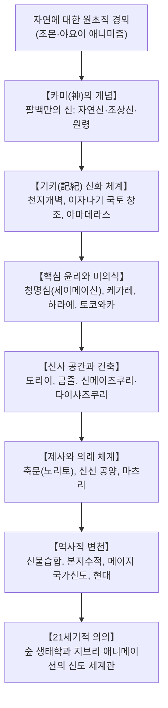

## 서론: 교조와 경전이 없는 자연 애니미즘의 정수

선사시대부터 일본 열도에서 전승되어 온 신도(神道, 신교)는 서구의 종교 개념을 뒤흔드는 고유한 특성을 지닙니다. **역사적 교조가 없고**, 성경이나 코란 같은 **절대적 경전도 없으며**, 십계명 같은 **성문화된 교조적 계율도 존재하지 않습니다**.

신도는 머리로 믿는 교리가 아니라 생활 그 자체입니다. 바로 **산과 바다, 거대한 나무, 폭포, 바람, 농작물, 조상신 등 자연의 삼라만상에 깃든 신성한 기운인 '카미(神)'를 경외하고 더불어 살아가는 삶의 태도**입니다. 21세기 기후 위기의 시대에 신도의 자연관과 '토코와카(常若)'의 순환 철학, 신사를 둘러싼 '진주의 숲'은 세계 생태학계의 큰 주목을 받고 있습니다.

## 1. '카미(神)'의 개념과 팔백만의 신
에도 시대의 국학자 모토오리 노리나가는 《고사기전》에서 "범상치 않은 뛰어난 위력을 지니고 경외심(*kashikoki*)을 불러일으키는 모든 존재를 카미라 부른다"고 정의했습니다.
- **자연신**: 아마테라스 오미카미(태양신), 달의 신, 폭풍의 신 스사노오, 산천초목.
- **조상신 및 영웅**: 황조신, 가문의 씨신, 역사적 영웅.
- **원령신**: 억울하게 죽은 원혼(스가와라노 미치자네 등)을 신으로 모셔 재앙을 막고 수호신으로 반전시키는 영혼 신앙.
신은 거칠고 역동적인 **아라미타마(荒魂)**와 온화하고 자비로운 **니기미타마(和魂)**의 두 얼굴을 지닙니다.

## 2. 고사기 신화와 국토 창조
이자나기와 이자나미 두 신이 천상의 다리에서 창으로 바다를 휘저어 섬들을 낳고 산과 바람의 신들을 낳았습니다. 이자나미가 황천으로 떠난 후 이자나기가 바닷물로 몸을 씻는 **미소기(禊)**를 행할 때 왼쪽 눈에서 태양의 여신 **아마테라스**, 오른쪽 눈에서 달의 신 **츠쿠요미**, 코에서 폭풍의 신 **스사노오**가 탄생했습니다.

## 3. 청명심(淸明心)과 토코와카(常若) 사상
- **청명심(세이메이신)**: 인간은 본래 맑고 깨끗한 영혼을 지니고 태어난다는 믿음. 악은 원죄가 아니라 일상에서 묻은 '티끌(케가레/기운의 고갈)'에 불과하며, 물로 씻어내는 **미소기**와 정화 의식인 **하라에**를 통해 본래의 맑음을 되찾을 수 있습니다.
- **토코와카 사상**: 돌로 영원을 짓는 대신, 낡아지면 헐고 똑같이 새로 지어 늘 젊음을 유지하는 지혜입니다. **이세신궁**은 20년마다 신전을 완전히 새로 짓는 **식년천궁(式年遷宮)**을 1300년 넘게 이어오고 있습니다.

## 4. 신사 건축과 마츠리(축제)
신역을 알리는 붉은 **도리이**, 부정한 기운을 막는 금줄(**시메나와**), 그리고 고대 고상 창고의 미학을 간직한 **신메이즈쿠리(이세신궁)**와 **다이샤즈쿠리(이즈모대사)**. 신사 축제인 **마츠리**에서 가마(미코시)를 격렬히 흔드는 행위는 신과 공동체의 생명력을 활성화하는 주술적 행위입니다.

## 5. 현대적 의의: 숲과 애니메이션
신사를 둘러싼 원시림인 '진주의 숲'은 고유 생태계를 지켜낸 보고이며 미야와키 방식의 자연림 복원 모델이 되었습니다. 미야자키 하야오의 《센과 치히로의 행방불명》, 《원령공주》, 신카이 마코토의 《너의 이름은.》 등은 신도의 자연 친화적 세계관이 현대 대중문화 속에서 어떻게 살아 숨 쉬는지를 생생하게 보여줍니다.
