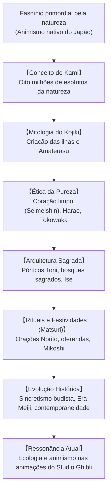

## Introdução: Uma Espiritualidade sem Fundador nem Escrituras Canônicas

Espiritualidade nativa do Japão, o Xintoísmo («o caminho dos Kami») rompe com as convenções religiosas ocidentais: **não possui um fundador humano**, **não tem uma Bíblia ou livro sagrado exclusivo** e **não impõe mandamentos dogmáticos**. Trata-se de uma reverência vital perante a natureza: **a percepção sensível da presença sagrada (*Kami*) que pulsa nas montanhas, árvores antigas, rios e antepassados**.

## 1. A Natureza dos Kami
Segundo o mestre Motoori Norinaga, tudo o que inspira temor e maravilhamento respeitoso (*kashikoki*) é um Kami: montanhas, cachoeiras, árvores milenares, fenômenos celestes (a Deusa do Sol Amaterasu) e ancestrais. Os Kami manifestam uma força dinâmica serena (*Nigi-mitama*) e uma força tempestuosa e vigorosa (*Ara-mitama*).

## 2. A Mitologia do Kojiki e Nihon Shoki
As crônicas sagradas narram que o casal primordial Izanagi e Izanami criou as ilhas do Japão. Ao se purificar nas águas de um rio (*misogi*), Izanagi deu origem aos três supremos Kami: Amaterasu (sol), Tsukuyomi (lua) e Susanoo (mar e tempestades). O mito da caverna celestial consagra o renascimento da luz através da dança e da alegria.

## 3. Pureza Ritual e o Conceito de Tokowaka
- **Coração Límpido (Seimeishin)**: O ser humano é originalmente puro. Os desvios e impurezas da vida cotidiana (*kegare*) são removidos pelas águas da purificação (*misogi*) e rituais sagrados (*harae*).
- **Tokowaka (Eterna Juventude)**: A eternidade no Xintoísmo é alcançada pela renovação contínua. No santuário de **Ise Jingu**, os templos são demolidos e reconstruídos com rigor milimétrico a cada 20 anos (*Shikinen Sengu*).

## 4. Santuários e Celebrações Populares
Os portais **Torii**, as cordas sagradas **Shimenawa** e o bosque sagrado (*Chinju no Mori*) delimitam o espaço protegido dos templos. Nas festas populares (*Matsuri*), o sacudir vigoroso dos andores sagrados (*Mikoshi*) desperta a vitalidade espiritual de toda a cidade.

## 5. Conexão Ecológica e Cultura Pop
Os bosques preservados em torno dos santuários serviram de modelo para técnicas ecológicas de reflorestamento natural. Em obras de arte consagradas mundialmente, cineastas como Hayao Miyazaki (*A Viagem de Chihiro*, *Princesa Mononoke*) celebram essa coexistência harmoniosa entre humanidade e natureza.
