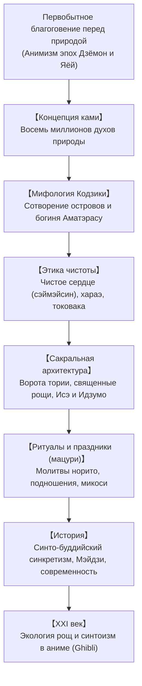

## Введение: Религия без пророка и догм

Исконная духовная традиция Японии — синто («путь богов») — не укладывается в рамки западного религиоведения: в ней **нет основателя**, **нет единого священного писания** и **нет догматических запретов**. Синто — это мироощущение непосредственной связи с живой природой: **благоговейное почитание сакрального присутствия (*ками*) в горах, вековых деревьях, водопадах и предках**.

## 1. Сущность духов ками
Выдающийся ученый Мотоори Норинага определял ками как всё, что внушает трепетное благоговение (*касикоки*): горы, водопады, древние кедры, богиня солнца Аматэрасу или духи великих предков. Ками обладают двумя аспектами: грозной, бурной мощью (*ара-митама*) и благосклонной, гармоничной благодатью (*ниги-митама*).

## 2. Мифы Кодзики и Нихон сёки
Древние своды повествуют о божественной чете Идзанаги и Идзанами, сотворивших Японские острова. Омываясь в водах после посещения царства мертвых (*мисоги*), Идзанаги породил Аматэрасу (солнце), Цукуёми (луну) и Сусаноо (бурю).

## 3. Ритуальная чистота и концепция токовака
- **Чистое сердце (сэймэйсин)**: Человек от рождения чист; осквернения (*кэгарэ*) смываются водой (*мисоги*) и ритуальными очищениями жрецов (*хараэ*).
- **Токовака (вечная юность)**: Вечность в синтоизме достигается через циклическое обновление. Святилище **Исэ-дзингу** полностью перестраивается заново каждые 20 лет (*сикинэн сэнгу*), передавая плотницкое мастерство сквозь века.

## 4. Святилища и народные праздники (мацури)
Пространство святилища отмечается вратами **тории**, соломенными канатами **симэнава** и нетронутой священной рощей (*тиндзю-но мори*). Во время праздников *мацури* раскачивание переносных святилищ (*микоси*) оживляет духовную энергию всей общины.

## 5. Синтоизм в XXI веке
Священные рощи вокруг храмов сохраняют биоразнообразие и служат моделью естественного лесоразведения. В кинематографе поэтический анимизм Хаяо Миядзаки («Унесенные призраками», «Принцесса Мононоке») и Макото Синкая несет синтоистское уважение к природе миллионам зрителей по всему миру.
