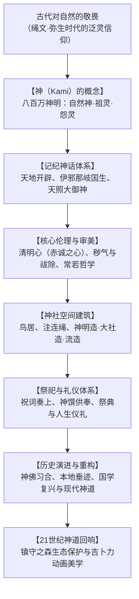

## 序论：无教祖与无圣经的自然泛灵宗教

自日本列岛史前时代传承至今的“神道（Shinto）”，颠覆了传统世界宗教的定义：它**没有特定的历史创教祖师**，**没有类似《圣经》或《古兰经》的绝对教条圣典**，也**没有严苛的成文戒律**。

神道不是教条式的信仰，而是一种浸透在日常生活与风土之中的精神感知：**对自然万物中所蕴含的神圣灵气（Kami / 神明）抱持深切的敬畏与感恩**。从巍峨的高山、参天古杉、瀑布风雷，到农业作物与先祖亡魂，森罗万象皆有神明栖息。

面对当代全球生态危机，神道所蕴含的“人非自然支配者而是自然之一环”的谦卑观、定期拆建新造以维持永恒活力的“常若（Tokowaka）”思想，以及世代守护的“镇守之森”生态林，正受到国际社会的广泛瞩目。

## 第一章 “神（Kami）”的概念与八百万神明
江户时代国学巨擘本居宣长在《古事记传》中给出了神明的经典定义：
> “凡凡常所不及之卓越威德、令人畏敬（Kashikoki）之物，皆称为神。”

神明并非全知全能的上帝，而是包含了：
1. **自然神**：天照大御神（太阳）、月读命（月亮）、须佐之男（暴风雨与海原）、山川草木。
2. **祖灵与英雄**：各氏族氏神、皇祖神、历史英雄（德川家康等）。
3. **御灵信仰（安抚怨灵）**：如非命早逝的菅原道真被奉为天满天神，将怨念转化为庇护万民的学问之神。

神明兼具威猛狂暴的“荒魂（Ara-mitama）”与温和慈爱的“和魂（Nigi-mitama）”。

## 第二章 记纪神话的宇宙剧
《古事记》（712年）与《日本书纪》（720年）勾勒了日本神话体系：
- **天地开辟与伊邪那岐、伊邪那美**：立于天浮桥以天沼矛搅动海水创造淤能碁吕岛，继而产下日本大八岛国与诸神。
- **黄泉之行与阿波岐原之禊**：伊邪那美因生火神身亡步入黄泉。伊邪那岐逃回人间后在海水中洗涤黄泉污秽，清洗左眼诞生**天照大御神**，清洗右眼诞生**月读命**，清洗鼻端诞生**须佐之男命**。
- **天岩户与出云神话**：天照因须佐暴行隐入天岩户，天宇受卖命载歌载舞引诸神欢笑，终迎太阳重现人间。随后须佐之男斩杀八岐大蛇，其后裔大国主神和平让国。

## 第三章 伦理与美学：清明心、祓除与常若思想
- **清明心（纯净赤诚之心）**：神道认为人性本如明镜般纯净，恶并非天生原罪，而是后天沾染的“尘埃（秽气 / Kegare）”。
- **禊（Misogi）与祓（Harae）**：通过冰凉泉水或海水洗涤身心除去“气枯”，恢复旺盛生命力。
- **常若（Tokowaka）思想**：神道不追求石造建筑的永久不朽，而是通过“老朽则拆除、依原貌重建”的方式实现生命力的永续更新。**伊势神宫**每二十年进行一次“式年迁宫”，跨越千余年使神宫永葆二十岁的青春面貌。

## 第四章 神社空间与建筑样式
- **鸟居与结界**：朱红或木质的鸟居是区分尘世与神域的门户；注连绳配挂纸垂，辟除不洁。
- **核心建筑格局**：
  - **神明造（伊势神宫）**：脱胎于弥生时代高床谷仓，纯木质切妻造，屋脊饰以千木与鲣木，洗练至极。
  - **大社造（出云大社）**：古代首长宏伟居所的重现，中央立有巨型心御柱。
  - **流造**：屋顶正面如波浪般优美向前延展，是全日本神社最普遍的样式。

## 第五章 祭祀仪礼与现代生态
祭典遵循严格次第：修祓净身、降神、奉献神馔（山珍海味米酒）、祝词奏上、神人和融的直会。
神社周围保存完好的“镇守之森”形成了日本独有的原生林微生态，启发了现代著名生态学家宫胁昭的原生林造林法。宫崎骏导演的《千与千寻》、《幽灵公主》等动画作品，正是神道泛灵自然观在全球大放异彩的生动写照。
