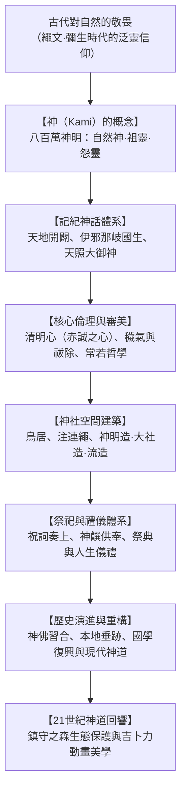

## 序論：無教祖與無聖經的自然泛靈宗教

自日本列島史前時代傳承至今的「神道（Shinto）」，顛覆了傳統世界宗教的定義：它**沒有特定的歷史創教祖師**，**沒有類似《聖經》或《古蘭經》的絕對教條聖典**，也**沒有嚴苛的成文戒律**。

神道不是教條式的信仰，而是一種浸透在日常生活與風土之中的精神感知：**對自然萬物中所蘊含的神聖靈氣（Kami / 神明）抱持深切的敬畏與感恩**。從巍峨的高山、參天古杉、瀑布風雷，到農業作物與先祖亡魂，森羅萬象皆有神明棲息。

面對當代全球生態危機，神道所蘊含的「人非自然支配者而是自然之一環」的謙卑觀、定期拆建新造以維持永恆活力的「常若（Tokowaka）」思想，以及世代守護的「鎮守之森」生態林，正受到國際社會的廣泛矚目。

## 第一章 「神（Kami）」的概念與八百萬神明
江戶時代國學巨擘本居宣長在《古事記傳》中給出了神明的經典定義：
> 「凡凡常所不及之卓越威德、令人畏敬（Kashikoki）之物，皆稱為神。」

神明並非全知全能的上帝，而是包含了：
1. **自然神**：天照大御神（太陽）、月讀命（月亮）、須佐之男（暴風雨與海原）、山川草木。
2. **祖靈與英雄**：各氏族氏神、皇祖神、歷史英雄（德川家康等）。
3. **御靈信仰（安撫怨靈）**：如非命早逝的菅原道真被奉為天滿天神，將怨念轉化為庇護萬民的學問之神。

神明兼具威猛狂暴的「荒魂（Ara-mitama）」與溫和慈愛的「和魂（Nigi-mitama）」。

## 第二章 記紀神話的宇宙劇
《古事記》（712年）與《日本書紀》（720年）勾勒了日本神話體系：
- **天地開闢與伊邪那岐、伊邪那美**：立於天浮橋以天沼矛攪動海水創造淤能碁呂島，繼而產下日本大八島國與諸神。
- **黃泉之行與阿波岐原之禊**：伊邪那美因生火神身亡步入黃泉。伊邪那岐逃回人間後在海水中洗滌黃泉污穢，清洗左眼誕生**天照大御神**，清洗右眼誕生**月讀命**，清洗鼻端誕生**須佐之男命**。
- **天岩戶與出雲神話**：天照因須佐暴行隱入天岩戶，天宇受賣命載歌載舞引諸神歡笑，終迎太陽重現人間。隨後須佐之男斬殺八岐大蛇，其後裔大國主神和平讓國。

## 第三章 倫理與美學：清明心、祓除與常若思想
- **清明心（純淨赤誠之心）**：神道認為人性本如明鏡般純淨，惡並非天生原罪，而是後天沾染的「塵埃（穢氣 / Kegare）」。
- **禊（Misogi）與祓（Harae）**：通過冰涼泉水或海水洗滌身心除去「氣枯」，恢復旺盛生命力。
- **常若（Tokowaka）思想**：神道不追求石造建築的永久不朽，而是通過「老朽則拆除、依原貌重建」的方式實現生命力的永續更新。**伊勢神宮**每二十年進行一次「式年遷宮」，跨越千餘年使神宮永葆二十歲的青春面貌。

## 第四章 神社空間與建築樣式
- **鳥居與結界**：朱紅或木質的鳥居是區分塵世與神域的門戶；注連繩配掛紙垂，辟除不潔。
- **核心建築格局**：
  - **神明造（伊勢神宮）**：脫胎於彌生時代高床穀倉，純木質切妻造，屋脊飾以千木與鰹木，洗練至極。
  - **大社造（出雲大社）**：古代首長宏偉居所的重現，中央立有巨型心御柱。
  - **流造**：屋頂正面如波浪般優美向前延展，是全日本神社最普遍的樣式。

## 第五章 祭祀儀禮與現代生態
祭典遵循嚴格次第：修祓淨身、降神、奉獻神饌（山珍海味米酒）、祝詞奏上、神人和融的直會。
神社周圍保存完好的「鎮守之森」形成了日本獨有的原生林微生態，啟發了現代著名生態學家宮脇昭的原生林造林法。宮崎駿導演的《神隱少女》、《魔法公主》等動畫作品，正是神道泛靈自然觀在全球大放異彩的生動寫照。
