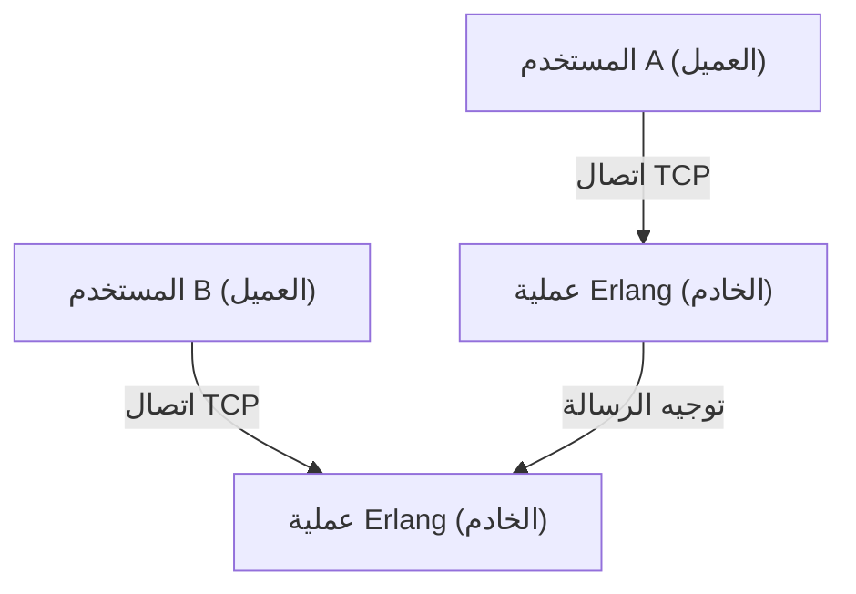
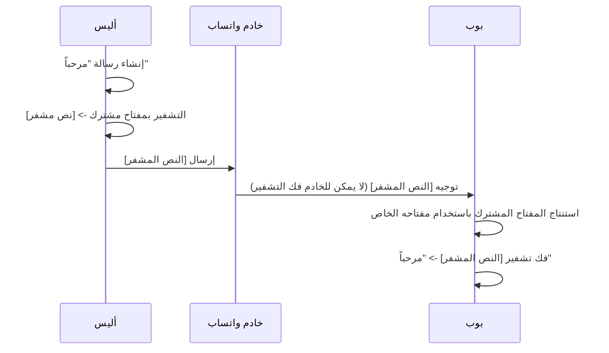

## 1. مقدمة: واتساب كبنية تحتية تربط العالم

في مجتمعنا المعاصر، أصبحت البنية التحتية للاتصالات تحظى بأهمية تعادل أهمية المياه والكهرباء والإنترنت نفسه. وفي هذا السياق، يمكن القول إن واتساب، الذي يضم أكثر من 2 مليار مستخدم نشط حول العالم، قد تجاوز كونه مجرد خدمة لشركة واحدة ليصبح أساساً للاتصالات العالمية.

تأسس واتساب في عام 2009 على يد جان كوم (Jan Koum) وبريان أكتون (Brian Acton)، وبدأ بهدف بسيط يتمثل في أن يكون بديلاً للرسائل النصية القصيرة (SMS). في ذلك الوقت، كانت بيئة اتصالات الهواتف المحمولة تعاني من اختلاف أنظمة تسعير الرسائل القصيرة والقيود على عدد الأحرف من بلد إلى آخر، مما شكل عقبة كبيرة أمام التواصل عبر الحدود. ومن خلال استخدام اتصال الإنترنت، أزال واتساب هذه القيود ووفر بيئة تتيح "لأي شخص، وفي أي مكان، ومجاناً" إرسال واستقبال الرسائل.

في هذه المقالة، سنتعمق في استكشاف أسباب الانتشار الواسع لواتساب، وفلسفة "البساطة" التي تكمن في جوهره، وآلية "التشفير من طرف إلى طرف (End-to-End Encryption, E2EE)" التي تعتبر الركيزة التقنية الأكبر التي تدعم واتساب حالياً، وذلك من خلال تسليط الضوء على الخلفية التقنية والتاريخية.

## 2. "البساطة" و"لا للإعلانات" كفلسفة

عند الحديث عن نجاح واتساب، لا يمكن إغفال الفلسفة القوية لمؤسسيه. فمنذ المراحل الأولى، تبنوا سياسة "لا إعلانات، لا ألعاب، لا حيل (No Ads, No Games, No Gimmicks)". في الوقت الذي كانت فيه العديد من التطبيقات تقدم ميزات معقدة وعناصر ألعاب لجذب انتباه المستخدمين بهدف زيادة عائدات الإعلانات، ركز واتساب حصرياً على "توصيل الرسائل بشكل موثوق".

### 2.1. التبسيط المطلق لواجهة المستخدم

تعتبر واجهة وتجربة المستخدم (UI/UX) في واتساب بسيطة بشكل مذهل. عند فتح التطبيق، لن تجد سوى قائمة الدردشات. وبدلاً من إضافة ميزات جديدة باستمرار، اتخذوا نهجاً يهدف إلى زيادة استقرار وسرعة ميزة المراسلة الأساسية إلى أقصى حد. ترتبط جمالية "التبسيط" هذه مباشرة بالتحسين التقني. فمن خلال التخلص من واجهة المستخدم المعقدة وعمليات الخلفية غير الضرورية، يعمل التطبيق بسلاسة مذهلة حتى على الهواتف الذكية ذات المواصفات المنخفضة وفي بيئات الشبكات غير المستقرة في البلدان الناشئة. وهذا هو أحد الأسباب الرئيسية لانتشاره الهائل في الأسواق الناشئة الضخمة مثل الهند والبرازيل.

### 2.2. تطور نموذج العمل

في البداية، اعتمد واتساب نموذج اشتراك سنوي بقيمة دولار واحد. كان هذا تجسيداً لإيمانهم بأن "المستخدم هو العميل، وليس المنتج". إذا تم اعتماد نموذج الإعلانات، فستكون هناك حاجة لجمع بيانات المستخدمين وتحليلها. انطلقوا من فكرة أن هذا ينتهك الخصوصية ويضر بتجربة المستخدم. حتى بعد أن استحوذت عليها فيسبوك (ميتا حالياً) في عام 2014، تم الحفاظ على هذه السياسة لفترة، ولكن تم تحويل التطبيق لاحقاً إلى مجاني، وأصبح توفير واجهة برمجة التطبيقات (API) للشركات من خلال WhatsApp Business هو المصدر الرئيسي للإيرادات حالياً.

## 3. التقنيات التي تدعم واتساب: Erlang و FreeBSD

تم بناء نظام الواجهة الخلفية لواتساب باستخدام حزمة تقنية فريدة ومثيرة للاهتمام للغاية. في صميم ذلك توجد لغة البرمجة "Erlang" ونظام التشغيل "FreeBSD".

### 3.1. اختيار Erlang: التزامن الفائق والتسامح مع الأخطاء

Erlang هي لغة وظيفية تم تطويرها في الأصل من قبل شركة إريكسون في الثمانينيات لبناء أنظمة الاتصالات مثل مقسمات الهاتف. تم تصميمها بهدف تحقيق "توافر بتسعة تسعات (99.9999999%)"، وتتمتع بقدرة مذهلة على المعالجة المتزامنة حيث يمكنها تنفيذ ملايين العمليات خفيفة الوزن (والتي تختلف عن خيوط نظام التشغيل) في وقت واحد.

واتساب هو نظام يتصل به مئات الملايين من المستخدمين في وقت واحد لإرسال واستقبال الرسائل في الوقت الفعلي. من خلال إدارة اتصال كل مستخدم (مقبس TCP) كعملية Erlang خفيفة الوزن، حقق النظام أداءً استثنائياً في ذلك الوقت، حيث كان قادراً على التعامل مع ملايين الاتصالات المتزامنة على خادم واحد.

### 3.2. اعتماد FreeBSD: تحسين حزمة الشبكة

كان اختيار FreeBSD بدلاً من Linux كنظام تشغيل للخوادم ميزة تقنية أخرى لواتساب في بداياته. يُعرف FreeBSD بحزمة شبكته القوية. قام مهندسو واتساب بضبط معلمات نواة FreeBSD إلى أقصى حد ممكن لزيادة عدد الاتصالات التي يمكن للخادم الواحد التعامل معها.

السبب وراء تمكن فريق صغير من المهندسين النخبة (عشرات الأشخاص) من تشغيل نظام يدعم مئات الملايين من المستخدمين هو أنهم اختاروا التقنيات الأكثر ملاءمة لأهدافهم، وهي Erlang و FreeBSD، وأتقنوا استخدامها بالكامل.

## 4. التشفير من طرف إلى طرف (E2EE): الشكل النهائي للخصوصية

في عام 2016، قدم واتساب التشفير من طرف إلى طرف (E2EE) بشكل افتراضي لجميع المستخدمين النشطين. شكل هذا علامة فارقة بالغة الأهمية في تاريخ أمن المعلومات والخصوصية.

### 4.1. ما هو E2EE؟

التشفير من طرف إلى طرف هو آلية تضمن أن أطراف الاتصال (المرسل والمستقبل) هم فقط من يمكنهم فك تشفير محتوى الرسالة. يتم تشفير الرسالة على جهاز المرسل، وتنتقل عبر الإنترنت في حالتها المشفرة، وتمر عبر خوادم واتساب، لتصل إلى جهاز المستقبل حيث يتم فك تشفيرها لأول مرة.

الأمر المهم هو أنه **من المستحيل رياضياً حتى لخوادم واتساب (أو شركة ميتا التي تديرها) الاطلاع على محتوى الرسائل**. "المفتاح" اللازم لفك التشفير موجود فقط على أجهزة المستخدمين.

### 4.2. اعتماد بروتوكول Signal

يعتمد التشفير من طرف إلى طرف في واتساب على "بروتوكول Signal (Signal Protocol)" الذي طورته Open Whisper Systems (مؤسسة Signal حالياً). يُعتبر بروتوكول Signal أحد أقوى البروتوكولات وأكثرها موثوقية في علم التشفير الحديث.

يكمن جوهر بروتوكول Signal في آلية تُعرف باسم "Double Ratchet Algorithm". وهي آلية تقوم بإنشاء مفتاح تشفير جديد في كل مرة يتم فيها إرسال رسالة.

1. **السرية المسبقة (Forward Secrecy)**: حتى في حالة تسريب مفتاح في وقت معين، لا يمكن فك تشفير الرسائل السابقة.
2. **السرية المستقبلية (Future Secrecy / Post-Compromise Security)**: حتى بعد تسريب المفتاح، يتم إنشاء مفاتيح جديدة في سياق استمرار الاتصال، مما يعيد الأمان للرسائل المستقبلية.

استناداً إلى تشفير المفتاح العام مثل تبادل مفاتيح ديفي-هيلمان (ECDH)، يحافظ النظام على مستوى أمان عالٍ للغاية من خلال التحديث والإلغاء المستمر للمفاتيح لكل جلسة.

### 4.3. البيانات الوصفية وتحديات الخصوصية

على الرغم من أن E2EE يحمي "محتوى" الرسائل بالكامل، إلا أن "البيانات الوصفية" التي تحدد "من تواصل مع من ومتى" ليست مشمولة بالتشفير. يحتفظ واتساب بهذه البيانات الوصفية وقد يتم الكشف عنها بناءً على طلب من وكالات إنفاذ القانون.

أثار المدافعون عن الخصوصية مخاوف بشأن جمع والاحتفاظ بهذه البيانات الوصفية. يميل المستخدمون الذين يسعون للحصول على إخفاء كامل للهوية إلى اختيار تطبيقات مثل Signal، حيث يتم تقليل جمع البيانات الوصفية إلى الحد الأدنى. ومع ذلك، فإن إنجاز واتساب في توفير تشفير قوي من طرف إلى طرف بشكل افتراضي لقاعدة مستخدمين ضخمة تبلغ 2 مليار شخص يحمل أهمية لا تقدر بثمن للمجتمع ككل.

## 5. الأثر الاجتماعي والاقتصادي

كان لانتشار واتساب تأثير هائل على المجتمعات والاقتصادات حول العالم.

### 5.1. إضفاء الطابع الديمقراطي على الاتصالات

في البلدان النامية، يعمل واتساب في كثير من الأحيان كـ "الإنترنت نفسه" في الواقع. أصبح من الممكن إجراء المعاملات التجارية، والتواصل مع العائلة، والحصول على الأخبار دون دفع رسوم الرسائل القصيرة أو المكالمات باهظة الثمن. خاصة في أفريقيا وأمريكا الجنوبية، هناك عدد لا يحصى من الشركات الصغيرة التي تستخدم واتساب لبيع وشراء البضائع وتقديم دعم العملاء، مما يجعله بنية تحتية حيوية للنشاط الاقتصادي.

### 5.2. الهوية الرقمية والمدفوعات

في السنوات الأخيرة، يتجاوز واتساب كونه مجرد تطبيق للمراسلة ليدمج المحافظ الرقمية وميزات الدفع (مثل WhatsApp Pay). تتصدر دول مثل الهند والبرازيل هذا الانتشار، حيث يمكن للمستخدمين تحويل الأموال مباشرة من شاشة الدردشة. من خلال الاستفادة من قاعدة مستخدميه الضخمة، بدأ أيضاً في لعب دور في تعزيز الشمول المالي.

## 6. الخلاصة: تقاطع التكنولوجيا والبشر

تبدو رحلة واتساب بمثابة تجربة كبرى تظهر كيف يمكن للتكنولوجيا أن تعيد تعريف التواصل البشري. تحت فلسفة "البساطة"، يدعم الترافيك لمئات الملايين باستخدام تقنية قوية مثل Erlang، ويحمي الخصوصية الفردية بقوة باستخدام بروتوكول Signal. هذا التوازن الرائع هو السبب وراء نموه ليصبح التطبيق الأكثر استخداماً في العالم.

وراء رسالة "صباح الخير" التي نرسلها كل يوم بشكل عفوي، تعمل تقنيات تشفير متقدمة يمكن اعتبارها حكمة بشرية، ونظام موزع مُحسّن لأقصى حد لتوصيلها إلى جميع أنحاء العالم. يمكن القول إن واتساب هو أحد الروائع المعاصرة التي تمزج بين هندسة البرمجيات وتصميم المنتجات.
