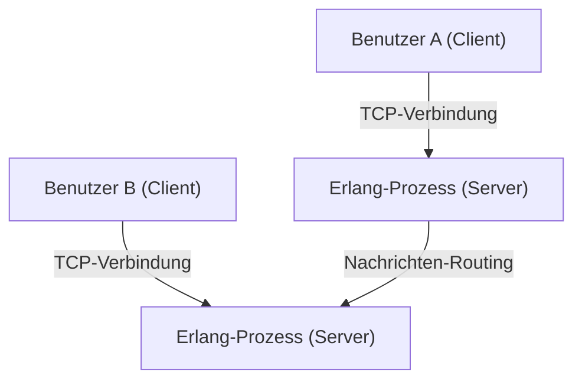
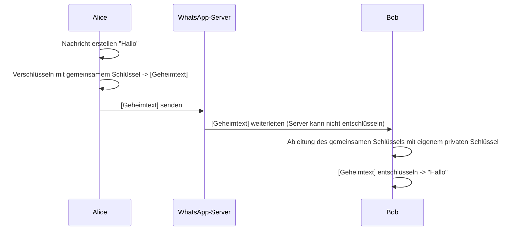

## 1. Einleitung: WhatsApp als Infrastruktur, die die Welt verbindet

In der modernen Gesellschaft ist die Kommunikationsinfrastruktur genauso wichtig geworden wie Wasser, Strom und das Internet selbst. In diesem Zusammenhang kann WhatsApp mit seinen über 2 Milliarden aktiven Nutzern weltweit als mehr als nur ein Dienst eines einzelnen Unternehmens angesehen werden, sondern als Grundlage der globalen Kommunikation.

Gegründet im Jahr 2009 von Jan Koum und Brian Acton, begann WhatsApp mit dem einfachen Ziel, eine Alternative zu SMS zu sein. Das damalige Mobilfunkumfeld war von länderspezifischen SMS-Tarifstrukturen und Zeichenbeschränkungen geprägt, was eine hohe Hürde für die grenzüberschreitende Kommunikation darstellte. Durch die Nutzung von Internetverbindungen beseitigte WhatsApp diese Einschränkungen und schuf eine Umgebung, in der Nachrichten "von jedem, überall und kostenlos" ausgetauscht werden konnten.

In diesem Artikel werden wir tief in die Gründe eintauchen, warum WhatsApp so weit verbreitet ist, in die Philosophie der "Einfachheit", die dem zugrunde liegt, und in den Mechanismus der "Ende-zu-Ende-Verschlüsselung (E2EE)", die derzeit die größte Säule ist, die WhatsApp technisch unterstützt, basierend auf ihrem technischen und historischen Hintergrund.

## 2. "Einfachheit" und "Keine Werbung" als Philosophie

Bei der Erörterung des Erfolgs von WhatsApp darf die starke Philosophie seiner Gründer nicht fehlen. Von Anfang an verfolgten sie die Richtlinie "Keine Werbung, keine Spiele, keine Gimmicks". Zu einer Zeit, als viele Apps komplexe Funktionen und Gamification einführten, um die Aufmerksamkeit der Nutzer zu erregen und die Werbeeinnahmen zu maximieren, konzentrierte sich WhatsApp ausschließlich darauf, "Nachrichten zuverlässig zuzustellen".

### 2.1. Die ultimative Reduzierung der Benutzeroberfläche

Die UI/UX von WhatsApp ist erstaunlich einfach. Wenn man die App öffnet, gibt es nur eine Chat-Liste. Anstatt eine neue Funktion nach der anderen hinzuzufügen, haben sie den Ansatz gewählt, die Stabilität und Geschwindigkeit der Kern-Messaging-Funktionen aufs Äußerste zu maximieren. Diese Ästhetik der "Reduzierung" ist auch direkt mit der technischen Optimierung verbunden. Durch den Verzicht auf komplexe UIs und unnötige Hintergrundverarbeitung funktioniert es erstaunlich reibungslos, selbst auf leistungsschwachen Smartphones und in Netzwerkumgebungen mit instabilen Kommunikationsleitungen in Schwellenländern. Dies ist einer der Hauptgründe für die explosionsartige Verbreitung in riesigen Schwellenmärkten wie Indien und Brasilien.

### 2.2. Wandel des Geschäftsmodells

Anfangs nutzte WhatsApp ein Abonnementmodell von 1 US-Dollar pro Jahr. Dies war Ausdruck ihrer Überzeugung, dass "der Nutzer der Kunde ist, nicht das Produkt". Die Einführung eines werbefinanzierten Modells würde erfordern, Benutzerdaten zu sammeln und zu analysieren. Dies basierte auf der Idee, dass dies die Privatsphäre verletzen und das Benutzererlebnis beeinträchtigen würde. Auch nach der Übernahme durch Facebook (heute Meta) im Jahr 2014 wurde diese Richtlinie eine Zeit lang beibehalten, aber später wurde es kostenlos, und derzeit ist die Bereitstellung von APIs für Unternehmen über WhatsApp Business die Haupteinnahmequelle.

## 3. Die Technologie hinter WhatsApp: Erlang und FreeBSD

Das Backend-System von WhatsApp ist mit einem sehr einzigartigen und interessanten Technologie-Stack aufgebaut. Den Kern bilden die Programmiersprache "Erlang" und das Betriebssystem "FreeBSD".

### 3.1. Die Wahl von Erlang: Ultra-hohe Nebenläufigkeit und Fehlertoleranz

Erlang ist eine funktionale Programmiersprache, die ursprünglich in den 1980er Jahren von Ericsson entwickelt wurde, um Kommunikationssysteme wie Telefonzentralen zu bauen. Sie wurde mit dem Ziel entwickelt, eine "Verfügbarkeit von neun Neunen (99,9999999%)" zu erreichen, und verfügt über eine erstaunliche Nebenläufigkeit, die es ihr ermöglicht, Millionen von leichtgewichtigen Prozessen (anders als OS-Threads) gleichzeitig auszuführen.

WhatsApp ist ein System, bei dem sich Hunderte von Millionen von Benutzern gleichzeitig verbinden und Nachrichten in Echtzeit senden und empfangen. Durch die Verwaltung der Verbindung jedes Benutzers (TCP-Socket) als leichtgewichtigen Erlang-Prozess erreichte das System eine für die damalige Zeit außergewöhnliche Leistung, indem es Millionen von gleichzeitigen Verbindungen auf einem einzigen Server verarbeitete.

### 3.2. Die Einführung von FreeBSD: Optimierung des Netzwerk-Stacks

Die Wahl von FreeBSD anstelle von Linux als Server-Betriebssystem war ebenfalls ein frühes technisches Merkmal von WhatsApp. FreeBSD ist bekannt für seinen robusten Netzwerk-Stack. Die Ingenieure von WhatsApp haben die Kernel-Parameter von FreeBSD extrem optimiert, um die Anzahl der Verbindungen zu maximieren, die ein einzelner Server verarbeiten kann.

Eine kleine Elite von Ingenieuren (einige Dutzend) war in der Lage, ein System zu betreiben, das Hunderte von Millionen von Benutzern unterstützte, weil sie die Technologien auswählten, die am besten zu ihren Zielen passten, Erlang und FreeBSD, und diese umfassend beherrschten.

## 4. Ende-zu-Ende-Verschlüsselung (E2EE): Die ultimative Form der Privatsphäre

Im Jahr 2016 führte WhatsApp die Ende-zu-Ende-Verschlüsselung (E2EE) standardmäßig für alle aktiven Benutzer ein. Dies markierte einen äußerst wichtigen Meilenstein in der Geschichte der Informationssicherheit und Privatsphäre.

### 4.1. Was ist E2EE?

Ende-zu-Ende-Verschlüsselung ist ein Mechanismus, bei dem nur die kommunizierenden Parteien (Absender und Empfänger) den Inhalt der Nachricht entschlüsseln können. Die Nachricht wird auf dem Gerät des Absenders verschlüsselt, reist in verschlüsselter Form durch das Internet, passiert die Server von WhatsApp, erreicht das Gerät des Empfängers und wird erst dort entschlüsselt.

Das Wichtigste ist, **dass es mathematisch unmöglich ist, den Inhalt der Nachrichten zu sehen, selbst für die WhatsApp-Server (oder Meta, das Unternehmen, das sie betreibt)**. Der "Schlüssel" zum Entschlüsseln existiert nur auf den Geräten der Benutzer.

### 4.2. Die Einführung des Signal-Protokolls

Die E2EE von WhatsApp verwendet das von Open Whisper Systems (jetzt Signal Foundation) entwickelte "Signal-Protokoll". Das Signal-Protokoll gilt als eines der robustesten und zuverlässigsten Protokolle in der modernen Kryptographie.

Der Kern des Signal-Protokolls liegt in einem Mechanismus, der "Double Ratchet Algorithm" genannt wird. Dies ist ein System, das jedes Mal, wenn eine Nachricht gesendet wird, einen neuen kryptographischen Schlüssel generiert.

1. **Forward Secrecy (Folgenlosigkeit)**: Selbst im unwahrscheinlichen Fall, dass ein Schlüssel zu einem bestimmten Zeitpunkt kompromittiert wird, können frühere Nachrichten aus der Vergangenheit nicht entschlüsselt werden.
2. **Future Secrecy / Post-Compromise Security (Zukünftige Sicherheit)**: Selbst nachdem ein Schlüssel kompromittiert wurde, wird die Sicherheit zukünftiger Nachrichten wiederhergestellt, da im weiteren Verlauf der Kommunikation neue Schlüssel generiert werden.

Basierend auf der Public-Key-Kryptographie wie dem Diffie-Hellman-Schlüsselaustausch (ECDH) hält es ein extrem hohes Sicherheitsniveau aufrecht, indem Schlüssel für jede Sitzung ständig aktualisiert und verworfen werden.

### 4.3. Metadaten und Datenschutzbedenken

Während der "Inhalt (Content)" von Nachrichten durch E2EE vollständig geschützt ist, unterliegen "Metadaten" wie "Wer hat wann mit wem kommuniziert" nicht der Verschlüsselung. WhatsApp speichert diese Metadaten und kann sie auf Anfrage von Strafverfolgungsbehörden offenlegen.

Datenschützer haben ebenfalls Bedenken hinsichtlich der Sammlung und Speicherung dieser Metadaten geäußert. Benutzer, die völlige Anonymität suchen, tendieren dazu, Apps wie Signal zu wählen, bei denen die Sammlung von Metadaten auf ein Minimum reduziert ist. Aber die Leistung von WhatsApp, standardmäßig starke E2EE für eine riesige Nutzerbasis von 2 Milliarden Menschen bereitzustellen, ist für die Gesellschaft als Ganzes von unschätzbarem Wert.

## 5. Soziale und wirtschaftliche Auswirkungen

Die Verbreitung von WhatsApp hat tiefgreifende Auswirkungen auf Gesellschaften und Wirtschaften weltweit.

### 5.1. Demokratisierung der Kommunikation

In Entwicklungsländern fungiert WhatsApp oft als das De-facto-"Internet selbst". Geschäftliche Transaktionen, die Kommunikation mit der Familie und der Erhalt von Nachrichten sind ohne teure SMS- oder Anrufgebühren möglich geworden. Besonders in Afrika und Südamerika gibt es unzählige kleine Unternehmen, die Waren kaufen und verkaufen und Kundenservice über WhatsApp anbieten, was es zu einer wesentlichen Infrastruktur für die wirtschaftliche Aktivität macht.

### 5.2. Digitale Identität und Zahlungen

In den letzten Jahren hat sich WhatsApp über reine Messaging-Dienste hinausbewegt, um digitale Geldbörsen und Zahlungsfunktionen (wie WhatsApp Pay) zu integrieren. Diese Entwicklung ist in Ländern wie Indien und Brasilien am weitesten fortgeschritten, wo Benutzer Geld direkt aus dem Chat-Bildschirm senden können. Es beginnt auch eine Rolle bei der Förderung der finanziellen Inklusion zu spielen, indem es seine riesige Nutzerbasis nutzt.

## 6. Fazit: Die Schnittstelle von Technologie und Menschheit

Die Reise von WhatsApp scheint ein großes Experiment zu sein, das zeigt, wie Technologie die menschliche Kommunikation neu definieren kann. Unter der Philosophie der "Einfachheit" unterstützt es den Traffic von Hunderten von Millionen von Benutzern mit robusten Technologien wie Erlang und schützt die persönliche Privatsphäre mit dem Signal-Protokoll stark. Diese feine Balance ist der Grund, warum es sich zur meistgenutzten App der Welt entwickelt hat.

Hinter der "Guten Morgen"-Nachricht, die wir jeden Tag beiläufig senden, arbeitet ein hochoptimiertes verteiltes System, das es auf der ganzen Welt zustellt, unterstützt von fortschrittlicher kryptographischer Technologie, die man als menschliche Weisheit bezeichnen kann. WhatsApp kann als eines der Meisterwerke der heutigen Zeit angesehen werden, in dem Software-Engineering und Produktdesign verschmelzen.
