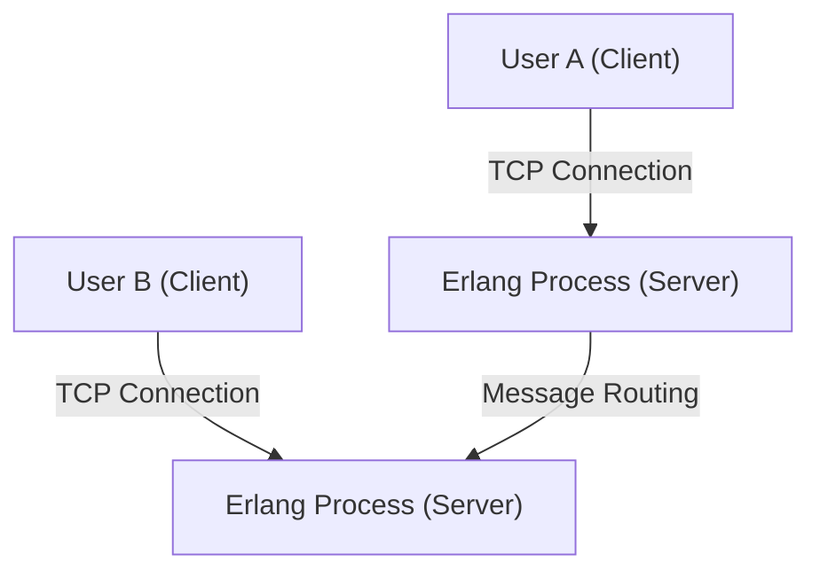
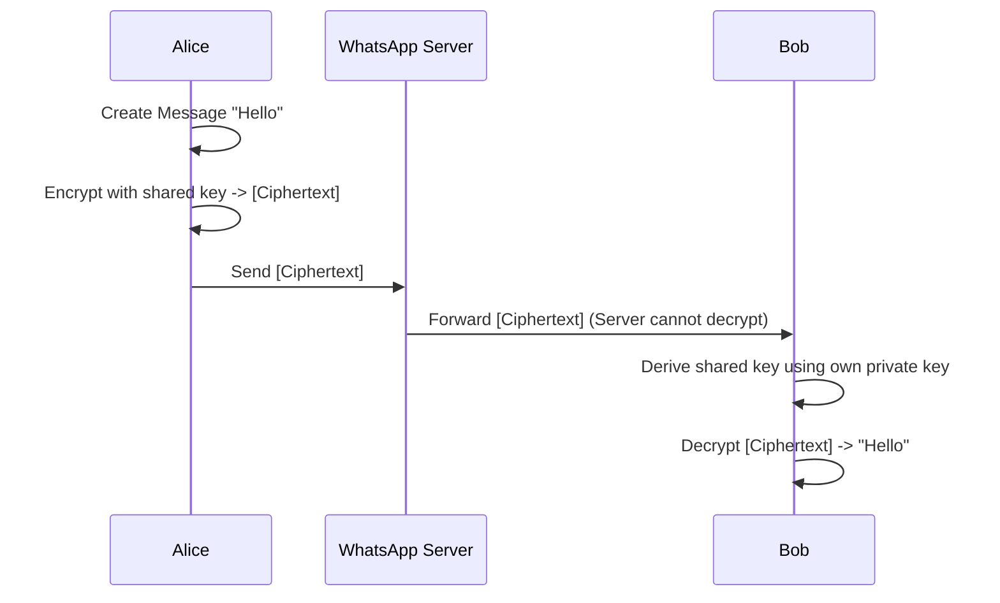

## 1. Introduction: WhatsApp as an Infrastructure Connecting the World

In modern society, communication infrastructure has become as important as water, electricity, and the internet itself. Among these, WhatsApp, with over 2 billion active users worldwide, has transcended being just a single company's service to become the foundation of global communication.

Founded in 2009 by Jan Koum and Brian Acton, WhatsApp started with the simple goal of being an alternative to SMS. At the time, mobile communication environments had different SMS pricing structures and character limits for each country, creating high hurdles for cross-border communication. By using internet connections, WhatsApp removed these constraints and realized an environment where "anyone, anywhere, for free" could exchange messages.

In this article, we will delve deeply into why WhatsApp has become so widespread, the philosophy of "simplicity" at its core, and the mechanism of "End-to-End Encryption (E2EE)," which is the greatest technical pillar supporting current WhatsApp, while considering its technical and historical background.

## 2. "Simplicity" and "No Ads" as a Philosophy

When talking about WhatsApp's success, the strong philosophy of its founders is essential. From the early stages, they upheld the policy of "No Ads, No Games, No Gimmicks." While many apps at the time introduced complex features and gamification to attract users' attention and maximize ad revenue, WhatsApp focused solely on "delivering messages reliably."

### 2.1. The Ultimate Trimming of the User Interface

WhatsApp's UI/UX is surprisingly simple. When you open the app, there is only the chat list. Instead of adding new features one after another, they took an approach to maximize the stability and speed of the core messaging functionality to the utmost limit. This aesthetic of "trimming" directly ties into technical optimization. By eliminating complex UI and unnecessary background processing, it operates surprisingly smoothly even on low-spec smartphones and in network environments of emerging countries with unstable connections. This is one of the biggest reasons it exploded in popularity in huge emerging markets like India and Brazil.

### 2.2. Transition of the Business Model

Initially, WhatsApp adopted a subscription model of $1 per year. This was a manifestation of their belief that "users are customers, not the product." Adopting an advertising model would require collecting and analyzing user data. This was based on the idea that it would invade privacy and impair the user experience. Even after being acquired by Facebook (now Meta) in 2014, this policy was maintained for a while, but it was later made free, and currently, providing APIs for enterprises through WhatsApp Business is the main source of revenue.

## 3. Technologies Supporting WhatsApp: Erlang and FreeBSD

WhatsApp's backend system is built with a very unique and interesting technology stack. The core of it is the programming language "Erlang" and the operating system "FreeBSD."

### 3.1. The Choice of Erlang: Ultra-High Concurrency and Fault Tolerance

Erlang is a functional programming language originally developed in the 1980s by Ericsson to build communication systems such as telephone exchanges. It was designed with the goal of achieving "nine 9s (99.9999999%) availability" and has astonishing concurrent processing capabilities, able to simultaneously execute lightweight processes (different from OS threads) in the millions.

WhatsApp is a system where hundreds of millions of users connect simultaneously to send and receive messages in real time. By managing each user's connection (TCP socket) as an Erlang lightweight process, a single server processed millions of concurrent connections, achieving out-of-the-box performance for its time.

### 3.2. Adoption of FreeBSD: Optimization of the Network Stack

Choosing FreeBSD instead of Linux as the server OS was also a technical characteristic of early WhatsApp. FreeBSD is known for its robust network stack. WhatsApp's engineers tuned the kernel parameters of FreeBSD to the extreme to maximize the number of connections that could be processed by a single server.

The reason a small team of elite engineers (dozens of people) could operate a system supporting hundreds of millions of users was because they selected technologies—Erlang and FreeBSD—that best suited their goals and mastered them thoroughly.

## 4. End-to-End Encryption (E2EE): The Ultimate Form of Privacy

In 2016, WhatsApp introduced End-to-End Encryption (E2EE) by default for all active users. This became a crucial milestone in the history of information security and privacy.

### 4.1. What is E2EE?

End-to-end encryption is a mechanism where only the communicating parties (sender and receiver) can decrypt the contents of a message. The message is encrypted on the sender's device, travels through the internet in an encrypted state, passes through WhatsApp's servers, and arrives at the receiver's device, where it is decrypted for the first time.

The important point is that **it is mathematically impossible even for WhatsApp's servers (or the Meta company operating them) to see the content of the message**. The "key" to decrypt the cipher exists only on the users' devices.

### 4.2. Adoption of the Signal Protocol

WhatsApp's E2EE adopts the "Signal Protocol" developed by Open Whisper Systems (now Signal Foundation). The Signal Protocol is evaluated as one of the most robust and reliable protocols in modern cryptography.

The core of the Signal Protocol lies in a mechanism called the "Double Ratchet Algorithm." This is a mechanism that generates a new encryption key every time a message is sent.

1. **Forward Secrecy**: Even if a key at a certain point in time is compromised, past messages before that will not be decrypted.
2. **Future Secrecy (Post-Compromise Security)**: Even after a key is compromised, new keys are generated in the process of continuing communication, so the safety of future messages is restored.

Based on public-key cryptography such as Diffie-Hellman key exchange (ECDH), it maintains an extremely high level of security by constantly updating and discarding keys for each session.

### 4.3. Metadata and Privacy Challenges

Although the "content" of the message is fully protected by E2EE, "metadata" such as "who communicated with whom and when" is not subject to encryption. WhatsApp retains this metadata and may disclose it based on requests from law enforcement agencies.

Privacy advocates have pointed out concerns about the collection and retention of this metadata. Users seeking complete anonymity tend to choose apps like Signal, where metadata collection is also minimized. However, providing strong E2EE by default to a massive user base of 2 billion people is an immeasurable achievement by WhatsApp for society as a whole.

## 5. Social and Economic Impact

The spread of WhatsApp has had a massive impact on society and the economy worldwide.

### 5.1. Democratization of Communication

In developing countries, WhatsApp often functions essentially as "the internet itself." It has made it possible to conduct business exchanges, contact family, and get news without paying expensive SMS or call charges. Especially in Africa and South America, there are countless small businesses that buy and sell products and provide customer support through WhatsApp, making it a critical infrastructure for economic activity.

### 5.2. Digital Identity and Payments

In recent years, WhatsApp has been advancing the integration of digital wallets and payment features (such as WhatsApp Pay) beyond mere messaging. Deployments in India and Brazil are leading the way, allowing users to send money directly from the chat screen. Leveraging its massive user base, it is also beginning to play a role in promoting financial inclusion.

## 6. Conclusion: The Intersection of Technology and Humanity

WhatsApp's journey is like a grand experiment showing how technology can redefine human communication. Under the philosophy of "simplicity," it supports the traffic of hundreds of millions of people with robust technologies like Erlang, and strongly protects individual privacy with the Signal Protocol. That exquisite balance is exactly why it has grown into the most used app in the world.

Behind the "good morning" messages we casually send every day, there runs advanced cryptographic technology that could be called the wisdom of humanity, and a highly optimized distributed system to deliver it worldwide. WhatsApp can be said to be one of the modern masterpieces where software engineering and product design have converged.
