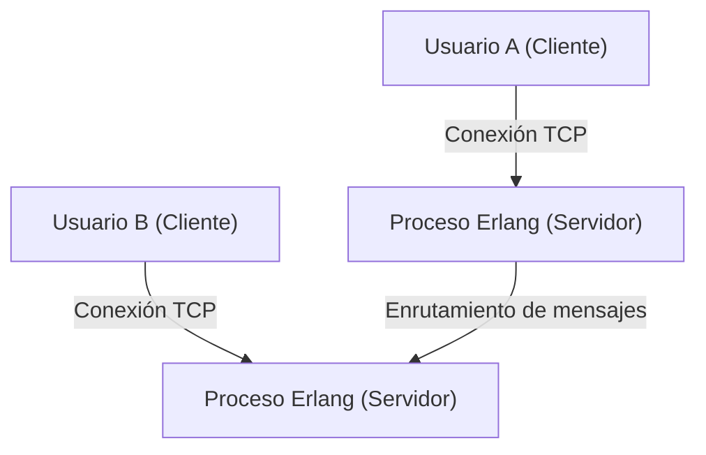
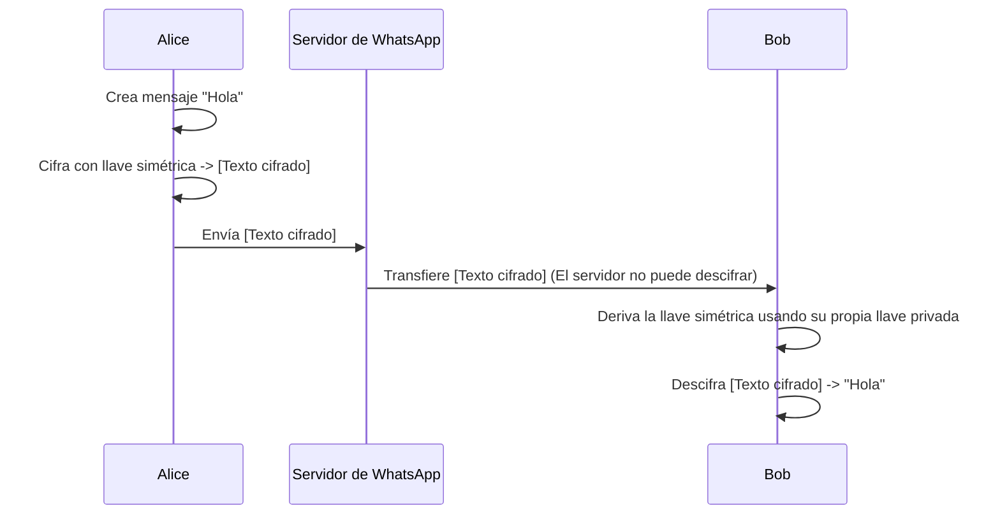

## 1. Introducción: WhatsApp como infraestructura que conecta al mundo

En la sociedad actual, la infraestructura de comunicación se ha vuelto tan importante como el suministro de agua, la electricidad o el propio Internet. En este contexto, WhatsApp, que cuenta con más de 2 mil millones de usuarios activos en todo el mundo, va más allá de ser simplemente un servicio corporativo, y puede considerarse el núcleo de la comunicación global.

Fundada en 2009 por Jan Koum y Brian Acton, WhatsApp comenzó con el simple objetivo de ser una alternativa a los SMS. En aquel entonces, el entorno de las comunicaciones móviles tenía diferentes estructuras de precios para SMS y límites de caracteres en cada país, lo que representaba un gran obstáculo para la comunicación transfronteriza. Al utilizar la conexión a Internet, WhatsApp eliminó estas restricciones y creó un entorno en el que "cualquiera, en cualquier lugar y de forma gratuita" podía intercambiar mensajes.

En este artículo, profundizaremos en por qué WhatsApp se ha vuelto tan popular, la filosofía de "simplicidad" que la sustenta, y el mecanismo de "Cifrado de extremo a extremo (E2EE)", que es el pilar tecnológico más grande que soporta el WhatsApp actual, teniendo en cuenta sus antecedentes técnicos e históricos.

## 2. La "simplicidad" y el "sin anuncios" como filosofía

Al hablar del éxito de WhatsApp, es indispensable mencionar la fuerte filosofía de sus fundadores. Desde las primeras etapas, adoptaron la política de "Sin anuncios, sin juegos, sin trucos (No Ads, No Games, No Gimmicks)". Mientras que muchas aplicaciones de la época introducían funciones complejas y gamificación para captar la atención del usuario y maximizar los ingresos por publicidad, WhatsApp se enfocó únicamente en "entregar mensajes de manera confiable".

### 2.1. Reducción extrema de la interfaz de usuario

La UI/UX de WhatsApp es sorprendentemente simple. Al abrir la aplicación, solo encontrarás la lista de chats. En lugar de agregar nuevas funciones una tras otra, adoptaron un enfoque de maximizar la estabilidad y la velocidad de la función principal de mensajería al extremo. Esta estética de "reducción" también está directamente relacionada con la optimización técnica. Al eliminar interfaces complejas y procesos en segundo plano innecesarios, funciona de manera sorprendentemente fluida incluso en teléfonos inteligentes de bajas especificaciones o en entornos de red inestables de países emergentes. Esta es una de las principales razones por las que explotó en popularidad en mercados emergentes gigantes como India y Brasil.

### 2.2. Evolución del modelo de negocio

Inicialmente, WhatsApp adoptó un modelo de suscripción de 1 dólar al año. Esta era una manifestación de su creencia de que "el usuario es el cliente, no el producto". Si adoptaran un modelo de publicidad, surgiría la necesidad de recopilar y analizar los datos de los usuarios. Consideraban que esto violaba la privacidad y perjudicaba la experiencia del usuario. Incluso después de ser adquirida por Facebook (ahora Meta) en 2014, esta política se mantuvo por un tiempo, pero posteriormente se hizo gratuita, y actualmente su principal fuente de ingresos es la provisión de API para empresas a través de WhatsApp Business.

## 3. La tecnología detrás de WhatsApp: Erlang y FreeBSD

El sistema de backend de WhatsApp está construido sobre un stack tecnológico muy único e interesante. El núcleo de esto es el lenguaje de programación "Erlang" y el sistema operativo "FreeBSD".

### 3.1. Elección de Erlang: Concurrencia ultra alta y tolerancia a fallos

Erlang es un lenguaje funcional desarrollado originalmente en la década de 1980 por Ericsson para construir sistemas de telecomunicaciones como centrales telefónicas. Fue diseñado con el objetivo de lograr una disponibilidad de "nueve nueves (99.9999999%)", y tiene una capacidad de procesamiento concurrente asombrosa, pudiendo ejecutar millones de procesos ligeros (diferentes de los hilos del sistema operativo) simultáneamente.

WhatsApp es un sistema donde cientos de millones de usuarios se conectan simultáneamente y envían/reciben mensajes en tiempo real. Al gestionar la conexión de cada usuario (socket TCP) como un proceso ligero de Erlang, lograron un rendimiento sin precedentes en ese momento: manejar millones de conexiones simultáneas en un solo servidor.

### 3.2. Adopción de FreeBSD: Optimización de la pila de red

Elegir FreeBSD en lugar de Linux como sistema operativo del servidor también fue una característica técnica del WhatsApp temprano. FreeBSD es conocido por su robusta pila de red. Los ingenieros de WhatsApp ajustaron al máximo los parámetros del kernel de FreeBSD y maximizaron la cantidad de conexiones que podía manejar un solo servidor.

El hecho de que un pequeño equipo de ingenieros de élite (unas pocas docenas de personas) pudiera operar un sistema que soporta a cientos de millones de usuarios, se debe a que eligieron la tecnología que mejor se adaptaba a su propósito, Erlang y FreeBSD, y la dominaron por completo.

## 4. Cifrado de extremo a extremo (E2EE): La forma definitiva de privacidad

En 2016, WhatsApp introdujo el cifrado de extremo a extremo (E2EE) por defecto para todos los usuarios activos. Este se convirtió en un hito extremadamente importante en la historia de la seguridad de la información y la privacidad.

### 4.1. ¿Qué es E2EE?

El cifrado de extremo a extremo es un sistema donde solo las partes involucradas en la comunicación (remitente y destinatario) pueden descifrar el contenido del mensaje. El mensaje se cifra en el dispositivo del remitente, viaja a través de Internet en su estado cifrado, pasa por los servidores de WhatsApp, y llega al dispositivo del destinatario, donde finalmente se descifra.

Lo importante es que **es matemáticamente imposible ver el contenido del mensaje, incluso para los servidores de WhatsApp (o la empresa Meta que los opera)**. La "llave" para descifrar el código solo existe en los dispositivos de los usuarios.

### 4.2. Adopción de Signal Protocol

El E2EE de WhatsApp utiliza el "Signal Protocol" desarrollado por Open Whisper Systems (actualmente Signal Foundation). Signal Protocol es evaluado como uno de los protocolos más robustos y confiables en la criptografía moderna.

El núcleo de Signal Protocol reside en un mecanismo llamado "Double Ratchet Algorithm". Este es un sistema que genera una nueva clave de cifrado cada vez que se envía un mensaje.

1. **Secreto hacia adelante (Forward Secrecy)**: Incluso en el caso poco probable de que se filtre la clave en un momento dado, los mensajes pasados anteriores a eso no podrán ser descifrados.
2. **Secreto futuro (Future Secrecy / Post-Compromise Security)**: Incluso después de que se filtre una clave, dado que se generan nuevas claves en el proceso de continuar la comunicación, se recupera la seguridad de los mensajes futuros.

Al basarse en métodos de criptografía de clave pública como el intercambio de claves Diffie-Hellman (ECDH) y actualizar y destruir constantemente las claves para cada sesión, mantiene un nivel de seguridad extremadamente alto.

### 4.3. Desafíos de los metadatos y la privacidad

Aunque el "contenido" del mensaje está completamente protegido por E2EE, los "metadatos" sobre "quién se comunicó con quién y cuándo" quedan fuera del alcance del cifrado. WhatsApp conserva estos metadatos y puede divulgarlos en función de solicitudes de las fuerzas del orden.

Los defensores de la privacidad también han señalado preocupaciones sobre la recopilación y retención de estos metadatos. Los usuarios que buscan un anonimato total tienden a elegir aplicaciones como Signal, donde la recopilación de metadatos también se mantiene al mínimo. Sin embargo, el logro de WhatsApp de proporcionar un poderoso E2EE de forma predeterminada a una base de usuarios gigante de 2 mil millones de personas es incalculable cuando se ve desde la perspectiva de la sociedad en general.

## 5. Impacto social y económico

La popularización de WhatsApp ha tenido un profundo impacto en las sociedades y economías de todo el mundo.

### 5.1. Democratización de la comunicación

En los países en desarrollo, a menudo hay casos en los que WhatsApp funciona de facto como "Internet mismo". Ha hecho posible realizar negocios, contactar con la familia, obtener noticias, etc., sin pagar costosas tarifas de SMS o llamadas. Particularmente en África y América del Sur, existen innumerables pequeñas empresas que compran y venden productos o brindan atención al cliente a través de WhatsApp, convirtiéndose en una infraestructura vital para la actividad económica.

### 5.2. Identidad digital y pagos

En los últimos años, WhatsApp ha avanzado en la integración de billeteras digitales y funciones de pago (como WhatsApp Pay), yendo más allá de la simple mensajería. Este despliegue ha sido pionero en países como India y Brasil, donde los usuarios pueden enviar dinero directamente desde la pantalla de chat. Aprovechando su enorme base de usuarios, también está comenzando a desempeñar un papel en la promoción de la inclusión financiera.

## 6. Conclusión: La encrucijada entre tecnología y humanidad

El viaje de WhatsApp parece ser un gran experimento que muestra cómo la tecnología puede redefinir la comunicación humana. Bajo la filosofía de la "simplicidad", soporta el tráfico de cientos de millones de personas con tecnologías robustas como Erlang, y protege fuertemente la privacidad personal con el Signal Protocol. Ese exquisito equilibrio es precisamente la razón por la que se ha convertido en la aplicación más utilizada en el mundo.

Detrás del mensaje de "buenos días" que enviamos casualmente todos los días, se encuentra operando una tecnología de cifrado avanzada, que podría llamarse la sabiduría de la humanidad, y un sistema distribuido optimizado al límite para entregarla a todo el mundo. Se puede decir que WhatsApp es una de las obras maestras modernas donde se fusionan la ingeniería de software y el diseño de productos.
