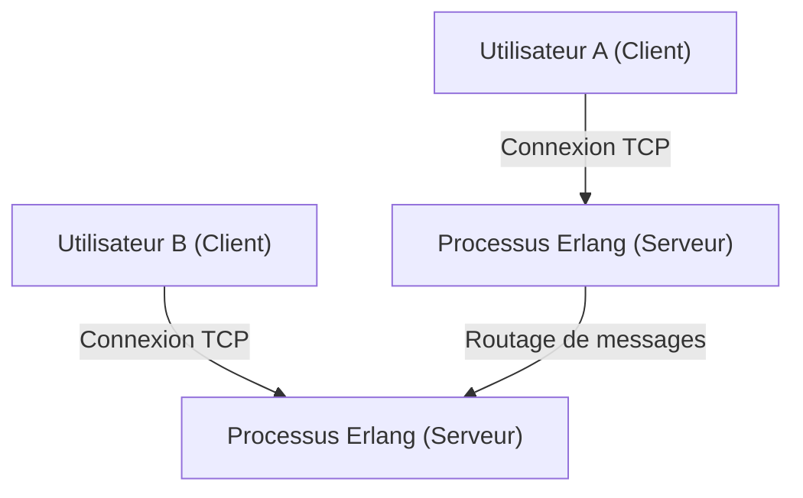
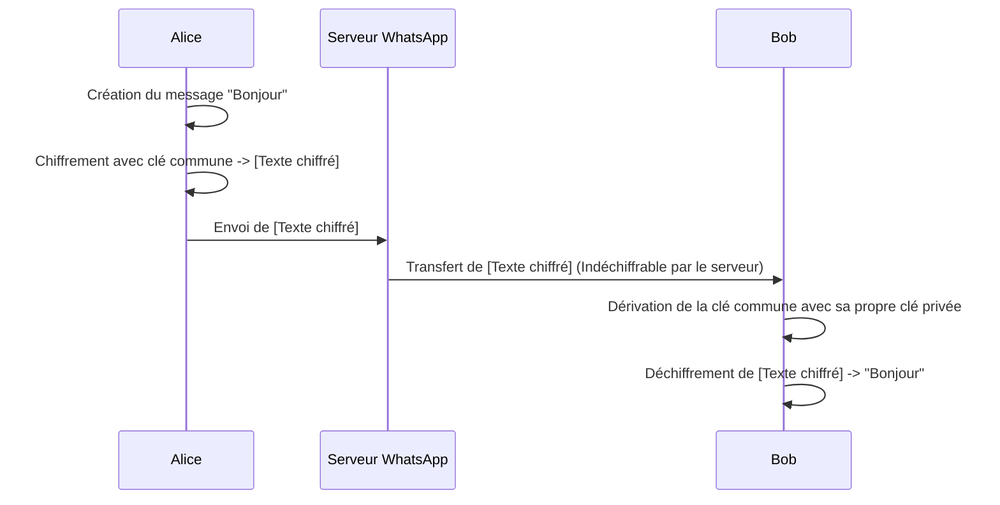

## 1. Introduction : WhatsApp, une infrastructure reliant le monde

Dans la société moderne, l'infrastructure de communication est devenue aussi importante que l'eau, l'électricité ou Internet lui-même. Dans ce contexte, WhatsApp, avec plus de 2 milliards d'utilisateurs actifs dans le monde, a dépassé le stade de simple service d'entreprise pour devenir le fondement de la communication mondiale.

Fondée en 2009 par Jan Koum et Brian Acton, WhatsApp a commencé avec un objectif simple : être une alternative aux SMS. À l'époque, les communications mobiles présentaient des tarifs de SMS et des limites de caractères variables selon les pays, créant d'importants obstacles à la communication transfrontalière. En utilisant la connexion Internet, WhatsApp a éliminé ces contraintes et créé un environnement où les messages peuvent être échangés « par n'importe qui, n'importe où, gratuitement ».

Cet article explore en profondeur pourquoi WhatsApp est devenu si populaire, la philosophie de « simplicité » à sa base, et la plus grande prouesse technologique qui soutient le WhatsApp d'aujourd'hui, le mécanisme de « Chiffrement de bout en bout (End-to-End Encryption, E2EE) », en tenant compte de son contexte technique et historique.

## 2. La « simplicité » et le « sans publicité » comme philosophie

Pour expliquer le succès de WhatsApp, la philosophie forte de ses fondateurs est indispensable. Dès le début, ils ont adopté la politique « Pas de publicités, pas de jeux, pas de gadgets (No Ads, No Games, No Gimmicks) ». Alors que de nombreuses applications de l'époque introduisaient des fonctionnalités complexes et de la ludification pour capter l'attention des utilisateurs et maximiser les revenus publicitaires, WhatsApp s'est concentré exclusivement sur le fait de « délivrer les messages de manière fiable ».

### 2.1. L'épurement extrême de l'interface utilisateur

L'UI/UX de WhatsApp est incroyablement simple. Lorsque vous ouvrez l'application, il n'y a que la liste des discussions. Plutôt que d'ajouter constamment de nouvelles fonctionnalités, ils ont choisi d'optimiser à l'extrême la stabilité et la vitesse de la fonction principale de messagerie. Cette esthétique de « l'épurement » est directement liée à l'optimisation technique. En éliminant les interfaces complexes et les processus d'arrière-plan inutiles, l'application fonctionne de manière étonnamment fluide même sur des smartphones peu performants ou dans des pays émergents où la connexion réseau est instable. C'est l'une des principales raisons de son adoption explosive sur de vastes marchés émergents comme l'Inde et le Brésil.

### 2.2. L'évolution du modèle économique

Initialement, WhatsApp a adopté un modèle d'abonnement à 1 dollar par an. C'était la manifestation de leur conviction que « l'utilisateur est le client, pas le produit ». Adopter un modèle publicitaire nécessite de collecter et d'analyser les données des utilisateurs, ce qui, selon eux, viole la confidentialité et nuit à l'expérience utilisateur. Même après l'acquisition par Facebook (maintenant Meta) en 2014, cette politique a été maintenue un certain temps, avant de devenir gratuite, et aujourd'hui la principale source de revenus provient de la fourniture d'API aux entreprises via WhatsApp Business.

## 3. La technologie derrière WhatsApp : Erlang et FreeBSD

Le système backend de WhatsApp est construit avec une pile technologique très unique et intéressante. Au cœur de celle-ci se trouvent le langage de programmation « Erlang » et le système d'exploitation « FreeBSD ».

### 3.1. Le choix d'Erlang : Hyper-concurrence et tolérance aux pannes

Erlang est un langage fonctionnel développé à l'origine dans les années 1980 par Ericsson pour construire des systèmes de communication tels que les commutateurs téléphoniques. Conçu avec l'objectif d'atteindre « neuf 9 (99,9999999%) de disponibilité », il possède une capacité de traitement concurrent phénoménale, capable d'exécuter simultanément des millions de processus légers (différents des threads du système d'exploitation).

WhatsApp est un système où des centaines de millions d'utilisateurs se connectent simultanément et envoient/reçoivent des messages en temps réel. En gérant la connexion de chaque utilisateur (socket TCP) comme un processus léger Erlang, ils ont atteint une performance hors norme pour l'époque : gérer des millions de connexions simultanées sur un seul serveur.

### 3.2. L'adoption de FreeBSD : Optimisation de la pile réseau

Le choix de FreeBSD plutôt que Linux comme système d'exploitation de serveur était également une caractéristique technique des débuts de WhatsApp. FreeBSD est connu pour sa pile réseau robuste. Les ingénieurs de WhatsApp ont optimisé les paramètres du noyau FreeBSD à l'extrême pour maximiser le nombre de connexions qu'un seul serveur pouvait gérer.

Si une petite équipe d'ingénieurs d'élite (quelques dizaines de personnes) a pu exploiter un système soutenant des centaines de millions d'utilisateurs, c'est parce qu'ils ont choisi les technologies les plus adaptées à leurs objectifs, Erlang et FreeBSD, et les ont maîtrisées à la perfection.

## 4. Le chiffrement de bout en bout (E2EE) : La forme ultime de la confidentialité

En 2016, WhatsApp a introduit le chiffrement de bout en bout (E2EE) par défaut pour tous les utilisateurs actifs. Cela a marqué une étape extrêmement importante dans l'histoire de la sécurité de l'information et de la confidentialité.

### 4.1. Qu'est-ce que l'E2EE ?

Le chiffrement de bout en bout est un mécanisme où seules les parties à la communication (l'expéditeur et le destinataire) peuvent déchiffrer le contenu du message. Le message est chiffré sur l'appareil de l'expéditeur, traverse Internet sous forme chiffrée, passe par les serveurs de WhatsApp, et arrive sur l'appareil du destinataire où il est enfin déchiffré.

Ce qui est important, c'est qu'**il est mathématiquement impossible pour les serveurs de WhatsApp (ou la société Meta qui les gère) de voir le contenu des messages**. La « clé » pour déchiffrer le code n'existe que sur l'appareil de l'utilisateur.

### 4.2. L'adoption de Signal Protocol

L'E2EE de WhatsApp utilise le « Signal Protocol » développé par Open Whisper Systems (actuellement Signal Foundation). Le Signal Protocol est considéré comme l'un des protocoles les plus robustes et fiables de la cryptographie moderne.

Le cœur du Signal Protocol réside dans le mécanisme appelé « Double Ratchet Algorithm ». Il s'agit d'un système qui génère une nouvelle clé de chiffrement à chaque fois qu'un message est envoyé.

1. **Confidentialité persistante (Forward Secrecy)** : Même si la clé à un instant donné est compromise, les messages passés antérieurs ne peuvent pas être déchiffrés.
2. **Confidentialité future (Future Secrecy / Post-Compromise Security)** : Même après la compromission d'une clé, de nouvelles clés sont générées au fur et à mesure de la communication, rétablissant ainsi la sécurité des futurs messages.

Basé sur la cryptographie à clé publique telle que l'échange de clés Diffie-Hellman (ECDH), un niveau de sécurité extrêmement élevé est maintenu en renouvelant et détruisant constamment les clés à chaque session.

### 4.3. Les défis liés aux métadonnées et à la confidentialité

Bien que le « contenu » des messages soit complètement protégé par l'E2EE, les « métadonnées » telles que « qui a communiqué avec qui et quand » ne sont pas couvertes par le chiffrement. WhatsApp conserve ces métadonnées, et elles peuvent être divulguées à la demande des forces de l'ordre.

Les défenseurs de la vie privée ont également exprimé des préoccupations concernant la collecte et la conservation de ces métadonnées. Les utilisateurs recherchant un anonymat complet ont tendance à choisir des applications comme Signal, où la collecte de métadonnées est également réduite au minimum. Cependant, la contribution de WhatsApp, qui offre un E2EE robuste par défaut à une base d'utilisateurs massive de 2 milliards de personnes, est inestimable pour la société dans son ensemble.

## 5. Impact social et économique

La démocratisation de WhatsApp a eu un impact profond sur les sociétés et les économies du monde entier.

### 5.1. Démocratisation de la communication

Dans les pays en développement, WhatsApp fonctionne souvent comme « Internet lui-même ». Il est devenu possible de faire des affaires, de contacter sa famille ou d'obtenir des nouvelles sans avoir à payer des tarifs élevés pour les SMS ou les appels. Particulièrement en Afrique et en Amérique du Sud, il existe d'innombrables petites entreprises qui achètent et vendent des biens ou fournissent un service client via WhatsApp, en faisant une infrastructure vitale pour l'activité économique.

### 5.2. Identité numérique et paiements

Ces dernières années, WhatsApp a évolué au-delà de la simple messagerie pour intégrer des portefeuilles numériques et des fonctionnalités de paiement (comme WhatsApp Pay). Des déploiements pionniers ont eu lieu en Inde, au Brésil et ailleurs, permettant aux utilisateurs d'envoyer de l'argent directement depuis l'écran de discussion. Tirant parti de sa vaste base d'utilisateurs, l'application commence également à jouer un rôle de moteur de l'inclusion financière (financial inclusion).

## 6. Conclusion : L'intersection de la technologie et de l'humain

L'évolution de WhatsApp ressemble à une expérience épique montrant comment la technologie peut redéfinir la communication humaine. Sous la philosophie de la « simplicité », ils soutiennent le trafic de centaines de millions de personnes avec une technologie robuste comme Erlang, et protègent puissamment la vie privée des individus grâce au Signal Protocol. Cet équilibre subtil est précisément la raison pour laquelle elle est devenue l'application la plus utilisée au monde.

Derrière le simple message « bonjour » que nous envoyons avec désinvolture tous les jours, s'activent des technologies de chiffrement avancées, fruits de la sagesse humaine, et des systèmes distribués optimisés à l'extrême pour le transmettre au monde entier. WhatsApp peut être considéré comme l'un des chefs-d'œuvre modernes, une fusion parfaite de l'ingénierie logicielle et du design de produit.
