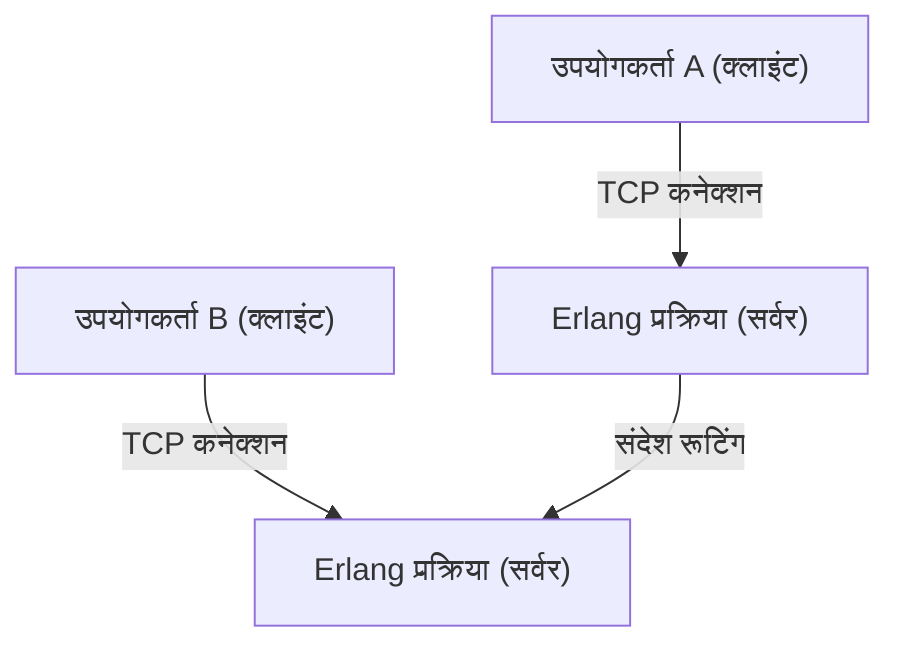
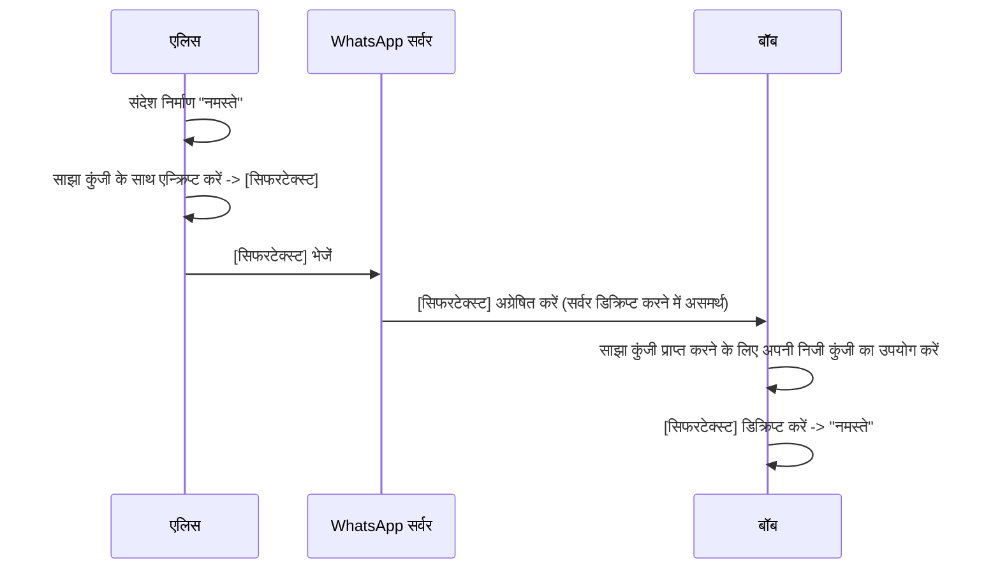

## 1. परिचय: एक वैश्विक बुनियादी ढांचे के रूप में WhatsApp

आधुनिक समाज में, संचार का बुनियादी ढांचा पानी, बिजली या स्वयं इंटरनेट जितना ही महत्वपूर्ण हो गया है। इस संदर्भ में, दुनिया भर में 2 अरब से अधिक सक्रिय उपयोगकर्ताओं वाले WhatsApp, केवल एक कॉर्पोरेट सेवा होने से आगे निकल गया है और वैश्विक संचार का एक मूलभूत हिस्सा बन गया है।

2009 में जान कौम (Jan Koum) और ब्रायन एक्टन (Brian Acton) द्वारा स्थापित, WhatsApp की शुरुआत SMS के विकल्प प्रदान करने के एक सरल लक्ष्य के साथ हुई थी। उस समय के मोबाइल संचार वातावरण में विभिन्न देशों में अलग-अलग SMS मूल्य निर्धारण संरचनाएं और कैरेक्टर सीमाएं थीं, जिससे सीमा पार संचार में बड़ी बाधाएं आती थीं। इंटरनेट कनेक्शन का उपयोग करके, WhatsApp ने इन प्रतिबंधों को हटा दिया और एक ऐसा वातावरण बनाया जहां "कोई भी, कहीं भी, मुफ्त में" संदेशों का आदान-प्रदान कर सके।

यह लेख गहराई से पड़ताल करेगा कि WhatsApp इतना लोकप्रिय क्यों हुआ, इसके अंतर्निहित "सादगी" (simplicity) के दर्शन और "एंड-टू-एंड एन्क्रिप्शन" (E2EE) के तंत्र पर तकनीकी और ऐतिहासिक पृष्ठभूमि के साथ चर्चा करेगा, जो वर्तमान WhatsApp का समर्थन करने वाला सबसे बड़ा तकनीकी स्तंभ है।

## 2. एक दर्शन के रूप में "सादगी" (Simplicity) और "नो विज्ञापन" (No Ads)

WhatsApp की सफलता पर चर्चा करते समय संस्थापकों का मजबूत दर्शन अनिवार्य है। शुरुआती चरणों से ही, उनकी नीति "कोई विज्ञापन नहीं, कोई गेम नहीं, कोई नौटंकी नहीं" (No Ads, No Games, No Gimmicks) की थी। उस समय, कई अन्य ऐप्स विज्ञापन राजस्व को अधिकतम करने और उपयोगकर्ताओं का ध्यान आकर्षित करने के लिए जटिल सुविधाओं और गेमिफिकेशन को पेश कर रहे थे, जबकि WhatsApp ने पूरी तरह से केवल "संदेशों को मज़बूती से वितरित करने" पर ध्यान केंद्रित किया।

### 2.1. यूजर इंटरफेस का अत्यधिक सरलीकरण

WhatsApp का UI/UX आश्चर्यजनक रूप से सरल है। जब आप ऐप खोलते हैं, तो आपको केवल चैट सूची दिखाई देती है। एक के बाद एक नई सुविधाएँ जोड़ने के बजाय, उन्होंने मुख्य मैसेजिंग कार्यक्षमता की स्थिरता और गति को अपनी सीमा तक अधिकतम करने का दृष्टिकोण अपनाया। यह "सुव्यवस्थित" सौंदर्यशास्त्र सीधे तकनीकी अनुकूलन से भी जुड़ता है। जटिल UI और अनावश्यक बैकग्राउंड प्रोसेसिंग को समाप्त करके, यह कम-स्पेक वाले स्मार्टफोन और उभरते देशों के नेटवर्क वातावरण में भी आश्चर्यजनक रूप से सुचारू रूप से काम करता है जहाँ संचार लाइनें अस्थिर हैं। भारत और ब्राजील जैसे विशाल उभरते बाजारों में इसके विस्फोटक रूप से लोकप्रिय होने का यह सबसे बड़ा कारण है।

### 2.2. बिजनेस मॉडल का विकास

शुरू में, WhatsApp ने 1 डॉलर प्रति वर्ष के सदस्यता मॉडल को अपनाया। यह उनके विश्वास की अभिव्यक्ति थी कि "उपयोगकर्ता ग्राहक है, उत्पाद नहीं।" यदि वे एक विज्ञापन मॉडल अपनाते हैं, तो उन्हें उपयोगकर्ता डेटा एकत्र और विश्लेषण करने की आवश्यकता होगी। ऐसा इसलिए था क्योंकि उनका मानना था कि यह गोपनीयता का उल्लंघन करेगा और उपयोगकर्ता के अनुभव को खराब करेगा। 2014 में Facebook (अब Meta) द्वारा अधिग्रहित किए जाने के बाद भी यह नीति कुछ समय तक बनी रही, लेकिन बाद में इसे निःशुल्क कर दिया गया, और वर्तमान में WhatsApp Business के माध्यम से कंपनियों को API प्रदान करना राजस्व का मुख्य स्रोत है।

## 3. WhatsApp को सपोर्ट करने वाली तकनीक: Erlang और FreeBSD

WhatsApp का बैकएंड सिस्टम बहुत ही अनोखे और दिलचस्प टेक स्टैक के साथ बनाया गया है। इसके मूल में प्रोग्रामिंग भाषा "Erlang" और ऑपरेटिंग सिस्टम "FreeBSD" है।

### 3.1. Erlang का चुनाव: अल्ट्रा-हाई कंकरेंसी और फॉल्ट टॉलरेंस

Erlang एक कार्यात्मक भाषा है जिसे मूल रूप से 1980 के दशक में एरिक्सन (Ericsson) द्वारा टेलीफोन एक्सचेंज जैसी संचार प्रणालियों के निर्माण के लिए विकसित किया गया था। इसे "नौ 9s (99.9999999%) उपलब्धता" प्राप्त करने के लक्ष्य के साथ डिज़ाइन किया गया था, और इसमें एक ही समय में लाखों हल्के प्रक्रियाओं (OS थ्रेड्स से अलग) को निष्पादित करने की अद्भुत समवर्ती (concurrent) प्रसंस्करण क्षमता है।

WhatsApp एक ऐसा सिस्टम है जहां करोड़ों उपयोगकर्ता एक साथ जुड़ते हैं और वास्तविक समय में संदेश भेजते और प्राप्त करते हैं। Erlang की हल्की प्रक्रिया के रूप में प्रत्येक उपयोगकर्ता के कनेक्शन (TCP सॉकेट) को प्रबंधित करके, उन्होंने एक ही सर्वर पर लाखों समवर्ती कनेक्शनों को संभालने का एक अभूतपूर्व प्रदर्शन हासिल किया।

### 3.2. FreeBSD को अपनाना: नेटवर्क स्टैक का अनुकूलन

सर्वर ओएस के रूप में लिनक्स (Linux) के बजाय FreeBSD को चुनना भी शुरुआती WhatsApp की एक तकनीकी विशेषता थी। FreeBSD अपने मजबूत नेटवर्क स्टैक के लिए जाना जाता है। WhatsApp के इंजीनियरों ने FreeBSD के कर्नेल मापदंडों को अत्यधिक ट्यून किया ताकि एक ही सर्वर द्वारा संभाले जा सकने वाले कनेक्शनों की संख्या को अधिकतम किया जा सके।

इंजीनियरों की एक छोटी विशिष्ट टीम (दर्जनों की संख्या में) करोड़ों उपयोगकर्ताओं का समर्थन करने वाले सिस्टम को संचालित करने में सक्षम थी, क्योंकि उन्होंने Erlang और FreeBSD को चुना, ऐसी प्रौद्योगिकियां जो उनके उद्देश्यों के लिए सबसे उपयुक्त थीं, और उनका पूरी तरह से उपयोग किया।

## 4. एंड-टू-एंड एन्क्रिप्शन (E2EE): गोपनीयता का अंतिम रूप

2016 में, WhatsApp ने डिफ़ॉल्ट रूप से अपने सभी सक्रिय उपयोगकर्ताओं के लिए एंड-टू-एंड एन्क्रिप्शन (E2EE) पेश किया। सूचना सुरक्षा और गोपनीयता के इतिहास में यह एक अत्यंत महत्वपूर्ण मील का पत्थर बन गया।

### 4.1. E2EE क्या है?

एंड-टू-एंड एन्क्रिप्शन एक ऐसा तंत्र है जिसमें संचार के केवल पक्ष (प्रेषक और प्राप्तकर्ता) ही संदेश की सामग्री को डिक्रिप्ट कर सकते हैं। संदेश प्रेषक के डिवाइस पर एन्क्रिप्ट किया जाता है, इंटरनेट के माध्यम से एन्क्रिप्टेड अवस्था में WhatsApp के सर्वर से गुजरता है, प्राप्तकर्ता के डिवाइस तक पहुंचता है, और वहां पहली बार डिक्रिप्ट किया जाता है।

महत्वपूर्ण बात यह है कि **WhatsApp के सर्वर (या इसे संचालित करने वाली Meta कंपनी) के लिए भी संदेश की सामग्री को देखना गणितीय रूप से असंभव है**। सिफर को डिक्रिप्ट करने की "कुंजी" केवल उपयोगकर्ता के डिवाइस पर मौजूद होती है।

### 4.2. Signal Protocol को अपनाना

WhatsApp का E2EE ओपन व्हिस्पर सिस्टम्स (Open Whisper Systems - अब Signal Foundation) द्वारा विकसित "Signal Protocol" का उपयोग करता है। Signal Protocol को आधुनिक क्रिप्टोग्राफी में सबसे मजबूत और सबसे विश्वसनीय प्रोटोकॉल में से एक माना जाता है।

Signal Protocol का मूल "डबल रैचेट एल्गोरिथम" (Double Ratchet Algorithm) नामक तंत्र में निहित है। यह एक ऐसा तंत्र है जो हर बार संदेश भेजे जाने पर एक नई एन्क्रिप्शन कुंजी उत्पन्न करता है।

1. **फॉरवर्ड सीक्रेसी (Forward Secrecy)**: इस अप्रत्याशित घटना में भी कि किसी निश्चित समय की कोई कुंजी लीक हो जाती है, उससे पहले के पिछले संदेशों को डिक्रिप्ट नहीं किया जाएगा।
2. **फ्यूचर सीक्रेसी (Future Secrecy / Post-Compromise Security)**: भले ही कोई कुंजी लीक हो जाए, संचार जारी रहने पर नई कुंजियाँ उत्पन्न होती हैं, इसलिए भविष्य के संदेशों की सुरक्षा बहाल हो जाती है।

यह डिफी-हेलमैन की एक्सचेंज (ECDH) जैसी सार्वजनिक कुंजी एन्क्रिप्शन विधियों के आधार पर प्रत्येक सत्र के लिए कुंजियों को लगातार अपडेट और नष्ट करके अत्यधिक उच्च सुरक्षा स्तर बनाए रखता है।

### 4.3. मेटाडेटा और गोपनीयता चुनौतियां

यद्यपि संदेश की सामग्री E2EE द्वारा पूरी तरह से सुरक्षित है, लेकिन "किसने, कब और किससे संवाद किया" का "मेटाडेटा" एन्क्रिप्शन के अधीन नहीं है। WhatsApp इस मेटाडेटा को बरकरार रखता है, जिसका खुलासा कानून प्रवर्तन एजेंसियों के अनुरोध के आधार पर किया जा सकता है।

गोपनीयता समर्थकों ने इस मेटाडेटा के संग्रह और प्रतिधारण के बारे में भी चिंता जताई है। पूर्ण गुमनामी चाहने वाले उपयोगकर्ता Signal जैसे ऐप्स चुनते हैं, जहाँ मेटाडेटा का संग्रह भी न्यूनतम रखा जाता है। हालाँकि, समग्र रूप से समाज के लिए 2 बिलियन के विशाल उपयोगकर्ता आधार को डिफ़ॉल्ट रूप से शक्तिशाली E2EE प्रदान करने में WhatsApp की उपलब्धि अथाह है।

## 5. सामाजिक और आर्थिक प्रभाव

WhatsApp के प्रसार का दुनिया भर के समाजों और अर्थव्यवस्थाओं पर गहरा प्रभाव पड़ा है।

### 5.1. संचार का लोकतंत्रीकरण

विकासशील देशों में, ऐसे कई मामले हैं जहां WhatsApp वास्तव में "स्वयं इंटरनेट" के रूप में कार्य करता है। महंगे SMS या कॉल शुल्क का भुगतान किए बिना व्यावसायिक बातचीत, परिवार से संपर्क करना और समाचार प्राप्त करना संभव हो गया है। विशेष रूप से अफ्रीका और दक्षिण अमेरिका में, अनगिनत छोटे व्यवसाय हैं जो WhatsApp के माध्यम से उत्पाद खरीदते और बेचते हैं और ग्राहक सहायता प्रदान करते हैं, और यह आर्थिक गतिविधि के लिए एक महत्वपूर्ण बुनियादी ढांचा बन गया है।

### 5.2. डिजिटल पहचान और भुगतान

हाल के वर्षों में, WhatsApp मात्र मैसेजिंग से आगे बढ़कर डिजिटल वॉलेट और भुगतान सुविधाओं (जैसे WhatsApp Pay) के एकीकरण की ओर बढ़ रहा है। भारत और ब्राजील जैसे देशों में विस्तार उन्नत है, जिससे उपयोगकर्ता सीधे चैट स्क्रीन से पैसे भेज सकते हैं। अपने विशाल उपयोगकर्ता आधार का लाभ उठाते हुए, यह वित्तीय समावेशन को बढ़ावा देने में भी भूमिका निभाने लगा है।

## 6. निष्कर्ष: प्रौद्योगिकी और मानवता का प्रतिच्छेदन

WhatsApp की यात्रा एक भव्य प्रयोग की तरह है जो यह दिखाती है कि कैसे तकनीक मानव संचार को फिर से परिभाषित कर सकती है। "सादगी" के दर्शन के तहत, यह Erlang जैसी मजबूत तकनीक के साथ करोड़ों उपयोगकर्ताओं के ट्रैफ़िक का समर्थन करता है, और Signal Protocol के साथ व्यक्तिगत गोपनीयता की दृढ़ता से रक्षा करता है। यह सही संतुलन ही वह कारण है कि यह दुनिया में सबसे ज्यादा इस्तेमाल किया जाने वाला ऐप बन गया है।

उस अनौपचारिक "गुड मॉर्निंग" संदेश के पीछे जो हम हर दिन भेजते हैं, अत्यधिक उन्नत एन्क्रिप्शन तकनीक है जिसे मानव ज्ञान कहा जा सकता है, और इसे दुनिया तक पहुंचाने के लिए एक अत्यधिक अनुकूलित वितरित प्रणाली काम कर रही है। WhatsApp को आधुनिक उत्कृष्ट कृतियों में से एक कहा जा सकता है जो सॉफ्टवेयर इंजीनियरिंग और उत्पाद डिजाइन को मिश्रित करता है。
