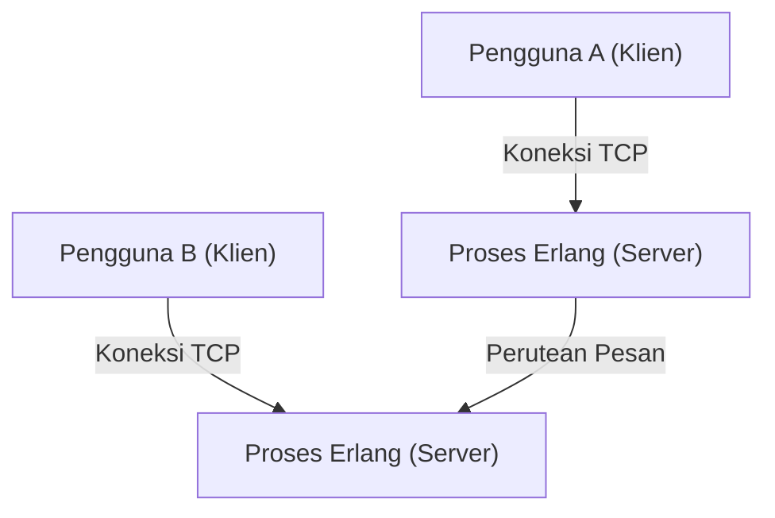
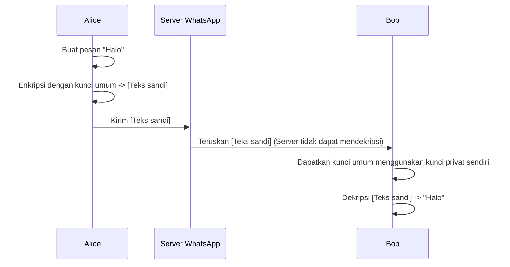

## 1. Pendahuluan: WhatsApp sebagai Infrastruktur yang Menghubungkan Dunia

Dalam masyarakat modern, infrastruktur komunikasi telah menjadi sama pentingnya dengan pasokan air, listrik, dan internet itu sendiri. Di antaranya, WhatsApp, yang memiliki lebih dari 2 miliar pengguna aktif di seluruh dunia, telah melampaui sekadar layanan dari satu perusahaan dan dapat dikatakan sebagai fondasi komunikasi global.

Didirikan pada tahun 2009 oleh Jan Koum dan Brian Acton, WhatsApp dimulai dengan tujuan sederhana sebagai alternatif SMS. Pada saat itu, lingkungan komunikasi seluler memiliki struktur biaya dan batas karakter SMS yang berbeda untuk setiap negara, dan ada hambatan tinggi untuk komunikasi lintas batas. Dengan menggunakan koneksi internet, WhatsApp menghilangkan batasan ini dan menciptakan lingkungan di mana pesan dapat dipertukarkan oleh "siapa saja, di mana saja, secara gratis."

Dalam artikel ini, kita akan menggali lebih dalam mengapa WhatsApp menjadi begitu populer, filosofi "kesederhanaan" yang mendasarinya, dan mekanisme "Enkripsi End-to-End (E2EE)" yang merupakan pilar terbesar yang mendukung WhatsApp secara teknis saat ini, berdasarkan latar belakang teknis dan historis.

## 2. "Kesederhanaan" dan "Tanpa Iklan" sebagai Filosofi

Filosofi kuat dari para pendirinya sangat penting dalam membahas kesuksesan WhatsApp. Sejak awal, mereka memiliki kebijakan "Tanpa Iklan, Tanpa Game, Tanpa Gimmick (No Ads, No Games, No Gimmicks)". Saat banyak aplikasi lain memperkenalkan fitur kompleks dan gamifikasi untuk menarik perhatian pengguna demi memaksimalkan pendapatan iklan, WhatsApp hanya fokus pada "menyampaikan pesan dengan andal."

### 2.1. Penyederhanaan Ekstrem pada Antarmuka Pengguna

UI/UX WhatsApp sangatlah sederhana. Saat Anda membuka aplikasi, yang ada hanyalah daftar obrolan. Daripada menambahkan fitur baru satu per satu, mereka mengambil pendekatan untuk memaksimalkan stabilitas dan kecepatan fitur perpesanan inti hingga batas maksimal. Estetika "penyederhanaan" ini juga terkait langsung dengan optimalisasi teknis. Dengan menghilangkan UI yang kompleks dan pemrosesan latar belakang yang tidak perlu, aplikasi ini berjalan sangat lancar bahkan pada ponsel cerdas dengan spesifikasi rendah atau di lingkungan jaringan negara berkembang dengan konektivitas yang tidak stabil. Ini adalah salah satu alasan terbesar mengapa aplikasi ini meledak popularitasnya di pasar negara berkembang yang besar seperti India dan Brasil.

### 2.2. Evolusi Model Bisnis

Awalnya, WhatsApp mengadopsi model langganan $1 per tahun. Ini adalah manifestasi dari keyakinan mereka bahwa "pengguna adalah pelanggan, bukan produk." Mengadopsi model iklan akan mengharuskan pengumpulan dan analisis data pengguna. Mereka percaya hal itu akan melanggar privasi dan merusak pengalaman pengguna. Bahkan setelah diakuisisi oleh Facebook (sekarang Meta) pada tahun 2014, kebijakan ini dipertahankan untuk sementara waktu, tetapi kemudian digratiskan, dan saat ini penyediaan API untuk perusahaan melalui WhatsApp Business adalah sumber pendapatan utama.

## 3. Teknologi di Balik WhatsApp: Erlang dan FreeBSD

Sistem backend WhatsApp dibangun dengan tumpukan teknologi yang sangat unik dan menarik. Intinya adalah bahasa pemrograman "Erlang" dan sistem operasi "FreeBSD".

### 3.1. Memilih Erlang: Konkurensi Ultra-Tinggi dan Toleransi Kesalahan

Erlang adalah bahasa fungsional yang pada awalnya dikembangkan oleh Ericsson pada 1980-an untuk membangun sistem komunikasi seperti pertukaran telepon. Dirancang dengan tujuan mencapai "ketersediaan 9 sembilan (99.9999999%)", bahasa ini memiliki kemampuan pemrosesan konkuren yang luar biasa, mampu mengeksekusi jutaan proses ringan (berbeda dari thread OS) secara bersamaan.

WhatsApp adalah sistem di mana ratusan juta pengguna terhubung secara bersamaan dan mengirim/menerima pesan secara real-time. Dengan mengelola koneksi setiap pengguna (soket TCP) sebagai proses Erlang yang ringan, mereka mencapai kinerja yang tidak lazim pada saat itu, memproses jutaan koneksi simultan pada satu server.

### 3.2. Mengadopsi FreeBSD: Optimalisasi Tumpukan Jaringan

Memilih FreeBSD alih-alih Linux sebagai OS server juga merupakan karakteristik teknis awal WhatsApp. FreeBSD dikenal dengan tumpukan jaringannya yang tangguh. Para insinyur WhatsApp menyetel parameter kernel FreeBSD hingga batas maksimal untuk memaksimalkan jumlah koneksi yang dapat diproses oleh satu server.

Fakta bahwa tim insinyur elit kecil (berjumlah puluhan) mampu mengoperasikan sistem yang mendukung ratusan juta pengguna adalah karena mereka memilih teknologi yang paling sesuai dengan tujuan mereka—Erlang dan FreeBSD—dan memanfaatkannya secara maksimal.

## 4. Enkripsi End-to-End (E2EE): Bentuk Utama Privasi

Pada tahun 2016, WhatsApp memperkenalkan Enkripsi End-to-End (E2EE) secara default untuk semua pengguna aktif. Ini menandai tonggak yang sangat penting dalam sejarah keamanan informasi dan privasi.

### 4.1. Apa itu E2EE?

Enkripsi End-to-End adalah mekanisme di mana hanya pihak yang berkomunikasi (pengirim dan penerima) yang dapat mendekripsi konten pesan. Pesan dienkripsi di perangkat pengirim, berjalan melintasi internet dalam keadaan terenkripsi, melewati server WhatsApp, dan mencapai perangkat penerima, di mana pesan itu baru didekripsi untuk pertama kalinya.

Yang penting adalah **bahkan secara matematis tidak mungkin bagi server WhatsApp (atau Meta yang mengoperasikannya) untuk melihat konten pesan**. "Kunci" untuk mendekripsi pesan hanya ada di perangkat pengguna.

### 4.2. Mengadopsi Protokol Signal

E2EE WhatsApp menggunakan "Protokol Signal" yang dikembangkan oleh Open Whisper Systems (sekarang Signal Foundation). Protokol Signal dievaluasi sebagai salah satu protokol paling kuat dan andal dalam kriptografi modern.

Inti dari Protokol Signal adalah mekanisme yang disebut "Double Ratchet Algorithm". Ini adalah sistem yang menghasilkan kunci enkripsi baru setiap kali pesan dikirim.

1. **Kerahasiaan Maju (Forward Secrecy)**: Bahkan jika kunci bocor pada waktu tertentu, pesan sebelumnya tidak dapat didekripsi.
2. **Kerahasiaan Masa Depan (Future Secrecy / Post-Compromise Security)**: Bahkan setelah kunci bocor, karena kunci baru dihasilkan dalam proses komunikasi lanjutan, keamanan pesan di masa depan dipulihkan.

Berdasarkan kriptografi kunci publik seperti pertukaran kunci Diffie-Hellman (ECDH), protokol ini mempertahankan tingkat keamanan yang sangat tinggi dengan terus memperbarui dan membuang kunci untuk setiap sesi.

### 4.3. Tantangan Metadata dan Privasi

Meskipun E2EE sepenuhnya melindungi "konten" pesan, "metadata" tentang "siapa berkomunikasi dengan siapa dan kapan" tidak dienkripsi. WhatsApp menyimpan metadata ini, yang dapat diungkapkan atas permintaan otoritas penegak hukum.

Para pendukung privasi juga telah menunjukkan kekhawatiran tentang pengumpulan dan penyimpanan metadata ini. Pengguna yang mencari anonimitas penuh cenderung memilih aplikasi seperti Signal, yang pengumpulan metadatanya juga diminimalkan. Namun, dengan menyediakan E2EE yang kuat secara default ke basis pengguna masif sebesar 2 miliar, pencapaian WhatsApp sangat berharga bagi masyarakat secara keseluruhan.

## 5. Dampak Sosial dan Ekonomi

Meluasnya penggunaan WhatsApp telah berdampak besar pada masyarakat dan ekonomi di seluruh dunia.

### 5.1. Demokratisasi Komunikasi

Di negara berkembang, WhatsApp sering berfungsi secara de facto sebagai "internet itu sendiri". Tanpa membayar biaya SMS atau panggilan telepon yang mahal, interaksi bisnis, kontak keluarga, dan akuisisi berita menjadi mungkin. Khususnya di Afrika dan Amerika Selatan, ada banyak usaha kecil yang menggunakan WhatsApp untuk membeli dan menjual barang dan menyediakan dukungan pelanggan, menjadikannya infrastruktur penting untuk kegiatan ekonomi.

### 5.2. Identitas Digital dan Pembayaran

Dalam beberapa tahun terakhir, WhatsApp telah berevolusi melampaui sekadar perpesanan dengan mengintegrasikan dompet digital dan fitur pembayaran (seperti WhatsApp Pay). Peluncuran telah maju di negara-negara seperti India dan Brasil, memungkinkan pengguna untuk mengirim uang langsung dari layar obrolan. Memanfaatkan basis penggunanya yang besar, aplikasi ini juga mulai memainkan peran dalam mempromosikan inklusi keuangan (financial inclusion).

## 6. Kesimpulan: Persimpangan Teknologi dan Kemanusiaan

Perjalanan WhatsApp terasa seperti eksperimen besar yang menunjukkan bagaimana teknologi dapat mendefinisikan kembali komunikasi manusia. Di bawah filosofi "kesederhanaan", aplikasi ini mendukung lalu lintas ratusan juta orang dengan teknologi tangguh seperti Erlang, dan sangat melindungi privasi individu dengan Protokol Signal. Keseimbangan yang sangat indah itulah yang menjadi alasan mengapa aplikasi ini tumbuh menjadi aplikasi yang paling banyak digunakan di dunia.

Di balik pesan "selamat pagi" santai yang kita kirim setiap hari, terdapat sistem terdistribusi yang sangat optimal untuk menyampaikannya ke seluruh dunia, bersama dengan teknologi enkripsi canggih yang dapat disebut sebagai kebijaksanaan umat manusia. WhatsApp dapat dikatakan sebagai salah satu mahakarya modern di mana rekayasa perangkat lunak dan desain produk bersinggungan.
