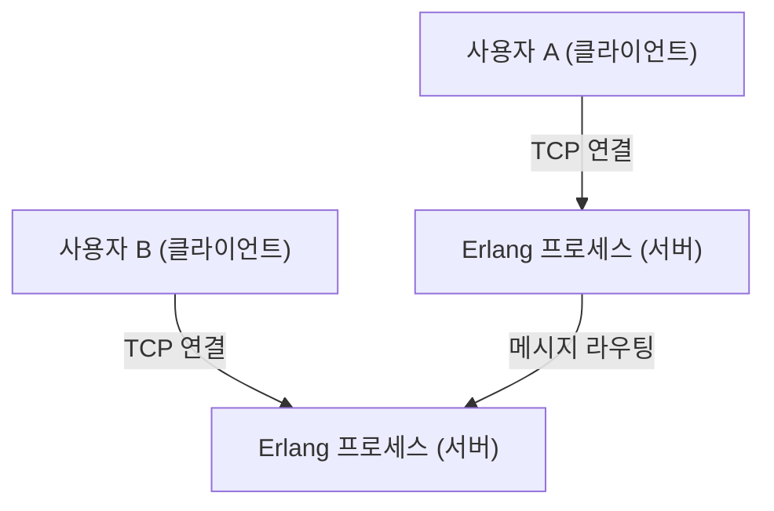
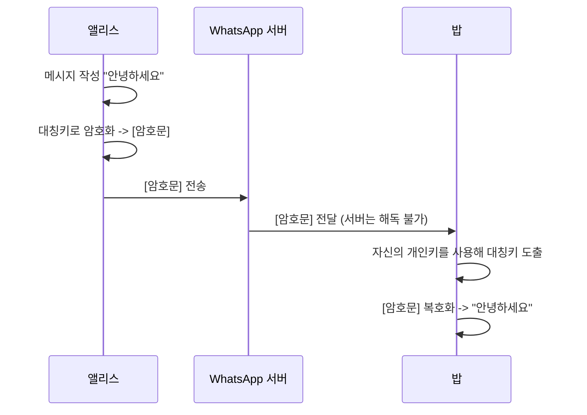

## 1. 서론: 세계를 연결하는 인프라로서의 WhatsApp

현대 사회에서 커뮤니케이션 인프라는 상하수도나 전기, 인터넷 자체와 맞먹는 중요성을 가지게 되었습니다. 그중에서도 전 세계 20억 명 이상의 활성 사용자를 보유한 WhatsApp은 단순한 한 기업의 서비스를 넘어, 글로벌 커뮤니케이션의 근간을 이루는 존재라고 할 수 있습니다.

2009년 얀 쿰(Jan Koum)과 브라이언 액튼(Brian Acton)이 설립한 WhatsApp은 SMS의 대체라는 단순한 목표에서 출발했습니다. 당시의 모바일 통신 환경은 국가마다 다른 SMS 요금 체계나 글자 수 제한이 존재해 국경을 넘는 커뮤니케이션에는 높은 장벽이 있었습니다. WhatsApp은 인터넷 회선을 이용함으로써 이러한 제약을 없애고, "누구나, 어디서나, 무료로" 메시지를 주고받을 수 있는 환경을 실현한 것입니다.

본 문서에서는 WhatsApp이 왜 이렇게까지 보급되었는지, 그 근저에 있는 "단순함(Simplicity)"의 철학, 그리고 현재의 WhatsApp을 기술적으로 지탱하는 최대 기둥인 "종단간 암호화(End-to-End Encryption, E2EE)"의 원리에 대해 기술적·역사적 배경을 바탕으로 깊이 파헤쳐 봅니다.

## 2. 철학으로서의 "단순함"과 "광고 없음"

WhatsApp의 성공을 논할 때 빼놓을 수 없는 것이 창업자들의 강력한 철학입니다. 그들은 초기 단계부터 "광고 없음, 게임 없음, 눈속임 없음(No Ads, No Games, No Gimmicks)"이라는 정책을 내세웠습니다. 당시 많은 앱들이 광고 수입을 극대화하기 위해 사용자의 주의를 끄는 복잡한 기능이나 게임화를 도입하던 중, WhatsApp은 오로지 "메시지를 확실하게 전달한다"는 것에만 집중했습니다.

### 2.1. 사용자 인터페이스의 극한의 덜어내기

WhatsApp의 UI/UX는 놀라울 정도로 단순합니다. 앱을 열면 채팅 목록만 존재합니다. 새로운 기능을 차례차례 추가하는 대신, 핵심인 메시징 기능의 안정성과 속도를 극한까지 높이는 접근 방식을 취했습니다. 이 "덜어내기"의 미학은 기술적 최적화와도 직결됩니다. 복잡한 UI나 불필요한 백그라운드 처리를 배제함으로써, 저사양 스마트폰이나 통신망이 불안정한 신흥국의 네트워크 환경에서도 놀라울 정도로 부드럽게 작동합니다. 이것이 인도나 브라질과 같은 거대 신흥 시장에서 폭발적으로 보급된 가장 큰 이유 중 하나입니다.

### 2.2. 비즈니스 모델의 변천

초기 WhatsApp은 연간 1달러의 구독 모델을 채택했습니다. 이는 "사용자가 고객이며, 제품이 아니다"라는 그들의 신념을 보여주는 것이었습니다. 광고 모델을 채택하면 사용자의 데이터를 수집하고 분석할 필요가 생깁니다. 그것은 프라이버시를 침해하고 사용자 경험을 훼손한다는 생각에서였습니다. 2014년 Facebook(현 Meta)에 인수된 후에도 한동안 이 방침이 유지되었으나, 이후 무료화되었고 현재는 WhatsApp Business를 통한 기업용 API 제공 등이 주요 수익원이 되고 있습니다.

## 3. WhatsApp을 지탱하는 기술: Erlang과 FreeBSD

WhatsApp의 백엔드 시스템은 매우 독특하고 흥미로운 기술 스택으로 구축되어 있습니다. 그 핵심을 담당하는 것이 프로그래밍 언어 "Erlang"과 운영체제 "FreeBSD"입니다.

### 3.1. Erlang의 선택: 초고도의 동시성과 내결함성

Erlang은 원래 1980년대에 에릭슨(Ericsson) 사가 전화 교환기 등 통신 시스템을 구축하기 위해 개발한 함수형 언어입니다. "9가 9개(99.9999999%)인 가용성"을 달성하는 것을 목표로 설계되었으며, 경량 프로세스(OS의 스레드와는 다름)를 수백만 개 단위로 동시에 실행할 수 있는 경이로운 동시 처리 능력을 가지고 있습니다.

WhatsApp은 수억 명의 사용자가 동시에 접속하여 실시간으로 메시지를 송수신하는 시스템입니다. 각 사용자의 연결(TCP 소켓)을 Erlang의 경량 프로세스로 관리함으로써, 서버 1대에서 수백만 개의 동시 접속을 처리하는, 당시로서는 규격 외의 성능을 구현했습니다.

### 3.2. FreeBSD의 채택: 네트워크 스택의 최적화

서버 OS로 Linux가 아닌 FreeBSD를 선택한 것도 초기 WhatsApp의 기술적 특징이었습니다. FreeBSD는 견고한 네트워크 스택으로 잘 알려져 있습니다. WhatsApp의 엔지니어들은 FreeBSD의 커널 파라미터를 극한까지 튜닝하여 1대의 서버에서 처리할 수 있는 연결 수를 최대화했습니다.

소수의 정예 엔지니어 팀(수십 명 규모)으로 수억 명의 사용자를 지탱하는 시스템을 운영할 수 있었던 것은, Erlang과 FreeBSD라는 그들의 목적에 가장 부합하는 기술을 선택하고 이를 철저하게 다루었기 때문입니다.

## 4. 종단간 암호화(E2EE): 프라이버시의 궁극적인 형태

2016년, WhatsApp은 모든 활성 사용자에게 기본적으로 종단간 암호화(E2EE)를 도입했습니다. 이는 정보 보안과 프라이버시 역사에 있어 매우 중요한 이정표가 되었습니다.

### 4.1. E2EE란 무엇인가?

종단간 암호화란 통신 당사자(송신자와 수신자)만이 메시지 내용을 해독할 수 있는 시스템입니다. 메시지는 송신자의 기기에서 암호화되어 암호화된 상태 그대로 인터넷을 지나 WhatsApp 서버를 거쳐 수신자의 기기에 도착하며, 그곳에서 비로소 복호화됩니다.

중요한 것은, **WhatsApp 서버(또는 이를 운영하는 Meta사)라 할지라도 메시지 내용을 보는 것은 수학적으로 불가능하다**는 것입니다. 암호를 풀기 위한 "키"는 사용자의 기기에만 존재합니다.

### 4.2. Signal Protocol의 채택

WhatsApp의 E2EE는 Open Whisper Systems(현재의 Signal Foundation)가 개발한 "Signal Protocol"을 채택하고 있습니다. Signal Protocol은 현대 암호학에서 가장 견고하고 신뢰성 높은 프로토콜 중 하나로 평가받고 있습니다.

Signal Protocol의 핵심은 "Double Ratchet Algorithm"이라고 불리는 메커니즘에 있습니다. 이는 메시지를 보낼 때마다 새로운 암호키를 생성하는 시스템입니다.

1. **전방 향후 안전성(Forward Secrecy)**: 만일 어느 시점의 키가 유출되더라도, 그 이전의 과거 메시지는 해독되지 않습니다.
2. **사후 향후 안전성(Future Secrecy / Post-Compromise Security)**: 키가 유출된 후라도 통신을 계속하는 과정에서 새로운 키가 생성되기 때문에, 미래 메시지의 안전성은 회복됩니다.

Diffie-Hellman 키 교환(ECDH) 등의 공개키 암호 방식을 기반으로, 세션마다 키를 끊임없이 갱신하고 폐기함으로써 극히 높은 보안 수준을 유지하고 있습니다.

### 4.3. 메타데이터와 프라이버시 문제

E2EE를 통해 메시지의 "내용(콘텐츠)"은 완벽하게 보호되지만, "누가, 언제, 누구와 통신했는가"하는 "메타데이터"는 암호화 대상이 아닙니다. WhatsApp은 이 메타데이터를 보관하고 있으며, 법 집행 기관의 요청에 따라 공개될 수 있습니다.

프라이버시 옹호 단체에서는 이 메타데이터 수집 및 보관에 대한 우려도 제기하고 있습니다. 완전한 익명성을 원하는 사용자는 메타데이터 수집도 최소화되어 있는 Signal 앱 등을 선택하는 경향이 있습니다. 그러나 20억 명이라는 거대한 사용자 기반을 대상으로 기본적으로 강력한 E2EE를 제공하는 WhatsApp의 공적은 사회 전체로 보면 헤아릴 수 없이 큽니다.

## 5. 사회적·경제적 영향

WhatsApp의 보급은 전 세계의 사회와 경제에 지대한 영향을 미치고 있습니다.

### 5.1. 커뮤니케이션의 민주화

개발도상국에서 WhatsApp은 사실상 "인터넷 그 자체"로 기능하는 경우가 많습니다. 비싼 SMS나 통화 요금을 지불하지 않고도 비즈니스 연락, 가족과의 연락, 뉴스 습득 등이 가능해졌습니다. 특히 아프리카나 남미에서는 WhatsApp을 통해 상품을 매매하거나 고객 지원을 하는 소규모 비즈니스가 무수히 존재하며, 경제 활동의 중요한 인프라가 되고 있습니다.

### 5.2. 디지털 신원과 결제

최근 WhatsApp은 단순한 메시징을 넘어 디지털 지갑이나 결제 기능(WhatsApp Pay 등) 통합을 추진하고 있습니다. 인도나 브라질 등에서 도입이 선행되고 있으며, 사용자는 채팅 화면에서 직접 송금할 수 있게 되었습니다. 거대한 사용자 기반을 활용하여 금융 포용(Financial Inclusion)을 촉진하는 역할도 맡기 시작했습니다.

## 6. 결론: 기술과 인간의 교차점

WhatsApp의 행보는 기술이 어떻게 인간의 커뮤니케이션을 재정의할 수 있는지를 보여주는 장대한 실험과도 같습니다. "단순함"이라는 철학 아래, Erlang과 같은 견고한 기술로 수억 명의 트래픽을 감당하고, Signal Protocol을 통해 개인의 프라이버시를 강력하게 보호합니다. 그 절묘한 균형이야말로 세계에서 가장 많이 사용되는 앱으로 성장한 이유입니다.

우리가 매일 무심코 보내는 "안녕"이라는 메시지 이면에는 인류의 지혜라고도 할 수 있는 고도의 암호 기술과, 이를 전 세계에 전달하기 위해 극한까지 최적화된 분산 시스템이 움직이고 있습니다. WhatsApp은 소프트웨어 엔지니어링과 제품 디자인이 융합된 현대의 걸작 중 하나라고 할 수 있을 것입니다.
