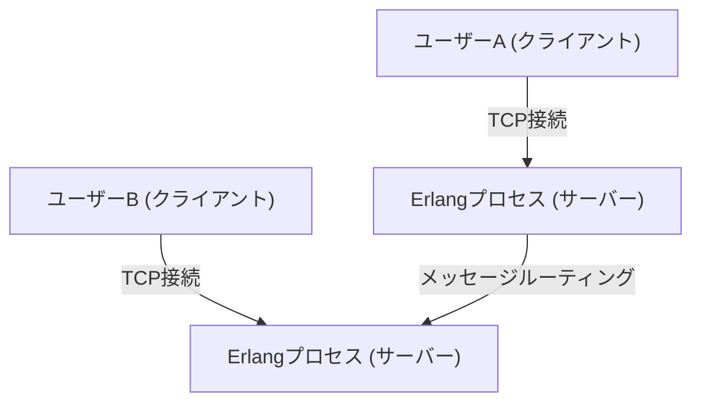
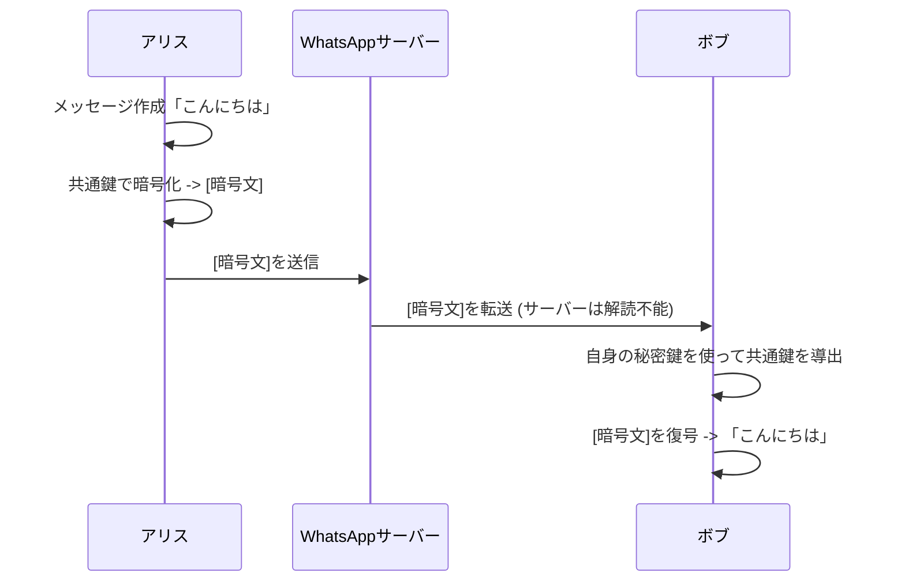

## 1. はじめに：世界を繋ぐインフラとしてのWhatsApp

現代社会において、コミュニケーションのインフラストラクチャは、水道や電気、インターネットそのものと同等の重要性を持つようになっています。その中で、世界中で20億人以上のアクティブユーザーを抱えるWhatsAppは、単なる一企業のサービスを超え、グローバルなコミュニケーションの根幹を成す存在と言えるでしょう。

2009年にヤン・クーム（Jan Koum）とブライアン・アクトン（Brian Acton）によって設立されたWhatsAppは、SMSの代替というシンプルな目標からスタートしました。当時のモバイル通信環境は、国ごとに異なるSMSの料金体系や文字数制限が存在し、国境を越えたコミュニケーションには高いハードルがありました。WhatsAppはインターネット回線を利用することで、これらの制約を取り払い、「誰でも、どこでも、無料で」メッセージをやり取りできる環境を実現したのです。

本記事では、WhatsAppがなぜここまで普及したのか、その根底にある「シンプリシティ」の哲学、そして現在のWhatsAppを技術的に支えている最大の柱である「エンドツーエンド暗号化（End-to-End Encryption, E2EE）」の仕組みについて、技術的・歴史的背景を踏まえて深く掘り下げていきます。

## 2. 哲学としての「シンプリシティ」と「ノー広告」

WhatsAppの成功を語る上で欠かせないのが、創業者たちの強い哲学です。彼らは初期の段階から「ノー広告、ノーゲーム、ノーギミック（No Ads, No Games, No Gimmicks）」というポリシーを掲げていました。当時の多くのアプリが、広告収入を最大化するためにユーザーの注意を引くための複雑な機能やゲーミフィケーションを導入する中、WhatsAppはひたすらに「メッセージを確実に届ける」ことだけに注力したのです。

### 2.1. ユーザーインターフェースの極限の削ぎ落とし

WhatsAppのUI/UXは、驚くほどシンプルです。アプリを開けば、そこにあるのはチャットリストのみ。新しい機能を次々と追加するのではなく、コアとなるメッセージング機能の安定性と速度を極限まで高めるアプローチをとりました。この「削ぎ落とし」の美学は、技術的な最適化にも直結しています。複雑なUIや不要なバックグラウンド処理を排除することで、低スペックなスマートフォンや、通信回線が不安定な新興国のネットワーク環境でも、驚くほどスムーズに動作します。これが、インドやブラジルといった巨大な新興市場で爆発的に普及した最大の理由の一つです。

### 2.2. ビジネスモデルの変遷

当初、WhatsAppは年間1ドルのサブスクリプションモデルを採用していました。これは、「ユーザーが顧客であり、プロダクトではない」という彼らの信念の表れでした。広告モデルを採用すれば、ユーザーのデータを収集し、分析する必要が生じます。それはプライバシーを侵害し、ユーザー体験を損なうという考えからです。2014年にFacebook（現Meta）に買収された後も、しばらくはこの方針が維持されましたが、後に無料化され、現在はWhatsApp Businessを通じた企業向けのAPI提供などが主な収益源となっています。

## 3. WhatsAppを支える技術：ErlangとFreeBSD

WhatsAppのバックエンドシステムは、非常にユニークで興味深い技術スタックで構築されています。その中核を担っているのが、プログラミング言語「Erlang」とオペレーティングシステム「FreeBSD」です。

### 3.1. Erlangの選択：超高並行性と耐障害性

Erlangは、もともと1980年代にエリクソン社によって電話交換機などの通信システムを構築するために開発された関数型言語です。「9が9個（99.9999999%）の可用性」を実現することを目標に設計されており、軽量なプロセス（OSのスレッドとは異なる）を数百万個単位で同時に実行できるという驚異的な並行処理能力を持っています。

WhatsAppは、何億人ものユーザーが同時に接続し、リアルタイムでメッセージを送受信するシステムです。各ユーザーの接続（TCPソケット）をErlangの軽量プロセスとして管理することで、1台のサーバーで数百万の同時接続を処理するという、当時としては規格外のパフォーマンスを実現しました。

### 3.2. FreeBSDの採用：ネットワークスタックの最適化

サーバーのOSとしてLinuxではなくFreeBSDを選択したことも、初期のWhatsAppの技術的特徴でした。FreeBSDは、その堅牢なネットワークスタックで知られています。WhatsAppのエンジニアたちは、FreeBSDのカーネルパラメーターを極限までチューニングし、1台のサーバーで処理できるコネクション数を最大化しました。

少数の精鋭エンジニアチーム（数十人規模）で、数億人のユーザーを支えるシステムを運用できたのは、ErlangとFreeBSDという、彼らの目的に最も合致した技術を選択し、それを徹底的に使いこなしたからです。

## 4. エンドツーエンド暗号化（E2EE）：プライバシーの究極の形

2016年、WhatsAppはすべてのアクティブユーザーに対してデフォルトでエンドツーエンド暗号化（E2EE）を導入しました。これは、情報セキュリティとプライバシーの歴史において、極めて重要なマイルストーンとなりました。

### 4.1. E2EEとは何か？

エンドツーエンド暗号化とは、通信の当事者（送信者と受信者）のみがメッセージの内容を解読できる仕組みです。メッセージは送信者のデバイス上で暗号化され、暗号化された状態のままインターネットを通り、WhatsAppのサーバーを経由して、受信者のデバイスに届き、そこで初めて復号されます。

重要なのは、**WhatsAppのサーバー（あるいはそれを運営するMeta社）であっても、メッセージの内容を見ることは数学的に不可能**だということです。暗号を解くための「鍵」は、ユーザーのデバイス上にのみ存在します。

### 4.2. Signal Protocolの採用

WhatsAppのE2EEは、Open Whisper Systems（現在のSignal Foundation）が開発した「Signal Protocol」を採用しています。Signal Protocolは、現代の暗号学において最も堅牢で信頼性の高いプロトコルの一つとして評価されています。

Signal Protocolの核心は、「Double Ratchet Algorithm」と呼ばれるメカニズムにあります。これは、メッセージを送信するたびに新しい暗号鍵を生成する仕組みです。

1. **前方秘匿性（Forward Secrecy）**: 万が一、ある時点の鍵が漏洩したとしても、それ以前の過去のメッセージは解読されません。
2. **将来秘匿性（Future Secrecy / Post-Compromise Security）**: 鍵が漏洩した後でも、通信を続ける過程で新しい鍵が生成されるため、将来のメッセージの安全性は回復します。

Diffie-Hellman鍵共有（ECDH）などの公開鍵暗号方式をベースに、セッションごとに鍵を絶えず更新・破棄していくことで、極めて高いセキュリティレベルを維持しています。

### 4.3. メタデータとプライバシーの課題

E2EEによってメッセージの「内容（コンテンツ）」は完全に守られますが、「誰が、いつ、誰と通信したか」という「メタデータ」は暗号化の対象外です。WhatsAppはこのメタデータを保持しており、法執行機関からの要請に基づいて開示されることがあります。

プライバシー擁護派からは、このメタデータの収集・保持に対する懸念も指摘されています。完全な匿名性を求めるユーザーは、メタデータの収集も最小限に抑えられているSignalアプリなどを選択する傾向にあります。しかし、20億人という巨大なユーザーベースに対して、デフォルトで強力なE2EEを提供しているWhatsAppの功績は、社会全体で見れば計り知れないものがあります。

## 5. 社会的・経済的インパクト

WhatsAppの普及は、世界中の社会や経済に多大な影響を与えています。

### 5.1. コミュニケーションの民主化

発展途上国において、WhatsAppは事実上の「インターネットそのもの」として機能しているケースが多々あります。高価なSMSや通話料金を支払うことなく、ビジネスのやり取り、家族との連絡、ニュースの取得などが可能になりました。特にアフリカや南米では、WhatsAppを通じて商品の売買やカスタマーサポートを行う小規模ビジネスが無数に存在し、経済活動の重要なインフラとなっています。

### 5.2. デジタルアイデンティティと決済

近年、WhatsAppは単なるメッセージングから、デジタルウォレットや決済機能（WhatsApp Payなど）の統合を進めています。インドやブラジルなどでの展開が先行しており、ユーザーはチャット画面から直接送金を行えるようになっています。巨大なユーザー基盤を活かし、金融包摂（ファイナンシャル・インクルージョン）を推進する役割も担い始めています。

## 6. まとめ：テクノロジーと人間の交差点

WhatsAppの歩みは、テクノロジーがいかにして人間のコミュニケーションを再定義できるかを示す壮大な実験のようです。「シンプリシティ」という哲学の下、Erlangのような堅牢な技術で数億人のトラフィックを支え、Signal Protocolによって個人のプライバシーを強力に保護する。その絶妙なバランスこそが、世界で最も使われるアプリへと成長した理由です。

私たちが毎日何気なく送る「おはよう」というメッセージの裏側には、人類の叡智とも言える高度な暗号技術と、それを世界中に届けるための極限まで最適化された分散システムが動いています。WhatsAppは、ソフトウェアエンジニアリングとプロダクトデザインが融合した、現代の傑作の一つと言えるでしょう。
