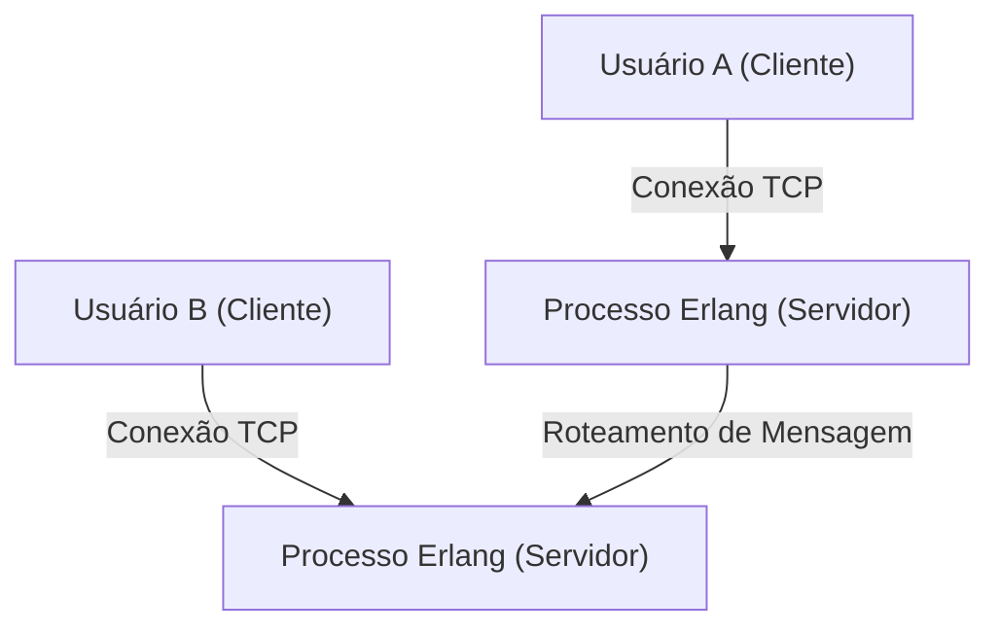
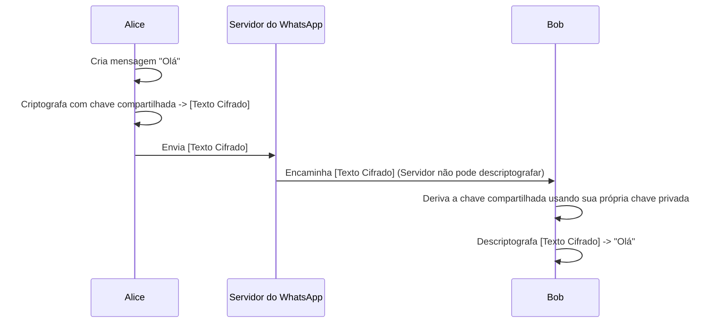

## 1. Introdução: O WhatsApp como infraestrutura que conecta o mundo

Na sociedade moderna, a infraestrutura de comunicação tornou-se tão importante quanto o abastecimento de água, eletricidade e a própria internet. Nesse contexto, o WhatsApp, com mais de 2 bilhões de usuários ativos em todo o mundo, vai além do serviço de uma única empresa e pode ser considerado a base da comunicação global.

Fundado em 2009 por Jan Koum e Brian Acton, o WhatsApp começou com um objetivo simples: ser uma alternativa ao SMS. O ambiente de comunicação móvel da época apresentava sistemas de cobrança e limites de caracteres de SMS que variavam de país para país, criando barreiras significativas para a comunicação além-fronteiras. Ao utilizar a conexão de internet, o WhatsApp removeu essas restrições e criou um ambiente onde "qualquer pessoa, em qualquer lugar, de graça" poderia trocar mensagens.

Neste artigo, exploraremos profundamente por que o WhatsApp se tornou tão popular, a filosofia de "simplicidade" em sua essência, e a estrutura da "Criptografia de Ponta a Ponta (End-to-End Encryption, E2EE)", que é o maior pilar tecnológico que sustenta o WhatsApp hoje, considerando seus contextos técnicos e históricos.

## 2. A filosofia da "Simplicidade" e "Sem anúncios"

Para explicar o sucesso do WhatsApp, é impossível não mencionar a forte filosofia de seus fundadores. Desde as fases iniciais, eles tinham a política de "Sem anúncios, sem jogos, sem truques (No Ads, No Games, No Gimmicks)". Enquanto muitos aplicativos da época introduziam recursos complexos e gamificação para atrair a atenção dos usuários a fim de maximizar a receita de publicidade, o WhatsApp se concentrou apenas em "entregar a mensagem com confiabilidade".

### 2.1. A extrema redução da interface do usuário

A UI/UX do WhatsApp é surpreendentemente simples. Ao abrir o aplicativo, tudo o que você vê é a lista de bate-papo. Em vez de adicionar novos recursos um após o outro, eles adotaram a abordagem de maximizar a estabilidade e a velocidade do recurso principal de mensagens ao extremo. Essa estética de "redução" também se traduz diretamente em otimização técnica. Ao eliminar UIs complexas e processamentos desnecessários em segundo plano, o aplicativo funciona de maneira incrivelmente suave até mesmo em smartphones de baixo desempenho ou em redes instáveis em países emergentes. Essa é uma das principais razões pelas quais explodiu em popularidade em enormes mercados emergentes, como a Índia e o Brasil.

### 2.2. A evolução do modelo de negócios

Inicialmente, o WhatsApp adotou um modelo de assinatura de 1 dólar por ano. Isso era uma manifestação da crença deles de que "o usuário é o cliente, não o produto". Se adotassem um modelo de publicidade, precisariam coletar e analisar dados dos usuários. Acreditava-se que isso violaria a privacidade e prejudicaria a experiência do usuário. Após a aquisição pelo Facebook (agora Meta) em 2014, essa política foi mantida por um tempo, mas depois se tornou gratuita. Atualmente, o fornecimento de APIs para empresas por meio do WhatsApp Business é a principal fonte de receita.

## 3. A tecnologia por trás do WhatsApp: Erlang e FreeBSD

O sistema backend do WhatsApp é construído sobre uma pilha de tecnologia muito única e interessante. No centro disso estão a linguagem de programação "Erlang" e o sistema operacional "FreeBSD".

### 3.1. A escolha do Erlang: Altíssima simultaneidade e tolerância a falhas

Erlang é uma linguagem funcional originalmente desenvolvida pela Ericsson na década de 1980 para construir sistemas de telecomunicações, como centrais telefônicas. Projetada com o objetivo de alcançar "nove noves (99,9999999%) de disponibilidade", ela possui uma incrível capacidade de processamento simultâneo de executar milhões de processos leves (diferentes de threads do SO) ao mesmo tempo.

O WhatsApp é um sistema em que centenas de milhões de usuários se conectam simultaneamente e enviam e recebem mensagens em tempo real. Ao gerenciar a conexão de cada usuário (soquete TCP) como um processo leve do Erlang, eles alcançaram um desempenho sem precedentes na época: processar milhões de conexões simultâneas em um único servidor.

### 3.2. Adoção do FreeBSD: Otimização da pilha de rede

A escolha do FreeBSD em vez do Linux como o sistema operacional do servidor também foi uma característica técnica inicial do WhatsApp. O FreeBSD é conhecido por sua robusta pilha de rede. Os engenheiros do WhatsApp ajustaram os parâmetros do kernel do FreeBSD ao limite para maximizar o número de conexões que um único servidor poderia processar.

Eles conseguiram operar um sistema que suporta centenas de milhões de usuários com uma pequena equipe de engenheiros de elite (cerca de dezenas de pessoas) porque escolheram a tecnologia - Erlang e FreeBSD - que melhor se adequava aos seus objetivos e a dominaram completamente.

## 4. Criptografia de ponta a ponta (E2EE): A forma definitiva de privacidade

Em 2016, o WhatsApp introduziu a criptografia de ponta a ponta (E2EE) por padrão para todos os usuários ativos. Este foi um marco extremamente importante na história da segurança da informação e da privacidade.

### 4.1. O que é E2EE?

A criptografia de ponta a ponta é um sistema onde apenas as partes envolvidas na comunicação (remetente e destinatário) podem descriptografar o conteúdo da mensagem. A mensagem é criptografada no dispositivo do remetente, passa pela internet e pelos servidores do WhatsApp no estado criptografado, e atinge o dispositivo do destinatário, onde é descriptografada pela primeira vez.

O importante é que **é matematicamente impossível até mesmo para os servidores do WhatsApp (ou a Meta que os opera) ver o conteúdo da mensagem**. A "chave" para descriptografar o conteúdo só existe nos dispositivos dos usuários.

### 4.2. Adoção do Signal Protocol

A E2EE do WhatsApp adota o "Signal Protocol" desenvolvido pela Open Whisper Systems (atual Signal Foundation). O Signal Protocol é avaliado como um dos protocolos mais robustos e confiáveis ​​na criptografia moderna.

O núcleo do Signal Protocol está em um mecanismo chamado "Double Ratchet Algorithm". Este é um mecanismo que gera uma nova chave de criptografia cada vez que uma mensagem é enviada.

1. **Sigilo de Encaminhamento (Forward Secrecy)**: Mesmo na improvável eventualidade de uma chave em um determinado momento ser comprometida, mensagens anteriores não podem ser descriptografadas.
2. **Sigilo Futuro (Future Secrecy / Post-Compromise Security)**: Mesmo após o vazamento de uma chave, a segurança das mensagens futuras é restaurada à medida que novas chaves são geradas no processo de continuação da comunicação.

Baseando-se em esquemas de criptografia de chave pública, como a troca de chaves Diffie-Hellman (ECDH), o sistema mantém um nível extremamente alto de segurança, atualizando e descartando constantemente as chaves a cada sessão.

### 4.3. Metadados e desafios de privacidade

Embora o "conteúdo" da mensagem seja completamente protegido pela E2EE, os "metadados", como "quem, quando e com quem se comunicou", não são alvo de criptografia. O WhatsApp retém esses metadados, que podem ser divulgados com base em solicitações das autoridades policiais.

Defensores da privacidade também levantaram preocupações sobre a coleta e retenção desses metadados. Usuários em busca de anonimato total tendem a escolher aplicativos como o Signal, onde a coleta de metadados também é minimizada. No entanto, fornecer E2EE forte por padrão a uma enorme base de 2 bilhões de usuários é uma conquista incalculável do WhatsApp para a sociedade como um todo.

## 5. Impacto Social e Econômico

A disseminação do WhatsApp teve um impacto profundo na sociedade e na economia em todo o mundo.

### 5.1. Democratização da comunicação

Em países em desenvolvimento, há muitos casos em que o WhatsApp funciona como a "própria internet" de fato. Sem ter que pagar taxas caras de SMS e chamadas, tornou-se possível conduzir negócios, entrar em contato com a família, obter notícias e muito mais. Especialmente na África e na América do Sul, existem inúmeros pequenos negócios que compram e vendem produtos e oferecem suporte ao cliente por meio do WhatsApp, tornando-se uma infraestrutura vital para a atividade econômica.

### 5.2. Identidade Digital e Pagamentos

Nos últimos anos, o WhatsApp passou de meras mensagens para a integração de carteiras digitais e recursos de pagamento (como o WhatsApp Pay). A implantação tem sido liderada na Índia, no Brasil e em outros lugares, permitindo que os usuários enviem dinheiro diretamente da tela de bate-papo. Aproveitando sua enorme base de usuários, também está começando a desempenhar um papel na promoção da inclusão financeira.

## 6. Conclusão: A interseção da tecnologia e das pessoas

A jornada do WhatsApp se assemelha a um grande experimento de como a tecnologia pode redefinir a comunicação humana. Sob a filosofia da "simplicidade", ele suporta o tráfego de centenas de milhões de pessoas com tecnologias robustas como o Erlang e protege fortemente a privacidade individual com o Signal Protocol. Esse equilíbrio requintado é exatamente a razão pela qual cresceu para ser o aplicativo mais usado do mundo.

Por trás da mensagem "Bom dia" que enviamos casualmente todos os dias, estão em operação técnicas de criptografia altamente avançadas, que podem ser consideradas a sabedoria da humanidade, e sistemas distribuídos otimizados ao máximo para entregá-las a todo o mundo. O WhatsApp pode ser considerado uma das obras-primas modernas onde a engenharia de software e o design de produtos convergem.
