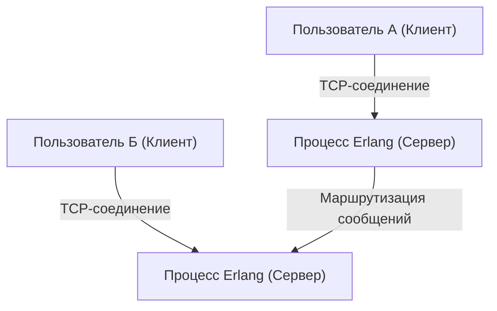
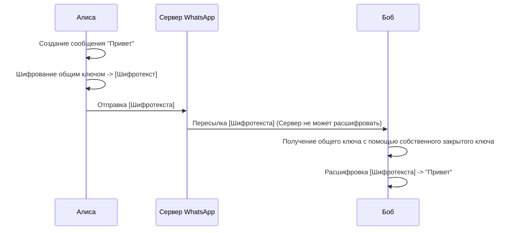

## 1. Введение: WhatsApp как инфраструктура, объединяющая мир

В современном обществе коммуникационная инфраструктура стала столь же важной, как водопровод, электричество или сам интернет. В этом контексте WhatsApp, имеющий более 2 миллиардов активных пользователей по всему миру, вышел за рамки простого сервиса одной компании и стал основой глобальных коммуникаций.

Основанный в 2009 году Яном Кумом (Jan Koum) и Брайаном Актоном (Brian Acton), WhatsApp начался с простой цели — стать альтернативой SMS. В то время мобильная связь характеризовалась разными тарифами на SMS и ограничениями на количество символов в каждой стране, что создавало высокие барьеры для международного общения. Используя интернет-соединение, WhatsApp устранил эти ограничения, создав среду, в которой сообщения могут отправляться "кем угодно, где угодно и бесплатно".

В этой статье мы подробно рассмотрим, почему WhatsApp получил такое широкое распространение, лежащую в его основе философию "простоты" и механизм "сквозного шифрования (End-to-End Encryption, E2EE)", который является важнейшей технологической опорой современного WhatsApp, с учетом технических и исторических аспектов.

## 2. "Простота" и "отсутствие рекламы" как философия

Говоря об успехе WhatsApp, нельзя не упомянуть твердую философию его создателей. С самого начала они придерживались политики "Без рекламы, без игр, без уловок (No Ads, No Games, No Gimmicks)". В то время как многие приложения внедряли сложные функции и геймификацию для привлечения внимания пользователей и максимизации доходов от рекламы, WhatsApp сосредоточился исключительно на "надежной доставке сообщений".

### 2.1. Максимальное упрощение пользовательского интерфейса

UI/UX в WhatsApp удивительно прост. Открыв приложение, вы видите только список чатов. Вместо постоянного добавления новых функций, они выбрали подход максимального повышения стабильности и скорости базовой функции обмена сообщениями. Эта эстетика "упрощения" напрямую связана с технической оптимизацией. За счет устранения сложного UI и ненужных фоновых процессов, приложение работает поразительно плавно даже на слабых смартфонах и в условиях нестабильной сети в развивающихся странах. Это одна из главных причин его взрывного роста на огромных развивающихся рынках, таких как Индия и Бразилия.

### 2.2. Эволюция бизнес-модели

Изначально WhatsApp использовал модель подписки стоимостью 1 доллар в год. Это отражало их убеждение в том, что "пользователь — это клиент, а не продукт". Переход на рекламную модель потребовал бы сбора и анализа данных пользователей. Они считали, что это нарушает конфиденциальность и портит пользовательский опыт. После покупки Facebook (ныне Meta) в 2014 году эта политика сохранялась некоторое время, но позже приложение стало бесплатным, и в настоящее время основным источником дохода является предоставление API для бизнеса через WhatsApp Business.

## 3. Технологии, стоящие за WhatsApp: Erlang и FreeBSD

Backend-система WhatsApp построена на весьма уникальном и интересном технологическом стеке. Его ядром являются язык программирования "Erlang" и операционная система "FreeBSD".

### 3.1. Выбор Erlang: сверхвысокий параллелизм и отказоустойчивость

Erlang — это функциональный язык, изначально разработанный компанией Ericsson в 1980-х годах для создания систем связи, таких как телефонные коммутаторы. Разработанный с целью достижения "девяти девяток (99.9999999%) доступности", он обладает феноменальной способностью к параллельной обработке, позволяя одновременно выполнять миллионы легковесных процессов (отличных от потоков ОС).

WhatsApp — это система, в которой сотни миллионов пользователей подключаются одновременно и отправляют/получают сообщения в реальном времени. Управляя соединением каждого пользователя (TCP-сокетом) как легковесным процессом Erlang, они достигли беспрецедентной на тот момент производительности — обработки миллионов одновременных подключений на одном сервере.

### 3.2. Использование FreeBSD: оптимизация сетевого стека

Выбор FreeBSD вместо Linux в качестве серверной ОС также был технической особенностью раннего WhatsApp. FreeBSD славится своим надежным сетевым стеком. Инженеры WhatsApp максимально настроили параметры ядра FreeBSD, чтобы максимизировать количество подключений, которые мог обрабатывать один сервер.

Небольшая команда элитных инженеров (около нескольких десятков человек) смогла управлять системой, обслуживающей сотни миллионов пользователей, именно потому, что они выбрали технологии Erlang и FreeBSD, которые лучше всего подходили для их целей, и научились использовать их в совершенстве.

## 4. Сквозное шифрование (E2EE): высшая форма конфиденциальности

В 2016 году WhatsApp по умолчанию внедрил сквозное шифрование (E2EE) для всех активных пользователей. Это стало крайне важной вехой в истории информационной безопасности и конфиденциальности.

### 4.1. Что такое E2EE?

Сквозное шифрование — это механизм, при котором содержимое сообщений могут расшифровать только участники связи (отправитель и получатель). Сообщение шифруется на устройстве отправителя, проходит через интернет и серверы WhatsApp в зашифрованном виде, достигает устройства получателя и только там расшифровывается.

Важно то, что **даже серверы WhatsApp (или управляющая ими компания Meta) математически не могут прочитать содержимое сообщений**. "Ключ" для расшифровки находится только на устройствах пользователей.

### 4.2. Использование Signal Protocol

Для E2EE WhatsApp использует "Signal Protocol", разработанный Open Whisper Systems (ныне Signal Foundation). Signal Protocol признан одним㮍 из самых надежных и безопасных протоколов в современной криптографии.

Ядром Signal Protocol является механизм, называемый "Double Ratchet Algorithm". Это система, которая генерирует новый ключ шифрования каждый раз при отправке сообщения.

1. **Прямая секретность (Forward Secrecy)**: В маловероятном случае компрометации ключа в определенный момент времени, прошлые сообщения, отправленные до этого момента, не могут быть расшифрованы.
2. **Будущая секретность (Future Secrecy / Post-Compromise Security)**: Даже после компрометации ключа безопасность будущих сообщений восстанавливается, так как в процессе дальнейшего общения генерируются новые ключи.

Основанный на криптографии с открытым ключом, такой как обмен ключами Диффи-Хеллмана (ECDH), он поддерживает чрезвычайно высокий уровень безопасности за счет постоянного обновления и уничтожения ключей для каждого сеанса.

### 4.3. Метаданные и проблемы конфиденциальности

Хотя E2EE полностью защищает "содержимое (контент)" сообщений, "метаданные" — информация о том, "кто, когда и с кем общался", — не подлежат шифрованию. WhatsApp хранит эти метаданные, и они могут быть раскрыты по запросу правоохранительных органов.

Защитники конфиденциальности также отмечают опасения по поводу сбора и хранения этих метаданных. Пользователи, которым нужна полная анонимность, склонны выбирать такие приложения, как Signal, где сбор метаданных сведен к минимуму. Однако достижения WhatsApp в предоставлении надежного E2EE по умолчанию для гигантской базы в 2 миллиарда пользователей неоценимы для общества в целом.

## 5. Социальное и экономическое влияние

Широкое распространение WhatsApp оказало огромное влияние на общество и экономику во всем мире.

### 5.1. Демократизация коммуникации

В развивающихся странах WhatsApp часто выступает как "сам интернет" де-факто. Он позволил вести деловую переписку, связываться с семьей и получать новости без необходимости платить за дорогие SMS или телефонные звонки. Особенно в Африке и Южной Америке существуют бесчисленные малые предприятия, которые используют WhatsApp для покупки и продажи товаров или поддержки клиентов, что делает его важной инфраструктурой для экономической активности.

### 5.2. Цифровая идентичность и платежи

В последние годы WhatsApp переходит от простого обмена сообщениями к интеграции цифровых кошельков и платежных функций (таких как WhatsApp Pay). Развертывание этих функций, которое началось в Индии, Бразилии и других странах, позволяет пользователям отправлять деньги прямо с экрана чата. Используя свою огромную пользовательскую базу, он начинает играть роль в продвижении финансовой инклюзивности.

## 6. Заключение: перекресток технологий и человека

Путь WhatsApp выглядит как грандиозный эксперимент, показывающий, как технологии могут переопределить человеческое общение. Подкрепленный философией "простоты", он обрабатывает трафик сотен миллионов пользователей с помощью надежных технологий, таких как Erlang, и надежно защищает частную жизнь людей с помощью Signal Protocol. Именно этот идеальный баланс является причиной того, что он вырос в самое популярное приложение в мире.

За простым сообщением "Доброе утро", которое мы небрежно отправляем каждый день, стоит передовая криптография, которую можно назвать мудростью человечества, и распределенная система, оптимизированная до предела для доставки этого сообщения по всему миру. WhatsApp можно по праву назвать одним из шедевров современности, где слились воедино программная инженерия и дизайн продукта.
