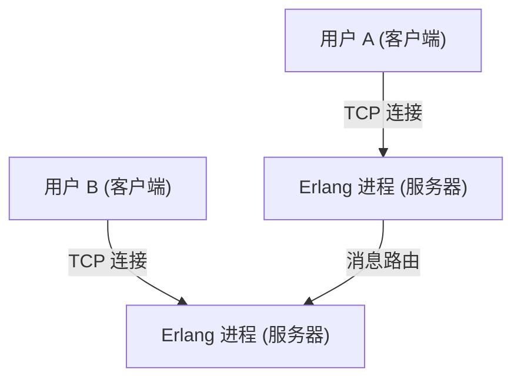
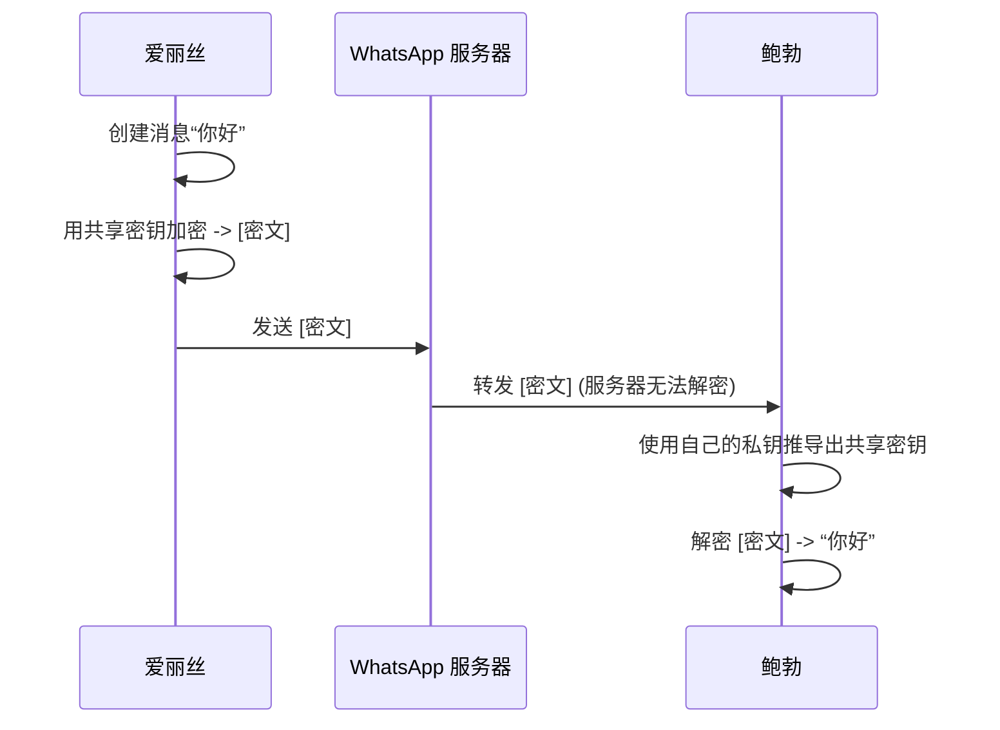

## 1. 引言：作为连接全球的基础设施的 WhatsApp

在现代社会，通信基础设施已经变得与水电或互联网本身同等重要。其中，拥有全球超过 20 亿活跃用户的 WhatsApp，可以说已经超越了一家企业的一项服务，成为了全球通信的支柱。

2009 年，简·库姆 (Jan Koum) 和布莱恩·阿克顿 (Brian Acton) 创立了 WhatsApp，其最初的目标非常简单，即作为短信 (SMS) 的替代品。当时的移动通信环境下，各国都有不同的短信收费体系和字数限制，跨国通信面临着很高的门槛。WhatsApp 通过利用互联网连接，消除了这些限制，实现了一个“任何人、在任何地方，都可以免费”发送和接收消息的环境。

在本文中，我们将探讨 WhatsApp 为何能普及到如此程度、其根基中的“简洁 (Simplicity)”哲学，并从技术和历史背景深入探讨目前在技术上支撑 WhatsApp 的最大支柱——“端到端加密 (End-to-End Encryption, E2EE)”机制。

## 2. 作为哲学的“简洁”与“无广告”

在谈论 WhatsApp 的成功时，创始人强烈的哲学信念是不可或缺的。从早期阶段起，他们就坚持了“无广告、无游戏、无噱头 (No Ads, No Games, No Gimmicks)”的政策。当时许多应用程序为了将广告收入最大化，引入了吸引用户注意力的复杂功能或游戏化机制，而 WhatsApp 则始终专注于“确保消息送达”。

### 2.1. 用户界面的极致精简

WhatsApp 的 UI/UX 简单得令人惊讶。打开应用程序，看到的只有聊天列表。他们没有不断地添加新功能，而是采取了将核心消息传递功能的稳定性和速度发挥到极致的方法。这种“精简”的美学也直接关系到技术上的优化。通过消除复杂的 UI 和不必要的后台处理，即使在规格较低的智能手机上，或者在通信线路不稳定的新兴国家的网络环境中，它也能运行得惊人地流畅。这也是它在印度、巴西等巨大的新兴市场呈爆炸式普及的最大原因之一。

### 2.2. 商业模式的演变

最初，WhatsApp 采用了每年 1 美元的订阅模式。这体现了他们的信念，即“用户是客户，而不是产品”。如果采用广告模式，就会产生收集和分析用户数据的需求。他们认为这会侵犯隐私并损害用户体验。在 2014 年被 Facebook（现 Meta）收购后，这一政策仍维持了一段时间，但后来改为了免费模式，目前主要的收入来源是通过 WhatsApp Business 提供面向企业的 API 等。

## 3. 支撑 WhatsApp 的技术：Erlang 和 FreeBSD

WhatsApp 的后端系统是建立在一个非常独特且有趣的技术栈上的。它的核心是编程语言“Erlang”和操作系统“FreeBSD”。

### 3.1. 选择 Erlang：超高并发性和容错性

Erlang 最初是由爱立信公司在 20 世纪 80 年代开发的，用于构建电话交换机等通信系统的函数式语言。它在设计之初就以实现“9 个 9（99.9999999%）的可用性”为目标，具有能够同时执行数百万个轻量级进程（不同于操作系统的线程）的惊人并发处理能力。

WhatsApp 是一个让数亿用户同时连接、实时发送和接收消息的系统。通过将每个用户的连接（TCP 套接字）作为 Erlang 的轻量级进程来管理，一台服务器可以处理数百万个并发连接，实现了当时破格的性能。

### 3.2. 采用 FreeBSD：网络栈的优化

作为服务器的操作系统，选择了 FreeBSD 而不是 Linux，这也是早期 WhatsApp 的一项技术特征。FreeBSD 以其强大的网络栈而闻名。WhatsApp 的工程师们将 FreeBSD 的内核参数调整到了极致，从而最大化了一台服务器所能处理的连接数。

一个由少数精锐工程师组成的团队（几十人规模），能够运营一个支撑数亿用户的系统，正是因为他们选择了最符合其目标的 Erlang 和 FreeBSD 技术，并将其运用到了极致。

## 4. 端到端加密 (E2EE)：隐私的终极形式

2016 年，WhatsApp 为所有活跃用户默认引入了端到端加密 (E2EE)。这是信息安全和隐私历史上一个极其重要的里程碑。

### 4.1. 什么是 E2EE？

端到端加密是一种只有通信的当事方（发送者和接收者）才能解密消息内容的机制。消息在发送者的设备上被加密，并以加密状态通过互联网，经过 WhatsApp 的服务器，到达接收者的设备，并在那里首次被解密。

重要的是，**即使是 WhatsApp 的服务器（或运营它的 Meta 公司），在数学上也不可能看到消息的内容**。用于解密密码的“密钥”仅存在于用户的设备上。

### 4.2. 采用 Signal Protocol

WhatsApp 的 E2EE 采用了由 Open Whisper Systems（现在的 Signal Foundation）开发的“Signal Protocol”。Signal Protocol 被认为是现代密码学中最强大、最可靠的协议之一。

Signal Protocol 的核心在于一种被称为“双棘轮算法 (Double Ratchet Algorithm)”的机制。这是一种每次发送消息时都会生成新加密密钥的机制。

1. **前向安全性 (Forward Secrecy)**: 万一某个时间点的密钥被泄露，在此之前的过去消息也不会被解密。
2. **后向安全性 (Future Secrecy / Post-Compromise Security)**: 即使密钥被泄露，在继续通信的过程中也会生成新密钥，因此未来消息的安全性得以恢复。

它以 Diffie-Hellman 密钥交换 (ECDH) 等公钥加密方式为基础，在每个会话中不断更新和销毁密钥，从而维持着极高的安全水平。

### 4.3. 元数据与隐私的挑战

尽管 E2EE 完全保护了消息的“内容 (内容)”，但“谁在什么时间与谁通信”这种“元数据”并不在加密范围内。WhatsApp 保留了这些元数据，并可能根据执法机构的要求进行披露。

隐私倡导者也指出了对这种收集和保留元数据的担忧。寻求完全匿名的用户倾向于选择像 Signal 应用程序这样的工具，这些工具也将元数据的收集保持在最低限度。然而，对于 20 亿如此庞大的用户群，默认提供强大的 E2EE，从整个社会的角度来看，WhatsApp 的功绩是不可估量的。

## 5. 社会和经济影响

WhatsApp 的普及对全球的社会和经济产生了深远的影响。

### 5.1. 通信的民主化

在发展中国家，有许多情况下 WhatsApp 实际上充当着“互联网本身”的作用。无需支付昂贵的短信或通话费用，就可以进行业务往来、与家人联系或获取新闻。特别是在非洲和南美洲，通过 WhatsApp 进行商品买卖或客户支持的小型企业多不胜数，它已成为经济活动的重要基础设施。

### 5.2. 数字身份与支付

近年来，WhatsApp 正从单纯的消息传递向集成数字钱包和支付功能（如 WhatsApp Pay）发展。在印度和巴西等地的推广已经领先一步，用户可以直接在聊天屏幕上进行转账。利用其庞大的用户基础，它也开始在推动金融包容性 (Financial Inclusion) 方面发挥作用。

## 6. 总结：技术与人类的交汇点

WhatsApp 的历程就像是一场宏大的实验，展示了技术如何重新定义人类的交流。在“简洁”的哲学指导下，用诸如 Erlang 这样强大的技术支撑起数亿的流量，并依靠 Signal Protocol 强有力地保护个人隐私。正是这种绝妙的平衡，使其成长为世界上最常用的应用程序。

我们每天不经意间发送的一句“早上好”的背后，运行着可以说是人类智慧结晶的高级加密技术，以及为了将其传遍世界而优化到极致的分布式系统。WhatsApp 可以说是软件工程和产品设计相融合的现代杰作之一。
