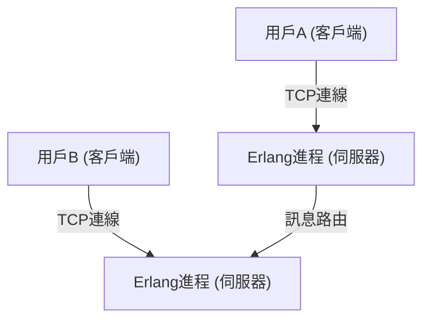
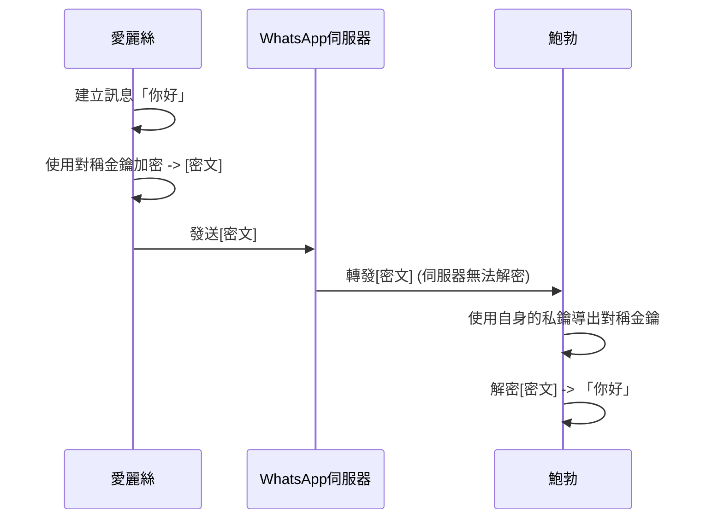

## 1. 簡介：作為連結全球的基礎設施的 WhatsApp

在現代社會中，通訊基礎設施已經變得與水、電和網際網路本身一樣重要。其中，在全球擁有超過 20 億活躍用戶的 WhatsApp，可以說已經超越了單一企業服務的範疇，成為了全球通訊的核心。

由 Jan Koum（揚·庫姆）和 Brian Acton（布萊恩·阿克頓）於 2009 年創立的 WhatsApp，最初的目標非常簡單，就是成為 SMS 的替代品。當時的行動通訊環境中，各國的 SMS 計費方式和字數限制各不相同，跨境通訊面臨很高的門檻。WhatsApp 透過使用網際網路連線，打破了這些限制，實現了「任何人、在任何地方、都能免費」收發訊息的環境。

本文將深入探討 WhatsApp 為何能如此普及、其根本的「簡約」哲學，以及目前在技術上支撐 WhatsApp 的最大支柱——「端到端加密（End-to-End Encryption, E2EE）」的機制，並結合技術與歷史背景進行分析。

## 2. 作為哲學的「簡約」與「無廣告」

談到 WhatsApp 的成功，絕對不能忽略創辦人們堅定的哲學。他們從初期就提出了「無廣告、無遊戲、無噱頭（No Ads, No Games, No Gimmicks）」的政策。當時許多應用程式為了將廣告收入最大化，紛紛導入吸引用戶注意的複雜功能和遊戲化設計，而 WhatsApp 則始終專注於「確實送達訊息」這一件事上。

### 2.1. 將使用者介面精簡到極致

WhatsApp 的 UI/UX 令人驚訝地簡單。打開應用程式，看到的只有聊天列表。他們沒有不斷添加新功能，而是採取了將核心的訊息功能之穩定性與速度提升到極致的策略。這種「精簡」的美學也直接關係到技術上的最佳化。透過排除複雜的 UI 和不必要的背景處理，即使在低階智慧型手機或網路環境不穩定的新興國家中，它也能流暢地運作。這正是它在印度和巴西等龐大新興市場爆炸性普及的最大原因之一。

### 2.2. 商業模式的演變

最初，WhatsApp 採用了每年 1 美元的訂閱模式。這體現了他們「用戶是客戶，而不是產品」的信念。因為如果採用廣告模式，就必須收集和分析用戶數據。他們認為這會侵犯隱私並損害用戶體驗。即使在 2014 年被 Facebook（現為 Meta）收購後，這項方針也在一段時間內得以維持，但後來改為免費，目前主要是透過 WhatsApp Business 向企業提供 API 等作為主要收入來源。

## 3. 支撐 WhatsApp 的技術：Erlang 和 FreeBSD

WhatsApp 的後端系統是建立在非常獨特且有趣的技術堆疊上的。其中扮演核心角色的是程式語言「Erlang」和作業系統「FreeBSD」。

### 3.1. 選擇 Erlang：超高並行性與容錯性

Erlang 最初是由愛立信（Ericsson）公司在 1980 年代開發的函數式語言，用於建構電話交換機等通訊系統。它的設計目標是實現「9 個 9（99.9999999%）的可用性」，並且擁有驚人的並行處理能力，可以同時執行數百萬個輕量級進程（與作業系統的執行緒不同）。

WhatsApp 是一個數億用戶同時連線並即時收發訊息的系統。透過將每個用戶的連線（TCP Socket）作為 Erlang 的輕量級進程來管理，它實現了一台伺服器處理數百萬同時連線的驚人效能，這在當時是超乎常規的。

### 3.2. 採用 FreeBSD：網路堆疊的最佳化

選擇 FreeBSD 而不是 Linux 作為伺服器的作業系統，也是早期 WhatsApp 的技術特徵。FreeBSD 以其堅固的網路堆疊而聞名。WhatsApp 的工程師們將 FreeBSD 的核心參數調整到了極致，最大化了一台伺服器可以處理的連線數。

少數的菁英工程師團隊（數十人規模）之所以能夠維運支撐數億用戶的系統，是因為他們選擇了最符合其目標的技術——Erlang 和 FreeBSD，並將其發揮到了極致。

## 4. 端到端加密（E2EE）：隱私的終極型態

2016 年，WhatsApp 預設為所有活躍用戶導入了端到端加密（E2EE）。這是資訊安全和隱私歷史上一個極為重要的里程碑。

### 4.1. 什麼是 E2EE？

端到端加密是一種只有通訊雙方（發送者和接收者）才能解密訊息內容的機制。訊息在發送者的裝置上被加密，以加密狀態通過網際網路，經過 WhatsApp 的伺服器，到達接收者的裝置，直到那裡才被解密。

重要的是，**即使是 WhatsApp 的伺服器（或營運它的 Meta 公司），在數學上也不可能看到訊息的內容**。用來解密的「金鑰」只存在於用戶的裝置上。

### 4.2. 採用 Signal Protocol

WhatsApp 的 E2EE 採用了由 Open Whisper Systems（現為 Signal Foundation）開發的「Signal Protocol」。Signal Protocol 被評為現代密碼學中最堅固、最可靠的協議之一。

Signal Protocol 的核心在於被稱為「雙棘輪演算法（Double Ratchet Algorithm）」的機制。這是一種每次發送訊息時都會生成新加密金鑰的機制。

1. **前向安全性（Forward Secrecy）**: 萬一某個時間點的金鑰外洩，在那之前的歷史訊息也不會被解密。
2. **未來安全性（Future Secrecy / Post-Compromise Security）**: 即使金鑰外洩，在繼續通訊的過程中會生成新的金鑰，因此未來訊息的安全性將會恢復。

它以 Diffie-Hellman 金鑰交換（ECDH）等公開金鑰加密方式為基礎，透過每個工作階段不斷更新和銷毀金鑰，維持了極高的安全層級。

### 4.3. 元數據與隱私的挑戰

雖然 E2EE 完全保護了訊息的「內容（Content）」，但是「誰、在什麼時候、與誰通訊」的「元數據（Metadata）」卻不在加密範圍內。WhatsApp 保留了這些元數據，並可能根據執法機構的要求進行披露。

隱私倡導者也指出了對收集和保留這些元數據的擔憂。尋求完全匿名性的用戶傾向於選擇像 Signal 這樣將元數據收集降至最低的應用程式。然而，針對 20 億龐大的用戶群，預設提供強大的 E2EE，WhatsApp 對整個社會的貢獻是不可估量的。

## 5. 社會與經濟影響

WhatsApp 的普及對全球的社會和經濟產生了巨大的影響。

### 5.1. 通訊的民主化

在開發中國家，WhatsApp 在許多情況下實際上充當了「網際網路本身」的角色。人們可以進行商務往來、與家人聯繫、獲取新聞等，而無需支付高昂的 SMS 或通話費用。特別是在非洲和南美洲，無數小型企業透過 WhatsApp 進行商品買賣和客戶支援，它已成為經濟活動的重要基礎設施。

### 5.2. 數位身分與支付

近年來，WhatsApp 正從單純的訊息傳遞走向整合數位錢包和支付功能（如 WhatsApp Pay）。在印度和巴西等地的發展已經領先一步，用戶可以直接從聊天畫面進行轉帳。利用龐大的用戶基礎，它也開始扮演推動普惠金融（Financial Inclusion）的角色。

## 6. 總結：科技與人類的交會點

WhatsApp 的發展歷程就像是一場宏大的實驗，展示了科技如何重新定義人類的通訊。在「簡約」的哲學下，利用像 Erlang 這樣堅固的技術支撐數億的流量，並透過 Signal Protocol 強力保護個人隱私。這種絕妙的平衡，正是它成長為世界上最多人使用的應用程式的原因。

我們每天漫不經心發送的一句「早安」背後，運作著堪稱人類智慧結晶的高階加密技術，以及為了將其傳遞到世界各地而最佳化到極致的分散式系統。WhatsApp 可以說是軟體工程與產品設計融合的現代傑作之一。
