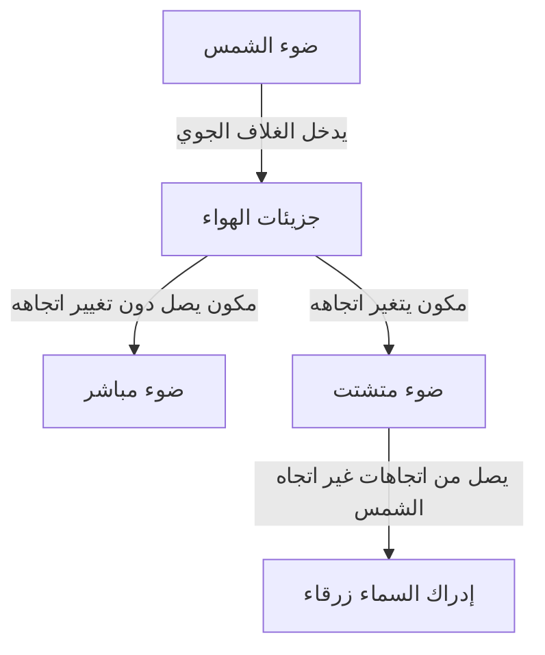
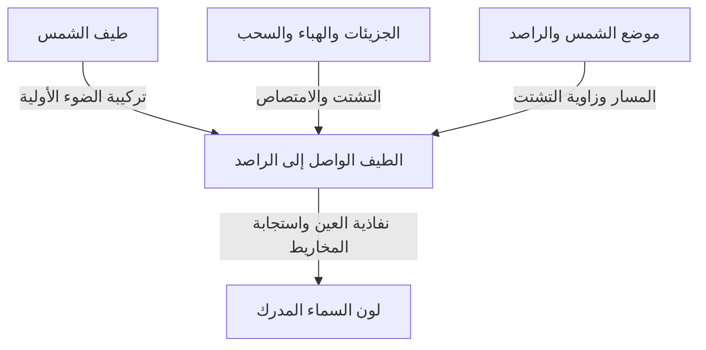

حين ننظر إلى السماء في يوم صاف، يمتد فوق رؤوسنا أزرق عميق يزداد بياضًا تدريجيًا نحو الأفق البعيد. لكن عندما تنخفض الشمس، تتحول السماء نفسها إلى الأصفر والبرتقالي، ثم يظهر بعد الغروب أزرق عميق ذو طابع آخر.

إذا وضعنا الهواء في وعاء صغير شفاف، فلن نرى لونًا يشبه الطلاء الأزرق. فمن أين تأتي الزرقة التي تغطي السماء؟

الإجابة المختصرة هي أن جزيئات الهواء تشتت ضوء الشمس، فتزداد مساهمة الضوء ذي الأطوال الموجية القصيرة في الضوء الذي يصل إلى أعيننا من السماء. غير أن هذه العبارة تخفي أسئلة مهمة: ما التشتت؟ ولماذا يختلف باختلاف الطول الموجي؟ ولماذا نرى الأزرق لا البنفسجي الأقصر موجة؟ وكيف تنتج الآلية نفسها غروبًا أحمر؟

عندما نتتبع هذه الأسئلة، ندرك أن لون السماء ليس خاصية للغلاف الجوي وحده، بل ظاهرة تصنعها ثلاثة عناصر معًا: الشمس مصدر الضوء، والغلاف الجوي الذي يغير مساراته، والعين التي تدرك اللون.

## 1. التمييز أولًا بين الضوء الآتي من الشمس والضوء الآتي من السماء

في الخارج نهارًا، يصل إلينا ضوء يسير تقريبًا مباشرة من اتجاه الشمس، وضوء يأتي من بقية اتجاهات السماء. الأول هو الضوء المباشر، والثاني ضوء السماء المتشتت. وتوجد أيضًا انعكاسات الأرض والمباني، لكن لنبدأ بالفصل بين هذين المكونين.

تخيل أنك تنظر إلى جزء من السماء والشمس خلف ظهرك. لا توجد الشمس على امتداد نظرك، ومع ذلك يدخل الضوء إلى عينيك من ذلك الاتجاه. السبب أن جزءًا من ضوء الشمس غير مساره داخل الغلاف الجوي ثم اتجه نحوك.

تستدل العين من اتجاه حركة الضوء قبل وصوله مباشرة على أن ذلك الاتجاه مضيء. لا يوجد جدار أزرق في السماء؛ إنما ترسل إلينا أجزاء واسعة من الغلاف الجوي على امتداد خط النظر ضوءًا، فنرى مجموع مساهماتها كسماء مضيئة متصلة.

لو أمكن نزع الغلاف الجوي وحده مع إبقاء الشمس والأرض كما هما، لبقيت المناطق المعرضة للشمس مضيئة، لكن السماء بعيدًا عن الشمس والأجسام العاكسة على السطح ستكون مظلمة. صور نهار القمر، حيث الأرضية المضيئة تحت سماء سوداء، تساعدنا على فهم هذا التباين.

الفكرة الأساسية أن التشتت لا يصنع ضوءًا جديدًا، بل يعيد توزيع وجهاته. فالضوء الذي يُفقد من خط النظر نحو الشمس يمكن أن يكون مصدر إضاءة السماء لمن ينظر في اتجاه آخر.

يفصل الرسم المسارات، لكن الواقع يشمل عددًا هائلًا من الجزيئات في الوقت نفسه. ليست جزيئة واحدة هي التي تجعل السماء كلها زرقاء، وليس كل ضوء تشتت مرة واحدة يصل بالضرورة إلى الراصد.

## 2. ضوء الشمس الأبيض يحتوي أطوالًا موجية متعددة

الضوء موجة كهرومغناطيسية؛ تتنقل تغيرات المجالين الكهربائي والمغناطيسي عبر الفضاء وتظهر خصائص الموجات. وتسمى المسافة بين قمتين متتاليتين الطول الموجي، ويرمز إليها عادة بالحرف اليوناني $\lambda$.

يعتمد المجال المرئي على حالة العين ومعيار اعتبار الضوء قابلًا للرؤية، لكنه يقع تقريبًا بين 380 و780 نانومترًا. النانومتر جزء من مليار جزء من المتر، لذا فالأطوال الموجية المرئية أصغر بكثير من سمك شعرة.

ضمن هذا المجال، ندرك الأطوال القصيرة كبنفسجي وأزرق، والطويلة كبرتقالي وأحمر. لكن الطبيعة لا ترسم حدودًا فاصلة بين أسماء الألوان؛ فتقسيم الألوان أيضًا تصنيف بشري لتوزيع ضوئي متصل.

لا يقتصر ضوء الشمس على طول موجي واحد، بل يشمل مجالًا واسعًا من البنفسجي إلى الأحمر، إضافة إلى فوق البنفسجي وتحت الأحمر غير المرئيين. ومع دخول مكونات مرئية مختلفة وتكيف البصر مع إضاءة المحيط، نتعامل مع ضوء النهار بوصفه إضاءة مائلة إلى الأبيض.

يفصل المنشور هذا الخليط لأن الأطوال الموجية المختلفة تسلك مسارات مختلفة فيه. أما السماء الزرقاء فليست قوس قزح عملاقًا يسقطه منشور؛ إن نسبة الضوء الذي يغير اتجاهه في الهواء تعتمد على الطول الموجي، فتتغير تركيبة الضوء الواصل من اتجاه بعيد عن الشمس.

الخلط بين الأمرين قد يقود إلى القول إن ضوء الشمس تحول إلى ضوء أزرق. في تشتت رايلي المعتاد، يبقى الطول الموجي محفوظًا تقريبًا. والمكون الأزرق الموجود أصلًا في الضوء الأبيض هو الذي يسهل توجيهه نحو مسارات أخرى.

## 3. كيف تشتت الجزيئات الشفافة الضوء؟

### هل الجزيئات مرايا صغيرة؟

النيتروجين والأكسجين هما المكونان الرئيسيان للغلاف الجوي. يشكل النيتروجين نحو 78% من حجم الهواء الجاف، والأكسجين نحو 21%، وتضم النسبة الباقية الأرجون وغيره. ولأن بخار الماء يتغير حسب المكان والطقس، فهذه الأرقام تخص الهواء بعد استبعاد بخار الماء.

جزيئات النيتروجين والأكسجين أصغر بكثير من الأطوال الموجية المرئية. لذلك فإن تصويرها كمرايا عادية ترتد الأشعة عن أسطحها لا يكفي لتفسير الاعتماد القوي على الطول الموجي.

في صورة أقرب إلى الفيزياء، يؤثر المجال الكهربائي للضوء بقوى على إلكترونات الجزيء ونواه. تنزاح توزيعات الشحنة السالبة والموجبة قليلًا بعضها عن بعض، فينشأ انحياز كهربائي يسمى الاستقطاب.

إذا اهتز المجال مع الزمن، اهتز هذا الانحياز أيضًا. وثنائي القطب الكهربائي المتذبذب يشع موجات كهرومغناطيسية إلى محيطه. تتراكب موجات الاستجابة مع الموجة الساقطة، ويظهر الضوء أيضًا في اتجاهات غير الاتجاه الأمامي. هذه هي الصورة الأساسية لفهم التشتت.

عبارة 'يشع الجزيء ضوءًا' لا تعني هنا التألق الفلوري، حيث يُمتص الضوء ثم يصدر لاحقًا، وغالبًا بلون مختلف. المقصود عملية شبه مرنة يستجيب فيها الجزيء للموجة الساقطة. يتطلب الوصف الدقيق ميكانيكا الكم، لكن اعتماد زرقة السماء الأساسي على الطول الموجي يُفهم جيدًا بهذه الصورة الكهرومغناطيسية الكلاسيكية.

### لماذا السماء مضيئة مع أن الهواء القريب شفاف؟

تشتت الضوء لا يعني انعدام الشفافية. على مسافة بضعة أمتار داخل غرفة، يكون تشتت الضوء المرئي بواسطة الجزيئات ضعيفًا، ويعبر معظم الضوء. لذلك نرى الجدار المقابل بوضوح عبر الهواء.

أما عند النظر إلى السماء، فلا يقتصر المسار على بضعة أمتار. وعلى الرغم من انخفاض الكثافة مع الارتفاع، يعبر الضوء طبقة جوية واسعة. تأثير الجزيء الواحد صغير، لكن العدد الهائل للجزيئات والمسار الطويل ينتجان ضوءًا متشتتًا يمكن رؤيته.

ليست أبعاد الجزيئات نفسها زرقاء، ولا يتحول الهواء الشفاف فجأة إلى مادة زرقاء. التفاعل الضعيف الذي يكاد لا يلاحظ على مسافة قصيرة يصبح مهمًا على مسار طويل. وتراكم التأثيرات الصغيرة هذا سمة أساسية للسماء الزرقاء.

## 4. ماذا يعني قانون القوة الرابعة للطول الموجي؟

يسمى التشتت بواسطة أجسام أصغر بكثير من الطول الموجي، مثل الجزيئات، تشتت رايلي ضمن شروط محددة. وبالنسبة للهواء في المجال المرئي، يعتمد المقطع العرضي للتشتت $\sigma$ تقريبًا على العلاقة:

$$
\sigma(\lambda) \propto \frac{1}{\lambda^4}
$$

المقطع العرضي يعبر عن قابلية حدوث التشتت بوحدة مساحة. وليس هو مجرد مساحة الشكل الهندسي للجزيء، بل مقدار يلخص مدى قوة تفاعل الضوء معه.

إذا قارنا مكونًا أزرق بطول موجي 450 نانومترًا وآخر أحمر بطول 650 نانومترًا، نحصل تقريبًا على النسبة:

$$
\frac{\sigma(450\,\mathrm{nm})}{\sigma(650\,\mathrm{nm})}
\approx \left(\frac{650}{450}\right)^4
\approx 4.35
$$

إذا كان المكونان ساقطين بالشدة نفسها، فالأزرق أكثر قابلية للتشتت بنحو 4.35 مرات. الفرق أكبر بكثير من مجرد نسبة الطولين الموجيين.

لكن ذلك لا يعني أن 'زرقة السماء تساوي 4.35 أضعاف احمرارها'. فلم نحسب بعد شدة ضوء الشمس عند كل طول موجي، أو التوهين قبل التشتت وبعده، أو اتجاه الرصد، أو حساسية العين. نسبة المقاطع العرضية واللون النهائي المدرك كميتان مختلفتان.

### لماذا القوة الرابعة لا الثانية؟

في نموذج كهرومغناطيسي بسيط، ضمن مجال يمكن فيه اعتبار قابلية استقطاب الجزيء ثابتة تقريبًا، تتناسب سعة ثنائي القطب المستحث مع المجال الساقط. أما سعة المجال الذي يشعه ثنائي القطب بعيدًا فتحتوي مربع التردد الزاوي $\omega$.

وبما أن شدة الضوء تتناسب مع مربع سعة المجال الكهربائي، يظهر العامل $\omega^4$. وفي الفراغ يتناسب $\omega$ عكسيًا مع الطول الموجي، فتنتج العلاقة $1/\lambda^4$.

هذا ليس تفسيرًا هندسيًا يقول إن الموجات القصيرة تصطدم بفجوات أصغر. إنه قانون موجي ناتج من طريقة إشعاع الشحنات المتذبذبة للموجات الكهرومغناطيسية.

ولا يجوز بالطبع تمديد هذا التقريب إلى جميع الأطوال الموجية. قرب رنين الجزيء تتغير استجابة الاستقطاب وتصبح الامتصاصات مهمة. وإذا كان المشتت كبيرًا مقارنة بالطول الموجي، فلن تتحقق شروط رايلي أصلًا. القانون قوي لكنه محدود بمجال صلاحيته.

## 5. لماذا لا تبدو السماء بنفسجية إذن؟

إذا نظرنا إلى القوة الرابعة وحدها، ينبغي للبنفسجي الأقصر موجة من الأزرق أن يتشتت بقوة أكبر. السؤال في محله: فالضوء المتشتت يحتوي بالفعل مكونات بنفسجية أيضًا.

لكن إدراك اللون لا يعمل باختيار طول موجي واحد هو الأكثر قابلية للتشتت. يصل إلى العين خليط واسع من الأطوال الموجية، ويتلقى الجهاز البصري التركيبة بأكملها.

أولًا، ليست شدة الطيف الشمسي متساوية عند كل الأطوال الموجية. ثم تعدلها نفاذية الغلاف الجوي وتشتته. وتضاف بعد ذلك خصائص انتقال الضوء داخل العين وحساسية خلايا الشبكية.

في الإضاءة القوية، تعتمد رؤية الألوان أساسًا على ثلاثة أنواع من المخاريط: S وM وL، الأكثر حساسية نسبيًا للأطوال القصيرة والمتوسطة والطويلة. وهي ليست مفاتيح منفصلة لا تستجيب إلا للأزرق أو الأخضر أو الأحمر؛ مجالات حساسيتها واسعة ومتداخلة.

يبني الدماغ اللون بمقارنة استجابات هذه الخلايا. وحتى عندما يغلب الضوء القصير الموجة في السماء، فإن مجموعة استجابات المخاريط في نهار صاف تُدرك عادة كأزرق أو أزرق مائل إلى البنفسجي. وانخفاض الحساسية البشرية عند الطرف البنفسجي مهم أيضًا. يميز [شرح ناسا للموجات الكهرومغناطيسية](https://science.nasa.gov/ems/03_behaviors/) بين التشتت والحساسية البصرية.

لذلك لا يكفي القول إن 'الغلاف الجوي يمتص البنفسجي كله'. فالضوء البنفسجي المرئي يصل إلى الأرض أيضًا. كما أن فوق البنفسجي ليس البنفسجي المرئي نفسه، ولا يمكن استخدام امتصاص الأوزون للأشعة فوق البنفسجية مباشرة لتفسير غياب السماء البنفسجية.

وبالمثل، ليس دقيقًا القول إن 'السماء بنفسجية حقًا لكن العين تخطئ'. الطيف بوصفه كمية فيزيائية، وتجربة اللون التي ينشئها البصر، وصفان لمرحلتين مختلفتين. العين لا تتعطل؛ بل تفسر الضوء المختلط بالقواعد المعتادة نفسها.

## 6. السماء الزرقاء ترسل إلينا ضوءًا أحمر أيضًا

إذا فحصنا السماء بمطياف، فلن نجد خطًا أزرق منفردًا. توجد أيضًا أطوال موجية تقابل الأحمر والأخضر. يظهر المجموع أزرق لأن الطرف القصير الموجة معزز نسبيًا.

هذا فرق مهم بين ضوء السماء وبين صمام LED أزرق أو ليزر أزرق. فضوء يتركز في نطاق ضيق وخليط واسع ذو ميل طيفي معين قد يتشابهان في اللون من دون أن يتطابق طيفاهما.

ومن هنا نفهم صعوبة إعادة إنتاج لون السماء بدقة. شاشة الحاسوب تجمع عادة إشعاعات حمراء وخضراء وزرقاء. وإذا أنتجت استجابات متشابهة في المخاريط، استطاعت إظهار لون مشابه رغم اختلاف طيفها عن ضوء السماء الحقيقي.

وبالعكس، يعتمد لون السماء المصورة على حساسية المستشعر وتوازن الأبيض والتعريض ومعالجة الصورة والشاشة المستخدمة. لذلك لا يدل الأزرق الأشد في صورة وحده على تشتت جزيئي أقوى في الغلاف الجوي.

تجنب الربط الصارم واحدًا لواحد بين الطول الموجي واللون. فهذا يساعد على جمع مسألة البنفسجي وألوان الصور وعمل الشاشات ضمن منظور واحد.

## 7. الغروب أحمر لأن مسار الضوء الذي نراه يتغير

زرقة النهار واحمرار الغروب ليسا ظاهرتين منفصلتين بلا علاقة. كلاهما مرتبط باختلاف قابلية التشتت مع الطول الموجي، لكن المسار الذي نركز عليه يتغير.

عندما تكون الشمس عالية، يكون الطريق إلى السطح قصيرًا نسبيًا. وعندما تقترب من الأفق، يمر الضوء مائلًا عبر مسافة جوية أطول. وخلال ذلك، تُزال المكونات القصيرة بسهولة أكبر من الحزمة المباشرة، فتزداد نسبة الأحمر والبرتقالي المتبقية في الضوء الآتي من اتجاه الشمس.

إذن للحقيقة نفسها، وهي أن الأزرق يتشتت بسهولة أكبر، وجهان: تجعل السماء البعيدة عن الشمس زرقاء، وتجعل الضوء المباشر بعد مسار طويل محمرًا. يوضح [NASA Space Place](https://spaceplace.nasa.gov/blue-sky/en/) هذا التغير في طول المسار بالرسوم.

لكن ليس كل احمرار السماء المسائية ضوءًا شمسيًا مباشرًا يدخل العين. فالضوء الذي صار محمرًا قد يتشتت مجددًا بواسطة الجزيئات والجسيمات، أو ينعكس ويتشتت على السحب، فيصل من اتجاهات بعيدة عن الشمس. وتحمر السحب لأن لون الضوء الذي يضيئها قد تغير.

### نفكر في سماكة الهواء على امتداد المسار

في نموذج جوي مستو بسيط، إذا كانت زاوية الشمس عن سمت الرأس هي $z$، فإن نسبة طول المسار إلى المسار العمودي تقارب:

$$
m \approx \frac{1}{\cos z}
$$

مثلًا، تعطي $z=60^\circ$ تقديرًا يساوي الضعف. لكن العلاقة تفشل قرب الأفق: فهي تتجه إلى اللانهاية عندما تقترب $z$ من 90 درجة، بينما المسافة الفعلية ليست لا نهائية. نحتاج حينها إلى تضمين انحناء الأرض وتناقص الكثافة مع الارتفاع والانكسار.

تصور رسوم الغروب الغلاف الجوي كثيرًا كقشرة كثيفة ذات كثافة ثابتة. هذا مخطط لتوضيح اختلاف الاتجاه، لا وصف حرفي. فلا سقف صلب ينتهي عنده الهواء فجأة، ولا طبقة متساوية الكثافة في كل مكان.

## 8. العمق البصري يحول لون السماء إلى لغة حسابية

حتى عند ثبات المسافة الفيزيائية، يختلف التشتت والامتصاص باختلاف كثافة الهواء وكمية الجسيمات. لذلك نستخدم كمية تسمى السماكة البصرية أو العمق البصري، ورمزها $\tau$.

في الحالة البسيطة التي تشمل التشتت الجزيئي فقط، إذا كانت الكثافة العددية للجزيئات على المسار $n(s)$، نكتب:

$$
\tau_{\mathrm{R}}(\lambda)=\int n(s)\,\sigma(\lambda)\,ds
$$

تمثل $s$ المسافة على المسار. نضرب الكثافة في المقطع العرضي ثم نجمع على امتداد الطريق. ووحدات المتر المكعب المعكوس والمتر المربع والمتر تتلاشى، لذا فإن $\tau$ بلا أبعاد.

إذا رمزنا إلى عمق الانطفاء البصري، متضمنًا الامتصاص وتشتت الهباء الجوي، بـ $\tau_{\mathrm{ext}}$، فإن الضوء المباشر غير المتشتت يتناقص في نموذج بسيط وفق:

$$
I_{\mathrm{direct}}(\lambda)=I_0(\lambda)\exp[-\tau_{\mathrm{ext}}(\lambda)]
$$

مع كل زيادة صغيرة في الطريق، تُزال نسبة من الضوء المتبقي. لا نطرح في كل مرة مقدارًا مطلقًا ثابتًا من حزمة فقدت أصلًا جزءًا كبيرًا منها. لذلك يكون التناقص أسيًا لا خطيًا.

ولا تكفي هذه المعادلة وحدها لحساب سطوع السماء الزرقاء؛ فهي تتبع ما يخرج من الحزمة المباشرة. أما الضوء الذي يتشتت إلى داخل خط النظر فيجب إضافته بصورة منفصلة.

لحساب الضوء الواصل من اتجاه معين، نضرب عند كل نقطة شدة الشمس الواصلة إليها في احتمال التشتت نحو الراصد، ثم في النسبة التي تبقى حتى تصل إليه، ونكامل على امتداد خط النظر. لون السماء ليس لون نقطة واحدة، بل مجموع مساهمات موزعة على مسار طويل.

## 9. لماذا تختلف الزرقة بين أجزاء السماء؟

المقارنة بين الأزرق فوق الرأس والأزرق الباهت عند الأفق تكشف أن السماء ليست موحدة حتى في اليوم نفسه. يتغير مقدار الغلاف الجوي الذي نخترقه بالنظر، وتتغير كذلك مساهمة الهباء القريب من السطح والتشتت المتعدد.

نحو الأفق، نرى عبر مسافة طويلة من الهواء المنخفض. وهناك، إلى جانب الجزيئات، جسيمات دقيقة وقطيرات تضيف أطوالًا موجية متعددة إلى خط النظر. وعندما يختلط هذا الضوء الأكثر بياضًا بالأزرق الأصلي، تقل زرقة اللون المشبعة.

كما يمكن لضوء السماء المتشتت أن يتشتت أو يُمتص مرة أخرى قبل بلوغ العين. لذلك تصل فكرة 'كلما زاد الهواء زاد الأزرق' إلى حدودها. يجب التعامل مع العمليات التي تضيف الضوء والتي تزيله معًا.

قد تبدو السماء أعمق زرقة فوق الجبال، لكن لا توجد علاقة تناسب بسيطة بين الارتفاع والزرقة. تتداخل قلة الهواء فوق الراصد، والابتعاد عن عوالق الطبقات المنخفضة، والتباين مع سطوع المحيط. وقد تبقى السماء بيضاء نسبيًا على الجبال بحسب الرطوبة والظروف الجوية.

وللسبب نفسه، لا يصح الجزم بأن الأيام الجافة زرقاء دائمًا أو أن الهواء بعد المطر صاف دائمًا. بخار الماء نفسه ليس ضبابًا مرئيًا؛ وقد يؤثر عبر امتصاص الجسيمات للرطوبة وتكون السحب والضباب. ومن الصعب استنتاج الرطوبة أو التلوث بصورة فريدة من لقطة واحدة للسماء.

## 10. لماذا لا تتحول السحب البيضاء إلى اللون الأزرق؟

السحب أيضًا تشتت ضوء الشمس. والسبب الرئيسي لبياضها أن أحجام العناصر المشتتة فيها تختلف كثيرًا عن أحجام جزيئات الهواء.

أبعاد قطيرات الماء السائل في السحب تكون عادة في مرتبة الميكرومتر أو أكبر، وكثير منها أكبر من الأطوال الموجية المرئية. وتوجد سحب من بلورات الجليد أيضًا. في هذا المجال، لا يمكن تطبيق قانون القوة الرابعة الجزيئي مباشرة.

نظرية مي من النظريات الأساسية لوصف التشتت بواسطة الجسيمات الكروية. تحدد نسبة حجم الجسيم إلى الطول الموجي ومعامل الانكسار وغيرها مقدار الضوء المتشتت في كل اتجاه. وبما أن السحب تحتوي أعدادًا كبيرة من أحجام مختلفة، فإنها تشتت مجالًا واسعًا نسبيًا من الضوء المرئي، فتبدو بيضاء تحت الشمس.

ولا يعني البياض أن جميع الأطوال الموجية تتشتت بالنسب نفسها تمامًا. لكل قطيرة اعتماد معقد على الطول الموجي والزاوية. لكن جمع الأحجام والمسارات المختلفة يجعل الضوء الواصل أقل انحيازًا للموجات القصيرة من ضوء السماء الزرقاء.

لماذا تكون قاعدة سحابة المطر رمادية داكنة؟ في السحب السميكة، يتشتت الضوء مرات كثيرة، وتزداد الأجزاء التي تعود إلى الأعلى أو تخرج من الجوانب. وإذا قل ما يصل إلى القاعدة، بدت داكنة من الأرض. لا تتحول قطيرات الماء إلى مادة رمادية.

يمكن تفسير حواف السحب المضيئة وقواعدها الداكنة كذلك بمسارات الضوء داخلها وخارجها. ومن الخطأ اختزال الفرق إلى ماء نظيف في السحابة البيضاء وماء متسخ في السحابة الرمادية.

## 11. هل تغير العوالق والدخان والغبار اللون بالطريقة نفسها؟

تسمى الجسيمات الصلبة الدقيقة والقطيرات المعلقة في الهواء معًا الهباء الجوي. وهي تشمل ملح البحر وغبار التربة وجسيمات الدخان، وتُدرس منفصلة عن جزيئات الغاز نفسها.

تختلف خصائصها البصرية بحسب توزيع الأحجام والشكل والتركيب. بعضها يشتت الضوء بقوة، وبعضها، مثل السخام، يكون الامتصاص فيه مهمًا. لذلك لا يمكن تفسير السماء البيضاء المعتمة والسماء البنية كلتيهما بمجرد زيادة الضوء الأزرق.

بالنسبة للجسيمات الأكبر من الجزيئات، قد تكون النزعة إلى التشتت الأمامي، أي قرب اتجاه الانتشار الأصلي، مهمة. ويرتبط الوهج الأبيض الواسع حول الشمس بهذه الحساسية للاتجاه. لكن النظر قرب الشمس خطر حتى بالعين المجردة؛ فلا تحدق فيها للتحقق من الظاهرة.

ولا يصح القول إن تلوث الهواء يجعل الغروب أجمل وأكثر احمرارًا دائمًا. قد تعزز كمية معتدلة من الجسيمات بعض الألوان في ظروف معينة، لكن الدخان أو الغبار الكثيفين قد يخفضان الضوء بشدة فيصبح المشهد باهتًا. وتتغير النتيجة مع ارتفاع السحب والشمس وتوزيع الجسيمات.

لأن أسبابًا متعددة تشترك في لون الجو، لا يكفي اللون وحده لتحديد السبب. تجمع القياسات العلمية أطوالًا موجية واستقطابات واتجاهات مختلفة لتقدير كمية الجسيمات وصفاتها. وهكذا يصبح سؤال السماء اليومية مدخلًا إلى الاستشعار عن بعد للغلاف الجوي.

## 12. لضوء السماء خاصية أخرى: الاستقطاب

إلى جانب الطول الموجي والشدة، للضوء اتجاه يهتز فيه المجال الكهربائي. يسمى تفضيل اتجاهات معينة الاستقطاب. وضوء السماء الصافية مستقطب جزئيًا بدرجة تعتمد على اتجاه الرصد.

في تشتت رايلي المثالي، عندما يتشتت ضوء ساقط غير مستقطب مرة واحدة، يكون اعتماد الشدة على زاوية التشتت $\theta$ تقريبًا:

$$
I(\theta)\propto 1+\cos^2\theta
$$

زاوية التشتت هي الزاوية بين اتجاه الانتشار قبل الحدث وبعده. وحتى في الاتجاه الجانبي، عند 90 درجة، لا تكون الشدة صفرًا. تعبر المعادلة أيضًا عن قدرة الجزيئات على إرسال ضوء الشمس إلى الجانب.

وفي النموذج المثالي نفسه، تكون درجة الاستقطاب الخطي:

$$
P(\theta)=\frac{\sin^2\theta}{1+\cos^2\theta}
$$

تبلغ الدرجة أقصاها عند 90 درجة ضمن هذا التقريب. أما السماء الحقيقية فتتضمن خصائص الجزيئات والتشتت المتعدد والهباء وانعكاسات الأرض، فلا تحقق بالضرورة الاستقطاب الكامل الذي يتنبأ به المثال المثالي.

إذا نظرت إلى جزء أزرق بعيد عن الشمس عبر مرشح استقطاب وأدرته، فقد يتغير سطوع السماء. هذه إحدى طرق تأثير المرشح الفوتوغرافي في عمق الزرقة. يوضح [HyperPhysics بجامعة ولاية جورجيا](https://hyperphysics.phy-astr.gsu.edu/hbase/phyopt/skypol.html) العلاقة بين اتجاه الرصد والاستقطاب.

تضم العدسة واسعة الزاوية زوايا تشتت متعددة في الصورة الواحدة. لذلك قد يغمق المرشح بعض المناطق أكثر من غيرها ويصنع تفاوتًا يبدو غير طبيعي. يمكن فهم ذلك بوصفه إظهارًا لنمط استقطاب السماء، لا عيبًا في المرشح.

## 13. لماذا يبقى الأزرق بعد اختفاء الشمس؟

الغروب ليس اللحظة التي تتوقف فيها الشمس عن إضاءة الغلاف الجوي كله. حتى بعد اختفائها عن الراصد الأرضي، تظل مناطق مرتفعة مضاءة. ويصل الضوء المتشتت منها إلى السطح، فلا يحل الظلام الكامل فورًا.

يدخل أيضًا التشتت المتعدد: فالضوء المتشتت في موضع قد يتشتت ثانية في موضع آخر. يمكن أن يركز الشرح النهاري الأساسي على تشتت واحد، لكن مسارات الشفق الطويلة والمعقدة تجعل هذا التقريب وحده غير كاف.

وقد يصبح دور الأوزون مهمًا هنا. فهو معروف بامتصاص فوق البنفسجي، لكنه يمتلك كذلك نطاق امتصاص واسعًا في المرئي يسمى نطاق شابوي. وعلى المسارات الطويلة، يؤثر هذا الامتصاص الانتقائي في لون السماء المسائية.

لذلك يصعب تفسير الأزرق العميق في الساعة الزرقاء بتشتت رايلي المفرد نفسه المستخدم لنهار صاف. نحتاج إلى جمع الشكل الكروي للغلاف الجوي، والمناطق المظللة، والأوزون، والهباء، والتشتت المتعدد. ويحسب [تقرير تقني لناسا](https://ntrs.nasa.gov/citations/19730020661) مساهمات الأوزون والهباء في لون الشفق.

لا تناقض بين القول إن التشتت الجزيئي هو السبب الرئيسي لزرقة النهار، والقول إن الامتصاص يؤثر أيضًا في الشفق. إن وزن كل عملية يتغير مع الوقت والاتجاه والحالة الجوية.

## 14. البحر الأزرق والجبال الزرقاء والأرض من الفضاء

### انعكاس البحر وحده لا يفسر زرقة السماء

يقال أحيانًا إن السماء زرقاء لأنها تعكس لون البحر. لكن السماء زرقاء أيضًا في الداخل البعيد عن البحار. إذا توفرت إضاءة وغلاف جوي مناسبان، يمكن للتشتت الجزيئي أن ينتج الزرقة من دون بحر.

وبالمقابل، يعكس سطح البحر فعلًا ضوء السماء ويؤثر ذلك في مظهره. لكن لا يمكن اختزال زرقة البحر كلها في انعكاس مرآة. يمتص الماء الضوء الأحمر انتقائيًا على المسارات الطويلة، ويؤدي ذلك مع التشتت داخل الماء إلى عودة ضوء أزرق. وفي الساحل يؤثر القاع والمواد العالقة والعوالق النباتية أيضًا. يشرح [NOAA لون المحيط](https://oceanservice.noaa.gov/facts/oceanblue.html) من خلال امتصاص الماء للضوء الأحمر.

تؤثر السماء والبحر في مظهر بعضهما، لكن ليس هناك سبب واحد متطابق لزرقتهما. وتشابه الألوان لا يبرر افتراض الآلية نفسها دائمًا.

### الجبال البعيدة زرقاء لأن الهواء يقع بينها وبين العين

حين تبدو الجبال البعيدة مزرقة وباهتة الحدود، يضعف الضوء الآتي منها أثناء عبوره الهواء، بينما تضيف الجزيئات على الطريق ضوءًا متشتتًا إلى خط النظر. تسمى هذه الإضافة أحيانًا الضوء الجوي أو airlight.

الجبل لم يُطلَ بالأزرق، بل تراكبت على صورته مساهمة الهواء بينه وبين الراصد. والمنظور الجوي في الرسم، الذي يجعل الأجسام البعيدة أبهت وأزرق، يستفيد من هذه الظاهرة اليومية. لكن لون الضوء المضاف يتغير أيضًا في الغشاوة الكثيفة أو إضاءة المساء.

تجمع زرقة الأرض من الفضاء ضوء سطح البحر وداخله، والتشتت الجوي، والسحب، وغيرها. تختلف زاوية الرؤية والمسارات عن النظر إلى السماء من الأرض. وحتى عبارة 'الأرض زرقاء' تضم عدة ظواهر بصرية.

## 15. هل الغروب الأزرق على المريخ ينقض القوة الرابعة؟

تظهر بعض صور المركبات المريخية زرقة قرب الشمس عند الغروب. ولأنها تبدو عكس غروب الأرض الأحمر، قد نعتقد أن تفسير رايلي قد انهار.

لكن الغبار الدقيق في الجو يلعب دورًا كبيرًا في ألوان المريخ. هذه ليست شروط نموذج بسيط تهيمن عليه الجزيئات وحدها. إن أحجام الجسيمات وخصائصها تغير اعتماد التشتت على الاتجاه عند كل طول موجي.

قد يبرز توزيع الضوء العابر للغبار المريخي المكونات الزرقاء في منطقة ضيقة قرب الشمس مساءً. ولا يعني ذلك أن السماء المريخية كلها زرقاء دائمًا كنهار صاف على الأرض. تعرض [صورة غروب بيرسيفيرانس المنشورة لدى ناسا](https://science.nasa.gov/resource/mastcam-zs-first-martian-sunset/) مثالًا لهذا الضوء المزرق.

قوانين الطبيعة لا تتبدل اعتباطيًا من مكان إلى آخر. الذي يتبدل هو تركيب الغلاف الجوي، والجسيمات، وطول المسار، واتجاه الرصد. تعطي الكهرومغناطيسية نفسها ألوانًا مختلفة عندما تختلف الشروط.

ويمكن توسيع الفكرة إلى كواكب تدور حول نجوم أخرى. إذا اختلف طيف المصدر والغلاف الجوي والسحب، فلن تكون السماء الزرقاء أمرًا مضمونًا. اللون المألوف على الأرض أحد مظاهر قوانين عامة تعمل ضمن ظروف أرضية خاصة.

## 16. ماذا يمكن أن نلاحظ في المنزل؟

### تجربة الماء وقليل من الحليب

املأ وعاء شفافًا بالماء، وأضف الحليب بكميات صغيرة جدًا تدريجيًا، ثم أضئه جانبيًا بمصباح LED أبيض. في غرفة معتمة قليلًا، قارن الضوء المشاهد من جانب مساره بالضوء النافذ الذي تسقطه على ورقة بيضاء.

عند تركيز وطول مسار مناسبين، قد يظهر اختلاف بين لون الضوء المتشتت جانبيًا والنافذ. وإذا زادت الجسيمات كثيرًا، يصبح الخليط أبيض عكرًا ولا يكاد يمر الضوء. ويتأثر الناتج كذلك بنوع المصدر وشكل الوعاء.

قيمة التجربة هي فصل الضوء الخارج إلى الجانب عن الضوء النافذ إلى الأمام. لكن جسيمات الحليب أكبر بكثير من جزيئات النيتروجين والأكسجين ولها توزيع أحجام. لذلك ليست التجربة إعادة دقيقة لتشتت رايلي الجوي، ولا قياسًا لقانون القوة الرابعة.

حتى المصباح الأبيض لا يحتوي بالضرورة أطوالًا مرئية مستمرة ومتساوية. في ضوء الهاتف، مثلًا، ينعكس طيف LED على النتيجة. وإذا لم تر الأزرق، فلا تستنتج خطأ تفسير التشتت؛ بل قارن شروط النموذج بشروط الجو الحقيقي.

### مقارنة السماء بمرشح استقطاب

قد يكشف مرشح تصوير مستقطب أو نظارات مستقطبة تغير سطوع السماء البعيدة عن الشمس عند تدويره. ومقارنة السحب والأفق تبين أن ضوء السماء ليس متجانس الخصائص.

لا تنظر إلى الشمس أثناء ذلك. النظارات الشمسية والمرشحات المستقطبة العادية ليست مرشحات آمنة للرصد الشمسي. تجنب أيضًا النظر المباشر عبر منظار أو تلسكوب أو معين منظر بصري للكاميرا. هدف الرصد جزء آمن من السماء بعيد بما يكفي عن الشمس.

إذا سجلت صورًا، ثبّت الإطار والتعريض وتوازن الأبيض لتسهيل المقارنة. فقد تعوض الكاميرا تلقائيًا انخفاض السطوع فتضيء السماء التي أظلمت فعلًا، وتخفي التغير.

### سجل الظروف مع اللون

عند المراقبة صباحًا وظهرًا ومساءً، سجل ارتفاع الشمس التقريبي واتجاه النظر وكمية السحب والغشاوة عند الأفق. وصف مثل 'أزرق عميق فوق الرأس وأبيض بعيدًا' أو 'قاعدة السحابة فقط داكنة' أوضح في ربط المشاهدة بالفيزياء من كلمة واحدة تصف الزرقة.

لا يلزم حسم حالة الجو من مشاهدة واحدة. مقارنة الظروف، وتدوين ما خالف التوقع، والتمييز بين معالجة الكاميرا وانطباع العين: هذه الممارسات نفسها من أساسيات الملاحظة العلمية.

## 17. خطوة إضافية: الفرق بين الزجاج الشفاف والهواء

قد ينشأ الآن سؤال آخر: الزجاج يحتوي أيضًا إلكترونات ونوى تستقطب استجابة للضوء، فلماذا لا يشتت الزجاج الشفاف بقوة إلى الجوانب مثل السماء؟

عند جمع الاستجابات الصغيرة، يجب ألا ننسى طور الموجة. فسعات المجالات قد تتعزز أو تتلاشى بالتداخل. وليس صحيحًا دائمًا جمع استجابات الذرات كأن كل واحدة شدة ضوئية مستقلة.

في وسط متجانس مثالي، يؤدي تراكب الموجات الناتجة من استقطاب موزع بسلاسة مكانيًا إلى تشكيل موجة تتقدم إلى الأمام. ترتبط هذه الاستجابة الجماعية بمعامل الانكسار وانتشار الضوء. أما التشتت في اتجاهات أخرى فتهم فيه التقلبات المكانية للكثافة أو معامل الانكسار والشوائب والعيوب.

في الغاز تتحرك الجزيئات باستمرار، وتتقلب الكثافة العددية المحلية إحصائيًا. وصف التشتت الجزيئي في غاز مخلخل، ووصف التشتت الناتج من تقلبات كثافة وسط مستمر، ليسا ظاهرتين منفصلتين، بل وصفان مترابطان على مقياسين مختلفين.

للزجاج الحقيقي أيضًا تشتت ضعيف وامتصاص وانعكاسات سطحية. فهو ليس وسطًا مثاليًا متجانسًا تمامًا عديم الفقد. ومع ذلك، يساعد منظور تراكب الموجات على تصحيح فكرة أن كل ذرة إضافية تزيد التشتت الجانبي ببساطة بصورة مستقلة.

يبدأ الشرح اليومي باستجابة جزيء واحد، ثم ينتقل التحليل الأدق إلى المواضع النسبية والتداخل. فهم هذه المستويات ينقل قصة السماء من مجرد تصادم حبيبات إلى فيزياء الموجات الكهرومغناطيسية.

## 18. إلى أي حد يصح استخدام تفسير السماء الزرقاء؟

القول إن السماء زرقاء بسبب تشتت رايلي نقطة بداية فعالة جدًا لفهم نهار صاف على الأرض. لكنه ليس وعدًا بالتنبؤ بجميع ألوان السماء بمعادلة واحدة.

في جو رقيق بما يكفي، يفسر تقريب التشتت الواحد الاعتماد الأساسي على الطول الموجي والاستقطاب. أما المسارات الطويلة والأفق والسحب السميكة والشفق والدخان والغبار الكثيف فتحتاج فيزياء إضافية. يدخل الضوء إلى خط النظر ويخرج منه بالتشتت، ويُمتص، ويستقبل مساهمات منعكسة من السطح.

يتتبع انتقال الإشعاع هذا الدخول والخروج حسب الطول الموجي والاتجاه. ولحساب اللون بدقة، نجمع البنية الرأسية للجو، وموضع الشمس، والخصائص البصرية للجسيمات، وانعكاس الأرض، والاستجابة البصرية. لا نرمي النموذج المبسط بوصفه خطأ؛ نستخدمه ونحن نعرف التأثيرات التي أهملها.

حين ننظر إلى السماء، لا نرى الجزيئات واحدة واحدة. لكننا نرى في مشهد واحد تفاعل الضوء والمادة، وبنية الغلاف المحيط بالأرض، وتداخل الموجات، وعمل الحواس البشرية.

كون السماء زرقاء حقيقة مألوفة، لكنه ليس دليلًا على بساطة العالم. بل يدل على ترابط ظواهر ذات مقاييس متعددة بصورة طبيعية إلى حد أننا لا ننتبه إليها عادة. وإذا بدا أزرق الغد مختلفًا قليلًا عن أزرق اليوم، فذلك دليل جديد يدعونا للتفكير في الطريق الذي سلكه الضوء.

## المراجع

- [NASA Space Place: Why Is the Sky Blue?](https://spaceplace.nasa.gov/blue-sky/en/) — مقدمة لزرقة السماء والغروب من خلال الأطوال الموجية والمسارات الجوية.
- [NASA Science: Wave Behaviors](https://science.nasa.gov/ems/03_behaviors/) — شرح التشتت والانكسار والطول الموجي وحساسية الرؤية البشرية.
- [Georgia State University, HyperPhysics: Skylight Polarization](https://hyperphysics.phy-astr.gsu.edu/hbase/phyopt/skypol.html) — العلاقة بين استقطاب ضوء السماء واتجاه الرصد.
- [NASA NTRS: The influence of ozone and aerosols on the brightness and color of the twilight zone](https://ntrs.nasa.gov/citations/19730020661) — تقرير تقني عن دور الأوزون والهباء في حساب ألوان الشفق.
- [NOAA Ocean Service: Why is the ocean blue?](https://oceanservice.noaa.gov/facts/oceanblue.html) — تفسير زرقة المحيط بالامتصاص الانتقائي للضوء في الماء.
- [NASA Science: Mastcam-Z's First Martian Sunset](https://science.nasa.gov/resource/mastcam-zs-first-martian-sunset/) — غروب المريخ والضوء الأزرق المرتبط بالغبار.
