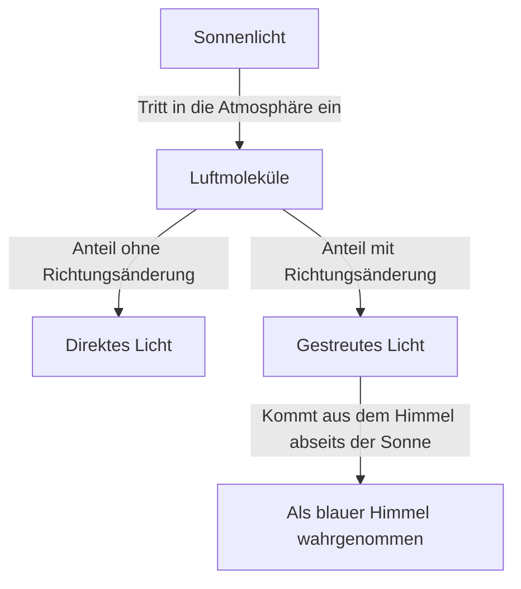
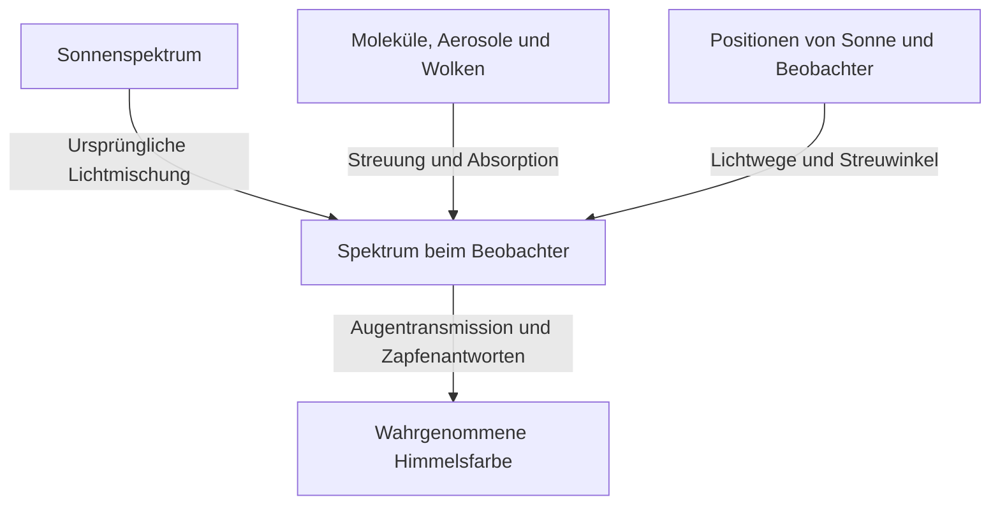

An einem klaren Tag breitet sich über uns ein tiefes Blau aus, das zum fernen Horizont hin allmählich weißlicher wird. Doch wenn die Sonne sinkt, färbt sich derselbe Himmel gelb und orange. Nach Sonnenuntergang erscheint wiederum ein anderes, tiefes Blau.

Füllt man Luft in einen kleinen durchsichtigen Behälter, sieht sie keineswegs wie blaue Farbe aus. Woher stammt also das Blau, das den Himmel bedeckt?

Die kurze Antwort lautet: Luftmoleküle streuen Sonnenlicht, sodass kurzwelliges Licht aus dem Himmel leichter unsere Augen erreicht. In diesem Satz stecken jedoch wichtige Fragen. Was ist Streuung? Warum hängt sie von der Wellenlänge ab? Warum sehen wir Blau statt des noch kurzwelligeren Violetts? Und wie kann derselbe Mechanismus einen roten Sonnenuntergang erzeugen?

Wer diesen Fragen nachgeht, erkennt, dass die Himmelsfarbe keine Eigenschaft der Atmosphäre allein ist. Die Sonne liefert das Licht, die Atmosphäre verändert seine Richtung, und unsere Augen empfinden Farbe. Erst ihr Zusammenspiel erzeugt das Phänomen.

## 1. Zuerst unterscheiden: Sonnenlicht und Himmelslicht

Im Freien erreicht uns tagsüber einerseits Licht nahezu direkt aus Richtung der Sonne, andererseits Licht aus den übrigen Richtungen des Himmels. Ersteres ist direkte Sonnenstrahlung, Letzteres gestreutes Himmelslicht. Auch Boden und Gebäude reflektieren Licht; zunächst betrachten wir jedoch diese beiden Komponenten.

Stellen Sie sich vor, Sie betrachten mit der Sonne im Rücken einen Himmelsausschnitt. In Ihrer Blickrichtung steht keine Sonne. Trotzdem fällt aus dieser Richtung Licht ins Auge. Ein Teil des Sonnenlichts hat unterwegs in der Atmosphäre seine Richtung geändert und gelangt nun zu Ihnen.

Das Auge ordnet Helligkeit der Richtung zu, aus der das Licht unmittelbar ankommt. Über uns steht keine blaue Wand. Luft entlang eines ausgedehnten Abschnitts unserer Sichtlinie sendet Licht zu uns. Die Summe dieser Beiträge erscheint als zusammenhängender heller Himmel.

Könnte man nur die Erdatmosphäre entfernen und Sonne und Boden unverändert lassen, blieben besonnte Flächen hell. Der Himmel außerhalb der Sonne und reflektierender Oberflächen wäre dagegen dunkel. Aufnahmen vom Mond am Tag, mit hellem Boden unter schwarzem Himmel, veranschaulichen diesen Gegensatz.

Entscheidend ist: Streuung erzeugt kein neues Licht, sondern verteilt seine Ziele neu. Licht, das einer zur Sonne gerichteten Sichtlinie verloren geht, kann für jemanden mit anderer Blickrichtung den Himmel aufhellen.

Das Diagramm trennt die Wege. Tatsächlich wirken gleichzeitig unvorstellbar viele Moleküle mit. Weder macht ein einzelnes Molekül den ganzen Himmel blau, noch erreicht jedes einmal gestreute Licht zwangsläufig den Beobachter.

## 2. Weißes Sonnenlicht enthält viele Wellenlängen

Licht ist eine elektromagnetische Welle. Änderungen elektrischer und magnetischer Felder breiten sich im Raum aus und besitzen Welleneigenschaften. Der Abstand zwischen zwei aufeinanderfolgenden Wellenbergen heißt Wellenlänge und wird meist mit dem griechischen Buchstaben $\lambda$ bezeichnet.

Der sichtbare Bereich hängt vom Zustand des Auges und davon ab, was als wahrnehmbar gilt. Grob liegt er bei 380 bis 780 Nanometern. Ein Nanometer ist ein milliardstel Meter. Sichtbare Wellenlängen sind erheblich kleiner als die Dicke eines menschlichen Haares.

Innerhalb dieses Bereichs empfinden wir kurze Wellenlängen als violett oder blau, lange als orange oder rot. Die Natur zieht jedoch keine scharfen Grenzen zwischen Farbnamen. Diese Einteilungen sind auch menschliche Kategorien für ein kontinuierliches Spektrum.

Sonnenlicht besteht nicht aus einer einzigen Wellenlänge. Es umfasst einen breiten Bereich von Violett bis Rot sowie unsichtbares Ultraviolett und Infrarot. Verschiedene sichtbare Komponenten treffen auf das Auge, und das Sehen passt sich der Umgebungshelligkeit an. So können wir Tageslicht als weißliche Beleuchtung behandeln.

Ein Prisma trennt dieses Gemisch, weil sich verschiedene Wellenlängen darin unterschiedlich ausbreiten. Der blaue Himmel ist dagegen kein riesiger Regenbogen, den ein Prisma projiziert. Vielmehr wird je nach Wellenlänge ein anderer Anteil in der Atmosphäre umgelenkt. Dadurch verändert sich die Lichtmischung, die aus Richtungen abseits der Sonne kommt.

Verwechselt man diese Vorgänge, könnte man behaupten, Sonnenlicht werde in blaues Licht umgewandelt. Bei gewöhnlicher Rayleigh-Streuung bleibt die Wellenlänge jedoch annähernd erhalten. Schon im weißen Sonnenlicht enthaltene blaue Anteile werden lediglich leichter in andere Richtungen gelenkt.

## 3. Wie durchsichtige Moleküle Licht streuen

### Sind Moleküle winzige Spiegel?

Die Atmosphäre besteht hauptsächlich aus Stickstoff und Sauerstoff. Trockene Luft enthält nach Volumen etwa 78 Prozent Stickstoff und 21 Prozent Sauerstoff; der Rest umfasst unter anderem Argon. Da der Wasserdampfanteil mit Ort und Wetter schwankt, gelten diese Angaben für Luft ohne Wasserdampf.

Stickstoff- und Sauerstoffmoleküle sind viel kleiner als sichtbare Wellenlängen. Stellt man sie als gewöhnliche Spiegel dar, an deren Oberflächen Strahlen abprallen, erklärt das die starke Wellenlängenabhängigkeit nicht.

Ein physikalisch genaueres Bild beginnt damit, dass das elektrische Feld des Lichts Kräfte auf Elektronen und Atomkerne im Molekül ausübt. Die Verteilungen positiver und negativer Ladung verschieben sich geringfügig gegeneinander. Diese elektrische Verschiebung heißt Polarisation.

Schwingt das elektrische Feld zeitlich, schwingt auch diese Ladungsverschiebung. Ein schwingender elektrischer Dipol strahlt elektromagnetische Wellen ab. Seine Antwort überlagert sich mit der einfallenden Welle, und Licht tritt auch außerhalb der Vorwärtsrichtung auf. Das ist das grundlegende Bild der Streuung.

Dass ein Molekül Licht abstrahlt, bedeutet hier nicht, dass es Licht zunächst absorbiert, speichert und später in einer anderen Farbe leuchtet, wie bei Fluoreszenz. Gemeint ist eine annähernd elastische Antwort auf die einfallende elektromagnetische Welle. Eine strenge Behandlung benötigt Quantenmechanik, doch die grundlegende Wellenlängenabhängigkeit des blauen Himmels lässt sich bereits mit klassischer Elektrodynamik gut verstehen.

### Warum ist Luft im Alltag durchsichtig, der Himmel aber hell?

Streuung und Undurchsichtigkeit sind nicht dasselbe. Über wenige Meter innerhalb eines Zimmers ist die molekulare Streuung sichtbaren Lichts schwach; der größte Teil passiert die Luft. Deshalb sehen wir die gegenüberliegende Wand deutlich.

Beim Blick zum Himmel ist der Lichtweg jedoch erheblich länger. Zwar nimmt die Luftdichte mit der Höhe ab, doch das Licht durchquert eine mächtige Luftschicht. Die Wirkung eines einzelnen Moleküls ist gering, aber ihre enorme Anzahl und der lange Weg ergeben sichtbares Streulicht.

Weder ist die Molekülgröße selbst blau, noch verwandelt sich durchsichtige Luft plötzlich in einen blauen Stoff. Eine auf kurzer Strecke kaum bemerkbare Wechselwirkung wird auf langen Wegen bedeutsam. Diese Summierung kleiner Wirkungen ist ein wesentliches Merkmal des blauen Himmels.

## 4. Was bedeutet das Gesetz der vierten Potenz?

Streuung an Objekten, die gegenüber der Wellenlänge sehr klein sind, etwa Molekülen, heißt unter geeigneten Bedingungen Rayleigh-Streuung. Für Luft im sichtbaren Bereich lässt sich die Wellenlängenabhängigkeit des Streuquerschnitts $\sigma$ näherungsweise so schreiben:

$$
\sigma(\lambda) \propto \frac{1}{\lambda^4}
$$

Der Streuquerschnitt beschreibt die Wahrscheinlichkeit einer Streuung in Flächeneinheiten. Er entspricht nicht einfach der geometrischen Umrissfläche des Moleküls. Vielmehr fasst er zusammen, wie stark Licht und Molekül wechselwirken.

Vergleicht man damit blaues Licht bei 450 Nanometern und rotes bei 650 Nanometern, ergibt sich ungefähr:

$$
\frac{\sigma(450\,\mathrm{nm})}{\sigma(650\,\mathrm{nm})}
\approx \left(\frac{650}{450}\right)^4
\approx 4.35
$$

Bei gleich starken einfallenden Komponenten wird der blaue Anteil also etwa 4,35-mal leichter gestreut als der rote. Der Unterschied ist viel größer als das bloße Verhältnis ihrer Wellenlängen.

Das bedeutet allerdings nicht, dass der Himmel 4,35-mal so blau wie rot ist. Noch fehlen die Sonnenintensität bei jeder Wellenlänge, die Abschwächung vor und nach der Streuung, die Blickrichtung und die Empfindlichkeit des Auges. Ein Verhältnis von Streuquerschnitten ist eine andere Größe als eine wahrgenommene Farbe.

### Warum die vierte statt der zweiten Potenz?

In einem einfachen elektromagnetischen Modell ist die Amplitude des induzierten elektrischen Dipols proportional zum einfallenden elektrischen Feld, solange die Polarisierbarkeit des Moleküls nahezu unabhängig von der Wellenlänge bleibt. Die elektrische Feldamplitude, die dieser Dipol in großer Entfernung abstrahlt, enthält dagegen das Quadrat seiner Kreisfrequenz $\omega$.

Da die Lichtintensität proportional zum Quadrat der Feldamplitude ist, enthält die abgestrahlte Intensität $\omega^4$. Im Vakuum ist $\omega$ umgekehrt proportional zur Wellenlänge. Daraus folgt $1/\lambda^4$.

Es handelt sich nicht um eine geometrische Erklärung, wonach kurze Wellen auf kleinere Zwischenräume treffen. Das Gesetz folgt aus der Art, wie schwingende Ladungen elektromagnetische Wellen abstrahlen.

Diese Näherung darf nicht auf beliebige Wellenlängen ausgedehnt werden. In der Nähe molekularer Resonanzen verändert sich die Polarisationsantwort, und Absorption wird wichtig. Sind die Streuer gegenüber der Wellenlänge groß, gelten schon die Voraussetzungen der Rayleigh-Näherung nicht mehr. Das Gesetz ist leistungsfähig, hat aber einen begrenzten Gültigkeitsbereich.

## 5. Warum der Himmel trotzdem nicht violett erscheint

Nach dem Gesetz der vierten Potenz sollte das kurzwelligere violette Licht noch stärker streuen als blaues. Diese Frage ist berechtigt. Tatsächlich enthält das Streulicht neben Blau auch violette Anteile.

Unsere Farbwahrnehmung wählt jedoch nicht einfach die am stärksten gestreute Wellenlänge aus. Ins Auge gelangt ein breites Gemisch, auf dessen gesamte Zusammensetzung das Sehsystem reagiert.

Zunächst ist das Sonnenspektrum nicht bei jeder Wellenlänge gleich stark. Hinzu kommen die wellenlängenabhängige Durchlässigkeit und Streuung der Atmosphäre. Anschließend wirken die Transmission innerhalb des Auges und die Empfindlichkeit der Netzhautrezeptoren mit.

Beim Farbsehen unter heller Beleuchtung sind hauptsächlich drei Zapfentypen beteiligt: S-, M- und L-Zapfen, die relativ empfindlich für kurze, mittlere und lange Wellenlängen sind. Sie sind keine Schalter ausschließlich für blaues, grünes und rotes Licht. Ihre breiten Empfindlichkeitsbereiche überlappen sich.

Das Gehirn erzeugt Farbe durch den Vergleich dieser Antworten. Obwohl kurzwelliges Licht im Himmelslicht bevorzugt wird, ergibt die Kombination der Zapfenreize an einem gewöhnlichen klaren Tag normalerweise Blau oder leicht violettstichiges Blau. Auch die geringe menschliche Empfindlichkeit am violetten Ende ist wesentlich. Die [NASA-Erklärung elektromagnetischer Wellen](https://science.nasa.gov/ems/03_behaviors/) unterscheidet ebenfalls zwischen Streuung und visueller Empfindlichkeit.

Die Erklärung, alles violette Licht werde von der Atmosphäre absorbiert, reicht daher nicht aus. Sichtbares Violett erreicht den Boden. Ultraviolett ist außerdem nicht dasselbe wie sichtbares Violett. Die UV-Absorption durch Ozon kann nicht einfach erklären, weshalb der Himmel nicht violett aussieht.

Ebenso unpassend wäre die Behauptung, der Himmel sei eigentlich violett und das Auge irre sich. Das physikalische Spektrum und das Farbempfinden beschreiben unterschiedliche Stufen. Unser Farbsehen funktioniert nicht fehlerhaft, sondern verarbeitet Mischlicht nach seinen gewöhnlichen Regeln.

## 6. Auch ein blauer Himmel liefert rotes Licht

Untersucht man Himmelslicht mit einem Spektroskop, erscheint nicht bloß eine einzige blaue Linie. Auch rote und grüne Wellenlängen sind vorhanden. Die kurzen Wellenlängen sind relativ stärker gewichtet, weshalb die Mischung insgesamt blau wirkt.

Das unterscheidet Himmelslicht von einer blauen LED oder einem blauen Laser. Licht in einem schmalen Wellenlängenband und ein ungleichmäßig gewichtetes breites Spektrum können ähnlich aussehen, ohne dass ihre Spektren gleich wären.

Hier zeigt sich auch die Schwierigkeit, Himmelsfarben exakt wiederzugeben. Computerbildschirme kombinieren gewöhnlich rote, grüne und blaue Emissionen. Erzeugen sie ähnliche Zapfenantworten, können sie mit einem anderen Spektrum eine dem echten Himmelslicht ähnliche Farbe darstellen.

Umgekehrt hängt das Blau eines Fotos von Sensor, Weißabgleich, Belichtung, Bildverarbeitung und Anzeigegerät ab. Ein kräftigeres Fotoblau beweist daher nicht unmittelbar stärkere molekulare Streuung.

Wellenlänge und Farbe sollten nicht zu starr eins zu eins verknüpft werden. Diese Unterscheidung hilft sowohl bei der Violettfrage als auch beim Verständnis von Fotografien und Bildschirmen.

## 7. Sonnenuntergänge sind rot, weil sich der Lichtweg verändert

Blauer Tageshimmel und Abendrot beruhen nicht auf zwei voneinander unabhängigen Prinzipien. Beide hängen mit der wellenlängenabhängigen Streuung zusammen. Anders ist der Weg des jeweils betrachteten Lichts.

Bei hoch stehender Sonne ist der Weg zum Boden vergleichsweise kurz. Nähert sie sich dem Horizont, durchquert ihr Licht die Atmosphäre auf einer langen schrägen Strecke. Dabei werden kurze Wellenlängen bevorzugt aus dem direkten Strahl entfernt, sodass das Licht aus Sonnenrichtung relativ mehr Rot und Orange enthält.

Dieselbe Tatsache – blaues Licht wird leicht gestreut – macht einerseits den Himmel abseits der Sonne blau und rötet andererseits direktes Licht nach einem langen Atmosphärenweg. [NASA Space Place](https://spaceplace.nasa.gov/blue-sky/en/) veranschaulicht die veränderte Weglänge.

Nicht das gesamte Abendrot lässt sich allerdings mit Sonnenlicht erklären, das direkt ins Auge fällt. Bereits gerötetes Licht kann anschließend an Molekülen oder Teilchen gestreut beziehungsweise von Wolken reflektiert und gestreut werden. So erreicht es auch Richtungen abseits der Sonne. Abendliche Wolken werden zinnoberrot, weil sich die Farbe ihrer Beleuchtung ändert.

### Die Dicke der Atmosphäre entlang des Wegs betrachten

In einem einfachen ebenen Atmosphärenmodell lässt sich die Weglänge relativ zur Senkrechten beim Sonnenzenitwinkel $z$ näherungsweise ausdrücken als:

$$
m \approx \frac{1}{\cos z}
$$

Bei $z=60^\circ$ ergibt das etwa den doppelten Weg. In Horizontnähe versagt die Formel jedoch. Sie wächst bei Annäherung von $z$ an 90 Grad ins Unendliche, während der reale Weg durch die Atmosphäre endlich bleibt. Erdkrümmung, abnehmende Dichte mit der Höhe und Brechung erfordern ein genaueres Modell.

Sonnenuntergangsskizzen stellen die Atmosphäre oft als dicke Schale gleichmäßiger Dichte dar. Das dient dem Vergleich verschiedener Richtungen. In Wirklichkeit besitzt die Atmosphäre weder eine harte Obergrenze noch überall dieselbe Dichte.

## 8. Mit optischer Tiefe lässt sich Himmelsfarbe quantitativ beschreiben

Gleiche geometrische Entfernungen bedeuten bei unterschiedlicher Luftdichte oder Teilchenmenge nicht gleiche Streuung und Absorption. Dafür verwendet man die optische Dicke beziehungsweise optische Tiefe, bezeichnet mit $\tau$.

Für den einfachen Fall ausschließlich molekularer Streuung und einer Teilchenzahldichte $n(s)$ entlang des Wegs gilt:

$$
\tau_{\mathrm{R}}(\lambda)=\int n(s)\,\sigma(\lambda)\,ds
$$

Dabei ist $s$ die Entfernung entlang des Lichtwegs. Zahldichte und Streuquerschnitt werden multipliziert und über den Weg summiert. Die Einheiten Kubikmeter invers, Quadratmeter und Meter kürzen sich weg: $\tau$ ist dimensionslos.

Bezeichnet $\tau_{\mathrm{ext}}$ die optische Extinktionstiefe einschließlich Absorption und Aerosolstreuung, nimmt der ungestreute direkte Strahl im einfachen Modell so ab:

$$
I_{\mathrm{direct}}(\lambda)=I_0(\lambda)\exp[-\tau_{\mathrm{ext}}(\lambda)]
$$

Jede zusätzliche kleine Wegstrecke entfernt einen bestimmten Anteil des noch vorhandenen Lichts. Es wird nicht jedes Mal derselbe absolute Betrag von einem bereits stark geschwächten Strahl abgezogen. Deshalb ergibt sich eine exponentielle statt einer linearen Abnahme.

Diese Gleichung allein liefert noch nicht die Helligkeit des blauen Himmels. Sie verfolgt Licht, das den direkten Strahl verlässt. Neu in die Blickrichtung hineingestreutes Licht muss gesondert addiert werden.

Zur Berechnung des Himmelslichts betrachtet man jeden Punkt entlang der Sichtlinie: die dort eintreffende Sonnenintensität, die Wahrscheinlichkeit einer Streuung zum Beobachter und den Anteil, der den restlichen Weg übersteht. Ihr Produkt wird entlang der Sichtlinie integriert. Der blaue Himmel ist damit nicht die Farbe eines einzelnen Punkts, sondern die Summe räumlich verteilter Beiträge.

## 9. Warum verschiedene Himmelsbereiche verschieden blau sind

Über uns ist das Blau oft kräftiger als am Horizont. Selbst am selben Tag ist die Himmelsfarbe also nicht einheitlich. Je nach Blickrichtung durchquert man unterschiedliche Luftmengen; zudem ändern sich die Beiträge bodennaher Aerosole und der Mehrfachstreuung.

In Horizontnähe blickt man lange durch die unteren Luftschichten. Dort bringen neben Molekülen auch feine Teilchen und Tröpfchen viele Wellenlängen in die Sichtlinie. Mischt sich dieses weißlichere Streulicht zum ursprünglichen Blau, sinkt dessen Farbsättigung.

Auch bereits entstandenes Himmelslicht kann vor dem Auge erneut gestreut oder absorbiert werden. Die einfache Vorstellung, mehr Atmosphäre liefere immer mehr blaues Licht, stößt deshalb an Grenzen. Lichtzufuhr und Lichtverluste müssen gemeinsam berücksichtigt werden.

Ein tiefblauer Himmel auf einem Berg folgt ebenfalls keinem einfachen proportionalen Verhältnis zwischen Höhe und Blau. Weniger Luft über dem Beobachter, Abstand zum Dunst tieferer Schichten und Helligkeitskontraste wirken zusammen. Je nach Feuchte und Atmosphäre kann der Himmel auch auf Bergen weißlich aussehen.

Ebenso garantiert ein trockener Tag kein kräftiges Blau, und Regen garantiert anschließend keine klare Sicht. Wasserdampf selbst ist kein sichtbarer Nebel; er kann durch Feuchteaufnahme von Teilchen sowie durch Wolken- und Dunstbildung wirken. Ein einziges Himmelsfoto bestimmt weder Feuchte noch Luftverschmutzung eindeutig.

## 10. Warum weiße Wolken nicht blau werden

Auch Wolken streuen Sonnenlicht. Ihr Weiß erklärt sich vor allem dadurch, dass die streuenden Objekte ganz andere Größen besitzen als Luftmoleküle.

Wolkentröpfchen sind typischerweise mikrometergroß oder größer; viele übertreffen sichtbare Wellenlängen. Manche Wolken bestehen aus Eiskristallen. In diesem Größenbereich gilt das einfache molekulare Gesetz der vierten Potenz nicht unverändert.

Eine grundlegende Theorie für kugelförmige Teilchen ist die Mie-Theorie. Teilchengröße relativ zur Wellenlänge, Brechungsindex und weitere Größen bestimmen Stärke und Richtung der Streuung. Echte Wolken enthalten viele unterschiedliche Teilchengrößen. Deshalb wird Licht über den sichtbaren Bereich relativ breit gestreut, und sonnenbeschienene Wolken erscheinen weißlich.

Weiß bedeutet nicht, dass jede Wellenlänge exakt gleich stark gestreut wird. Einzelne Tröpfchen besitzen komplizierte Wellenlängen- und Winkelabhängigkeiten. Viele Größen und Lichtwege überlagern sich jedoch zu einer Mischung, die weniger stark auf kurze Wellenlängen konzentriert ist als das blaue Himmelslicht.

Warum ist die Unterseite einer Regenwolke dunkelgrau? In einer mächtigen Wolke wird Licht oft gestreut; mehr Anteile kehren nach oben zurück oder entweichen seitlich. Erreicht weniger Licht die Unterseite, wirkt sie vom Boden aus dunkel. Die Tröpfchen sind nicht zu einem grauen Stoff geworden.

Auch helle Wolkenränder und dunkle Unterseiten lassen sich durch die Lichtwege innerhalb und außerhalb der Wolke erklären. Weiße und graue Wolken einfach mit sauberem und schmutzigem Wasser gleichzusetzen, ist falsch.

## 11. Verändern Dunst, Rauch und Staub den Himmel gleich?

Feine feste Teilchen und Flüssigkeitströpfchen, die in der Atmosphäre schweben, heißen zusammen Aerosole. Dazu gehören Meersalz, Bodenstaub und Rauchpartikel. Sie werden von Gasmolekülen unterschieden.

Ihre optischen Eigenschaften hängen von Größenverteilung, Form und Zusammensetzung ab. Manche streuen stark; bei anderen, etwa Ruß, ist Absorption wichtig. Weißlicher Dunst und ein bräunlicher Himmel lassen sich daher nicht beide als Zunahme blauen Lichts erklären.

Bei größeren Teilchen kann die bevorzugte Vorwärtsstreuung nahe der ursprünglichen Ausbreitungsrichtung wichtig werden. Ein ausgedehnter weißer Glanz um die Sonne hängt mit dieser Winkelabhängigkeit zusammen. Beobachtungen nahe der Sonne sind aber auch ohne Hilfsmittel gefährlich: Blicken Sie zum Prüfen niemals direkt in die Sonne.

Auch wird ein Sonnenuntergang nicht zwangsläufig schöner und röter, je verschmutzter die Luft ist. Eine mäßige Teilchenmenge kann Farben unter bestimmten Bedingungen verstärken; dichter Rauch oder Staub kann das Licht dagegen so stark abschwächen, dass die Szene matt wirkt. Wolkenhöhe, Sonnenstand und Teilchenverteilung beeinflussen das Ergebnis.

Da mehrere Ursachen dieselbe atmosphärische Farbe erzeugen können, reicht die Farbe allein nicht zur eindeutigen Diagnose. Wissenschaftliche Beobachtungen kombinieren Wellenlängen, Polarisation und Blickrichtungen, um Teilchenmengen und Eigenschaften abzuschätzen. Die Alltagsfrage nach dem blauen Himmel führt so zur atmosphärischen Fernerkundung.

## 12. Himmelslicht besitzt noch eine Eigenschaft: Polarisation

Licht besitzt neben Wellenlänge und Intensität auch eine Schwingungsrichtung des elektrischen Feldes. Eine bevorzugte Verteilung dieser Richtungen heißt Polarisation. Licht vom klaren Himmel ist je nach Blickrichtung teilweise polarisiert.

Bei idealisierter einmaliger Rayleigh-Streuung unpolarisierten einfallenden Lichts hängt die Intensität vom Streuwinkel $\theta$ ungefähr so ab:

$$
I(\theta)\propto 1+\cos^2\theta
$$

Der Streuwinkel liegt zwischen ursprünglicher und neuer Ausbreitungsrichtung. Bei 90 Grad, also seitlich, ist die Intensität nicht null. Auch die Formel zeigt somit, dass Luftmoleküle Sonnenlicht seitwärts lenken können.

Der Grad der linearen Polarisation lautet im selben idealen Modell:

$$
P(\theta)=\frac{\sin^2\theta}{1+\cos^2\theta}
$$

Er erreicht in dieser Näherung bei 90 Grad sein Maximum. Beim realen Himmel wirken Moleküleigenschaften, Mehrfachstreuung, Aerosole und Bodenreflexionen mit. Deshalb tritt keine perfekte Polarisation genau nach dieser Idealformel auf.

Betrachtet man den blauen Himmel weit von der Sonne entfernt durch einen Polarisationsfilter und dreht ihn, kann sich die Helligkeit ändern. Deshalb können fotografische Polfilter das Blau kräftiger erscheinen lassen. [HyperPhysics der Georgia State University](https://hyperphysics.phy-astr.gsu.edu/hbase/phyopt/skypol.html) erläutert den Zusammenhang zwischen Blickrichtung und Himmelspolarisation.

Ein Weitwinkelobjektiv erfasst verschiedene Streuwinkel gleichzeitig. Der Polfilter kann den Himmel deshalb ungleichmäßig abdunkeln und unnatürlich wirkende Flecken erzeugen. Das ist nicht unbedingt ein Filterfehler, sondern kann das Polarisationsmuster des Himmels sichtbar machen.

## 13. Warum nach Sonnenuntergang Blau zurückbleibt

Sonnenuntergang bedeutet nicht, dass kein Sonnenlicht mehr die gesamte Erdatmosphäre erreicht. Selbst wenn ein Beobachter am Boden die Sonne nicht mehr sieht, bleiben Teile der höheren Luftschichten beleuchtet. Dort gestreutes Licht erreicht den Boden, weshalb es nicht schlagartig dunkel wird.

Außerdem wirkt Mehrfachstreuung: Bereits gestreutes Licht wird andernorts erneut gestreut. Die grundlegende Tageserklärung kann sich auf einmalige Streuung konzentrieren. In der Dämmerung werden die Wege jedoch länger und komplizierter; diese Näherung genügt dann nicht mehr.

Auch Ozon kann wichtig werden. Es ist für UV-Absorption bekannt, besitzt aber im sichtbaren Bereich ein breites Absorptionsband, das Chappuis-Band. Auf langen Wegen beeinflusst diese selektive Absorption die abendliche Himmelsfarbe.

Das tiefe Blau der sogenannten blauen Stunde lässt sich daher kaum vollständig mit derselben einfachen Rayleigh-Einzelstreuung wie am Tag erklären. Eine kugelförmige Atmosphäre, abgeschattete Bereiche, Ozon, Aerosole und Mehrfachstreuung müssen zusammen betrachtet werden. Ein [technischer NASA-Bericht](https://ntrs.nasa.gov/citations/19730020661) berechnet Beiträge von Ozon und Aerosolen zur Dämmerungsfarbe.

Die Aussagen, molekulare Streuung sei tagsüber die Hauptursache des blauen Himmels und Absorption beeinflusse Dämmerungsfarben, widersprechen einander nicht. Je nach Tageszeit, Richtung und Atmosphäre verschieben sich die Gewichte der Prozesse.

## 14. Blaues Meer, blaue Berge und die blaue Erde aus dem All

### Der blaue Himmel ist nicht bloß eine Spiegelung des Meeres

Manchmal heißt es, der Himmel spiegle das Meer und sei deshalb blau. Doch auch weit im Landesinneren ist der Himmel blau. Mit geeigneter Atmosphäre und Lichtquelle entsteht ein molekular gestreuter blauer Himmel auch ohne Meer.

Die Meeresoberfläche reflektiert tatsächlich Himmelslicht und beeinflusst dadurch das Aussehen des Wassers. Aber auch das Meeresblau lässt sich nicht vollständig als Spiegelbild erklären. Wasser absorbiert auf langen Wegen bevorzugt rotes Licht. Zusammen mit Streuung im Wasser führt dies dazu, dass blaues Licht zurückkommt. In Küstengewässern verändern zudem Meeresboden, Schwebstoffe und Phytoplankton die Farbe. Die [NOAA-Erklärung zur Meeresfarbe](https://oceanservice.noaa.gov/facts/oceanblue.html) erläutert die Absorption roten Lichts durch Wasser.

Himmel und Meer beeinflussen ihr gegenseitiges Erscheinungsbild, verdanken ihr Blau aber nicht einer einzigen identischen Ursache. Ähnliche Farben müssen nicht denselben Mechanismus besitzen.

### Ferne Berge erscheinen blau, weil zwischen ihnen und uns Luft liegt

Wenn ferne Berge bläulich wirken und ihre Umrisse verblassen, wird ihr eigenes Licht in der Atmosphäre abgeschwächt, während die dazwischenliegende Luft Streulicht in die Sichtlinie einbringt. Dieser zusätzliche Beitrag heißt auch Luftlicht oder Airlight.

Die Berge tragen keinen blauen Anstrich; ihre Strahlung überlagert sich mit atmosphärischen Beiträgen. Die Luftperspektive in der Malerei, bei der Ferne heller und bläulicher dargestellt wird, nutzt dieses alltägliche Phänomen. Bei dichtem Dunst oder abendlicher Beleuchtung kann das hinzugefügte Licht allerdings eine andere Farbe haben.

Das Blau der Erde aus dem All enthält Licht von Meeresoberflächen und aus dem Wasser, atmosphärische Streuung, Wolken und weitere Beiträge. Der Blick vom Boden nach oben und der Blick auf den ganzen Planeten besitzen unterschiedliche Perspektiven und Lichtwege. Schon die Aussage, die Erde sei blau, umfasst mehrere optische Phänomene.

## 15. Widerlegt ein blauer Mars-Sonnenuntergang das Gesetz der vierten Potenz?

Marsaufnahmen zeigen abends gelegentlich Blau in Sonnennähe. Das scheint dem roten irdischen Sonnenuntergang entgegengesetzt und könnte wie eine Widerlegung der Rayleigh-Erklärung wirken.

Die Himmelsfarbe des Mars wird jedoch wesentlich von feinem atmosphärischem Staub geprägt. Das sind andere Bedingungen als im einfachen, von Molekülen dominierten Rayleigh-Modell. Teilchengröße und Material verändern die Winkelabhängigkeit der Streuung bei verschiedenen Wellenlängen.

Abends können auf dem Mars nach dem Durchgang durch Staub blaue Anteile in einem schmalen Bereich nahe der Sonne besonders hervortreten. Daraus folgt nicht, dass der gesamte Marshimmel jederzeit wie ein klarer Erdhimmel blau ist. Die von [NASA veröffentlichte Perseverance-Abendaufnahme](https://science.nasa.gov/resource/mastcam-zs-first-martian-sunset/) zeigt ein Beispiel dieses bläulichen Lichts.

Naturgesetze wechseln nicht willkürlich mit dem Ort. Anders sind Atmosphärenzusammensetzung, Teilchenarten, Weglängen und Blickrichtungen. Dieselbe Elektrodynamik erzeugt bei anderen Eingangsbedingungen andere Himmelsfarben.

Das lässt sich auf Planeten anderer Sterne erweitern. Unterscheiden sich das Spektrum der Lichtquelle, Atmosphäre und Wolken, ist ein blauer Himmel keineswegs selbstverständlich. Das vertraute irdische Blau ist eine konkrete Erscheinungsform universeller Gesetze unter erdspezifischen Bedingungen.

## 16. Was lässt sich zu Hause beobachten?

### Wasser mit wenig Milch

Füllen Sie einen transparenten Behälter mit Wasser, geben Sie sehr kleine Mengen Milch hinzu und beleuchten Sie ihn seitlich mit einer weißen LED. Vergleichen Sie in einem etwas abgedunkelten Raum den von der Seite sichtbaren Lichtweg mit dem hindurchtretenden Licht auf einem weißen Blatt Papier.

Bei geeigneter Konzentration und Weglänge können sich seitliches Streulicht und durchgelassenes Licht farblich unterscheiden. Zu viele Teilchen machen das Wasser milchig weiß und lassen kaum Licht hindurch. Lichtquelle und Behälterform beeinflussen das Ergebnis ebenfalls.

Der Wert des Versuchs liegt darin, seitwärts gestreutes und geradeaus durchgehendes Licht zu unterscheiden. Milchpartikel sind jedoch viel größer als Stickstoff- und Sauerstoffmoleküle und besitzen unterschiedliche Größen. Der Versuch ist weder eine exakte Nachbildung atmosphärischer Rayleigh-Streuung noch eine Messung des Gesetzes der vierten Potenz.

Auch weißes Licht enthält nicht zwangsläufig ein kontinuierliches gleichmäßiges sichtbares Spektrum. Bei einer Smartphone-Lampe prägt etwa das LED-Spektrum das Versuchsergebnis. Bleibt ein sichtbares Blau aus, widerlegt das nicht die Streuungserklärung. Entscheidend sind die Unterschiede zwischen Modell und realer Atmosphäre.

### Den Himmel mit einem Polfilter vergleichen

Mit fotografischen Polfiltern oder polarisierenden Sonnenbrillen lässt sich die Helligkeit des Himmels abseits der Sonne beim Drehen verändern. Vergleiche mit Wolken und Horizontbereichen zeigen, dass Himmelslicht nicht überall dieselben Eigenschaften besitzt.

Sehen Sie dabei niemals in die Sonne. Sonnenbrillen und gewöhnliche Polfilter sind keine sicheren Sonnenbeobachtungsfilter. Auch der direkte Blick durch Fernglas, Teleskop oder optischen Kamerasucher ist zu vermeiden. Beobachten Sie ausschließlich einen sicheren Himmelsbereich weit entfernt von der Sonne.

Beim Fotografieren erleichtern fester Bildausschnitt, feste Belichtung und fester Weißabgleich den Vergleich. Automatische Korrekturen können einen tatsächlich dunkler gewordenen Himmel wieder aufhellen und den Effekt verbergen.

### Nicht nur Farben, sondern auch Bedingungen aufzeichnen

Notieren Sie morgens, mittags und abends ungefähren Sonnenstand, Blickrichtung, Bewölkung und Horizontdunst. Statt nur ein Wort für das Blau zu wählen, unterscheiden Sie etwa zwischen tiefblauem Zenit und weißlicher Ferne oder ausschließlich dunklen Wolkenunterseiten. So wird der Bezug zur Physik deutlicher.

Eine einzelne Beobachtung muss keine endgültige Diagnose liefern. Wechselnde Bedingungen vergleichen, Abweichungen von Erwartungen festhalten und Kameraverarbeitung vom Seheindruck unterscheiden: Das gehört bereits zur wissenschaftlichen Beobachtung.

## 17. Einen Schritt weiter: durchsichtiges Glas und Luft

Nun ergibt sich eine weitere Frage. Auch Glas enthält Elektronen und Atomkerne und sollte durch Licht polarisiert werden. Müsste durchsichtiges Glas daher ebenfalls stark seitlich streuen wie der Himmel?

Beim Addieren vieler kleiner Antworten darf die Wellenphase nicht vergessen werden. Elektrische Feldamplituden können einander verstärken oder auslöschen. Die Helligkeiten aller Atome einfach wie unabhängige Lichtquellen zu addieren, ist nicht immer richtig.

In einem ideal homogenen Medium ergibt die Überlagerung der Wellen einer räumlich glatt verteilten Polarisation eine vorwärtslaufende Welle. Diese kollektive Antwort hängt mit Brechungsindex und Lichtausbreitung zusammen. Für Streuung in andere Richtungen sind dagegen räumliche Schwankungen von Dichte oder Brechungsindex, Verunreinigungen und Defekte wichtig.

In Gasen bewegen sich Moleküle, und die lokale Teilchenzahldichte schwankt statistisch. Molekulare Streuung in einem verdünnten Gas und Streuung an Dichteschwankungen eines kontinuierlich beschriebenen Mediums sind keine unverbundenen Phänomene. Es sind verknüpfte Beschreibungen auf unterschiedlichen Skalen.

Auch reales Glas zeigt schwache Streuung, Absorption und Oberflächenreflexion. Es entspricht keinem vollkommen homogenen verlustfreien Idealmedium. Trotzdem hilft die Wellenüberlagerung, die Vorstellung zu korrigieren, die seitliche Streuung müsse schlicht proportional mit der Anzahl vorhandener Atome steigen.

Die Alltagserklärung beginnt bei einem Molekül; die präzisere Betrachtung führt zu relativen Positionen und Interferenz. Dieser Unterschied vertieft die Erklärung des Himmels von einer Geschichte über Teilchenstöße zur Physik elektromagnetischer Wellen.

## 18. Wie weit trägt die Erklärung des blauen Himmels?

Die Aussage, der Himmel sei durch Rayleigh-Streuung blau, ist ein sehr guter Ausgangspunkt für den klaren irdischen Tageshimmel. Sie verspricht aber nicht, jede Himmelsfarbe mit einer einzigen Formel vorherzusagen.

In einer ausreichend optisch dünnen Atmosphäre erklärt die Einzelstreuungsnäherung grundlegende Wellenlängenabhängigkeiten und Polarisation. Lange Wege, Horizontnähe, dicke Wolken, Dämmerung und dichter Rauch oder Staub erfordern zusätzliche Physik. Streuung bringt Licht in die Sichtlinie hinein und entfernt es wieder; außerdem wirken Absorption und Bodenreflexion.

Diese Zu- und Abflüsse nach Wellenlänge und Richtung zu verfolgen, ist die Aufgabe des Strahlungstransports. Genaue Himmelsfarbenberechnungen verbinden vertikale Atmosphärenstruktur, Sonnenposition, optische Teilcheneigenschaften, Bodenreflexion und Sehantwort. Eine einfache Erklärung wird nicht als falsch verworfen, sondern mit klarer Kenntnis ihrer ausgelassenen Effekte verwendet.

Wenn wir zum blauen Himmel aufblicken, sehen wir keine einzelnen Moleküle. Doch in einem einzigen Landschaftseindruck sehen wir die Wechselwirkung von Licht und Molekülen, die Struktur der Erdatmosphäre, Welleninterferenz und menschliche Wahrnehmung zusammenwirken.

Dass der Himmel blau ist, beweist nicht, dass die Welt einfach wäre. Es zeigt, wie selbstverständlich Phänomene verschiedener Größenordnungen ineinandergreifen. Wenn das Blau morgen etwas anders wirkt als heute, ist auch dieser Unterschied ein Hinweis auf den Weg, den das Licht zurückgelegt hat.

## Quellen

- [NASA Space Place: Why Is the Sky Blue?](https://spaceplace.nasa.gov/blue-sky/en/) — Einführung zu blauem Himmel und Abendrot anhand von Wellenlängen und atmosphärischen Lichtwegen.
- [NASA Science: Wave Behaviors](https://science.nasa.gov/ems/03_behaviors/) — Streuung, Brechung, Wellenlängen und menschliche Sehempfindlichkeit.
- [Georgia State University, HyperPhysics: Skylight Polarization](https://hyperphysics.phy-astr.gsu.edu/hbase/phyopt/skypol.html) — Polarisation des gestreuten Himmelslichts und Blickrichtung.
- [NASA NTRS: The influence of ozone and aerosols on the brightness and color of the twilight zone](https://ntrs.nasa.gov/citations/19730020661) — Technischer Bericht zur Rolle von Ozon und Aerosolen bei Dämmerungsfarben.
- [NOAA Ocean Service: Why is the ocean blue?](https://oceanservice.noaa.gov/facts/oceanblue.html) — Meeresblau und selektive Lichtabsorption durch Wasser.
- [NASA Science: Mastcam-Z's First Martian Sunset](https://science.nasa.gov/resource/mastcam-zs-first-martian-sunset/) — Marsabend und staubbedingtes blaues Licht.
