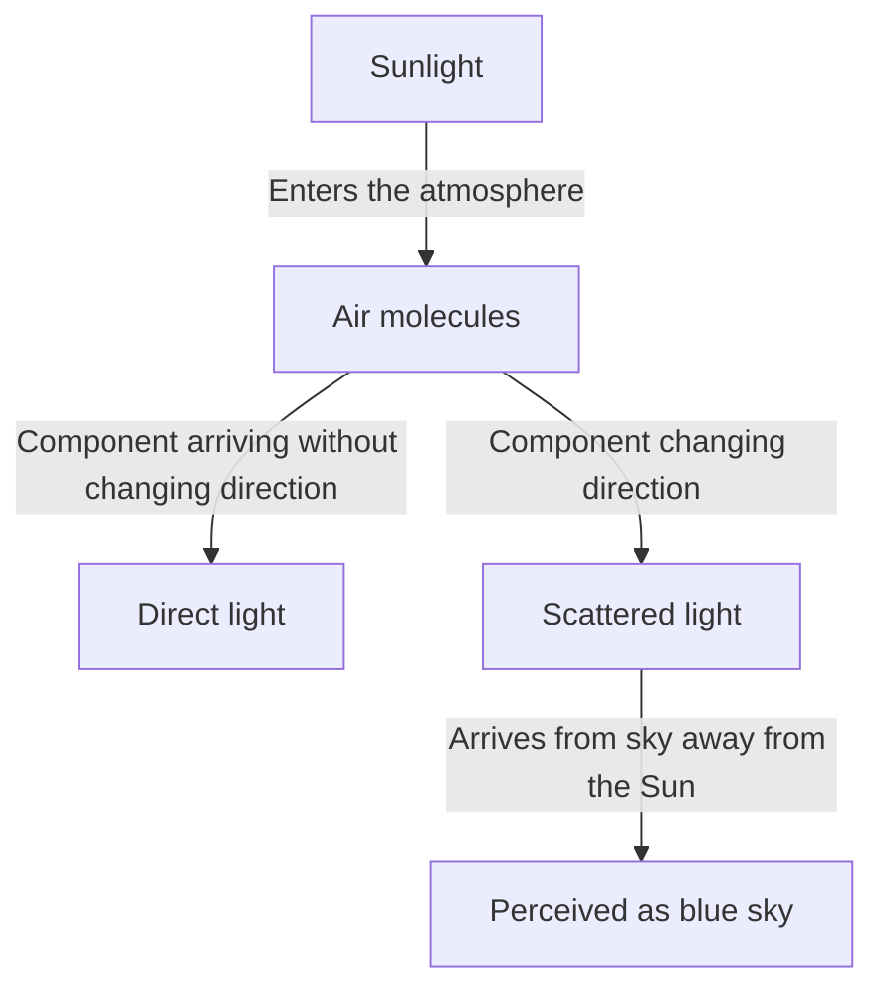
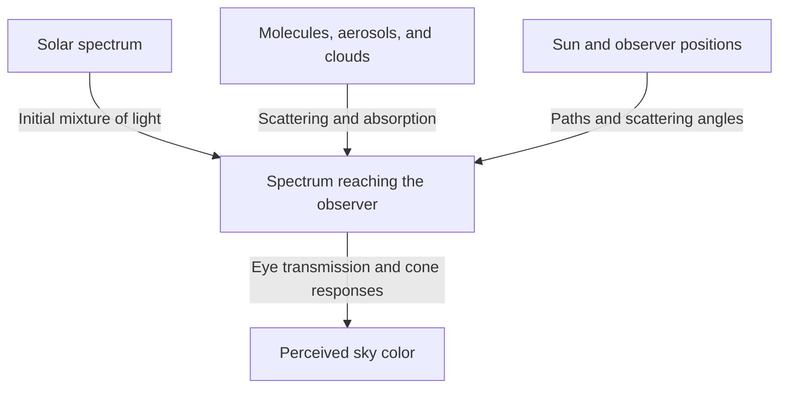

Look up on a clear day: a deep blue spreads overhead, becoming gradually paler toward the distant horizon. Yet as the Sun lowers, that same sky turns yellow and orange, and after sunset another kind of deep blue appears.

Put air into a small transparent container, and you will not see anything resembling blue paint. Where, then, does the blue covering the sky come from?

The short answer is that air molecules scatter sunlight, making short-wavelength light more likely to reach our eyes from the sky. But that sentence conceals important questions. What is scattering? Why does it depend on wavelength? Why does the sky look blue rather than violet, whose wavelengths are even shorter? And how can the same mechanism produce a red sunset?

Working through these questions shows that the sky's color is not a property of the atmosphere alone. The Sun supplies the light, the atmosphere redirects it, and our eyes perceive color. All three contribute to the phenomenon.

## 1. First distinguish sunlight from skylight

Outdoors during the day, some light arrives almost directly from the Sun, while other light arrives from directions elsewhere in the sky. The former is direct sunlight; the latter is scattered skylight. There is also light reflected by the ground and buildings, but let us first distinguish these two components.

Imagine looking at a patch of sky with the Sun behind you. The Sun is not along your line of sight, yet light enters your eyes from that direction. Some sunlight has changed direction in the atmosphere and traveled toward you.

Your eyes use the direction from which light arrives to identify a region as bright. There is no blue wall overhead. Air throughout a long stretch of your line of sight sends light toward you, and you perceive those accumulated contributions as a continuous bright sky.

If we could remove only Earth's atmosphere while keeping the Sun and ground unchanged, sunlit places would remain bright, but the sky away from the Sun and reflecting surface objects would become dark. Photographs of the Moon in daylight, with bright ground beneath a black sky, help illustrate this contrast.

The key is that scattering does not create new light: it redistributes where existing light goes. Light lost from a beam aimed toward the Sun becomes light that brightens the sky for someone looking in another direction.

The diagram separates the paths, but an enormous number of molecules act simultaneously in reality. No single molecule makes the entire sky blue, nor does every photon scattered once necessarily reach the observer.

## 2. White sunlight contains many wavelengths

Light is an electromagnetic wave. Changes in electric and magnetic fields propagate through space and exhibit wave behavior. The distance from one crest to the next is the wavelength, usually represented by the Greek letter $\lambda$.

The visible range depends on the condition of the eye and on what counts as detectable, but roughly spans 380–780 nanometers. A nanometer is one billionth of a meter. Visible wavelengths are far smaller than the thickness of a human hair.

Within this range, shorter wavelengths are perceived as violet or blue, and longer ones as orange or red. Nature does not draw sharp boundaries between color names, however. These divisions are also human categories imposed on a continuous distribution of light.

Sunlight is not confined to one wavelength. It spans a broad range, from violet through red and beyond into invisible ultraviolet and infrared. With many visible components entering our eyes, and with vision adapting to surrounding illumination, we can treat daylight as a whitish light source.

A prism separates this mixture because different wavelengths travel differently through it. A blue sky, however, is not a giant rainbow projected by a prism. Instead, the fraction redirected by the atmosphere varies with wavelength, changing the mixture of light that arrives from directions away from the Sun.

Confusing these mechanisms can lead to the claim that sunlight is converted into blue light. In ordinary Rayleigh scattering, the wavelength is approximately preserved. Blue components already present in white sunlight are simply more readily redirected.

## 3. How transparent molecules scatter light

### Are molecules tiny mirrors?

The atmosphere consists mainly of nitrogen and oxygen. By volume, dry air contains about 78% nitrogen and 21% oxygen, with argon and other gases making up the rest. Water vapor varies with location and weather, so these figures refer to air with water vapor excluded.

Nitrogen and oxygen molecules are much smaller than visible wavelengths. Drawing them as ordinary mirrors, with rays bouncing off their surfaces, cannot by itself explain the strong wavelength dependence.

A more physical picture begins with light's electric field exerting forces on electrons and nuclei inside a molecule. The distributions of negative and positive charge shift slightly relative to each other, creating an electrical imbalance called polarization.

As the electric field oscillates, this induced separation oscillates too. An oscillating electric dipole radiates electromagnetic waves. Its response overlaps with the incoming wave, and light appears in directions other than forward. This is the basic picture behind scattering.

Here, saying that a molecule radiates light does not mean that it absorbs and stores light, then later glows in another color, as in fluorescence. We are considering an approximately elastic response to the incident electromagnetic wave. A rigorous treatment requires quantum mechanics, but classical electromagnetism already explains the basic wavelength dependence of a blue sky well.

### Why is nearby air transparent while the sky is bright?

Scattering is not the same as opacity. Across a room, over a few meters, molecular scattering of visible light is weak, and most light passes through. That is why we can clearly see the opposite wall through the air.

When we look at the sky, however, the optical path is much longer than a few meters. Although air density decreases with altitude, light travels through a substantial atmospheric layer. Each molecule has a small effect, but their enormous numbers and the long path produce visible scattered light.

Molecular size is not itself blue, and transparent air does not suddenly become a blue material. An interaction too weak to notice over a short distance becomes significant over a long path. This accumulation of small effects is central to the blue sky.

## 4. What does the fourth-power wavelength law mean?

Under appropriate conditions, scattering by objects much smaller than the wavelength, such as molecules, is called Rayleigh scattering. For air in the visible range, the scattering cross section $\sigma$ has approximately this wavelength dependence:

$$
\sigma(\lambda) \propto \frac{1}{\lambda^4}
$$

A scattering cross section expresses the likelihood of scattering in units of area. It is not simply the area of a molecule's geometric outline. It summarizes how strongly light and the molecule interact.

Using this relation to compare a blue component at 450 nanometers with a red component at 650 nanometers gives approximately:

$$
\frac{\sigma(450\,\mathrm{nm})}{\sigma(650\,\mathrm{nm})}
\approx \left(\frac{650}{450}\right)^4
\approx 4.35
$$

For equally intense incident components, the blue one is about 4.35 times as likely to scatter as the red one. The difference is much larger than the ratio of the wavelengths themselves.

This does not mean that the sky is 4.35 times bluer than it is red. The calculation has not included sunlight's intensity at each wavelength, attenuation before and after scattering, viewing direction, or the eye's sensitivity. A cross-section ratio and a perceived color are different quantities.

### Why the fourth power rather than the second?

In a simple electromagnetic model, over a range where molecular polarizability is nearly independent of wavelength, the amplitude of the induced electric dipole is proportional to the incoming electric field. Meanwhile, the far-field electric amplitude radiated by that dipole contains the square of its angular frequency $\omega$.

Light intensity is proportional to the square of electric-field amplitude, so the radiated intensity contains $\omega^4$. In vacuum, $\omega$ is inversely proportional to wavelength, giving the relationship $1/\lambda^4$.

This is not a geometric explanation about shorter waves striking smaller gaps. It is a wave law arising from the way oscillating charges radiate electromagnetic waves.

The approximation must not be extended to every wavelength. Near a molecular resonance, the polarization response changes and absorption becomes important. If a scatterer is large relative to the wavelength, the Rayleigh approximation no longer applies. The fourth-power law is powerful, but has a defined domain of validity.

## 5. Why the sky still does not look violet

The fourth-power law suggests that violet light, with shorter wavelengths than blue, should scatter even more strongly. This is a good question: scattered skylight does indeed contain violet as well as blue.

But color perception does not work by selecting the single wavelength most likely to scatter. Light entering the eye contains a broad mixture, and the visual system responds to the mixture as a whole.

First, the solar spectrum is not equally intense at every wavelength. Atmospheric transmission and scattering modify that spectrum. Then the transmission properties of the eye and the sensitivities of retinal photoreceptors enter the picture.

Color vision in bright conditions mainly involves three types of cones: S, M, and L cones, relatively sensitive to short, medium, and long wavelengths. They are not dedicated switches that detect only blue, green, and red. Their sensitivity curves are broad and overlapping.

The brain constructs color by comparing their responses. Although short wavelengths are favored in skylight, the resulting combination of cone responses is normally perceived as blue, or a slightly violet-tinged blue, on a clear day. Our low sensitivity at the violet end is also essential to the explanation. [NASA's discussion of electromagnetic waves](https://science.nasa.gov/ems/03_behaviors/) likewise distinguishes scattering from visual sensitivity.

Thus, saying that all violet light is absorbed by the atmosphere is inadequate. Visible violet light does reach the ground. Ultraviolet is not the same thing as visible violet, either. Ozone's absorption of ultraviolet cannot simply substitute for an explanation of why the sky does not look violet.

Nor is it appropriate to say that the sky is really violet and our eyes are wrong. A physical spectrum and the experience of color describe different stages of the process. Vision is not malfunctioning; it is interpreting mixed light by its usual rules.

## 6. Blue sky sends us red light too

Examine blue skylight with a spectroscope, and you will not see only one blue line. Wavelengths associated with red and green are present too. The shorter wavelengths are relatively enhanced, making the mixture look blue.

This distinguishes skylight from a blue LED or laser. Light concentrated in a narrow wavelength range and light spread across a broad, uneven distribution can look similar without having the same spectrum.

It also explains why accurately reproducing sky colors is difficult. A computer display usually combines red, green, and blue emissions. By eliciting similar cone responses, it can create a color resembling skylight even with a very different spectrum.

Conversely, the color of a photographed sky depends on sensor sensitivity, white balance, exposure, image processing, and the display on which it is viewed. A deeper blue in a photograph does not directly prove that molecular scattering was stronger.

Avoid tying wavelength and color together too rigidly. That distinction helps make sense not only of the violet question, but also of photography and displays.

## 7. Sunsets are red because the light path changes

A blue daytime sky and a red sunset are not unrelated phenomena governed by separate principles. Both involve the wavelength dependence of scattering. What changes is the path of the light we consider.

When the Sun is high, the path to the ground is relatively short. As it approaches the horizon, sunlight follows a much longer, slanting route through Earth's atmosphere. Short wavelengths are more readily removed from the direct beam, leaving a relatively larger proportion of red and orange in light arriving from the Sun's direction.

The same fact—that blue light scatters readily—both makes the sky away from the Sun blue and reddens direct light after a long atmospheric journey. [NASA Space Place](https://spaceplace.nasa.gov/blue-sky/en/) illustrates this change in path length.

Not every part of a red evening sky can be explained by sunlight entering the eye directly, however. Light already reddened along its path can then scatter from molecules or particles, or reflect and scatter from clouds, reaching directions away from the Sun. Evening clouds turn vermilion because the color of the light illuminating them has changed.

### Think of atmospheric thickness along the path

In a simple flat-atmosphere model, if the Sun's zenith angle is $z$, the path relative to the vertical can be approximated by:

$$
m \approx \frac{1}{\cos z}
$$

At $z=60^\circ$, for example, this gives about twice the vertical path. Near the horizon, however, the formula fails. It diverges as $z$ approaches 90 degrees, whereas the actual atmospheric path does not become infinite. Earth's curvature, the decrease in density with altitude, and refraction require a more complete model.

Sunset diagrams often depict the atmosphere as a thick shell of uniform density. That is a schematic for comparing directions. The real atmosphere has neither a hard ceiling where it abruptly ends nor a density that remains constant throughout.

## 8. Optical depth turns sky color into a quantitative problem

Equal physical distances do not imply equal scattering or absorption if air density or particle abundance differs. The useful quantity is optical thickness, also called optical depth, denoted by $\tau$.

In a simple case involving only molecular scattering, with molecular number density $n(s)$ along the path, we can write:

$$
\tau_{\mathrm{R}}(\lambda)=\int n(s)\,\sigma(\lambda)\,ds
$$

Here $s$ measures distance along the path. We multiply number density by scattering cross section and add the contributions along the journey. Checking the units, inverse cubic meters, square meters, and meters cancel, making $\tau$ dimensionless.

If $\tau_{\mathrm{ext}}$ is the extinction optical depth including absorption and aerosol scattering, the unscattered direct beam decreases in a simple model as:

$$
I_{\mathrm{direct}}(\lambda)=I_0(\lambda)\exp[-\tau_{\mathrm{ext}}(\lambda)]
$$

This means that each additional small stretch removes a certain fraction of the remaining light. It does not subtract the same absolute amount each time from a beam already mostly scattered away. The decrease is therefore exponential, not linear.

This equation alone does not calculate the brightness of the blue sky. It follows light leaving the direct beam. Light newly scattered into the viewing direction must be added separately.

To calculate skylight arriving from a given direction, we consider each point along the line of sight: multiply the sunlight reaching that point by the probability of scattering toward the observer and by the fraction surviving the remaining journey, then integrate. The blue sky is not the color of one point along a path; it is the sum of contributions distributed over a long distance.

## 9. Why different parts of the sky have different blues

Compare the blue overhead with the pale blue near the horizon: even on the same day, the sky is not uniformly colored. Different viewing directions pass through different amounts of air, while the effects of low-altitude aerosols and multiple scattering also change.

Toward the horizon, we look through a long stretch of lower atmosphere. Besides molecules, it contains fine particles and droplets that add a wide range of wavelengths to the line of sight. Mixing this whiter scattered light with the original blue reduces its saturation.

Skylight itself can also be scattered or absorbed again before reaching the eye. Simply assuming that more atmosphere always means more blue light eventually fails. Contributions that supply light and processes that remove it must be considered together.

A deep blue mountain sky likewise does not follow a single proportional relationship between altitude and blueness. Less atmosphere overhead, distance from low-level haze, and contrast with the surroundings all contribute. Depending on humidity and atmospheric conditions, skies can look whitish even from a mountain.

For the same reason, a dry day does not always guarantee deep blue, nor does recent rain guarantee clarity. Water vapor itself is not visible fog; it can influence appearance through particles taking up moisture and through cloud or haze formation. One sky photograph cannot uniquely determine humidity or pollution.

## 10. Why white clouds do not turn blue

Clouds scatter sunlight too. Their main reason for looking white is that their scatterers are very different in size from air molecules.

Cloud droplets typically have micrometer-scale dimensions or larger, and many are larger than visible wavelengths. Some clouds consist of ice crystals. In this regime, the simple fourth-power law for molecules cannot be applied unchanged.

Mie theory is a standard description of scattering by spherical particles. The ratio of particle size to wavelength, refractive index, and other factors determine the amount and direction of scattering. Real clouds contain many particles of different sizes, so light across the visible range is scattered relatively broadly, and sunlit clouds appear whitish.

White does not mean every wavelength is scattered in exactly the same proportion. Individual droplets have complicated wavelength and angular dependencies. But many particle sizes and light paths combine to deliver a mixture less strongly weighted toward short wavelengths than blue skylight.

Why, then, is a rain cloud's base dark gray? In a large, developed cloud, light scatters repeatedly, and more of it returns upward or escapes sideways. If less reaches the base, the cloud looks dark from below. Its droplets have not turned into a gray substance.

The contrast between bright cloud edges and a dark base also reflects the routes light takes inside and around the cloud. Equating white and gray clouds with clean and dirty water is mistaken.

## 11. Do haze, smoke, and dust change sky color in the same way?

Tiny solid particles and liquid droplets suspended in the atmosphere are collectively called aerosols. They include sea salt, soil dust, and particles originating in smoke, and are treated separately from gas molecules.

Aerosol optical properties vary with size distribution, shape, and composition. Some scatter light efficiently; for others, such as soot, absorption is important. Thus both whitish haze and a brownish sky cannot be explained simply as an increase in blue light.

For particles larger than molecules, strong forward scattering—near the original direction of travel—can become important. The broad white glow around the Sun is related to this angular dependence. Looking near the Sun is hazardous even without optical equipment, however; do not stare at it to test this.

Nor does dirtier air necessarily produce a more beautiful red sunset. Moderate particle amounts can enhance colors under some conditions, but thick smoke or dust can strongly attenuate the light and dull the scene. Cloud height, solar elevation, and particle distribution all affect the outcome.

Atmospheric color has multiple causes, so color alone is insufficient to identify them uniquely. Scientific observations combine wavelengths, polarization, and viewing directions to infer particle abundance and properties. The everyday question of a blue sky thus leads directly into atmospheric remote sensing.

## 12. Skylight has another property: polarization

Light has not only wavelength and intensity, but also an electric-field vibration direction. A preference in these directions is called polarization. Light from a clear sky is partially polarized, depending on where we look.

For idealized Rayleigh scattering of unpolarized incident light in a single event, the intensity depends approximately on scattering angle $\theta$ as:

$$
I(\theta)\propto 1+\cos^2\theta
$$

The scattering angle is the angle between the original and final directions of travel. Intensity is not zero at 90 degrees, sideways. The equation therefore expresses the ability of air molecules to send sunlight sideways.

In the same ideal model, the degree of linear polarization is:

$$
P(\theta)=\frac{\sin^2\theta}{1+\cos^2\theta}
$$

This approximation gives its maximum at 90 degrees. Real skies also involve molecular properties, multiple scattering, aerosols, and ground reflections, so they do not become perfectly polarized exactly as this ideal expression predicts.

Look through a polarizing filter at blue sky well away from the Sun and rotate the filter: its brightness may change. This is one reason photographic polarizers can deepen the apparent blue. [Georgia State University's HyperPhysics](https://hyperphysics.phy-astr.gsu.edu/hbase/phyopt/skypol.html) describes the relationship between viewing direction and sky polarization.

With a wide-angle lens, different parts of the image include different scattering angles, so a polarizer may darken the sky unevenly, producing unnatural-looking patches. This photographic effect is not necessarily a filter defect; it reveals the polarization pattern spread across the sky.

## 13. Why blue light remains after sunset

Sunset is not the instant when sunlight stops reaching Earth's entire atmosphere. Even after the Sun disappears from a ground observer's view, parts of the upper atmosphere remain sunlit. Light scattered there reaches the ground, so darkness does not arrive immediately.

Multiple scattering also matters: light scattered once can scatter again elsewhere. A basic daytime explanation can emphasize a single event, but twilight paths become long and complicated, and that approximation alone is insufficient.

Ozone can also become important. Famous for absorbing ultraviolet, it has a broad visible absorption band called the Chappuis band. Along long paths, this selective absorption influences evening sky colors.

The deep blue of the so-called blue hour is therefore difficult to explain entirely with the same single Rayleigh-scattering event used for a daytime sky. A spherical atmosphere, shadowed regions, ozone, aerosols, and multiple scattering must be considered together. A [NASA technical report](https://ntrs.nasa.gov/citations/19730020661) calculates contributions of ozone and aerosols to twilight color.

There is no contradiction between saying molecular scattering chiefly explains daytime blue skies and saying absorption also affects twilight colors. The relative importance of processes changes with time, direction, and atmospheric conditions.

## 14. Blue oceans, blue mountains, and a blue Earth from space

### The sky is not blue merely because it reflects the ocean

You may hear that the sky is blue because it reflects the sea. Yet blue skies occur far inland. With an appropriate atmosphere and light source, molecular scattering can produce a blue sky without any ocean.

The sea surface does reflect skylight and this does affect its appearance. But the ocean's blue cannot be explained entirely as a mirror reflection either. Over long paths, water selectively absorbs red wavelengths; combined with scattering in the water, this allows blue light to return. In coastal waters, the seabed, suspended material, and phytoplankton also change the color. [NOAA's explanation of ocean color](https://oceanservice.noaa.gov/facts/oceanblue.html) discusses water's absorption of red light.

Sky and sea influence each other's appearance, but they do not owe their blue to one identical cause. Similar colors do not necessarily imply the same mechanism.

### Distant mountains look blue because air lies between them and our eyes

When distant mountains look bluish and their outlines fade, light from the mountains is being attenuated while intervening air adds scattered light to the line of sight. This added contribution is sometimes called airlight.

The mountain is not coated in blue paint: atmospheric contributions overlap its own light. Atmospheric perspective in painting, with distant objects rendered paler and bluer, draws on this familiar optical effect. In thick haze or evening illumination, however, the added light can have a different color.

Earth's blue from space combines light from the sea surface and underwater, atmospheric scattering, clouds, and other contributions. Looking overhead from the ground and looking at the whole planet involve different viewpoints and light paths. Even the phrase 'Earth is blue' contains several optical phenomena.

## 15. If Martian sunsets are blue, is the fourth-power law wrong?

Evening scenes recorded by Mars spacecraft sometimes show blue near the Sun. Because this seems opposite to Earth's red sunsets, it might appear to overturn the Rayleigh-scattering explanation.

But fine atmospheric dust plays a major role in Martian sky colors. These are not the same conditions as a simple molecular Rayleigh-scattering model. Particle size and properties alter the angular distribution of scattering at different wavelengths.

In a Martian evening, light passing through dust can favor blue components within a narrow region near the Sun. This does not mean the entire Martian sky is always blue like a clear terrestrial sky. [NASA's Perseverance sunset image](https://science.nasa.gov/resource/mastcam-zs-first-martian-sunset/) shows an example of this bluish light.

Natural laws do not change capriciously from place to place. Atmospheric composition, particle type, path length, and viewing direction change. The same electromagnetism, given different conditions, produces different sky colors.

We can extend this reasoning to planets orbiting other stars. With a different source spectrum, atmosphere, and clouds, a blue sky is not guaranteed. Earth's familiar color is one expression of universal laws under specifically terrestrial conditions.

## 16. What can you observe at home?

### Water with a little milk

Fill a transparent container with water, add milk in very small amounts, and illuminate it from the side with a white LED light. In a slightly darkened room, compare the light path viewed from the side with the transmitted light projected onto white paper.

At suitable concentrations and path lengths, you may see a color difference between sideways-scattered and transmitted light. Too many particles make the mixture cloudy white and allow very little light through. The source and container shape also affect the result.

The value of this experiment is in separating sideways-scattered light from light traveling straight through. Milk particles, however, are much larger than nitrogen or oxygen molecules and have a range of sizes. This is not an exact recreation of atmospheric Rayleigh scattering or a measurement of the fourth-power law.

Even a white lamp need not contain a continuous, uniform visible spectrum. With a phone light, for example, the LED emission spectrum influences the appearance. If you do not see blue, do not conclude that scattering theory is wrong; compare the model's conditions with those of the real atmosphere.

### Compare the sky through a polarizer

A photographic polarizer or polarized sunglasses can reveal brightness changes when rotated while viewing sky away from the Sun. Compare clouds and areas near the horizon too: skylight does not have uniform properties everywhere.

Do not look at the Sun. Sunglasses and ordinary polarizers are not safe solar-viewing filters. Avoid looking directly through binoculars, telescopes, or a camera's optical viewfinder as well. Observe only a safe part of the sky well away from the Sun.

For photographs, keep the framing, exposure, and white balance fixed to make comparisons easier. Automatic corrections may brighten a sky that actually became darker, obscuring the change.

### Record conditions as well as colors

When observing morning, noon, and evening skies, note the approximate solar elevation, viewing direction, cloud cover, and horizon haze. Instead of describing blueness with one word, distinguish observations such as 'deep blue overhead but white in the distance' or 'only the cloud base is dark.' These connect more clearly to the physics.

You need not diagnose the atmosphere from a single observation. Compare changing conditions, retain observations that differ from expectations, and distinguish camera processing from visual impressions. That attitude is itself the foundation of scientific observation.

## 17. A step further: transparent glass versus air

Another question now arises. Glass also contains electrons and nuclei and should become polarized in response to light. Should transparent glass therefore scatter light strongly sideways like the sky?

To answer, we must retain wave phase when adding many small responses. Electric-field amplitudes can reinforce or cancel each other. Simply adding the brightness from each atom as if it were an independent light source is not always correct.

In an ideally homogeneous medium, superposing waves from spatially smooth polarization builds a forward-propagating wave. This collective response is related to refractive index and propagation. Scattering into other directions, meanwhile, depends importantly on spatial fluctuations in density or refractive index, impurities, and defects.

In gases, molecules move around and local number density fluctuates statistically. Molecular scattering in a dilute gas and scattering from density fluctuations in a continuous description are not unrelated phenomena; they are connected descriptions at different scales.

Real glass also exhibits weak scattering, absorption, and surface reflection. It is not a perfectly homogeneous, lossless ideal medium. Nevertheless, wave superposition helps correct the assumption that simply adding more atoms must increase sideways scattering in direct proportion to their number.

An everyday explanation begins with one molecule's response; a more precise treatment proceeds to relative molecular positions and interference. Understanding these levels turns the blue-sky explanation from a story about particles colliding into electromagnetic-wave physics.

## 18. How far can the blue-sky explanation take us?

'The sky is blue because of Rayleigh scattering' is an excellent starting point for a clear daytime sky on Earth. It does not promise that one equation predicts every sky color.

A single-scattering approximation in a sufficiently optically thin atmosphere explains the basic wavelength dependence and polarization. Long paths, near-horizon views, thick clouds, twilight, and heavy smoke or dust require additional physics. Scattering brings light into and out of the line of sight, while absorption and surface reflection also contribute.

Tracking these gains and losses by wavelength and direction is the idea of radiative transfer. Precise sky-color calculations combine the atmosphere's vertical structure, solar position, particle optical properties, surface reflection, and visual response. A simple explanation is not discarded as wrong; it is used with a clear understanding of what its model leaves out.

Looking up at a blue sky, we do not see individual molecules. Yet we see molecular interactions with light, the structure of Earth's atmosphere, wave interference, and human perception combined into one landscape.

The familiar fact that the sky is blue is not evidence that the world is simple. It shows how naturally phenomena on different scales fit together, usually without our noticing. If tomorrow's blue differs slightly from today's, that difference offers another clue to the journey the light has taken.

## References

- [NASA Space Place: Why Is the Sky Blue?](https://spaceplace.nasa.gov/blue-sky/en/) — An introduction to blue skies and sunsets through wavelength and atmospheric light paths.
- [NASA Science: Wave Behaviors](https://science.nasa.gov/ems/03_behaviors/) — Scattering, refraction, wavelength, and human visual sensitivity.
- [Georgia State University, HyperPhysics: Skylight Polarization](https://hyperphysics.phy-astr.gsu.edu/hbase/phyopt/skypol.html) — Polarization of scattered skylight and its relation to viewing direction.
- [NASA NTRS: The influence of ozone and aerosols on the brightness and color of the twilight zone](https://ntrs.nasa.gov/citations/19730020661) — A technical report on ozone and aerosols in twilight-color calculations.
- [NOAA Ocean Service: Why is the ocean blue?](https://oceanservice.noaa.gov/facts/oceanblue.html) — Ocean color explained through selective absorption by water.
- [NASA Science: Mastcam-Z's First Martian Sunset](https://science.nasa.gov/resource/mastcam-zs-first-martian-sunset/) — A Martian sunset and the appearance of blue light caused by dust.
