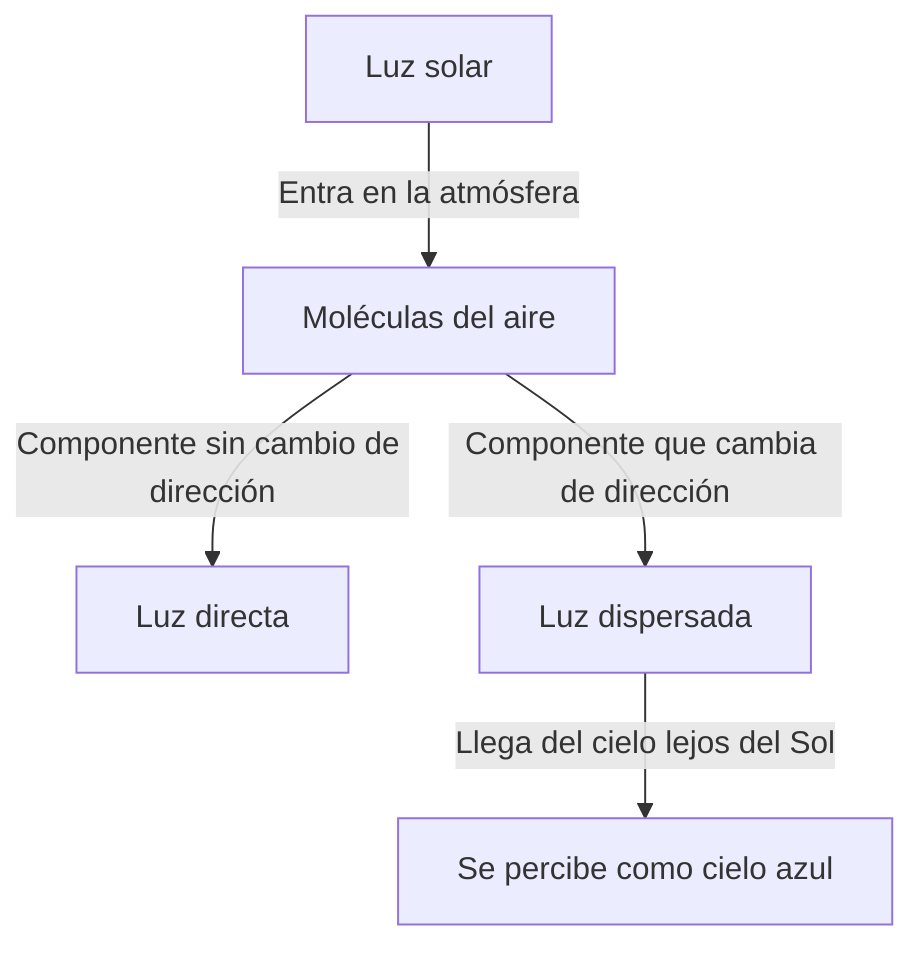
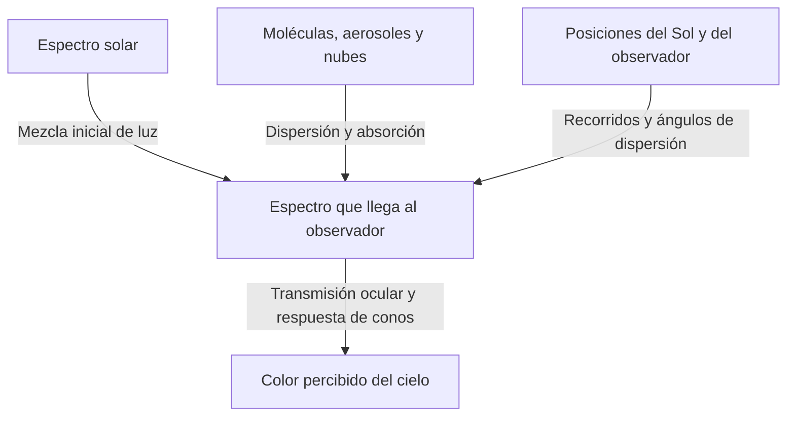

En un día despejado, sobre nosotros se extiende un azul profundo que se vuelve gradualmente blanquecino hacia el horizonte. Sin embargo, cuando el Sol desciende, ese mismo cielo se torna amarillo y naranja. Después de la puesta aparece otra clase de azul intenso.

Si introducimos aire en un recipiente pequeño y transparente, no veremos nada parecido a pintura azul. ¿De dónde procede entonces el azul que cubre el cielo?

La respuesta breve es que las moléculas del aire dispersan la luz solar, favoreciendo que las longitudes de onda cortas lleguen a nuestros ojos desde el cielo. Pero esa frase encierra preguntas importantes. ¿Qué es la dispersión? ¿Por qué depende de la longitud de onda? ¿Por qué vemos azul y no violeta, cuya longitud de onda es todavía menor? ¿Y cómo produce el mismo mecanismo un atardecer rojo?

Al seguir estas preguntas, descubrimos que el color del cielo no es una propiedad exclusiva de la atmósfera. El Sol proporciona luz, la atmósfera cambia su dirección y los ojos perciben el color. El fenómeno surge de los tres elementos juntos.

## 1. Primero, distinguir la luz solar de la luz del cielo

Durante el día, al aire libre, una parte de la luz llega casi directamente desde el Sol y otra procede de las demás direcciones del cielo. La primera es luz solar directa; la segunda, luz celeste dispersada. El suelo y los edificios también reflejan luz, pero empecemos separando estas dos componentes.

Imagine observar una porción del cielo con el Sol a su espalda. No está en su línea de visión, pero aun así llega luz desde esa dirección. Parte de la radiación solar ha cambiado de rumbo en la atmósfera y se dirige hacia usted.

El ojo atribuye brillo a la dirección de la que llega la luz. No existe una pared azul sobre nuestras cabezas. El aire distribuido a lo largo de la línea de visión nos envía luz, y percibimos la suma de sus contribuciones como un cielo luminoso continuo.

Si pudiéramos retirar solo la atmósfera terrestre y mantener iguales el Sol y el suelo, las superficies iluminadas seguirían brillando, pero el cielo sería oscuro fuera del Sol y de los objetos reflectantes. Las fotografías diurnas de la Luna, con suelo brillante bajo un cielo negro, ayudan a comprender este contraste.

La clave es que la dispersión no crea luz nueva, sino que redistribuye su destino. La luz perdida en una línea de visión orientada al Sol puede iluminar el cielo para alguien que mire en otra dirección.

El diagrama separa los caminos, pero en la realidad intervienen simultáneamente muchísimas moléculas. Ni una sola vuelve azul todo el cielo, ni toda la luz dispersada una vez alcanza necesariamente al observador.

## 2. La luz solar blanca contiene muchas longitudes de onda

La luz es una onda electromagnética. Las variaciones de campos eléctricos y magnéticos se propagan por el espacio con propiedades ondulatorias. La distancia entre dos crestas sucesivas es la longitud de onda, que suele representarse con la letra griega $\lambda$.

El intervalo visible depende del estado del ojo y del criterio de detección, pero abarca aproximadamente entre 380 y 780 nanómetros. Un nanómetro es la milmillonésima parte de un metro. Las longitudes visibles son mucho menores que el grosor de un cabello.

En ese intervalo, las más cortas se perciben como violeta o azul, y las más largas como naranja o rojo. Sin embargo, la naturaleza no dibuja fronteras nítidas entre los nombres de colores. Esas divisiones también son categorías humanas aplicadas a una distribución continua.

El Sol no emite una única longitud de onda. Su luz cubre una gama amplia, desde violeta hasta rojo, además de ultravioleta e infrarrojo invisibles. Diversas componentes visibles entran en los ojos y la visión se adapta al entorno, permitiéndonos tratar la luz diurna como una iluminación blanquecina.

Un prisma separa la mezcla porque las longitudes de onda se propagan de manera diferente en él. El cielo azul, en cambio, no es un enorme arcoíris proyectado por un prisma. La fracción desviada en la atmósfera depende de la longitud de onda y modifica la mezcla que recibimos desde direcciones alejadas del Sol.

Confundir ambos mecanismos puede llevar a decir que la luz solar se convierte en luz azul. En la dispersión de Rayleigh habitual, la longitud de onda se conserva aproximadamente. Las componentes azules ya presentes en la luz blanca simplemente se desvían con mayor facilidad.

## 3. Cómo dispersan la luz las moléculas transparentes

### ¿Son las moléculas pequeños espejos?

La atmósfera contiene principalmente nitrógeno y oxígeno. Por volumen, el aire seco tiene alrededor de un 78 % de nitrógeno y un 21 % de oxígeno; el resto incluye argón y otros gases. Como el vapor de agua cambia según el lugar y el tiempo, estas cifras excluyen ese vapor.

Las moléculas de nitrógeno y oxígeno son mucho menores que las longitudes de onda visibles. Dibujarlas como espejos corrientes en cuyas superficies rebotan rayos no explica por sí solo la fuerte dependencia espectral.

Una imagen más física comienza con el campo eléctrico de la luz ejerciendo fuerzas sobre electrones y núcleos de la molécula. Las distribuciones de cargas negativas y positivas se desplazan ligeramente entre sí, creando una separación eléctrica denominada polarización.

Cuando el campo oscila, también oscila esa separación. Un dipolo eléctrico oscilante emite ondas electromagnéticas. Su respuesta se superpone a la onda incidente y aparece luz en direcciones distintas de la frontal. Esa es la imagen básica de la dispersión.

Decir aquí que una molécula emite luz no significa que primero la absorba y almacene para brillar después con otro color, como en la fluorescencia. Consideramos una respuesta aproximadamente elástica a la onda incidente. El tratamiento riguroso requiere mecánica cuántica, pero el electromagnetismo clásico ya permite comprender bien la dependencia espectral esencial del cielo azul.

### ¿Por qué el aire cercano es transparente, pero el cielo es brillante?

Dispersión y opacidad no son lo mismo. En los pocos metros de una habitación, la dispersión molecular de la luz visible es débil y la mayor parte atraviesa el aire. Por eso vemos claramente la pared opuesta.

Al mirar el cielo, el recorrido es mucho mayor. Aunque la densidad disminuye con la altura, la luz atraviesa una capa atmosférica considerable. Cada molécula ejerce un efecto pequeño, pero su enorme número y la larga distancia producen luz dispersada visible.

El tamaño molecular no es azul en sí mismo, ni el aire transparente se transforma de repente en una sustancia azul. Una interacción casi imperceptible en distancias cortas adquiere importancia en recorridos largos. Esa acumulación de efectos pequeños es fundamental.

## 4. Qué significa la ley de la cuarta potencia

En condiciones adecuadas, la dispersión por objetos mucho menores que la longitud de onda, como las moléculas, se llama dispersión de Rayleigh. En el aire y el intervalo visible, la sección eficaz de dispersión $\sigma$ depende aproximadamente así de la longitud de onda:

$$
\sigma(\lambda) \propto \frac{1}{\lambda^4}
$$

La sección eficaz expresa la probabilidad de dispersión en unidades de superficie. No es simplemente el área del contorno geométrico de una molécula. Resume la intensidad de su interacción con la luz.

Al comparar una componente azul de 450 nanómetros con una roja de 650 nanómetros, obtenemos aproximadamente:

$$
\frac{\sigma(450\,\mathrm{nm})}{\sigma(650\,\mathrm{nm})}
\approx \left(\frac{650}{450}\right)^4
\approx 4.35
$$

Con intensidades incidentes iguales, la componente azul tiene unas 4,35 veces más probabilidad de dispersarse. La diferencia supera ampliamente la simple razón entre longitudes de onda.

Esto no significa que el cielo sea 4,35 veces más azul que rojo. Todavía no hemos incluido la intensidad solar en cada longitud, la atenuación anterior y posterior a la dispersión, la dirección de observación ni la sensibilidad del ojo. La razón de secciones eficaces y el color percibido son magnitudes distintas.

### ¿Por qué la cuarta potencia y no la segunda?

En un modelo electromagnético sencillo, mientras la polarizabilidad molecular sea casi independiente de la longitud de onda, la amplitud del dipolo inducido es proporcional al campo incidente. En cambio, la amplitud del campo eléctrico que ese dipolo radia a gran distancia contiene el cuadrado de su frecuencia angular $\omega$.

La intensidad luminosa es proporcional al cuadrado de la amplitud del campo, por lo que la intensidad radiada contiene $\omega^4$. En el vacío, $\omega$ es inversamente proporcional a la longitud de onda, dando la relación $1/\lambda^4$.

No se trata de una explicación geométrica según la cual las ondas cortas golpean huecos pequeños. Es una ley ondulatoria que surge de cómo las cargas oscilantes emiten ondas electromagnéticas.

No debemos extender esta aproximación a cualquier longitud de onda. Cerca de una resonancia molecular cambia la respuesta de polarización y cobra importancia la absorción. Si el dispersor es grande comparado con la longitud de onda, dejan de cumplirse las condiciones de Rayleigh. La ley es potente, pero tiene un dominio de validez.

## 5. Por qué el cielo sigue sin verse violeta

La cuarta potencia sugiere que el violeta, de longitud de onda menor que el azul, debería dispersarse todavía más. Es una pregunta correcta: la luz dispersada contiene, efectivamente, violeta además de azul.

Sin embargo, la percepción no consiste en elegir la longitud de onda más dispersada. El ojo recibe una mezcla amplia y el sistema visual responde a su composición completa.

Para empezar, el espectro solar no tiene igual intensidad en todas las longitudes de onda. La transmisión y la dispersión atmosféricas lo modifican. Después intervienen la transmisión dentro del ojo y la sensibilidad de los fotorreceptores de la retina.

La visión cromática con buena iluminación depende sobre todo de tres tipos de conos: S, M y L, relativamente sensibles a longitudes cortas, medias y largas. No son interruptores dedicados exclusivamente al azul, verde y rojo. Sus curvas de sensibilidad son amplias y se solapan.

El cerebro construye el color comparando sus respuestas. Aunque la luz celeste favorece las longitudes cortas, la combinación de estímulos suele percibirse como azul o azul ligeramente violáceo en un día despejado. También es esencial nuestra baja sensibilidad en el extremo violeta. La [explicación de ondas electromagnéticas de la NASA](https://science.nasa.gov/ems/03_behaviors/) distingue igualmente dispersión y sensibilidad visual.

Por tanto, decir que la atmósfera absorbe todo el violeta es insuficiente. La luz violeta visible llega al suelo. Además, ultravioleta y violeta visible no son lo mismo. La absorción ultravioleta del ozono no puede sustituir la explicación de por qué no vemos un cielo violeta.

Tampoco es adecuado afirmar que el cielo es realmente violeta y que los ojos se equivocan. El espectro físico y la experiencia del color describen etapas diferentes. La visión no funciona mal: interpreta la mezcla según sus reglas habituales.

## 6. El cielo azul también nos envía luz roja

Al analizar el cielo con un espectroscopio, no aparece una sola línea azul. También hay longitudes correspondientes al rojo y al verde. Las cortas están relativamente reforzadas y la mezcla completa parece azul.

Esto distingue la luz celeste de la de un LED o láser azul. Una emisión concentrada en una banda estrecha y una distribución amplia pero desequilibrada pueden parecer similares sin tener el mismo espectro.

También muestra por qué reproducir fielmente el cielo es difícil. Las pantallas suelen combinar emisiones rojas, verdes y azules. Si provocan respuestas semejantes en los conos, pueden mostrar un color parecido al cielo con un espectro distinto.

A la inversa, el azul de una fotografía depende del sensor, balance de blancos, exposición, procesamiento y pantalla. Un azul más intenso no demuestra directamente una dispersión molecular más fuerte.

No conviene vincular demasiado rígidamente longitud de onda y color. Esta distinción ayuda a entender tanto la cuestión del violeta como la fotografía y las pantallas.

## 7. Los atardeceres son rojos porque cambia el recorrido de la luz

El cielo diurno azul y el atardecer rojo no son fenómenos independientes basados en principios diferentes. Ambos dependen de la variación de la dispersión con la longitud de onda. Lo que cambia es el recorrido que consideramos.

Cuando el Sol está alto, el trayecto hasta el suelo es relativamente corto. Al acercarse al horizonte, su luz atraviesa oblicuamente una porción mucho más larga de atmósfera. Las longitudes cortas se eliminan con mayor facilidad del haz directo, dejando una proporción superior de rojo y naranja en la luz procedente del Sol.

El mismo hecho —la facilidad con que se dispersa el azul— vuelve azul el cielo alejado del Sol y enrojece la luz directa tras un largo recorrido atmosférico. [NASA Space Place](https://spaceplace.nasa.gov/blue-sky/en/) ilustra ese cambio de distancia.

Pero no todo el cielo rojizo se explica mediante luz solar que entra directamente en el ojo. La luz ya enrojecida puede después dispersarse en moléculas o partículas, o reflejarse y dispersarse en nubes, y llegar desde otras direcciones. Las nubes vespertinas se vuelven bermellón porque ha cambiado el color de su iluminación.

### Pensar en el espesor atmosférico a lo largo del camino

En un modelo sencillo de atmósfera plana, si el ángulo cenital solar es $z$, el recorrido relativo al vertical se aproxima mediante:

$$
m \approx \frac{1}{\cos z}
$$

Por ejemplo, con $z=60^\circ$ resulta aproximadamente el doble. Sin embargo, la fórmula falla cerca del horizonte. Al acercarse $z$ a 90 grados, diverge, mientras que el recorrido real no es infinito. Hace falta incorporar curvatura terrestre, disminución de densidad con la altura y refracción.

Los dibujos de atardeceres suelen representar la atmósfera como una cáscara gruesa y uniforme. Son esquemas para comparar direcciones. La atmósfera real no tiene un techo rígido donde termine bruscamente ni la misma densidad en todas partes.

## 8. La profundidad óptica permite cuantificar el color del cielo

Una misma distancia física no implica igual dispersión o absorción si varían la densidad del aire o la cantidad de partículas. Para ello se utiliza el espesor o profundidad óptica, representado por $\tau$.

En el caso sencillo de dispersión molecular únicamente, con densidad numérica $n(s)$ a lo largo del trayecto:

$$
\tau_{\mathrm{R}}(\lambda)=\int n(s)\,\sigma(\lambda)\,ds
$$

Aquí $s$ es la distancia recorrida. Multiplicamos densidad numérica y sección eficaz y sumamos las contribuciones a lo largo del camino. Las unidades —metro cúbico inverso, metro cuadrado y metro— se cancelan, de modo que $\tau$ es adimensional.

Si $\tau_{\mathrm{ext}}$ es la profundidad óptica de extinción que incluye absorción y dispersión por aerosoles, la luz directa no dispersada disminuye en un modelo simple como:

$$
I_{\mathrm{direct}}(\lambda)=I_0(\lambda)\exp[-\tau_{\mathrm{ext}}(\lambda)]
$$

Cada pequeño tramo adicional elimina cierta fracción de la luz restante. No resta siempre la misma cantidad absoluta a un haz ya muy debilitado. Por eso la disminución es exponencial y no lineal.

Esta ecuación por sí sola no calcula el brillo del cielo azul. Sigue lo que sale del haz directo. Debe añadirse por separado la luz que se dispersa hacia nuestra línea de visión.

Para calcular la luz celeste de una dirección, consideramos cada punto de la visada: la intensidad solar que lo alcanza, la probabilidad de dispersarse hacia el observador y la fracción que sobrevive al recorrido posterior. Multiplicamos esos factores e integramos. El cielo azul no es el color de un punto aislado, sino la suma de contribuciones repartidas a gran distancia.

## 9. Por qué cambia el azul según la parte del cielo

El azul sobre nuestra cabeza suele diferir del azul pálido del horizonte. Incluso el mismo día, el color no es uniforme. Cada dirección atraviesa distintas cantidades de aire y cambia la influencia de aerosoles bajos y dispersión múltiple.

Cerca del horizonte miramos a través de un largo tramo de atmósfera baja. Además de moléculas, contiene partículas finas y gotitas que añaden muchas longitudes de onda a la visada. Esa luz más blanca reduce la saturación del azul original.

La propia luz celeste puede volver a dispersarse o absorberse antes de llegar al ojo. Pensar únicamente que más atmósfera significa más luz azul acaba siendo insuficiente. Hay que considerar simultáneamente las aportaciones y las pérdidas de luz.

Un cielo profundo en la montaña tampoco obedece a una proporción simple entre altitud y azul. Menos aire por encima, alejamiento de la bruma baja y contrastes de luminosidad actúan conjuntamente. Según humedad y condiciones atmosféricas, el cielo también puede ser blanquecino en altura.

Por lo mismo, un día seco no garantiza azul intenso ni la lluvia reciente asegura transparencia. El vapor de agua no es niebla visible; puede influir mediante la absorción de humedad por las partículas y la formación de nubes o bruma. Una fotografía no determina de forma única humedad o contaminación.

## 10. Por qué las nubes blancas no se vuelven azules

Las nubes también dispersan la luz solar. Su blancura se debe principalmente a que sus dispersores tienen tamaños muy distintos de los de las moléculas de aire.

Las gotas suelen tener dimensiones micrométricas o mayores; muchas superan las longitudes de onda visibles. Algunas nubes contienen cristales de hielo. En ese régimen no puede aplicarse sin cambios la ley molecular de la cuarta potencia.

La teoría de Mie describe la dispersión por partículas esféricas. La relación entre tamaño y longitud de onda, el índice de refracción y otros factores determinan cuánto y hacia dónde se dispersa la luz. Las nubes reales reúnen muchas partículas de distintos tamaños, dispersando ampliamente el visible y adquiriendo un aspecto blanquecino bajo el Sol.

Blanco no significa que cada longitud de onda se disperse exactamente en la misma proporción. Una gota individual presenta dependencias espectrales y angulares complejas. Sin embargo, tamaños y caminos se combinan en una mezcla menos dominada por longitudes cortas que la del cielo azul.

¿Por qué es gris oscuro el fondo de una nube de lluvia? En una nube grande y desarrollada, la luz se dispersa repetidamente y más componentes regresan hacia arriba o escapan por los lados. Si menos llega a la base, esta parece oscura desde abajo. Las gotas no se han transformado en una sustancia gris.

Los bordes brillantes y las bases oscuras también reflejan los caminos internos y externos de la luz. Equiparar nubes blancas con agua limpia y grises con agua sucia es incorrecto.

## 11. ¿La bruma, el humo y el polvo cambian el cielo de igual manera?

Las partículas sólidas y gotitas suspendidas en la atmósfera se denominan aerosoles. Incluyen sal marina, polvo del suelo y partículas originadas en humo, y se distinguen de las moléculas gaseosas.

Sus propiedades ópticas dependen de la distribución de tamaños, forma y composición. Algunos dispersan eficazmente; en otros, como el hollín, la absorción es importante. Por tanto, un cielo blanquecino y otro parduzco no pueden explicarse ambos como un simple aumento de luz azul.

En partículas mayores puede ser importante la fuerte dispersión hacia delante, cerca de la dirección original. El amplio resplandor blanco alrededor del Sol está relacionado con esa dependencia angular. Pero observar cerca del Sol es peligroso incluso sin instrumentos: no lo mire directamente para comprobarlo.

Tampoco un aire más contaminado garantiza atardeceres más bellos y rojos. Una cantidad moderada de partículas puede intensificar colores en ciertas condiciones, pero humo o polvo espesos atenúan la luz y apagan la escena. Altura de nubes, elevación solar y distribución de partículas alteran el resultado.

Como el color atmosférico tiene múltiples causas, no basta por sí solo para identificarlas. Las observaciones científicas combinan longitudes de onda, polarización y direcciones para estimar cantidad y propiedades de las partículas. La pregunta cotidiana del cielo azul conduce así a la teledetección atmosférica.

## 12. Otra característica de la luz celeste: la polarización

La luz posee, además de longitud de onda e intensidad, una dirección de oscilación del campo eléctrico. Una preferencia en esas direcciones se llama polarización. La luz de un cielo despejado está parcialmente polarizada según dónde miremos.

Para una única dispersión de Rayleigh ideal de luz incidente no polarizada, la intensidad depende aproximadamente del ángulo de dispersión $\theta$ de esta forma:

$$
I(\theta)\propto 1+\cos^2\theta
$$

El ángulo separa la dirección inicial de la posterior a la dispersión. A 90 grados, lateralmente, la intensidad no es cero. La ecuación también expresa que las moléculas pueden enviar la luz solar hacia los lados.

En el mismo modelo ideal, el grado de polarización lineal es:

$$
P(\theta)=\frac{\sin^2\theta}{1+\cos^2\theta}
$$

Su máximo está a 90 grados. En el cielo real intervienen propiedades moleculares, dispersión múltiple, aerosoles y reflejos del suelo, por lo que no se obtiene la polarización perfecta de esta expresión ideal.

Si miramos una zona azul lejos del Sol mediante un filtro polarizador y lo giramos, puede variar el brillo. Esa es una razón por la que los polarizadores fotográficos intensifican el azul aparente. [HyperPhysics de Georgia State University](https://hyperphysics.phy-astr.gsu.edu/hbase/phyopt/skypol.html) explica la relación entre dirección y polarización celeste.

Un gran angular abarca diversos ángulos de dispersión. El polarizador puede oscurecer de manera desigual la imagen y crear zonas poco naturales. No es necesariamente un defecto del filtro, sino una manifestación del patrón de polarización del cielo.

## 13. Por qué queda azul después de la puesta del Sol

La puesta no es el instante en que toda la atmósfera terrestre deja de recibir luz. Aunque un observador en el suelo ya no vea el Sol, algunas regiones elevadas siguen iluminadas. La luz dispersada allí llega al suelo y evita una oscuridad inmediata.

También interviene la dispersión múltiple: luz ya dispersada vuelve a dispersarse en otro lugar. La explicación básica diurna puede centrarse en un solo evento, pero al anochecer los caminos se alargan y complican, y esa aproximación deja de bastar.

El ozono también puede importar. Conocido por absorber ultravioleta, posee además una amplia banda visible de absorción, la banda de Chappuis. En recorridos largos, esa absorción selectiva modifica los colores del anochecer.

El azul profundo de la llamada hora azul es, por tanto, difícil de explicar únicamente con la dispersión simple diurna de Rayleigh. Hay que combinar atmósfera esférica, regiones en sombra, ozono, aerosoles y dispersión múltiple. Un [informe técnico de la NASA](https://ntrs.nasa.gov/citations/19730020661) calcula contribuciones de ozono y aerosoles al color crepuscular.

No hay contradicción entre afirmar que la dispersión molecular explica principalmente el azul diurno y que la absorción influye en el crepúsculo. La importancia relativa cambia con la hora, la dirección y las condiciones atmosféricas.

## 14. Mar azul, montañas azules y Tierra azul desde el espacio

### El cielo no es azul simplemente por reflejar el mar

A veces se dice que el cielo refleja el color del océano. Sin embargo, también es azul muy lejos de la costa. Con una atmósfera y fuente luminosa adecuadas, la dispersión molecular genera un cielo azul sin océano.

La superficie marina sí refleja la luz celeste y eso afecta a su apariencia. Pero el azul del mar tampoco se explica solo como un espejo. En recorridos largos, el agua absorbe preferentemente el rojo; junto con la dispersión submarina, ello permite que vuelva luz azul. En costas, fondo marino, materiales suspendidos y fitoplancton también modifican el color. La [explicación de la NOAA](https://oceanservice.noaa.gov/facts/oceanblue.html) describe la absorción del rojo por el agua.

Cielo y mar influyen mutuamente en su aspecto, pero no deben su azul a una única causa idéntica. Colores parecidos no implican necesariamente el mismo mecanismo.

### Las montañas lejanas parecen azules porque hay aire entre ellas y nosotros

Cuando una montaña distante adquiere tono azulado y contornos tenues, su luz se atenúa en la atmósfera mientras el aire intermedio añade luz dispersada a la visada. Esta aportación a veces se denomina luz atmosférica o airlight.

La montaña no está pintada de azul: se superpone la contribución de la atmósfera. La perspectiva aérea en pintura, que vuelve más pálidos y azulados los objetos lejanos, aprovecha este fenómeno cotidiano. Con bruma intensa o iluminación vespertina, la luz añadida puede tener otro color.

El azul terrestre visto desde el espacio combina luz de la superficie y del interior del mar, dispersión atmosférica, nubes y otras contribuciones. Mirar arriba desde el suelo y observar el planeta completo supone perspectivas y caminos distintos. Incluso decir que la Tierra es azul abarca varios fenómenos ópticos.

## 15. ¿Un atardecer azul en Marte refuta la cuarta potencia?

Las imágenes vespertinas de Marte muestran a veces azul cerca del Sol. Al parecer lo contrario del atardecer rojo terrestre, podría dar la impresión de refutar la explicación de Rayleigh.

Pero el polvo fino de la atmósfera marciana influye mucho en sus colores. No son las mismas condiciones que un modelo sencillo dominado por moléculas. El tamaño y las propiedades de las partículas cambian la distribución angular de la dispersión en cada longitud de onda.

Al atardecer marciano, la luz que atraviesa polvo puede destacar las componentes azules en una zona estrecha próxima al Sol. Eso no significa que todo el cielo de Marte sea siempre azul como uno terrestre despejado. La [imagen de Perseverance publicada por la NASA](https://science.nasa.gov/resource/mastcam-zs-first-martian-sunset/) muestra un ejemplo.

Las leyes naturales no cambian caprichosamente de un lugar a otro. Cambian la composición atmosférica, las partículas, los recorridos y la dirección observada. El mismo electromagnetismo produce distintos colores cuando cambian las condiciones.

Podemos extender la idea a planetas de otras estrellas. Si difieren el espectro de la fuente, la atmósfera y las nubes, el cielo azul no está garantizado. El color terrestre familiar es una manifestación particular de leyes universales bajo condiciones propias de nuestro planeta.

## 16. Qué podemos observar en casa

### Agua con un poco de leche

Llene de agua un recipiente transparente, añada leche en cantidades muy pequeñas e ilumínelo lateralmente con una luz LED blanca. En una habitación algo oscura, compare el camino visto de lado con la luz transmitida y proyectada sobre papel blanco.

Con concentración y recorrido adecuados, puede apreciarse una diferencia entre los colores de la luz lateral y la transmitida. Demasiadas partículas vuelven blanca y turbia la mezcla, dejando pasar poca luz. La fuente y la forma del recipiente también influyen.

El valor del experimento reside en separar la luz dispersada lateralmente de la que sigue recta. Sin embargo, las partículas de leche son mucho mayores que las moléculas de nitrógeno u oxígeno y poseen distintos tamaños. No es una reproducción exacta de Rayleigh atmosférico ni una medición de la cuarta potencia.

Incluso una lámpara blanca puede no tener un espectro visible continuo y uniforme. Con una linterna de teléfono, el espectro LED afecta al resultado. No ver azul no invalida la dispersión; conviene examinar las diferencias entre el modelo y la atmósfera real.

### Comparar el cielo con un polarizador

Un filtro fotográfico o unas gafas polarizadas pueden mostrar cambios de brillo al girarlos mientras se observa lejos del Sol. Comparar nubes y horizonte demuestra que la luz del cielo no tiene las mismas propiedades en todas partes.

No mire el Sol. Las gafas de sol y los polarizadores corrientes no son filtros seguros para observación solar. Evite también la observación directa mediante prismáticos, telescopio o visor óptico de cámara. Observe únicamente una dirección segura, suficientemente alejada del Sol.

En fotografías, mantenga fijos encuadre, exposición y balance de blancos. Los automatismos pueden aclarar un cielo que realmente se ha oscurecido y ocultar el cambio.

### Registrar condiciones además de colores

Al observar por la mañana, al mediodía y al atardecer, anote altura solar aproximada, dirección, nubes y bruma del horizonte. En vez de una sola palabra para el azul, distinga entre azul profundo arriba y blanco a lo lejos, o entre nube iluminada y base oscura. Así resulta más claro el vínculo con la física.

No es necesario diagnosticar la atmósfera a partir de una observación. Comparar condiciones, registrar resultados inesperados y separar procesamiento fotográfico de impresión visual son ya fundamentos de la observación científica.

## 17. Un paso más: vidrio transparente y aire

Surge otra pregunta. El vidrio también contiene electrones y núcleos y debe polarizarse al recibir luz. ¿Debería entonces dispersar intensamente hacia los lados como el cielo?

Al sumar muchas respuestas pequeñas, no podemos olvidar la fase de las ondas. Las amplitudes del campo eléctrico pueden reforzarse o cancelarse. Sumar simplemente el brillo de cada átomo como si fuera una fuente independiente no siempre es correcto.

En un medio idealmente homogéneo, las ondas de una polarización distribuida suavemente en el espacio se superponen para formar una onda que avanza. Esa respuesta colectiva se relaciona con el índice de refracción y la propagación. La dispersión en otras direcciones depende especialmente de fluctuaciones espaciales de densidad o índice, impurezas y defectos.

En los gases, las moléculas se mueven y la densidad numérica local fluctúa estadísticamente. La dispersión molecular en un gas diluido y la dispersión por fluctuaciones de densidad en una descripción continua no son fenómenos desconectados, sino descripciones relacionadas a distintas escalas.

El vidrio real también presenta dispersión débil, absorción y reflexión superficial. No es un medio ideal perfectamente homogéneo y sin pérdidas. Aun así, la superposición corrige la idea de que añadir átomos aumentaría simplemente la dispersión lateral en proporción a su número.

La explicación cotidiana empieza por una molécula; el análisis preciso conduce a posiciones relativas e interferencia. Entender esos niveles transforma una historia de choques entre partículas en física de ondas electromagnéticas.

## 18. Hasta dónde sirve esta explicación del cielo azul

Decir que el cielo es azul por la dispersión de Rayleigh es un excelente punto de partida para el cielo terrestre despejado de día. No promete predecir todos los colores mediante una sola ecuación.

En una atmósfera suficientemente delgada ópticamente, la dispersión simple explica la dependencia espectral y la polarización básicas. Recorridos largos, horizonte, nubes espesas, crepúsculo y humo o polvo intensos requieren más física. La dispersión introduce y retira luz de la visada; también intervienen absorción y reflexión del suelo.

Seguir esas entradas y salidas por longitud de onda y dirección constituye la transferencia radiativa. Los cálculos precisos combinan estructura vertical atmosférica, posición solar, propiedades ópticas de partículas, reflexión superficial y respuesta visual. No descartamos la explicación sencilla por falsa: la usamos sabiendo qué efectos omite.

Al mirar el cielo no vemos moléculas individuales. Pero en un único paisaje contemplamos juntas las interacciones entre luz y moléculas, la estructura atmosférica, la interferencia y la percepción humana.

Que el cielo sea azul no demuestra que el mundo sea simple. Muestra cómo fenómenos de escalas distintas se conectan con tanta naturalidad que apenas lo advertimos. Si mañana el azul difiere del de hoy, esa diferencia será otra pista sobre el camino recorrido por la luz.

## Referencias

- [NASA Space Place: Why Is the Sky Blue?](https://spaceplace.nasa.gov/blue-sky/en/) — Introducción al cielo azul y los atardeceres mediante longitudes de onda y recorridos atmosféricos.
- [NASA Science: Wave Behaviors](https://science.nasa.gov/ems/03_behaviors/) — Dispersión, refracción, longitudes de onda y sensibilidad visual humana.
- [Georgia State University, HyperPhysics: Skylight Polarization](https://hyperphysics.phy-astr.gsu.edu/hbase/phyopt/skypol.html) — Polarización celeste y dirección de observación.
- [NASA NTRS: The influence of ozone and aerosols on the brightness and color of the twilight zone](https://ntrs.nasa.gov/citations/19730020661) — Informe técnico sobre ozono y aerosoles en el cálculo del color crepuscular.
- [NOAA Ocean Service: Why is the ocean blue?](https://oceanservice.noaa.gov/facts/oceanblue.html) — Azul oceánico y absorción selectiva por el agua.
- [NASA Science: Mastcam-Z's First Martian Sunset](https://science.nasa.gov/resource/mastcam-zs-first-martian-sunset/) — Atardecer marciano y luz azul producida por el polvo.
