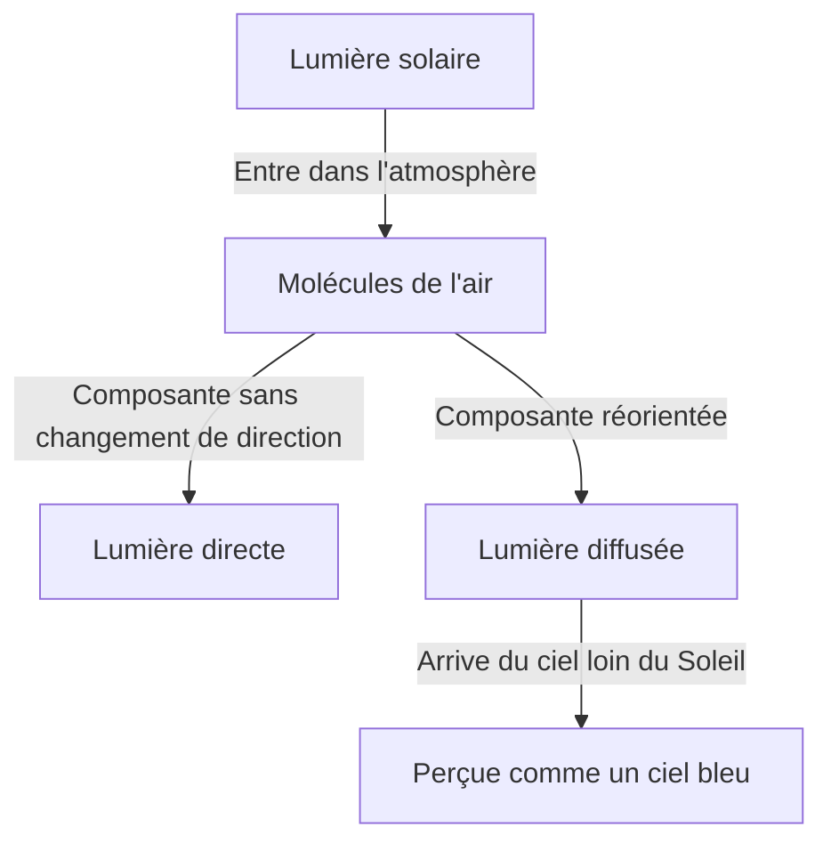
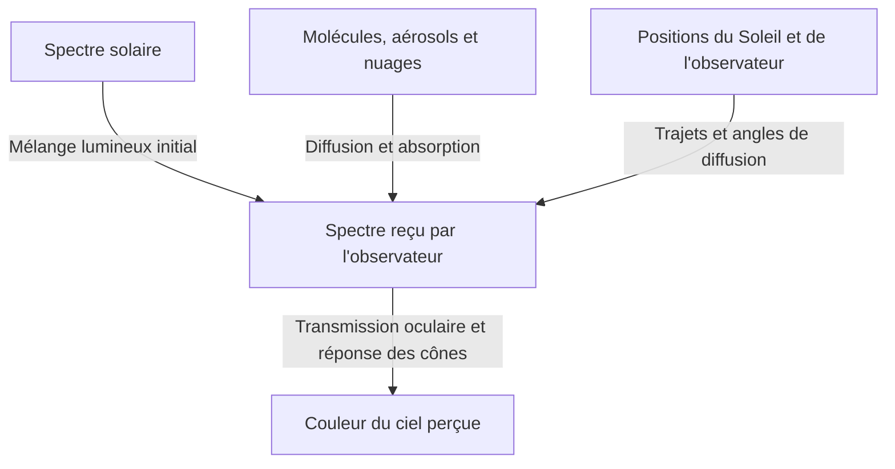

Par temps clair, un bleu profond s'étend au-dessus de nous et devient peu à peu blanchâtre vers l'horizon. Pourtant, lorsque le Soleil descend, ce même ciel vire au jaune et à l'orange. Après son coucher, une autre sorte de bleu profond apparaît.

Enfermez de l'air dans un petit récipient transparent : vous n'y verrez rien qui ressemble à de la peinture bleue. D'où vient donc le bleu qui recouvre le ciel ?

La réponse courte est que les molécules de l'air diffusent la lumière solaire, favorisant l'arrivée vers nos yeux de courtes longueurs d'onde depuis le ciel. Mais cette phrase cache des questions essentielles. Qu'est-ce que la diffusion ? Pourquoi dépend-elle de la longueur d'onde ? Pourquoi voyons-nous du bleu plutôt que du violet, encore plus court ? Et comment ce même mécanisme produit-il un coucher de soleil rouge ?

En suivant ces questions, on découvre que la couleur du ciel n'appartient pas à l'atmosphère seule. Le Soleil fournit la lumière, l'atmosphère la réoriente, et nos yeux perçoivent la couleur. Le phénomène résulte de leur action conjointe.

## 1. Distinguer d'abord la lumière solaire de celle du ciel

Le jour, à l'extérieur, une partie de la lumière arrive presque directement du Soleil, tandis qu'une autre vient des autres directions du ciel. La première est le rayonnement solaire direct ; la seconde, la lumière diffuse du ciel. Le sol et les bâtiments réfléchissent aussi de la lumière, mais commençons par distinguer ces deux composantes.

Imaginez observer une portion du ciel avec le Soleil dans le dos. Il n'est pas dans votre ligne de visée. Pourtant, de la lumière entre dans vos yeux depuis cette direction. Une partie du rayonnement solaire a changé de direction dans l'atmosphère et s'est dirigée vers vous.

L'œil attribue la luminosité à la direction d'où arrive la lumière. Il n'existe pas de mur bleu au-dessus de nous. L'air réparti sur une longue portion de la ligne de visée nous envoie de la lumière, et l'accumulation de ces contributions ressemble à une voûte lumineuse continue.

Si l'on pouvait enlever seulement l'atmosphère terrestre sans changer le Soleil ni le sol, les surfaces éclairées resteraient brillantes, mais le ciel serait sombre en dehors du Soleil et des objets réfléchissants. Les photographies diurnes de la Lune, avec un sol lumineux sous un ciel noir, illustrent ce contraste.

L'essentiel est que la diffusion ne crée pas de lumière : elle redistribue ses destinations. Ce qui est perdu dans une ligne de visée tournée vers le Soleil devient, pour quelqu'un regardant ailleurs, de la lumière qui éclaire le ciel.

Le schéma sépare les chemins, mais un nombre immense de molécules intervient simultanément. Une seule molécule ne bleuit pas tout le ciel, et une lumière diffusée une fois n'atteint pas nécessairement l'observateur.

## 2. La lumière solaire blanche contient de nombreuses longueurs d'onde

La lumière est une onde électromagnétique. Des variations de champs électrique et magnétique se propagent dans l'espace et possèdent des propriétés ondulatoires. La distance séparant deux crêtes successives est la longueur d'onde, généralement notée par la lettre grecque $\lambda$.

Le domaine visible dépend de l'état de l'œil et du critère de détection, mais s'étend approximativement de 380 à 780 nanomètres. Un nanomètre vaut un milliardième de mètre. Les longueurs d'onde visibles sont donc bien inférieures à l'épaisseur d'un cheveu.

Dans cet intervalle, les plus courtes sont perçues comme violettes ou bleues, les plus longues comme orange ou rouges. La nature ne trace toutefois pas de frontières nettes entre les noms de couleurs. Ces catégories humaines découpent une distribution lumineuse continue.

Le Soleil n'émet pas une seule longueur d'onde. Son rayonnement couvre un vaste domaine, du violet au rouge, mais aussi l'ultraviolet et l'infrarouge invisibles. Plusieurs composantes visibles atteignent l'œil, tandis que la vision s'adapte à l'éclairage ambiant. Nous pouvons ainsi considérer le jour comme un éclairage blanchâtre.

Un prisme sépare ce mélange parce que les longueurs d'onde s'y propagent différemment. Le ciel bleu n'est pourtant pas un immense arc-en-ciel projeté par un prisme. C'est la proportion réorientée dans l'atmosphère qui varie avec la longueur d'onde, modifiant le mélange reçu depuis des directions éloignées du Soleil.

Confondre ces mécanismes conduirait à dire que la lumière solaire est transformée en lumière bleue. Dans la diffusion Rayleigh ordinaire, la longueur d'onde est approximativement conservée. Les composantes bleues déjà présentes dans la lumière blanche sont simplement plus facilement déviées.

## 3. Comment des molécules transparentes diffusent-elles la lumière ?

### Les molécules sont-elles de petits miroirs ?

L'atmosphère contient surtout du diazote et du dioxygène. En volume, l'air sec compte environ 78 % de diazote et 21 % de dioxygène, le reste comprenant notamment de l'argon. La vapeur d'eau varie selon les lieux et la météo ; ces chiffres concernent donc l'air sans vapeur d'eau.

Ces molécules sont bien plus petites que les longueurs d'onde visibles. Les représenter comme des miroirs ordinaires sur lesquels rebondissent des rayons ne suffit pas à expliquer la forte dépendance spectrale.

Une image plus physique part du champ électrique de la lumière, qui exerce des forces sur les électrons et les noyaux atomiques de la molécule. Les distributions de charges négatives et positives se décalent légèrement. Ce déplacement relatif crée une polarisation électrique.

Lorsque le champ oscille, cette séparation de charges oscille aussi. Un dipôle électrique oscillant émet des ondes électromagnétiques. Sa réponse se superpose à l'onde incidente, et de la lumière apparaît dans d'autres directions que l'avant. C'est l'image fondamentale de la diffusion.

Dire ici que la molécule émet de la lumière ne signifie pas qu'elle l'absorbe, la stocke, puis brille plus tard d'une autre couleur, comme en fluorescence. On considère une réponse approximativement élastique à l'onde incidente. Une description rigoureuse exige la mécanique quantique, mais l'électromagnétisme classique explique déjà bien la dépendance spectrale essentielle du ciel bleu.

### Pourquoi l'air proche est-il transparent alors que le ciel est lumineux ?

Diffuser ne signifie pas être opaque. Sur quelques mètres dans une pièce, la diffusion moléculaire de la lumière visible est faible et la majeure partie traverse l'air. Voilà pourquoi nous distinguons nettement le mur opposé.

En regardant le ciel, le trajet ne se limite toutefois pas à quelques mètres. Malgré la baisse de densité avec l'altitude, la lumière traverse une épaisse couche atmosphérique. Chaque molécule agit peu, mais leur immense nombre et la longueur du parcours produisent une lumière diffusée visible.

La taille des molécules n'est pas elle-même bleue, et l'air transparent ne devient pas soudain un matériau bleu. Une interaction imperceptible sur une courte distance devient importante sur un long trajet. Cette accumulation de petits effets est au cœur du ciel bleu.

## 4. Que signifie la loi de la puissance quatre ?

Sous certaines conditions, la diffusion par des objets très petits devant la longueur d'onde, comme les molécules, est appelée diffusion Rayleigh. Pour l'air dans le visible, la section efficace de diffusion $\sigma$ varie approximativement ainsi :

$$
\sigma(\lambda) \propto \frac{1}{\lambda^4}
$$

La section efficace exprime la probabilité de diffusion avec une unité de surface. Elle n'est pas simplement l'aire du contour géométrique d'une molécule. Elle résume l'intensité de l'interaction entre lumière et molécule.

En comparant une composante bleue de 450 nanomètres à une composante rouge de 650 nanomètres, on obtient environ :

$$
\frac{\sigma(450\,\mathrm{nm})}{\sigma(650\,\mathrm{nm})}
\approx \left(\frac{650}{450}\right)^4
\approx 4.35
$$

À intensités incidentes égales, le bleu est donc environ 4,35 fois plus susceptible d'être diffusé que le rouge. L'écart est bien supérieur au simple rapport des longueurs d'onde.

Cela ne signifie pas que le ciel est 4,35 fois plus bleu que rouge. Ce calcul ne tient pas encore compte du spectre solaire, de l'atténuation avant et après diffusion, de la direction d'observation ni de la sensibilité de l'œil. Le rapport de sections efficaces et la couleur perçue sont deux grandeurs distinctes.

### Pourquoi la quatrième puissance plutôt que la deuxième ?

Dans un modèle électromagnétique simple, tant que la polarisabilité moléculaire est presque indépendante de la longueur d'onde, l'amplitude du dipôle induit est proportionnelle au champ incident. En revanche, l'amplitude du champ électrique rayonné au loin par ce dipôle contient le carré de sa pulsation $\omega$.

L'intensité lumineuse étant proportionnelle au carré de l'amplitude du champ, l'intensité rayonnée contient $\omega^4$. Dans le vide, $\omega$ est inversement proportionnel à la longueur d'onde, d'où la relation $1/\lambda^4$.

Ce n'est pas une explication géométrique selon laquelle les petites longueurs d'onde heurteraient de petits interstices. C'est une loi ondulatoire issue du rayonnement électromagnétique des charges oscillantes.

Il ne faut pas étendre cette approximation à toutes les longueurs d'onde. Près d'une résonance moléculaire, la réponse de polarisation change et l'absorption devient importante. Si le diffuseur est grand devant la longueur d'onde, les conditions de Rayleigh ne sont plus remplies. La loi est puissante, mais possède un domaine de validité.

## 5. Pourquoi le ciel ne paraît-il pas violet ?

La puissance quatre suggère que le violet, de longueur d'onde plus courte que le bleu, devrait être encore davantage diffusé. La question est pertinente : la lumière diffusée contient effectivement du violet autant que du bleu.

Cependant, notre perception ne sélectionne pas simplement la longueur d'onde la plus diffusée. L'œil reçoit un mélange étendu, et le système visuel répond à sa composition entière.

D'abord, le spectre solaire n'a pas la même intensité partout. La transmission et la diffusion atmosphériques le modifient selon la longueur d'onde. S'ajoutent ensuite la transmission à l'intérieur de l'œil et les sensibilités des photorécepteurs rétiniens.

En forte luminosité, la vision des couleurs repose surtout sur trois types de cônes : S, M et L, relativement sensibles aux longueurs d'onde courtes, moyennes et longues. Ce ne sont pas des interrupteurs réservés respectivement au bleu, au vert et au rouge. Leurs domaines de sensibilité sont larges et se recouvrent.

Le cerveau construit la couleur en comparant leurs réponses. Même si les courtes longueurs d'onde dominent relativement dans le ciel, la combinaison des stimulations produit habituellement un bleu, parfois légèrement violacé, par temps clair. La faible sensibilité humaine à l'extrémité violette compte aussi. [L'explication de la NASA sur les ondes électromagnétiques](https://science.nasa.gov/ems/03_behaviors/) distingue également diffusion et sensibilité visuelle.

Dire que tout le violet est absorbé par l'atmosphère est donc insuffisant. Le violet visible atteint le sol. L'ultraviolet n'est pas non plus identique au violet visible. L'absorption des UV par l'ozone ne peut remplacer l'explication de l'absence d'un ciel violet.

Affirmer que le ciel est réellement violet et que nos yeux se trompent n'est pas plus approprié. Un spectre physique et une expérience de couleur décrivent des étapes différentes. La vision ne dysfonctionne pas : elle interprète le mélange lumineux selon ses règles habituelles.

## 6. Le ciel bleu nous envoie aussi du rouge

Un spectroscope dirigé vers le ciel bleu ne montre pas une unique raie bleue. Il révèle aussi des longueurs d'onde correspondant au rouge et au vert. Les courtes sont relativement renforcées, et l'ensemble paraît bleu.

C'est une différence importante entre le ciel et une LED ou un laser bleus. Une émission concentrée dans un domaine étroit et un large mélange spectral déséquilibré peuvent sembler similaires sans posséder le même spectre.

Cela explique aussi la difficulté de reproduire fidèlement la couleur du ciel. Un écran combine généralement des émissions rouges, vertes et bleues. En produisant des réponses de cônes comparables, il peut créer une couleur proche de celle du ciel avec un spectre pourtant différent.

Inversement, le bleu photographié dépend du capteur, de la balance des blancs, de l'exposition, du traitement et de l'écran. Un bleu plus profond sur une photo ne prouve pas directement que la diffusion moléculaire était plus forte.

Évitons donc d'associer trop rigidement une longueur d'onde à une couleur. Cette distinction aide à comprendre aussi bien la question du violet que la photographie et les écrans.

## 7. Le coucher de soleil rougit parce que le trajet lumineux change

Le ciel bleu du jour et le coucher de soleil rouge ne sont pas deux phénomènes indépendants. Tous deux dépendent de la façon dont la diffusion varie avec la longueur d'onde. C'est le chemin de la lumière considérée qui change.

Quand le Soleil est haut, le trajet jusqu'au sol est relativement court. Près de l'horizon, la lumière traverse obliquement une bien plus longue portion d'atmosphère. Les courtes longueurs d'onde sont plus facilement retirées du faisceau direct, laissant une proportion accrue de rouge et d'orange dans la lumière venant du Soleil.

Le même fait — le bleu est facilement diffusé — bleuit donc le ciel loin du Soleil et rougit la lumière directe après un long parcours atmosphérique. [NASA Space Place](https://spaceplace.nasa.gov/blue-sky/en/) illustre cette variation de longueur du trajet.

Toute la rougeur du ciel du soir ne se réduit cependant pas à la lumière solaire arrivant directement dans l'œil. Une lumière déjà rougie peut ensuite être diffusée par des molécules ou des particules, ou réfléchie et diffusée par les nuages, puis arriver depuis d'autres directions. Les nuages deviennent vermillon parce que leur éclairage a changé de couleur.

### Penser l'épaisseur atmosphérique le long du trajet

Dans un modèle simple d'atmosphère plane, si $z$ est l'angle zénithal solaire, le trajet relatif au trajet vertical vaut approximativement :

$$
m \approx \frac{1}{\cos z}
$$

Pour $z=60^\circ$, on obtient environ deux fois le trajet vertical. Mais la formule échoue près de l'horizon : elle diverge lorsque $z$ tend vers 90 degrés, alors que le trajet réel reste fini. Il faut intégrer la courbure terrestre, la décroissance de densité avec l'altitude et la réfraction.

Les schémas de couchers de soleil représentent souvent l'atmosphère comme une coquille épaisse de densité uniforme. Il s'agit d'une simplification pour comparer les directions. L'atmosphère réelle ne possède ni plafond rigide où elle s'arrête brusquement, ni densité identique partout.

## 8. L'épaisseur optique permet de quantifier la couleur du ciel

À distance géométrique égale, diffusion et absorption changent si la densité de l'air ou la quantité de particules change. On utilise donc l'épaisseur optique, également appelée profondeur optique, notée $\tau$.

Dans le cas simple de la seule diffusion moléculaire, avec une densité numérique $n(s)$ le long du trajet :

$$
\tau_{\mathrm{R}}(\lambda)=\int n(s)\,\sigma(\lambda)\,ds
$$

La variable $s$ mesure la distance le long du parcours. On multiplie densité numérique et section efficace, puis on additionne les contributions. Les unités — mètre cube inverse, mètre carré et mètre — se compensent : $\tau$ est sans dimension.

Si $\tau_{\mathrm{ext}}$ représente l'épaisseur optique d'extinction comprenant absorption et diffusion par les aérosols, la lumière directe non diffusée diminue, dans un modèle simple, selon :

$$
I_{\mathrm{direct}}(\lambda)=I_0(\lambda)\exp[-\tau_{\mathrm{ext}}(\lambda)]
$$

Chaque petit trajet supplémentaire retire une certaine fraction de la lumière restante. Il ne soustrait pas à chaque fois une quantité absolue identique à un faisceau déjà fortement affaibli. La diminution est donc exponentielle plutôt que linéaire.

Cette équation seule ne donne pas la luminosité du ciel bleu. Elle suit ce qui quitte le faisceau direct. La lumière nouvellement diffusée vers la ligne de visée doit être ajoutée séparément.

Pour calculer la lumière du ciel reçue d'une direction, on considère chaque point de la visée : intensité solaire qui l'atteint, probabilité de diffusion vers l'observateur, puis fraction survivant au trajet restant. On multiplie ces facteurs et on intègre. Le ciel bleu n'est pas la couleur d'un point isolé, mais la somme de contributions réparties sur une longue distance.

## 9. Pourquoi le bleu varie-t-il selon la région du ciel ?

Le bleu au zénith diffère souvent du bleu pâle de l'horizon. Même au même moment, le ciel n'est pas uniforme. Les directions traversent différentes quantités d'air, tandis que les contributions des aérosols bas et de la diffusion multiple varient aussi.

Près de l'horizon, le regard traverse longuement les basses couches. Outre les molécules, des particules fines et des gouttelettes y ajoutent de nombreuses longueurs d'onde à la visée. Ce mélange plus blanc réduit la saturation du bleu initial.

La lumière du ciel peut elle-même être diffusée ou absorbée de nouveau avant d'atteindre l'œil. Supposer simplement que davantage d'atmosphère donne davantage de bleu finit donc par échouer. Il faut traiter ensemble les apports de lumière et ses pertes.

Un ciel profond en montagne ne traduit pas davantage une proportion simple entre altitude et bleu. Moins d'air au-dessus, l'éloignement de la brume basse et les contrastes de luminosité se combinent. Selon l'humidité et l'état atmosphérique, le ciel peut rester blanchâtre en altitude.

Pour la même raison, un temps sec ne garantit pas un bleu intense, ni une pluie récente une parfaite transparence. La vapeur d'eau n'est pas du brouillard visible ; elle peut agir par l'absorption d'humidité des particules et par la formation de nuages ou de brume. Une photo ne suffit pas à déterminer de façon unique humidité ou pollution.

## 10. Pourquoi les nuages blancs ne sont-ils pas bleus ?

Les nuages diffusent eux aussi le Soleil. Leur blancheur vient principalement de la taille des diffuseurs, très différente de celle des molécules d'air.

Les gouttelettes ont typiquement des dimensions micrométriques ou supérieures ; beaucoup dépassent les longueurs d'onde visibles. Certains nuages sont formés de cristaux de glace. On ne peut plus appliquer sans modification la simple loi moléculaire de puissance quatre.

La théorie de Mie décrit notamment la diffusion par des particules sphériques. Le rapport entre taille et longueur d'onde, l'indice de réfraction et d'autres paramètres déterminent la force et la direction de diffusion. Un nuage réel réunit de nombreuses tailles : la lumière visible est diffusée sur une gamme relativement large, d'où l'aspect blanchâtre sous le Soleil.

Blanc ne signifie pas que toutes les longueurs d'onde sont diffusées exactement dans la même proportion. Une gouttelette possède des dépendances spectrales et angulaires complexes. Mais les tailles et les chemins se combinent en une lumière moins dominée par les courtes longueurs d'onde que celle du ciel bleu.

Pourquoi le dessous d'un nuage de pluie est-il alors gris sombre ? Dans un nuage épais et développé, les diffusions répétées renvoient davantage de lumière vers le haut ou les côtés. Si moins atteint la base, elle paraît sombre depuis le sol. Les gouttelettes ne sont pas devenues une substance grise.

Les bords clairs et la base sombre s'expliquent également par les trajets internes et externes. Associer simplement nuages blancs à eau propre et nuages gris à eau sale est une erreur.

## 11. Brume, fumée et poussière modifient-elles le ciel de la même façon ?

Les petites particules solides et les gouttelettes suspendues dans l'atmosphère sont appelées aérosols. Elles comprennent sels marins, poussières du sol et particules de fumée, et se distinguent des molécules gazeuses.

Leurs propriétés optiques dépendent de la distribution des tailles, de la forme et de la composition. Certaines diffusent efficacement ; pour d'autres, comme la suie, l'absorption est importante. Un ciel blanchâtre et un ciel brunâtre ne peuvent donc pas tous deux s'expliquer par un simple supplément de bleu.

Avec des particules plus grandes que les molécules, une forte diffusion vers l'avant, près de la direction initiale, peut devenir importante. Le large éclat blanc autour du Soleil est lié à cette dépendance angulaire. Mais observer près du Soleil est dangereux même à l'œil nu : ne le fixez jamais pour vérifier cet effet.

Un air plus pollué ne garantit pas non plus un coucher de soleil plus beau et plus rouge. Une quantité modérée de particules peut renforcer certaines couleurs, mais une fumée ou une poussière épaisse atténue fortement la lumière et ternit la scène. Altitude des nuages, hauteur du Soleil et répartition des particules changent le résultat.

Plusieurs causes produisant la couleur atmosphérique, la couleur seule ne suffit pas pour les identifier. Les observations scientifiques combinent longueurs d'onde, polarisation et directions afin d'estimer quantité et nature des particules. La question quotidienne du ciel bleu ouvre ainsi sur la télédétection atmosphérique.

## 12. Une autre propriété du ciel : la polarisation

La lumière possède, outre longueur d'onde et intensité, une direction d'oscillation du champ électrique. Une préférence dans ces directions constitue la polarisation. La lumière d'un ciel clair est partiellement polarisée selon la direction observée.

Dans une diffusion Rayleigh idéale unique d'une lumière incidente non polarisée, l'intensité dépend approximativement de l'angle de diffusion $\theta$ selon :

$$
I(\theta)\propto 1+\cos^2\theta
$$

Cet angle sépare la direction initiale de la direction après diffusion. À 90 degrés, sur le côté, l'intensité n'est pas nulle. L'équation exprime donc aussi la capacité des molécules à envoyer latéralement la lumière solaire.

Dans le même modèle idéal, le degré de polarisation linéaire vaut :

$$
P(\theta)=\frac{\sin^2\theta}{1+\cos^2\theta}
$$

Son maximum se situe à 90 degrés. Dans le ciel réel, propriétés moléculaires, diffusion multiple, aérosols et réflexions du sol interviennent ; on n'obtient donc pas la polarisation parfaite de cette formule idéale.

En observant loin du Soleil à travers un filtre polarisant que l'on fait tourner, la luminosité peut changer. C'est pourquoi les polariseurs photographiques peuvent renforcer le bleu apparent. [HyperPhysics de Georgia State University](https://hyperphysics.phy-astr.gsu.edu/hbase/phyopt/skypol.html) décrit le lien entre direction et polarisation du ciel.

Un objectif grand-angle embrasse plusieurs angles de diffusion. Le filtre peut alors assombrir inégalement le ciel et produire des zones peu naturelles. Cet effet photographique n'est pas nécessairement un défaut : il révèle le motif de polarisation céleste.

## 13. Pourquoi du bleu subsiste-t-il après le coucher du Soleil ?

Le coucher du Soleil n'est pas l'instant où toute l'atmosphère terrestre cesse d'être éclairée. Même lorsque le Soleil disparaît pour un observateur au sol, certaines régions élevées restent illuminées. Leur lumière diffusée atteint le sol, empêchant une obscurité immédiate.

La diffusion multiple intervient aussi : une lumière déjà diffusée est diffusée une seconde fois ailleurs. L'explication élémentaire du jour peut privilégier un seul événement, mais les trajets du crépuscule deviennent longs et complexes ; cette approximation ne suffit plus.

L'ozone peut également jouer un rôle important. Connu pour absorber les UV, il possède aussi une large bande d'absorption visible, la bande de Chappuis. Sur de longs parcours, cette absorption sélective influence les couleurs du soir.

Le bleu profond de l'heure bleue est donc difficile à expliquer entièrement par la seule diffusion Rayleigh unique du modèle diurne. Il faut réunir atmosphère sphérique, zones d'ombre, ozone, aérosols et diffusion multiple. Un [rapport technique de la NASA](https://ntrs.nasa.gov/citations/19730020661) calcule les contributions de l'ozone et des aérosols aux couleurs crépusculaires.

Dire que la diffusion moléculaire est la cause principale du bleu diurne et que l'absorption influence le crépuscule n'est pas contradictoire. L'importance relative des processus varie avec l'heure, la direction et les conditions atmosphériques.

## 14. Mer bleue, montagnes bleues et Terre bleue vue de l'espace

### Le ciel ne devient pas bleu en reflétant simplement la mer

On entend parfois que le ciel reflète la couleur de l'océan. Pourtant, le ciel est bleu loin à l'intérieur des terres. Avec une atmosphère et une source lumineuse appropriées, la diffusion moléculaire produit du bleu sans océan.

La surface marine réfléchit réellement la lumière du ciel, ce qui influence son apparence. Mais le bleu de la mer ne se réduit pas non plus à un miroir. Sur de longs trajets, l'eau absorbe préférentiellement le rouge ; avec la diffusion sous-marine, cela permet au bleu de revenir. Près des côtes, fond marin, matières en suspension et phytoplancton modifient aussi la couleur. [L'explication de la NOAA](https://oceanservice.noaa.gov/facts/oceanblue.html) décrit l'absorption du rouge par l'eau.

Ciel et mer influencent leurs apparences respectives, sans devoir leur bleu à une cause unique et identique. Des couleurs semblables n'impliquent pas forcément le même mécanisme.

### Les montagnes lointaines bleutent parce que de l'air nous en sépare

Lorsque des montagnes éloignées paraissent bleutées et leurs contours atténués, leur lumière s'affaiblit dans l'atmosphère tandis que l'air intermédiaire ajoute de la lumière diffusée à la visée. Cette contribution est parfois appelée lumière de voile, ou airlight.

La montagne n'est pas couverte de peinture bleue : son image se superpose à la contribution atmosphérique. La perspective aérienne en peinture, qui rend les lointains plus pâles et plus bleus, exploite cet effet quotidien. En forte brume ou sous un éclairage du soir, la lumière ajoutée peut toutefois changer de couleur.

Le bleu terrestre vu de l'espace combine lumière de la surface et de l'intérieur des océans, diffusion atmosphérique, nuages et autres contributions. Regarder au-dessus de soi depuis le sol et observer la planète entière implique des perspectives et des chemins différents. Même l'expression 'la Terre est bleue' réunit plusieurs phénomènes optiques.

## 15. Un coucher de soleil martien bleu contredit-il la puissance quatre ?

Des images du soir sur Mars montrent parfois du bleu près du Soleil. Cela semble l'inverse du coucher rouge terrestre et pourrait paraître réfuter la diffusion Rayleigh.

Mais les fines poussières atmosphériques jouent un rôle majeur sur Mars. Les conditions ne sont pas celles d'un modèle simple dominé par les molécules. Taille et propriétés des particules modifient la répartition angulaire de la diffusion selon la longueur d'onde.

Le soir martien, la lumière traversant la poussière peut favoriser le bleu dans une région étroite près du Soleil. Cela ne signifie pas que tout le ciel martien ressemble toujours à un ciel terrestre clair. [L'image de coucher de soleil de Perseverance publiée par la NASA](https://science.nasa.gov/resource/mastcam-zs-first-martian-sunset/) en montre un exemple.

Les lois naturelles ne changent pas arbitrairement selon le lieu. Ce sont la composition de l'atmosphère, les particules, la longueur des trajets et la direction d'observation qui changent. Le même électromagnétisme produit des couleurs différentes lorsque les conditions d'entrée diffèrent.

On peut étendre ce raisonnement aux planètes orbitant d'autres étoiles. Si le spectre de la source, l'atmosphère et les nuages diffèrent, un ciel bleu n'est pas garanti. La couleur familière de la Terre est une expression particulière de lois universelles dans des conditions terrestres.

## 16. Que peut-on observer chez soi ?

### De l'eau additionnée d'un peu de lait

Remplissez d'eau un récipient transparent, ajoutez du lait par très petites quantités et éclairez-le latéralement avec une LED blanche. Dans une pièce légèrement assombrie, comparez le trajet vu de côté avec la lumière ayant traversé le récipient et projetée sur du papier blanc.

Avec une concentration et un parcours adaptés, les couleurs de la lumière latéralement diffusée et de la lumière transmise peuvent différer. Trop de particules rendent l'ensemble blanc et trouble, presque opaque. La source et la forme du récipient influencent aussi le résultat.

L'intérêt est de séparer lumière diffusée sur le côté et lumière allant tout droit. Cependant, les particules du lait sont bien plus grandes que les molécules de diazote ou de dioxygène et présentent plusieurs tailles. Ce n'est ni une reproduction exacte de la diffusion Rayleigh atmosphérique ni une mesure de la puissance quatre.

Même une lampe blanche ne contient pas forcément un spectre visible continu et uniforme. Avec une lampe de téléphone, le spectre des LED influence l'expérience. Ne pas voir de bleu ne réfute pas la diffusion : il faut examiner les différences entre le modèle et l'atmosphère réelle.

### Comparer le ciel avec un filtre polarisant

Un polariseur photographique ou des lunettes polarisantes peuvent montrer des changements de luminosité lorsqu'on les tourne en regardant loin du Soleil. Comparer nuages et horizon révèle que la lumière céleste n'a pas partout les mêmes propriétés.

Ne regardez pas le Soleil. Les lunettes de soleil et les polariseurs ordinaires ne sont pas des filtres sûrs pour l'observation solaire. Évitez également toute observation directe avec jumelles, télescope ou viseur optique d'appareil photo. Choisissez uniquement une direction sûre, bien éloignée du Soleil.

Pour photographier, gardez cadrage, exposition et balance des blancs fixes. Une correction automatique peut éclaircir un ciel réellement assombri et masquer le changement.

### Noter les conditions autant que les couleurs

Matin, midi et soir, relevez la hauteur approximative du Soleil, la direction observée, les nuages et la brume à l'horizon. Plutôt qu'un seul mot pour le bleu, distinguez 'bleu profond au-dessus, blanc au loin' ou 'seule la base du nuage est sombre'. Ces descriptions se relient mieux à la physique.

Une observation ne doit pas fournir un diagnostic définitif de l'atmosphère. Comparer les conditions, conserver les résultats inattendus et distinguer traitement photographique et impression visuelle constitue déjà une démarche scientifique.

## 17. Pour aller plus loin : verre transparent et air

Une autre question apparaît. Le verre contient lui aussi électrons et noyaux, et doit se polariser sous l'effet de la lumière. Devrait-il donc diffuser fortement sur les côtés, comme le ciel ?

En additionnant de nombreuses petites réponses, il ne faut pas oublier leur phase. Les amplitudes électriques peuvent se renforcer ou s'annuler. Additionner simplement la luminosité de chaque atome comme s'il s'agissait d'une source indépendante n'est pas toujours correct.

Dans un milieu idéalement homogène, les ondes issues d'une polarisation répartie de façon spatialement lisse se superposent pour former une onde allant vers l'avant. Cette réponse collective intervient dans l'indice de réfraction et la propagation. La diffusion dans les autres directions dépend notamment des fluctuations spatiales de densité ou d'indice, des impuretés et des défauts.

Dans un gaz, les molécules se déplacent et la densité numérique locale présente des fluctuations statistiques. La diffusion moléculaire d'un gaz dilué et la diffusion par fluctuations de densité d'un milieu décrit continûment ne sont pas des phénomènes sans rapport : ce sont des descriptions liées à différentes échelles.

Le verre réel présente lui aussi faible diffusion, absorption et réflexion de surface. Il n'est pas un milieu idéal parfaitement homogène et sans pertes. Mais la superposition des ondes corrige l'idée selon laquelle davantage d'atomes augmenterait simplement la diffusion latérale en proportion de leur nombre.

L'explication quotidienne commence par une molécule ; une analyse précise mène aux positions relatives et aux interférences. Comprendre ces niveaux fait passer d'une histoire de collisions de particules à la physique des ondes électromagnétiques.

## 18. Jusqu'où peut-on utiliser cette explication ?

'Le ciel est bleu à cause de la diffusion Rayleigh' constitue un excellent point de départ pour le ciel terrestre clair en journée. Cela ne promet pas de prévoir toute couleur du ciel avec une seule formule.

Dans une atmosphère suffisamment mince optiquement, la diffusion simple explique la dépendance spectrale et la polarisation de base. Longs parcours, horizon, nuages épais, crépuscule, fortes fumées et poussières exigent davantage de physique. La diffusion ajoute et retire de la lumière à la visée ; absorption et réflexion du sol interviennent aussi.

Suivre ces apports et pertes selon direction et longueur d'onde constitue le transfert radiatif. Un calcul précis combine structure verticale atmosphérique, position solaire, propriétés optiques des particules, réflexion du sol et réponse visuelle. On ne rejette pas l'explication simple comme fausse : on l'utilise en sachant quels effets son modèle néglige.

En levant les yeux, nous ne voyons pas chaque molécule. Pourtant, dans un même paysage, nous voyons se combiner interactions entre lumière et molécules, structure de l'atmosphère, interférences et perception humaine.

Le fait familier que le ciel soit bleu ne prouve pas que le monde soit simple. Il montre combien des phénomènes de différentes échelles s'articulent naturellement, sans attirer notre attention. Si le bleu de demain diffère de celui d'aujourd'hui, cette différence offrira un nouvel indice sur le trajet suivi par la lumière.

## Références

- [NASA Space Place: Why Is the Sky Blue?](https://spaceplace.nasa.gov/blue-sky/en/) — Introduction au ciel bleu et au coucher de soleil par les longueurs d'onde et les parcours atmosphériques.
- [NASA Science: Wave Behaviors](https://science.nasa.gov/ems/03_behaviors/) — Diffusion, réfraction, longueurs d'onde et sensibilité visuelle humaine.
- [Georgia State University, HyperPhysics: Skylight Polarization](https://hyperphysics.phy-astr.gsu.edu/hbase/phyopt/skypol.html) — Polarisation de la lumière céleste et direction d'observation.
- [NASA NTRS: The influence of ozone and aerosols on the brightness and color of the twilight zone](https://ntrs.nasa.gov/citations/19730020661) — Rapport technique sur ozone et aérosols dans le calcul des couleurs crépusculaires.
- [NOAA Ocean Service: Why is the ocean blue?](https://oceanservice.noaa.gov/facts/oceanblue.html) — Bleu de l'océan et absorption sélective par l'eau.
- [NASA Science: Mastcam-Z's First Martian Sunset](https://science.nasa.gov/resource/mastcam-zs-first-martian-sunset/) — Coucher de soleil martien et lumière bleue liée à la poussière.
