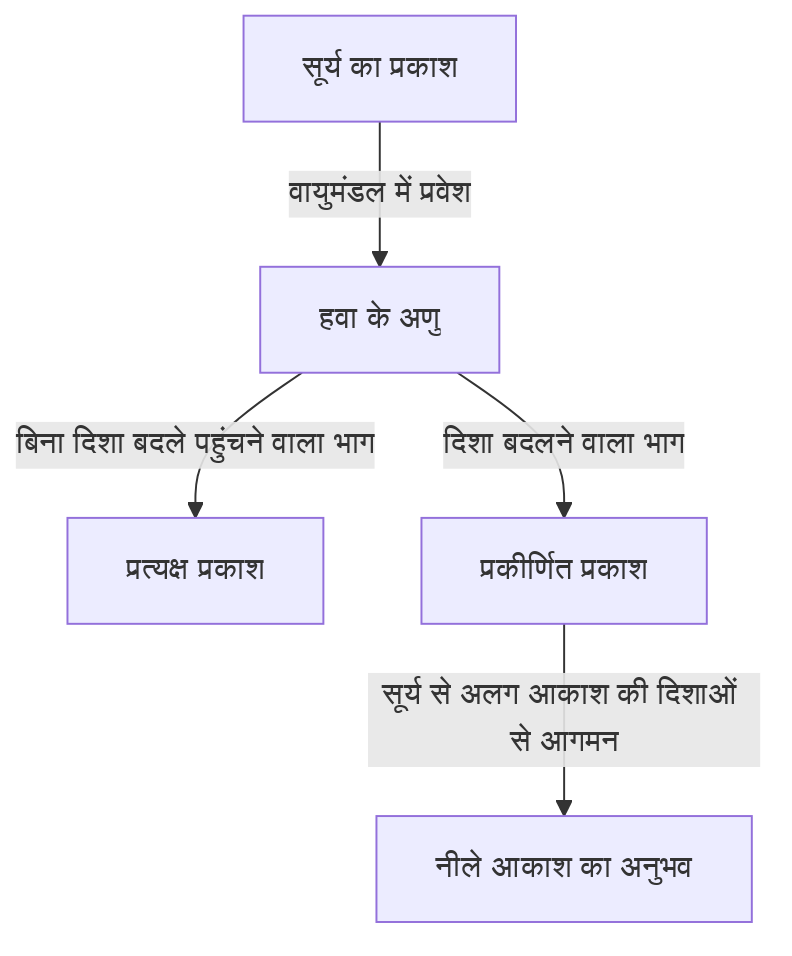
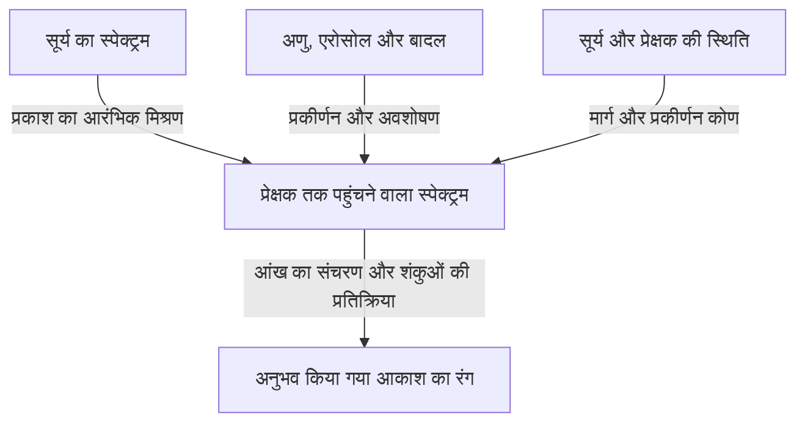

साफ दिन में ऊपर देखने पर सिर के ऊपर गहरा नीला आकाश दिखाई देता है, जो दूर क्षितिज की ओर धीरे-धीरे सफेद होने लगता है। लेकिन सूर्य नीचे आते ही यही आकाश पीला और नारंगी हो जाता है। सूर्यास्त के बाद फिर एक अलग प्रकार का गहरा नीला रंग उभरता है।

हवा को किसी छोटे पारदर्शी पात्र में भरें, तो वह नीले रंग की स्याही जैसी नहीं दिखाई देती। फिर पूरे आकाश में फैला नीला रंग आता कहां से है?

संक्षिप्त उत्तर है कि हवा के अणु सूर्य के प्रकाश का प्रकीर्णन करते हैं और छोटी तरंगदैर्घ्य वाला प्रकाश आकाश से हमारी आंखों तक अधिक आसानी से पहुंचता है। लेकिन इस एक वाक्य के भीतर कई महत्वपूर्ण प्रश्न छिपे हैं। प्रकीर्णन क्या है? यह तरंगदैर्घ्य के अनुसार क्यों बदलता है? नीले से भी छोटी तरंगदैर्घ्य वाला बैंगनी रंग क्यों नहीं दिखता? और यही प्रक्रिया लाल सूर्यास्त कैसे बनाती है?

इन प्रश्नों पर क्रम से विचार करने पर पता चलता है कि आकाश का रंग अकेले वायुमंडल का गुण नहीं है। उसे तीन चीजें मिलकर बनाती हैं: प्रकाश देने वाला सूर्य, प्रकाश के रास्ते बदलने वाला वायुमंडल और रंग का अनुभव कराने वाली आंखें।

## 1. सबसे पहले सूर्य से आने वाले और आकाश से आने वाले प्रकाश का अंतर

दिन में बाहर हमें सूर्य की दिशा से लगभग सीधा आने वाला प्रकाश भी मिलता है और सूर्य से अलग आकाश की दिशाओं से आने वाला प्रकाश भी। पहले को प्रत्यक्ष प्रकाश और दूसरे को आकाश का प्रकीर्णित प्रकाश कहते हैं। जमीन और इमारतों से परावर्तित प्रकाश भी होता है, लेकिन पहले इन दो भागों को अलग समझें।

कल्पना कीजिए कि सूर्य आपकी पीठ की ओर है और आप आकाश का कोई हिस्सा देख रहे हैं। आपकी दृष्टि की दिशा में सूर्य नहीं है, फिर भी वहां से प्रकाश आंखों में आता है। सूर्य से निकले प्रकाश का कुछ भाग रास्ते में वायुमंडल के कारण दिशा बदलकर आपकी ओर आ गया है।

आंख प्रकाश के आने से ठीक पहले की गति की दिशा के आधार पर उस दिशा को चमकीला मानती है। आकाश में कोई नीली दीवार नहीं है। दृष्टि रेखा के लंबे विस्तार में मौजूद हवा हमारी ओर प्रकाश भेजती है और इन योगदानों का योग एक चमकीले आकाश जैसा दिखाई देता है।

यदि सूर्य और जमीन को वैसा ही रखते हुए केवल पृथ्वी का वायुमंडल हटा दिया जाए, तो धूप पड़ने वाली जगहें चमकीली रहेंगी, लेकिन सूर्य और सतह के परावर्तक पिंडों से अलग दिशाओं का आकाश अंधेरा होगा। चंद्रमा पर दिन की तस्वीरों में चमकीली जमीन के ऊपर काला आकाश इस अंतर को समझने में मदद करता है।

मुख्य बात यह है कि प्रकीर्णन नया प्रकाश पैदा नहीं करता; वह प्रकाश की मंजिलों को फिर से बांटता है। सूर्य की ओर देखने वाली दिशा से निकला प्रकाश, दूसरी दिशा देखने वाले व्यक्ति के लिए आकाश को रोशन कर सकता है।

चित्र में रास्ते अलग बनाए गए हैं, लेकिन वास्तव में बहुत बड़ी संख्या में अणु एक साथ भाग लेते हैं। कोई अकेला अणु पूरे आकाश को नीला नहीं बनाता, और एक बार प्रकीर्णित हुआ हर प्रकाश भी अनिवार्य रूप से प्रेक्षक तक नहीं पहुंचता।

## 2. सूर्य के सफेद प्रकाश में कई तरंगदैर्घ्य होते हैं

प्रकाश एक विद्युतचुंबकीय तरंग है। विद्युत और चुंबकीय क्षेत्रों के परिवर्तन अंतरिक्ष में आगे बढ़ते हैं और तरंगों जैसे गुण दिखाते हैं। लगातार दो शिखरों के बीच की दूरी को तरंगदैर्घ्य कहते हैं; इसे सामान्यतः यूनानी अक्षर $\lambda$ से लिखते हैं।

मनुष्य को दिखाई देने वाला दायरा आंखों की स्थिति और दृश्यता की कसौटी पर निर्भर करता है, लेकिन मोटे तौर पर यह 380 से 780 नैनोमीटर के आसपास है। एक नैनोमीटर, एक मीटर का एक अरबवां भाग है। दृश्य प्रकाश की तरंगदैर्घ्य बाल की मोटाई से बहुत छोटी होती है।

इस दायरे में छोटी तरंगदैर्घ्य बैंगनी और नीली तथा बड़ी तरंगदैर्घ्य नारंगी और लाल महसूस होती है। फिर भी प्रकृति ने रंगों के नामों के बीच कोई स्पष्ट रेखा नहीं खींची है। लगातार बदलते प्रकाश वितरण को रंगों में बांटना कुछ हद तक मानव वर्गीकरण भी है।

सूर्य का प्रकाश किसी एक तरंगदैर्घ्य तक सीमित नहीं है। उसमें बैंगनी से लाल तक और अदृश्य पराबैंगनी तथा अवरक्त तक एक विस्तृत दायरा होता है। दृश्य भाग के अलग-अलग घटक आंखों तक पहुंचते हैं और दृष्टि आसपास की चमक के अनुकूल होती है, इसलिए हम दिन के प्रकाश को सफेदी लिए हुए रोशनी मानते हैं।

प्रिज्म इस मिश्रण को अलग-अलग तरंगदैर्घ्यों के अलग रास्तों के कारण अलग करता है। लेकिन नीला आकाश किसी विशाल प्रिज्म द्वारा बनाया गया इंद्रधनुष नहीं है। वायुमंडल में दिशा बदलने वाले प्रकाश का अनुपात तरंगदैर्घ्य पर निर्भर करता है, इसलिए सूर्य से दूर की दिशाओं से आने वाले प्रकाश का मिश्रण बदल जाता है।

इस अंतर को भूलने पर हम कह सकते हैं कि सूर्य का प्रकाश नीले प्रकाश में बदल गया। सामान्य रेले प्रकीर्णन में तरंगदैर्घ्य लगभग सुरक्षित रहता है। सफेद प्रकाश में पहले से मौजूद नीला भाग बस दूसरी दिशाओं में अधिक आसानी से मुड़ता है।

## 3. पारदर्शी अणु प्रकाश को कैसे प्रकीर्णित करते हैं?

### क्या अणु छोटे दर्पण हैं?

वायुमंडल के मुख्य घटक नाइट्रोजन और ऑक्सीजन हैं। शुष्क हवा में आयतन के हिसाब से लगभग 78% नाइट्रोजन और 21% ऑक्सीजन होती है; बाकी में आर्गन जैसी गैसें आती हैं। जलवाष्प की मात्रा स्थान और मौसम के साथ बदलती है, इसलिए ये प्रतिशत जलवाष्प रहित हवा के लिए हैं।

नाइट्रोजन और ऑक्सीजन के अणु दृश्य प्रकाश की तरंगदैर्घ्य से बहुत छोटे होते हैं। उन्हें साधारण दर्पण मानकर किरणों को उनकी सतह से उछलता दिखाना तरंगदैर्घ्य पर इतनी मजबूत निर्भरता को नहीं समझा सकता।

भौतिकी के अधिक निकट चित्र में प्रकाश का विद्युत क्षेत्र अणु के इलेक्ट्रॉनों और नाभिकों पर बल लगाता है। ऋणात्मक और धनात्मक आवेशों के वितरण थोड़े-से खिसकते हैं और अणु में विद्युत असमानता उत्पन्न होती है। इसे ध्रुवण कहते हैं।

यदि विद्युत क्षेत्र समय के साथ दोलन करता है, तो यह असमानता भी दोलन करती है। दोलन करता विद्युत द्विध्रुव आसपास विद्युतचुंबकीय तरंगें विकीर्ण करता है। प्रतिक्रिया से बनी तरंगें आने वाली तरंग के साथ अध्यारोपित होती हैं और आगे की दिशा के अलावा दूसरी दिशाओं में भी प्रकाश मिलता है। प्रकीर्णन की मूल तस्वीर यही है।

यहां 'अणु प्रकाश उत्सर्जित करता है' का अर्थ प्रतिदीप्ति नहीं है, जिसमें प्रकाश का अवशोषण होने के बाद कुछ समय पश्चात अक्सर दूसरे रंग का प्रकाश निकलता है। हम आने वाली विद्युतचुंबकीय तरंग के प्रति लगभग प्रत्यास्थ प्रतिक्रिया की बात कर रहे हैं। कठोर विश्लेषण के लिए क्वांटम यांत्रिकी चाहिए, लेकिन नीले आकाश की मूल तरंगदैर्घ्य निर्भरता इस शास्त्रीय विद्युतचुंबकीय चित्र से भी अच्छी तरह समझी जाती है।

### पास की हवा पारदर्शी है, तो आकाश चमकीला क्यों है?

प्रकाश प्रकीर्णित करना और अपारदर्शी होना एक बात नहीं है। कमरे के एक छोर से दूसरे तक कुछ मीटर में दृश्य प्रकाश का आणविक प्रकीर्णन कमजोर होता है और अधिकांश प्रकाश निकल जाता है। इसीलिए हम हवा के पार दीवार स्पष्ट देख सकते हैं।

लेकिन आकाश देखते समय प्रकाश का रास्ता केवल कुछ मीटर नहीं होता। ऊंचाई के साथ घनत्व घटता है, फिर भी प्रकाश वायुमंडल की लंबी परत से गुजरता है। एक अणु का प्रभाव छोटा हो सकता है, लेकिन अणुओं की विशाल संख्या और लंबी दूरी मिलकर दिखाई देने योग्य प्रकीर्णित प्रकाश बनाती हैं।

अणु का आकार स्वयं नीला नहीं है, और पारदर्शी हवा अचानक नीला पदार्थ नहीं बन जाती। कम दूरी पर लगभग अनदेखी रह जाने वाली कमजोर अंतःक्रिया लंबे रास्ते पर महत्वपूर्ण हो जाती है। छोटे प्रभावों का यह संचय नीले आकाश की खास बात है।

## 4. तरंगदैर्घ्य की चौथी घात का नियम क्या बताता है?

विशेष परिस्थितियों में तरंगदैर्घ्य से बहुत छोटे प्रकीर्णकों, जैसे अणुओं, द्वारा होने वाले प्रकीर्णन को रेले प्रकीर्णन कहते हैं। दृश्य दायरे में हवा के लिए प्रकीर्णन अनुप्रस्थ काट $\sigma$ की मोटी निर्भरता है:

$$
\sigma(\lambda) \propto \frac{1}{\lambda^4}
$$

प्रकीर्णन अनुप्रस्थ काट वह राशि है जो क्षेत्रफल की इकाई में बताती है कि प्रकीर्णन कितना आसानी से होता है। यह अणु की ज्यामितीय रूपरेखा का क्षेत्रफल मात्र नहीं है। यह प्रकाश और अणु की अंतःक्रिया की मजबूती को एक संख्या में समेटता है।

इस संबंध से 450 नैनोमीटर के नीले घटक और 650 नैनोमीटर के लाल घटक के लिए अनुपात लगभग मिलता है:

$$
\frac{\sigma(450\,\mathrm{nm})}{\sigma(650\,\mathrm{nm})}
\approx \left(\frac{650}{450}\right)^4
\approx 4.35
$$

यदि दोनों घटक समान तीव्रता से आएं, तो नीला घटक लगभग 4.35 गुना अधिक आसानी से प्रकीर्णित होगा। यह अंतर केवल तरंगदैर्घ्यों के अनुपात से कहीं बड़ा है।

लेकिन इसका अर्थ यह नहीं कि आकाश में 'नीलापन लालपन का 4.35 गुना' है। हमने अभी सूर्य के प्रत्येक तरंगदैर्घ्य की तीव्रता, प्रकीर्णन से पहले और बाद का क्षीणन, देखने की दिशा तथा आंख की संवेदनशीलता शामिल नहीं की है। अनुप्रस्थ काट का अनुपात और अंतिम अनुभव किया गया रंग अलग राशियां हैं।

### दूसरी घात के बजाय चौथी घात क्यों?

एक सरल विद्युतचुंबकीय मॉडल में, जहां अणु की ध्रुवणीयता लगभग स्थिर मानी जा सकती है, प्रेरित द्विध्रुव का आयाम आने वाले विद्युत क्षेत्र के अनुपाती होता है। वहीं द्विध्रुव द्वारा दूर विकीर्ण विद्युत क्षेत्र के आयाम में कोणीय आवृत्ति $\omega$ का वर्ग आता है।

प्रकाश की तीव्रता विद्युत क्षेत्र के आयाम के वर्ग के अनुपाती है, इसलिए विकिरण की शक्ति में $\omega^4$ आता है। निर्वात में $\omega$ तरंगदैर्घ्य के व्युत्क्रम के अनुपाती है, जिससे $1/\lambda^4$ मिलता है।

यह ऐसी ज्यामितीय कहानी नहीं कि छोटी तरंगें छोटे अंतरालों से अधिक टकराती हैं। यह दोलन करते आवेशों द्वारा विद्युतचुंबकीय तरंगें विकीर्ण करने के गुण से निकलने वाला तरंग नियम है।

बेशक इस सन्निकटन को सभी तरंगदैर्घ्यों तक नहीं बढ़ाया जा सकता। आणविक अनुनाद के पास ध्रुवण प्रतिक्रिया बदलती है और अवशोषण महत्वपूर्ण हो जाता है। यदि प्रकीर्णक तरंगदैर्घ्य की तुलना में बड़े हों, तो रेले सन्निकटन की शर्तें ही टूट जाती हैं। चौथी घात का नियम शक्तिशाली है, लेकिन उसका अपना लागू क्षेत्र है।

## 5. फिर भी आकाश बैंगनी क्यों नहीं दिखता?

केवल चौथी घात देखें, तो नीले से छोटी तरंगदैर्घ्य वाला बैंगनी और अधिक प्रकीर्णित होना चाहिए। यह उचित प्रश्न है। वास्तव में प्रकीर्णित प्रकाश में नीले के साथ बैंगनी घटक भी होते हैं।

लेकिन रंग देखने की व्यवस्था सबसे अधिक प्रकीर्णित होने वाली एक तरंगदैर्घ्य को चुनने का काम नहीं करती। आंख में विस्तृत दायरे का मिला-जुला प्रकाश आता है और दृश्य तंत्र पूरे मिश्रण पर प्रतिक्रिया देता है।

पहले तो सूर्य का स्पेक्ट्रम सभी तरंगदैर्घ्यों पर समान तीव्र नहीं है। उस पर वायुमंडल का संचरण और प्रकीर्णन प्रभाव डालते हैं। फिर आंख के भीतर प्रकाश के गुजरने के गुण और रेटिना की प्रकाश-संवेदी कोशिकाओं की संवेदनशीलता जुड़ती है।

तेज रोशनी में रंग दृष्टि मुख्यतः तीन प्रकार की शंकु कोशिकाओं पर निर्भर करती है: S, M और L, जो क्रमशः छोटी, मध्यम और लंबी तरंगदैर्घ्यों के प्रति अपेक्षाकृत अधिक संवेदनशील हैं। वे केवल नीले, हरे और लाल प्रकाश के अलग स्विच नहीं हैं। उनकी संवेदनशीलता के दायरे विस्तृत हैं और एक-दूसरे पर चढ़ते हैं।

मस्तिष्क उनकी प्रतिक्रियाओं की तुलना करके रंग बनाता है। आकाश के प्रकाश में छोटी तरंगें अधिक होने पर भी सामान्य साफ दिन में शंकुओं को मिलने वाला संयुक्त उद्दीपन नीला या थोड़ा बैंगनीपन लिए नीला महसूस होता है। बैंगनी छोर पर मानव संवेदनशीलता का कम होना भी महत्वपूर्ण है। [नासा की विद्युतचुंबकीय तरंगों की व्याख्या](https://science.nasa.gov/ems/03_behaviors/) प्रकीर्णन और दृष्टि की संवेदनशीलता को अलग करती है।

इसलिए 'बैंगनी प्रकाश वायुमंडल में पूरा अवशोषित हो जाता है' पर्याप्त व्याख्या नहीं है। दृश्य बैंगनी प्रकाश जमीन तक भी पहुंचता है। पराबैंगनी और दृश्य बैंगनी एक ही चीज नहीं हैं। ओजोन द्वारा पराबैंगनी अवशोषण को सीधे इस प्रश्न का उत्तर नहीं बनाया जा सकता।

उसी तरह 'आकाश वास्तव में बैंगनी है लेकिन आंख गलती करती है' कहना भी उचित नहीं। प्रकाश का स्पेक्ट्रम एक भौतिक राशि है और रंग का अनुभव दृश्य प्रक्रिया का परिणाम; ये अलग स्तरों के विवरण हैं। दृष्टि खराब नहीं चल रही, बल्कि हमेशा की तरह मिश्रित प्रकाश को पढ़ रही है।

## 6. नीले आकाश से लाल प्रकाश भी आता है

स्पेक्ट्रोस्कोप से नीला आकाश देखें, तो केवल एक नीली रेखा नहीं मिलेगी। उसमें लाल और हरे से संबंधित तरंगदैर्घ्य भी हैं। छोटी तरंगों का सापेक्ष योगदान अधिक होने से पूरा मिश्रण नीला दिखता है।

यही आकाश के प्रकाश और नीली LED या नीले लेजर का महत्वपूर्ण अंतर है। संकरे दायरे में केंद्रित प्रकाश और किसी झुकाव वाला विस्तृत मिश्रित स्पेक्ट्रम देखने में समान हो सकते हैं, फिर भी उनके स्पेक्ट्रम समान नहीं होंगे।

इससे आकाश का रंग ठीक-ठीक दोहराने की कठिनाई भी समझ आती है। कंप्यूटर स्क्रीन आम तौर पर लाल, हरे और नीले उत्सर्जकों को मिलाती है। यदि उनसे शंकु कोशिकाओं में समान प्रतिक्रियाएं उत्पन्न हों, तो वास्तविक आकाश से अलग स्पेक्ट्रम भी मिलता-जुलता रंग दिखा सकता है।

दूसरी ओर, फोटो में आकाश का रंग सेंसर की संवेदनशीलता, श्वेत संतुलन, एक्सपोजर, छवि प्रसंस्करण और स्क्रीन से बदलता है। तस्वीर का नीला अधिक गहरा है, तो केवल उससे यह नहीं कह सकते कि उस समय आणविक प्रकीर्णन अधिक मजबूत था।

तरंगदैर्घ्य और रंग को बहुत कड़ाई से एक-दूसरे का पर्याय न मानें। यह दृष्टिकोण बैंगनी वाले प्रश्न के साथ-साथ तस्वीरों के रंग और स्क्रीन के काम को भी एक साथ समझने देता है।

## 7. सूर्यास्त लाल होता है क्योंकि देखे जाने वाले प्रकाश का रास्ता बदल जाता है

दिन का नीला आकाश और लाल सूर्यास्त असंबंधित सिद्धांतों वाली अलग घटनाएं नहीं हैं। दोनों में तरंगदैर्घ्य के अनुसार प्रकीर्णन का बदलना शामिल है। बस जिस प्रकाश मार्ग पर ध्यान दिया जाता है, वह बदल जाता है।

सूर्य ऊंचा हो, तो प्रकाश का जमीन तक का मार्ग अपेक्षाकृत छोटा होता है। क्षितिज के पास आने पर प्रकाश वायुमंडल में तिरछा और अधिक लंबा रास्ता तय करता है। इस दौरान छोटी तरंगों वाले घटक प्रत्यक्ष प्रकाश से अधिक आसानी से निकल जाते हैं और सूर्य की दिशा से आने वाले प्रकाश में लाल तथा नारंगी का अनुपात बढ़ जाता है।

इस तरह नीले प्रकाश का आसानी से प्रकीर्णित होना ही सूर्य से दूर का आकाश नीला बनाता है और लंबा वायुमंडलीय मार्ग तय करने वाले प्रत्यक्ष प्रकाश को लाल करता है। [NASA Space Place](https://spaceplace.nasa.gov/blue-sky/en/) इस मार्ग परिवर्तन को चित्रों से समझाता है।

लेकिन शाम के सारे लाल आकाश को आंख में सीधे आने वाली धूप से नहीं समझाया जा सकता। पहले से लाल हो चुका प्रकाश अणुओं या कणों से फिर प्रकीर्णित हो सकता है, या बादलों से परावर्तित और प्रकीर्णित होकर सूर्य से दूर की दिशाओं से आ सकता है। शाम के बादल लाल होते हैं क्योंकि उन्हें रोशन करने वाले प्रकाश का रंग बदल गया है।

### वायुमंडल की मोटाई को रास्ते के साथ समझें

एक सरल समतल वायुमंडल मॉडल में यदि सूर्य का शीर्ष कोण $z$ है, तो ऊर्ध्वाधर मार्ग की तुलना में मार्ग का गुणक लगभग है:

$$
m \approx \frac{1}{\cos z}
$$

उदाहरण के लिए $z=60^\circ$ पर यह लगभग दो गुना है। लेकिन क्षितिज के पास सूत्र विफल हो जाता है। $z$ के 90 डिग्री के पास पहुंचने पर यह अनंत देता है, जबकि वास्तविक मार्ग अनंत नहीं होता। वहां पृथ्वी की वक्रता, ऊंचाई के साथ घटता घनत्व और अपवर्तन शामिल करना पड़ता है।

सूर्यास्त के चित्रों में वायुमंडल अक्सर समान घनत्व के मोटे खोल जैसा बनाया जाता है। वह दिशाओं का अंतर दिखाने वाला सरलीकरण है। वास्तविक वायुमंडल का कोई कठोर छज्जा नहीं जहां वह अचानक खत्म हो, न ही उसका घनत्व हर जगह समान है।

## 8. प्रकाशीय गहराई से आकाश के रंग को गणना की भाषा मिलती है

भौतिक दूरी समान होने पर भी हवा का घनत्व और कणों की मात्रा अलग हो, तो प्रकीर्णन तथा अवशोषण अलग होंगे। इसे व्यक्त करने के लिए प्रकाशीय मोटाई या प्रकाशीय गहराई नाम की राशि उपयोग होती है। इसका प्रतीक $\tau$ है।

केवल आणविक प्रकीर्णन वाले सरल मामले में मार्ग के साथ अणुओं की संख्या घनत्व $n(s)$ हो, तो:

$$
\tau_{\mathrm{R}}(\lambda)=\int n(s)\,\sigma(\lambda)\,ds
$$

यहां $s$ मार्ग के साथ दूरी है। घनत्व को प्रकीर्णन अनुप्रस्थ काट से गुणा करके पूरे रास्ते पर जोड़ा जाता है। प्रति घन मीटर, वर्ग मीटर और मीटर की इकाइयां कट जाती हैं, इसलिए $\tau$ विमाहीन है।

अवशोषण और एरोसोल प्रकीर्णन सहित विलोपन की प्रकाशीय गहराई $\tau_{\mathrm{ext}}$ हो, तो बिना प्रकीर्णित हुए बचा प्रत्यक्ष प्रकाश सरल मॉडल में इस प्रकार घटता है:

$$
I_{\mathrm{direct}}(\lambda)=I_0(\lambda)\exp[-\tau_{\mathrm{ext}}(\lambda)]
$$

रास्ते की हर छोटी वृद्धि पर बची हुई रोशनी का एक अनुपात निकलता है। पहले से कमजोर हो चुके प्रकाश से हर बार समान निरपेक्ष मात्रा नहीं घटती। इसलिए कमी रैखिक नहीं, घातांकीय होती है।

यह सूत्र अकेले नीले आकाश की चमक नहीं देता। यह प्रत्यक्ष किरण-पुंज से बाहर जाने वाला भाग गिन रहा है। प्रकीर्णित होकर दृष्टि रेखा में नया प्रवेश करने वाला प्रकाश अलग जोड़ना होगा।

किसी दिशा से आने वाले आकाशीय प्रकाश को निकालने के लिए हर बिंदु पर वहां पहुंचती धूप की तीव्रता, प्रेक्षक की ओर प्रकीर्णन की संभावना और उसके बाद प्रेक्षक तक बचने वाले अनुपात को गुणा करके दृष्टि रेखा पर समाकलन करते हैं। नीला आकाश किसी एक बिंदु का रंग नहीं, लंबे मार्ग पर फैले योगदानों का योग है।

## 9. आकाश का नीलापन जगह के अनुसार क्यों बदलता है?

सिर के ऊपर के नीले और क्षितिज के हल्के नीले की तुलना बताती है कि उसी दिन का आकाश भी एकसमान नहीं है। देखने की दिशा के साथ रास्ते में आने वाली हवा की मात्रा बदलती है, और जमीन के पास के एरोसोल तथा बहु प्रकीर्णन का असर भी बदलता है।

क्षितिज की ओर हम निचली हवा में बहुत दूर तक देखते हैं। वहां अणुओं के अलावा सूक्ष्म कण और छोटी बूंदें हैं, जो कई तरंगदैर्घ्यों का प्रकाश दृष्टि रेखा में जोड़ती हैं। मूल नीले में अधिक सफेद प्रकीर्णित प्रकाश मिलने से उसकी संतृप्ति कम होती है।

आकाश का प्रकीर्णित प्रकाश भी आंख तक पहुंचने से पहले फिर प्रकीर्णित या अवशोषित हो सकता है। केवल 'अधिक हवा यानी अधिक नीला प्रकाश' वाली सोच एक सीमा के बाद पर्याप्त नहीं है। प्रकाश जोड़ने और हटाने वाले योगदानों को साथ देखना पड़ता है।

पहाड़ पर आकाश कभी गहरा नीला दिखता है, लेकिन ऊंचाई और नीलापन सीधे अनुपाती नहीं हैं। ऊपर हवा कम होना, निचले धुंध वाले हिस्से से दूर होना और आसपास की चमक से विपरीतता मिलकर प्रभाव डालते हैं। नमी और वायुमंडलीय दशाओं के अनुसार पहाड़ पर भी सफेद-सा आकाश दिख सकता है।

इसीलिए यह निश्चित नहीं कि सूखा दिन हमेशा गहरा नीला होगा या बारिश के बाद हवा हमेशा साफ होगी। जलवाष्प खुद दिखाई देने वाली धुंध नहीं है; वह कणों के नमी लेने और बादल या धुंध बनने के जरिए दृश्य को प्रभावित कर सकती है। एक तस्वीर से नमी या प्रदूषण का एकमात्र निश्चित अनुमान निकालना मुश्किल है।

## 10. सफेद बादल नीले क्यों नहीं होते?

बादल भी सूर्य के प्रकाश का प्रकीर्णन करते हैं। उनके सफेद दिखने का मुख्य कारण यह है कि प्रकीर्णन करने वाली वस्तुओं का आकार हवा के अणुओं से बहुत अलग है।

बादलों की तरल बूंदें सामान्यतः माइक्रोमीटर के क्रम की या बड़ी होती हैं, और कई दृश्य प्रकाश की तरंगदैर्घ्य से बड़ी हैं। बर्फ के क्रिस्टलों वाले बादल भी होते हैं। इस स्थिति में अणुओं का साधारण चौथी घात वाला नियम सीधे लागू नहीं कर सकते।

गोलाकार कणों के प्रकीर्णन का एक प्रमुख वर्णन मी सिद्धांत है। कण के आकार और तरंगदैर्घ्य का अनुपात, अपवर्तनांक और अन्य गुण तय करते हैं कि किस दिशा में कितना प्रकाश जाएगा। वास्तविक बादलों में कई आकारों के बहुत से कण होते हैं, इसलिए दृश्य दायरे का व्यापक प्रकाश प्रकीर्णित होता है और धूप में बादल सफेद दिखते हैं।

सफेद होने का अर्थ यह नहीं कि हर तरंगदैर्घ्य बिल्कुल समान अनुपात में प्रकीर्णित होती है। एक बूंद में तरंगदैर्घ्य और कोण पर जटिल निर्भरता होती है। लेकिन अनेक आकारों और रास्तों के योगदान से आंख तक पहुंचने वाला मिश्रण नीले आकाश जितना छोटी तरंगों की ओर झुका नहीं होता।

फिर बरसाती बादल का निचला भाग गहरा धूसर क्यों है? मोटे बादल में प्रकाश बार-बार प्रकीर्णित होता है और ज्यादा भाग ऊपर लौटता या बगल से निकलता है। नीचे तक कम प्रकाश पहुंचने पर जमीन से वह अंधेरा दिखता है। बूंदें धूसर पदार्थ में नहीं बदल गई हैं।

बादल की चमकीली किनारी और अंधेरा आधार भी प्रकाश के अंदर-बाहर के रास्तों से समझे जा सकते हैं। सफेद बादल को साफ पानी और धूसर बादल को गंदे पानी का सीधा संकेत मानना गलत है।

## 11. धुंध, धुआं और धूल क्या एक ही तरह रंग बदलते हैं?

वायुमंडल में तैरते छोटे ठोस कण और बूंदें मिलकर एरोसोल कहलाते हैं। इनमें समुद्री नमक, मिट्टी की धूल और धुएं से बने कण शामिल हैं। इन्हें गैस के अणुओं से अलग माना जाता है।

एरोसोल के प्रकाशीय गुण उनके आकार वितरण, आकृति और संरचना पर निर्भर करते हैं। कुछ प्रकाश का खूब प्रकीर्णन करते हैं, जबकि कालिख जैसे कणों में अवशोषण भी महत्वपूर्ण है। इसलिए सफेद धुंध और भूरी आकाशीय परत को केवल बढ़े हुए नीले प्रकाश से नहीं समझा सकते।

अणुओं से बड़े कणों में आगे की ओर, अर्थात मूल दिशा के पास, मजबूत प्रकीर्णन की प्रवृत्ति महत्वपूर्ण हो सकती है। सूर्य के आसपास का चौड़ा सफेद उजाला इस दिशात्मक गुण से संबंधित है। लेकिन सूर्य के आसपास देखना नंगी आंख से भी खतरनाक है; इसकी जांच के लिए सूर्य को सीधे न देखें।

सूर्यास्त भी हमेशा अधिक प्रदूषण के साथ अधिक लाल और सुंदर नहीं होता। सीमित मात्रा में कण कुछ परिस्थितियों में रंग उभार सकते हैं, लेकिन घना धुआं या धूल प्रकाश को इतना कमजोर कर सकती है कि दृश्य फीका हो जाए। नतीजा बादलों की ऊंचाई, सूर्य की ऊंचाई और कणों के वितरण पर निर्भर करता है।

आकाश का रंग कई कारणों का परिणाम है, इसलिए केवल रंग देखकर कारण तय करने के लिए जानकारी पर्याप्त नहीं होती। वैज्ञानिक अवलोकन में अलग तरंगदैर्घ्यों, ध्रुवण और दिशाओं को मिलाकर कणों की मात्रा और गुणों का अनुमान लगाया जाता है। रोजमर्रा का नीले आकाश का प्रश्न वायुमंडलीय सुदूर संवेदन का प्रवेशद्वार भी है।

## 12. आकाश के प्रकाश का एक और गुण: ध्रुवण

तरंगदैर्घ्य और तीव्रता के अलावा प्रकाश में यह गुण भी होता है कि उसका विद्युत क्षेत्र किस दिशा में दोलन करता है। दोलन की दिशाओं में पक्षपात को ध्रुवण कहते हैं। साफ आकाश का प्रकाश देखने की दिशा के अनुसार आंशिक रूप से ध्रुवित होता है।

आदर्श रेले प्रकीर्णन में, अध्रुवित आने वाला प्रकाश एक बार प्रकीर्णित हो, तो प्रकीर्णन कोण $\theta$ पर तीव्रता की निर्भरता लगभग है:

$$
I(\theta)\propto 1+\cos^2\theta
$$

यह कोण मूल और प्रकीर्णन के बाद की संचरण दिशाओं के बीच है। बगल की दिशा, 90 डिग्री पर भी तीव्रता शून्य नहीं होती। सूत्र में भी दिखता है कि अणु सूर्य के प्रकाश को बगल की ओर भेज सकते हैं।

इसी आदर्श मॉडल में रैखिक ध्रुवण की मात्रा है:

$$
P(\theta)=\frac{\sin^2\theta}{1+\cos^2\theta}
$$

इस सन्निकटन में वह 90 डिग्री पर अधिकतम है। वास्तविक आकाश में अणुओं के गुण, बहु प्रकीर्णन, एरोसोल और जमीन का परावर्तन भी हैं, इसलिए वह सूत्र जैसी पूर्ण ध्रुवित स्थिति में जरूरी नहीं होता।

सूर्य से काफी दूर का नीला आकाश ध्रुवण फिल्टर से देखकर फिल्टर घुमाएं, तो चमक बदल सकती है। फोटोग्राफी का पोलराइजर नीले रंग की गहराई इसी कारण बदल सकता है। [जॉर्जिया स्टेट यूनिवर्सिटी का HyperPhysics](https://hyperphysics.phy-astr.gsu.edu/hbase/phyopt/skypol.html) आकाश की दिशा और ध्रुवण का संबंध दिखाता है।

चौड़े कोण वाले लेंस में एक ही चित्र में कई प्रकीर्णन कोण आते हैं। इसलिए फिल्टर कुछ हिस्सों को दूसरों से ज्यादा अंधेरा कर सकता है और अस्वाभाविक-सा उतार-चढ़ाव दिख सकता है। यह जरूरी नहीं कि फिल्टर का दोष हो; वह आकाश में फैला ध्रुवण पैटर्न दिखा रहा है।

## 13. सूर्यास्त के बाद भी नीला आकाश क्यों बचा रहता है?

सूर्यास्त वह क्षण नहीं जब सूर्य का प्रकाश पूरे वायुमंडल तक पहुंचना बंद कर देता है। जमीन से सूर्य न दिखने पर भी ऊंची हवा के कुछ हिस्से रोशन रहते हैं। वहां से प्रकीर्णित प्रकाश नीचे आता है, इसलिए तुरंत पूर्ण अंधेरा नहीं होता।

बहु प्रकीर्णन भी योगदान देता है: एक जगह प्रकीर्णित प्रकाश दूसरी जगह फिर प्रकीर्णित हो सकता है। दिन की मूल व्याख्या एक घटना पर केंद्रित हो सकती है, लेकिन संध्या के लंबे और जटिल रास्तों में यह सन्निकटन अकेला पर्याप्त नहीं रहता।

यहां ओजोन भी महत्वपूर्ण हो सकती है। वह पराबैंगनी अवशोषण के लिए प्रसिद्ध है, लेकिन दृश्य भाग में भी उसका चौड़ा शापुई अवशोषण बैंड होता है। लंबे रास्तों पर यह चयनात्मक अवशोषण शाम के रंग को बदलता है।

इसलिए ब्लू आवर के गहरे नीले को दिन वाले एकल रेले प्रकीर्णन से पूरी तरह समझाना मुश्किल है। गोलाकार वायुमंडल, छाया वाले क्षेत्र, ओजोन, एरोसोल और बहु प्रकीर्णन साथ देखना पड़ता है। [नासा की एक तकनीकी रिपोर्ट](https://ntrs.nasa.gov/citations/19730020661) संध्या के रंग में ओजोन और एरोसोल के योगदान की गणना करती है।

दिन की नीली छटा का मुख्य कारण आणविक प्रकीर्णन कहना और संध्या में अवशोषण भी रंग बदलता है कहना विरोधाभासी नहीं है। समय, दिशा और वायुमंडलीय दशा के अनुसार प्रक्रियाओं का सापेक्ष महत्व बदलता है।

## 14. नीला समुद्र, नीले पहाड़ और अंतरिक्ष से दिखती नीली पृथ्वी

### समुद्र का परावर्तन अकेले आकाश की नीलाई नहीं समझाता

कभी कहा जाता है कि आकाश समुद्र का रंग परावर्तित करके नीला दिखता है। लेकिन समुद्र से दूर अंदरूनी इलाकों में भी नीला आकाश होता है। उचित वायुमंडल और प्रकाश स्रोत हों, तो समुद्र के बिना भी आणविक प्रकीर्णन नीला आकाश बना सकता है।

दूसरी ओर, समुद्र की सतह वास्तव में आकाश का प्रकाश परावर्तित करती है और इससे पानी का रूप बदलता है। फिर भी पूरा समुद्री नीलापन दर्पण के परावर्तन से नहीं समझाया जा सकता। लंबे रास्ते में पानी लाल हिस्से का प्रकाश चुनकर अवशोषित करता है; पानी के भीतर के प्रकीर्णन के साथ मिलकर इससे नीला प्रकाश लौटता है। तटों पर तल, निलंबित पदार्थ और पादप प्लवक भी रंग बदलते हैं। [NOAA की समुद्री रंग की व्याख्या](https://oceanservice.noaa.gov/facts/oceanblue.html) पानी द्वारा लाल प्रकाश के अवशोषण को समझाती है।

आकाश और समुद्र एक-दूसरे के दिखने के तरीके को प्रभावित करते हैं, लेकिन उनका नीला होने का कारण पूरी तरह एक नहीं है। समान रंग देखकर हमेशा एक ही प्रक्रिया लागू नहीं करनी चाहिए।

### दूर के पहाड़ नीले लगते हैं क्योंकि उनके और आंखों के बीच हवा है

दूर के पहाड़ों की नीली छटा और फीकी रूपरेखा में, पहाड़ से आने वाला प्रकाश हवा में कमजोर पड़ता है, जबकि रास्ते की हवा प्रकीर्णित प्रकाश दृष्टि रेखा में जोड़ती है। इस अतिरिक्त प्रकाश को कभी-कभी एयरलाइट कहते हैं।

पहाड़ पर नीला रंग नहीं पोता गया है; उसके और प्रेक्षक के बीच के वायुमंडल का योगदान जुड़ गया है। चित्रकला का वायवीय परिप्रेक्ष्य, जिसमें दूर की चीजें फीकी और नीली बनाई जाती हैं, इसी रोजमर्रा की घटना का उपयोग करता है। हालांकि घनी धुंध और शाम के प्रकाश में जुड़ने वाले प्रकाश का रंग भी बदलता है।

अंतरिक्ष से पृथ्वी की नीलाई में समुद्री सतह और पानी के भीतर से आया प्रकाश, वायुमंडलीय प्रकीर्णन और बादल मिलते हैं। वहां दृष्टिकोण और प्रकाश मार्ग जमीन से ऊपर देखने से अलग हैं। 'पृथ्वी नीली है' जैसे छोटे वाक्य में भी कई प्रकाशीय घटनाएं हैं।

## 15. मंगल का सूर्यास्त नीला है, तो क्या चौथी घात का नियम गलत है?

मंगल के यानों की शाम की तस्वीरों में कभी सूर्य के पास नीली छटा मिलती है। यह पृथ्वी के लाल सूर्यास्त के उलट लगता है, इसलिए रेले प्रकीर्णन का विवरण गलत लग सकता है।

लेकिन मंगल के आकाश के रंग में महीन वायुमंडलीय धूल की बड़ी भूमिका है। यह केवल अणुओं के प्रभुत्व वाले सरल मॉडल जैसी परिस्थिति नहीं है। कणों का आकार और गुण हर तरंगदैर्घ्य के प्रकीर्णन की दिशात्मकता बदलते हैं।

मंगल की शाम में धूल से गुजरने के बाद प्रकाश का वितरण सूर्य के पास एक छोटे क्षेत्र में नीले घटकों को उभार सकता है। इसका मतलब यह नहीं कि पूरा मंगल आकाश हमेशा पृथ्वी के साफ दिन जैसा नीला रहता है। [नासा द्वारा प्रकाशित पर्सिवियरेंस का सूर्यास्त](https://science.nasa.gov/resource/mastcam-zs-first-martian-sunset/) इसका एक उदाहरण है।

प्राकृतिक नियम जगह बदलते ही मनमाने ढंग से नहीं बदलते। बदलते हैं वायुमंडल की संरचना, कणों का प्रकार, मार्ग की लंबाई और देखने की दिशा। वही विद्युतचुंबकत्व अलग परिस्थितियों में अलग रंग देता है।

यह विचार अन्य तारों की परिक्रमा करने वाले ग्रहों तक बढ़ाया जा सकता है। स्रोत का स्पेक्ट्रम, वायुमंडल और बादल अलग हों, तो नीला आकाश निश्चित नहीं है। पृथ्वी का परिचित रंग सार्वभौमिक नियमों का पृथ्वी की खास परिस्थितियों में एक रूप है।

## 16. घर पर क्या देखकर जांच सकते हैं?

### पानी में थोड़ा दूध मिलाने का प्रयोग

पारदर्शी पात्र में पानी भरें, बहुत थोड़ी मात्रा में दूध धीरे-धीरे मिलाएं और बगल से सफेद LED प्रकाश डालें। कमरे को थोड़ा अंधेरा करके प्रकाश मार्ग को बगल से देखें और पात्र से पार हुआ प्रकाश सफेद कागज पर डालकर तुलना करें।

उचित सांद्रता और मार्ग लंबाई पर बगल से दिखने वाले प्रकीर्णित प्रकाश तथा पार हुए प्रकाश के रंग का अंतर मिल सकता है। कण ज्यादा हों, तो पूरा पानी सफेद मटमैला हो जाएगा और बहुत कम प्रकाश निकलेगा। स्रोत और पात्र के आकार से भी परिणाम बदलते हैं।

प्रयोग का महत्व बगल को जाने वाले और सीधे निकलने वाले प्रकाश को अलग देखने में है। लेकिन दूध के कण नाइट्रोजन और ऑक्सीजन अणुओं से बहुत बड़े हैं और उनके आकार भी भिन्न हैं। इसलिए यह वायुमंडलीय रेले प्रकीर्णन का कठोर पुनरुत्पादन या चौथी घात के नियम का मापन नहीं है।

सफेद लाइट में भी सभी दृश्य तरंगदैर्घ्य लगातार और समान रूप से जरूरी नहीं होते। मोबाइल की लाइट में LED का स्पेक्ट्रम परिणाम पर असर डालता है। नीला न दिखे तो प्रकीर्णन की व्याख्या गलत मानने के बजाय मॉडल और वास्तविक वातावरण के अंतर पर विचार करें।

### ध्रुवण फिल्टर से आकाश की तुलना

फोटोग्राफी का पोलराइजर या ध्रुवित धूप का चश्मा घुमाने पर सूर्य से दूर के आकाश की चमक बदल सकती है। बादलों और क्षितिज के पास की तुलना करने पर समझ आता है कि पूरे आकाश का प्रकाश एक जैसा नहीं है।

इस दौरान सूर्य को न देखें। साधारण धूप के चश्मे और पोलराइजर सुरक्षित सौर अवलोकन फिल्टर नहीं हैं। दूरबीन, टेलीस्कोप या कैमरे के ऑप्टिकल व्यूफाइंडर से भी सीधे न देखें। अवलोकन केवल सूर्य से पर्याप्त दूर की सुरक्षित दिशा का हो।

तस्वीरों की तुलना के लिए फ्रेम, एक्सपोजर और श्वेत संतुलन स्थिर रखें। स्वचालित सुधार वास्तविक रूप से अंधेरे हुए आकाश को फिर चमकीला कर सकते हैं और बदलाव छिप सकता है।

### केवल रंग नहीं, परिस्थितियां भी लिखें

सुबह, दोपहर और शाम को देखते समय सूर्य की अनुमानित ऊंचाई, देखने की दिशा, बादलों की मात्रा और क्षितिज की धुंध दर्ज करें। केवल नीलापन लिखने के बजाय 'ऊपर गहरा नीला, दूर सफेद' या 'सिर्फ बादल का आधार अंधेरा' जैसे विवरण भौतिकी से बेहतर जुड़ते हैं।

एक ही अवलोकन से पूरे वायुमंडल का निर्णय करना जरूरी नहीं। परिस्थितियां बदलकर तुलना करना, अनुमान से अलग बात दर्ज करना और कैमरे के प्रसंस्करण को आंख के अनुभव से अलग समझना अपने आप में वैज्ञानिक अवलोकन की बुनियाद है।

## 17. एक कदम आगे: पारदर्शी कांच और हवा में अंतर

अब एक और प्रश्न उठ सकता है। कांच में भी इलेक्ट्रॉन और नाभिक हैं जो प्रकाश से ध्रुवित होंगे। तो पारदर्शी कांच आकाश की तरह बगल में बहुत प्रकाश क्यों नहीं बिखेरता?

छोटी व्यक्तिगत प्रतिक्रियाएं जोड़ते समय तरंग की कला को नहीं भूलना चाहिए। विद्युत क्षेत्र के आयाम एक-दूसरे को बढ़ा या घटा सकते हैं। कई परमाणुओं की प्रतिक्रियाओं को स्वतंत्र प्रकाश तीव्रताएं मानकर जोड़ना हमेशा सही नहीं है।

आदर्श समांगी माध्यम में स्थान के साथ सुचारु रूप से वितरित ध्रुवण से निकली तरंगों का अध्यारोपण आगे बढ़ने वाली तरंग बनाता है। यह सामूहिक प्रतिक्रिया अपवर्तनांक और प्रकाश के संचरण से जुड़ी है। अन्य दिशाओं के प्रकीर्णन में घनत्व या अपवर्तनांक के स्थानिक उतार-चढ़ाव, अशुद्धियां और दोष महत्वपूर्ण हैं।

गैस में अणु चलते रहते हैं और स्थानीय संख्या घनत्व में सांख्यिकीय उतार-चढ़ाव होते हैं। विरल गैस का आणविक प्रकीर्णन और सतत माध्यम के घनत्व उतार-चढ़ाव से प्रकीर्णन असंबंधित घटनाएं नहीं हैं; वे अलग पैमानों से जुड़े हुए विवरण हैं।

वास्तविक कांच में भी कमजोर प्रकीर्णन, अवशोषण और सतह का परावर्तन होता है। वह बिल्कुल समांगी और हानिरहित आदर्श माध्यम नहीं है। फिर भी अध्यारोपण का यह दृष्टिकोण उस विचार को सुधारता है कि प्रत्येक अतिरिक्त परमाणु बस उतना ही स्वतंत्र पार्श्व प्रकीर्णन जोड़ देगा।

दैनिक व्याख्या एक अणु की प्रतिक्रिया से शुरू होती है, जबकि सटीक विचार अणुओं की सापेक्ष स्थितियों और व्यतिकरण तक जाता है। इन स्तरों को समझने पर नीले आकाश की कहानी कणों के टकराव से आगे विद्युतचुंबकीय तरंगों की भौतिकी बनती है।

## 18. नीले आकाश की व्याख्या कितनी दूर तक लागू होती है?

'आकाश रेले प्रकीर्णन के कारण नीला है' साफ दिन में पृथ्वी का आकाश समझने का अत्यंत उपयोगी आरंभ है। लेकिन यह वादा नहीं कि एक ही सूत्र से हर आकाशीय रंग निकाला जा सकता है।

पर्याप्त पतले वायुमंडल में एकल प्रकीर्णन का सन्निकटन मूल तरंगदैर्घ्य निर्भरता और ध्रुवण समझाता है। लंबे रास्ते, क्षितिज, मोटे बादल, संध्या, घना धुआं या धूल अतिरिक्त भौतिकी मांगते हैं। प्रकाश प्रकीर्णन से दृष्टि रेखा में आता और उससे निकलता है, अवशोषित होता है तथा जमीन के परावर्तन से योगदान पाता है।

हर तरंगदैर्घ्य और दिशा के अनुसार इस आवागमन का हिसाब रखना विकिरण स्थानांतरण कहलाता है। सटीक रंग गणना के लिए वायुमंडल का ऊर्ध्वाधर वितरण, सूर्य की स्थिति, कणों के प्रकाशीय गुण, सतह का परावर्तन और दृष्टि की प्रतिक्रिया जोड़नी होती है। सरल मॉडल को गलत कहकर नहीं फेंकते; यह जानते हुए उपयोग करते हैं कि उसने किन प्रभावों को छोड़ा है।

आकाश देखते समय हम हर अणु अलग नहीं देखते। लेकिन अणुओं और प्रकाश की अंतःक्रिया, पृथ्वी के वायुमंडल की संरचना, तरंगों का व्यतिकरण और मानव इंद्रियों का काम एक ही दृश्य में देखते हैं।

आकाश का नीला होना यह प्रमाण नहीं कि दुनिया सरल है। यह प्रमाण है कि अलग पैमानों की घटनाएं इतनी सहजता से जुड़ी हैं कि हम सामान्यतः ध्यान ही नहीं देते। यदि कल का नीला आज से थोड़ा अलग लगे, तो वह प्रकाश के तय किए रास्ते पर विचार करने का नया संकेत होगा।

## संदर्भ

- [NASA Space Place: Why Is the Sky Blue?](https://spaceplace.nasa.gov/blue-sky/en/) — तरंगदैर्घ्य और वायुमंडलीय रास्तों से नीले आकाश तथा सूर्यास्त की शुरुआती व्याख्या।
- [NASA Science: Wave Behaviors](https://science.nasa.gov/ems/03_behaviors/) — प्रकीर्णन, अपवर्तन, तरंगदैर्घ्य और मानव दृष्टि की संवेदनशीलता।
- [Georgia State University, HyperPhysics: Skylight Polarization](https://hyperphysics.phy-astr.gsu.edu/hbase/phyopt/skypol.html) — आकाशीय प्रकाश के ध्रुवण और अवलोकन दिशा का संबंध।
- [NASA NTRS: The influence of ozone and aerosols on the brightness and color of the twilight zone](https://ntrs.nasa.gov/citations/19730020661) — संध्या के रंग की गणना में ओजोन और एरोसोल की भूमिका पर तकनीकी रिपोर्ट।
- [NOAA Ocean Service: Why is the ocean blue?](https://oceanservice.noaa.gov/facts/oceanblue.html) — पानी के चयनात्मक अवशोषण से समुद्र की नीलाई की व्याख्या।
- [NASA Science: Mastcam-Z's First Martian Sunset](https://science.nasa.gov/resource/mastcam-zs-first-martian-sunset/) — मंगल का सूर्यास्त और धूल से संबंधित नीला प्रकाश।
