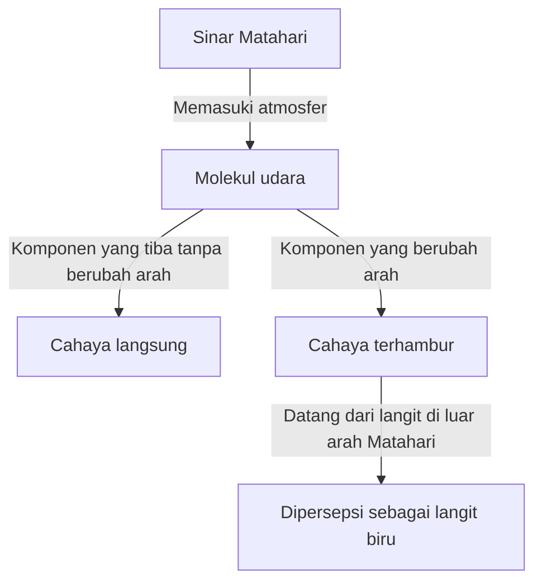
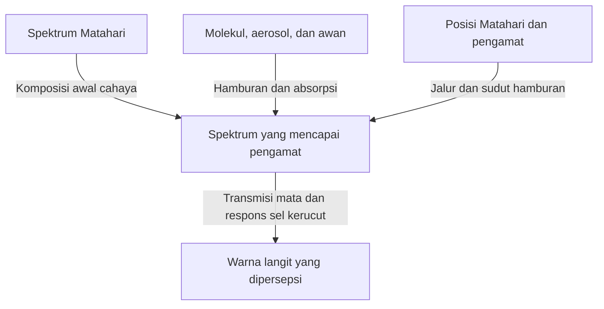

Ketika kita menengadah pada hari cerah, biru pekat membentang di atas kepala dan perlahan memutih menuju cakrawala. Namun ketika Matahari merendah, langit yang sama berubah menjadi kuning dan jingga. Sesudah Matahari terbenam, muncul lagi biru pekat dengan karakter berbeda.

Udara yang dimasukkan ke dalam wadah kecil transparan tidak tampak seperti cat biru. Lalu dari mana warna biru yang memenuhi langit berasal?

Jawaban singkatnya: molekul udara menghamburkan sinar Matahari, sehingga cahaya dengan panjang gelombang pendek lebih mudah mencapai mata kita dari langit. Akan tetapi, kalimat ini menyimpan pertanyaan penting. Apa sebenarnya hamburan? Mengapa pengaruhnya bergantung pada panjang gelombang? Mengapa langit terlihat biru, bukan ungu yang panjang gelombangnya lebih pendek? Dan bagaimana mekanisme yang sama menghasilkan senja merah?

Dengan menelusuri pertanyaan itu, kita akan melihat bahwa warna langit bukan sekadar sifat atmosfer. Warna tersebut terbentuk bersama oleh Matahari sebagai sumber cahaya, atmosfer yang mengubah jalur cahaya, serta mata yang merasakan warna.

## 1. Membedakan cahaya yang datang dari Matahari dan dari langit

Di luar ruangan pada siang hari, ada cahaya yang datang hampir lurus dari arah Matahari dan cahaya yang datang dari bagian langit lainnya. Yang pertama disebut cahaya langsung, sedangkan yang kedua adalah cahaya langit yang terhambur. Ada pula pantulan tanah dan bangunan, tetapi mula-mula kita bedakan dua komponen ini.

Bayangkan melihat sebagian langit dengan Matahari di belakang Anda. Matahari tidak berada pada arah pandangan, tetapi cahaya tetap masuk ke mata dari arah itu. Sebagian sinar Matahari telah berubah arah di atmosfer dan kemudian bergerak menuju Anda.

Mata menganggap suatu arah terang berdasarkan arah gerak cahaya sesaat sebelum masuk. Tidak ada dinding biru di langit. Atmosfer yang tersebar luas sepanjang garis pandang mengirimkan cahaya kepada kita; gabungan kontribusinya terlihat sebagai satu bentangan langit yang terang.

Jika hanya atmosfer Bumi dapat dihilangkan sementara Matahari dan permukaan tetap sama, tempat yang disinari akan tetap terang, tetapi langit di luar arah Matahari dan benda pemantul di permukaan akan gelap. Foto siang hari di Bulan, dengan tanah terang di bawah langit hitam, membantu menjelaskan perbedaan ini.

Intinya, hamburan tidak menciptakan cahaya baru, melainkan membagi ulang tujuannya. Cahaya yang hilang dari jalur pandang menuju Matahari justru dapat menjadi cahaya yang menerangi langit bagi pengamat yang melihat arah lain.

Diagram memisahkan jalur cahaya, tetapi kenyataannya melibatkan sangat banyak molekul sekaligus. Bukan satu molekul yang membuat seluruh langit biru, dan cahaya yang sekali terhambur juga tidak selalu mencapai pengamat.

## 2. Cahaya putih Matahari mengandung beragam panjang gelombang

Cahaya adalah gelombang elektromagnetik. Perubahan medan listrik dan magnet merambat melalui ruang serta mempunyai sifat gelombang. Jarak antara dua puncak berurutan disebut panjang gelombang dan biasanya ditulis dengan huruf Yunani $\lambda$.

Rentang yang dapat dilihat manusia bergantung pada kondisi mata dan kriteria keterlihatan, tetapi kira-kira berada di sekitar 380–780 nanometer. Satu nanometer adalah sepermiliar meter. Panjang gelombang cahaya tampak jauh lebih kecil daripada ketebalan rambut.

Dalam rentang tersebut, panjang gelombang pendek dirasakan sebagai ungu dan biru, sedangkan panjang gelombang panjang sebagai jingga dan merah. Namun alam tidak memberi garis batas tegas antara nama-nama warna. Pembagian itu juga merupakan klasifikasi manusia terhadap distribusi cahaya yang berkesinambungan.

Sinar Matahari tidak terdiri atas satu panjang gelombang saja. Spektrumnya luas, dari ungu sampai merah, bahkan mencakup ultraviolet dan inframerah yang tidak terlihat. Berbagai komponen cahaya tampak masuk ke mata, dan penglihatan menyesuaikan diri dengan pencahayaan sekitar, sehingga kita memperlakukan sinar siang sebagai penerangan yang keputihan.

Prisma memisahkan campuran tersebut karena cahaya dengan panjang gelombang berbeda merambat secara berbeda di dalamnya. Namun langit biru bukanlah pelangi raksasa yang diproyeksikan prisma. Fraksi cahaya yang berubah arah di atmosfer berbeda menurut panjang gelombang, sehingga komposisi cahaya yang datang dari arah jauh dari Matahari berubah.

Jika kedua proses itu tertukar, kita dapat keliru mengatakan bahwa sinar Matahari diubah menjadi cahaya biru. Dalam hamburan Rayleigh biasa, panjang gelombang hampir tetap. Komponen biru yang sudah ada dalam cahaya putih hanya lebih mudah dialihkan ke arah lain.

## 3. Bagaimana molekul transparan menghamburkan cahaya

### Apakah molekul merupakan cermin kecil?

Atmosfer terutama terdiri atas nitrogen dan oksigen. Berdasarkan volume udara kering, sekitar 78% adalah nitrogen dan 21% oksigen; sisanya mencakup argon dan gas lain. Karena kadar uap air bergantung pada tempat dan cuaca, angka tersebut berlaku untuk udara tanpa uap air.

Molekul nitrogen dan oksigen jauh lebih kecil daripada panjang gelombang cahaya tampak. Karena itu, menggambarkan molekul sebagai cermin biasa tempat sinar memantul tidak cukup untuk menjelaskan ketergantungan kuat pada panjang gelombang.

Gambaran yang lebih dekat dengan fisika adalah bahwa medan listrik cahaya memberikan gaya pada elektron dan inti atom dalam molekul. Distribusi muatan negatif dan positif sedikit bergeser, menimbulkan ketidakseimbangan listrik yang disebut polarisasi.

Ketika medan listrik berosilasi terhadap waktu, pemisahan muatan itu juga berosilasi. Dipol listrik yang berosilasi memancarkan gelombang elektromagnetik ke sekitarnya. Gelombang respons ini bertumpuk dengan gelombang datang, dan cahaya muncul pula pada arah selain arah semula. Inilah gambaran dasar hamburan.

Ungkapan 'molekul memancarkan cahaya' di sini tidak sama dengan fluoresensi, ketika cahaya diserap lalu dipancarkan kemudian, sering dengan warna berbeda. Yang dibahas adalah respons hampir elastis terhadap gelombang datang. Pembahasan yang ketat membutuhkan mekanika kuantum, tetapi ketergantungan dasar langit biru pada panjang gelombang dapat dipahami dengan baik melalui gambaran elektromagnetisme klasik ini.

### Jika udara di sekitar transparan, mengapa langit terang?

Menghamburkan cahaya tidak sama dengan menjadi buram. Sepanjang beberapa meter dari satu sisi ruangan ke sisi lain, hamburan molekuler terhadap cahaya tampak lemah dan sebagian besar cahaya lolos. Itulah sebabnya dinding seberang terlihat jelas melalui udara.

Ketika melihat langit, jalur cahaya jauh lebih panjang daripada beberapa meter. Walaupun densitas menurun dengan ketinggian, cahaya melewati lapisan atmosfer yang tebal. Efek satu molekul kecil, tetapi jumlah molekul yang luar biasa dan panjang perjalanan membuat cahaya terhambur terlihat.

Bukan ukuran molekul yang berwarna biru, dan bukan udara transparan yang mendadak menjadi zat biru. Interaksi yang hampir terabaikan dalam jarak pendek menjadi penting pada jalur panjang. Penjumlahan efek kecil ini merupakan ciri penting langit biru.

## 4. Apa arti hukum pangkat empat panjang gelombang?

Hamburan oleh objek yang jauh lebih kecil daripada panjang gelombang, seperti molekul, disebut hamburan Rayleigh dalam kondisi tertentu. Untuk udara pada rentang tampak, ketergantungan penampang lintang hamburan $\sigma$ secara kasar mengikuti:

$$
\sigma(\lambda) \propto \frac{1}{\lambda^4}
$$

Penampang lintang hamburan menyatakan kemudahan terjadinya hamburan dalam satuan luas. Besaran ini bukan sekadar luas geometris siluet molekul, melainkan ringkasan kekuatan interaksi antara cahaya dan molekul.

Dengan rumus ini, perbandingan kemudahan hamburan komponen biru 450 nanometer dan komponen merah 650 nanometer kira-kira adalah:

$$
\frac{\sigma(450\,\mathrm{nm})}{\sigma(650\,\mathrm{nm})}
\approx \left(\frac{650}{450}\right)^4
\approx 4.35
$$

Jika kedua komponen datang dengan intensitas sama, komponen biru sekitar 4,35 kali lebih mudah terhambur. Perbedaannya jauh lebih besar daripada perbandingan panjang gelombangnya saja.

Namun angka itu tidak berarti 'kebiruan langit 4,35 kali kemerahannya'. Perhitungan belum memasukkan intensitas spektrum Matahari, pelemahan sebelum dan sesudah hamburan, arah pengamatan, serta sensitivitas mata. Rasio penampang lintang dan warna yang akhirnya dirasakan adalah dua hal berbeda.

### Mengapa pangkat empat, bukan pangkat dua?

Dalam model elektromagnetik sederhana, pada rentang ketika polarisabilitas molekul hampir konstan, amplitudo dipol terinduksi sebanding dengan medan listrik datang. Sementara itu, amplitudo medan yang dipancarkan dipol ke tempat jauh mengandung kuadrat frekuensi sudut $\omega$.

Karena intensitas cahaya sebanding dengan kuadrat amplitudo medan listrik, kekuatan radiasi mengandung $\omega^4$. Di ruang hampa, $\omega$ berbanding terbalik dengan panjang gelombang, sehingga diperoleh $1/\lambda^4$.

Ini bukan penjelasan geometris bahwa gelombang pendek lebih sering membentur celah kecil. Hukum tersebut muncul dari sifat muatan yang berosilasi dalam memancarkan gelombang elektromagnetik.

Tentu saja pendekatan ini tidak boleh diperluas ke semua panjang gelombang. Dekat resonansi molekul, respons polarisasi berubah dan absorpsi menjadi penting. Jika penghambur besar dibandingkan panjang gelombang, syarat pendekatan Rayleigh tidak terpenuhi. Hukum pangkat empat sangat berguna, tetapi memiliki wilayah berlaku.

## 5. Mengapa langit tetap tidak terlihat ungu?

Jika hanya melihat hukum pangkat empat, ungu yang panjang gelombangnya lebih pendek daripada biru seharusnya terhambur lebih kuat. Pertanyaan itu benar arahnya: cahaya terhambur memang mengandung ungu, bukan hanya biru.

Namun penglihatan tidak menentukan warna dengan memilih satu panjang gelombang yang paling mudah terhambur. Cahaya yang masuk merupakan campuran rentang panjang gelombang, dan sistem visual merespons seluruh komposisinya.

Pertama, spektrum Matahari tidak memiliki intensitas sama di setiap panjang gelombang. Transmisi dan hamburan atmosfer kemudian mengubahnya. Selanjutnya, sifat transmisi bagian dalam mata serta sensitivitas sel retina ikut berperan.

Dalam kondisi terang, penglihatan warna terutama melibatkan tiga jenis sel kerucut: S, M, dan L, yang relatif lebih peka terhadap gelombang pendek, sedang, dan panjang. Mereka bukan sakelar khusus yang hanya mendeteksi biru, hijau, atau merah. Rentang sensitivitasnya lebar dan saling tumpang tindih.

Otak membentuk warna dengan membandingkan respons sel-sel tersebut. Walaupun cahaya langit kaya gelombang pendek, kombinasi rangsangan sel kerucut pada siang cerah biasanya dipersepsi sebagai biru atau biru yang sedikit keunguan. Rendahnya sensitivitas manusia pada ujung ungu juga penting. [Penjelasan NASA tentang gelombang elektromagnetik](https://science.nasa.gov/ems/03_behaviors/) membedakan hamburan dari sensitivitas penglihatan.

Karena itu, penjelasan 'semua cahaya ungu diserap atmosfer' tidak memadai. Cahaya ungu tampak juga mencapai permukaan. Ultraviolet pun bukan hal yang sama dengan ungu tampak. Absorpsi ultraviolet oleh ozon tidak dapat langsung dijadikan alasan langit tidak terlihat ungu.

Demikian pula, mengatakan 'langit sebenarnya ungu tetapi mata keliru' tidak tepat. Spektrum sebagai besaran fisik dan pengalaman warna yang dibentuk penglihatan adalah deskripsi pada tahap berbeda. Penglihatan tidak salah bekerja; ia membaca campuran cahaya menggunakan aturan biasanya.

## 6. Langit biru juga mengirimkan cahaya merah

Jika langit biru diperiksa dengan spektroskop, hasilnya bukan satu garis biru saja. Ada juga panjang gelombang yang bersesuaian dengan merah dan hijau. Keseluruhannya tampak biru karena sisi gelombang pendek relatif lebih kuat.

Inilah perbedaan penting antara cahaya langit dan LED atau laser biru. Cahaya yang terkonsentrasi pada rentang sempit dan campuran spektrum lebar dengan dominasi tertentu dapat terlihat mirip tanpa memiliki spektrum sama.

Hal ini juga menjelaskan sulitnya mereproduksi warna langit secara tepat. Layar komputer biasanya menggabungkan emisi merah, hijau, dan biru. Jika menghasilkan respons sel kerucut yang serupa, layar dapat menampilkan warna mirip langit meskipun spektrumnya berbeda.

Sebaliknya, warna langit dalam foto dipengaruhi sensitivitas sensor, keseimbangan putih, eksposur, pemrosesan gambar, dan layar penampil. Biru foto yang lebih pekat tidak langsung membuktikan bahwa hamburan molekuler saat itu lebih kuat.

Jangan terlalu mengikat panjang gelombang dan warna dalam hubungan satu banding satu. Pandangan ini membantu memahami bukan hanya persoalan ungu, tetapi juga warna foto dan cara kerja layar.

## 7. Senja merah muncul karena jalur cahaya yang diamati berubah

Langit biru siang hari dan senja merah bukan fenomena terpisah tanpa hubungan. Keduanya berkaitan dengan perbedaan hamburan menurut panjang gelombang. Yang berubah adalah jalur cahaya yang menjadi perhatian.

Ketika Matahari tinggi, perjalanan cahaya menuju tanah relatif pendek. Ketika mendekati cakrawala, cahaya menempuh jalur miring yang panjang melalui atmosfer. Sepanjang perjalanan itu, komponen gelombang pendek lebih mudah tersingkir dari cahaya langsung, sehingga merah dan jingga relatif lebih banyak tersisa dalam cahaya dari arah Matahari.

Fakta yang sama, yakni cahaya biru lebih mudah terhambur, membuat langit jauh dari Matahari tampak biru sekaligus membuat cahaya langsung yang melewati atmosfer panjang tampak merah. [NASA Space Place](https://spaceplace.nasa.gov/blue-sky/en/) menjelaskan perubahan panjang jalur ini melalui ilustrasi.

Namun seluruh warna merah senja tidak dapat dijelaskan hanya oleh sinar Matahari langsung yang masuk ke mata. Cahaya yang sudah kemerahan dapat kembali dihamburkan molekul dan partikel, atau dipantulkan dan dihamburkan awan, lalu tiba dari arah jauh dari Matahari. Awan senja menjadi merah karena warna cahaya yang meneranginya berubah.

### Ketebalan atmosfer harus dipikirkan sepanjang perjalanan

Dalam model atmosfer datar sederhana, jika sudut zenit Matahari adalah $z$, pengali panjang jalur dibandingkan arah vertikal kira-kira:

$$
m \approx \frac{1}{\cos z}
$$

Misalnya, $z=60^\circ$ memberi perkiraan dua kali. Namun rumus gagal dekat cakrawala. Saat $z$ mendekati 90 derajat, hasilnya tak terhingga, padahal jalur sebenarnya tidak tak terhingga. Diperlukan model yang mencakup kelengkungan Bumi, penurunan densitas dengan ketinggian, dan pembiasan.

Gambar penjelas senja sering melukiskan atmosfer sebagai cangkang tebal berdensitas tetap. Itu hanya skema untuk menunjukkan perbedaan arah. Atmosfer nyata tidak mempunyai atap keras tempat ia tiba-tiba berakhir atau lapisan yang densitasnya sama di mana-mana.

## 8. Kedalaman optik membawa warna langit ke bahasa perhitungan

Untuk jarak fisik yang sama, jumlah hamburan dan absorpsi berbeda jika densitas udara atau jumlah partikelnya berbeda. Besaran yang digunakan adalah ketebalan optik atau kedalaman optik, dengan simbol $\tau$.

Dalam kasus sederhana yang hanya mempertimbangkan hamburan molekul, dengan kerapatan jumlah molekul $n(s)$ sepanjang jalur, kita dapat menulis:

$$
\tau_{\mathrm{R}}(\lambda)=\int n(s)\,\sigma(\lambda)\,ds
$$

Di sini $s$ adalah jarak sepanjang jalur. Kerapatan dikalikan penampang lintang lalu dijumlahkan sepanjang perjalanan. Satuan per meter kubik, meter persegi, dan meter saling menghilangkan, sehingga $\tau$ tidak berdimensi.

Jika kedalaman optik ekstingsi, yang mencakup absorpsi dan hamburan aerosol, ditulis $\tau_{\mathrm{ext}}$, cahaya langsung yang belum terhambur berkurang dalam model sederhana menurut:

$$
I_{\mathrm{direct}}(\lambda)=I_0(\lambda)\exp[-\tau_{\mathrm{ext}}(\lambda)]
$$

Setiap tambahan kecil perjalanan menghilangkan fraksi tertentu dari cahaya yang masih tersisa. Bukan jumlah absolut yang sama yang selalu dikurangi dari cahaya yang sebelumnya sudah banyak berkurang. Karena itu penurunannya eksponensial, bukan linear.

Rumus ini saja belum menentukan kecerahan langit biru. Ia melacak komponen yang keluar dari berkas langsung. Cahaya baru yang dihamburkan masuk ke garis pandang harus ditambahkan secara terpisah.

Untuk menghitung cahaya langit dari suatu arah, pada setiap titik kita mengalikan intensitas Matahari yang tiba, peluang hamburan menuju pengamat, dan fraksi yang bertahan sampai pengamat, kemudian mengintegrasikannya sepanjang garis pandang. Biru langit bukan warna satu titik, melainkan jumlah kontribusi yang tersebar sepanjang perjalanan.

## 9. Mengapa kebiruan langit berbeda menurut tempat

Membandingkan biru di atas kepala dan biru pucat dekat cakrawala menunjukkan bahwa langit pada hari yang sama tidak seragam. Arah pandangan mengubah jumlah atmosfer yang dilalui, serta pengaruh aerosol dekat permukaan dan hamburan berulang.

Ke arah cakrawala, kita melihat melalui atmosfer rendah dalam jarak panjang. Selain molekul, ada partikel halus dan tetesan kecil yang menambahkan berbagai panjang gelombang ke garis pandang. Jika cahaya terhambur yang lebih putih bercampur dengan biru semula, kejenuhan birunya berkurang.

Cahaya langit juga dapat kembali dihamburkan atau diserap sebelum mencapai mata. Penalaran satu arah bahwa semakin banyak atmosfer berarti semakin banyak cahaya biru akhirnya tidak cukup. Kontribusi yang memasukkan cahaya dan yang menghilangkannya perlu diperlakukan bersama.

Langit kadang tampak biru pekat di gunung, tetapi bukan karena ketinggian dan kebiruan mempunyai hubungan proporsional sederhana. Jumlah atmosfer di atas yang lebih kecil, jarak dari kabut lapisan rendah, dan kontras dengan sekitar semuanya berpengaruh. Bergantung pada kelembapan dan keadaan atmosfer, langit di gunung pun dapat keputihan.

Karena itu, kita tidak dapat memastikan bahwa hari kering selalu biru pekat atau bahwa setelah hujan udara selalu jernih. Uap air sendiri bukan kabut tampak; pengaruhnya dapat muncul melalui penyerapan kelembapan oleh partikel serta pembentukan awan dan kabut. Satu foto langit sulit digunakan untuk menentukan kelembapan atau pencemaran secara unik.

## 10. Mengapa awan putih tidak menjadi biru?

Awan juga menghamburkan sinar Matahari. Alasan utama awan tampak putih adalah ukuran penghamburnya sangat berbeda dari molekul udara.

Tetes air cair dalam awan biasanya berukuran orde mikrometer atau lebih, dan banyak yang lebih besar daripada panjang gelombang tampak. Ada pula awan kristal es. Dalam wilayah ini, hukum pangkat empat untuk molekul tidak dapat langsung diterapkan.

Teori Mie merupakan teori penting untuk hamburan oleh partikel berbentuk bola. Perbandingan ukuran partikel dengan panjang gelombang, indeks bias, dan sifat lainnya menentukan besarnya hamburan ke setiap arah. Awan nyata berisi banyak partikel dengan ukuran berbeda, sehingga cahaya di seluruh rentang tampak dihamburkan cukup luas dan awan yang diterangi Matahari terlihat keputihan.

Putih tidak berarti semua panjang gelombang dihamburkan dalam proporsi yang benar-benar sama. Tetes individual memiliki ketergantungan kompleks pada panjang gelombang dan sudut. Namun gabungan ukuran dan jalur berbeda menghasilkan cahaya yang tidak terlalu condong ke gelombang pendek seperti langit biru.

Mengapa dasar awan hujan kelabu gelap? Dalam awan tebal, cahaya dihamburkan berkali-kali, dan lebih banyak yang kembali ke atas atau keluar ke samping. Jika lebih sedikit mencapai dasar awan, dari tanah awan tampak gelap. Tetes air tidak berubah menjadi zat kelabu.

Perbedaan antara tepian terang dan dasar gelap juga dapat dijelaskan dari jalur cahaya di dalam serta di luar awan. Menyamakan awan putih dengan air bersih dan awan kelabu dengan air kotor adalah keliru.

## 11. Apakah kabut, asap, dan debu mengubah warna dengan cara sama?

Partikel padat kecil dan tetesan yang melayang di atmosfer disebut aerosol. Ini mencakup garam laut, debu tanah, dan partikel dari asap, serta dibedakan dari molekul udara itu sendiri.

Sifat optik aerosol bergantung pada distribusi ukuran, bentuk, dan komposisinya. Sebagian kuat menghamburkan cahaya, sedangkan pada jelaga, misalnya, absorpsi penting. Langit berkabut putih dan langit kecokelatan karena itu tidak bisa sama-sama dijelaskan sebagai pertambahan cahaya biru.

Pada partikel lebih besar daripada molekul, kecenderungan hamburan ke depan, dekat arah rambat awal, dapat menjadi penting. Wilayah putih terang di sekitar Matahari berkaitan dengan ketergantungan arah ini. Namun pengamatan dekat Matahari berbahaya bahkan dengan mata telanjang: jangan menatap Matahari untuk memeriksanya.

Senja pun tidak selalu semakin merah dan indah ketika udara semakin tercemar. Partikel dalam jumlah sedang dapat memperkuat warna pada kondisi tertentu, tetapi asap atau debu pekat dapat melemahkan cahaya dan membuat senja kusam. Hasilnya berubah menurut ketinggian awan, elevasi Matahari, dan sebaran partikel.

Karena warna atmosfer dihasilkan banyak penyebab, warna saja tidak cukup untuk mengidentifikasi penyebabnya. Pengamatan ilmiah menggabungkan beberapa panjang gelombang, polarisasi, dan arah untuk memperkirakan jumlah serta sifat partikel. Pertanyaan sehari-hari tentang langit biru membuka jalan menuju penginderaan jauh atmosfer.

## 12. Cahaya langit memiliki sifat lain: polarisasi

Selain panjang gelombang dan intensitas, cahaya mempunyai arah osilasi medan listrik. Ketidakmerataan arah osilasi ini disebut polarisasi. Cahaya langit cerah terpolarisasi sebagian, bergantung pada arah pengamatan.

Pada hamburan Rayleigh ideal, untuk cahaya datang tak terpolarisasi yang mengalami satu hamburan, ketergantungan intensitas pada sudut hamburan $\theta$ kira-kira berbentuk:

$$
I(\theta)\propto 1+\cos^2\theta
$$

Sudut hamburan adalah sudut antara arah rambat awal dan arah sesudah hamburan. Bahkan pada sudut samping 90 derajat, intensitas tidak nol. Rumus itu juga menunjukkan bahwa molekul dapat mengirimkan cahaya Matahari ke samping.

Dalam model ideal yang sama, derajat polarisasi linear adalah:

$$
P(\theta)=\frac{\sin^2\theta}{1+\cos^2\theta}
$$

Pada pendekatan ini nilainya maksimum di 90 derajat. Langit nyata melibatkan sifat molekul, hamburan berulang, aerosol, serta pantulan permukaan, sehingga tidak selalu mencapai polarisasi sempurna seperti rumus ideal.

Jika melihat langit biru yang jauh dari Matahari melalui filter polarisasi lalu memutarnya, kecerahan dapat berubah. Inilah salah satu alasan filter fotografi dapat mengubah kepekatan biru langit. [HyperPhysics dari Georgia State University](https://hyperphysics.phy-astr.gsu.edu/hbase/phyopt/skypol.html) menjelaskan hubungan antara arah langit dan polarisasi.

Lensa sudut lebar mencakup berbagai sudut hamburan dalam satu gambar. Akibatnya, filter dapat menggelapkan bagian tertentu lebih kuat dan menimbulkan gradasi yang terlihat tidak alami. Ini dapat dipahami sebagai pengamatan pola polarisasi langit, bukan kerusakan filter.

## 13. Mengapa langit tetap biru sesudah Matahari terbenam?

Terbenamnya Matahari bukan saat sinarnya berhenti mencapai seluruh atmosfer Bumi. Walaupun pengamat di tanah tidak lagi melihat Matahari, beberapa bagian atmosfer atas masih diterangi. Cahaya yang terhambur di sana mencapai permukaan, sehingga langit tidak langsung gelap total.

Hamburan berulang juga berperan: cahaya yang sudah terhambur sekali dapat kembali terhambur di tempat lain. Penjelasan dasar siang hari dapat berfokus pada satu hamburan, tetapi pada senja jalurnya panjang dan rumit sehingga pendekatan itu tidak selalu cukup.

Dalam keadaan ini, ozon juga dapat berperan penting. Selain terkenal menyerap ultraviolet, ozon memiliki pita absorpsi luas pada cahaya tampak yang disebut pita Chappuis. Dalam jalur panjang, absorpsi selektif ini memengaruhi warna senja.

Karena itu, biru pekat saat blue hour sulit dijelaskan sepenuhnya dengan satu hamburan Rayleigh seperti pada siang hari. Bentuk atmosfer yang melengkung, wilayah bayangan, ozon, aerosol, dan hamburan berulang harus dipertimbangkan bersama. Sebuah [laporan teknis NASA](https://ntrs.nasa.gov/citations/19730020661) menghitung kontribusi ozon dan aerosol terhadap warna senja.

Pernyataan bahwa penyebab utama langit biru siang adalah hamburan molekuler tidak bertentangan dengan pernyataan bahwa absorpsi juga mengatur warna senja. Bobot relatif proses berubah menurut waktu, arah pandang, dan kondisi atmosfer.

## 14. Laut biru, gunung kebiruan, dan Bumi dari angkasa

### Pantulan laut saja tidak menjelaskan birunya langit

Kadang kita mendengar bahwa langit biru karena memantulkan warna laut. Namun langit biru juga terbentang jauh di pedalaman. Tanpa laut pun, atmosfer dan sumber cahaya yang sesuai dapat menghasilkan langit biru melalui hamburan molekuler.

Sebaliknya, permukaan laut memang memantulkan cahaya langit dan memengaruhi penampakan air. Tetapi seluruh biru laut juga tidak dapat dijelaskan sebagai pantulan cermin. Pada jalur panjang, air secara selektif menyerap cahaya sisi merah; bersama hamburan di dalam air, hal ini menghasilkan cahaya biru yang kembali. Di pesisir, dasar laut, bahan tersuspensi, dan fitoplankton ikut mengubah warna. [Penjelasan NOAA tentang warna laut](https://oceanservice.noaa.gov/facts/oceanblue.html) membahas absorpsi cahaya merah oleh air.

Langit dan laut saling memengaruhi penampakan, tetapi tidak menjadi biru karena satu penyebab yang sama. Warna serupa tidak selalu berarti mekanisme identik.

### Gunung jauh tampak biru karena ada atmosfer di antara gunung dan mata

Ketika gunung jauh tampak kebiruan dengan garis bentuk memudar, cahaya dari gunung melemah di atmosfer, sementara udara sepanjang jalur menambahkan cahaya terhambur ke garis pandang. Cahaya tambahan ini kadang disebut airlight.

Gunung tidak dilapisi cat biru. Kontribusi atmosfer di antara gunung dan pengamat menumpuk pada citranya. Perspektif atmosfer dalam lukisan, yang menggambarkan objek jauh lebih pucat dan kebiruan, memanfaatkan gejala sehari-hari ini. Akan tetapi, dalam kabut tebal atau pencahayaan sore, warna cahaya tambahan juga berubah.

Biru Bumi dari angkasa menggabungkan cahaya dari permukaan dan dalam laut, hamburan atmosfer, serta awan. Sudut pandang dan jalurnya berbeda dari langit yang dilihat ke atas dari tanah. Ungkapan singkat 'Bumi biru' pun memuat beberapa fenomena optik.

## 15. Apakah senja biru di Mars membantah hukum pangkat empat?

Foto wahana Mars kadang memperlihatkan warna biru di dekat Matahari saat senja. Karena tampak berlawanan dengan senja merah Bumi, kita mungkin merasa penjelasan Rayleigh telah terpatahkan.

Namun debu halus atmosfer sangat berperan dalam warna langit Mars. Kondisinya berbeda dari model sederhana yang hanya didominasi molekul. Ukuran dan sifat partikel mengubah ketergantungan arah hamburan pada setiap panjang gelombang.

Pada senja Mars, distribusi cahaya yang melewati debu dapat menonjolkan komponen biru di wilayah sempit dekat Matahari. Bukan berarti seluruh langit Mars selalu biru seperti hari cerah di Bumi. [Pemandangan senja Perseverance yang diterbitkan NASA](https://science.nasa.gov/resource/mastcam-zs-first-martian-sunset/) memperlihatkan contoh cahaya kebiruan tersebut.

Hukum alam tidak berubah sesuka hati dari satu tempat ke tempat lain. Yang berubah adalah komposisi atmosfer, jenis partikel, panjang jalur, dan arah pengamatan. Elektromagnetisme yang sama menghasilkan warna berbeda jika kondisi masukannya berbeda.

Pemikiran ini dapat diperluas ke planet yang mengorbit bintang lain. Jika spektrum sumber, atmosfer, dan awan berbeda, langit biru bukan kepastian. Warna yang kita kenal merupakan salah satu wujud hukum universal di bawah kondisi khas Bumi.

## 16. Apa yang dapat diamati di rumah?

### Percobaan air dengan sedikit susu

Isi wadah transparan dengan air, tambahkan susu sedikit demi sedikit, lalu sinari dari samping menggunakan lampu LED putih. Dalam ruangan agak gelap, bandingkan cahaya yang terlihat dari sisi jalur dengan cahaya yang menembus wadah dan diproyeksikan ke kertas putih.

Pada konsentrasi dan panjang jalur yang sesuai, perbedaan warna antara cahaya terhambur ke samping dan cahaya yang diteruskan dapat terlihat. Jika partikelnya terlalu banyak, seluruh campuran menjadi putih keruh dan hampir tidak meneruskan cahaya. Jenis sumber dan bentuk wadah juga memengaruhi hasil.

Nilai percobaan ini adalah memisahkan pengamatan cahaya yang tersebar ke samping dan yang menembus lurus. Namun partikel susu jauh lebih besar daripada molekul nitrogen dan oksigen serta memiliki distribusi ukuran. Percobaan ini bukan reproduksi ketat hamburan Rayleigh atmosfer atau pengukuran hukum pangkat empat.

Lampu putih pun belum tentu memancarkan semua panjang gelombang tampak secara kontinu dan merata. Pada lampu ponsel, misalnya, spektrum LED turut menentukan penampakan. Jangan menyimpulkan teori hamburan salah hanya karena tidak terlihat biru; pertimbangkan perbedaan kondisi model dan atmosfer sebenarnya.

### Bandingkan langit dengan filter polarisasi

Filter polarisasi fotografi atau kacamata berpolarisasi dapat memperlihatkan perubahan kecerahan langit yang jauh dari Matahari ketika diputar. Perbandingan dengan awan dan cakrawala menunjukkan bahwa sifat cahaya langit tidak seragam.

Jangan melihat Matahari selama pengamatan. Kacamata hitam dan filter polarisasi biasa bukan filter aman untuk pengamatan Matahari. Hindari pula menatap langsung melalui teropong, teleskop, atau jendela bidik optik kamera. Sasaran pengamatan adalah langit pada arah aman yang cukup jauh dari Matahari.

Jika membuat foto pembanding, pertahankan komposisi, eksposur, dan keseimbangan putih. Koreksi otomatis dapat mencerahkan langit yang sebenarnya menjadi gelap, sehingga perubahan sulit terlihat.

### Catat kondisi, bukan hanya warna

Saat mengamati pagi, siang, dan sore, catat perkiraan tinggi Matahari, arah pandangan, jumlah awan, dan kabut di cakrawala. Deskripsi seperti 'biru pekat di atas, putih di kejauhan' atau 'hanya dasar awan gelap' lebih mudah dikaitkan dengan fisika daripada satu kata untuk kebiruan.

Tidak perlu memutuskan keadaan atmosfer hanya dari satu pengamatan. Membandingkan kondisi, mencatat hal yang berbeda dari dugaan, serta membedakan pemrosesan kamera dari kesan mata sudah merupakan dasar pengamatan ilmiah.

## 17. Selangkah lebih jauh: perbedaan kaca transparan dan udara

Setelah membaca sejauh ini, timbul pertanyaan lain. Kaca juga memiliki elektron dan inti yang seharusnya terpolarisasi oleh cahaya. Mengapa kaca transparan tidak menghamburkan cahaya kuat ke samping seperti langit?

Ketika menjumlahkan respons kecil individual, kita tidak boleh melupakan fase gelombang. Amplitudo medan listrik dapat saling menguatkan atau meniadakan. Tidak selalu benar menjumlahkan respons banyak atom seolah-olah masing-masing merupakan intensitas cahaya independen.

Dalam medium ideal yang homogen, superposisi gelombang dari polarisasi yang tersebar mulus secara spasial membentuk gelombang yang merambat ke depan. Respons kolektif ini berkaitan dengan indeks bias dan perambatan cahaya. Untuk hamburan ke arah lain, fluktuasi spasial densitas atau indeks bias, pengotor, dan cacat menjadi penting.

Dalam gas, molekul terus bergerak dan kerapatan jumlah lokal mengalami fluktuasi statistik. Deskripsi hamburan molekuler pada gas renggang dan deskripsi hamburan oleh fluktuasi densitas dalam medium kontinu bukan fenomena terpisah, melainkan uraian yang saling terkait pada skala berbeda.

Kaca nyata juga memiliki hamburan lemah, absorpsi, serta pantulan permukaan. Ia bukan medium ideal yang seragam sempurna tanpa kehilangan energi. Meskipun demikian, pandangan superposisi ini membantu memperbaiki anggapan bahwa setiap tambahan atom langsung menambah hamburan lateral secara sederhana.

Penjelasan sehari-hari bermula dari satu molekul, sedangkan pembahasan teliti berlanjut ke posisi relatif molekul dan interferensi. Memahami perbedaan tingkat ini membawa penjelasan langit dari cerita tabrakan butiran menuju fisika gelombang elektromagnetik.

## 18. Sampai di mana penjelasan langit biru dapat digunakan?

Pernyataan 'langit biru karena hamburan Rayleigh' sangat efektif sebagai titik awal memahami langit Bumi pada siang cerah. Namun itu bukan janji bahwa semua warna langit dapat diprediksi dengan satu persamaan.

Pada atmosfer yang cukup tipis, pendekatan satu hamburan menjelaskan ketergantungan dasar panjang gelombang dan polarisasi. Jalur panjang, cakrawala, awan tebal, senja, asap pekat, dan debu memerlukan fisika tambahan. Cahaya masuk dan keluar dari garis pandang melalui hamburan, mengalami absorpsi, serta mendapat kontribusi pantulan permukaan.

Transfer radiasi adalah cara melacak arus masuk dan keluar ini menurut panjang gelombang serta arah. Perhitungan warna yang teliti menggabungkan profil vertikal atmosfer, posisi Matahari, sifat optik partikel, pantulan permukaan, dan respons penglihatan. Model sederhana tidak dibuang sebagai salah; ia digunakan dengan memahami efek mana yang diabaikannya.

Saat menengadah, kita tidak melihat molekul satu per satu. Namun kita melihat interaksi molekul dan cahaya, struktur atmosfer Bumi, interferensi gelombang, dan kerja indra manusia sebagai satu pemandangan.

Fakta biasa bahwa langit biru bukan bukti dunia sederhana. Itu bukti bahwa fenomena di berbagai skala terhubung begitu alami hingga jarang disadari. Jika biru besok sedikit berbeda dari hari ini, perbedaan itu menjadi petunjuk baru untuk memikirkan perjalanan cahaya.

## Referensi

- [NASA Space Place: Why Is the Sky Blue?](https://spaceplace.nasa.gov/blue-sky/en/) — Pengantar langit biru dan senja melalui panjang gelombang serta jalur atmosfer.
- [NASA Science: Wave Behaviors](https://science.nasa.gov/ems/03_behaviors/) — Hamburan, pembiasan, panjang gelombang, dan sensitivitas penglihatan manusia.
- [Georgia State University, HyperPhysics: Skylight Polarization](https://hyperphysics.phy-astr.gsu.edu/hbase/phyopt/skypol.html) — Hubungan polarisasi cahaya langit dan arah pengamatan.
- [NASA NTRS: The influence of ozone and aerosols on the brightness and color of the twilight zone](https://ntrs.nasa.gov/citations/19730020661) — Laporan teknis tentang ozon dan aerosol dalam perhitungan warna senja.
- [NOAA Ocean Service: Why is the ocean blue?](https://oceanservice.noaa.gov/facts/oceanblue.html) — Biru laut dijelaskan melalui absorpsi selektif oleh air.
- [NASA Science: Mastcam-Z's First Martian Sunset](https://science.nasa.gov/resource/mastcam-zs-first-martian-sunset/) — Senja Mars dan cahaya kebiruan akibat debu.
