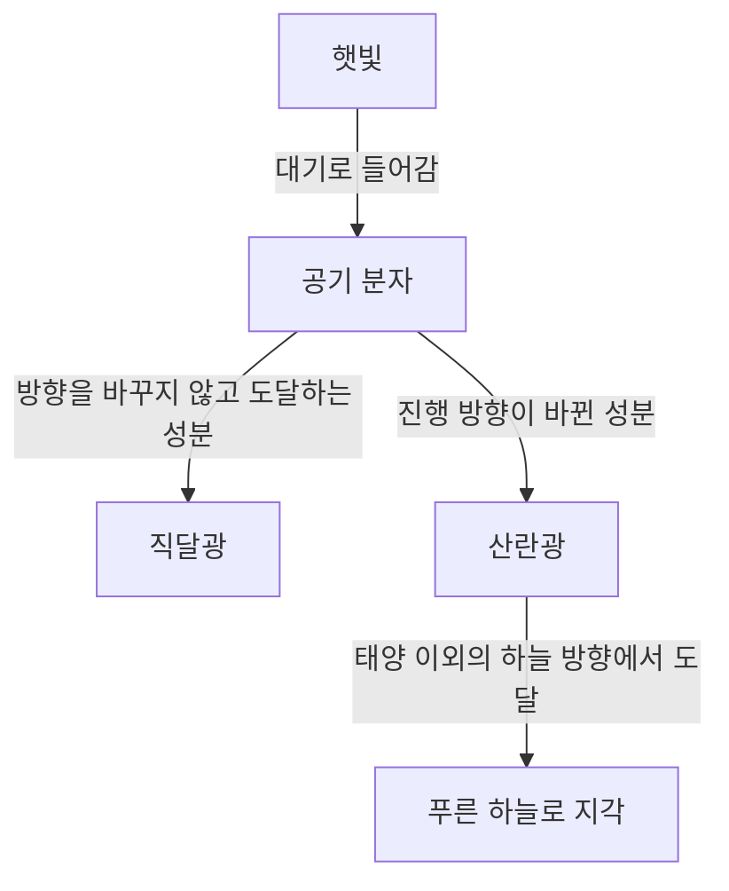
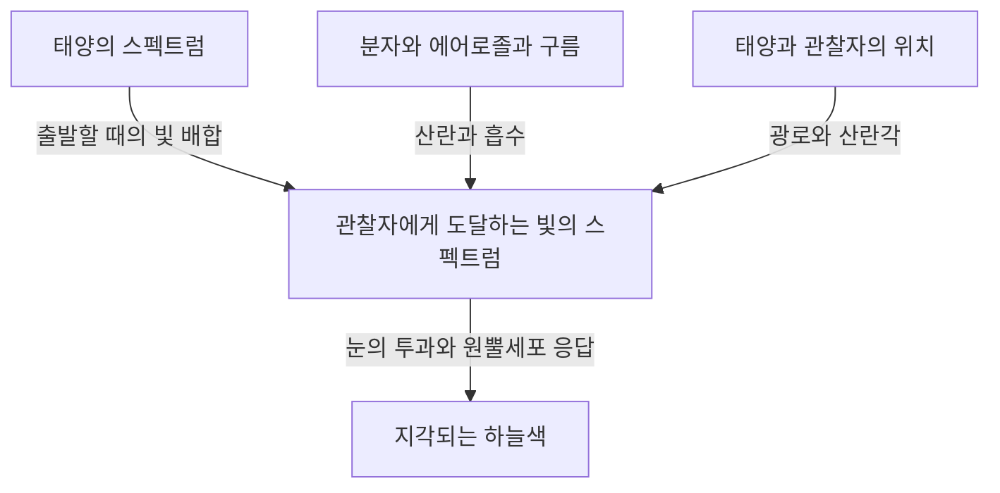

맑은 날 하늘을 올려다보면 머리 위로 짙은 파랑이 펼쳐지고, 먼 지평선으로 갈수록 조금씩 희뿌옇게 변합니다. 그런데 해가 기울면 같은 하늘이 노랑과 주황으로 물들고, 해가 진 뒤에는 또 다른 깊은 파랑이 나타납니다.

공기 자체를 작은 투명 용기에 담아도 파란 물감 같은 색은 보이지 않습니다. 그렇다면 하늘을 채운 파랑은 어디서 생기는 것일까요?

짧게 답하면 햇빛이 공기 분자에 의해 산란되고, 짧은 파장의 빛이 우리 눈 쪽으로 방향을 바꾸기 쉽기 때문입니다. 하지만 이 한 문장에는 중요한 질문이 숨어 있습니다. 산란이란 무엇일까요? 왜 파장에 따라 차이가 생길까요? 파랑보다 파장이 짧은 보라가 아니라 왜 파랑으로 보일까요? 같은 원리는 어떻게 붉은 노을을 만들까요?

이 질문들을 차례로 생각하면 하늘의 색이 대기에만 속한 성질은 아니라는 사실을 알게 됩니다. 광원인 태양, 빛의 진행 방향을 바꾸는 대기, 색을 느끼는 눈. 이 셋이 함께 만들어 내는 현상입니다.

## 1. 먼저 구별해야 할 태양에서 오는 빛과 하늘에서 오는 빛

낮의 야외에는 태양 방향에서 거의 곧바로 도달하는 빛과 태양 이외의 하늘 방향에서 오는 빛이 있습니다. 앞의 것은 직달광, 뒤의 것은 하늘의 산란광입니다. 땅과 건물에서 반사된 빛도 있지만 우선 이 둘을 구별해 봅시다.

태양을 등지고 하늘의 한 부분을 바라보는 모습을 떠올려 보세요. 시선 앞에는 태양이 없습니다. 그런데도 그 방향에서 빛이 눈으로 들어옵니다. 태양에서 나온 빛 일부가 도중의 대기에서 방향을 바꾸어 우리에게 왔기 때문입니다.

눈은 들어온 빛이 마지막으로 진행해 온 방향을 바탕으로 그쪽이 밝다고 인식합니다. 하늘에 파란 벽이 있는 것이 아닙니다. 시선 위의 넓은 범위에 있는 대기가 빛을 우리 쪽으로 보내고, 그 기여가 쌓인 결과를 하나의 밝은 하늘처럼 보는 것입니다.

지구의 대기만 없애고 태양과 지면의 조건을 그대로 둘 수 있다면, 태양이 비추는 곳은 밝더라도 태양이나 지표의 반사체를 벗어난 방향의 하늘은 어두워집니다. 달의 낮 사진에서 밝은 땅 위로 검은 하늘이 펼쳐지는 모습은 이 차이를 이해하는 단서입니다.

핵심은 산란이 새로운 빛을 만드는 것이 아니라 빛이 가는 곳을 다시 나눈다는 점입니다. 태양을 향한 시선에서는 사라진 빛이, 다른 방향을 보는 사람에게는 하늘을 밝히는 빛이 됩니다.

그림에서는 경로를 나누어 그렸지만 실제로는 엄청나게 많은 분자가 동시에 관여합니다. 분자 하나가 하늘 전체를 파랗게 만드는 것도 아니고, 한 번 산란된 빛이 반드시 관찰자에게 도달하는 것도 아닙니다.

## 2. 흰 햇빛에는 다양한 파장이 들어 있다

빛은 전자기파입니다. 전기장과 자기장의 변화가 공간을 전파하며 파동의 성질을 가집니다. 한 마루에서 다음 마루까지의 거리에 해당하는 것이 파장이고, 보통 그리스 문자 $\lambda$ 로 나타냅니다.

사람이 볼 수 있는 빛의 범위는 눈의 상태와 ‘보인다’고 판단하는 기준에도 영향을 받지만, 대략 380~780나노미터 부근입니다. 1나노미터는 10억분의 1미터입니다. 가시광선의 파장은 머리카락 굵기보다 훨씬 작은 길이입니다.

이 범위에서 짧은 파장 쪽은 보라나 파랑, 긴 파장 쪽은 주황이나 빨강으로 느껴집니다. 하지만 색 이름과 파장 사이의 경계가 자연에 선으로 그어져 있는 것은 아닙니다. 색의 구분에는 연속적인 빛의 분포에 사람이 부여한 분류도 들어 있습니다.

태양에서 오는 빛은 특정한 한 파장만으로 이루어지지 않습니다. 보라에서 빨강까지, 나아가 눈에 보이지 않는 자외선과 적외선까지 포함한 폭넓은 파장의 빛입니다. 가시광선의 여러 성분이 눈에 들어오고 시각이 주변 밝기에도 적응하면서, 우리는 햇빛을 희게 느껴지는 조명으로 받아들입니다.

프리즘은 파장마다 진행 방식이 다른 점을 이용해 이 혼합된 빛을 나누어 보여 줍니다. 반면 푸른 하늘은 프리즘이 공중에 거대한 무지개를 투사한 것이 아닙니다. 대기에서 방향을 바꾸는 비율이 파장에 따라 달라서 태양에서 떨어진 방향으로 오는 빛의 배합이 변하는 현상입니다.

이를 혼동하면 ‘햇빛이 파란 빛으로 변환되었다’고 설명하게 됩니다. 보통의 레일리 산란에서는 빛의 파장이 거의 유지됩니다. 흰빛에 처음부터 포함되어 있던 파란 성분이 다른 방향으로 돌아 들어오기 쉬운 것입니다.

## 3. 투명한 분자가 빛을 산란시키는 원리

### 분자는 작은 거울일까

대기의 주성분은 질소와 산소입니다. 건조한 공기의 부피 비율로 보면 질소가 약 78%, 산소가 약 21%이고, 나머지에는 아르곤 등이 포함됩니다. 수증기 비율은 장소와 날씨에 따라 달라지므로 이 수치는 수증기를 제외한 공기에 관한 것입니다.

질소와 산소 분자는 가시광선의 파장보다 훨씬 작습니다. 따라서 분자를 보통 거울처럼 그리고 빛이 표면에서 튕겨 나온다고 생각하는 것만으로는 파장에 따른 큰 차이를 설명할 수 없습니다.

물리에 더 가까운 그림에서는 빛의 전기장이 분자 속 전자와 원자핵에 힘을 가합니다. 음전하와 양전하의 분포가 아주 조금 상대적으로 어긋나면서 분자에 전기적인 치우침이 생깁니다. 이를 분극이라고 합니다.

전기장이 시간에 따라 진동하면 이 치우침도 진동합니다. 진동하는 전기 쌍극자는 주변으로 전자기파를 방출합니다. 이러한 응답으로 생긴 파동이 입사파와 겹쳐지면서 앞쪽 이외의 방향에도 빛이 나타납니다. 이것이 산란을 이해하기 위한 기본적인 그림입니다.

여기서 ‘분자가 빛을 방출한다’는 말은 빛을 한번 흡수해 저장했다가 나중에 다른 색으로 빛나는 형광과 같은 뜻이 아닙니다. 입사한 전자기파에 분자가 반응하는 거의 탄성적인 과정을 생각하는 것입니다. 엄밀한 논의에는 양자역학이 필요하지만, 푸른 하늘의 기본적인 파장 의존성은 이 고전 전자기학의 그림으로도 잘 이해할 수 있습니다.

### 가까이 있는 공기는 투명한데 하늘은 왜 밝을까

산란한다는 것과 불투명하다는 것은 같지 않습니다. 방 한쪽 끝에서 다른 끝까지의 몇 미터에서는 분자에 의한 가시광선 산란이 약해 대부분의 빛이 통과합니다. 그래서 공기 너머의 벽을 선명하게 볼 수 있습니다.

하지만 하늘을 볼 때의 광로는 몇 미터로 끝나지 않습니다. 높아질수록 밀도가 낮아지기는 해도 빛은 두꺼운 대기층을 지나옵니다. 분자 하나의 작용은 작지만 막대한 수와 긴 경로가 합쳐지면 눈에 보이는 산란광이 생깁니다.

분자의 크기 자체가 파란 것도, 투명한 공기가 갑자기 파란 물질로 바뀌는 것도 아닙니다. 짧은 거리에서는 놓칠 만큼 약한 상호작용을 긴 광로에서는 무시할 수 없게 됩니다. 이런 작은 효과의 축적이 푸른 하늘의 중요한 특징입니다.

## 4. 파장의 네제곱 법칙은 무엇을 뜻할까

분자처럼 파장보다 충분히 작은 산란체가 특정한 조건에서 일으키는 산란을 레일리 산란이라고 합니다. 가시광선 영역의 공기에서 파장에 따른 변화를 대략 나타내면 산란 단면적 $\sigma$ 는 다음 관계를 따릅니다.

$$
\sigma(\lambda) \propto \frac{1}{\lambda^4}
$$

산란 단면적은 산란이 얼마나 잘 일어나는지를 면적 단위로 나타낸 양입니다. 분자의 기하학적인 윤곽을 그대로 잰 면적은 아닙니다. 빛과 분자가 얼마나 강하게 상호작용하는지를 하나의 수로 정리한 것입니다.

이 식으로 파장 450나노미터의 파란 성분과 650나노미터의 빨간 성분을 비교하면 산란되기 쉬운 정도의 비는 대략 다음과 같습니다.

$$
\frac{\sigma(450\,\mathrm{nm})}{\sigma(650\,\mathrm{nm})}
\approx \left(\frac{650}{450}\right)^4
\approx 4.35
$$

같은 세기로 들어오는 두 성분을 비교하면 파란 쪽이 빨간 쪽보다 약 4.35배 더 잘 산란된다는 계산입니다. 그 차이는 파장의 비 자체보다 훨씬 커집니다.

하지만 이 수치가 ‘하늘의 파란 정도가 빨간 정도의 4.35배’라는 뜻은 아닙니다. 태양광의 파장별 세기, 산란 전후의 감쇠, 관찰 방향, 눈의 감도를 아직 포함하지 않았기 때문입니다. 산란 단면적의 비와 최종적으로 느끼는 색은 서로 다른 양입니다.

### 왜 제곱이 아니라 네제곱일까

간단한 전자기학 모형에서는 분자의 분극되기 쉬운 정도가 파장에 따라 거의 일정하다고 볼 수 있는 범위에서, 유도된 전기 쌍극자의 진폭은 입사 전기장에 비례합니다. 한편 그 쌍극자가 먼 곳으로 방출하는 전기장의 진폭에는 진동의 각진동수 $\omega$ 의 제곱이 나타납니다.

빛의 세기는 전기장 진폭의 제곱에 비례하므로 복사 세기에는 $\omega^4$ 가 나타납니다. 진공에서 $\omega$ 는 파장의 역수에 비례하므로 결과적으로 $1/\lambda^4$ 관계가 됩니다.

‘짧은 파장일수록 작은 틈에 잘 부딪힌다’는 기하학적인 설명이 아닙니다. 진동하는 전하가 전자기파를 방출하는 성질에서 나오는 파동의 법칙입니다.

물론 이 근사를 모든 파장으로 확장해서는 안 됩니다. 분자의 공명에 가까워지면 분극 응답이 달라지고 흡수도 중요해집니다. 산란체가 파장에 비해 크면 애초에 레일리 근사의 조건에서 벗어납니다. 네제곱 법칙은 강력하지만 성립하는 영역이 있는 법칙입니다.

## 5. 그런데도 하늘이 보라색으로 보이지 않는 이유

네제곱 법칙만 보면 파랑보다 파장이 짧은 보라가 더 강하게 산란되어야 합니다. 이는 타당한 질문입니다. 실제로 산란광에는 파란 성분뿐 아니라 보라 성분도 들어 있습니다.

그러나 사람이 색을 느끼는 방식은 ‘가장 잘 산란되는 파장 하나를 고르는’ 것이 아닙니다. 눈에 들어오는 빛에는 넓은 범위의 파장이 섞여 있고 시각계는 그 배합 전체를 받아들입니다.

우선 태양광의 스펙트럼은 모든 파장에서 같은 세기가 아닙니다. 여기에 파장별 대기 투과와 산란이 겹쳐집니다. 그다음 눈 안쪽까지 빛이 도달하는 동안의 투과 특성과 망막 시세포의 감도가 더해집니다.

밝은 곳에서의 색각에는 주로 세 종류의 원뿔세포가 관여합니다. 짧은 파장, 중간 파장, 긴 파장에 상대적으로 민감한 S, M, L 원뿔세포입니다. 하지만 각각 파랑·초록·빨강만 검출하는 전용 스위치는 아닙니다. 감도 범위는 넓고 서로 겹칩니다.

뇌는 이 세포들의 응답을 비교해 색을 구성합니다. 짧은 파장이 우세한 하늘빛도 원뿔세포가 받는 자극의 조합으로 보면, 보통의 맑은 낮에는 파랑 또는 청보라 쪽에 가까운 파랑으로 지각됩니다. 가시광선의 보라색 끝부분에 대한 사람의 감도가 낮다는 점도 중요합니다. [NASA의 전자기파 해설](https://science.nasa.gov/ems/03_behaviors/) 역시 산란과 시각 감도를 구별해 설명합니다.

따라서 ‘보라색은 대기에 전부 흡수되기 때문’이라는 설명으로는 부족합니다. 가시광선인 보라색 빛도 지표에 도달합니다. 자외선은 가시광선인 보라색과 같지 않습니다. 오존의 자외선 흡수를 그대로 하늘이 보라색으로 보이지 않는 이유로 바꿔 말할 수도 없습니다.

마찬가지로 ‘하늘은 사실 보라색인데 눈이 잘못 본다’고 단정하는 것도 적절하지 않습니다. 물리량인 빛의 스펙트럼과 시각으로 성립하는 색 경험은 서로 다른 단계의 설명입니다. 색각이 오작동하는 것이 아니라 언제나와 같은 규칙으로 혼합광을 읽는 것입니다.

## 6. 푸른 하늘에서도 빨간 빛이 온다

푸른 하늘을 분광기로 살펴본다고 파란 선 하나만 보이지는 않습니다. 빨강과 초록에 해당하는 파장의 빛도 있습니다. 짧은 파장 쪽이 상대적으로 강조되어 전체적으로 파랗게 보입니다.

이 점이 파란 LED나 파란 레이저와 하늘빛의 중요한 차이입니다. 좁은 파장 범위에 집중된 빛과, 넓은 파장 분포가 특정한 치우침을 가지고 섞인 빛은 겉보기 색이 비슷해도 같은 스펙트럼이 아닙니다.

여기서 하늘의 색을 정확하게 재현하기 어려운 이유도 드러납니다. 컴퓨터 화면은 보통 빨강·초록·파랑 발광 성분을 조합해 색을 만듭니다. 사람에게 비슷한 원뿔세포 응답을 일으키면 실제 하늘빛과 스펙트럼이 달라도 매우 비슷한 색으로 보이게 할 수 있습니다.

반대로 사진 속 하늘의 색은 촬상 소자의 감도, 화이트 밸런스, 노출, 영상 처리, 보는 화면에 따라 바뀝니다. 사진의 파랑이 짙다고 해서 곧바로 당시 공기 분자의 산란이 강했다고 판단할 수 없습니다.

파장과 색을 지나치게 일대일로 연결하지 않는 것. 이것만으로도 보라색의 의문뿐 아니라 사진의 색과 디스플레이 원리까지 같은 관점으로 정리할 수 있습니다.

## 7. 노을이 붉은 것은 보는 빛의 경로가 달라지기 때문이다

낮의 푸른 하늘과 노을은 서로 다른 원리로 생기는 무관한 현상이 아닙니다. 둘 다 파장에 따라 산란되기 쉬운 정도가 다르다는 점과 관련됩니다. 다만 주목하는 빛의 경로가 달라집니다.

태양이 높이 있을 때는 지상까지의 광로가 비교적 짧습니다. 태양이 지평선에 가까워지면 빛은 지구 대기를 비스듬히 길게 통과합니다. 그 과정에서 짧은 파장 성분이 직달광에서 더 잘 제거되어, 태양 방향에서 오는 빛에는 빨강과 주황 성분이 상대적으로 많이 남습니다.

‘파란 빛이 잘 산란된다’는 같은 사실이 태양에서 떨어진 하늘을 파랗게 보이게 하는 면과, 긴 대기 경로를 통과한 직달광을 붉게 하는 면을 함께 갖는 것입니다. [NASA Space Place의 해설](https://spaceplace.nasa.gov/blue-sky/en/)은 이 경로 길이의 변화를 그림으로 설명합니다.

그렇다고 붉은 저녁 하늘 전체를 눈에 직접 들어오는 태양광만으로 설명할 수는 없습니다. 이미 붉어진 빛이 분자나 입자에서 다시 산란되거나 구름에서 반사·산란되어 태양에서 떨어진 방향으로도 도달합니다. 저녁 구름이 주홍색인 이유는 그 구름을 비추는 빛의 색이 변했기 때문입니다.

### 대기의 두께는 경로로 생각해야 한다

단순한 평면 대기 모형에서 태양의 천정각을 $z$ 라고 하면 수직에 비한 광로의 배율을 대략 다음처럼 나타낼 수 있습니다.

$$
m \approx \frac{1}{\cos z}
$$

예를 들어 $z=60^\circ$ 이면 약 두 배라는 추정입니다. 하지만 이 식은 지평선 근처에서 성립하지 않습니다. $z$ 가 90도에 가까워지면 식은 무한대로 가지만 실제 대기를 지나는 거리가 무한대가 되는 것은 아닙니다. 지구의 곡률, 고도에 따른 밀도 감소, 굴절 등을 포함한 모형이 필요해지기 때문입니다.

노을을 설명하는 그림도 대기를 밀도가 일정한 두꺼운 껍질처럼 표현하곤 합니다. 이는 방향의 차이를 보여 주는 약도입니다. 실제 대기에는 여기서 갑자기 끝난다는 단단한 천장도, 어디나 밀도가 같은 층도 없습니다.

## 8. 광학적 두께를 쓰면 하늘의 색을 계산의 언어로 표현할 수 있다

물리적 거리가 같아도 공기 밀도나 입자의 양이 다르면 빛이 산란·흡수되는 정도가 다릅니다. 그래서 사용하는 양이 광학적 두께, 또는 광학적 깊이입니다. 기호는 $\tau$ 입니다.

분자에 의한 산란만 생각하는 간단한 경우, 광로를 따른 분자 수밀도를 $n(s)$ 라 하면 다음처럼 쓸 수 있습니다.

$$
\tau_{\mathrm{R}}(\lambda)=\int n(s)\,\sigma(\lambda)\,ds
$$

여기서 $s$ 는 광로를 따른 거리입니다. 수밀도에 산란 단면적을 곱해 경로 전체에 걸쳐 더합니다. 단위를 확인하면 수밀도의 ‘세제곱미터당’, 단면적의 ‘제곱미터’, 거리의 ‘미터’가 서로 없어져 $\tau$ 는 무차원량이 됩니다.

흡수와 에어로졸 산란까지 포함한 소광의 광학적 두께를 $\tau_{\mathrm{ext}}$ 라 하면, 산란되지 않고 남은 직달광은 단순한 모형에서 다음처럼 줄어듭니다.

$$
I_{\mathrm{direct}}(\lambda)=I_0(\lambda)\exp[-\tau_{\mathrm{ext}}(\lambda)]
$$

이는 광로가 조금 길어질 때마다 남아 있는 빛의 일정 비율이 제거됨을 뜻합니다. 대부분이 이미 산란된 빛에서 매번 같은 절대량을 빼는 것이 아닙니다. 그래서 직선적인 감소가 아니라 지수함수가 됩니다.

이 식만으로 푸른 하늘의 밝기를 구할 수 있는 것은 아니라는 점도 중요합니다. 식이 추적하는 것은 직달광에서 빠져나가는 성분입니다. 시선으로 새롭게 산란되어 들어오는 성분은 따로 더해야 합니다.

관찰 방향에서 오는 하늘빛을 구하려면 각 지점에서 그곳에 도달한 태양광의 세기, 관찰자 방향으로 산란될 확률, 그 뒤 관찰자까지 남아서 도달하는 비율을 곱하고 시선을 따라 적분합니다. 푸른 하늘은 광로 위 한 점의 색이 아니라 긴 경로에 분포한 빛의 기여를 합한 결과입니다.

## 9. 하늘의 파랑이 위치에 따라 다른 이유

머리 위의 파랑과 지평선 부근의 옅은 파랑을 비교하면 같은 날 같은 하늘에서도 색이 균일하지 않다는 사실을 알 수 있습니다. 시선 방향에 따라 통과하는 대기량이 달라지는 데다 지표 근처의 에어로졸과 다중 산란의 영향도 달라지기 때문입니다.

지평선 가까운 방향에서는 낮은 고도의 대기를 길게 바라보게 됩니다. 그곳에는 분자뿐 아니라 미세 입자와 작은 물방울도 있어 여러 파장의 빛을 시선에 더합니다. 원래의 파랑에 더 희게 보이는 산란광이 섞이면 파랑의 선명함이 약해집니다.

또 하늘의 산란광도 발생한 곳에서 눈에 이르는 동안 다시 산란되거나 흡수됩니다. ‘대기가 많을수록 파란 빛이 늘어난다’는 한쪽 방향의 생각만으로는 어느 순간 설명이 막힙니다. 시선에 빛을 공급하는 기여와 그 빛을 제거하는 기여를 동시에 다뤄야 합니다.

산 위에서 하늘이 짙은 파랑으로 보일 때가 있는 것도 고도와 파란 정도가 단순한 비례 관계이기 때문은 아닙니다. 머리 위 대기량의 감소, 낮은 층의 연무에서 벗어나는 효과, 주변 밝기와의 대비 등이 겹칩니다. 습도나 대기 상태에 따라 산 위에서도 하늘이 희게 보일 수 있습니다.

같은 이유로 ‘건조한 날은 반드시 짙은 파랑’, ‘비가 그치면 반드시 투명하다’고 단정할 수 없습니다. 수증기 자체는 눈에 보이는 안개가 아니지만 입자의 흡습과 구름·연무의 형성을 통해 외관에 영향을 줄 수 있습니다. 하늘 사진 한 장만으로 습도나 오염 정도를 하나로 결정하기는 어렵습니다.

## 10. 흰 구름은 왜 파랗게 되지 않을까

구름도 햇빛을 산란시킵니다. 그런데 흰색으로 보이는 주된 이유는 산란을 담당하는 대상의 크기가 공기 분자와 크게 다르기 때문입니다.

구름 속 액체 물방울은 보통 마이크로미터 수준 이상의 크기를 가지며 가시광선 파장보다 큰 것이 많습니다. 얼음 결정으로 이루어진 구름도 있습니다. 이 영역에서는 분자에 대한 단순한 네제곱 법칙을 그대로 쓸 수 없습니다.

구형 입자의 산란을 다루는 대표적인 이론이 미 이론입니다. 입자 크기와 파장의 비, 굴절률 등에 따라 어느 방향으로 얼마나 산란되는지가 정해집니다. 실제 구름에는 크기가 다른 수많은 입자가 있으므로 가시광선 전체의 빛이 비교적 폭넓게 산란되어 햇빛을 받은 구름은 희게 보입니다.

희다는 말이 모든 파장이 완전히 같은 비율로 산란된다는 뜻은 아닙니다. 개별 물방울에는 복잡한 파장·각도 의존성이 있습니다. 하지만 다양한 크기와 경로의 빛이 합쳐지면서 푸른 하늘만큼 짧은 파장에 치우치지 않은 빛이 눈에 도달합니다.

그렇다면 비구름 아래가 어두운 회색인 이유는 무엇일까요? 크게 발달한 구름에서는 빛이 여러 번 산란되며 위나 옆으로 돌아가는 성분도 많아집니다. 구름 밑까지 오는 빛이 적어지면 지상에서는 어둡게 보입니다. 물방울이 회색 물질로 변한 것이 아닙니다.

구름 가장자리는 밝고 밑면은 어두운 차이 역시 빛이 구름 안팎을 어떻게 지났는지로 설명할 수 있습니다. 흰 구름과 회색 구름을 단순히 ‘깨끗한 물’과 ‘더러운 물’에 대응시키는 것은 잘못입니다.

## 11. 연무, 연기, 황사는 같은 방식으로 하늘색을 바꿀까

대기에 떠 있는 미세한 고체 입자와 액체 방울을 통틀어 에어로졸이라고 합니다. 바다 소금, 토양 먼지, 연기에서 생긴 입자 등이 포함되며 기체 분자 자체와는 구별합니다.

에어로졸의 광학적 성질은 입자 크기 분포, 모양, 조성에 따라 다릅니다. 빛을 잘 산란시키는 것도 있고 검댕처럼 흡수가 중요한 것도 있습니다. 따라서 하늘이 하얗게 뿌연 경우와 갈색을 띠는 경우를 모두 ‘파란 빛이 늘었다’고 설명할 수는 없습니다.

분자보다 큰 입자에서는 앞쪽, 곧 원래 진행 방향에 가까운 쪽으로 강하게 산란하는 경향이 중요할 수 있습니다. 태양 주변이 넓게 희게 빛나는 모습은 이런 방향 의존성과 관련됩니다. 다만 태양 부근의 관찰은 맨눈으로도 위험하므로 태양을 직접 보며 확인해서는 안 됩니다.

노을도 ‘공기가 오염될수록 더 아름답고 붉어진다’고 할 수 없습니다. 적당한 입자가 특정 조건에서 색을 강화할 수는 있지만, 짙은 연기나 먼지가 빛을 크게 약화시키면 저녁 풍경은 탁해집니다. 구름의 높이, 태양의 고도, 입자의 분포에 따라 결과가 달라집니다.

대기 색은 여러 원인이 만들어 낸 결과이므로 반대로 색만 보고 원인을 특정하기에는 정보가 부족합니다. 과학 관측에서는 여러 파장의 빛, 편광, 관측 방향을 조합해 입자의 양과 성질을 추정합니다. 일상의 푸른 하늘에 관한 질문은 대기 원격 탐사의 입구로도 이어집니다.

## 12. 푸른 하늘의 빛에는 편광이라는 특징도 있다

빛에는 파장과 세기뿐 아니라 전기장이 어떤 방향으로 진동하는가 하는 성질도 있습니다. 진동 방향에 치우침이 있는 것을 편광이라고 합니다. 맑은 하늘에서 오는 빛은 관측 방향에 따라 부분적으로 편광되어 있습니다.

이상화된 레일리 산란에서 편광되지 않은 입사광이 한 번 산란될 때, 산란각 $\theta$ 에 대한 세기의 각도 의존성은 대략 다음 형태입니다.

$$
I(\theta)\propto 1+\cos^2\theta
$$

이 식에서 산란각은 원래 진행 방향과 산란 후 진행 방향 사이의 각입니다. 옆 방향인 90도에서도 세기는 0이 아닙니다. 공기 분자가 태양에서 온 빛을 옆으로 보낼 수 있다는 사실이 식에도 나타납니다.

같은 이상적인 모형에서 선형 편광도는 다음처럼 나타납니다.

$$
P(\theta)=\frac{\sin^2\theta}{1+\cos^2\theta}
$$

이 근사에서는 90도에서 최대가 됩니다. 실제 하늘에서는 분자의 성질, 다중 산란, 에어로졸, 지면 반사 등이 더해지므로 이 식 그대로의 완전한 편광이 되지는 않습니다.

편광 필터를 통해 태양에서 멀리 떨어진 푸른 하늘을 보고 필터를 돌리면 밝기가 바뀌는 경우가 있습니다. 사진용 편광 필터가 하늘의 파랑을 진하게 만들 수 있는 이유 중 하나입니다. [조지아주립대학교 HyperPhysics의 해설](https://hyperphysics.phy-astr.gsu.edu/hbase/phyopt/skypol.html)에서도 하늘 방향과 편광의 관계를 보여 줍니다.

광각 렌즈에서는 화면 안에 여러 산란각이 들어오기 때문에 편광 필터로 어두워지는 정도가 위치에 따라 달라져 부자연스러운 농담이 생길 수 있습니다. 이런 사진의 특성도 필터의 결함보다는 하늘에 펼쳐진 편광 무늬를 보고 있다고 이해할 수 있습니다.

## 13. 해가 진 뒤에도 푸른 하늘이 남는 이유

일몰은 태양빛이 지구 전체 대기에 도달하지 않게 되는 순간이 아닙니다. 지상 관찰자에게 태양이 보이지 않아도 상공 대기에는 여전히 햇빛을 받는 곳이 있습니다. 그곳에서 산란된 빛이 지상에 도달하므로 곧바로 캄캄해지지 않습니다.

또 한 번 산란된 빛이 다른 곳에서 다시 산란되는 다중 산란이 관여합니다. 낮의 기본 설명에서는 한 번의 산란을 중심으로 생각할 수 있지만, 박명에는 광로가 길고 복잡해져 그 근사만으로는 충분하지 않습니다.

이때 오존의 역할도 무시할 수 없는 경우가 있습니다. 오존은 자외선을 흡수하는 것으로 잘 알려져 있지만 가시광선에도 샤퓌 흡수대라는 넓은 흡수대를 가집니다. 긴 광로에서는 이러한 선택적 흡수가 저녁 하늘색에 영향을 줍니다.

따라서 이른바 블루 아워의 깊은 파랑을 낮과 완전히 같은 한 번의 레일리 산란만으로 끝까지 설명하기는 어렵습니다. 구면 대기, 그늘이 되는 영역, 오존, 에어로졸, 다중 산란을 함께 고려해야 합니다. [NASA의 기술 보고서](https://ntrs.nasa.gov/citations/19730020661)는 박명의 색에 대한 오존과 에어로졸의 기여를 계산합니다.

‘낮의 푸른 하늘은 주로 분자 산란 때문이다’와 ‘박명에서는 흡수도 색을 좌우한다’는 설명은 모순되지 않습니다. 어느 시간, 어느 방향, 어떤 대기 조건을 다루느냐에 따라 중요한 과정의 비중이 달라집니다.

## 14. 바다의 파랑, 푸른 산, 우주에서 본 푸른 지구

### 바다의 반사만으로는 하늘의 파랑을 설명할 수 없다

하늘이 바다색을 비추기 때문에 파랗다는 설명을 듣기도 합니다. 하지만 바다에서 먼 내륙에도 푸른 하늘이 펼쳐집니다. 바다가 없어도 알맞은 대기와 광원이 있으면 분자 산란으로 푸른 하늘이 생깁니다.

반면 바다 표면이 하늘빛을 반사해 바다의 모습에 영향을 주는 것은 사실입니다. 그러나 바다의 파랑도 모두 거울 반사로 설명할 수는 없습니다. 물은 긴 광로에서 붉은 쪽 빛을 선택적으로 흡수하며, 물속의 산란과 결합해 파란 빛이 되돌아옵니다. 연안에서는 바닥, 부유물, 식물 플랑크톤도 색을 바꿉니다. [NOAA의 바다색 해설](https://oceanservice.noaa.gov/facts/oceanblue.html)은 물에 의한 빨간 빛의 흡수를 설명합니다.

하늘과 바다는 서로의 외관에 영향을 주지만 하나의 동일한 원인으로 파란 것은 아닙니다. 비슷한 색을 발견했다고 반드시 같은 원리를 적용하지 않는 것이 중요합니다.

### 먼 산이 푸른 것은 산과 눈 사이에도 대기가 있기 때문이다

먼 산이 푸르게 보이고 윤곽이 옅어지는 현상에서는 산에서 오는 빛이 대기에서 약해지는 한편, 중간 공기에서 시선으로 산란광이 더해집니다. 이 추가되는 빛을 에어라이트라고 부르기도 합니다.

산이 파란 물감으로 덮인 것이 아니라 산과 관찰자 사이 대기의 기여가 겹쳐진 것입니다. 멀리 있는 대상을 옅고 푸르게 그리는 회화의 공기 원근법은 이 일상적인 광학 현상을 이용합니다. 다만 짙은 연무나 저녁 조명에서는 추가되는 빛의 색도 달라집니다.

우주에서 본 지구의 파랑에는 해수면과 물속에서 오는 빛, 대기 산란, 구름 등이 함께 들어 있습니다. 지상에서 머리 위를 본 푸른 하늘과 행성 전체를 본 파랑은 시점도 광로도 다릅니다. ‘지구는 파랗다’는 말에도 여러 광학 현상이 들어 있는 것입니다.

## 15. 화성의 노을이 파랗다면 네제곱 법칙은 틀린 것일까

화성 탐사선이 찍은 저녁 풍경에서는 태양 근처에 파란색이 나타나기도 합니다. 지구의 붉은 노을과 반대로 보여 레일리 산란의 설명이 뒤집힌 것처럼 느껴질 수 있습니다.

하지만 화성 하늘의 색에는 대기 속 미세한 먼지가 크게 관여합니다. 분자만 지배하는 단순한 레일리 산란 모형과 조건이 같지 않습니다. 입자의 크기와 성질에 따라 파장별 산란의 방향 의존성이 달라집니다.

화성의 저녁에는 먼지를 통과한 빛의 분포 때문에 태양 가까운 좁은 영역에서 파란 성분이 두드러질 수 있습니다. 그렇다고 화성 하늘 전체가 언제나 지구의 맑은 하늘처럼 파랗다는 뜻은 아닙니다. [NASA가 공개한 퍼서비어런스의 일몰](https://science.nasa.gov/resource/mastcam-zs-first-martian-sunset/)은 이런 푸른빛의 실제 사례입니다.

자연법칙이 장소에 따라 변덕스럽게 바뀌는 것은 아닙니다. 달라지는 것은 대기 조성, 입자의 종류, 광로 길이, 관측 방향입니다. 같은 전자기학을 써도 입력 조건이 다르면 나오는 하늘색은 달라집니다.

이 생각을 더 확장하면 다른 별을 도는 행성의 하늘도 생각해 볼 수 있습니다. 광원의 스펙트럼이 다르고 대기와 구름의 성질도 다르면 푸른 하늘이 당연하지 않습니다. 지구에서 익숙한 색은 보편적인 법칙이 지구 고유의 조건 아래 드러난 한 가지 모습입니다.

## 16. 집에서 확인한다면 무엇을 관찰해야 할까

### 물에 우유를 조금 넣는 실험

투명 용기에 물을 담고 우유를 아주 조금씩 넣은 뒤 옆에서 흰 LED 빛을 비춥니다. 방을 조금 어둡게 하고 빛의 경로를 옆에서 보는 경우와, 용기를 통과한 빛을 흰 종이에 비추는 경우를 비교해 보세요.

알맞은 농도와 광로 길이에서는 옆에서 보이는 산란광과 통과한 빛의 색 차이를 관찰할 수 있습니다. 입자가 너무 많으면 전체가 희게 흐려져 빛이 거의 통과하지 못합니다. 광원 종류와 용기 모양에 따라서도 결과가 달라집니다.

실험의 가치는 옆으로 산란된 빛과 곧장 통과한 빛을 따로 보는 데 있습니다. 다만 우유 속 입자는 질소나 산소 분자보다 훨씬 크고 크기 분포도 있습니다. 이를 대기 레일리 산란 자체의 엄밀한 재현이나 네제곱 법칙의 측정으로 볼 수는 없습니다.

흰 조명이라도 가시광선의 모든 파장이 연속적이고 균일하게 들어 있다고는 할 수 없습니다. 스마트폰 조명 등에서는 LED의 발광 스펙트럼이 실험 결과에 반영됩니다. ‘파랗게 보이지 않았으니 산란 설명이 틀렸다’고 판단하지 말고 모형과 실제 조건의 차이를 생각해야 합니다.

### 편광 필터로 하늘을 비교하기

사진용 편광 필터나 편광 선글라스를 쓰면 회전에 따라 태양에서 떨어진 하늘의 밝기가 달라질 수 있습니다. 구름과 지평선 부근까지 비교하면 하늘빛의 성질이 균일하지 않음을 알 수 있습니다.

이때 태양을 봐서는 안 됩니다. 선글라스와 일반 편광 필터는 안전한 태양 관측용 필터가 아닙니다. 쌍안경, 망원경, 카메라의 광학 뷰파인더로 직접 보는 것도 피해야 합니다. 관찰 대상은 태양에서 충분히 떨어진 안전한 방향의 하늘입니다.

사진으로 기록한다면 같은 구도에서 노출과 화이트 밸런스를 고정하는 편이 비교하기 좋습니다. 자동 보정이 작동하면 실제로 어두워진 하늘을 카메라가 밝게 보정해 변화가 잘 드러나지 않을 수 있습니다.

### 색뿐 아니라 조건도 기록하기

아침, 낮, 저녁에 하늘을 본다면 태양의 대략적인 높이, 보는 방향, 구름 양, 지평선의 연무를 함께 기록하세요. 파란 정도를 한 단어로 쓰기보다 ‘머리 위는 짙은 파랑, 먼 곳은 하양’, ‘구름 밑면만 어둡다’고 나누어 표현하면 물리와의 대응이 더 잘 보입니다.

한 번 관찰했다고 대기 상태를 단정할 필요는 없습니다. 조건을 바꾸어 비교하고, 예상과 다른 점을 남기고, 카메라 처리와 눈의 인상을 구별하는 것. 그 태도 자체가 과학적 관찰의 기본입니다.

## 17. 한 걸음 더: 투명한 유리와 공기의 차이

여기까지 읽으면 또 다른 의문이 생깁니다. 유리에도 전자와 원자핵이 있으니 빛에 반응해 분극될 것입니다. 그렇다면 투명한 유리도 하늘처럼 빛을 옆으로 강하게 산란시켜야 하지 않을까요?

이 문제에서는 작은 응답들을 더할 때 파동의 위상을 잊으면 안 됩니다. 빛은 파동이므로 전기장 진폭은 서로 강화되거나 상쇄될 수 있습니다. 많은 원자의 응답을 각각 독립적인 빛의 밝기로 단순히 더하는 것이 항상 옳지는 않습니다.

이상적으로 균질한 매질에서는 공간적으로 매끄럽게 분포한 분극에서 나오는 파동을 겹치면 앞으로 진행하는 파동이 형성됩니다. 이런 집단적 응답은 굴절률과 빛의 전파 방식에 관계됩니다. 반면 앞쪽 이외 방향의 산란에는 밀도와 굴절률의 공간적 요동, 불순물, 결함 등이 중요합니다.

기체에서는 분자가 움직이고 국소적인 분자 수밀도에는 통계적 요동이 있습니다. 희박한 기체의 분자 산란 설명과 연속 매질의 밀도 요동에 의한 산란 설명은 서로 무관한 별개 현상이 아니라 다른 규모에서 본 연결된 기술입니다.

실제 유리에도 약한 산란과 흡수, 표면 반사가 있습니다. 완전히 균질하고 손실이 없는 이상 매질과 같지는 않습니다. 그래도 ‘원자가 있으면 그 수만큼 옆 방향 산란이 단순히 늘어난다’는 생각을 고치는 데 이 파동 중첩의 관점이 도움이 됩니다.

일상적인 설명은 분자 하나의 응답에서 시작하고 정밀하게 생각하면 분자들의 위치 관계와 간섭으로 나아갑니다. 이러한 단계의 차이를 이해하면 푸른 하늘의 설명을 단순한 입자 충돌 이야기에서 전자기파의 물리로 깊게 만들 수 있습니다.

## 18. 푸른 하늘의 설명을 어디까지 적용해도 될까

‘하늘은 레일리 산란 때문에 파랗다’는 설명은 지구의 맑은 낮 하늘을 이해하는 출발점으로 매우 유용합니다. 하지만 모든 하늘색을 식 하나로 예측할 수 있다는 약속은 아닙니다.

충분히 얇은 대기에서 한 번의 산란을 중심으로 하는 근사는 기본적인 파장 의존성과 편광을 설명합니다. 긴 광로, 지평선 근처, 두꺼운 구름, 박명, 짙은 연기와 먼지를 다루려면 추가적인 물리가 필요합니다. 빛은 산란되어 시선에 들어오기도 하고 빠져나가기도 하며 흡수와 지표 반사도 겪습니다.

이러한 출입을 파장과 방향별로 추적하는 것이 복사 전달이라는 관점입니다. 하늘색을 정밀하게 계산하려면 대기의 수직 분포, 태양의 위치, 입자의 광학 특성, 지표 반사, 시각 응답까지 결합해야 합니다. 단순한 설명을 틀렸다고 버리는 것이 아니라 어떤 효과를 생략한 모형인지 분명히 하고 사용하는 것입니다.

푸른 하늘을 올려다볼 때 우리는 분자를 하나씩 보는 것이 아닙니다. 하지만 분자와 빛의 상호작용, 지구를 감싼 대기의 구조, 파동의 간섭, 사람의 감각 작용을 하나의 풍경으로 보고 있습니다.

하늘이 파랗다는 흔한 사실은 세상이 단순하다는 증거가 아닙니다. 다양한 규모의 현상이 평소에는 의식하지 못할 만큼 자연스럽게 이어져 있다는 증거입니다. 내일 하늘이 오늘과 조금 다른 파랑으로 보인다면 그 차이는 빛이 지나온 경로를 생각하는 새로운 단서가 됩니다.

## 참고 자료

- [NASA Space Place: Why Is the Sky Blue?](https://spaceplace.nasa.gov/blue-sky/en/) — 빛의 파장과 대기 중 경로로 푸른 하늘과 노을을 설명하는 입문 자료.
- [NASA Science: Wave Behaviors](https://science.nasa.gov/ems/03_behaviors/) — 산란, 굴절, 파장, 사람 시각의 감도에 대한 해설.
- [Georgia State University, HyperPhysics: Skylight Polarization](https://hyperphysics.phy-astr.gsu.edu/hbase/phyopt/skypol.html) — 산란된 하늘빛의 편광과 관측 방향의 관계.
- [NASA NTRS: The influence of ozone and aerosols on the brightness and color of the twilight zone](https://ntrs.nasa.gov/citations/19730020661) — 박명의 색을 계산할 때 오존과 에어로졸의 역할을 다루는 기술 보고서.
- [NOAA Ocean Service: Why is the ocean blue?](https://oceanservice.noaa.gov/facts/oceanblue.html) — 물에 의한 선택적 흡수로 바다의 파랑을 설명하는 자료.
- [NASA Science: Mastcam-Z's First Martian Sunset](https://science.nasa.gov/resource/mastcam-zs-first-martian-sunset/) — 화성의 저녁 풍경과 먼지에 의한 푸른빛의 모습.
