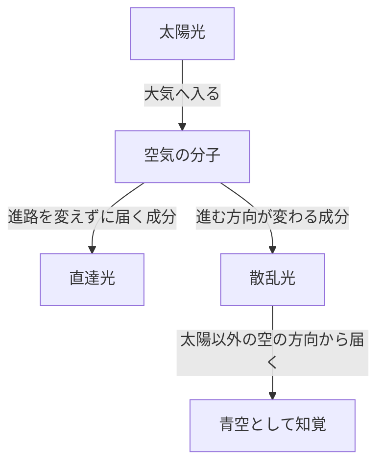
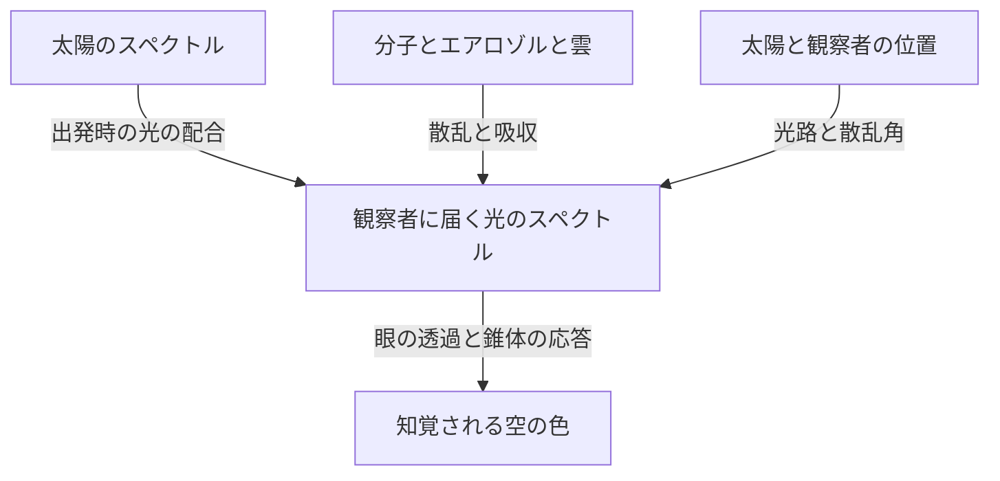

晴れた日の空を見上げると、頭上には深い青が広がり、遠くの地平線に向かって少しずつ白っぽくなっていきます。ところが、日が傾けば同じ空が黄色や橙色に変わり、太陽が沈んだ後には、また別の深い青が現れます。

空気そのものを小さな透明な容器に入れても、青い絵の具のような色は見えません。では、空を覆う青はどこから生まれるのでしょうか。

短く答えるなら、太陽光が空気の分子によって散乱され、短い波長の光が私たちの目へ届きやすくなるからです。ただし、この一文には大切な問いが隠れています。散乱とは何か。なぜ波長によって差があるのか。青より波長の短い紫ではなく、なぜ青に見えるのか。そして、同じ仕組みがどうして赤い夕焼けを生むのか。

これらを順に考えると、空の色は、大気だけに備わった性質ではないとわかります。光源である太陽、光の進路を変える大気、そして色を感じる目。この三つが共同で作り出す現象です。

## 1. 最初に分けたい、太陽から来る光と空から来る光

昼間の屋外には、太陽の方向からほぼまっすぐ届く光と、太陽以外の空の方向から届く光があります。前者が直達光、後者が天空の散乱光です。地面や建物からの反射光もありますが、まずはこの二つを区別しましょう。

太陽を背にして、空の一部分を見る場面を想像してください。視線の先に太陽はありません。それでも、その方向から光が目に入ります。太陽から出た光の一部が、途中の大気で進路を変え、こちらへ向かってきたためです。

目は、入ってきた光が直前まで進んできた方向を手がかりに、そちらが明るいと認識します。空に青い壁があるわけではありません。視線上の広い範囲にある大気が光をこちらへ送り、その積み重ねを一枚の明るい空のように見ているのです。

もし地球の大気だけを取り去り、太陽や地面の条件をそのままにできれば、太陽に照らされた場所は明るくても、太陽や地表の反射物を外れた方向の空は暗くなります。月面の昼の写真で、明るい地面の上に黒い空が広がるのは、この対比を理解する手がかりになります。

ここでの要点は、散乱によって光が新しく作られるのではなく、光の行き先が配分し直されるということです。太陽へ向かう視線から見れば失われた光が、別の方向を見る人にとっては、空を明るくする光になります。

図では経路を分けて描いていますが、現実には膨大な数の分子が同時に関わります。一個の分子だけが空全体を青くしているわけでも、一回散乱した光が必ず観察者へ届くわけでもありません。

## 2. 白い太陽光の中には、さまざまな波長が含まれている

光は電磁波です。電場と磁場の変化が空間を伝わり、波としての性質を持ちます。山から次の山までの距離に相当するものが波長で、通常はギリシャ文字の $\lambda$ で表します。

人間が見える光の範囲は、目の状態や「見える」と判定する基準にも左右されますが、おおむね380〜780ナノメートル付近です。1ナノメートルは10億分の1メートル。可視光の波長は、髪の毛の太さよりはるかに小さい長さです。

この範囲では、短波長側が紫や青、長波長側が橙や赤として感じられます。ただし、色名と波長の境界が自然界に線として引かれているわけではありません。色の区切りは連続的な光の分布に対して、人間が設けた分類でもあります。

太陽からの光は、特定の一波長だけではありません。紫から赤まで、さらに目に見えない紫外線や赤外線まで含む、幅広い波長の光です。可視域のさまざまな成分が目に入り、視覚が周囲の明るさにも順応することで、私たちは日光を白っぽい照明として扱えます。

プリズムは、この混ざった光を波長ごとの進み方の違いによって分けて見せます。一方、青空は、プリズムが空に巨大な虹を投影したものではありません。大気中で向きを変える割合が波長によって異なるため、太陽から離れた方向へ届く光の配合が変わる現象です。

ここを取り違えると、青空を「太陽光が青い光へ変換された」と説明してしまいます。通常のレイリー散乱では、光の波長はほぼ保たれます。白い光の中に最初から含まれていた青い成分が、別の方向へ回り込みやすいのです。

## 3. 透明な分子が光を散らす仕組み

### 分子は小さな鏡なのか

大気の主成分は窒素と酸素です。乾燥した空気を体積の割合で見ると、窒素が約78%、酸素が約21%を占め、残りにアルゴンなどが含まれます。水蒸気の割合は場所や天候によって変わるので、この数値は水蒸気を除いた空気についてのものです。

窒素や酸素の分子は、目に見える光の波長よりずっと小さい存在です。そのため、分子を普通の鏡のように描き、光線が表面で跳ね返ると考えるだけでは、波長による強い違いを説明できません。

もう少し物理に近い描像では、光の電場が、分子の中の電子と原子核に力を及ぼします。負の電荷と正の電荷の分布がほんの少しずれ、分子に電気的な偏りが生まれます。これを分極と呼びます。

電場が時間とともに振動すれば、この偏りも振動します。振動する電気双極子は、周囲へ電磁波を放射します。この応答として生じた波が、入射した波と重なり合い、前方以外の方向にも光が現れます。それが散乱を理解するための基本的な像です。

この説明の「分子が光を放射する」という部分は、光を一度吸収して蓄え、しばらく後に別の色で光る蛍光と同じ意味ではありません。入射した電磁波に分子が応答する、ほぼ弾性的な過程を考えています。厳密な議論には量子力学が必要ですが、青空の基本的な波長依存性は、この古典的な電磁気学の像でもよく理解できます。

### なぜ身近な空気は透明なのに、空は明るいのか

散乱することと、不透明であることは同じではありません。部屋の端から端までの数メートルでは、分子による可視光の散乱は弱く、ほとんどの光が通り抜けます。だから、空気越しに向こう側の壁をはっきり見られます。

ところが、空を見るときの光路は、数メートルでは済みません。高さとともに密度は下がるものの、光は厚い大気の層を通ります。一個の分子の作用は小さくても、その膨大な数と長い道のりを合わせれば、目に見える散乱光が生まれます。

分子の大きさそのものが青いのでも、透明な空気が急に青い物質へ変わるのでもありません。短い距離では見逃すほど弱い相互作用が、長い光路では無視できなくなる。この「小さな効果の積み重ね」は、青空の重要な特徴です。

## 4. 波長の4乗則は何を意味するのか

分子のように波長より十分小さな散乱体による、特定の条件での散乱をレイリー散乱と呼びます。可視域の空気について、波長による変化を大づかみに表すと、散乱断面積 $\sigma$ は次の関係に従います。

$$
\sigma(\lambda) \propto \frac{1}{\lambda^4}
$$

散乱断面積とは、散乱の起こりやすさを面積の単位で表した量です。分子の幾何学的な輪郭をそのまま測った面積ではありません。光と分子がどれだけ強く相互作用するかを、一つの数にまとめたものです。

この式を使うと、波長450ナノメートルの青い成分と650ナノメートルの赤い成分では、散乱されやすさの比はおよそ次のようになります。

$$
\frac{\sigma(450\,\mathrm{nm})}{\sigma(650\,\mathrm{nm})}
\approx \left(\frac{650}{450}\right)^4
\approx 4.35
$$

同じ強さで入射する二つの成分を比べるなら、青い側は赤い側の約4.35倍、散乱されやすいという計算です。差は波長の比そのものよりずっと大きくなります。

ただし、この数値は「空の青さが赤さの4.35倍」という意味ではありません。太陽光の各波長の強さ、散乱前後の光の減衰、観察方向、そして目の感度を、まだ計算に入れていないからです。散乱断面積の比と、最終的に感じる色は別の量です。

### なぜ2乗ではなく4乗なのか

簡単な電磁気学の模型では、分子の分極しやすさが波長に対してほぼ一定とみなせる範囲で、誘起される電気双極子の振幅は入射電場に比例します。一方、その双極子が遠方へ放射する電場の振幅には、振動の角周波数 $\omega$ の2乗が現れます。

光の強度は電場の振幅の2乗に比例するので、放射の強さには $\omega^4$ が現れます。真空中では $\omega$ は波長の逆数に比例するため、結果として $1/\lambda^4$ という関係になるのです。

「短い波長ほど細かな隙間にぶつかる」という幾何学的な説明ではありません。振動する電荷が電磁波を放射する性質から出てくる、波の法則です。

もちろん、この近似をあらゆる波長へ延長してはいけません。分子の共鳴に近づけば分極の応答が変わり、吸収も重要になります。散乱体が光の波長に比べて大きければ、そもそもレイリー近似の条件から外れます。4乗則は強力ですが、成立する領域を持つ法則です。

## 5. それでも空が紫に見えない理由

4乗則だけを見ると、青より短い波長の紫が、さらに強く散乱されるはずです。これは正しい方向の疑問です。実際、散乱光には青だけでなく、紫の成分も含まれています。

しかし、人間が感じる色は「最も散乱されやすい波長を一つ選ぶ」仕組みではありません。目に入る光には広い範囲の波長が混ざり、その配合全体を視覚系が受け取ります。

まず、太陽光のスペクトルは、すべての波長で同じ強さではありません。そこに波長ごとの大気の透過や散乱が重なります。さらに、眼の内部まで光が届く際の透過特性と、網膜の視細胞の感度が加わります。

明るい場所での色覚には、主に三種類の錐体が関わります。短波長、中波長、長波長に対して相対的に感度の高いS錐体、M錐体、L錐体です。ただし、それぞれが青・緑・赤の光だけを検知する専用スイッチではありません。感度の範囲は広く、重なり合っています。

脳は、これらの錐体の応答を比較して色を構成します。短い波長の光が優勢な天空光でも、錐体が受け取る刺激の組み合わせとしては、通常の晴れた日中に青や青紫寄りの青として知覚されます。紫の端の光に対する人間の感度が低いことも、この理解に欠かせません。[NASAの電磁波解説](https://science.nasa.gov/ems/03_behaviors/)も、散乱と視覚の感度を区別して説明しています。

したがって、「紫は大気に全部吸収されるから」という説明では不十分です。可視の紫の光は地表にも届きます。また、紫外線は可視の紫と同じものではありません。オゾンによる紫外線の吸収を、そのまま可視の紫が見えない理由に置き換えることもできません。

同様に、「空は本当は紫だが目が間違えている」と言い切るのも適切ではありません。光のスペクトルという物理量と、視覚によって成立する色の経験は、異なる段階の記述です。色覚は誤作動しているのではなく、いつもと同じ規則で混合光を読み取っています。

## 6. 青い空からは、赤い光も届いている

青空を分光器で調べれば、青い一本の線だけが見えるわけではありません。赤や緑に相当する波長の光も含まれています。短波長側が相対的に強調されているので、全体として青く見えます。

これは、青いLEDや青いレーザーと天空光の重要な違いです。狭い波長範囲に集中した光と、広い波長分布がある偏りを持って混ざった光は、見た目の色が似ていても同じスペクトルではありません。

ここから、空の色を正確に再現する難しさも見えてきます。コンピューターの画面は、通常、赤・緑・青の発光成分を組み合わせて色を作ります。人間に同じような錐体応答を起こせば、実際の天空光と異なるスペクトルでも、よく似た色に見せられます。

逆に、カメラで撮った空の色は、撮像素子の感度、ホワイトバランス、露出、画像処理、見る画面によって変わります。写真の青が濃いからといって、そのまま大気の分子による散乱が強かったと判断することはできません。

「波長」と「色」を一対一に結びつけすぎないこと。それだけで、紫の疑問だけでなく、写真の色やディスプレイの仕組みまで、一つの見方で整理できるようになります。

## 7. 夕焼けが赤いのは、見る光の経路が変わるから

日中の青空と夕焼けは、別々の原理による無関係な現象ではありません。どちらも波長によって光の散乱されやすさが違うことと関係します。ただし、注目する光の経路が変わります。

太陽が高い位置にあるとき、地上までの光路は比較的短くなります。太陽が地平線に近づくと、光は地球の大気を斜めに長く通ります。この途中で、短波長の成分は直達光から取り除かれやすくなり、太陽方向から届く光には、赤や橙の成分が相対的に多く残ります。

「青い光が散乱される」という同じ事実が、太陽から離れた空を青く見せる側面と、長い大気の道のりを通った直達光を赤くする側面を持っているわけです。[NASA Space Placeの解説](https://spaceplace.nasa.gov/blue-sky/en/)は、この光路の長さの変化を図で説明しています。

ただし、赤い夕空のすべてを、目に直接入る太陽光だけで説明することはできません。すでに赤みを帯びた光が、さらに分子や粒子で散乱されたり、雲で反射・散乱されたりして、太陽から離れた方向にも届きます。夕方の雲が朱色になるのは、その雲を照らす光の色が変わっているためです。

### 大気の厚さは、道のりで考える

単純な平面状の大気の模型では、太陽の天頂角を $z$ とすると、鉛直に比べた光路の倍率を、おおよそ次のように表せます。

$$
m \approx \frac{1}{\cos z}
$$

たとえば $z=60^\circ$ なら約2倍という見積もりです。ただし、この式は地平線近くで破綻します。$z$ が90度に近づくと無限大になるのに、実際の大気を通る距離が無限大になるわけではありません。地球の曲率、高度による密度の減少、屈折などを含む模型が必要になるからです。

夕焼けの説明に使う図も、しばしば大気を一定密度の厚い殻として描きます。それは方向の違いを示す略図です。実際の大気には、ここで急に終わるという硬い天井も、どこでも同じ密度の層もありません。

## 8. 「光学的厚さ」を使うと、空の色を計算の言葉にできる

物理的な距離が同じでも、空気の密度や粒子の量が違えば、光が散乱・吸収される程度は違います。そこで使うのが、光学的厚さ、あるいは光学的深さと呼ばれる量です。記号は $\tau$ です。

分子による散乱だけを考える単純な場合には、光路に沿う分子数密度を $n(s)$ として、次のように書けます。

$$
\tau_{\mathrm{R}}(\lambda)=\int n(s)\,\sigma(\lambda)\,ds
$$

ここで $s$ は光路に沿った距離です。密度に散乱断面積を掛け、道のりにわたって足し合わせています。単位を確かめると、数密度の「1立方メートル当たり」と、断面積の「平方メートル」と、距離の「メートル」が打ち消し合い、$\tau$ は無次元になります。

吸収やエアロゾルによる散乱も含めた消散の光学的厚さを $\tau_{\mathrm{ext}}$ とすれば、散乱されずに残る直達光は、単純な模型で次のように減ります。

$$
I_{\mathrm{direct}}(\lambda)=I_0(\lambda)\exp[-\tau_{\mathrm{ext}}(\lambda)]
$$

これは、光路が少し延びるごとに、残っている光の一定割合が取り除かれることを表します。すでに大部分が散乱された光から、毎回同じ絶対量を引くわけではありません。そのため、直線的な減少ではなく指数関数になります。

この式だけで青空の明るさを求められるわけではないことにも注意が必要です。式が追跡しているのは直達光から出ていく成分です。視線へ新たに散乱されて入ってくる成分は、別に足さなければいけません。

観察方向から届く天空光を求めるには、各地点について、そこへ届く太陽光の強さ、観察者の方向へ散乱する確率、その後に観察者まで生き残る割合を掛け合わせ、視線に沿って積分します。青空は、光路上の一点の色ではなく、長い道のりに分布した光の寄与を合計した結果です。

## 9. 空の青さが場所によって違う理由

頭上の青と、地平線近くの淡い青を比べると、同じ日の同じ空でも色が一様でないことがわかります。これは、視線の方向で通り抜ける大気の量が変わることに加え、地表近くのエアロゾルや多重散乱の影響も変わるためです。

地平線に近い方向では、低い高度の大気を長く見通します。そこには分子だけでなく、微粒子や細かな水滴があり、さまざまな波長の光を視線へ加えます。もともとの青に、より白っぽい散乱光が混ざると、青の鮮やかさは弱まります。

また、空の散乱光も、その発生地点から目へ届くまでに再び散乱・吸収されます。「大気が多いほど青い光が増える」と一方向に考えるだけでは、あるところで説明が行き詰まります。光を作る側の寄与と、その光を取り除く側の寄与を、同時に扱う必要があります。

山の上で空が深い青に見えることがあるのも、単に標高と青さが一本の比例関係にあるからではありません。頭上の大気の量が減ること、低い層の霞から離れること、周囲の明るさとの対比などが重なります。湿度や大気の状態によっては、山上でも白っぽい空になります。

同じ理由で、「乾燥している日は必ず濃い青」「雨上がりなら必ず透明」といった決めつけはできません。水蒸気そのものは目に見える霧ではなく、粒子の吸湿や雲・霞の形成を通じて見え方へ影響する場合があります。空の写真一枚から湿度や汚染の程度を一意に読み取るのは難しいのです。

## 10. 白い雲は、なぜ青くならないのか

雲も太陽光を散乱します。それなのに白く見える主な理由は、散乱を担うものの大きさが、空気の分子とは大きく違うからです。

雲の液体の水滴は、典型的にはマイクロメートル程度以上の大きさを持ち、可視光の波長より大きいものが多数あります。氷晶でできた雲もあります。この領域では、分子に対する単純な4乗則をそのまま使うことはできません。

球形の粒子による散乱を扱う代表的な理論がミー理論です。粒子の大きさと光の波長の比、屈折率などによって、どの方向へどれほど散乱されるかが決まります。実際の雲には大きさの異なる多数の粒子があるため、可視域全体の光が比較的広く散乱され、日光に照らされた雲は白っぽく見えます。

白さは、すべての波長が完全に同じ割合で散乱されるという意味ではありません。個々の水滴には複雑な波長・角度依存性があります。しかし、さまざまな大きさと経路の光が重なることで、青空ほど短波長に偏らない光が目へ届きます。

では、雨雲の底が暗い灰色なのはなぜでしょうか。大きく発達した雲では、光が何度も散乱され、上や横へ戻る成分も増えます。雲の底まで届く光が少なくなれば、地上からは暗く見えます。水滴が灰色の物質に変わったということではありません。

雲の縁が明るく、底が暗いという違いも、雲の中と外を光がどう通ったかで説明できます。白い雲と灰色の雲を、単純に「きれいな水」と「汚れた水」に対応させるのは誤りです。

## 11. 霞、煙、黄砂は同じように空の色を変えるのか

大気中に浮かぶ微小な固体粒子や液滴を、まとめてエアロゾルと呼びます。海塩、土壌の粉じん、煙に由来する粒子などが含まれます。分子そのものとは区別して扱います。

エアロゾルは、粒径の分布、形、組成によって光学的な性質が違います。光をよく散乱するものもあれば、すすのように吸収の重要なものもあります。したがって、空が白く霞む場合と、茶色っぽくなる場合を、どちらも「青い光が増えた」と説明することはできません。

分子より大きな粒子では、前方、つまり元の進行方向に近い側へ強く散乱する傾向が重要になることがあります。太陽の周囲が広く白く輝く見え方は、この方向依存性と関係します。ただし、太陽付近の観察は肉眼でも危険なので、太陽を直視して確認してはいけません。

夕焼けについても、「空気が汚れているほど美しく赤くなる」とは限りません。適度な粒子が特定の条件で色を強めることはあっても、厚い煙や粉じんが光を強く減衰させれば、夕景はくすみます。雲の高さ、太陽の高度、粒子の分布によって結果は変わります。

大気の色は複数の原因が作る結果なので、逆に色だけから原因を特定するには情報が足りません。科学的な観測では、複数波長の光や偏光、観測方向を組み合わせて、粒子の量や性質を推定します。日常の青空の問いは、そのまま大気リモートセンシングの入口につながっています。

## 12. 青空の光には、偏光というもう一つの特徴がある

光には、波長と強さだけでなく、電場がどの方向に振動するかという性質もあります。振動方向の偏りを偏光と呼びます。晴れた空から届く光は、観測する方向によって部分的に偏光しています。

理想化したレイリー散乱では、偏光していない入射光が一回散乱されるとき、散乱角 $\theta$ に対する強度の角度依存性は、おおよそ次の形になります。

$$
I(\theta)\propto 1+\cos^2\theta
$$

この式で、散乱角は光の元の進行方向と、散乱後の進行方向のなす角です。横方向の90度でも強度はゼロになりません。空の分子が、太陽から来た光を横へ送れることが式にも現れています。

同じ理想模型における直線偏光の度合いは、次のように表せます。

$$
P(\theta)=\frac{\sin^2\theta}{1+\cos^2\theta}
$$

この近似では90度で最大になります。実際の空では分子の性質、多重散乱、エアロゾル、地面からの反射などが加わるので、この式どおりの完全な偏光になるわけではありません。

偏光フィルターを通して太陽から大きく離れた青空を見て、フィルターを回すと、空の明るさが変わることがあります。写真用の偏光フィルターが青空の濃さを変えられる理由の一つです。[ジョージア州立大学HyperPhysicsの解説](https://hyperphysics.phy-astr.gsu.edu/hbase/phyopt/skypol.html)にも、空の方向と偏光の関係が示されています。

広角レンズでは画面内にさまざまな散乱角が入るため、偏光フィルターによる暗さが場所によって違い、不自然な濃淡になる場合があります。この写真の癖も、フィルターの欠陥ではなく、空に広がる偏光の模様を見ていると理解できます。

## 13. 太陽が沈んだ後にも青い空が残る理由

日没は、太陽の光が地球全体の大気へ届かなくなる瞬間ではありません。地上の観察者から太陽が見えなくなっても、上空の大気には、まだ太陽光が当たっている場所があります。そこで散乱された光が地上へ届くため、すぐ真っ暗にはなりません。

さらに、一度散乱された光が別の場所で再び散乱される、多重散乱が関わります。昼間の基本説明では一回の散乱を中心に考えられますが、薄明では光路が長く複雑になり、その近似だけでは足りなくなります。

このとき、オゾンの役割も無視できない場合があります。オゾンは紫外線を吸収することでよく知られていますが、可視域にもシャピュイ帯と呼ばれる広い吸収帯を持ちます。長い光路では、その選択的な吸収が夕暮れの空の色に影響します。

したがって、いわゆるブルーアワーの深い青を、日中とまったく同じ一回のレイリー散乱だけで説明し切るのは難しいのです。球面状の大気、日陰になる領域、オゾン、エアロゾル、多重散乱を合わせて考える必要があります。[NASAの技術報告](https://ntrs.nasa.gov/citations/19730020661)では、薄明の色に対するオゾンやエアロゾルの寄与が計算されています。

「日中の青空の主因は分子散乱」という説明と、「薄明では吸収も色を左右する」という説明は、矛盾していません。どの時間帯、どの方向、どの大気条件を扱うかによって、重要な過程の比重が変わるのです。

## 14. 海の青、青い山、宇宙から見た青い地球

### 海の反射だけでは空の青を説明できない

空が海の色を映して青くなる、という説明を聞くことがあります。しかし、海から遠い内陸でも青空は広がります。海がなくても、適切な大気と光源があれば、分子散乱による青空は生じます。

一方、海面が空の光を反射し、海の見え方に影響することは実際にあります。けれども、海の青をすべて鏡の反射だけで説明することもできません。水は長い光路で赤い側の光を選択的に吸収し、水中の散乱と組み合わさって青い光が戻ってきます。沿岸の海では、海底や浮遊物、植物プランクトンなども色を変えます。[NOAAの海の色の解説](https://oceanservice.noaa.gov/facts/oceanblue.html)は、水による赤い光の吸収を説明しています。

空と海は互いの見え方に影響しますが、同じ一つの原因で青くなっているわけではありません。似た色を見つけたときに、必ず同じ仕組みを当てはめないことが大切です。

### 遠い山が青く見えるのは、山と目の間にも大気があるから

遠くの山が青みがかり、輪郭が淡くなる現象では、山から届く光が大気中で弱まる一方、途中の空気から視線へ散乱光が加わります。この追加の光は、エアライトと呼ばれることがあります。

山が青い塗料に覆われたのではなく、山と観察者の間にある大気の寄与が重なっています。遠いものほど色が薄く、青っぽく描かれる絵画の空気遠近法は、この日常的な光学現象を利用しています。ただし、濃い霞や夕方の照明では、加わる光の色も変わります。

宇宙から見た地球の青には、海面・水中からの光、大気の散乱、雲などが重なります。地上で頭上を見たときの青空と、惑星全体を見たときの青は、視点も光路も異なります。「地球が青い」という一言にも、複数の光学的な現象が含まれているのです。

## 15. 火星の夕焼けが青いなら、4乗則は間違いなのか

火星の探査機が撮影した夕景では、太陽の近くに青い色が現れることがあります。地球の赤い夕焼けと反対に見えるため、レイリー散乱の説明が覆されたように感じるかもしれません。

しかし、火星の空の色には大気中の細かな粉じんが大きく関わります。分子だけが支配する単純なレイリー散乱の模型と、同じ条件ではありません。粒子の大きさや性質によって、波長ごとの散乱の方向依存性が変わります。

火星の夕方には、粉じんを通った光の分布によって、太陽近くの狭い領域で青い成分が目立つことがあります。だからといって、火星の空全体がいつでも地球の晴天のように青いわけではありません。[NASAが公開するPerseveranceの夕景](https://science.nasa.gov/resource/mastcam-zs-first-martian-sunset/)は、こうした青みを帯びた光の実例です。

自然法則は場所によって気まぐれに変わるのではありません。変わるのは、大気の組成、粒子の種類、光路の長さ、観測する方向です。同じ電磁気学を使っても、入力する条件が違えば、出てくる空の色は違います。

この考え方をさらに広げると、地球とは異なる星を回る惑星の空も考えられます。光源のスペクトルが違い、大気や雲の性質も違えば、青空が当然とは限りません。地球で見慣れた色は、普遍的な法則が、地球固有の条件のもとで現れた一つの姿です。

## 16. 自宅で確かめるなら、何を観察すればよいか

### 牛乳を少し加えた水の実験

透明な容器に水を入れ、牛乳をごく少量ずつ加え、横から白いLEDライトで照らします。部屋を少し暗くし、光の通り道を横方向から見る場合と、容器を通り抜けた光を白い紙へ映す場合を比べてみてください。

適切な濃度や光路長では、横から見える散乱光と、通り抜けた光の色の違いを観察できる場合があります。粒子が多すぎれば、全体が白く濁り、ほとんど光が通らなくなります。光源の種類や容器の形によっても結果は変わります。

この実験の価値は、横へ散乱される光と、まっすぐ通り抜ける光を分けて見るところにあります。ただし、牛乳に含まれる粒子は窒素や酸素の分子よりずっと大きく、大きさにも分布があります。これを大気のレイリー散乱そのものの厳密な再現や、4乗則の測定とみなすことはできません。

白いライトでも、可視域の波長が連続的に均一に含まれるとは限りません。スマートフォンのライトなどでは、LEDの発光スペクトルが実験の見え方に反映されます。「青く見えなかったので散乱の説明が間違い」と判断せず、模型と本物の条件の違いを考えることが大切です。

### 偏光フィルターで空を比べる

写真用の偏光フィルターや、偏光機能のあるサングラスを使うと、太陽から離れた空の明るさが、回転によって変わる場合があります。雲や地平線付近も比べれば、空の光が一様な性質ではないことがわかります。

このとき、太陽を見てはいけません。サングラスや通常の偏光フィルターは、太陽観察用の安全なフィルターではありません。双眼鏡、望遠鏡、カメラの光学ファインダーを通した直視も避けてください。観察対象は、太陽から十分に離れた安全な方向の空です。

写真を記録する場合は、同じ構図で露出やホワイトバランスを固定すると比較しやすくなります。自動補正が働くと、実際には暗くなった空をカメラが明るく補い、変化がわかりにくくなることがあります。

### 色だけでなく、条件も記録する

朝、昼、夕方に空を見るなら、太陽のおおよその高さ、見る方向、雲の量、地平線の霞を一緒に記録します。青さだけを一語で書くより、「頭上は濃い青で、遠方は白い」「雲の底だけ暗い」と分けて記述するほうが、物理との対応が見えてきます。

一回の観察で大気の状態を断定する必要はありません。条件を変えて比べること、予想と違った点を残すこと、カメラの処理と目の印象を区別すること。その姿勢自体が、科学的な観察の基本です。

## 17. 一歩先へ：透明なガラスと空気の違い

ここまで読むと、もう一つの疑問が生まれます。ガラスにも電子と原子核があり、光に応答して分極するはずです。それなら、透明なガラスも空のように強く横へ光を散らすのでしょうか。

この疑問では、個々の小さな応答を足すときに、波の位相を忘れてはいけません。光は波なので、電場の振幅は強め合ったり、打ち消し合ったりします。多数の原子の応答を、それぞれ独立な光の明るさとして単純に足すことは、常に正しいわけではありません。

理想的に均質な媒質の中では、空間的に滑らかに分布した分極からの波を重ね合わせると、前方へ進む波が組み立てられます。この集団的な応答は、屈折率や光の伝わり方と関わります。一方、前方以外への散乱には、密度や屈折率の空間的な揺らぎ、不純物、欠陥などが重要になります。

気体では分子が動き回り、局所的な分子数密度には統計的な揺らぎがあります。希薄な気体での分子散乱の説明と、連続的な媒質の密度揺らぎによる散乱の説明は、互いに無関係な別現象ではなく、異なる尺度から見た結びついた記述です。

実際のガラスにも、弱い散乱や吸収、表面での反射はあります。完全に均質で損失のない理想媒質と同じではありません。それでも、「原子があるなら、その数だけ横方向の散乱が単純に増える」という考え方を修正するには、この波の重ね合わせの視点が役立ちます。

日常的な説明では分子一個の応答から始め、精密に考えると分子どうしの位置関係と干渉へ進む。この段階の違いを理解すると、青空の説明を、ただの粒の衝突の物語から電磁波の物理へ深められます。

## 18. 青空の説明を、どこまで使ってよいのか

「空はレイリー散乱で青い」という説明は、晴れた日中の地球の空を理解する出発点として非常に有効です。しかし、あらゆる空の色を一つの式だけで予測できるという約束ではありません。

十分に薄い大気で、一回の散乱を中心に考える近似は、基本的な波長依存性や偏光を説明します。長い光路、地平線近く、厚い雲、夕暮れ、強い煙や砂じんを扱うなら、追加の物理が必要です。光は散乱によって視線へ入り、また視線から出ていき、吸収や地表からの反射も受けます。

この出入りを波長や方向ごとに追うのが、放射伝達という考え方です。天空の色を精密に計算するには、大気の鉛直分布、太陽の位置、粒子の光学特性、地表の反射、視覚の応答まで組み合わせます。単純な説明は間違いだから捨てるのではなく、どの効果を省略した模型なのかを明確にして使います。

青空を見上げたとき、私たちは分子を一個ずつ見ているわけではありません。しかし、分子と光の相互作用、地球を包む大気の構造、波の干渉、そして人間の感覚の働きを、ひとつの景色として見ています。

空が青いというありふれた事実は、世界が単純であることの証拠ではありません。さまざまな尺度の現象が、普段は意識しないほど自然につながっていることの証拠です。明日の空が今日と少し違う青に見えたら、その違いは、光が通ってきた道のりを考えるための新しい手がかりになります。

## 参考資料

- [NASA Space Place：Why Is the Sky Blue?](https://spaceplace.nasa.gov/blue-sky/en/) — 青空と夕焼けを、光の波長と大気中の経路から説明する入門資料。
- [NASA Science：Wave Behaviors](https://science.nasa.gov/ems/03_behaviors/) — 散乱、屈折、波長、人間の視覚の感度についての解説。
- [Georgia State University, HyperPhysics：Skylight Polarization](https://hyperphysics.phy-astr.gsu.edu/hbase/phyopt/skypol.html) — 散乱された天空光の偏光と、観測方向の関係。
- [NASA NTRS：The influence of ozone and aerosols on the brightness and color of the twilight zone](https://ntrs.nasa.gov/citations/19730020661) — 薄明の色を計算する際のオゾンとエアロゾルの役割を扱う技術報告。
- [NOAA Ocean Service：Why is the ocean blue?](https://oceanservice.noaa.gov/facts/oceanblue.html) — 海の青さを、水による光の選択的な吸収から説明する資料。
- [NASA Science：Mastcam-Z's First Martian Sunset](https://science.nasa.gov/resource/mastcam-zs-first-martian-sunset/) — 火星の夕景と、粉じんによる青い光の見え方について。
