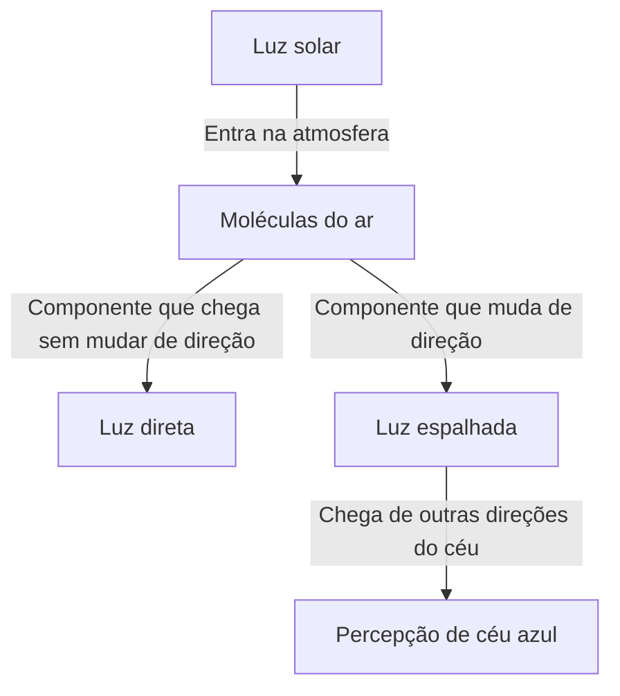
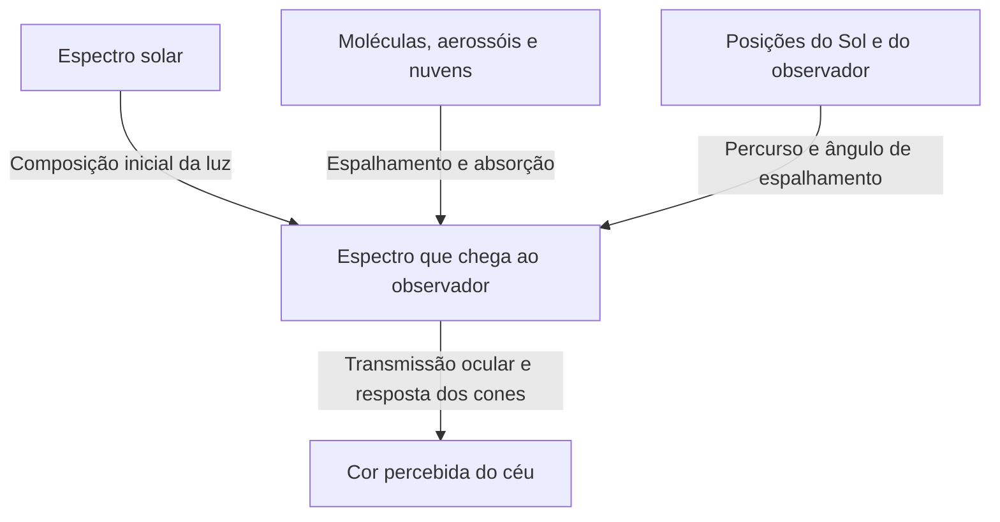

Ao olhar para o céu em um dia limpo, vemos um azul profundo acima da cabeça, que fica progressivamente esbranquiçado em direção ao horizonte distante. Quando o Sol baixa, porém, esse mesmo céu assume tons amarelos e alaranjados; depois do pôr do sol, surge ainda outro azul profundo.

Se colocarmos ar em um pequeno recipiente transparente, não veremos uma cor semelhante à de tinta azul. De onde vem, então, o azul que cobre o céu?

A resposta curta é que as moléculas do ar espalham a luz solar, favorecendo a chegada aos nossos olhos de luz com comprimentos de onda menores. Mas essa frase esconde perguntas importantes. O que é espalhamento? Por que ele depende do comprimento de onda? Por que vemos azul, e não violeta, cujo comprimento de onda é ainda menor? E como o mesmo mecanismo produz um pôr do sol vermelho?

Ao examinar essas perguntas, percebemos que a cor do céu não é uma propriedade exclusiva da atmosfera. Ela resulta da ação conjunta de três elementos: o Sol, que fornece a luz; a atmosfera, que altera seus caminhos; e os olhos, que percebem as cores.

## 1. A primeira distinção: luz que vem do Sol e luz que vem do céu

Durante o dia, ao ar livre, recebemos luz que chega quase diretamente da direção do Sol e luz que chega de outras regiões do céu. A primeira é a luz solar direta; a segunda, a luz difusa do céu. Há também luz refletida pelo solo e por construções, mas comecemos distinguindo essas duas componentes.

Imagine observar uma parte do céu com o Sol às suas costas. O Sol não está na direção do olhar. Mesmo assim, luz entra nos olhos vindo daquela direção, porque uma parte da luz solar mudou de caminho na atmosfera e passou a seguir em sua direção.

Os olhos usam a direção em que a luz viajava imediatamente antes de chegar como indicação de onde há luminosidade. Não existe uma parede azul no céu. A atmosfera, distribuída por uma grande extensão ao longo da linha de visada, envia luz para nós; percebemos a soma dessas contribuições como um céu luminoso contínuo.

Se fosse possível retirar apenas a atmosfera terrestre, mantendo o Sol e o chão nas mesmas condições, os locais iluminados continuariam claros, mas o céu seria escuro nas direções afastadas do Sol e dos objetos que refletem luz na superfície. Fotografias diurnas da Lua, com terreno claro sob um céu preto, ajudam a entender esse contraste.

O ponto central é que o espalhamento não cria luz nova: redistribui seus destinos. A luz removida da direção que aponta para o Sol pode iluminar o céu para alguém que olha em outra direção.

O diagrama separa os caminhos, mas, na realidade, um número imenso de moléculas participa simultaneamente. Uma única molécula não torna todo o céu azul, e um raio que sofreu um espalhamento não chega necessariamente ao observador.

## 2. A luz branca do Sol contém muitos comprimentos de onda

A luz é uma onda eletromagnética. Variações dos campos elétrico e magnético se propagam no espaço e apresentam propriedades ondulatórias. A distância equivalente ao intervalo entre duas cristas consecutivas é o comprimento de onda, normalmente representado pela letra grega $\lambda$.

A faixa visível depende das condições dos olhos e do critério adotado para considerar algo visível, mas fica aproximadamente entre 380 e 780 nanômetros. Um nanômetro corresponde a um bilionésimo de metro. Os comprimentos de onda da luz visível são muito menores que a espessura de um fio de cabelo.

Nessa faixa, os comprimentos de onda menores são percebidos como violeta e azul; os maiores, como laranja e vermelho. A natureza, porém, não traça linhas separando as cores. Seus nomes também são classificações humanas aplicadas a uma distribuição contínua de luz.

A luz solar não possui um único comprimento de onda. Abrange do violeta ao vermelho e inclui também ultravioleta e infravermelho invisíveis. Quando diferentes componentes visíveis chegam aos olhos, e a visão se adapta à iluminação ambiente, tratamos a luz do dia como uma iluminação aproximadamente branca.

Um prisma separa essa mistura porque cada comprimento de onda se propaga de maneira diferente no material. O céu azul, por sua vez, não é um arco-íris gigantesco projetado por um prisma. A fração da luz que muda de direção na atmosfera depende do comprimento de onda, alterando a composição da luz que chega de regiões afastadas do Sol.

Confundir essas situações leva à afirmação de que a luz solar foi transformada em luz azul. No espalhamento de Rayleigh usual, o comprimento de onda praticamente se conserva. A componente azul, que já existia na luz branca, simplesmente tem maior probabilidade de seguir para outras direções.

## 3. Como moléculas transparentes espalham a luz

### As moléculas são pequenos espelhos?

Os principais componentes da atmosfera são nitrogênio e oxigênio. Em volume, o ar seco contém aproximadamente 78% de nitrogênio e 21% de oxigênio; o restante inclui argônio e outros gases. Como a quantidade de vapor de água varia com o local e o tempo, esses números se referem ao ar sem vapor de água.

As moléculas de nitrogênio e oxigênio são muito menores que os comprimentos de onda visíveis. Por isso, desenhá-las como espelhos comuns nos quais raios luminosos ricocheteiam não basta para explicar a forte dependência do comprimento de onda.

Uma descrição fisicamente mais próxima envolve a força que o campo elétrico da luz exerce sobre os elétrons e os núcleos da molécula. As distribuições de cargas negativas e positivas se deslocam ligeiramente uma em relação à outra, criando uma separação elétrica chamada polarização.

Se o campo oscila com o tempo, essa separação também oscila. Um dipolo elétrico oscilante emite ondas eletromagnéticas ao redor. As ondas produzidas nessa resposta se superpõem à onda incidente, e surge luz também em direções diferentes da direção inicial. Essa é a imagem básica do espalhamento.

A expressão 'a molécula emite luz' não significa aqui o mesmo que fluorescência, na qual ocorre absorção seguida de emissão posterior, muitas vezes de outra cor. Estamos considerando uma resposta quase elástica à onda eletromagnética incidente. Uma descrição rigorosa exige mecânica quântica, mas essa imagem da eletrodinâmica clássica explica bem a dependência básica do céu azul com o comprimento de onda.

### Se o ar próximo é transparente, por que o céu é luminoso?

Espalhar luz e ser opaco não são a mesma coisa. Em poucos metros, de um lado a outro de uma sala, o espalhamento molecular da luz visível é fraco, e quase toda a luz atravessa o ar. Por isso enxergamos nitidamente a parede do outro lado.

Ao olhar para o céu, porém, o caminho óptico é muito maior. Embora a densidade diminua com a altura, a luz atravessa uma extensa camada atmosférica. O efeito de cada molécula é pequeno, mas seu enorme número e o longo percurso produzem uma quantidade visível de luz espalhada.

Não é o tamanho das moléculas que tem cor azul, nem o ar transparente que subitamente se transforma em uma substância azul. Uma interação quase imperceptível em distâncias curtas torna-se relevante em caminhos longos. Esse acúmulo de pequenos efeitos é uma característica fundamental do céu azul.

## 4. O que significa a lei da quarta potência?

O espalhamento por objetos muito menores que o comprimento de onda, como moléculas, recebe, sob determinadas condições, o nome de espalhamento de Rayleigh. Para o ar na faixa visível, a dependência aproximada da seção de choque de espalhamento $\sigma$ é:

$$
\sigma(\lambda) \propto \frac{1}{\lambda^4}
$$

A seção de choque expressa, em unidades de área, a probabilidade de ocorrer espalhamento. Não é simplesmente a área do contorno geométrico de uma molécula. É uma forma de resumir, em um número, a intensidade da interação entre luz e molécula.

Comparando uma componente azul de 450 nanômetros com uma componente vermelha de 650 nanômetros, a razão aproximada entre as seções de choque é:

$$
\frac{\sigma(450\,\mathrm{nm})}{\sigma(650\,\mathrm{nm})}
\approx \left(\frac{650}{450}\right)^4
\approx 4.35
$$

Se ambas chegarem com a mesma intensidade, a componente azul será espalhada cerca de 4,35 vezes mais facilmente. A diferença é muito maior que a simples razão entre os comprimentos de onda.

Isso não significa, porém, que o céu tenha '4,35 vezes mais azul que vermelho'. O cálculo ainda não inclui a intensidade solar em cada comprimento de onda, a atenuação antes e depois do espalhamento, a direção observada e a sensibilidade dos olhos. A razão entre seções de choque e a cor percebida são grandezas distintas.

### Por que a quarta potência, e não o quadrado?

Em um modelo eletromagnético simples, numa faixa em que a polarizabilidade molecular pode ser considerada aproximadamente constante, a amplitude do dipolo induzido é proporcional ao campo incidente. Já a amplitude do campo irradiado por esse dipolo a grande distância contém o quadrado da frequência angular $\omega$.

A intensidade luminosa é proporcional ao quadrado da amplitude do campo elétrico, de modo que surge o fator $\omega^4$. Como, no vácuo, $\omega$ é inversamente proporcional ao comprimento de onda, o resultado é a relação $1/\lambda^4$.

Não se trata de uma explicação geométrica segundo a qual ondas curtas esbarrariam em pequenos espaços. É uma lei ondulatória decorrente da maneira como cargas oscilantes irradiam ondas eletromagnéticas.

Naturalmente, não podemos estender essa aproximação a qualquer comprimento de onda. Perto das ressonâncias moleculares, a resposta de polarização muda, e a absorção ganha importância. Quando os espalhadores são grandes em relação ao comprimento de onda, as condições de Rayleigh deixam de valer. A lei da quarta potência é poderosa, mas possui um domínio de validade.

## 5. Por que, então, o céu não parece violeta?

Considerada isoladamente, a quarta potência sugere que o violeta, de comprimento de onda menor que o azul, deveria ser espalhado ainda mais. A pergunta faz sentido: a luz espalhada realmente contém violeta, além de azul.

A percepção da cor, porém, não funciona escolhendo o único comprimento de onda mais facilmente espalhado. Uma ampla mistura chega aos olhos, e o sistema visual responde ao conjunto.

Para começar, o espectro solar não tem a mesma intensidade em todos os comprimentos de onda. Sobre ele atuam a transmissão e o espalhamento atmosféricos. Depois, entram as propriedades de transmissão do próprio olho e a sensibilidade das células da retina.

Em ambientes claros, a visão de cores depende principalmente de três tipos de cones: S, M e L, relativamente mais sensíveis a comprimentos de onda curtos, médios e longos. Eles não são interruptores exclusivos para azul, verde e vermelho. Suas faixas de sensibilidade são amplas e se sobrepõem.

O cérebro constrói a cor comparando essas respostas. Mesmo quando a luz do céu é enriquecida em ondas curtas, a combinação de estímulos nos cones é normalmente percebida, durante um dia limpo, como azul ou azul tendendo ao violeta. A sensibilidade humana reduzida na extremidade violeta também é importante. A [explicação da NASA sobre ondas eletromagnéticas](https://science.nasa.gov/ems/03_behaviors/) distingue o espalhamento da sensibilidade visual.

Por isso, dizer que 'todo o violeta é absorvido pela atmosfera' não basta. Luz violeta visível também chega ao solo. Além disso, ultravioleta e violeta visível não são a mesma coisa: a absorção de ultravioleta pelo ozônio não pode ser usada diretamente como explicação para a ausência de um céu violeta.

Também não é adequado afirmar que 'o céu é realmente violeta, mas os olhos se enganam'. O espectro luminoso, uma grandeza física, e a experiência visual da cor são descrições de etapas diferentes. A visão não está funcionando mal; interpreta a mistura luminosa pelas mesmas regras de sempre.

## 6. O céu azul também nos envia luz vermelha

Um espectroscópio apontado para o céu azul não mostraria apenas uma linha azul. Há também luz em comprimentos de onda correspondentes ao vermelho e ao verde. O conjunto parece azul porque as componentes curtas estão relativamente realçadas.

Essa é uma diferença importante entre a luz do céu e um LED ou laser azul. Luz concentrada numa faixa estreita e uma mistura de espectro amplo com determinada predominância podem parecer semelhantes sem possuir o mesmo espectro.

Isso também revela a dificuldade de reproduzir exatamente a cor do céu. Uma tela de computador normalmente combina emissores vermelhos, verdes e azuis. Se produzir respostas semelhantes nos cones, poderá imitar a aparência do céu usando um espectro diferente do real.

Por outro lado, o azul fotografado depende da sensibilidade do sensor, do balanço de branco, da exposição, do processamento e da tela usada para olhar a imagem. Um azul mais intenso na fotografia não demonstra, por si só, que o espalhamento molecular era mais forte.

Evitar uma correspondência rígida entre 'comprimento de onda' e 'cor' permite entender, numa mesma perspectiva, tanto a questão do violeta quanto as cores das fotografias e o funcionamento das telas.

## 7. O pôr do sol fica vermelho porque o caminho da luz muda

O céu azul diurno e o pôr do sol vermelho não são fenômenos independentes regidos por princípios sem relação. Ambos envolvem a dependência do espalhamento com o comprimento de onda. O que muda é o caminho luminoso que estamos considerando.

Quando o Sol está alto, o caminho até o chão é relativamente curto. Perto do horizonte, a luz atravessa obliquamente um percurso atmosférico maior. As componentes curtas são removidas mais facilmente do feixe direto, deixando uma proporção maior de vermelho e laranja na luz que chega da direção solar.

Assim, o mesmo fato — o espalhamento preferencial da luz azul — tanto torna azul o céu afastado do Sol quanto avermelha a luz direta após um longo percurso atmosférico. A [explicação do NASA Space Place](https://spaceplace.nasa.gov/blue-sky/en/) ilustra essa mudança no comprimento do caminho.

Nem todo o vermelho do entardecer, entretanto, se explica apenas pela luz solar direta que entra nos olhos. Luz já avermelhada pode voltar a ser espalhada por moléculas e partículas ou refletida e espalhada por nuvens, chegando também de direções afastadas do Sol. As nuvens ficam escarlates porque mudou a cor da iluminação que recebem.

### A espessura atmosférica deve ser pensada ao longo do percurso

Num modelo simples de atmosfera plana, se o ângulo zenital do Sol for $z$, o fator de aumento do percurso em relação à vertical é aproximadamente:

$$
m \approx \frac{1}{\cos z}
$$

Para $z=60^\circ$, por exemplo, a estimativa é de duas vezes. A fórmula, porém, falha perto do horizonte. Quando $z$ se aproxima de 90 graus, o resultado diverge, embora o percurso real não seja infinito. É preciso considerar a curvatura terrestre, a diminuição da densidade com a altitude e a refração.

Diagramas do pôr do sol frequentemente representam a atmosfera como uma casca espessa de densidade uniforme. São esquemas para mostrar a diferença entre direções. A atmosfera real não tem um teto rígido onde termina de repente, nem densidade igual em toda parte.

## 8. A profundidade óptica transforma a cor do céu em um problema calculável

Mesmo com a mesma distância física, a intensidade do espalhamento e da absorção muda conforme a densidade do ar e a quantidade de partículas. Para descrever isso, usamos a espessura óptica, também chamada profundidade óptica, representada por $\tau$.

No caso simples de espalhamento apenas por moléculas, com densidade numérica $n(s)$ ao longo do caminho, escrevemos:

$$
\tau_{\mathrm{R}}(\lambda)=\int n(s)\,\sigma(\lambda)\,ds
$$

A variável $s$ é a distância ao longo do percurso. Multiplicamos a densidade pela seção de choque e somamos ao longo do caminho. As unidades — por metro cúbico, metro quadrado e metro — se cancelam, de modo que $\tau$ é adimensional.

Se $\tau_{\mathrm{ext}}$ for a profundidade óptica de extinção, incluindo absorção e espalhamento por aerossóis, a luz direta que permanece sem ser espalhada diminui, num modelo simples, conforme:

$$
I_{\mathrm{direct}}(\lambda)=I_0(\lambda)\exp[-\tau_{\mathrm{ext}}(\lambda)]
$$

A cada pequeno trecho adicional, é removida uma fração da luz que ainda resta. Não se subtrai sempre a mesma quantidade absoluta de um feixe que já perdeu grande parte da intensidade. Por isso a diminuição é exponencial, e não linear.

Essa fórmula, sozinha, não fornece o brilho do céu azul. Ela acompanha a luz que sai do feixe direto. A componente que é espalhada para dentro da linha de visada precisa ser acrescentada separadamente.

Para calcular a luz do céu que chega de uma direção, multiplicamos, em cada ponto, a intensidade solar recebida, a probabilidade de espalhamento para o observador e a fração que sobrevive no caminho restante; depois integramos ao longo da visada. O azul não é a cor de um único ponto: é a soma de contribuições distribuídas por um percurso extenso.

## 9. Por que o azul varia de uma região do céu para outra

Comparar o azul acima da cabeça com o azul pálido do horizonte mostra que o céu não é uniforme nem no mesmo dia. A direção do olhar altera a quantidade de atmosfera atravessada, bem como os efeitos dos aerossóis próximos ao solo e do espalhamento múltiplo.

Na direção do horizonte, olhamos por um longo trecho de atmosfera baixa. Além de moléculas, há partículas e pequenas gotículas que acrescentam luz de vários comprimentos de onda à visada. A mistura dessa luz mais esbranquiçada com o azul original reduz sua saturação.

A luz espalhada também pode voltar a ser espalhada ou absorvida antes de chegar aos olhos. Portanto, a ideia de que 'mais atmosfera sempre significa mais luz azul' acaba encontrando um limite. É preciso considerar simultaneamente as contribuições que acrescentam luz e as que a removem.

O céu às vezes parece azul profundo no alto de uma montanha, mas não existe uma proporcionalidade simples entre altitude e azul. Contribuem a menor quantidade de atmosfera acima, o afastamento da névoa das camadas baixas e o contraste com a luminosidade ao redor. Dependendo da umidade e das condições atmosféricas, o céu montanhoso também pode parecer esbranquiçado.

Pelo mesmo motivo, não podemos garantir que 'dias secos sempre têm azul intenso' ou que 'depois da chuva o ar é sempre transparente'. O vapor de água não é, por si só, uma névoa visível; pode afetar a aparência por meio da absorção de umidade pelas partículas e da formação de nuvens e névoa. Uma fotografia isolada não permite determinar unicamente a umidade ou a poluição.

## 10. Por que as nuvens brancas não ficam azuis?

As nuvens também espalham luz solar. A principal razão para parecerem brancas é que os responsáveis pelo espalhamento têm tamanhos muito diferentes dos das moléculas do ar.

As gotículas de água líquida das nuvens geralmente têm dimensões da ordem de micrômetros ou maiores, e muitas são maiores que os comprimentos de onda visíveis. Também existem nuvens de cristais de gelo. Nesse regime, a simples lei molecular da quarta potência já não pode ser aplicada diretamente.

A teoria de Mie é uma descrição importante do espalhamento por partículas esféricas. A razão entre o tamanho da partícula e o comprimento de onda, o índice de refração e outras propriedades determinam quanto se espalha em cada direção. Como uma nuvem contém muitas partículas de tamanhos diferentes, espalha uma faixa relativamente ampla do visível e parece esbranquiçada sob a luz solar.

Isso não significa que todos os comprimentos de onda sejam espalhados exatamente na mesma proporção. Cada gotícula tem uma dependência complexa com o comprimento de onda e o ângulo. Mas a soma de tamanhos e caminhos distintos faz chegar aos olhos uma luz menos favorecida em ondas curtas que a do céu azul.

Por que, então, a base de uma nuvem de chuva é cinza-escura? Em nuvens espessas, a luz sofre muitos espalhamentos, e uma parcela maior retorna para cima ou sai pelas laterais. Se menos luz chega à base, ela parece escura vista do chão. A água não se transformou em uma substância cinzenta.

As bordas claras e a base escura também refletem os caminhos da luz dentro e fora da nuvem. Associar simplesmente nuvens brancas a 'água limpa' e nuvens cinzentas a 'água suja' está errado.

## 11. Névoa, fumaça e poeira alteram a cor da mesma maneira?

Pequenas partículas sólidas e gotículas suspensas na atmosfera recebem coletivamente o nome de aerossóis. Incluem sal marinho, poeira do solo e partículas provenientes de fumaça. São tratadas separadamente das próprias moléculas do ar.

Suas propriedades ópticas dependem da distribuição de tamanhos, da forma e da composição. Algumas espalham muita luz; outras, como a fuligem, também absorvem intensamente. Portanto, um céu branco de névoa e um céu amarronzado não podem ser explicados ambos como um aumento de luz azul.

Para partículas maiores que moléculas, pode ser importante a tendência de espalhar fortemente para a frente, perto da direção original. A região esbranquiçada e luminosa ao redor do Sol está relacionada a essa dependência angular. Observar perto do Sol é perigoso mesmo a olho nu: não olhe diretamente para ele para tentar verificar isso.

Também não é verdade que quanto mais poluído o ar, mais belo e vermelho será o pôr do sol. Uma quantidade moderada de partículas pode realçar certas cores sob condições específicas, mas fumaça ou poeira espessas atenuam a luz e deixam a paisagem apagada. O resultado depende da altura das nuvens, da elevação solar e da distribuição das partículas.

Como várias causas produzem a cor atmosférica, a cor sozinha não basta para identificar a causa. Observações científicas combinam diferentes comprimentos de onda, polarização e direções para estimar a quantidade e as propriedades das partículas. A pergunta cotidiana sobre o céu azul é também uma porta de entrada para o sensoriamento remoto da atmosfera.

## 12. Outra propriedade da luz do céu: a polarização

Além de comprimento de onda e intensidade, a luz tem uma direção de oscilação do campo elétrico. Uma preferência nessa direção é chamada polarização. A luz de um céu limpo é parcialmente polarizada, em grau que depende da direção observada.

No espalhamento de Rayleigh idealizado, para luz incidente não polarizada que sofre um único espalhamento, a dependência angular da intensidade com o ângulo $\theta$ tem aproximadamente a forma:

$$
I(\theta)\propto 1+\cos^2\theta
$$

O ângulo de espalhamento é o ângulo entre as direções de propagação antes e depois do evento. Mesmo a 90 graus, de lado, a intensidade não é zero. A fórmula mostra que moléculas do ar podem enviar lateralmente luz recebida do Sol.

No mesmo modelo, o grau de polarização linear é:

$$
P(\theta)=\frac{\sin^2\theta}{1+\cos^2\theta}
$$

Nessa aproximação, ele é máximo a 90 graus. O céu real inclui propriedades moleculares, espalhamento múltiplo, aerossóis e reflexões do solo, portanto não apresenta necessariamente a polarização completa prevista pelo modelo ideal.

Ao olhar para uma região azul bem afastada do Sol através de um filtro polarizador e girá-lo, é possível observar uma mudança de brilho. Essa é uma das razões pelas quais filtros fotográficos alteram a intensidade aparente do azul. O [HyperPhysics da Georgia State University](https://hyperphysics.phy-astr.gsu.edu/hbase/phyopt/skypol.html) apresenta a relação entre direção e polarização do céu.

Uma lente grande-angular inclui diferentes ângulos de espalhamento no mesmo quadro. O filtro pode, então, escurecer algumas regiões mais que outras, produzindo uma aparência irregular. Esse efeito não precisa ser um defeito do filtro: ele revela o padrão de polarização distribuído pelo céu.

## 13. Por que ainda há céu azul depois que o Sol se põe?

O pôr do sol não é o instante em que a luz deixa de atingir toda a atmosfera terrestre. Mesmo depois de o observador perder o Sol de vista, regiões atmosféricas elevadas continuam iluminadas. A luz espalhada ali chega ao chão, evitando que tudo escureça imediatamente.

Também participa o espalhamento múltiplo: luz espalhada uma vez volta a ser espalhada em outro lugar. A explicação básica diurna pode se concentrar em um único evento, mas no crepúsculo os caminhos ficam longos e complexos, e essa aproximação pode ser insuficiente.

Nessas condições, o ozônio também pode ter importância. Conhecido por absorver ultravioleta, ele possui ainda uma ampla faixa de absorção no visível, a banda de Chappuis. Em percursos longos, essa absorção seletiva afeta a cor crepuscular.

Por isso, é difícil explicar o azul profundo da chamada hora azul apenas pelo mesmo espalhamento de Rayleigh simples usado para o dia. É preciso considerar a atmosfera esférica, as regiões em sombra, o ozônio, os aerossóis e o espalhamento múltiplo. Um [relatório técnico da NASA](https://ntrs.nasa.gov/citations/19730020661) calcula contribuições de ozônio e aerossóis para a cor do crepúsculo.

Não há contradição entre afirmar que o espalhamento molecular é a principal causa do céu azul diurno e dizer que a absorção também influencia o crepúsculo. A importância relativa dos processos muda com o horário, a direção e as condições atmosféricas.

## 14. O mar azul, as montanhas azuladas e a Terra vista do espaço

### A reflexão do oceano não explica sozinha o azul do céu

Às vezes se diz que o céu é azul porque reflete a cor do mar. Mas também há céu azul no interior, longe dos oceanos. Com atmosfera e iluminação adequadas, o espalhamento molecular produz céu azul mesmo sem um mar.

A superfície marinha realmente reflete luz do céu, influenciando a aparência da água. Isso, porém, tampouco explica todo o azul oceânico como um simples espelho. Em caminhos longos, a água absorve seletivamente a luz do lado vermelho do espectro; combinada ao espalhamento subaquático, essa absorção faz retornar luz azul. Nas regiões costeiras, fundo, materiais suspensos e fitoplâncton também alteram a cor. A [explicação da NOAA](https://oceanservice.noaa.gov/facts/oceanblue.html) descreve a absorção da luz vermelha pela água.

Céu e mar influenciam mutuamente suas aparências, mas não ficam azuis por uma única causa idêntica. Encontrar cores semelhantes não autoriza aplicar automaticamente o mesmo mecanismo.

### Montanhas distantes parecem azuis porque há ar entre elas e os olhos

Quando montanhas distantes ficam azuladas e perdem contraste, a luz que vem delas é atenuada na atmosfera, enquanto o ar ao longo do caminho acrescenta luz espalhada à visada. Essa contribuição adicional às vezes é chamada airlight.

A montanha não ganhou uma camada de tinta azul: sua imagem recebeu a contribuição atmosférica entre ela e o observador. A perspectiva aérea da pintura, que representa objetos distantes com cores mais suaves e azuladas, explora esse fenômeno óptico cotidiano. Em névoa densa ou na iluminação do entardecer, a cor acrescentada também muda.

O azul da Terra vista do espaço combina luz da superfície e do interior dos oceanos, espalhamento atmosférico, nuvens e outros elementos. A perspectiva e os caminhos são diferentes dos de quem olha para cima no chão. Até a frase 'a Terra é azul' reúne vários fenômenos ópticos.

## 15. O pôr do sol azul em Marte contradiz a quarta potência?

Imagens de sondas em Marte às vezes mostram uma coloração azul perto do Sol ao entardecer. Como isso parece o oposto do pôr do sol terrestre, pode dar a impressão de que a explicação de Rayleigh foi derrubada.

Mas a poeira fina suspensa tem um papel importante nas cores marcianas. Não são as mesmas condições de um modelo simples dominado apenas por moléculas. O tamanho e as propriedades das partículas alteram a dependência angular do espalhamento em cada comprimento de onda.

Ao entardecer em Marte, a distribuição da luz que atravessou a poeira pode destacar componentes azuis numa região estreita perto do Sol. Isso não significa que todo o céu marciano seja sempre azul como um dia limpo na Terra. A [imagem do pôr do sol obtida pelo Perseverance e publicada pela NASA](https://science.nasa.gov/resource/mastcam-zs-first-martian-sunset/) mostra um exemplo dessa luz azulada.

As leis naturais não mudam caprichosamente de lugar para lugar. Mudam a composição atmosférica, as partículas, os percursos e a direção observada. A mesma eletrodinâmica produz cores diferentes quando recebe condições diferentes.

Podemos ampliar esse raciocínio para planetas que orbitam outras estrelas. Se o espectro da fonte, a atmosfera e as nuvens forem diferentes, um céu azul não é garantido. A cor familiar da Terra é uma manifestação de leis universais sob condições particulares do nosso planeta.

## 16. O que observar em casa?

### Um experimento com água e um pouco de leite

Coloque água num recipiente transparente, acrescente leite em quantidades muito pequenas e ilumine de lado com uma luz LED branca. Num ambiente um pouco escuro, compare a luz vista lateralmente ao percurso com a luz transmitida pelo recipiente e projetada numa folha branca.

Com concentração e comprimento de caminho adequados, pode ser possível observar cores diferentes na luz espalhada lateralmente e na luz transmitida. Partículas em excesso tornam a mistura branca e turva, deixando passar pouca luz. O resultado também depende da fonte e do formato do recipiente.

O valor da experiência está em separar a observação da luz que sai para os lados da que atravessa em frente. As partículas do leite, porém, são muito maiores que moléculas de nitrogênio e oxigênio, e apresentam tamanhos variados. O experimento não é uma reprodução rigorosa do espalhamento atmosférico de Rayleigh nem uma medição da quarta potência.

Mesmo uma lâmpada branca pode não conter uma distribuição contínua e uniforme de comprimentos de onda. Em lanternas de celular, por exemplo, o espectro do LED influencia o resultado. Se não aparecer azul, não conclua que a explicação está errada: compare as condições do modelo com as da atmosfera real.

### Compare o céu com um polarizador

Um filtro polarizador fotográfico ou óculos com polarização podem revelar variações no brilho do céu, longe do Sol, quando são girados. Comparar nuvens e regiões próximas ao horizonte também mostra que a luz celeste não tem propriedades uniformes.

Não olhe para o Sol durante a observação. Óculos escuros e polarizadores comuns não são filtros seguros para observação solar. Evite também olhar diretamente por binóculos, telescópios ou visores ópticos de câmeras. Observe apenas regiões seguras suficientemente afastadas do Sol.

Para registrar fotografias comparáveis, mantenha o enquadramento, a exposição e o balanço de branco. Correções automáticas podem clarear uma região que realmente escureceu, escondendo a mudança.

### Registre as condições, além da cor

Ao observar de manhã, ao meio-dia e à tarde, anote a altura aproximada do Sol, a direção do olhar, a quantidade de nuvens e a névoa no horizonte. Descrições como 'azul profundo acima e branco ao longe' ou 'apenas a base da nuvem está escura' ajudam mais a relacionar a observação à física que uma palavra isolada para o azul.

Não é preciso diagnosticar toda a atmosfera com uma única observação. Comparar condições, registrar o que contrariou a previsão e distinguir o processamento da câmera da impressão visual já são atitudes fundamentais da observação científica.

## 17. Um passo além: a diferença entre vidro transparente e ar

A essa altura surge outra pergunta. O vidro também contém elétrons e núcleos, que devem se polarizar em resposta à luz. Por que, então, o vidro transparente não espalha fortemente para os lados como o céu?

Ao somar pequenas respostas individuais, não podemos esquecer a fase das ondas. As amplitudes dos campos podem se reforçar ou se cancelar. Nem sempre é correto simplesmente somar a resposta de muitos átomos como se fossem intensidades luminosas independentes.

Num meio idealmente homogêneo, a superposição das ondas produzidas por uma polarização distribuída de forma espacialmente suave constrói uma onda que se propaga para a frente. Essa resposta coletiva está relacionada ao índice de refração e à propagação da luz. Para o espalhamento em outras direções, tornam-se importantes flutuações espaciais da densidade ou do índice, impurezas e defeitos.

Num gás, as moléculas se movem, e a densidade numérica local apresenta flutuações estatísticas. A descrição do espalhamento molecular num gás rarefeito e a descrição em termos de flutuações de densidade num meio contínuo não são fenômenos sem relação: são descrições conectadas em escalas diferentes.

O vidro real também tem espalhamento fraco, absorção e reflexões nas superfícies. Não é um meio ideal perfeitamente uniforme e sem perdas. Ainda assim, a superposição ondulatória corrige a ideia de que cada átomo simplesmente acrescentaria uma quantidade independente de luz espalhada lateralmente.

Uma explicação cotidiana começa com a resposta de uma molécula; uma análise mais precisa avança para as posições relativas e a interferência. Entender essas etapas transforma a explicação do céu de uma história de colisões entre partículas numa descrição da física das ondas eletromagnéticas.

## 18. Até onde podemos usar a explicação do céu azul?

Dizer que 'o céu é azul por espalhamento de Rayleigh' é um excelente ponto de partida para entender um dia limpo na Terra. Não é, porém, uma promessa de prever todas as cores celestes com uma única fórmula.

Numa atmosfera suficientemente tênue, a aproximação centrada em um único espalhamento explica a dependência básica com o comprimento de onda e a polarização. Caminhos longos, o horizonte, nuvens espessas, crepúsculo, fumaça intensa e poeira exigem física adicional. A luz entra e sai da visada por espalhamento, sofre absorção e recebe contribuições refletidas pelo solo.

A transferência radiativa acompanha essas entradas e saídas para cada comprimento de onda e direção. Um cálculo preciso combina a estrutura vertical atmosférica, a posição solar, as propriedades ópticas das partículas, a reflexão da superfície e a resposta visual. Não descartamos um modelo simples como errado: usamos o modelo sabendo quais efeitos ele deixou de fora.

Ao olhar para o céu, não vemos cada molécula separadamente. Vemos, reunidos numa paisagem, a interação da luz com a matéria, a estrutura atmosférica que envolve a Terra, a interferência das ondas e o funcionamento dos sentidos humanos.

O fato cotidiano de o céu ser azul não prova que o mundo seja simples. Mostra como fenômenos em várias escalas se conectam de maneira tão natural que quase não os notamos. Se o azul de amanhã parecer diferente do de hoje, essa diferença será uma nova pista para investigar o caminho percorrido pela luz.

## Referências

- [NASA Space Place: Why Is the Sky Blue?](https://spaceplace.nasa.gov/blue-sky/en/) — Introdução ao céu azul e ao pôr do sol a partir do comprimento de onda e dos caminhos atmosféricos.
- [NASA Science: Wave Behaviors](https://science.nasa.gov/ems/03_behaviors/) — Espalhamento, refração, comprimento de onda e sensibilidade da visão humana.
- [Georgia State University, HyperPhysics: Skylight Polarization](https://hyperphysics.phy-astr.gsu.edu/hbase/phyopt/skypol.html) — Relação entre a polarização da luz espalhada e a direção de observação.
- [NASA NTRS: The influence of ozone and aerosols on the brightness and color of the twilight zone](https://ntrs.nasa.gov/citations/19730020661) — Relatório técnico sobre ozônio e aerossóis no cálculo das cores crepusculares.
- [NOAA Ocean Service: Why is the ocean blue?](https://oceanservice.noaa.gov/facts/oceanblue.html) — Explicação do azul oceânico pela absorção seletiva da luz na água.
- [NASA Science: Mastcam-Z's First Martian Sunset](https://science.nasa.gov/resource/mastcam-zs-first-martian-sunset/) — O pôr do sol em Marte e a luz azulada associada à poeira.
