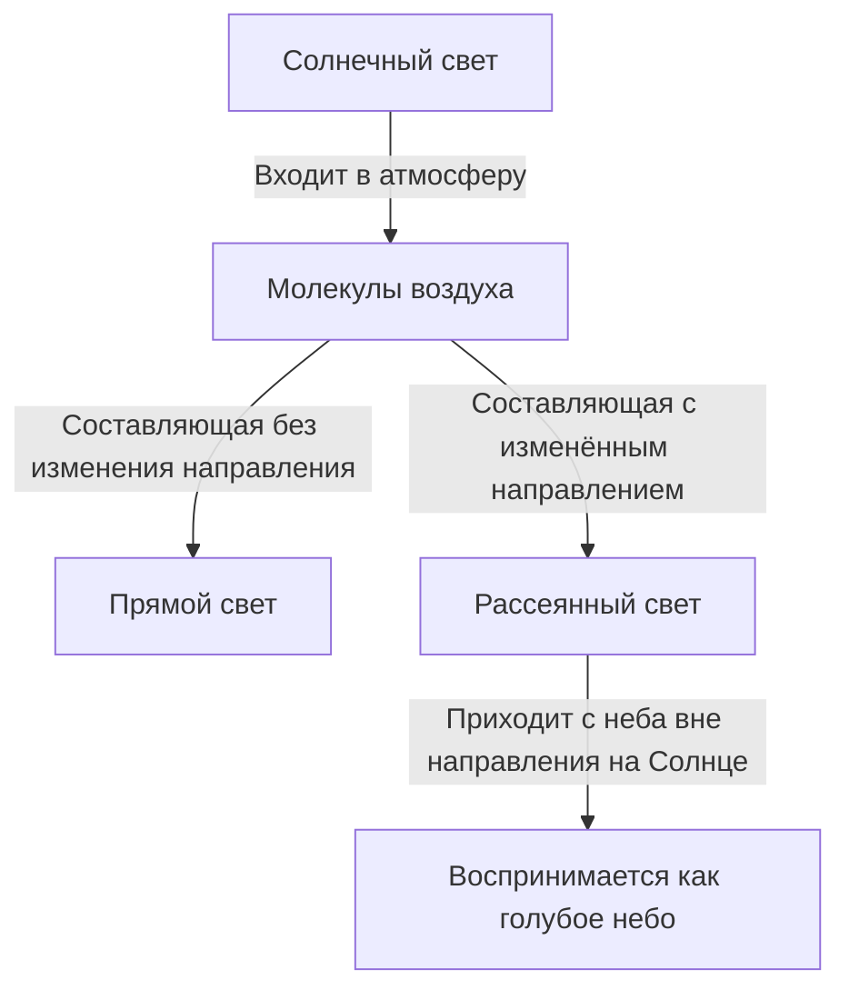
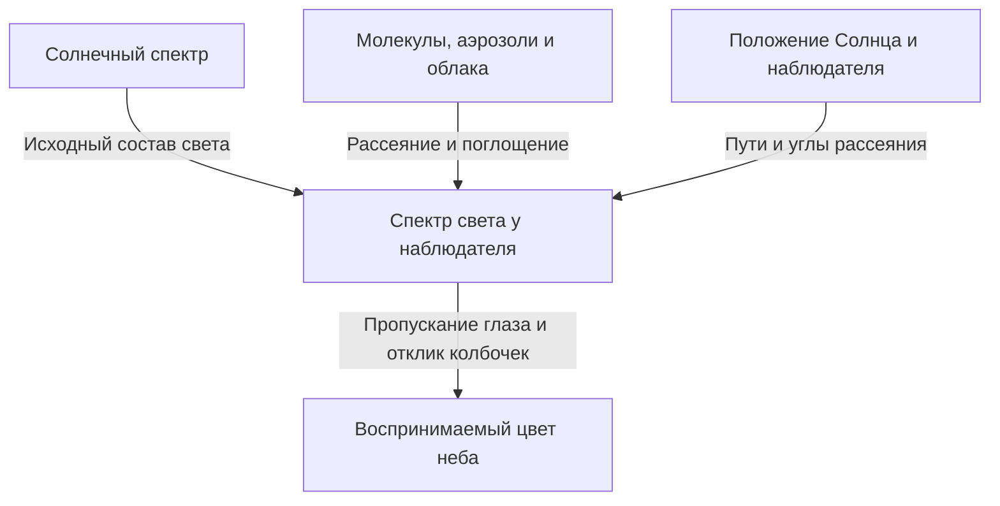

Если посмотреть вверх в ясный день, над головой раскинется насыщенная синева, постепенно белеющая к далёкому горизонту. Но стоит Солнцу опуститься, и то же небо становится жёлтым и оранжевым, а после заката в нём появляется уже другая, глубокая синева.

Если поместить воздух в маленькую прозрачную ёмкость, мы не увидим цвета, похожего на синюю краску. Откуда же берётся голубизна, заполняющая небо?

Краткий ответ: солнечный свет рассеивается молекулами воздуха, причём коротковолновые составляющие легче меняют направление и попадают в наши глаза. Однако за этой фразой скрываются важные вопросы. Что такое рассеяние? Почему оно зависит от длины волны? Почему небо не фиолетовое, ведь фиолетовые волны короче синих? И каким образом тот же механизм создаёт красный закат?

Разбирая эти вопросы по порядку, мы обнаружим, что цвет неба не является свойством одной только атмосферы. Его совместно создают Солнце как источник света, атмосфера, меняющая направления распространения, и глаз, воспринимающий цвет.

## 1. Сначала различим свет от Солнца и свет от неба

Днём на открытом воздухе есть свет, приходящий почти по прямой со стороны Солнца, и свет, приходящий с остальных участков неба. Первый называют прямым солнечным светом, второй — рассеянным светом неба. Существуют также отражения от земли и зданий, но пока важно различить первые два случая.

Представьте, что стоите спиной к Солнцу и смотрите на какой-нибудь участок неба. На линии взгляда нет Солнца, но свет всё равно поступает оттуда в глаз. Часть солнечного света по пути изменила направление в атмосфере и направилась к вам.

Глаз определяет, какая сторона светлая, по направлению, в котором свет двигался непосредственно перед попаданием в него. В небе нет голубой стены. Обширная область атмосферы вдоль линии зрения посылает к нам свет, а сумму этих вкладов мы воспринимаем как единый светящийся небосвод.

Если бы можно было убрать только земную атмосферу, оставив прежними Солнце и поверхность, освещённые участки земли оставались бы яркими, но небо вдали от Солнца и отражающих объектов стало бы тёмным. Дневные снимки Луны, где над светлой поверхностью видно чёрное небо, помогают понять этот контраст.

Главное здесь — рассеяние не создаёт новый свет, а перераспределяет его направления. Свет, исчезнувший из луча, направленного от Солнца, для наблюдателя, смотрящего в другую сторону, становится светом, освещающим небо.

На схеме пути разделены, но в действительности одновременно участвует огромное количество молекул. Не одна молекула окрашивает всё небо, и далеко не всякий однажды рассеянный свет обязательно достигает наблюдателя.

## 2. В белом солнечном свете содержатся разные длины волн

Свет — электромагнитная волна. Изменения электрического и магнитного полей распространяются в пространстве и обладают волновыми свойствами. Расстояние между соседними гребнями называют длиной волны и обычно обозначают греческой буквой $\lambda$.

Диапазон, доступный человеческому зрению, зависит от состояния глаза и критерия видимости, но приблизительно лежит в пределах 380–780 нанометров. Нанометр — одна миллиардная метра. Длины волн видимого света гораздо меньше толщины волоса.

В этом диапазоне коротковолновый край воспринимается как фиолетовый и синий, длинноволновый — как оранжевый и красный. Однако природа не провела чётких линий между названиями цветов и длинами волн. Цветовые границы отчасти представляют собой человеческую классификацию непрерывного распределения света.

Солнечный свет не состоит из одной определённой длины волны. Он охватывает широкий диапазон: от фиолетового до красного, а также невидимые ультрафиолетовые и инфракрасные волны. Различные видимые составляющие поступают в глаз, а зрение приспосабливается к освещению, поэтому мы воспринимаем дневной свет как приблизительно белое освещение.

Призма разделяет эту смесь благодаря различиям распространения волн разной длины. Но голубое небо — не огромная радуга, спроецированная призмой в воздух. Доли света, меняющего направление в атмосфере, зависят от длины волны, и поэтому состав света, приходящего с направлений вдали от Солнца, меняется.

Если это перепутать, можно ошибочно сказать, что солнечный свет «превращается в синий». При обычном рэлеевском рассеянии длина волны почти сохраняется. Синие составляющие, с самого начала присутствовавшие в белом свете, просто легче перенаправляются в другие стороны.

## 3. Как прозрачные молекулы рассеивают свет

### Молекула — это маленькое зеркало?

Главные составляющие атмосферы — азот и кислород. По объёму сухой воздух содержит около 78% азота и 21% кислорода, а остальное приходится на аргон и другие газы. Содержание водяного пара зависит от места и погоды, поэтому эти числа относятся к воздуху без водяного пара.

Молекулы азота и кислорода гораздо меньше длины волны видимого света. Поэтому изображение молекулы как обычного зеркала, от поверхности которого отскакивает луч, само по себе не объясняет сильную зависимость от длины волны.

Более физичная картина такова: электрическое поле света действует на электроны и ядра в молекуле. Распределения отрицательных и положительных зарядов немного смещаются относительно друг друга, и в молекуле возникает электрическое разделение зарядов. Это называют поляризацией молекулы.

Если поле колеблется во времени, это разделение также колеблется. Колеблющийся электрический диполь излучает электромагнитные волны. Волны, возникающие как отклик молекулы, складываются с падающей волной, и свет появляется также в направлениях, отличных от исходного. Это основная картина, позволяющая понять рассеяние.

Слова «молекула излучает свет» здесь не означают флуоресценцию, при которой энергия сначала поглощается и запасается, а позднее испускается свет другого цвета. Мы рассматриваем почти упругий отклик молекулы на падающую электромагнитную волну. Для строгого описания нужна квантовая механика, но основную зависимость голубого неба от длины волны хорошо объясняет и эта классическая электромагнитная картина.

### Почему воздух рядом прозрачен, а небо светится?

Рассеивать свет — не то же самое, что быть непрозрачным. На расстоянии нескольких метров через комнату молекулярное рассеяние видимого света слабо, и почти весь свет проходит дальше. Поэтому сквозь воздух мы ясно видим противоположную стену.

Когда мы смотрим на небо, путь света не ограничивается несколькими метрами. Хотя плотность уменьшается с высотой, свет проходит через толстый слой атмосферы. Действие отдельной молекулы мало, но огромное количество молекул на длинном пути создаёт заметный рассеянный свет.

Не размер молекулы сам по себе имеет синий цвет, и прозрачный воздух не превращается внезапно в синее вещество. Взаимодействие, столь слабое, что его можно не заметить на коротком пути, становится существенным на длинном. Такое накопление малых эффектов — важная особенность голубого неба.

## 4. Что означает закон четвёртой степени длины волны

Рассеяние на объектах, достаточно малых по сравнению с длиной волны, например на молекулах, при определённых условиях называют рэлеевским рассеянием. Для воздуха в видимом диапазоне основную зависимость сечения рассеяния $\sigma$ от длины волны можно записать так:

$$
\sigma(\lambda) \propto \frac{1}{\lambda^4}
$$

Сечение рассеяния — величина, выражающая эффективность рассеяния в единицах площади. Это не площадь геометрического силуэта молекулы. Она сводит силу взаимодействия света с молекулой к одному числу.

По этому соотношению для синей составляющей с длиной волны 450 нанометров и красной с длиной волны 650 нанометров получаем приблизительно:

$$
\frac{\sigma(450\,\mathrm{nm})}{\sigma(650\,\mathrm{nm})}
\approx \left(\frac{650}{450}\right)^4
\approx 4.35
$$

Если сравнивать две падающие составляющие одинаковой интенсивности, синяя рассеивается примерно в 4,35 раза эффективнее красной. Разница значительно больше самого отношения длин волн.

Однако это не значит, что «синего цвета в небе в 4,35 раза больше, чем красного». Здесь ещё не учтены интенсивности разных длин волн в солнечном свете, ослабление до и после рассеяния, направление наблюдения и чувствительность глаза. Отношение сечений и воспринимаемый в итоге цвет — разные вещи.

### Почему четвёртая степень, а не вторая?

В простой электромагнитной модели, в диапазоне, где поляризуемость молекулы можно считать почти постоянной, амплитуда наведённого электрического диполя пропорциональна падающему электрическому полю. При этом амплитуда поля, излучаемого диполем на большие расстояния, содержит квадрат угловой частоты $\omega$.

Интенсивность света пропорциональна квадрату амплитуды поля, поэтому в интенсивности излучения появляется $\omega^4$. В вакууме $\omega$ обратно пропорциональна длине волны, и получается зависимость $1/\lambda^4$.

Это не геометрическая история о том, что короткие волны чаще «натыкаются на маленькие щели». Это волновой закон, следующий из свойств излучения колеблющихся зарядов.

Конечно, приближение нельзя продолжать на любые длины волн. Вблизи молекулярного резонанса поляризационный отклик меняется, а поглощение становится важным. Если рассеивающий объект велик по сравнению с длиной волны, условия рэлеевского приближения вообще не выполняются. Закон четвёртой степени полезен, но имеет область применимости.

## 5. Почему же небо всё-таки не фиолетовое

Если смотреть только на закон четвёртой степени, фиолетовый свет с более короткой волной должен рассеиваться сильнее синего. Это правильный вопрос. Действительно, рассеянный свет содержит не только синие, но и фиолетовые составляющие.

Однако человеческое восприятие цвета не выбирает одну «наиболее эффективно рассеиваемую» длину волны. В глаз попадает смесь широкого диапазона волн, и зрительная система воспринимает весь её состав.

Прежде всего, солнечный спектр не имеет одинаковой интенсивности на всех длинах волн. Затем добавляются зависящие от длины волны пропускание и рассеяние в атмосфере. Далее необходимо учитывать прохождение света внутрь глаза и чувствительность светочувствительных клеток сетчатки.

При ярком освещении цветовое зрение в основном обеспечивают три типа колбочек: S, M и L, относительно чувствительные соответственно к коротким, средним и длинным волнам. Но это не отдельные переключатели, каждый из которых обнаруживает только синий, зелёный или красный свет. Области чувствительности широки и перекрываются.

Мозг формирует цвет, сравнивая отклики этих колбочек. Даже если в свете неба преобладают короткие волны, сочетание стимулов в обычный ясный день воспринимается как голубой или синий с некоторым сине-фиолетовым оттенком. Невысокая чувствительность человека к фиолетовому краю спектра также существенна. [Объяснение NASA об электромагнитных волнах](https://science.nasa.gov/ems/03_behaviors/) тоже различает рассеяние и чувствительность зрения.

Поэтому объяснение «весь фиолетовый свет поглощается атмосферой» недостаточно. Видимый фиолетовый свет достигает поверхности. Кроме того, ультрафиолет — не то же самое, что видимый фиолетовый. Поглощение ультрафиолета озоном нельзя просто подставить вместо причины отсутствия фиолетового неба.

Равным образом неверно без оговорок говорить: «На самом деле небо фиолетовое, просто глаз ошибается». Спектр света как физическая величина и цветовой опыт, создаваемый зрением, относятся к разным уровням описания. Цветовое зрение не даёт сбой, а считывает смешанный свет по своим обычным правилам.

## 6. Голубое небо посылает нам и красный свет

Если исследовать голубое небо спектрометром, мы не увидим только одну синюю линию. В нём есть и длины волн, соответствующие красному и зелёному. Коротковолновая часть относительно усилена, поэтому вся смесь выглядит голубой.

Это важное отличие света неба от синего светодиода или синего лазера. Свет, сосредоточенный в узком диапазоне, и широкая спектральная смесь с определённым перекосом могут выглядеть похоже, но иметь разные спектры.

Отсюда становится понятна сложность точного воспроизведения небесного цвета. Компьютерный экран обычно создаёт цвета сочетанием красного, зелёного и синего излучения. Если вызвать у человека похожие отклики колбочек, можно получить близкий видимый цвет даже при спектре, отличном от настоящего неба.

И наоборот, цвет неба на фотографии зависит от чувствительности сенсора, баланса белого, экспозиции, обработки и экрана, на котором её рассматривают. Насыщенная синева на снимке сама по себе не доказывает, что молекулярное рассеяние в тот момент было сильнее.

Не стоит слишком буквально связывать длину волны и цвет один к одному. Уже это позволяет с единой точки зрения разобраться не только с фиолетовым вопросом, но и с цветом фотографий и устройством дисплеев.

## 7. Закат красный, потому что меняется путь наблюдаемого света

Дневное голубое небо и красный закат — не независимые явления с несвязанными причинами. Оба связаны с тем, что эффективность рассеяния зависит от длины волны. Но рассматриваемые пути света различаются.

Когда Солнце высоко, путь до поверхности сравнительно короток. При приближении Солнца к горизонту свет проходит через атмосферу Земли по длинному наклонному пути. Коротковолновые составляющие легче удаляются из прямого пучка, и в свете, приходящем со стороны Солнца, остаётся относительно больше красного и оранжевого.

Один и тот же факт — синее рассеивается эффективнее — делает небо вдали от Солнца голубым и одновременно окрашивает в красный прямой свет после длинного пути через атмосферу. [Материал NASA Space Place](https://spaceplace.nasa.gov/blue-sky/en/) показывает изменение длины пути на иллюстрациях.

Но всю красноту вечернего неба нельзя объяснить только солнечным светом, прямо попадающим в глаз. Уже покрасневший свет дополнительно рассеивается молекулами и частицами либо отражается и рассеивается облаками, приходя и с направлений вдали от Солнца. Вечерние облака становятся алыми потому, что изменился цвет освещающего их света.

### Толщину атмосферы нужно понимать через путь

В простой модели плоской атмосферы, если зенитный угол Солнца равен $z$, отношение длины пути к вертикальному можно приблизительно записать так:

$$
m \approx \frac{1}{\cos z}
$$

Например, при $z=60^\circ$ получается увеличение примерно вдвое. Однако около горизонта формула перестаёт работать. При приближении $z$ к 90 градусам она даёт бесконечность, но реальный путь через атмосферу не бесконечен. Здесь нужна модель, учитывающая кривизну Земли, уменьшение плотности с высотой, преломление и другие эффекты.

На схемах заката атмосферу часто рисуют толстой оболочкой постоянной плотности. Это условное изображение, показывающее разницу направлений. У настоящей атмосферы нет твёрдого потолка, где она внезапно обрывается, и нет одинаковой плотности повсюду.

## 8. Оптическая толщина переводит разговор о цвете неба на язык расчётов

Даже при одинаковом геометрическом расстоянии разная плотность воздуха или количество частиц приводят к разному рассеянию и поглощению. Поэтому используют оптическую толщину, также называемую оптической глубиной, с обозначением $\tau$.

В простом случае, когда учитывается только молекулярное рассеяние, при концентрации молекул $n(s)$ вдоль луча можно написать:

$$
\tau_{\mathrm{R}}(\lambda)=\int n(s)\,\sigma(\lambda)\,ds
$$

Здесь $s$ — расстояние вдоль пути. Мы умножаем концентрацию на сечение рассеяния и суммируем вклад вдоль всей трассы. Проверка размерностей показывает: «на кубический метр», «квадратный метр» и «метр» сокращаются, так что $\tau$ безразмерна.

Если включить поглощение и аэрозольное рассеяние в оптическую толщину ослабления $\tau_{\mathrm{ext}}$, то сохранившийся нерассеянный прямой свет в простой модели уменьшается по закону:

$$
I_{\mathrm{direct}}(\lambda)=I_0(\lambda)\exp[-\tau_{\mathrm{ext}}(\lambda)]
$$

Это означает, что на каждом небольшом дополнительном участке удаляется определённая доля оставшегося света. Из уже сильно ослабленного пучка не вычитается каждый раз одинаковое абсолютное количество. Поэтому уменьшение экспоненциальное, а не линейное.

Важно и то, что одной этой формулы недостаточно для определения яркости голубого неба. Она отслеживает свет, уходящий из прямого пучка. Свет, который заново рассеивается в линию зрения, необходимо прибавлять отдельно.

Чтобы получить свет неба в направлении наблюдения, для каждой точки нужно перемножить приходящую туда интенсивность солнечного света, вероятность рассеяния к наблюдателю и долю, сохранившуюся на последующем пути к нему, а затем проинтегрировать вдоль линии зрения. Голубое небо — не цвет одной точки пути, а сумма вкладов, распределённых по большой протяжённости.

## 9. Почему оттенок неба различается в разных направлениях

Сравнивая синеву над головой с бледно-голубым у горизонта, мы видим, что даже в один день небо неоднородно. С направлением взгляда меняется количество пересекаемой атмосферы, а также влияние приземных аэрозолей и многократного рассеяния.

Глядя близко к горизонту, мы смотрим через длинный участок низких слоёв. Там есть не только молекулы, но и мелкие частицы и капли, добавляющие в линию зрения свет разных длин волн. Когда к исходной синеве примешивается более белёсый рассеянный свет, насыщенность синего уменьшается.

Кроме того, свет неба между местом своего рассеяния и глазом может снова рассеяться или поглотиться. Односторонняя мысль «чем больше атмосферы, тем больше синего света» в какой-то момент перестаёт объяснять наблюдение. Нужно одновременно учитывать поступление света в луч и его удаление.

Иногда глубокая синева в горах тоже не означает простую пропорциональность между высотой и синевой. Здесь сочетаются меньшее количество атмосферы над головой, удаление от нижней дымки и контраст с окружающей яркостью. При иной влажности и состоянии воздуха небо на вершине также может быть белёсым.

По той же причине нельзя утверждать, что сухой день обязательно даёт тёмно-синее небо, а после дождя воздух всегда идеально прозрачен. Сам водяной пар не является видимым туманом, но может влиять на картину через поглощение влаги частицами и образование облаков или дымки. По одной фотографии трудно однозначно определить влажность или степень загрязнения.

## 10. Почему белые облака не становятся синими

Облака тоже рассеивают солнечный свет. Главная причина их белизны — размеры рассеивающих объектов, совсем не похожие на размеры молекул воздуха.

Жидкие капли в облаках обычно имеют размеры порядка микрометров и больше; многие значительно крупнее длины волны видимого света. Бывают и облака из кристаллов льда. В этом диапазоне нельзя просто переносить молекулярный закон четвёртой степени.

Одна из основных теорий рассеяния на сферических частицах — теория Ми. Отношение размера частицы к длине волны, показатель преломления и другие параметры определяют интенсивность в разных направлениях. Настоящее облако содержит множество частиц разных размеров, поэтому сравнительно широко рассеивает весь видимый диапазон и при солнечном освещении выглядит белым.

Белизна не означает совершенно одинакового рассеяния всех волн. Отдельная капля имеет сложную зависимость от длины волны и угла. Но при сложении света от разных размеров и путей в глаз поступает смесь, гораздо меньше смещённая к коротким волнам, чем свет голубого неба.

Почему же основание дождевой тучи тёмно-серое? В мощном облаке свет рассеивается много раз, и увеличивается доля, уходящая обратно вверх или в стороны. Если до нижней части доходит меньше света, с земли она кажется тёмной. Капли не превратились в серое вещество.

Различие между ярким краем облака и тёмным основанием также объясняется путями света внутри и снаружи. Неверно просто сопоставлять белые и серые облака с «чистой» и «грязной» водой.

## 11. Одинаково ли дымка, дым и пыль меняют цвет неба

Мелкие твёрдые частицы и жидкие капли, взвешенные в воздухе, в совокупности называют аэрозолями. К ним относятся морская соль, почвенная пыль и частицы дыма. Их рассматривают отдельно от самих газовых молекул.

Оптические свойства аэрозолей зависят от распределения размеров, формы и состава. Одни хорошо рассеивают свет, у других, например сажи, существенно поглощение. Поэтому белёсое и буроватое небо нельзя одинаково объяснить «увеличением синего света».

Для частиц крупнее молекул может быть особенно важна сильная направленность рассеяния вперёд, то есть близко к первоначальному движению. Широкое белое сияние вокруг Солнца связано с такой угловой зависимостью. Однако наблюдать около Солнца опасно даже невооружённым глазом: нельзя проверять это, глядя прямо на него.

Нельзя и утверждать, что чем грязнее воздух, тем красивее и краснее закат. Умеренное количество частиц в определённых условиях может усилить цвет, но густой дым или пыль, сильно ослабляющие свет, делают вечерний вид тусклым. Результат зависит от высоты облаков, положения Солнца и распределения частиц.

Цвет атмосферы — результат нескольких причин, поэтому обратная задача определения причины по одному цвету недостаточно обеспечена данными. В научных наблюдениях совмещают разные длины волн, поляризацию и направления, чтобы оценить количество и свойства частиц. Повседневный вопрос о голубом небе ведёт прямо к дистанционному зондированию атмосферы.

## 12. Ещё одна особенность света неба — поляризация

Помимо длины волны и интенсивности, у света есть направление колебаний электрического поля. Преимущественная ориентация этих колебаний связана с поляризацией. Свет ясного неба частично поляризован, причём степень зависит от направления наблюдения.

В идеализированном рэлеевском рассеянии, когда неполяризованный падающий свет рассеивается один раз, зависимость интенсивности от угла рассеяния $\theta$ приблизительно имеет вид:

$$
I(\theta)\propto 1+\cos^2\theta
$$

Угол рассеяния здесь — угол между исходным и новым направлениями движения света. Даже при боковом рассеянии на 90 градусов интенсивность не равна нулю. Формула также показывает, что молекулы воздуха способны направлять солнечный свет вбок.

Степень линейной поляризации в той же идеальной модели выражается так:

$$
P(\theta)=\frac{\sin^2\theta}{1+\cos^2\theta}
$$

В этом приближении максимум достигается при 90 градусах. В настоящем небе добавляются свойства молекул, многократное рассеяние, аэрозоли и отражение от земли, поэтому полной поляризации точно по этой формуле обычно нет.

Если смотреть через поляризационный фильтр на участок голубого неба далеко от Солнца и вращать фильтр, яркость может меняться. Это одна из причин, почему фотографический поляризатор позволяет менять глубину синевы. [Материал HyperPhysics Университета штата Джорджия](https://hyperphysics.phy-astr.gsu.edu/hbase/phyopt/skypol.html) показывает связь направления на небе и поляризации.

Широкоугольный объектив охватывает много разных углов рассеяния, поэтому затемнение поляризатором может различаться по кадру и давать неестественные пятна. Эту особенность фотографии можно понимать не как дефект фильтра, а как отображение пространственного рисунка поляризации неба.

## 13. Почему после захода Солнца небо ещё остаётся синим

Закат — не момент, когда солнечный свет перестаёт достигать всей земной атмосферы. Даже если наблюдатель на земле уже не видит Солнце, некоторые области высоко над ним всё ещё освещены. Рассеянный там свет достигает поверхности, поэтому сразу полная темнота не наступает.

Кроме того, однажды рассеянный свет может рассеяться повторно в другом месте: это многократное рассеяние. В основном объяснении дневного неба удобно начать с одного акта, но в сумерках пути длиннее и сложнее, и такого приближения уже недостаточно.

В этих условиях иногда нельзя пренебрегать и озоном. Он известен поглощением ультрафиолета, но имеет также широкую полосу поглощения в видимой области — полосу Шаппюи. На длинных путях её избирательное поглощение влияет на вечерний цвет.

Поэтому глубокую синеву так называемого синего часа трудно полностью объяснить тем же однократным рэлеевским рассеянием, что и дневное небо. Нужно совместно учитывать сферическую атмосферу, затенённые области, озон, аэрозоли и многократное рассеяние. [Технический отчёт NASA](https://ntrs.nasa.gov/citations/19730020661) содержит расчёты вклада озона и аэрозолей в цвет сумерек.

Утверждения «главная причина дневного голубого неба — молекулярное рассеяние» и «в сумерках цвет зависит также от поглощения» не противоречат друг другу. От времени, направления и состояния атмосферы меняется относительная важность разных процессов.

## 14. Синее море, голубые горы и голубая Земля из космоса

### Отражение моря не объясняет голубизну неба

Иногда говорят, будто небо голубое, потому что отражает цвет моря. Но голубое небо видно и далеко в глубине континента. Даже без моря при подходящей атмосфере и источнике света молекулярное рассеяние создаст голубое небо.

С другой стороны, поверхность моря действительно отражает свет неба и тем самым меняет свой вид. Однако и синеву моря нельзя целиком объяснить зеркальным отражением. На длинном пути вода избирательно поглощает красную часть света, а вместе с рассеянием в воде это приводит к возврату синего света. У побережья цвет меняют также дно, взвеси и фитопланктон. [Объяснение NOAA о цвете океана](https://oceanservice.noaa.gov/facts/oceanblue.html) рассказывает о поглощении красного света водой.

Небо и море влияют на внешний вид друг друга, но синеют не по одной и той же единственной причине. Увидев похожие цвета, важно не назначать им автоматически одинаковый механизм.

### Далёкие горы голубые, потому что между ними и глазом есть воздух

Когда далёкие горы приобретают голубоватый оттенок и мягкие очертания, свет от самих гор ослабляется в атмосфере, а воздух по пути добавляет в линию зрения рассеянный свет. Этот дополнительный вклад иногда называют атмосферной засветкой, или airlight.

Горы не покрылись синей краской: к их изображению добавилась атмосфера между ними и наблюдателем. Воздушная перспектива в живописи, где далёкие предметы изображают бледнее и голубее, использует это обычное оптическое явление. Но при густой дымке или вечернем освещении цвет добавленного света тоже меняется.

В голубом облике Земли из космоса совмещаются свет от поверхности и толщи океана, атмосферное рассеяние, облака и другие вклады. Голубое небо над головой на земле и голубизна всей планеты имеют разные точки наблюдения и световые пути. В одной фразе «Земля голубая» заключено несколько оптических явлений.

## 15. Если закаты на Марсе синие, значит ли это, что закон четвёртой степени неверен?

На вечерних снимках марсианских аппаратов рядом с Солнцем иногда появляется синий оттенок. Это кажется противоположностью красного земного заката и может создать впечатление, будто объяснение рэлеевским рассеянием опровергнуто.

Однако на цвет марсианского неба сильно влияет мелкая атмосферная пыль. Это не те условия, что в простой модели, где преобладают только молекулы. Размеры и свойства частиц меняют угловую зависимость рассеяния разных волн.

Марсианским вечером распределение света после прохождения пыли может выделять синие составляющие в небольшой области около Солнца. Это не означает, что всё небо Марса всегда синее, как ясное земное. [Опубликованный NASA закат, снятый Perseverance](https://science.nasa.gov/resource/mastcam-zs-first-martian-sunset/), — пример такого голубоватого света.

Законы природы не меняются произвольно от места к месту. Меняются состав атмосферы, типы частиц, длины путей и направления наблюдения. Даже при одной и той же электродинамике разные исходные условия дают разные цвета неба.

Продолжая эту мысль, можно представить небеса планет, обращающихся вокруг других звёзд. Если спектр источника, свойства атмосферы и облаков другие, голубое небо не является обязательным. Привычный земной цвет — одна из форм проявления универсальных законов в конкретных условиях Земли.

## 16. Что можно проверить дома

### Опыт с небольшим количеством молока в воде

Налейте воду в прозрачную ёмкость, добавляйте молоко очень маленькими порциями и освещайте сбоку белым светодиодным фонарём. Немного затемните комнату и сравните вид светового пути сбоку с пятном прошедшего через ёмкость света на белой бумаге.

При подходящих концентрации и длине пути иногда можно заметить различие цветов бокового рассеянного и прошедшего света. Если частиц слишком много, всё становится белёсым и мутным, а свет почти не проходит. На результат влияют также тип источника и форма ёмкости.

Ценность опыта — в раздельном наблюдении света, рассеянного в сторону, и света, прошедшего прямо. Но частицы молока гораздо крупнее молекул азота или кислорода и имеют распределение размеров. Это не строгое воспроизведение атмосферного рэлеевского рассеяния и не измерение закона четвёртой степени.

Даже белый фонарь не обязательно содержит непрерывный и равномерный набор всех видимых волн. У фонарика смартфона и подобных источников спектр светодиода влияет на вид опыта. Если синева не появилась, не следует заключать, что объяснение рассеянием неверно: нужно сравнить условия модели и настоящей атмосферы.

### Сравнение неба через поляризатор

Фотографический поляризационный фильтр или поляризационные солнечные очки иногда позволяют увидеть изменение яркости неба вдали от Солнца при вращении. Сравнив также облака и область у горизонта, можно заметить неоднородность свойств небесного света.

При этом нельзя смотреть на Солнце. Солнечные очки и обычный поляризатор не являются безопасными фильтрами для его наблюдения. Следует избегать и прямого взгляда через бинокль, телескоп или оптический видоискатель камеры. Наблюдать нужно безопасный участок неба, достаточно далеко от Солнца.

При фотографировании проще сравнивать результаты, если сохранить композицию и зафиксировать экспозицию и баланс белого. Автоматическая коррекция может осветлить действительно потемневшее небо и скрыть изменение.

### Записывайте не только цвет, но и условия

Наблюдая утром, днём и вечером, отмечайте примерную высоту Солнца, направление взгляда, количество облаков и дымку у горизонта. Вместо одного слова о синеве полезнее разделить описание: «над головой тёмно-синее, вдали белёсое» или «темно только основание облака». Тогда связь с физикой становится яснее.

Не нужно по одному наблюдению окончательно судить о состоянии атмосферы. Сравнивать разные условия, сохранять неожиданные результаты, различать обработку камеры и впечатление глаза — такой подход сам по себе является основой научного наблюдения.

## 17. Ещё один шаг: чем прозрачное стекло отличается от воздуха

Здесь возникает новый вопрос. У стекла тоже есть электроны и ядра, значит, оно должно поляризоваться в ответ на свет. Почему же прозрачное стекло не рассеивает свет в стороны так заметно, как небо?

При сложении маленьких откликов нельзя забывать о фазе волн. Свет — волна, и амплитуды электрического поля могут усиливать или гасить друг друга. Простое сложение откликов множества атомов как независимых яркостей не всегда правильно.

В идеально однородной среде сложение волн от пространственно плавно распределённой поляризации формирует волну, распространяющуюся вперёд. Этот коллективный отклик связан с показателем преломления и распространением света. А для рассеяния в другие стороны важны пространственные флуктуации плотности и показателя преломления, примеси и дефекты.

В газе молекулы движутся, и локальная концентрация испытывает статистические флуктуации. Описание молекулярного рассеяния в разреженном газе и описание рассеяния на флуктуациях плотности непрерывной среды — не совершенно независимые явления, а связанные подходы на разных масштабах.

Настоящее стекло тоже немного рассеивает и поглощает свет, а также отражает его на поверхности. Оно не равно идеально однородной среде без потерь. Тем не менее взгляд через суперпозицию волн помогает исправить представление «если есть атомы, боковое рассеяние просто растёт пропорционально их числу».

В бытовом объяснении мы начинаем с отклика одной молекулы, а при уточнении переходим к взаимному расположению молекул и интерференции. Понимание этих уровней позволяет углубить рассказ о голубом небе: от истории столкновений частиц к физике электромагнитных волн.

## 18. До каких пределов можно применять объяснение голубого неба

Фраза «небо голубое из-за рэлеевского рассеяния» — очень полезная отправная точка для ясного дневного неба Земли. Но она не обещает предсказать одной формулой все небесные цвета.

В достаточно тонкой атмосфере приближение с основным вниманием к однократному рассеянию объясняет базовую зависимость от длины волны и поляризацию. Для длинных путей, горизонта, толстых облаков, сумерек, сильного дыма и пыли нужна дополнительная физика. Свет рассеивается в линию зрения и из неё, поглощается и отражается поверхностью.

Отслеживание этих приходов и уходов по длинам волн и направлениям — подход переноса излучения. Для точного расчёта небесного цвета объединяют вертикальную структуру атмосферы, положение Солнца, оптические свойства частиц, отражение поверхности и зрительный отклик. Простое объяснение не нужно выбрасывать как неправильное: надо понимать, какие эффекты модель опускает, и применять её в соответствующих условиях.

Поднимая взгляд к голубому небу, мы не видим молекулы по отдельности. Но взаимодействие молекул со светом, структуру окружающей Землю атмосферы, интерференцию волн и работу человеческих чувств мы воспринимаем как один пейзаж.

Обычный факт голубого неба не доказывает простоту мира. Он показывает, насколько естественно связаны явления разных масштабов, так что обычно мы даже не замечаем этих связей. Если завтра небо окажется немного другого оттенка, это различие станет новым поводом задуматься о пути, который прошёл свет.

## Источники

- [NASA Space Place: Why Is the Sky Blue?](https://spaceplace.nasa.gov/blue-sky/en/) — Вводное объяснение голубого неба и заката через длины волн и пути в атмосфере.
- [NASA Science: Wave Behaviors](https://science.nasa.gov/ems/03_behaviors/) — Рассеяние, преломление, длины волн и чувствительность человеческого зрения.
- [Georgia State University, HyperPhysics: Skylight Polarization](https://hyperphysics.phy-astr.gsu.edu/hbase/phyopt/skypol.html) — Поляризация рассеянного света неба и её связь с направлением наблюдения.
- [NASA NTRS: The influence of ozone and aerosols on the brightness and color of the twilight zone](https://ntrs.nasa.gov/citations/19730020661) — Технический отчёт о роли озона и аэрозолей при расчётах сумеречных цветов.
- [NOAA Ocean Service: Why is the ocean blue?](https://oceanservice.noaa.gov/facts/oceanblue.html) — Объяснение синевы океана через избирательное поглощение света водой.
- [NASA Science: Mastcam-Z's First Martian Sunset](https://science.nasa.gov/resource/mastcam-zs-first-martian-sunset/) — Вечерний Марс и голубоватый свет, возникающий благодаря пыли.
