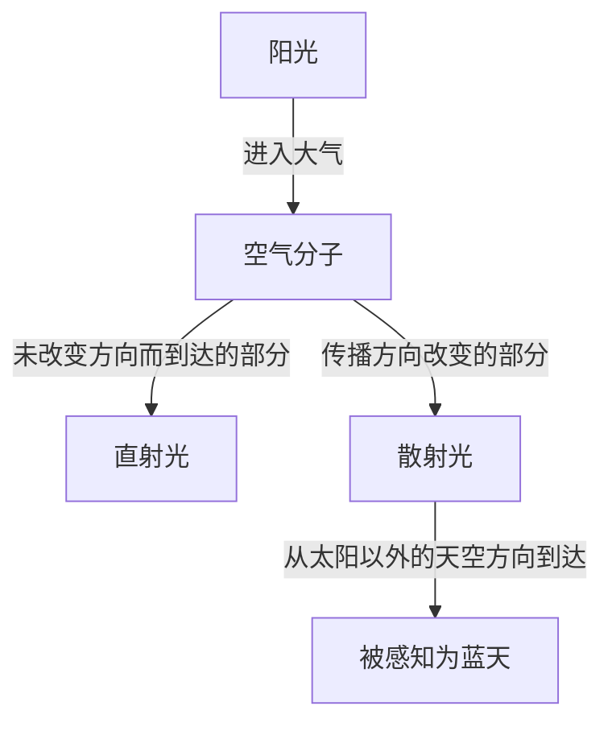
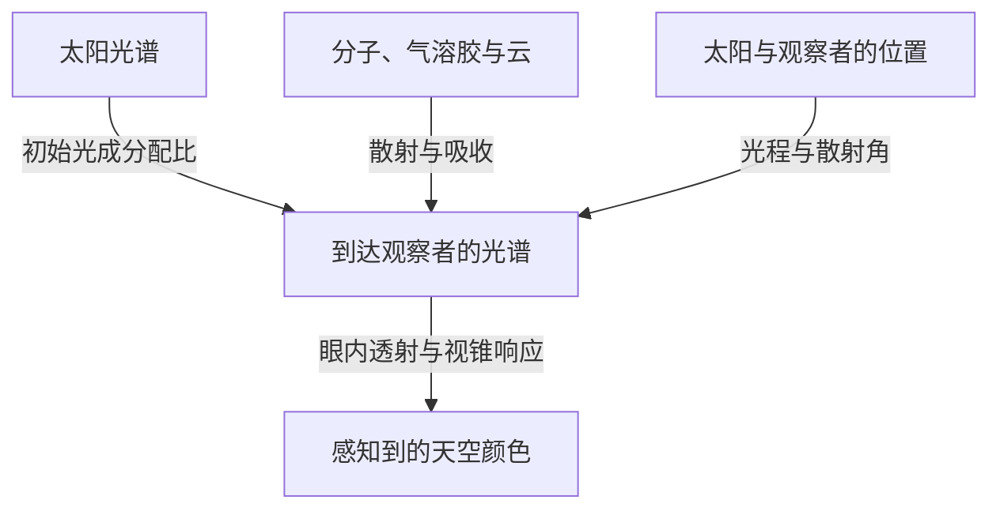

晴天抬头望去，头顶是一片深蓝，越接近远处地平线，颜色就越发浅白。然而太阳西斜时，同一片天空会变成黄色和橙色；太阳落下后，又会出现另一种深邃的蓝。

把空气装进一个透明的小容器，并看不到蓝色颜料那样的颜色。那么，覆盖天空的蓝色究竟从何而来？

简短的答案是：阳光被空气分子散射，短波长的光更容易转向并进入我们的眼睛。不过，这句话里还藏着许多问题。什么是散射？波长为什么会造成差异？紫光的波长比蓝光还短，天空为什么不是紫色？同样的机制又如何产生红色晚霞？

逐一思考这些问题，就会发现天空的颜色并非大气独有的属性。作为光源的太阳、改变光传播方向的大气，以及感知颜色的眼睛，三者共同创造了这一现象。

## 1. 首先区分来自太阳的光与来自天空的光

白天的户外，既有从太阳方向几乎直线到达的光，也有来自太阳以外天空方向的光。前者是直射光，后者是天空散射光。地面和建筑还会反射光，但我们先把这两类分清。

想象自己背对太阳，注视天空中的某个区域。视线前方没有太阳，却仍然有光从那个方向进入眼睛。这是因为一部分阳光在途中的大气里改变了方向，朝我们传播而来。

眼睛根据入射光最后的传播方向，判断那个方向是明亮的。天空中并不存在一堵蓝墙。沿视线分布的大范围空气都在向我们送来光，我们把这些贡献叠加后的结果，看成了一整片明亮的天空。

假如只移除地球大气，保持太阳和地面的条件不变，那么被太阳照亮的地方依然明亮，但避开太阳以及地表反射物的方向，天空就会黑暗。月球白昼照片中，明亮地面上方的黑色天空，能帮助我们理解这种区别。

关键在于：散射并不是创造新的光，而是重新分配光的去向。对朝向太阳的视线而言被移走的光，对看向另一方向的人而言，却可以成为照亮天空的光。

图中把路径分开表示，但现实中有数量极其庞大的分子同时参与。并不是某一个分子让整片天空变蓝，也不是每一次散射后的光都一定到达观察者。

## 2. 白色阳光包含许多不同波长

光是电磁波。电场和磁场的变化在空间中传播，具有波的性质。相邻两个波峰之间的距离就是波长，通常用希腊字母 $\lambda$ 表示。

人眼可见的范围受眼睛状态和判定“可见”的标准影响，大致在380～780纳米附近。1纳米是十亿分之一米。可见光波长比头发丝的粗细小得多。

在这一范围内，短波长一侧通常被感知为紫色和蓝色，长波长一侧则是橙色和红色。不过，自然界并没有为颜色名称与波长之间画出明确的分界线。颜色的划分，也包含了人类对连续光分布所作的分类。

阳光并不是单一波长。它包含从紫到红、乃至不可见的紫外线和红外线在内的宽广波段。可见光的各种成分进入眼睛，视觉又会适应周围的亮度，因此我们通常把日光当作近似白色的照明。

棱镜利用不同波长传播方式的差异，把混合光分开。蓝天却不是棱镜把一道巨大彩虹投射到了空中，而是因为不同波长在大气中改变方向的比例不同，远离太阳方向的光就改变了成分配比。

如果混淆这一点，就容易说成“阳光被转化成了蓝光”。在通常的瑞利散射中，光的波长基本保持不变。原本就存在于白光中的蓝色成分，更容易绕向其他方向。

## 3. 透明分子如何散射光

### 分子是一面小镜子吗

大气的主要成分是氮和氧。按干燥空气的体积比例计算，氮约占78%，氧约占21%，其余包括氩等气体。水蒸气含量随地点和天气变化，所以这些比例指的是排除水蒸气后的空气。

氮分子和氧分子远小于可见光波长。因此，把分子画成普通镜子，认为光线在它表面反弹，并不足以解释波长带来的强烈差异。

更接近物理的图景是：光的电场对分子中的电子和原子核施加作用力，使负电荷与正电荷的分布发生极微小的相对位移，产生电性上的偏移。这称为极化。

电场随时间振荡，这种电荷偏移也随之振荡。振荡的电偶极子会向周围辐射电磁波。作为分子响应而产生的波，与入射波叠加，使前方以外的方向也出现光。这就是理解散射的基本图像。

这里说“分子辐射光”，并不意味着它像荧光那样，先吸收并储存光的能量，过一段时间再发出另一种颜色的光。我们考虑的是分子对入射电磁波的近似弹性响应。严格讨论需要量子力学，但蓝天基本的波长依赖性，用这幅经典电磁学图景也能很好地理解。

### 身边的空气透明，天空为什么却很明亮

会散射光，并不等于不透明。在房间一端到另一端的几米距离内，分子对可见光的散射很弱，绝大多数光能穿过去，所以我们能透过空气清楚地看到对面的墙。

看天空时，光程却不止几米。尽管空气密度随高度降低，光仍要穿过厚厚的大气层。单个分子的作用很小，但极其庞大的数量与漫长路径相结合，就能产生可见的散射光。

不是分子的尺寸本身带有蓝色，也不是透明空气突然变成蓝色物质。短距离内容易忽略的微弱相互作用，在长光程里就不可忽略。这种微小效应的积累，是蓝天的重要特点。

## 4. 波长四次方定律意味着什么

在一定条件下，由分子等远小于波长的散射体引起的散射，称为瑞利散射。对于可见光范围内的空气，粗略描述波长的影响时，散射截面 $\sigma$ 满足：

$$
\sigma(\lambda) \propto \frac{1}{\lambda^4}
$$

散射截面用面积单位表示发生散射的容易程度。它并不是分子几何轮廓的实际面积，而是把光与分子相互作用的强弱概括成一个数值。

利用这个关系比较450纳米的蓝光与650纳米的红光，散射截面之比约为：

$$
\frac{\sigma(450\,\mathrm{nm})}{\sigma(650\,\mathrm{nm})}
\approx \left(\frac{650}{450}\right)^4
\approx 4.35
$$

如果两种成分以相同强度入射，蓝光被散射的容易程度约是红光的4.35倍。差异远大于波长比本身。

但这不意味着“天空的蓝色是红色的4.35倍”。因为这里还没有计入太阳各波长的强度、散射前后的衰减、观察方向和人眼灵敏度。散射截面之比，与最终感知的颜色，是不同的量。

### 为什么是四次方，而不是平方

在简单的电磁学模型里，如果某个波段内可以把分子的可极化性看作近似不变，那么诱导电偶极子的振幅就与入射电场成正比。另一方面，这个偶极子向远处辐射的电场振幅中，含有角频率 $\omega$ 的平方。

光强与电场振幅的平方成正比，因此辐射强度中出现 $\omega^4$。在真空中，$\omega$ 与波长的倒数成正比，于是得到 $1/\lambda^4$。

这不是“波长越短，越容易撞上细小缝隙”的几何解释，而是振荡电荷辐射电磁波的性质所产生的波动规律。

当然，不能把这一近似推广到所有波长。接近分子的共振频率时，极化响应会改变，吸收也会变得重要。如果散射体相对波长已经很大，就不再满足瑞利近似的条件。四次方定律很有用，但有自己的适用范围。

## 5. 天空为什么仍然不是紫色

只看四次方定律，波长比蓝光更短的紫光，应该散射得更强。这是一个合理的问题。事实上，散射光中确实既有蓝色成分，也有紫色成分。

但人类感知颜色，并不是从所有波长中挑出“最容易被散射”的那一个。进入眼睛的是宽广波段的混合光，视觉系统接收的是整套配比。

首先，太阳光谱并非在所有波长上强度都相同。其上还叠加了大气对各波长的透射与散射。之后，还要考虑光进入眼内的透射特性，以及视网膜感光细胞的灵敏度。

明亮环境中的色觉主要依赖三类视锥细胞：相对更敏感于短、中、长波长的S、M、L视锥。但它们不是只检测蓝、绿、红光的专用开关。各自的敏感范围很宽，而且彼此重叠。

大脑比较这些视锥的响应，构建颜色。即使短波长在天空光中占优，在通常晴朗的白昼，这些混合光引起的视锥刺激组合，仍会被感知为蓝色或略偏蓝紫的蓝色。人眼对可见光紫端的灵敏度较低，也是不可缺少的一环。[NASA的电磁波讲解](https://science.nasa.gov/ems/03_behaviors/)同样区分了散射与视觉灵敏度。

因此，“紫光全部被大气吸收了”并不是充分的解释。可见紫光也能到达地面。而且紫外线不是可见紫光，不能直接用臭氧吸收紫外线，替代天空不呈紫色的原因。

同样，断言“天空其实是紫色，只是眼睛看错了”也不恰当。光谱是物理量，颜色体验则由视觉建立，它们描述的是不同层次。色觉并没有失灵，而是在按照平时的规则解读混合光。

## 6. 蓝天也会向我们送来红光

用分光仪观察蓝天，并不会只看到一条蓝色谱线。天空光也包含红色和绿色对应的波长，只是短波长相对突出，所以整体看起来是蓝色。

这也是天空光与蓝色LED或蓝色激光的重要区别。集中在狭窄波段的光，与带有某种偏向的宽光谱混合光，即使外观颜色相近，也不是相同的光谱。

这也解释了准确再现天空颜色的困难。电脑屏幕通常通过红、绿、蓝发光成分组合颜色。只要引起人眼相近的视锥响应，即便光谱不同于实际天空光，也能呈现很相似的颜色。

反过来，照片中天空的颜色会受感光元件的响应、白平衡、曝光、图像处理以及观看屏幕影响。不能因为照片里的蓝色浓，就直接认定当时空气分子的散射更强。

不要把波长与颜色过度地一一对应。理解这一点，就不仅能整理紫色的疑问，也能用同一视角理解照片颜色和显示器的原理。

## 7. 晚霞变红，是因为观察的光路改变了

白昼蓝天与晚霞并不是原理不同、毫不相关的现象。它们都与不同波长的光散射程度不同有关，只是关注的光路发生了变化。

太阳较高时，光到达地面的路径相对短。太阳接近地平线时，光会倾斜穿过更长的大气。在途中，短波长更容易从直射光中被移走，因此来自太阳方向的光里，红色和橙色成分相对保留得更多。

“蓝光容易散射”这一事实，一方面让远离太阳的天空显蓝，另一方面又让穿过漫长大气的直射光变红。[NASA Space Place的说明](https://spaceplace.nasa.gov/blue-sky/en/)用图示解释了光程长度的变化。

不过，并不是所有红色晚空都能只用直接进入眼睛的阳光解释。已经变红的光，还会继续被分子或粒子散射，或被云反射、散射，从而到达太阳以外的方向。傍晚的云变成朱红色，是因为照亮云的光已经变了颜色。

### 大气厚度要按路径理解

在简单的平面大气模型中，若太阳天顶角为 $z$，相对于垂直路径的光程倍数大致是：

$$
m \approx \frac{1}{\cos z}
$$

例如 $z=60^\circ$ 时，估计为两倍。但这个公式在地平线附近会失效。$z$ 接近90度时公式趋于无穷大，实际穿越大气的距离却不会无穷大。此时需要考虑地球曲率、密度随高度下降、折射等因素。

解释晚霞的示意图常把大气画成密度恒定的厚壳，那只是为了表达方向差异。真实大气既没有突然终止的坚硬顶盖，也不是处处密度相同的层。

## 8. 用光学厚度把天空颜色写成可计算的问题

即使实际距离相同，空气密度或粒子数量不同，光被散射、吸收的程度也会不同。为此引入光学厚度，也叫光学深度，记作 $\tau$。

只考虑分子散射的简单情况下，沿光路的分子数密度为 $n(s)$，则有：

$$
\tau_{\mathrm{R}}(\lambda)=\int n(s)\,\sigma(\lambda)\,ds
$$

这里 $s$ 是沿光路的距离。将数密度与散射截面相乘，再沿路径累加。检查单位可见，“每立方米”的数密度、“平方米”的截面与“米”的距离相互抵消，所以 $\tau$ 是无量纲量。

若将吸收和气溶胶散射也包括在消光光学厚度 $\tau_{\mathrm{ext}}$ 中，未被散射而保留下来的直射光，在简单模型中按下式衰减：

$$
I_{\mathrm{direct}}(\lambda)=I_0(\lambda)\exp[-\tau_{\mathrm{ext}}(\lambda)]
$$

这意味着光程每增加一小段，就有剩余光的某个比例被移走，而不是在多数光已经散射后，仍每次扣除相同的绝对量。因此得到的是指数衰减，而非线性衰减。

也要注意，仅凭这个公式不能算出蓝天亮度。它追踪的是从直射光中离开的部分，新散射进入视线的部分还需要另外加上。

要计算某方向的天空光，需要对沿途每一点，把到达该处的阳光强度、向观察者方向散射的概率，以及之后存留到观察者处的比例相乘，再沿视线积分。蓝天不是光路上某一点的颜色，而是漫长路径上各种贡献的总和。

## 9. 为什么不同方向的天空蓝色不同

比较头顶的蓝色与地平线附近的淡蓝，就会发现同一天的天空也不均匀。这既是因为视线方向改变了穿过的大气量，也因为近地面气溶胶与多次散射的影响随之改变。

看向地平线时，视线会长距离穿过低空大气。那里不仅有分子，还有微粒和小水滴，把许多不同波长的光加入视线。原本的蓝色混入更多偏白的散射光后，饱和度就会降低。

而且，天空散射光从产生处到眼睛的途中，也可能再次散射或被吸收。只沿着“大气越多，蓝光越多”的单向思路，解释最终会遇到困难。必须同时处理增加视线内光量与移走这些光的作用。

山顶有时看起来天空更深蓝，也不是海拔与蓝色之间存在简单比例关系。头顶大气减少、远离低层霾雾、与周围亮度的对比等因素都会叠加。受湿度和大气状况影响，山上的天空也可能发白。

因此，不能断言“干燥的日子一定深蓝”或“雨后一定清澈”。水蒸气本身不是可见的雾，却可能通过粒子吸湿以及云雾形成影响外观。仅凭一张天空照片，很难唯一确定湿度或污染程度。

## 10. 白云为什么不会变成蓝色

云也散射阳光，却主要呈白色，原因在于承担散射的物体尺寸与空气分子相差极大。

云中的液态水滴通常具有微米量级或更大的尺寸，其中很多比可见光波长大。还有由冰晶组成的云。在这个范围，不能直接套用分子的四次方定律。

处理球形粒子散射的代表理论是米氏理论。粒径与波长之比、折射率等决定光向各方向散射多少。实际云中存在大量尺寸不同的粒子，所以整个可见波段的光都会被比较广泛地散射，日光照耀下的云因而显白。

白色并不意味着所有波长的散射比例完全相同。单个水滴具有复杂的波长与角度依赖性，但不同尺寸、不同路径的光叠加后，到眼睛的光就不像蓝天那样强烈偏向短波长。

那么，雨云底部为什么是暗灰色？发育厚大的云内部，光多次散射，返回上方或侧方的部分也增加。能到达云底的光变少，从地面看就变暗。这并不是水滴变成了灰色物质。

云边明亮、云底暗淡的差别，同样可以从光穿过云内外的路径理解。把白云与灰云简单对应为“干净水”和“脏水”，是错误的。

## 11. 霾、烟和沙尘会以同样方式改变天空吗

大气中悬浮的微小固体颗粒或液滴，统称气溶胶，包括海盐、土壤尘埃、烟产生的颗粒等，需要与气体分子区分。

气溶胶的光学性质随粒径分布、形状和成分而变化。有些擅长散射，有些如烟炱则具有重要的吸收作用。因此，天空发白与天空发褐，不能都解释成“蓝光增加了”。

比气体分子大的粒子，向前方、也就是接近原传播方向的强散射，可能格外重要。太阳周围大范围发白发亮，与这种方向依赖性有关。不过，观察太阳附近即使不用仪器也有危险，不能直视太阳来验证。

晚霞也并非“空气越脏，就越红越美”。适量粒子在某些条件下可能增强颜色，但浓烟或大量尘埃如果强烈衰减光线，夕景就会暗淡。云层高度、太阳高度和粒子分布都会改变结果。

天空颜色是多种原因共同作用的结果，反过来只根据颜色确定原因，信息是不够的。科学观测会结合多个波长、偏振和观察方向，估计粒子的数量与性质。日常的蓝天问题，也由此通向大气遥感。

## 12. 天空光还有一个特征：偏振

除了波长和强度，光还具有电场沿什么方向振荡的性质。振荡方向存在偏向，称为偏振。晴空光会随观察方向呈现不同程度的部分偏振。

在理想化的瑞利散射中，非偏振入射光发生一次散射时，强度对散射角 $\theta$ 的依赖近似为：

$$
I(\theta)\propto 1+\cos^2\theta
$$

这里的散射角，是原传播方向与散射后方向之间的夹角。即使在90度的侧向，强度也不为零。公式同样表明，空气分子可以把太阳来的光送向侧面。

在同一理想模型中，线偏振度为：

$$
P(\theta)=\frac{\sin^2\theta}{1+\cos^2\theta}
$$

这一近似在90度时达到最大值。实际天空还受分子特性、多次散射、气溶胶和地面反射影响，不会完全按照公式形成理想的完全偏振。

通过偏振滤镜观察远离太阳的蓝天并转动滤镜，有时会发现天空亮度改变。这也是摄影偏振镜能够改变天空蓝色深浅的原因之一。[佐治亚州立大学HyperPhysics的说明](https://hyperphysics.phy-astr.gsu.edu/hbase/phyopt/skypol.html)展示了天空方向与偏振的关系。

广角镜头会把许多不同散射角纳入画面，偏振镜造成的变暗程度便可能随位置变化，出现不自然的浓淡。这种照片特点不一定是滤镜缺陷，而是在呈现天空的偏振分布。

## 13. 太阳落下后，天空为什么还会蓝

日落并不意味着阳光在那一刻停止照射地球全部大气。即使地面观察者已经看不到太阳，高空仍有一些区域受到阳光照射。那里散射的光到达地面，所以天不会立即全黑。

此外，已经散射过的光还可能在别处再次散射，这就是多次散射。解释白天的基本现象时，可以先考虑一次散射，但暮光的光路更长、更复杂，仅靠这个近似就不够了。

这时臭氧的作用有时也不能忽略。臭氧以吸收紫外线著称，但在可见光范围也有宽广的沙普伊吸收带。光程很长时，这种选择性吸收会影响暮色。

因此，所谓蓝调时刻的深蓝，很难只用与白天完全相同的一次瑞利散射解释到底。需要把球形大气、阴影区域、臭氧、气溶胶和多次散射综合起来。[NASA的一份技术报告](https://ntrs.nasa.gov/citations/19730020661)计算了臭氧和气溶胶对暮光颜色的贡献。

“白昼蓝天的主因是分子散射”和“暮光的颜色也受吸收影响”并不矛盾。不同时间、方向和大气条件下，各种过程的重要性会改变。

## 14. 蓝色海洋、青山与太空中的蓝色地球

### 海洋反射无法单独解释蓝天

有一种说法认为，天空是映出了海的颜色才变蓝。但远离海洋的内陆也有蓝天。即使没有海洋，只要有合适的大气与光源，分子散射仍然能产生蓝天。

另一方面，海面确实反射天空光，影响海洋的外观。但海水的蓝色也不能全用镜面反射解释。水在长光程中选择性吸收红光，配合水中的散射，使蓝光返回。近岸海域还受海底、悬浮物和浮游植物等影响。[NOAA关于海洋颜色的说明](https://oceanservice.noaa.gov/facts/oceanblue.html)介绍了水对红光的吸收。

天空与海洋会相互影响外观，却不是因为同一个原因而变蓝。遇到相似颜色时，不要自动套用同一种机制。

### 远山泛蓝，是因为山与眼睛之间也有大气

远山泛蓝、轮廓变淡时，一方面来自山的光在大气中减弱，另一方面途中的空气把散射光加入视线。这种附加的光有时称为大气光。

不是山被涂上了蓝色颜料，而是山与观察者之间的大气贡献叠加到了景物上。绘画中把远处物体画得更淡、更蓝的空气透视法，正是在利用这种日常光学现象。不过，浓霾或傍晚照明下，加入的光也会改变颜色。

从太空看到的蓝色地球，结合了海面与水中的光、大气散射和云等贡献。地面抬头看到的蓝天，与观察整个星球时的蓝色，视点和光路都不同。“地球是蓝色的”这句话，也包含了多种光学现象。

## 15. 火星的晚霞是蓝色，是否说明四次方定律错了

火星探测器拍摄的夕景中，太阳附近有时会出现蓝色。它与地球的红色晚霞仿佛相反，可能让人觉得瑞利散射的解释被推翻了。

然而，火星天空的颜色受到大气细尘的强烈影响，并不符合只有分子占主导的简单瑞利散射模型条件。粒子的大小与性质会改变不同波长散射的方向分布。

火星傍晚，光穿过尘埃后形成的分布，可能让太阳附近一小片区域的蓝色成分特别明显。这不意味着火星整片天空随时都像地球晴天那样蓝。[NASA公布的毅力号夕景](https://science.nasa.gov/resource/mastcam-zs-first-martian-sunset/)就是这种蓝色光的实例。

自然规律并不会随地点任意变化。改变的是大气成分、粒子种类、光程和观察方向。即使用同一套电磁学，输入条件不同，得到的天空颜色也会不同。

把这种思考进一步延伸，还能想象围绕其他恒星运行的行星天空。光源光谱不同、大气与云不同，蓝天就不再是理所当然。我们熟悉的地球颜色，是普遍规律在地球特定条件下的一种表现。

## 16. 在家验证时，应该观察什么

### 水中加少量牛奶的实验

在透明容器里加水，每次加入极少量牛奶，从侧面用白色LED灯照射。把房间稍微调暗，比较从侧面看光路，以及让透过容器的光照到白纸上的两种情况。

在合适浓度与光程下，有时能看见侧面散射光与透射光颜色不同。如果粒子太多，整体会变得乳白浑浊，几乎不再透光。光源类型和容器形状也影响结果。

实验的价值，在于分别观察向侧面散射的光与直穿过去的光。但牛奶粒子远大于氮、氧分子，尺寸也有分布，不能把它当作大气瑞利散射的严格复现，或四次方定律的测量。

即使是白灯，也不一定均匀连续地包含所有可见波长。手机灯等LED的发光光谱，会反映在实验外观中。不要因为“没有看见蓝色”就判定散射解释错误，而应考虑模型与真实大气的条件差异。

### 用偏振镜比较天空

使用摄影偏振镜或偏光太阳镜，转动时有时会看到远离太阳的天空亮度发生变化。再比较云和地平线附近，就会发现天空光的性质并不均匀。

此时不要看太阳。太阳镜和普通偏振镜都不是安全的太阳观测滤镜，也要避免通过双筒望远镜、望远镜或相机光学取景器直视太阳。观察对象应是与太阳充分远离的安全方向的天空。

拍照记录时，固定构图、曝光与白平衡会更方便比较。自动校正可能把实际变暗的天空补亮，掩盖变化。

### 不只记录颜色，也记录条件

早晨、中午和傍晚观察时，同时记下太阳大致高度、观察方向、云量以及地平线的雾霾。与其只用一个词描述蓝色，不如分别写下“头顶深蓝，远处发白”“只有云底暗”，这样更容易与物理机制对应。

不必凭一次观察就断定大气状态。改变条件进行比较，保留与预期不符的现象，区分相机处理与眼睛印象，这种态度本身就是科学观察的基础。

## 17. 再进一步：透明玻璃与空气有什么不同

读到这里，还会出现一个问题。玻璃也有电子和原子核，应该也会响应光而极化。那么透明玻璃为什么不会像天空那样强烈地向侧面散射光？

思考这一点时，把许多微小响应相加，不能忘记波的相位。光是波，电场振幅可以相长，也可以相消。把许多原子的响应当作彼此独立的光亮度直接相加，并不总是正确。

在理想均匀介质中，将空间上平滑分布的极化所产生的波叠加，会形成向前传播的波。这种集体响应与折射率和光的传播方式有关。另一方面，非前向散射则与密度或折射率的空间涨落、杂质和缺陷等密切相关。

气体分子不断运动，局部的分子数密度存在统计涨落。稀薄气体中的分子散射描述，与连续介质中的密度涨落散射描述，并非毫不相关的两种现象，而是从不同尺度出发、彼此联系的描述。

实际玻璃也有微弱散射、吸收和表面反射，不等同于完全均匀、无损的理想介质。但要修正“只要有原子，侧向散射就按数量简单增加”的想法，波的叠加这一视角非常有帮助。

日常解释从单个分子的响应出发，更精确的讨论则走向分子间的位置关系与干涉。理解这些层次，能让蓝天的解释从“颗粒碰撞的故事”深入到电磁波物理。

## 18. 蓝天的解释可以用到哪里

“天空因瑞利散射而蓝”是理解地球晴朗白昼天空的有效起点，但并不承诺用一个公式就能预测所有天空颜色。

在足够薄的大气里，以一次散射为主的近似可以解释基本的波长依赖性和偏振。面对长光程、地平线附近、厚云、暮光、浓烟或沙尘时，则需要更多物理过程。光会通过散射进入视线，也会离开视线，还会被吸收或被地面反射。

按波长和方向追踪这些进出，就是辐射传输的思路。精确计算天空颜色，需要结合大气垂直分布、太阳位置、粒子光学性质、地表反射以及视觉响应。并不是因为简单解释错误就将其丢弃，而是明确它省略了哪些效应，再在适用条件下使用。

抬头望蓝天时，我们并没有逐个看到分子。但分子与光的相互作用、包围地球的大气结构、波的干涉以及人类感觉的活动，都作为同一片风景呈现在眼前。

天空是蓝色这一平常事实，并不证明世界简单，而是说明不同尺度的现象，连接得如此自然，以至于我们平时不会留意。如果明天的天空比今天略有不同，那份差异就可以成为新的线索，让我们思考光曾走过怎样的路径。

## 参考资料

- [NASA Space Place：Why Is the Sky Blue?](https://spaceplace.nasa.gov/blue-sky/en/) — 从光的波长和大气路径解释蓝天与晚霞的入门资料。
- [NASA Science：Wave Behaviors](https://science.nasa.gov/ems/03_behaviors/) — 介绍散射、折射、波长与人类视觉灵敏度。
- [Georgia State University, HyperPhysics：Skylight Polarization](https://hyperphysics.phy-astr.gsu.edu/hbase/phyopt/skypol.html) — 散射天空光的偏振与观察方向之间的关系。
- [NASA NTRS：The influence of ozone and aerosols on the brightness and color of the twilight zone](https://ntrs.nasa.gov/citations/19730020661) — 讨论暮光颜色计算中臭氧与气溶胶作用的技术报告。
- [NOAA Ocean Service：Why is the ocean blue?](https://oceanservice.noaa.gov/facts/oceanblue.html) — 从水对光的选择性吸收解释海洋的蓝色。
- [NASA Science：Mastcam-Z's First Martian Sunset](https://science.nasa.gov/resource/mastcam-zs-first-martian-sunset/) — 火星夕景，以及尘埃导致的蓝色光外观。
