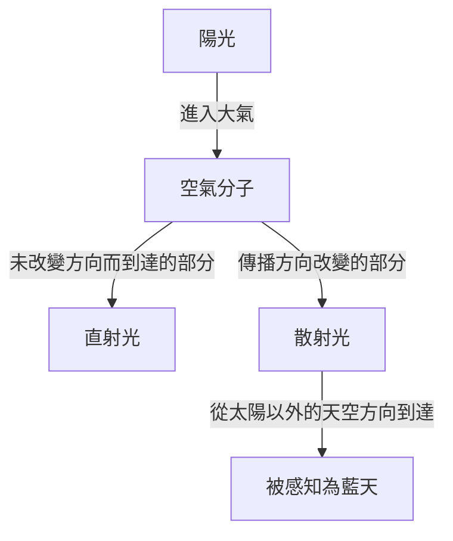
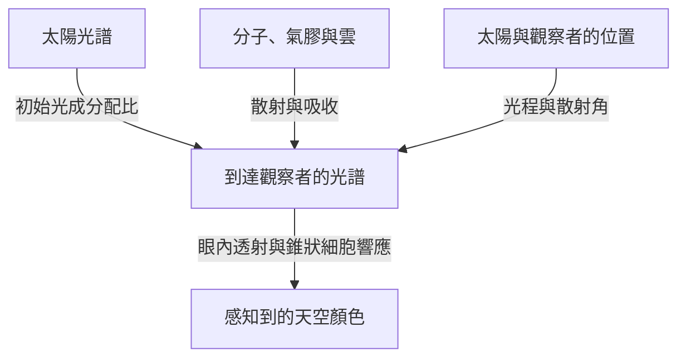

晴天抬頭望去，頭頂是一片深藍，越接近遠方地平線，顏色就越發淺白。然而太陽西斜時，同一片天空會變成黃色和橙色；太陽落下後，又會出現另一種深邃的藍。

把空氣裝進一個透明的小容器，並看不到藍色顏料那樣的顏色。那麼，覆蓋天空的藍色究竟從何而來？

簡短的答案是：陽光被空氣分子散射，短波長的光更容易轉向並進入我們的眼睛。不過，這句話裡還藏著許多問題。什麼是散射？波長為什麼會造成差異？紫光的波長比藍光還短，天空為什麼不是紫色？同樣的機制又如何產生紅色晚霞？

逐一思考這些問題，就會發現天空的顏色並非大氣獨有的屬性。作為光源的太陽、改變光傳播方向的大氣，以及感知顏色的眼睛，三者共同創造了這個現象。

## 1. 首先區分來自太陽的光與來自天空的光

白天的戶外，既有從太陽方向幾乎直線到達的光，也有來自太陽以外天空方向的光。前者是直射光，後者是天空散射光。地面和建築物還會反射光，但我們先把這兩類分清楚。

想像自己背對太陽，注視天空中的某個區域。視線前方沒有太陽，卻仍然有光從那個方向進入眼睛。這是因為一部分陽光在途中的大氣裡改變了方向，朝我們傳播而來。

眼睛根據入射光最後的傳播方向，判斷那個方向是明亮的。天空中並不存在一堵藍牆。沿視線分布的大範圍空氣都在向我們送來光，我們把這些貢獻疊加後的結果，看成一整片明亮的天空。

假如只移除地球大氣，保持太陽和地面的條件不變，那麼被太陽照亮的地方依然明亮，但避開太陽及地表反射物的方向，天空就會黑暗。月球白晝照片中，明亮地面上方的黑色天空，能幫助我們理解這種差別。

關鍵在於：散射並不是創造新的光，而是重新分配光的去向。對朝向太陽的視線而言被移走的光，對看向另一方向的人而言，卻可以成為照亮天空的光。

圖中把路徑分開表示，但現實中有數量極其龐大的分子同時參與。並不是某一個分子讓整片天空變藍，也不是每一次散射後的光都一定到達觀察者。

## 2. 白色陽光包含許多不同波長

光是電磁波。電場和磁場的變化在空間中傳播，具有波的性質。相鄰兩個波峰之間的距離就是波長，通常用希臘字母 $\lambda$ 表示。

人眼可見的範圍受眼睛狀態和判定「可見」的標準影響，大致在380～780奈米附近。1奈米是十億分之一公尺。可見光波長比頭髮絲的粗細小得多。

在這個範圍內，短波長一側通常被感知為紫色和藍色，長波長一側則是橙色和紅色。不過，自然界並沒有為顏色名稱與波長之間畫出明確的分界線。顏色的劃分，也包含人類對連續光分布所作的分類。

陽光並不是單一波長。它包含從紫到紅、乃至不可見的紫外線和紅外線在內的寬廣波段。可見光的各種成分進入眼睛，視覺又會適應周圍的亮度，因此我們通常把日光當作近似白色的照明。

稜鏡利用不同波長傳播方式的差異，把混合光分開。藍天卻不是稜鏡把一道巨大彩虹投射到了空中，而是因為不同波長在大氣中改變方向的比例不同，遠離太陽方向的光就改變了成分配比。

如果混淆這一點，就容易說成「陽光被轉化成了藍光」。在通常的瑞利散射中，光的波長基本保持不變。原本就存在於白光中的藍色成分，更容易繞向其他方向。

## 3. 透明分子如何散射光

### 分子是一面小鏡子嗎

大氣的主要成分是氮和氧。按乾燥空氣的體積比例計算，氮約占78%，氧約占21%，其餘包括氬等氣體。水蒸氣含量隨地點和天氣變化，所以這些比例指的是排除水蒸氣後的空氣。

氮分子和氧分子遠小於可見光波長。因此，把分子畫成普通鏡子，認為光線在它表面反彈，並不足以解釋波長帶來的強烈差異。

更接近物理的圖像是：光的電場對分子中的電子和原子核施加作用力，使負電荷與正電荷的分布發生極微小的相對位移，產生電性上的偏移。這稱為極化。

電場隨時間振盪，這種電荷偏移也隨之振盪。振盪的電偶極子會向周圍輻射電磁波。作為分子響應而產生的波，與入射波疊加，使前方以外的方向也出現光。這就是理解散射的基本圖像。

這裡說「分子輻射光」，並不意味著它像螢光那樣，先吸收並儲存光的能量，過一段時間再發出另一種顏色的光。我們考慮的是分子對入射電磁波的近似彈性響應。嚴格討論需要量子力學，但藍天基本的波長相依性，用這幅古典電磁學圖像也能很好地理解。

### 身邊的空氣透明，天空為什麼卻很明亮

會散射光，並不等於不透明。在房間一端到另一端的幾公尺距離內，分子對可見光的散射很弱，絕大多數光能穿過去，所以我們能透過空氣清楚地看到對面的牆。

看天空時，光程卻不只幾公尺。儘管空氣密度隨高度降低，光仍要穿過厚厚的大氣層。單一分子的作用很小，但極其龐大的數量與漫長路徑相結合，就能產生可見的散射光。

不是分子的尺寸本身帶有藍色，也不是透明空氣突然變成藍色物質。短距離內容易忽略的微弱交互作用，在長光程裡就不可忽略。這種微小效應的累積，是藍天的重要特點。

## 4. 波長四次方定律意味著什麼

在一定條件下，由分子等遠小於波長的散射體引起的散射，稱為瑞利散射。對於可見光範圍內的空氣，粗略描述波長的影響時，散射截面 $\sigma$ 滿足：

$$
\sigma(\lambda) \propto \frac{1}{\lambda^4}
$$

散射截面用面積單位表示發生散射的容易程度。它並不是分子幾何輪廓的實際面積，而是把光與分子交互作用的強弱概括成一個數值。

利用這個關係比較450奈米的藍光與650奈米的紅光，散射截面之比約為：

$$
\frac{\sigma(450\,\mathrm{nm})}{\sigma(650\,\mathrm{nm})}
\approx \left(\frac{650}{450}\right)^4
\approx 4.35
$$

如果兩種成分以相同強度入射，藍光被散射的容易程度約是紅光的4.35倍。差異遠大於波長比本身。

但這不意味著「天空的藍色是紅色的4.35倍」。因為這裡還沒有計入太陽各波長的強度、散射前後的衰減、觀察方向和人眼靈敏度。散射截面之比，與最終感知的顏色，是不同的量。

### 為什麼是四次方，而不是平方

在簡單的電磁學模型裡，如果某個波段內可以把分子的可極化性看作近似不變，那麼誘導電偶極子的振幅就與入射電場成正比。另一方面，這個偶極子向遠處輻射的電場振幅中，含有角頻率 $\omega$ 的平方。

光強與電場振幅的平方成正比，因此輻射強度中出現 $\omega^4$。在真空中，$\omega$ 與波長的倒數成正比，於是得到 $1/\lambda^4$。

這不是「波長越短，越容易撞上細小縫隙」的幾何解釋，而是振盪電荷輻射電磁波的性質所產生的波動規律。

當然，不能把這個近似推廣到所有波長。接近分子的共振頻率時，極化響應會改變，吸收也會變得重要。如果散射體相對波長已經很大，就不再滿足瑞利近似的條件。四次方定律很有用，但有自己的適用範圍。

## 5. 天空為什麼仍然不是紫色

只看四次方定律，波長比藍光更短的紫光，應該散射得更強。這是一個合理的問題。事實上，散射光中確實既有藍色成分，也有紫色成分。

但人類感知顏色，並不是從所有波長中挑出「最容易被散射」的那一個。進入眼睛的是寬廣波段的混合光，視覺系統接收的是整套配比。

首先，太陽光譜並非在所有波長上強度都相同。其上還疊加了大氣對各波長的透射與散射。之後，還要考慮光進入眼內的透射特性，以及視網膜感光細胞的靈敏度。

明亮環境中的色覺主要依賴三類錐狀細胞：相對更敏感於短、中、長波長的S、M、L錐狀細胞。但它們不是只偵測藍、綠、紅光的專用開關。各自的敏感範圍很寬，而且彼此重疊。

大腦比較這些錐狀細胞的響應，建構顏色。即使短波長在天空光中占優勢，在通常晴朗的白晝，這些混合光引起的錐狀細胞刺激組合，仍會被感知為藍色或略偏藍紫的藍色。人眼對可見光紫端的靈敏度較低，也是不可缺少的一環。[NASA的電磁波解說](https://science.nasa.gov/ems/03_behaviors/)同樣區分了散射與視覺靈敏度。

因此，「紫光全部被大氣吸收了」並不是充分的解釋。可見紫光也能到達地面。而且紫外線不是可見紫光，不能直接用臭氧吸收紫外線，替代天空不呈紫色的原因。

同樣，斷言「天空其實是紫色，只是眼睛看錯了」也不恰當。光譜是物理量，顏色體驗則由視覺建立，它們描述的是不同層次。色覺並沒有失靈，而是在按照平時的規則解讀混合光。

## 6. 藍天也會向我們送來紅光

用分光儀觀察藍天，並不會只看到一條藍色譜線。天空光也包含紅色和綠色對應的波長，只是短波長相對突出，所以整體看起來是藍色。

這也是天空光與藍色LED或藍色雷射的重要區別。集中在狹窄波段的光，與帶有某種偏向的寬光譜混合光，即使外觀顏色相近，也不是相同的光譜。

這也解釋了準確再現天空顏色的困難。電腦螢幕通常透過紅、綠、藍發光成分組合顏色。只要引起人眼相近的錐狀細胞響應，即使光譜不同於實際天空光，也能呈現很相似的顏色。

反過來，照片中天空的顏色會受感光元件的響應、白平衡、曝光、影像處理以及觀看螢幕影響。不能因為照片裡的藍色濃，就直接認定當時空氣分子的散射更強。

不要把波長與顏色過度地一一對應。理解這一點，就不只能整理紫色的疑問，也能用同一視角理解照片顏色和顯示器的原理。

## 7. 晚霞變紅，是因為觀察的光路改變了

白晝藍天與晚霞並不是原理不同、毫不相關的現象。它們都與不同波長的光散射程度不同有關，只是關注的光路發生了變化。

太陽較高時，光到達地面的路徑相對短。太陽接近地平線時，光會傾斜穿過更長的大氣。在途中，短波長更容易從直射光中被移走，因此來自太陽方向的光裡，紅色和橙色成分相對保留得更多。

「藍光容易散射」這個事實，一方面讓遠離太陽的天空顯藍，另一方面又讓穿過漫長大氣的直射光變紅。[NASA Space Place的說明](https://spaceplace.nasa.gov/blue-sky/en/)用圖示解釋了光程長度的變化。

不過，並不是所有紅色晚空都能只用直接進入眼睛的陽光解釋。已經變紅的光，還會繼續被分子或粒子散射，或被雲反射、散射，從而到達太陽以外的方向。傍晚的雲變成朱紅色，是因為照亮雲的光已經變了顏色。

### 大氣厚度要按路徑理解

在簡單的平面大氣模型中，若太陽天頂角為 $z$，相對於垂直路徑的光程倍數大致是：

$$
m \approx \frac{1}{\cos z}
$$

例如 $z=60^\circ$ 時，估計為兩倍。但這個公式在地平線附近會失效。$z$ 接近90度時公式趨於無窮大，實際穿越大氣的距離卻不會無窮大。此時需要考慮地球曲率、密度隨高度下降、折射等因素。

解釋晚霞的示意圖常把大氣畫成密度恆定的厚殼，那只是為了表達方向差異。真實大氣既沒有突然終止的堅硬頂蓋，也不是處處密度相同的層。

## 8. 用光學厚度把天空顏色寫成可計算的問題

即使實際距離相同，空氣密度或粒子數量不同，光被散射、吸收的程度也會不同。為此引入光學厚度，也叫光學深度，記作 $\tau$。

只考慮分子散射的簡單情況下，沿光路的分子數密度為 $n(s)$，則有：

$$
\tau_{\mathrm{R}}(\lambda)=\int n(s)\,\sigma(\lambda)\,ds
$$

這裡 $s$ 是沿光路的距離。將數密度與散射截面相乘，再沿路徑累加。檢查單位可見，「每立方公尺」的數密度、「平方公尺」的截面與「公尺」的距離相互抵消，所以 $\tau$ 是無因次量。

若將吸收和氣膠散射也包括在消光光學厚度 $\tau_{\mathrm{ext}}$ 中，未被散射而保留下來的直射光，在簡單模型中按下式衰減：

$$
I_{\mathrm{direct}}(\lambda)=I_0(\lambda)\exp[-\tau_{\mathrm{ext}}(\lambda)]
$$

這意味著光程每增加一小段，就有剩餘光的某個比例被移走，而不是在多數光已經散射後，仍每次扣除相同的絕對量。因此得到的是指數衰減，而非線性衰減。

也要注意，僅憑這個公式不能算出藍天亮度。它追蹤的是從直射光中離開的部分，新散射進入視線的部分還需要另外加上。

要計算某方向的天空光，需要對沿途每一點，把到達該處的陽光強度、向觀察者方向散射的機率，以及之後存留到觀察者處的比例相乘，再沿視線積分。藍天不是光路上某一點的顏色，而是漫長路徑上各種貢獻的總和。

## 9. 為什麼不同方向的天空藍色不同

比較頭頂的藍色與地平線附近的淡藍，就會發現同一天的天空也不均勻。這既是因為視線方向改變了穿過的大氣量，也因為近地面氣膠與多重散射的影響隨之改變。

看向地平線時，視線會長距離穿過低空大氣。那裡不只有分子，還有微粒和小水滴，把許多不同波長的光加入視線。原本的藍色混入更多偏白的散射光後，飽和度就會降低。

而且，天空散射光從產生處到眼睛的途中，也可能再次散射或被吸收。只沿著「大氣越多，藍光越多」的單向思路，解釋最終會遇到困難。必須同時處理增加視線內光量與移走這些光的作用。

山頂有時看起來天空更深藍，也不是海拔與藍色之間存在簡單比例關係。頭頂大氣減少、遠離低層霾霧、與周圍亮度的對比等因素都會疊加。受濕度和大氣狀況影響，山上的天空也可能發白。

因此，不能斷言「乾燥的日子一定深藍」或「雨後一定清澈」。水蒸氣本身不是可見的霧，卻可能透過粒子吸濕以及雲霧形成影響外觀。僅憑一張天空照片，很難唯一確定濕度或污染程度。

## 10. 白雲為什麼不會變成藍色

雲也散射陽光，卻主要呈白色，原因在於承擔散射的物體尺寸與空氣分子相差極大。

雲中的液態水滴通常具有微米量級或更大的尺寸，其中很多比可見光波長大。還有由冰晶組成的雲。在這個範圍，不能直接套用分子的四次方定律。

處理球形粒子散射的代表理論是米氏理論。粒徑與波長之比、折射率等決定光向各方向散射多少。實際雲中存在大量尺寸不同的粒子，所以整個可見波段的光都會被比較廣泛地散射，日光照耀下的雲因而顯白。

白色並不意味著所有波長的散射比例完全相同。單一水滴具有複雜的波長與角度相依性，但不同尺寸、不同路徑的光疊加後，到眼睛的光就不像藍天那樣強烈偏向短波長。

那麼，雨雲底部為什麼是暗灰色？發育厚大的雲內部，光多次散射，返回上方或側方的部分也增加。能到達雲底的光變少，從地面看就變暗。這並不是水滴變成了灰色物質。

雲邊明亮、雲底暗淡的差別，同樣可以從光穿過雲內外的路徑理解。把白雲與灰雲簡單對應為「乾淨水」和「髒水」，是錯誤的。

## 11. 霾、煙和沙塵會以同樣方式改變天空嗎

大氣中懸浮的微小固體顆粒或液滴，統稱氣膠，包括海鹽、土壤塵埃、煙產生的顆粒等，需要與氣體分子區分。

氣膠的光學性質隨粒徑分布、形狀和成分而變化。有些擅長散射，有些如煙灰則具有重要的吸收作用。因此，天空發白與天空發褐，不能都解釋成「藍光增加了」。

比氣體分子大的粒子，向前方、也就是接近原傳播方向的強散射，可能格外重要。太陽周圍大範圍發白發亮，與這種方向相依性有關。不過，觀察太陽附近即使不用儀器也有危險，不能直視太陽來驗證。

晚霞也並非「空氣越髒，就越紅越美」。適量粒子在某些條件下可能增強顏色，但濃煙或大量塵埃如果強烈衰減光線，夕景就會暗淡。雲層高度、太陽高度和粒子分布都會改變結果。

天空顏色是多種原因共同作用的結果，反過來只根據顏色確定原因，資訊是不夠的。科學觀測會結合多個波長、偏振和觀察方向，估計粒子的數量與性質。日常的藍天問題，也由此通向大氣遙測。

## 12. 天空光還有一個特徵：偏振

除了波長和強度，光還具有電場沿什麼方向振盪的性質。振盪方向存在偏向，稱為偏振。晴空光會隨觀察方向呈現不同程度的部分偏振。

在理想化的瑞利散射中，非偏振入射光發生一次散射時，強度對散射角 $\theta$ 的相依性近似為：

$$
I(\theta)\propto 1+\cos^2\theta
$$

這裡的散射角，是原傳播方向與散射後方向之間的夾角。即使在90度的側向，強度也不為零。公式同樣表明，空氣分子可以把太陽來的光送向側面。

在同一理想模型中，線偏振度為：

$$
P(\theta)=\frac{\sin^2\theta}{1+\cos^2\theta}
$$

這個近似在90度時達到最大值。實際天空還受分子特性、多重散射、氣膠和地面反射影響，不會完全按照公式形成理想的完全偏振。

透過偏振濾鏡觀察遠離太陽的藍天並轉動濾鏡，有時會發現天空亮度改變。這也是攝影偏光鏡能夠改變天空藍色深淺的原因之一。[喬治亞州立大學HyperPhysics的說明](https://hyperphysics.phy-astr.gsu.edu/hbase/phyopt/skypol.html)展示了天空方向與偏振的關係。

廣角鏡頭會把許多不同散射角納入畫面，偏振濾鏡造成的變暗程度便可能隨位置變化，出現不自然的濃淡。這種照片特點不一定是濾鏡缺陷，而是在呈現天空的偏振分布。

## 13. 太陽落下後，天空為什麼還會藍

日落並不意味著陽光在那一刻停止照射地球全部大氣。即使地面觀察者已經看不到太陽，高空仍有一些區域受到陽光照射。那裡散射的光到達地面，所以天不會立即全黑。

此外，已經散射過的光還可能在別處再次散射，這就是多重散射。解釋白天的基本現象時，可以先考慮一次散射，但暮光的光路更長、更複雜，僅靠這個近似就不夠了。

這時臭氧的作用有時也不能忽略。臭氧以吸收紫外線著稱，但在可見光範圍也有寬廣的沙普伊吸收帶。光程很長時，這種選擇性吸收會影響暮色。

因此，所謂藍調時刻的深藍，很難只用與白天完全相同的一次瑞利散射解釋到底。需要把球形大氣、陰影區域、臭氧、氣膠和多重散射綜合起來。[NASA的一份技術報告](https://ntrs.nasa.gov/citations/19730020661)計算了臭氧和氣膠對暮光顏色的貢獻。

「白晝藍天的主因是分子散射」和「暮光的顏色也受吸收影響」並不矛盾。不同時間、方向和大氣條件下，各種過程的重要性會改變。

## 14. 藍色海洋、青山與太空中的藍色地球

### 海洋反射無法單獨解釋藍天

有一種說法認為，天空是映出了海的顏色才變藍。但遠離海洋的內陸也有藍天。即使沒有海洋，只要有合適的大氣與光源，分子散射仍然能產生藍天。

另一方面，海面確實反射天空光，影響海洋的外觀。但海水的藍色也不能全用鏡面反射解釋。水在長光程中選擇性吸收紅光，配合水中的散射，使藍光返回。近岸海域還受海底、懸浮物和浮游植物等影響。[NOAA關於海洋顏色的說明](https://oceanservice.noaa.gov/facts/oceanblue.html)介紹了水對紅光的吸收。

天空與海洋會相互影響外觀，卻不是因為同一個原因而變藍。遇到相似顏色時，不要自動套用同一種機制。

### 遠山泛藍，是因為山與眼睛之間也有大氣

遠山泛藍、輪廓變淡時，一方面來自山的光在大氣中減弱，另一方面途中的空氣把散射光加入視線。這種附加的光有時稱為大氣光。

不是山被塗上了藍色顏料，而是山與觀察者之間的大氣貢獻疊加到了景物上。繪畫中把遠處物體畫得更淡、更藍的空氣透視法，正是在利用這種日常光學現象。不過，濃霾或傍晚照明下，加入的光也會改變顏色。

從太空看到的藍色地球，結合了海面與水中的光、大氣散射和雲等貢獻。地面抬頭看到的藍天，與觀察整個星球時的藍色，視點和光路都不同。「地球是藍色的」這句話，也包含了多種光學現象。

## 15. 火星的晚霞是藍色，是否說明四次方定律錯了

火星探測器拍攝的夕景中，太陽附近有時會出現藍色。它與地球的紅色晚霞彷彿相反，可能讓人覺得瑞利散射的解釋被推翻了。

然而，火星天空的顏色受到大氣細塵的強烈影響，並不符合只有分子占主導的簡單瑞利散射模型條件。粒子的大小與性質會改變不同波長散射的方向分布。

火星傍晚，光穿過塵埃後形成的分布，可能讓太陽附近一小片區域的藍色成分特別明顯。這不意味著火星整片天空隨時都像地球晴天那樣藍。[NASA公布的毅力號夕景](https://science.nasa.gov/resource/mastcam-zs-first-martian-sunset/)就是這種藍色光的實例。

自然規律並不會隨地點任意變化。改變的是大氣成分、粒子種類、光程和觀察方向。即使用同一套電磁學，輸入條件不同，得到的天空顏色也會不同。

把這種思考進一步延伸，還能想像圍繞其他恆星運行的行星天空。光源光譜不同、大氣與雲不同，藍天就不再是理所當然。我們熟悉的地球顏色，是普遍規律在地球特定條件下的一種表現。

## 16. 在家驗證時，應該觀察什麼

### 水中加少量牛奶的實驗

在透明容器裡加水，每次加入極少量牛奶，從側面用白色LED燈照射。把房間稍微調暗，比較從側面看光路，以及讓透過容器的光照到白紙上的兩種情況。

在合適濃度與光程下，有時能看見側面散射光與透射光顏色不同。如果粒子太多，整體會變得乳白混濁，幾乎不再透光。光源類型和容器形狀也影響結果。

實驗的價值，在於分別觀察向側面散射的光與直穿過去的光。但牛奶粒子遠大於氮、氧分子，尺寸也有分布，不能把它當作大氣瑞利散射的嚴格重現，或四次方定律的測量。

即使是白燈，也不一定均勻連續地包含所有可見波長。手機燈等LED的發光光譜，會反映在實驗外觀中。不要因為「沒有看見藍色」就判定散射解釋錯誤，而應考慮模型與真實大氣的條件差異。

### 用偏振濾鏡比較天空

使用攝影偏光鏡或偏光太陽眼鏡，轉動時有時會看到遠離太陽的天空亮度發生變化。再比較雲和地平線附近，就會發現天空光的性質並不均勻。

此時不要看太陽。太陽眼鏡和普通偏振濾鏡都不是安全的太陽觀測濾鏡，也要避免透過雙筒望遠鏡、望遠鏡或相機光學觀景窗直視太陽。觀察對象應是與太陽充分遠離的安全方向的天空。

拍照記錄時，固定構圖、曝光與白平衡會更方便比較。自動校正可能把實際變暗的天空補亮，掩蓋變化。

### 不只記錄顏色，也記錄條件

早晨、中午和傍晚觀察時，同時記下太陽大致高度、觀察方向、雲量以及地平線的霧霾。與其只用一個詞描述藍色，不如分別寫下「頭頂深藍，遠處發白」「只有雲底暗」，這樣更容易與物理機制對應。

不必憑一次觀察就斷定大氣狀態。改變條件進行比較，保留與預期不符的現象，區分相機處理與眼睛印象，這種態度本身就是科學觀察的基礎。

## 17. 再進一步：透明玻璃與空氣有什麼不同

讀到這裡，還會出現一個問題。玻璃也有電子和原子核，應該也會響應光而極化。那麼透明玻璃為什麼不會像天空那樣強烈地向側面散射光？

思考這一點時，把許多微小響應相加，不能忘記波的相位。光是波，電場振幅可以相長，也可以相消。把許多原子的響應當作彼此獨立的光亮度直接相加，並不總是正確。

在理想均勻介質中，將空間上平滑分布的極化所產生的波疊加，會形成向前傳播的波。這種集體響應與折射率和光的傳播方式有關。另一方面，非前向散射則與密度或折射率的空間漲落、雜質和缺陷等密切相關。

氣體分子不斷運動，局部的分子數密度存在統計漲落。稀薄氣體中的分子散射描述，與連續介質中的密度漲落散射描述，並非毫不相關的兩種現象，而是從不同尺度出發、彼此聯繫的描述。

實際玻璃也有微弱散射、吸收和表面反射，不等同於完全均勻、無損的理想介質。但要修正「只要有原子，側向散射就按數量簡單增加」的想法，波的疊加這個視角非常有幫助。

日常解釋從單一分子的響應出發，更精確的討論則走向分子間的位置關係與干涉。理解這些層次，能讓藍天的解釋從「顆粒碰撞的故事」深入到電磁波物理。

## 18. 藍天的解釋可以用到哪裡

「天空因瑞利散射而藍」是理解地球晴朗白晝天空的有效起點，但並不承諾用一個公式就能預測所有天空顏色。

在足夠薄的大氣裡，以一次散射為主的近似可以解釋基本的波長相依性和偏振。面對長光程、地平線附近、厚雲、暮光、濃煙或沙塵時，則需要更多物理過程。光會透過散射進入視線，也會離開視線，還會被吸收或被地面反射。

按波長和方向追蹤這些進出，就是輻射傳輸的思路。精確計算天空顏色，需要結合大氣垂直分布、太陽位置、粒子光學性質、地表反射以及視覺響應。並不是因為簡單解釋錯誤就將它丟棄，而是明確它省略了哪些效應，再在適用條件下使用。

抬頭望藍天時，我們並沒有逐個看到分子。但分子與光的交互作用、包圍地球的大氣結構、波的干涉以及人類感覺的活動，都作為同一片風景呈現在眼前。

天空是藍色這個平常事實，並不證明世界簡單，而是說明不同尺度的現象，連接得如此自然，以至於我們平時不會留意。如果明天的天空比今天略有不同，那份差異就可以成為新的線索，讓我們思考光曾走過怎樣的路徑。

## 參考資料

- [NASA Space Place：Why Is the Sky Blue?](https://spaceplace.nasa.gov/blue-sky/en/) — 從光的波長和大氣路徑解釋藍天與晚霞的入門資料。
- [NASA Science：Wave Behaviors](https://science.nasa.gov/ems/03_behaviors/) — 介紹散射、折射、波長與人類視覺靈敏度。
- [Georgia State University, HyperPhysics：Skylight Polarization](https://hyperphysics.phy-astr.gsu.edu/hbase/phyopt/skypol.html) — 散射天空光的偏振與觀察方向之間的關係。
- [NASA NTRS：The influence of ozone and aerosols on the brightness and color of the twilight zone](https://ntrs.nasa.gov/citations/19730020661) — 討論暮光顏色計算中臭氧與氣膠作用的技術報告。
- [NOAA Ocean Service：Why is the ocean blue?](https://oceanservice.noaa.gov/facts/oceanblue.html) — 從水對光的選擇性吸收解釋海洋的藍色。
- [NASA Science：Mastcam-Z's First Martian Sunset](https://science.nasa.gov/resource/mastcam-zs-first-martian-sunset/) — 火星夕景，以及塵埃導致的藍色光外觀。
