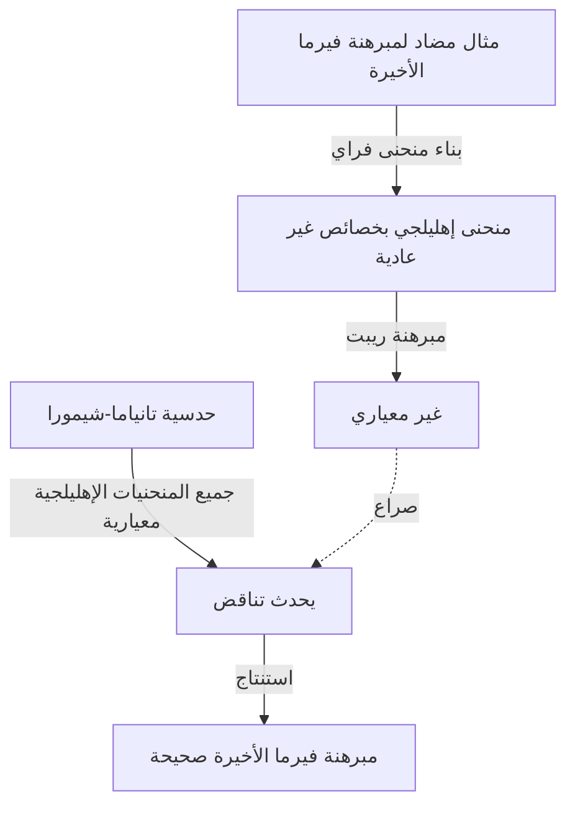

## مقدمة

في تاريخ الرياضيات، قلة من القصص درامية وملهمة مثل هذه القصة. حقق عالم الرياضيات البريطاني **[أندرو وايلز](https://kenji.blog/ar/p/wiles/)** (Andrew Wiles) الإنجاز الضخم المتمثل في إثبات "[مبرهنة فيرما الأخيرة](https://kenji.blog/ar/p/fermats-last-theorem/)"، وهي مشكلة ظلت دون حل لأكثر من 350 عامًا.

تُقرأ رحلة حياته كفيلم سينمائي، تبدأ بحلم طفولة رومانسي، تليها سبع سنوات من البحث الانفرادي والسري، والاكتشاف المدمر لخلل، وعودة معجزة. يبحث هذا المقال في حلقات من حياة وايلز والإنجازات الرياضية العميقة التي قام بها.

## حلم صبي: لقاء في سن العاشرة

ولد [أندرو وايلز](https://kenji.blog/ar/p/wiles/) في 11 أبريل 1953، في كامبريدج، إنجلترا. تحدد مصيره عندما كان عمره 10 سنوات فقط. في مكتبته المحلية، التقط كتابًا في الرياضيات بعنوان "رجال الرياضيات" (تأليف إي. تي. بيل).

في ذلك الكتاب، واجه ما كان يعتبر اللغز الأكبر في تاريخ الرياضيات: [مبرهنة فيرما الأخيرة](https://kenji.blog/ar/p/fermats-last-theorem/). إنها المبرهنة الشهيرة حيث كتب عالم الرياضيات الفرنسي [بيير دي فيرما](https://kenji.blog/ar/p/fermat/) في هامش أحد الكتب: "لدي إثبات رائع حقًا لهذه النظرية، لكن هذا الهامش أضيق من أن يحتويه".

كصبي يبلغ من العمر 10 سنوات، كان وايلز مفتونًا بشدة بمدى بساطة المبرهنة، ولكن كيف أحبطت جهود علماء الرياضيات العظماء لقرون. أقسم الصبي لنفسه: "سأكون أول شخص يثبت هذه المبرهنة". أصبح هذا **الشغف الخالص** القوة الدافعة لبقية حياته.

## ما هي [مبرهنة فيرما الأخيرة](https://kenji.blog/ar/p/fermats-last-theorem/)؟

يتم التعبير عن [مبرهنة فيرما الأخيرة](https://kenji.blog/ar/p/fermats-last-theorem/) بالصيغة البسيطة للغاية التالية:

$$
x^n + y^n = z^n \quad (\text{حيث } n \ge 3 \text{ عدد صحيح})
$$

وتنص على أنه لا توجد حلول صحيحة موجبة $(x, y, z)$ تلبي هذه المعادلة. عندما يكون $n = 2$ ، تُعرف باسم مبرهنة فيثاغورس، وهناك عدد لا حصر له من الحلول (ثلاثيات فيثاغورس). ومع ذلك، ادعى فيرما أنه عندما يكون $n$ 3 أو أكثر، فإنها لا تصح أبدًا.

على الرغم من أن الافتراض يبدو مفهومًا حتى لطالب في المدرسة الإعدادية، إلا أنه قاوم الإثبات الكامل حتى من قبل علماء الرياضيات العباقرة الذين تركوا بصمتهم في التاريخ، مثل أويلر، وصوفي جيرمان، وكومر.

## الجسر بين المنحنيات الإهليلجية والأشكال المعيارية: حدسية تانياما-شيمورا

في الثمانينيات، عندما تقدم وايلز في أبحاثه في كامبريدج وأكسفورد وأصبح أخيرًا أستاذًا في جامعة برينستون في الولايات المتحدة، ظهر نهج جديد تمامًا لحل [مبرهنة فيرما الأخيرة](https://kenji.blog/ar/p/fermats-last-theorem/) في عالم الرياضيات. كان هناك ارتباط بـ "حدسية تانياما-شيمورا".

حدسية تانياما-شيمورا هي حدسية رياضية عميقة تنص على أن "جميع المنحنيات الإهليلجية فوق حقل الأعداد الكسرية هي معيارية"، والتي يبدو للوهلة الأولى أنها لا علاقة لها بمبرهنة فيرما. ومع ذلك، في عام 1984، اقترح جيرهارد فراي فكرة أنه "إذا كانت [مبرهنة فيرما الأخيرة](https://kenji.blog/ar/p/fermats-last-theorem/) خاطئة (مما يعني وجود حل)، فإن المنحنى الإهليلجي الخاص الذي تم إنشاؤه منها (منحنى فراي) لن يكون معياريًا، مما يتعارض مع حدسية تانياما-شيمورا".

تغير الوضع بشكل كبير في عام 1986 عندما أثبت كين ريبت بصرامة فكرة فراي (مبرهنة ريبت). بعبارة أخرى، تم إثبات الحقيقة المذهلة بأنه "إذا أثبت حدسية تانياما-شيمورا، يتم إثبات [مبرهنة فيرما الأخيرة](https://kenji.blog/ar/p/fermats-last-theorem/) تلقائيًا".

عند سماع هذا الخبر، أدرك وايلز أن الوقت قد حان لتحقيق حلم طفولته. قرر التخلي عن جميع أبحاثه السابقة وتكريس كل طاقته لإثبات هذه الحدسية.

## بحث سري: 7 سنوات في العلية

عادة ما يتم إجراء الأبحاث الرياضية الحديثة بواسطة باحثين متعددين يتعاونون ويتبادلون الأفكار. ومع ذلك، اختار وايلز المسار المعاكس تمامًا. لقد حافظ على سرية أبحاثه تمامًا، وعزل نفسه في علية منزله، وعمل على الإثبات بمفرده.

كان هناك عدة أسباب لسريته. كان أحدها أنه إذا أصبح معروفًا أنه يعمل على مشكلة شهيرة مثل [مبرهنة فيرما الأخيرة](https://kenji.blog/ar/p/fermats-last-theorem/)، فسيواجه تدخلًا مستمرًا من وسائل الإعلام والباحثين الآخرين، مما يمنعه من التركيز. وسبب آخر هو منع المنافسين من سرقة أفكاره.

لمدة سبع سنوات مذهلة، أمضى وايلز كل وقت فراغه في التفكير في عليته، بصرف النظر عن أداء الحد الأدنى من الواجبات مثل إلقاء المحاضرات. كان سلاحه الأكبر هو التركيز الهائل والمثابرة، على غرار الاختراق العميق في شقوق صخرة. تسلق ببطء جبل الإثبات، مستفيدًا بالكامل من النظريات الجديدة مثل طريقة كوليفاجين-فلاخ.

## إعلان تاريخي في كامبريدج

في يونيو 1993، في مؤتمر دولي لنظرية الأعداد عقد في معهد نيوتن بجامعة كامبريدج، قدم وايلز أخيرًا نتائجه. استمر المؤتمر لمدة ثلاثة أيام، وكانت لمحاضرته عنوان يبدو متواضعًا "الأشكال المعيارية والمنحنيات الإهليلجية وتمثيلات جالوا".

ومع ذلك، مع تقدم محاضرته، بدأ علماء الرياضيات في الجمهور يدركون ما كان يحاول إثباته. تصاعدت الأجواء في الغرفة تدريجيًا، وبحلول محاضرة اليوم الأخير، اندفع حشد غفير.

في نهاية المحاضرة، كتب وايلز صيغة [مبرهنة فيرما الأخيرة](https://kenji.blog/ar/p/fermats-last-theorem/) على السبورة وأعلن بهدوء: "أعتقد أنني سأتوقف هنا". في تلك اللحظة، اندلعت الغرفة في تصفيق حار. وتناقلت وسائل الإعلام في جميع أنحاء العالم خبر: "أخيرًا تم إثبات [مبرهنة فيرما الأخيرة](https://kenji.blog/ar/p/fermats-last-theorem/)!"، مما جعل وايلز من المشاهير المفاجئين.

## بداية الكابوس: خلل في الإثبات

ومع ذلك، فإن وقت الفرح لم يدم طويلاً. خلال عملية المراجعة الصارمة للأقران بعد الإعلان، تم اكتشاف خلل قاتل في جزء حاسم من الإثبات. على وجه التحديد، وجد أن تقدير الحد الأعلى كان غير كاف عند تطبيق طريقة كوليفاجين-فلاخ على نظام أويلر معين.

في البداية، اعتقد وايلز أنه يمكنه إصلاح الأمر بسرعة، لكن المشكلة كانت أعمق بكثير مما كان يتخيل وتؤثر على الأساس الرياضي نفسه. وبينما كان علماء الرياضيات في جميع أنحاء العالم ينتظرون تصحيحه بفارغ الصبر، مر الوقت بلا رحمة.

واصل وايلز النضال مع هذا الخلل لأكثر من عام، وكاد يسحقه الضغط واليأس. قال لاحقًا: "العذاب النفسي في ذلك الوقت لا يوصف". واضطر أخيرًا إلى مواجهة الاحتمال المرعب بأن الإثبات ربما انهار تمامًا.

## التحالف مع ريتشارد تايلور و"اللحظة السحرية"

شعر وايلز بحدود القتال وحده، فاستدعى طالبه السابق والمنظر البارز للأعداد، ريتشارد تايلور، للعمل بشكل مشترك على إصلاح الخلل. ومع ذلك، حتى بعد أشهر من الجهود اليائسة من قبل الاثنين، لم يتمكنوا من اختراق الجدار.

في سبتمبر 1994، قرر وايلز أخيرًا الاستسلام وفكر في كتابة ورقة تشرح أين أخطأ قبل الابتعاد عن المشكلة. وكمحاولة أخيرة، جلس على مكتبه لينظم بالضبط سبب عدم نجاح طريقة كوليفاجين-فلاخ التي واجهت مشاكل، ثم حدثت معجزة.

فجأة، خطرت بباله فكرة للجمع بين نهج نظرية إيواساوا الذي تم التخلي عنه سابقًا وهذه الطريقة كوليفاجين-فلاخ. لقد كانت لحظة من الإلهام الخالص، حيث كمل ضعف أحدهما الآخر تمامًا.

> "لقد كان إلهامًا لا يصدق. لقد كان جميلًا جدًا وبسيطًا جدًا، ولم أستطع فهم كيف فاتني ذلك." ([أندرو وايلز](https://kenji.blog/ar/p/wiles/))

بفضل هذه "اللحظة السحرية"، تم إصلاح الخلل في الإثبات تمامًا. في أكتوبر 1994، قدم وايلز وتايلور ورقتين مصححتين، ليضعا أخيرًا نهاية كاملة لأعظم لغز في عالم الرياضيات بعد 350 عامًا.

## ما جلبه إنجاز وايلز لعالم الرياضيات

لم يكن إثبات وايلز ل[مبرهنة فيرما الأخيرة](https://kenji.blog/ar/p/fermats-last-theorem/) مجرد حل لمشكلة واحدة صعبة. ساهمت الأساليب الرياضية التي ابتكرها وطورها خلال عملية الإثبات بشكل كبير في نظرية الأعداد الحديثة، وخاصة في النظرية الرياضية الموحدة الواسعة المعروفة باسم "برنامج لانجلاندس".

أظهر إثباته أن حدسية تانياما-شيمورا (في الحالة شبه المستقرة) كانت صحيحة، مما يثبت أن مجالات مختلفة تمامًا من نظرية الأعداد (الأشكال المعيارية والمنحنيات الإهليلجية) مرتبطة على مستوى عميق. في وقت لاحق، في عام 2001، حقق علماء رياضيات آخرون إثباتًا كاملاً لحدسية تانياما-شيمورا بأكملها.

لهذا الإنجاز، حصل وايلز على العديد من الجوائز المرموقة، بما في ذلك التكريم الخاص لميدالية فيلدز وجائزة أبيل، وحصل على لقب فارس (سير) من العائلة المالكة البريطانية.

## خاتمة

توضح قصة [أندرو وايلز](https://kenji.blog/ar/p/wiles/) الاحتمالات اللانهائية للبشر التي يجلبها الفضول النقي والروح التي لا تقهر. الحلم الذي يبدو **متهورًا** الذي كان يراود صبي يبلغ من العمر 10 سنوات أصبح حقيقة بعد عقود، متغلبًا على العديد من الانتكاسات.

على الرغم من حل [مبرهنة فيرما الأخيرة](https://kenji.blog/ar/p/fermats-last-theorem/)، يستمر العديد من علماء الرياضيات في استكشاف الحقول الرياضية الجديدة الخصبة التي فتحها وايلز بحثًا عن الحقيقة التالية. سيظل اسمه، إلى جانب [بيير دي فيرما](https://kenji.blog/ar/p/fermat/)، محفورًا إلى الأبد في تاريخ العقل البشري.
