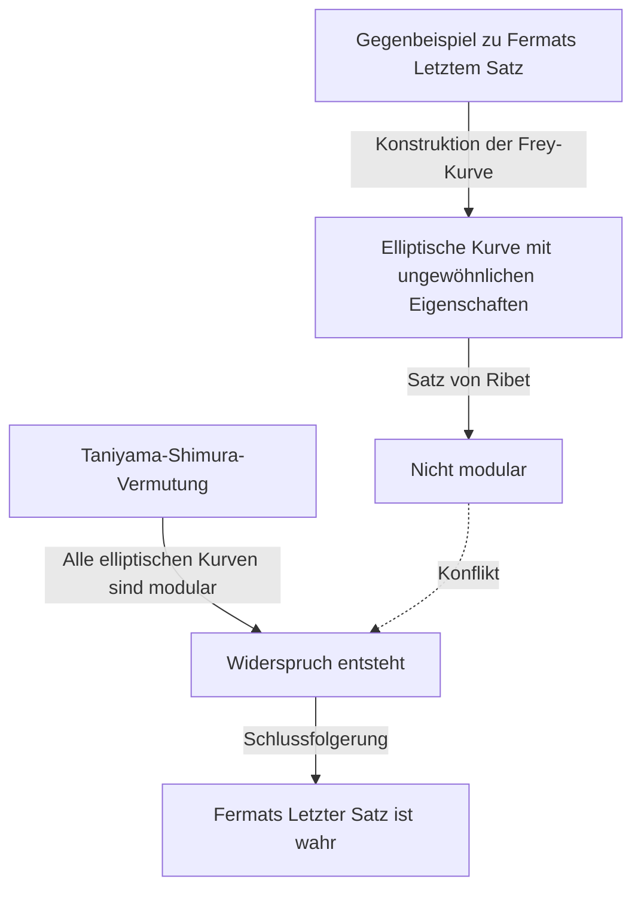

## Einführung

In der Geschichte der Mathematik sind nur wenige Geschichten so dramatisch und inspirierend wie diese. Der britische Mathematiker **[Andrew Wiles](https://kenji.blog/de/p/wiles/)** vollbrachte die monumentale Leistung, "Fermats Letzten Satz" zu beweisen, ein Problem, das über 350 Jahre lang ungelöst geblieben war.

Sein Lebensweg liest sich wie ein Film, beginnend mit einem romantischen Kindheitstraum, gefolgt von sieben Jahren einsamer, geheimer Forschung, der niederschmetternden Entdeckung eines Fehlers und einem wundersamen Comeback. Dieser Artikel befasst sich mit den Episoden in Wiles' Leben und den tiefgreifenden mathematischen Errungenschaften, die er erbrachte.

## Der Traum eines Jungen: Eine Begegnung im Alter von 10 Jahren

[Andrew Wiles](https://kenji.blog/de/p/wiles/) wurde am 11. April 1953 in Cambridge, England, geboren. Sein Schicksal besiegelte sich, als er erst 10 Jahre alt war. In seiner örtlichen Bibliothek nahm er ein Mathematikbuch mit dem Titel "Men of Mathematics" (von E. T. Bell) in die Hand.

In diesem Buch stieß er auf das, was als das größte Rätsel in der Geschichte der Mathematik galt: [Fermats Letzter Satz](https://kenji.blog/de/p/fermats-last-theorem/). Es ist das berühmte Theorem, bei dem der französische Mathematiker [Pierre de Fermat](https://kenji.blog/de/p/fermat/) an den Rand eines Buches schrieb: "Ich habe einen wahrhaft wunderbaren Beweis für diesen Satz gefunden, doch ist der Rand hier zu schmal, um ihn zu fassen."

Als 10-jähriger Junge war Wiles zutiefst fasziniert davon, wie einfach der Satz aussah, aber wie er jahrhundertelang die Bemühungen großer Mathematiker vereitelt hatte. "Ich werde der erste Mensch sein, der diesen Satz beweist", schwor sich der Junge. Diese **reine Leidenschaft** wurde zur treibenden Kraft für den Rest seines Lebens.

## Was ist [Fermats Letzter Satz](https://kenji.blog/de/p/fermats-last-theorem/)?

[Fermats Letzter Satz](https://kenji.blog/de/p/fermats-last-theorem/) wird durch die folgende sehr einfache Formel ausgedrückt:

$$
x^n + y^n = z^n \quad (\text{wobei } n \ge 3 \text{ eine ganze Zahl ist})
$$

Er besagt, dass es keine positiven ganzzahligen Lösungen $(x, y, z)$ gibt, die diese Gleichung erfüllen. Wenn $n = 2$ ist, ist dies als Satz des Pythagoras wohlbekannt, und es gibt unendlich viele Lösungen (pythagoreische Tripel). Fermat behauptete jedoch, dass es niemals zutrifft, wenn $n$ gleich 3 oder größer ist.

Obwohl die Aussage selbst für einen Mittelschüler verständlich zu sein scheint, widerstand sie einem vollständigen Beweis selbst durch geniale Mathematiker, die ihre Spuren in der Geschichte hinterließen, wie Euler, Sophie Germain und Kummer.

## Die Brücke zwischen elliptischen Kurven und Modulformen: Die Taniyama-Shimura-Vermutung

In den 1980er Jahren, als Wiles seine Forschungen in Cambridge und Oxford vorangetrieben hatte und schließlich Professor an der Princeton University in den Vereinigten Staaten wurde, tauchte in der mathematischen Welt ein völlig neuer Ansatz zur Lösung von Fermats Letztem Satz auf. Es war eine Verbindung zur "Taniyama-Shimura-Vermutung".

Die Taniyama-Shimura-Vermutung ist eine tiefe mathematische Vermutung, die besagt, dass "alle elliptischen Kurven über dem Körper der rationalen Zahlen modular sind", was auf den ersten Blick nichts mit Fermats Satz zu tun zu haben scheint. Im Jahr 1984 schlug Gerhard Frey jedoch die Idee vor, dass "wenn [Fermats Letzter Satz](https://kenji.blog/de/p/fermats-last-theorem/) falsch ist (was bedeutet, dass eine Lösung existiert), die daraus erstellte spezielle elliptische Kurve (die Frey-Kurve) nicht modular wäre, was der Taniyama-Shimura-Vermutung widersprechen würde."

Die Situation änderte sich dramatisch im Jahr 1986, als Ken Ribet Freys Idee streng bewies (Satz von Ribet). Mit anderen Worten, es wurde die erstaunliche Tatsache etabliert, dass "wenn man die Taniyama-Shimura-Vermutung beweist, [Fermats Letzter Satz](https://kenji.blog/de/p/fermats-last-theorem/) automatisch bewiesen ist."

Als Wiles diese Nachricht hörte, erkannte er, dass die Zeit gekommen war, seinen Kindheitstraum zu verwirklichen. Er beschloss, all seine bisherigen Forschungen aufzugeben und seine gesamte Energie darauf zu verwenden, diese Vermutung zu beweisen.

## Geheime Forschung: 7 Jahre auf dem Dachboden

Moderne mathematische Forschung wird normalerweise von mehreren Forschern durchgeführt, die zusammenarbeiten und Ideen austauschen. Wiles wählte jedoch genau den entgegengesetzten Weg. Er hielt seine Forschung streng geheim, zog sich auf den Dachboden seines Hauses zurück und arbeitete ganz allein an dem Beweis.

Es gab mehrere Gründe für seine Geheimhaltung. Ein Grund war, dass er ständigen Einmischungen der Medien und anderer Forscher ausgesetzt gewesen wäre, wenn bekannt geworden wäre, dass er an einem so berühmten Problem wie Fermats Letztem Satz arbeitete, was ihn daran gehindert hätte, sich zu konzentrieren. Ein anderer Grund war, zu verhindern, dass Konkurrenten seine Ideen stahlen.

Für erstaunliche sieben Jahre verbrachte Wiles all seine verbleibende Zeit mit Nachdenken auf seinem Dachboden, abgesehen von der Erledigung minimaler Pflichten wie dem Halten von Vorlesungen. Seine größte Waffe war eine überwältigende Konzentration und Hartnäckigkeit, vergleichbar mit dem tiefen Eindringen in die Risse eines Felsens. Er erklomm langsam den Berg des Beweises und nutzte dabei voll und ganz neue Theorien wie die Kolyvagin-Flach-Methode.

## Historische Ankündigung in Cambridge

Im Juni 1993 präsentierte Wiles auf einer internationalen Konferenz über Zahlentheorie am Newton Institute der Universität Cambridge schließlich seine Ergebnisse. Die Konferenz dauerte drei Tage, und sein Vortrag trug den scheinbar unscheinbaren Titel "Modulformen, elliptische Kurven und Galois-Darstellungen".

Als sein Vortrag jedoch voranschritt, begannen die Mathematiker im Publikum zu erkennen, was er zu beweisen versuchte. Die Atmosphäre im Raum heizte sich allmählich auf, und zum Vortrag am letzten Tag strömte ein überfülltes Publikum herein.

Am Ende des Vortrags schrieb Wiles die Formel für Fermats Letzten Satz an die Tafel und kündigte leise an: "Ich denke, ich werde hier aufhören." In diesem Moment brach der Raum in tosenden Applaus aus. Medien auf der ganzen Welt berichteten ausführlich: "[Fermats Letzter Satz](https://kenji.blog/de/p/fermats-last-theorem/) endlich bewiesen!" und machten Wiles plötzlich zu einer Berühmtheit.

## Der Albtraum beginnt: Ein Fehler im Beweis

Die Zeit der Freude währte jedoch nicht lange. Während des strengen Peer-Review-Prozesses nach der Ankündigung wurde ein fataler Fehler in einem entscheidenden Teil des Beweises entdeckt. Insbesondere wurde festgestellt, dass die Abschätzung der oberen Schranke unzureichend war, wenn die Kolyvagin-Flach-Methode auf ein bestimmtes Euler-System angewendet wurde.

Zunächst dachte Wiles, er könne es schnell beheben, aber das Problem war viel tiefer als erwartet und betraf das mathematische Fundament selbst. Während Mathematiker weltweit gespannt auf seine Korrektur warteten, verging die Zeit unerbittlich.

Wiles kämpfte mehr als ein Jahr lang weiter mit diesem Fehler, fast erdrückt von Druck und Verzweiflung. "Die seelischen Qualen dieser Zeit sind unbeschreiblich", erzählte er später. Er musste sich schließlich der erschreckenden Möglichkeit stellen, dass der Beweis vollständig zusammengebrochen sein könnte.

## Die Allianz mit Richard Taylor und der "magische Moment"

Wiles spürte die Grenzen des Alleinkampfes und rief seinen ehemaligen Studenten und brillanten Zahlentheoretiker Richard Taylor hinzu, um gemeinsam an der Reparatur des Fehlers zu arbeiten. Aber selbst nach monatelangen verzweifelten Anstrengungen der beiden konnten sie die Mauer nicht durchbrechen.

Im September 1994 beschloss Wiles schließlich, aufzugeben, und dachte daran, ein Papier zu schreiben, in dem er erklärte, wo er sich geirrt hatte, bevor er sich von dem Problem abwandte. Als letzten Versuch setzte er sich an seinen Schreibtisch, um genau zu organisieren, warum die problematische Kolyvagin-Flach-Methode nicht funktioniert hatte, und dann geschah ein Wunder.

Plötzlich durchzuckte eine Idee seinen Geist, den zuvor verworfenen Ansatz der Iwasawa-Theorie mit dieser Kolyvagin-Flach-Methode zu kombinieren. Es war ein Moment purer Offenbarung, in dem die Schwäche des einen den anderen perfekt ergänzte.

> "Es war eine unglaubliche Offenbarung. Es war so schön, so einfach, und ich konnte nicht verstehen, wie ich es hatte übersehen können." ([Andrew Wiles](https://kenji.blog/de/p/wiles/))

Dank dieses "magischen Moments" wurde der Fehler im Beweis vollständig behoben. Im Oktober 1994 reichten Wiles und Taylor zwei korrigierte Papiere ein, was dem größten Rätsel der mathematischen Welt nach 350 Jahren endgültig ein Ende setzte.

## Was Wiles' Leistung der mathematischen Welt brachte

Wiles' Beweis von Fermats Letztem Satz war nicht nur die Lösung eines einzelnen schwierigen Problems. Die mathematischen Methoden, die er während des Beweisprozesses schuf und entwickelte, trugen immens zur modernen Zahlentheorie bei, insbesondere zur riesigen vereinheitlichten mathematischen Theorie, die als "Langlands-Programm" bekannt ist.

Sein Beweis zeigte, dass die Taniyama-Shimura-Vermutung (im semistabilen Fall) korrekt war, und etablierte, dass völlig unterschiedliche Bereiche der Zahlentheorie (Modulformen und elliptische Kurven) auf einer tiefen Ebene verbunden sind. Später, im Jahr 2001, gelang anderen Mathematikern der vollständige Beweis der gesamten Taniyama-Shimura-Vermutung.

Für diese Leistung erhielt Wiles zahlreiche prestigeträchtige Auszeichnungen, darunter die Sonderauszeichnung der Fields-Medaille und den Abelpreis, und wurde von der britischen Königsfamilie zum Ritter (Sir) geschlagen.

## Fazit

Die Geschichte von [Andrew Wiles](https://kenji.blog/de/p/wiles/) zeigt die unendlichen Möglichkeiten der Menschen, die durch reine Neugier und einen unbezwingbaren Geist hervorgebracht werden. Der scheinbar **waghalsige Traum**, den ein 10-jähriger Junge hegte, wurde Jahrzehnte später Wirklichkeit, nachdem er zahlreiche Rückschläge überwunden hatte.

Obwohl [Fermats Letzter Satz](https://kenji.blog/de/p/fermats-last-theorem/) gelöst wurde, erforschen viele Mathematiker weiterhin die fruchtbaren neuen Felder der Mathematik, die Wiles eröffnet hat, auf der Suche nach der nächsten Wahrheit. Sein Name wird zusammen mit [Pierre de Fermat](https://kenji.blog/de/p/fermat/) für immer in die Geschichte des menschlichen Intellekts eingraviert sein.
