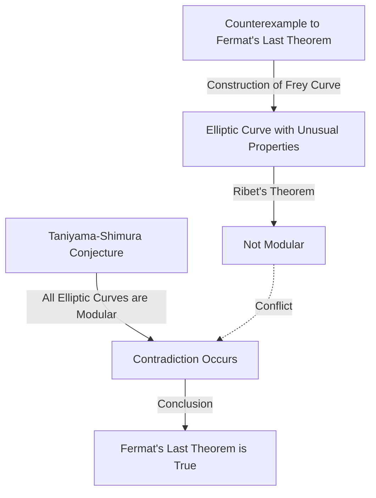

## Introduction

In the history of mathematics, few stories are as dramatic and inspiring as this one. The British mathematician **[Andrew Wiles](https://kenji.blog/en/p/wiles/)** achieved the monumental feat of proving "[Fermat's Last Theorem](https://kenji.blog/en/p/fermats-last-theorem/)," a problem that had remained unsolved for over 350 years.

His life's journey reads like a movie, beginning with a romantic childhood dream, followed by seven years of solitary, secret research, the devastating discovery of a flaw, and a miraculous comeback. This article delves into the episodes of Wiles's life and the profound mathematical achievements he undertook.

## A Boy's Dream: An Encounter at Age 10

[Andrew Wiles](https://kenji.blog/en/p/wiles/) was born on April 11, 1953, in Cambridge, England. His destiny was set when he was just 10 years old. In his local library, he picked up a mathematics book titled "Men of Mathematics" (by E. T. Bell).

In that book, he encountered what was considered the greatest mystery in the history of mathematics: [Fermat's Last Theorem](https://kenji.blog/en/p/fermats-last-theorem/). It is the famous theorem where the French mathematician [Pierre de Fermat](https://kenji.blog/en/p/fermat/) wrote in the margin of a book, "I have a truly marvelous demonstration of this proposition which this margin is too narrow to contain."

As a 10-year-old boy, Wiles was deeply fascinated by how simple the theorem looked, yet how it had thwarted the efforts of great mathematicians for centuries. "I will be the first person to prove this theorem," the boy swore to himself. This **pure passion** became the driving force for the rest of his life.

## What is [Fermat's Last Theorem](https://kenji.blog/en/p/fermats-last-theorem/)?

[Fermat's Last Theorem](https://kenji.blog/en/p/fermats-last-theorem/) is expressed by the following very simple formula:

$$
x^n + y^n = z^n \quad (\text{where } n \ge 3 \text{ is an integer})
$$

It states that there are no positive integer solutions $(x, y, z)$ that satisfy this equation. When $n = 2$, it is well known as the Pythagorean theorem, and there are infinitely many solutions (Pythagorean triples). However, [Fermat](https://kenji.blog/en/p/fermat/) claimed that when $n$ is 3 or greater, it never holds true.

Although the proposition seems understandable even to a middle school student, it resisted complete proof even by genius mathematicians who left their mark on history, such as Euler, Sophie Germain, and [Kummer](https://kenji.blog/en/p/kummer/).

## The Bridge Between Elliptic Curves and Modular Forms: The Taniyama-Shimura Conjecture

In the 1980s, when Wiles had advanced his research at Cambridge and Oxford and eventually became a professor at Princeton University in the United States, a completely new approach to solving [Fermat's Last Theorem](https://kenji.blog/en/p/fermats-last-theorem/) emerged in the mathematical world. It was a connection to the "Taniyama-Shimura Conjecture."

The Taniyama-Shimura conjecture is a deep mathematical conjecture stating that "all elliptic curves over the field of rational numbers are modular," which at first glance seems unrelated to [Fermat](https://kenji.blog/en/p/fermat/)'s Theorem. However, in 1984, Gerhard Frey proposed the idea that "if [Fermat's Last Theorem](https://kenji.blog/en/p/fermats-last-theorem/) is false (meaning a solution exists), the special elliptic curve created from it (the Frey curve) would not be modular, thus contradicting the Taniyama-Shimura conjecture."

The situation changed dramatically in 1986 when Ken Ribet rigorously proved Frey's idea (Ribet's Theorem). In other words, the astonishing fact was established that "if you prove the Taniyama-Shimura conjecture, [Fermat's Last Theorem](https://kenji.blog/en/p/fermats-last-theorem/) is automatically proved."

Hearing this news, Wiles realized that the time had come to fulfill his childhood dream. He decided to abandon all his previous research and devote all his energy to proving this conjecture.

## Secret Research: 7 Years in the Attic

Modern mathematical research is usually conducted by multiple researchers collaborating and sharing ideas. However, Wiles chose the exact opposite path. He kept his research completely secret, secluded himself in his home attic, and worked on the proof entirely alone.

There were several reasons for his secrecy. One was that if it became known he was working on such a famous problem as [Fermat's Last Theorem](https://kenji.blog/en/p/fermats-last-theorem/), he would face constant interference from the media and other researchers, preventing him from concentrating. Another was to prevent competitors from stealing his ideas.

For an astonishing seven years, Wiles spent all his remaining time thinking in his attic, aside from performing minimal duties like lecturing. His greatest weapon was an overwhelming concentration and tenacity, akin to penetrating deep into the cracks of a rock. He slowly climbed the mountain of the proof, fully utilizing new theories such as the Kolyvagin-Flach method.

## Historic Announcement at Cambridge

In June 1993, at an international number theory conference held at the Newton Institute at Cambridge University, Wiles finally presented his results. The conference lasted for three days, and his lecture had the seemingly unassuming title "Modular Forms, Elliptic Curves, and [Galois](https://kenji.blog/en/p/galois/) Representations."

However, as his lecture progressed, the mathematicians in the audience began to realize what he was trying to prove. The atmosphere in the room gradually heated up, and by the final day's lecture, an overflow crowd had rushed in.

At the end of the lecture, Wiles wrote the formula for [Fermat's Last Theorem](https://kenji.blog/en/p/fermats-last-theorem/) on the blackboard and quietly announced, "I think I'll stop here." At that moment, the room erupted in thunderous applause. Media around the world heavily reported, "[Fermat's Last Theorem](https://kenji.blog/en/p/fermats-last-theorem/) finally proved!" making Wiles a sudden celebrity.

## The Nightmare Begins: A Flaw in the Proof

However, the time of joy did not last long. During the rigorous peer review process after the announcement, a fatal flaw was discovered in a crucial part of the proof. Specifically, it was found that the upper bound estimate was insufficient when applying the Kolyvagin-Flach method to a certain specific Euler system.

Initially, Wiles thought he could fix it quickly, but the problem was much deeper than imagined and affected the very mathematical foundation. As mathematicians worldwide eagerly awaited his correction, time mercilessly passed by.

Wiles continued to struggle with this flaw for over a year, almost crushed by pressure and despair. "The mental agony of that time is indescribable," he later recounted. He finally had to face the terrifying possibility that the proof might have completely collapsed.

## The Alliance with Richard Taylor and the "Magic Moment"

Feeling the limits of fighting alone, Wiles called upon his former student and brilliant number theorist, Richard Taylor, to jointly work on repairing the flaw. However, even after months of desperate effort by the two, they could not break through the wall.

In September 1994, Wiles finally decided to give up and thought about writing a paper explaining where he went wrong before stepping away from the problem. As a final attempt, he sat at his desk to organize exactly why the problematic Kolyvagin-Flach method hadn't worked, and then a miracle occurred.

Suddenly, an idea flashed through his mind to combine the previously abandoned Iwasawa theory approach with this Kolyvagin-Flach method. It was a moment of sheer revelation, where the weakness of one perfectly complemented the other.

> "It was an unbelievable revelation. It was so beautifully, so simply, and I could not understand how I had missed it." ([Andrew Wiles](https://kenji.blog/en/p/wiles/))

Thanks to this "magic moment," the flaw in the proof was completely repaired. In October 1994, Wiles and Taylor submitted two corrected papers, finally putting a complete end to the greatest mystery in the mathematical world after 350 years.

## What Wiles's Achievement Brought to the Mathematical World

Wiles's proof of [Fermat's Last Theorem](https://kenji.blog/en/p/fermats-last-theorem/) was not just the resolution of a single difficult problem. The mathematical methods he created and developed during the proof process contributed immensely to modern number theory, especially to the vast unified mathematical theory known as the "Langlands Program."

His proof showed that the Taniyama-Shimura conjecture (in the semistable case) was correct, establishing that completely different fields of number theory (modular forms and elliptic curves) are connected at a deep level. Later, in 2001, other mathematicians achieved the complete proof of the full Taniyama-Shimura conjecture.

For this achievement, Wiles received numerous prestigious awards, including the Fields Medal special tribute and the [Abel](https://kenji.blog/en/p/abel/) Prize, and was awarded a knighthood (Sir) by the British royal family.

## Conclusion

[Andrew Wiles](https://kenji.blog/en/p/wiles/)'s story demonstrates the infinite possibilities of human beings brought about by pure curiosity and an indomitable spirit. The seemingly **reckless dream** harbored by a 10-year-old boy became a reality decades later, overcoming numerous setbacks.

Although [Fermat's Last Theorem](https://kenji.blog/en/p/fermats-last-theorem/) has been solved, many mathematicians continue to explore the fertile new fields of mathematics opened up by Wiles in search of the next truth. His name, along with [Pierre de Fermat](https://kenji.blog/en/p/fermat/), will be forever etched in the history of human intellect.
