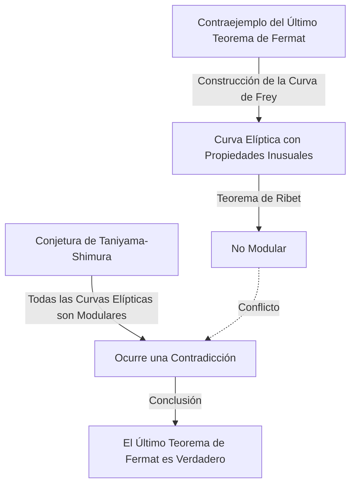

## Introducción

En la historia de las matemáticas, pocas historias son tan dramáticas e inspiradoras como esta. El matemático británico **[Andrew Wiles](https://kenji.blog/es/p/wiles/)** logró la hazaña monumental de demostrar el "Último Teorema de [Fermat](https://kenji.blog/es/p/fermat/)", un problema que había permanecido sin resolver durante más de 350 años.

El viaje de su vida se lee como una película, comenzando con un sueño romántico de la infancia, seguido de siete años de investigación solitaria y secreta, el descubrimiento devastador de un error y un regreso milagroso. Este artículo profundiza en los episodios de la vida de Wiles y los profundos logros matemáticos que emprendió.

## Un sueño de niño: Un encuentro a los 10 años

[Andrew Wiles](https://kenji.blog/es/p/wiles/) nació el 11 de abril de 1953 en Cambridge, Inglaterra. Su destino quedó marcado cuando tenía solo 10 años. En su biblioteca local, tomó un libro de matemáticas titulado "Hombres de la Matemática" (de E. T. Bell).

En ese libro, se encontró con lo que se consideraba el mayor misterio en la historia de las matemáticas: el Último Teorema de [Fermat](https://kenji.blog/es/p/fermat/). Es el famoso teorema en el que el matemático francés [Pierre de Fermat](https://kenji.blog/es/p/fermat/) escribió en el margen de un libro: "Tengo una demostración verdaderamente maravillosa de esta proposición, que este margen es demasiado estrecho para contener".

Como niño de 10 años, Wiles estaba profundamente fascinado por lo simple que parecía el teorema, pero por cómo había frustrado los esfuerzos de grandes matemáticos durante siglos. "Seré la primera persona en demostrar este teorema", se juró el niño. Esta **pasión pura** se convirtió en la fuerza motriz del resto de su vida.

## ¿Qué es el Último Teorema de [Fermat](https://kenji.blog/es/p/fermat/)?

El Último Teorema de [Fermat](https://kenji.blog/es/p/fermat/) se expresa mediante la siguiente fórmula muy simple:

$$
x^n + y^n = z^n \quad (\text{donde } n \ge 3 \text{ es un número entero})
$$

Establece que no hay soluciones enteras positivas $(x, y, z)$ que satisfagan esta ecuación. Cuando $n = 2$, es bien conocido como el teorema de Pitágoras, y hay infinitas soluciones (ternas pitagóricas). Sin embargo, [Fermat](https://kenji.blog/es/p/fermat/) afirmó que cuando $n$ es 3 o mayor, nunca se cumple.

Aunque la proposición parece comprensible incluso para un estudiante de secundaria, se resistió a una demostración completa incluso por parte de matemáticos genios que dejaron su huella en la historia, como Euler, Sophie Germain y [Kummer](https://kenji.blog/es/p/kummer/).

## El puente entre las curvas elípticas y las formas modulares: La conjetura de Taniyama-Shimura

En la década de 1980, cuando Wiles había avanzado en su investigación en Cambridge y Oxford y finalmente se convirtió en profesor en la Universidad de Princeton en los Estados Unidos, surgió un enfoque completamente nuevo para resolver el Último Teorema de [Fermat](https://kenji.blog/es/p/fermat/) en el mundo matemático. Era una conexión con la "Conjetura de Taniyama-Shimura".

La conjetura de Taniyama-Shimura es una profunda conjetura matemática que establece que "todas las curvas elípticas sobre el cuerpo de los números racionales son modulares", lo que a primera vista parece no tener relación con el Teorema de [Fermat](https://kenji.blog/es/p/fermat/). Sin embargo, en 1984, Gerhard Frey propuso la idea de que "si el Último Teorema de [Fermat](https://kenji.blog/es/p/fermat/) es falso (lo que significa que existe una solución), la curva elíptica especial creada a partir de él (la curva de Frey) no sería modular, contradiciendo así la conjetura de Taniyama-Shimura".

La situación cambió drásticamente en 1986 cuando Ken Ribet demostró rigurosamente la idea de Frey (el Teorema de Ribet). En otras palabras, se estableció el sorprendente hecho de que "si se demuestra la conjetura de Taniyama-Shimura, el Último Teorema de [Fermat](https://kenji.blog/es/p/fermat/) queda demostrado automáticamente".

Al escuchar esta noticia, Wiles se dio cuenta de que había llegado el momento de cumplir su sueño de la infancia. Decidió abandonar todas sus investigaciones anteriores y dedicar toda su energía a demostrar esta conjetura.

## Investigación secreta: 7 años en el ático

La investigación matemática moderna generalmente la llevan a cabo múltiples investigadores colaborando y compartiendo ideas. Sin embargo, Wiles eligió exactamente el camino opuesto. Mantuvo su investigación completamente en secreto, se recluyó en el ático de su casa y trabajó en la demostración completamente solo.

Había varias razones para su secreto. Una era que, si se supiera que estaba trabajando en un problema tan famoso como el Último Teorema de [Fermat](https://kenji.blog/es/p/fermat/), se enfrentaría a interferencias constantes de los medios y otros investigadores, lo que le impediría concentrarse. Otra era para evitar que sus competidores le robaran sus ideas.

Durante unos asombrosos siete años, Wiles pasó todo su tiempo libre pensando en su ático, aparte de realizar tareas mínimas como dar conferencias. Su mayor arma fue una concentración y tenacidad abrumadoras, similares a penetrar profundamente en las grietas de una roca. Escaló lentamente la montaña de la demostración, utilizando al máximo nuevas teorías como el método de Kolyvagin-Flach.

## Anuncio histórico en Cambridge

En junio de 1993, en una conferencia internacional sobre teoría de números celebrada en el Instituto Newton de la Universidad de Cambridge, Wiles finalmente presentó sus resultados. La conferencia duró tres días, y su conferencia tuvo el título aparentemente modesto de "Formas Modulares, Curvas Elípticas y Representaciones de [Galois](https://kenji.blog/es/p/galois/)".

Sin embargo, a medida que avanzaba su conferencia, los matemáticos del público comenzaron a darse cuenta de lo que estaba tratando de demostrar. La atmósfera en la sala se calentó gradualmente, y en la conferencia del último día, entró una multitud desbordante.

Al final de la conferencia, Wiles escribió la fórmula del Último Teorema de [Fermat](https://kenji.blog/es/p/fermat/) en la pizarra y anunció en voz baja: "Creo que me detendré aquí". En ese momento, la sala estalló en un estruendoso aplauso. Los medios de todo el mundo informaron ampliamente: "¡El Último Teorema de [Fermat](https://kenji.blog/es/p/fermat/) finalmente demostrado!", convirtiendo a Wiles en una celebridad repentina.

## Comienza la pesadilla: Un defecto en la demostración

Sin embargo, el tiempo de alegría no duró mucho. Durante el riguroso proceso de revisión por pares después del anuncio, se descubrió un defecto fatal en una parte crucial de la demostración. Específicamente, se descubrió que la estimación del límite superior era insuficiente al aplicar el método de Kolyvagin-Flach a un cierto sistema de Euler específico.

Inicialmente, Wiles pensó que podría arreglarlo rápidamente, pero el problema era mucho más profundo de lo imaginado y afectaba el propio fundamento matemático. Mientras los matemáticos de todo el mundo esperaban ansiosamente su corrección, el tiempo pasaba sin piedad.

Wiles continuó luchando con este defecto durante más de un año, casi aplastado por la presión y la desesperación. "La agonía mental de ese momento es indescriptible", relató más tarde. Finalmente tuvo que enfrentarse a la aterradora posibilidad de que la demostración pudiera haber colapsado por completo.

## La alianza con Richard Taylor y el "Momento Mágico"

Sintiendo los límites de luchar solo, Wiles recurrió a su antiguo alumno y brillante teórico de números, Richard Taylor, para trabajar conjuntamente en la reparación del defecto. Sin embargo, incluso después de meses de esfuerzo desesperado por parte de los dos, no pudieron romper el muro.

En septiembre de 1994, Wiles finalmente decidió darse por vencido y pensó en escribir un artículo explicando dónde se equivocó antes de alejarse del problema. Como último intento, se sentó en su escritorio para organizar exactamente por qué el problemático método de Kolyvagin-Flach no había funcionado, y entonces ocurrió un milagro.

De repente, una idea cruzó por su mente para combinar el enfoque de la teoría de Iwasawa previamente abandonado con este método de Kolyvagin-Flach. Fue un momento de pura revelación, donde la debilidad de uno complementaba perfectamente al otro.

> "Fue una revelación increíble. Fue tan hermoso, tan simple, y no podía entender cómo lo había pasado por alto." ([Andrew Wiles](https://kenji.blog/es/p/wiles/))

Gracias a este "momento mágico", el defecto de la demostración se reparó por completo. En octubre 1994, Wiles y Taylor presentaron dos artículos corregidos, poniendo fin por completo al mayor misterio del mundo matemático después de 350 años.

## Lo que el logro de Wiles trajo al mundo matemático

La demostración de Wiles del Último Teorema de [Fermat](https://kenji.blog/es/p/fermat/) no fue solo la resolución de un problema difícil. Los métodos matemáticos que creó y desarrolló durante el proceso de demostración contribuyeron enormemente a la teoría de números moderna, especialmente a la vasta teoría matemática unificada conocida como el "Programa de Langlands".

Su demostración mostró que la conjetura de Taniyama-Shimura (en el caso semiestable) era correcta, estableciendo que campos completamente diferentes de la teoría de números (formas modulares y curvas elípticas) están conectados a un nivel profundo. Más tarde, en 2001, otros matemáticos lograron la demostración completa de toda la conjetura de Taniyama-Shimura.

Por este logro, Wiles recibió numerosos premios prestigiosos, incluido el tributo especial de la Medalla Fields y el Premio [Abel](https://kenji.blog/es/p/abel/), y fue nombrado caballero (Sir) por la familia real británica.

## Conclusión

La historia de [Andrew Wiles](https://kenji.blog/es/p/wiles/) demuestra las infinitas posibilidades de los seres humanos impulsadas por la curiosidad pura y un espíritu indomable. El sueño aparentemente **imprudente** albergado por un niño de 10 años se hizo realidad décadas después, superando numerosos contratiempos.

Aunque el Último Teorema de [Fermat](https://kenji.blog/es/p/fermat/) ha sido resuelto, muchos matemáticos continúan explorando los fértiles nuevos campos de las matemáticas abiertos por Wiles en busca de la siguiente verdad. Su nombre, junto con [Pierre de Fermat](https://kenji.blog/es/p/fermat/), quedará grabado para siempre en la historia del intelecto humano.
