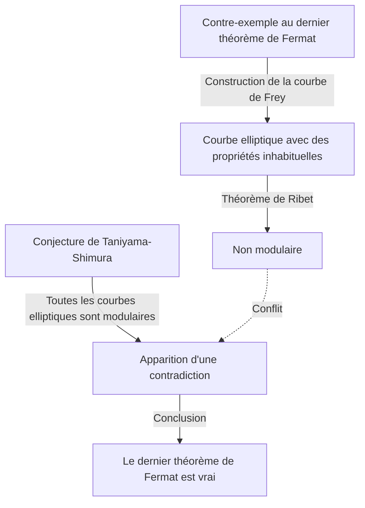

## Introduction

Dans l'histoire des mathématiques, peu d'histoires sont aussi dramatiques et inspirantes que celle-ci. Le mathématicien britannique **Andrew Wiles** a accompli l'exploit monumental de prouver le « dernier théorème de Fermat », un problème qui était resté non résolu pendant plus de 350 ans.

Le parcours de sa vie se lit comme un film, commençant par un rêve d'enfance romantique, suivi de sept années de recherche solitaire et secrète, la découverte dévastatrice d'une faille, et un retour miraculeux. Cet article se penche sur les épisodes de la vie de Wiles et sur les profondes réalisations mathématiques qu'il a entreprises.

## Un rêve de petit garçon : Une rencontre à l'âge de 10 ans

Andrew Wiles est né le 11 avril 1953 à Cambridge, en Angleterre. Son destin s'est scellé alors qu'il n'avait que 10 ans. Dans sa bibliothèque locale, il a pris un livre de mathématiques intitulé « Men of Mathematics » (par E. T. Bell).

Dans ce livre, il a rencontré ce qui était considéré comme le plus grand mystère de l'histoire des mathématiques : le dernier théorème de Fermat. C'est le célèbre théorème où le mathématicien français Pierre de Fermat a écrit dans la marge d'un livre : « J'ai une démonstration véritablement merveilleuse de cette proposition, que cette marge est trop étroite pour contenir. »

En tant que garçon de 10 ans, Wiles était profondément fasciné par la simplicité apparente du théorème, et par la façon dont il avait contrecarré les efforts de grands mathématiciens pendant des siècles. « Je serai la première personne à prouver ce théorème », s'est juré le jeune garçon. Cette **passion pure** est devenue le moteur de tout le reste de sa vie.

## Qu'est-ce que le dernier théorème de Fermat ?

Le dernier théorème de Fermat s'exprime par la formule très simple suivante :

$$
x^n + y^n = z^n \quad (\text{où } n \ge 3 \text{ est un entier})
$$

Il stipule qu'il n'y a pas de solutions entières positives $(x, y, z)$ qui satisfont cette équation. Lorsque $n = 2$, il est bien connu sous le nom de théorème de Pythagore, et il existe une infinité de solutions (triplets pythagoriciens). Cependant, Fermat a affirmé que lorsque $n$ est 3 ou plus, cela ne se vérifie jamais.

Bien que la proposition semble compréhensible même pour un collégien, elle a résisté à une preuve complète même par des mathématiciens de génie qui ont laissé leur marque dans l'histoire, tels qu'Euler, Sophie Germain et Kummer.

## Le pont entre les courbes elliptiques et les formes modulaires : La conjecture de Taniyama-Shimura

Dans les années 1980, alors que Wiles avait avancé ses recherches à Cambridge et Oxford et était finalement devenu professeur à l'Université de Princeton aux États-Unis, une approche complètement nouvelle pour résoudre le dernier théorème de Fermat a émergé dans le monde mathématique. C'était un lien avec la « conjecture de Taniyama-Shimura ».

La conjecture de Taniyama-Shimura est une profonde conjecture mathématique stipulant que « toutes les courbes elliptiques sur le corps des nombres rationnels sont modulaires », ce qui à première vue semble sans rapport avec le théorème de Fermat. Cependant, en 1984, Gerhard Frey a proposé l'idée que « si le dernier théorème de Fermat est faux (c'est-à-dire qu'une solution existe), la courbe elliptique spéciale créée à partir de celui-ci (la courbe de Frey) ne serait pas modulaire, contredisant ainsi la conjecture de Taniyama-Shimura. »

La situation a changé de façon spectaculaire en 1986 lorsque Ken Ribet a rigoureusement prouvé l'idée de Frey (le théorème de Ribet). En d'autres termes, le fait étonnant a été établi que « si vous prouvez la conjecture de Taniyama-Shimura, le dernier théorème de Fermat est automatiquement prouvé. »

En entendant cette nouvelle, Wiles a réalisé que le moment était venu de réaliser son rêve d'enfance. Il a décidé d'abandonner toutes ses recherches précédentes et de consacrer toute son énergie à prouver cette conjecture.

## Recherche secrète : 7 ans dans le grenier

La recherche mathématique moderne est généralement menée par de multiples chercheurs collaborant et partageant des idées. Cependant, Wiles a choisi exactement le chemin inverse. Il a gardé ses recherches complètement secrètes, s'est isolé dans le grenier de sa maison et a travaillé sur la preuve entièrement seul.

Il y avait plusieurs raisons à son secret. L'une d'elles était que s'il devenait connu qu'il travaillait sur un problème aussi célèbre que le dernier théorème de Fermat, il ferait face à des interférences constantes de la part des médias et d'autres chercheurs, l'empêchant de se concentrer. Une autre était d'empêcher ses concurrents de voler ses idées.

Pendant sept années étonnantes, Wiles a passé tout son temps libre à réfléchir dans son grenier, à part accomplir des tâches minimales comme donner des cours. Sa plus grande arme était une concentration et une ténacité écrasantes, semblables à la pénétration profonde dans les fissures d'un rocher. Il a lentement gravi la montagne de la preuve, utilisant pleinement de nouvelles théories telles que la méthode de Kolyvagin-Flach.

## Annonce historique à Cambridge

En juin 1993, lors d'une conférence internationale sur la théorie des nombres tenue à l'Institut Newton de l'Université de Cambridge, Wiles a finalement présenté ses résultats. La conférence a duré trois jours, et sa conférence portait le titre apparemment modeste de « Formes modulaires, courbes elliptiques et représentations galoisiennes. »

Cependant, au fur et à mesure que sa conférence progressait, les mathématiciens dans le public ont commencé à réaliser ce qu'il essayait de prouver. L'atmosphère dans la salle s'est progressivement réchauffée, et lors de la conférence du dernier jour, une foule débordante s'est précipitée.

À la fin de la conférence, Wiles a écrit la formule du dernier théorème de Fermat au tableau noir et a annoncé tranquillement : « Je pense que je vais m'arrêter ici. » À ce moment-là, la salle a éclaté en un tonnerre d'applaudissements. Les médias du monde entier ont largement rapporté : « Le dernier théorème de Fermat enfin prouvé ! », faisant de Wiles une célébrité soudaine.

## Le cauchemar commence : Une faille dans la preuve

Cependant, le temps de la joie n'a pas duré longtemps. Au cours du rigoureux processus d'examen par les pairs après l'annonce, une faille fatale a été découverte dans une partie cruciale de la preuve. Plus précisément, il a été constaté que l'estimation de la borne supérieure était insuffisante lors de l'application de la méthode de Kolyvagin-Flach à un certain système d'Euler spécifique.

Initialement, Wiles pensait pouvoir le réparer rapidement, mais le problème était beaucoup plus profond qu'imaginé et affectait le fondement mathématique lui-même. Alors que les mathématiciens du monde entier attendaient avec impatience sa correction, le temps passait impitoyablement.

Wiles a continué à lutter contre cette faille pendant plus d'un an, presque écrasé par la pression et le désespoir. « L'agonie mentale de cette époque est indescriptible », a-t-il raconté plus tard. Il a finalement dû faire face à la possibilité terrifiante que la preuve ait complètement échoué.

## L'alliance avec Richard Taylor et le « moment magique »

Ressentant les limites de se battre seul, Wiles a fait appel à son ancien étudiant et brillant théoricien des nombres, Richard Taylor, pour travailler conjointement à la réparation de la faille. Cependant, même après des mois d'efforts désespérés de la part des deux, ils ne pouvaient pas franchir le mur.

En septembre 1994, Wiles a finalement décidé d'abandonner et a pensé à écrire un article expliquant où il s'était trompé avant de s'éloigner du problème. En guise de dernière tentative, il s'est assis à son bureau pour organiser exactement pourquoi la méthode problématique de Kolyvagin-Flach n'avait pas fonctionné, et c'est alors qu'un miracle s'est produit.

Soudain, une idée lui traversa l'esprit pour combiner l'approche de la théorie d'Iwasawa précédemment abandonnée avec cette méthode de Kolyvagin-Flach. Ce fut un moment de pure révélation, où la faiblesse de l'un complétait parfaitement l'autre.

> « C'était une révélation incroyable. C'était tellement beau, tellement simple, et je ne pouvais pas comprendre comment j'avais pu passer à côté. » (Andrew Wiles)

Grâce à ce « moment magique », la faille de la preuve a été entièrement réparée. En octobre 1994, Wiles et Taylor ont soumis deux articles corrigés, mettant enfin un terme complet au plus grand mystère du monde mathématique après 350 ans.

## Ce que l'exploit de Wiles a apporté au monde mathématique

La preuve par Wiles du dernier théorème de Fermat n'était pas seulement la résolution d'un seul problème difficile. Les méthodes mathématiques qu'il a créées et développées au cours du processus de preuve ont énormément contribué à la théorie des nombres moderne, en particulier à la vaste théorie mathématique unifiée connue sous le nom de « programme de Langlands ».

Sa preuve a montré que la conjecture de Taniyama-Shimura (dans le cas semi-stable) était correcte, établissant que des domaines complètement différents de la théorie des nombres (formes modulaires et courbes elliptiques) sont liés à un niveau profond. Plus tard, en 2001, d'autres mathématiciens ont réalisé la preuve complète de l'ensemble de la conjecture de Taniyama-Shimura.

Pour cette réalisation, Wiles a reçu de nombreux prix prestigieux, dont l'hommage spécial de la médaille Fields et le prix Abel, et a été fait chevalier (Sir) par la famille royale britannique.

## Conclusion

L'histoire d'Andrew Wiles démontre les possibilités infinies des êtres humains apportées par la curiosité pure et un esprit indomptable. Le rêve apparemment **téméraire** nourri par un garçon de 10 ans est devenu réalité des décennies plus tard, surmontant de nombreux revers.

Bien que le dernier théorème de Fermat ait été résolu, de nombreux mathématiciens continuent d'explorer les nouveaux champs fertiles des mathématiques ouverts par Wiles à la recherche de la prochaine vérité. Son nom, avec celui de Pierre de Fermat, restera à jamais gravé dans l'histoire de l'intellect humain.
