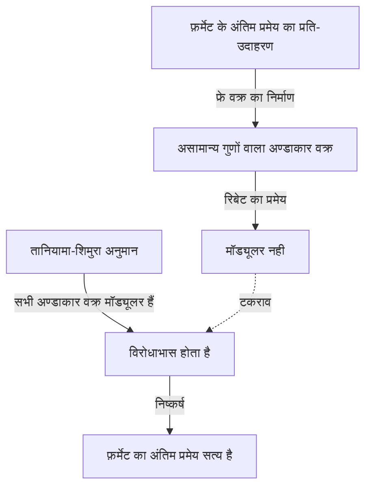

## परिचय

गणित के इतिहास में, कुछ ही कहानियाँ इसके जितनी नाटकीय और प्रेरक हैं। ब्रिटिश गणितज्ञ **[एंड्रयू विल्स](https://kenji.blog/hi/p/wiles/)** ([Andrew Wiles](https://kenji.blog/hi/p/wiles/)) ने "फ़र्मेट का अंतिम प्रमेय" ([Fermat's Last Theorem](https://kenji.blog/hi/p/fermats-last-theorem/)) को सिद्ध करने की स्मारकीय उपलब्धि हासिल की, जो 350 से अधिक वर्षों से अनसुलझी समस्या बनी हुई थी।

उनके जीवन की यात्रा एक फिल्म की तरह लगती है, जिसकी शुरुआत एक रोमांटिक बचपन के सपने से होती है, जिसके बाद सात साल का एकांत, गुप्त शोध, एक खामी की विनाशकारी खोज और एक चमत्कारी वापसी होती है। यह लेख विल्स के जीवन के प्रसंगों और उनके द्वारा किए गए गहन गणितीय उपलब्धियों पर प्रकाश डालता है।

## एक लड़के का सपना: 10 साल की उम्र में एक मुलाकात

[एंड्रयू विल्स](https://kenji.blog/hi/p/wiles/) का जन्म 11 अप्रैल, 1953 को कैम्ब्रिज, इंग्लैंड में हुआ था। उनकी नियति तब तय हो गई थी जब वह केवल 10 वर्ष के थे। अपने स्थानीय पुस्तकालय में, उन्होंने "मेन ऑफ़ मैथमेटिक्स" (ई. टी. बेल द्वारा) नामक गणित की एक पुस्तक उठाई।

उस पुस्तक में, उनका सामना गणित के इतिहास में सबसे महान रहस्य माने जाने वाले रहस्य से हुआ: फ़र्मेट का अंतिम प्रमेय। यह वह प्रसिद्ध प्रमेय है जहाँ फ्रांसीसी गणितज्ञ [पियरे डी फ़र्मेट](https://kenji.blog/hi/p/fermat/) ने एक पुस्तक के हाशिये में लिखा था, "मेरे पास इस प्रस्ताव का वास्तव में एक अद्भुत प्रमाण है जिसे शामिल करने के लिए यह हाशिया बहुत संकीर्ण है।"

एक 10 वर्षीय लड़के के रूप में, विल्स इस बात से गहराई से मोहित थे कि प्रमेय कितना सरल दिखता था, फिर भी कैसे इसने सदियों से महान गणितज्ञों के प्रयासों को विफल कर दिया था। "मैं इस प्रमेय को सिद्ध करने वाला पहला व्यक्ति बनूंगा," लड़के ने खुद से कसम खाई। यह **विशुद्ध जुनून** उनके शेष जीवन के लिए प्रेरक शक्ति बन गया।

## फ़र्मेट का अंतिम प्रमेय क्या है?

फ़र्मेट के अंतिम प्रमेय को निम्नलिखित बहुत ही सरल सूत्र द्वारा व्यक्त किया जाता है:

$$
x^n + y^n = z^n \quad (\text{जहाँ } n \ge 3 \text{ एक पूर्णांक है})
$$

यह बताता है कि कोई धनात्मक पूर्णांक समाधान $(x, y, z)$ नहीं हैं जो इस समीकरण को संतुष्ट करते हों। जब $n = 2$ होता है, तो इसे पाइथागोरस प्रमेय के रूप में जाना जाता है, और इसके अनंत रूप से कई समाधान (पाइथागोरस त्रिक) हैं। हालाँकि, फ़र्मेट ने दावा किया कि जब $n$ 3 या उससे अधिक होता है, तो यह कभी भी सत्य नहीं होता है।

हालाँकि प्रस्ताव एक मध्य विद्यालय के छात्र के लिए भी समझने योग्य लगता है, इसने यूलर, सोफी जर्मेन और कुमर जैसे इतिहास में अपनी छाप छोड़ने वाले जीनियस गणितज्ञों द्वारा भी पूर्ण प्रमाण का विरोध किया।

## अण्डाकार वक्र और मॉड्यूलर रूपों के बीच का पुल: तानियामा-शिमुरा अनुमान

1980 के दशक में, जब विल्स ने कैम्ब्रिज और ऑक्सफोर्ड में अपना शोध उन्नत किया था और अंततः संयुक्त राज्य अमेरिका में प्रिंसटन विश्वविद्यालय में प्रोफेसर बन गए, गणितीय दुनिया में फ़र्मेट के अंतिम प्रमेय को हल करने के लिए एक पूरी तरह से नया दृष्टिकोण उभरा। यह "तानियामा-शिमुरा अनुमान" (Taniyama-Shimura Conjecture) से संबंध था।

तानियामा-शिमुरा अनुमान एक गहरा गणितीय अनुमान है जिसमें कहा गया है कि "तर्कसंगत संख्याओं के क्षेत्र में सभी अण्डाकार वक्र मॉड्यूलर हैं", जो पहली नज़र में फ़र्मेट के प्रमेय से असंबंधित लगता है। हालाँकि, 1984 में, गेरहार्ड फ्रे ने यह विचार प्रस्तावित किया कि "यदि फ़र्मेट का अंतिम प्रमेय गलत है (जिसका अर्थ है कि कोई समाधान मौजूद है), तो इससे बनाया गया विशेष अण्डाकार वक्र (फ्रे वक्र) मॉड्यूलर नहीं होगा, इस प्रकार तानियामा-शिमुरा अनुमान का खंडन करता है।"

1986 में स्थिति नाटकीय रूप से बदल गई जब केन रिबेट ने कठोरता से फ्रे के विचार (रिबेट का प्रमेय) को सिद्ध किया। दूसरे शब्दों में, आश्चर्यजनक तथ्य स्थापित किया गया कि "यदि आप तानियामा-शिमुरा अनुमान को सिद्ध करते हैं, तो फ़र्मेट का अंतिम प्रमेय स्वचालित रूप से सिद्ध हो जाता है।"

यह खबर सुनकर विल्स को एहसास हुआ कि उनके बचपन के सपने को पूरा करने का समय आ गया है। उन्होंने अपने पिछले सभी शोधों को छोड़ने और इस अनुमान को सिद्ध करने के लिए अपनी पूरी ऊर्जा समर्पित करने का फैसला किया।

## गुप्त शोध: अटारी में 7 साल

आधुनिक गणितीय शोध आमतौर पर कई शोधकर्ताओं के सहयोग और विचारों को साझा करके किया जाता है। हालाँकि, विल्स ने ठीक विपरीत रास्ता चुना। उन्होंने अपने शोध को पूरी तरह से गुप्त रखा, खुद को अपने घर की अटारी में एकांत में रखा और पूरी तरह से अकेले ही प्रमाण पर काम किया।

उनके इस रहस्य के कई कारण थे। एक तो यह था कि अगर यह ज्ञात हो जाता कि वह फ़र्मेट के अंतिम प्रमेय जैसी प्रसिद्ध समस्या पर काम कर रहे थे, तो उन्हें मीडिया और अन्य शोधकर्ताओं के निरंतर हस्तक्षेप का सामना करना पड़ता, जिससे उन्हें ध्यान केंद्रित करने से रोका जा सकता था। दूसरा प्रतियोगियों को उनके विचारों को चुराने से रोकना था।

आश्चर्यजनक रूप से सात वर्षों तक, विल्स ने व्याख्यान देने जैसे न्यूनतम कर्तव्यों को निभाने के अलावा, अपना सारा शेष समय अपनी अटारी में सोचने में बिताया। उनका सबसे बड़ा हथियार एक जबरदस्त एकाग्रता और दृढ़ता थी, जो एक चट्टान की दरारों में गहराई तक प्रवेश करने के समान थी। उन्होंने कोलिवैगिन-फ्लैच विधि (Kolyvagin-Flach method) जैसे नए सिद्धांतों का पूरी तरह से उपयोग करते हुए धीरे-धीरे प्रमाण के पहाड़ पर चढ़ाई की।

## कैम्ब्रिज में ऐतिहासिक घोषणा

जून 1993 में, कैम्ब्रिज विश्वविद्यालय के न्यूटन इंस्टीट्यूट में आयोजित एक अंतरराष्ट्रीय संख्या सिद्धांत सम्मेलन में, विल्स ने अंततः अपने परिणाम प्रस्तुत किए। सम्मेलन तीन दिनों तक चला, और उनके व्याख्यान का नाम "मॉड्यूलर फॉर्म, अण्डाकार वक्र और गैलवा अभ्यावेदन" था।

हालाँकि, जैसे-जैसे उनका व्याख्यान आगे बढ़ा, दर्शकों में गणितज्ञों को यह एहसास होने लगा कि वह क्या सिद्ध करने की कोशिश कर रहे थे। कमरे का माहौल धीरे-धीरे गर्म हो गया, और अंतिम दिन के व्याख्यान तक, एक भारी भीड़ उमड़ पड़ी।

व्याख्यान के अंत में, विल्स ने ब्लैकबोर्ड पर फ़र्मेट के अंतिम प्रमेय का सूत्र लिखा और चुपचाप घोषणा की, "मुझे लगता है कि मैं यहाँ रुकूंगा।" उस क्षण, कमरा तालियों की गड़गड़ाहट से गूंज उठा। दुनिया भर के मीडिया ने भारी रिपोर्ट दी, "फ़र्मेट का अंतिम प्रमेय अंततः सिद्ध हुआ!" जिससे विल्स अचानक एक सेलिब्रिटी बन गए।

## बुरे सपने की शुरुआत: प्रमाण में एक खामी

हालाँकि, खुशी का समय लंबे समय तक नहीं रहा। घोषणा के बाद कठोर सहकर्मी समीक्षा प्रक्रिया के दौरान, प्रमाण के एक महत्वपूर्ण हिस्से में एक घातक खामी का पता चला। विशेष रूप से, यह पाया गया कि एक निश्चित विशिष्ट यूलर प्रणाली पर कोलिवैगिन-फ्लैच विधि लागू करते समय ऊपरी सीमा का अनुमान अपर्याप्त था।

प्रारंभ में, विल्स ने सोचा कि वह इसे जल्दी से ठीक कर सकते हैं, लेकिन समस्या कल्पना से कहीं अधिक गहरी थी और उसने गणितीय नींव को ही प्रभावित किया। जबकि दुनिया भर के गणितज्ञ उनकी सुधारात्मक कार्रवाई का उत्सुकता से इंतजार कर रहे थे, समय निर्दयता से बीतता गया।

विल्स ने दबाव और निराशा से लगभग कुचले जाते हुए एक वर्ष से अधिक समय तक इस खामी से संघर्ष करना जारी रखा। "उस समय की मानसिक पीड़ा अवर्णनीय है," उन्होंने बाद में बताया। उन्हें अंततः इस भयानक संभावना का सामना करना पड़ा कि प्रमाण पूरी तरह से ध्वस्त हो गया होगा।

## रिचर्ड टेलर के साथ गठबंधन और "जादुई क्षण"

अकेले लड़ने की सीमा को महसूस करते हुए, विल्स ने अपने पूर्व छात्र और प्रतिभाशाली संख्या सिद्धांतकार, रिचर्ड टेलर (Richard Taylor) को खामी को दूर करने के लिए संयुक्त रूप से काम करने के लिए बुलाया। हालाँकि, दोनों के महीनों के हताश प्रयासों के बाद भी, वे दीवार को नहीं तोड़ सके।

सितंबर 1994 में, विल्स ने अंततः हार मानने का फैसला किया और समस्या से दूर जाने से पहले यह बताते हुए एक पेपर लिखने के बारे में सोचा कि वह कहाँ गलत हुए थे। अंतिम प्रयास के रूप में, वह अपने डेस्क पर ठीक से यह व्यवस्थित करने के लिए बैठ गए कि समस्याग्रस्त कोलिवैगिन-फ्लैच विधि ने काम क्यों नहीं किया, और फिर एक चमत्कार हुआ।

अचानक, उनके दिमाग में पहले से छोड़े गए इवासावा सिद्धांत दृष्टिकोण (Iwasawa theory) को इस कोलिवैगिन-फ्लैच विधि के साथ जोड़ने का एक विचार आया। यह शुद्ध रहस्योद्घाटन का क्षण था, जहाँ एक की कमजोरी दूसरे की पूरी तरह से पूरक थी।

> "यह एक अविश्वसनीय रहस्योद्घाटन था। यह इतना सुंदर था, इतना सरल था, और मैं समझ नहीं पा रहा था कि मैं इसे कैसे चूक गया था।" ([एंड्रयू विल्स](https://kenji.blog/hi/p/wiles/))

इस "जादुई क्षण" के लिए धन्यवाद, प्रमाण में खामी को पूरी तरह से ठीक कर दिया गया। अक्टूबर 1994 में, विल्स और टेलर ने दो सुधारे गए पेपर प्रस्तुत किए, अंततः 350 वर्षों के बाद गणितीय दुनिया के सबसे बड़े रहस्य को पूरी तरह से समाप्त कर दिया।

## विल्स की उपलब्धि गणितीय दुनिया के लिए क्या लाई

विल्स द्वारा फ़र्मेट के अंतिम प्रमेय का प्रमाण केवल एक कठिन समस्या का समाधान नहीं था। प्रमाण प्रक्रिया के दौरान उन्होंने जिन गणितीय विधियों का निर्माण और विकास किया, उन्होंने आधुनिक संख्या सिद्धांत, विशेष रूप से विशाल एकीकृत गणितीय सिद्धांत में बहुत योगदान दिया, जिसे "लैंगलैंड्स प्रोग्राम" (Langlands Program) के रूप में जाना जाता है।

उनके प्रमाण ने दिखाया कि तानियामा-शिमुरा अनुमान (सेमीस्टेबल मामले में) सही था, यह स्थापित करते हुए कि संख्या सिद्धांत के पूरी तरह से अलग क्षेत्र (मॉड्यूलर रूप और अण्डाकार वक्र) एक गहरे स्तर पर जुड़े हुए हैं। बाद में, 2001 में, अन्य गणितज्ञों ने संपूर्ण तानियामा-शिमुरा अनुमान का पूर्ण प्रमाण प्राप्त किया।

इस उपलब्धि के लिए, विल्स को फील्ड्स मेडल विशेष श्रद्धांजलि और एबेल पुरस्कार सहित कई प्रतिष्ठित पुरस्कार मिले, और ब्रिटिश शाही परिवार द्वारा उन्हें नाइटहुड (Sir) की उपाधि से सम्मानित किया गया।

## निष्कर्ष

[एंड्रयू विल्स](https://kenji.blog/hi/p/wiles/) की कहानी शुद्ध जिज्ञासा और एक अदम्य भावना द्वारा लाए गए मनुष्य की अनंत संभावनाओं को प्रदर्शित करती है। 10 साल के लड़के द्वारा पाले गए **लापरवाह सपने** को कई झटकों पर काबू पाने के बाद दशकों बाद हकीकत में बदल दिया गया।

हालाँकि फ़र्मेट का अंतिम प्रमेय हल हो गया है, कई गणितज्ञ अगली सच्चाई की तलाश में विल्स द्वारा खोले गए उपजाऊ नए गणितीय क्षेत्रों का पता लगाना जारी रखते हैं। उनका नाम [पियरे डी फ़र्मेट](https://kenji.blog/hi/p/fermat/) के साथ मानव बुद्धि के इतिहास में हमेशा के लिए अंकित हो जाएगा।
