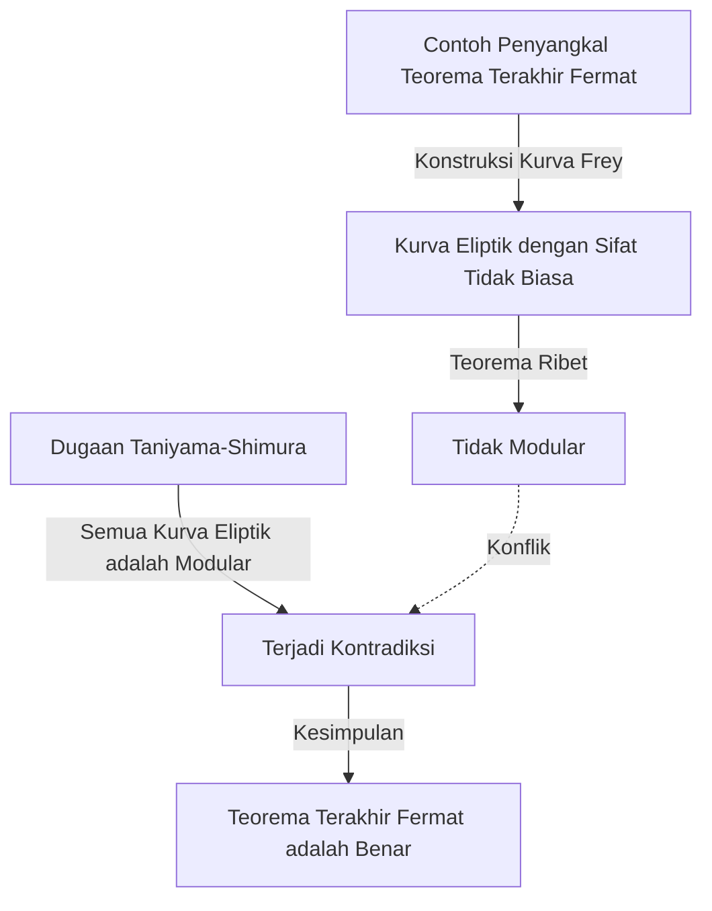

## Pengantar

Dalam sejarah matematika, hanya sedikit cerita sedramatis dan seinspiratif ini. Matematikawan Inggris **[Andrew Wiles](https://kenji.blog/id/p/wiles/)** mencapai prestasi monumental dengan membuktikan "[Teorema Terakhir Fermat](https://kenji.blog/id/p/fermats-last-theorem/)," sebuah masalah yang belum terpecahkan selama lebih dari 350 tahun.

Perjalanan hidupnya terbaca seperti film, dimulai dengan impian masa kecil yang romantis, diikuti oleh tujuh tahun penelitian rahasia yang sepi, penemuan cacat yang menghancurkan, dan kebangkitan ajaib. Artikel ini menyelidiki episode kehidupan Wiles dan pencapaian matematis mendalam yang ia lakukan.

## Impian Seorang Anak Laki-Laki: Pertemuan di Usia 10 Tahun

[Andrew Wiles](https://kenji.blog/id/p/wiles/) lahir pada 11 April 1953, di Cambridge, Inggris. Takdirnya ditentukan ketika dia baru berusia 10 tahun. Di perpustakaan setempat, dia mengambil sebuah buku matematika berjudul "Men of Mathematics" (oleh E. T. Bell).

Dalam buku itu, ia menemukan apa yang dianggap sebagai misteri terbesar dalam sejarah matematika: [Teorema Terakhir Fermat](https://kenji.blog/id/p/fermats-last-theorem/). Ini adalah teorema terkenal di mana matematikawan Prancis [Pierre de Fermat](https://kenji.blog/id/p/fermat/) menulis di pinggir buku, "Saya memiliki demonstrasi yang benar-benar luar biasa tentang proposisi ini, yang pinggirannya terlalu sempit untuk dimuat."

Sebagai bocah 10 tahun, Wiles sangat terpesona oleh betapa sederhananya teorema itu terlihat, namun bagaimana teorema itu telah menggagalkan upaya matematikawan hebat selama berabad-abad. "Saya akan menjadi orang pertama yang membuktikan teorema ini," sumpah anak laki-laki itu pada dirinya sendiri. **Gairah murni** ini menjadi kekuatan pendorong selama sisa hidupnya.

## Apa itu [Teorema Terakhir Fermat](https://kenji.blog/id/p/fermats-last-theorem/)?

[Teorema Terakhir Fermat](https://kenji.blog/id/p/fermats-last-theorem/) diekspresikan dengan rumus yang sangat sederhana berikut ini:

$$
x^n + y^n = z^n \quad (\text{di mana } n \ge 3 \text{ adalah bilangan bulat})
$$

Ini menyatakan bahwa tidak ada solusi bilangan bulat positif $(x, y, z)$ yang memenuhi persamaan ini. Ketika $n = 2$, ini terkenal sebagai teorema [Pythagoras](https://kenji.blog/id/p/pythagoras/), dan ada solusi yang tak terbatas (triple [Pythagoras](https://kenji.blog/id/p/pythagoras/)). Namun, [Fermat](https://kenji.blog/id/p/fermat/) mengklaim bahwa ketika $n$ adalah 3 atau lebih besar, itu tidak pernah berlaku.

Meskipun proposisi tersebut tampaknya dapat dipahami bahkan oleh siswa sekolah menengah, itu menolak bukti lengkap bahkan oleh matematikawan jenius yang meninggalkan jejak mereka dalam sejarah, seperti Euler, Sophie Germain, dan [Kummer](https://kenji.blog/id/p/kummer/).

## Jembatan Antara Kurva Eliptik dan Bentuk Modular: Dugaan Taniyama-Shimura

Pada tahun 1980-an, ketika Wiles telah memajukan penelitiannya di Cambridge dan Oxford dan akhirnya menjadi profesor di Universitas Princeton di Amerika Serikat, pendekatan yang sama sekali baru untuk memecahkan [Teorema Terakhir Fermat](https://kenji.blog/id/p/fermats-last-theorem/) muncul di dunia matematika. Itu adalah hubungan dengan "Dugaan Taniyama-Shimura."

Dugaan Taniyama-Shimura adalah dugaan matematika yang mendalam yang menyatakan bahwa "semua kurva eliptik di atas bidang bilangan rasional adalah modular," yang sekilas tampak tidak terkait dengan Teorema [Fermat](https://kenji.blog/id/p/fermat/). Namun, pada tahun 1984, Gerhard Frey mengusulkan gagasan bahwa "jika [Teorema Terakhir Fermat](https://kenji.blog/id/p/fermats-last-theorem/) salah (artinya ada solusi), kurva eliptik khusus yang dibuat darinya (kurva Frey) tidak akan modular, sehingga bertentangan dengan dugaan Taniyama-Shimura."

Situasi berubah drastis pada tahun 1986 ketika Ken Ribet membuktikan gagasan Frey dengan ketat (Teorema Ribet). Dengan kata lain, fakta menakjubkan ditetapkan bahwa "jika Anda membuktikan dugaan Taniyama-Shimura, [Teorema Terakhir Fermat](https://kenji.blog/id/p/fermats-last-theorem/) otomatis terbukti."

Mendengar berita ini, Wiles menyadari bahwa waktunya telah tiba untuk mewujudkan impian masa kecilnya. Ia memutuskan untuk meninggalkan semua penelitian sebelumnya dan mencurahkan seluruh energinya untuk membuktikan dugaan ini.

## Penelitian Rahasia: 7 Tahun di Loteng

Penelitian matematika modern biasanya dilakukan oleh beberapa peneliti yang berkolaborasi dan berbagi ide. Namun, Wiles memilih jalur yang berlawanan. Dia merahasiakan penelitiannya sepenuhnya, mengasingkan diri di loteng rumahnya, dan mengerjakan pembuktian sepenuhnya sendirian.

Ada beberapa alasan kerahasiaannya. Salah satunya adalah jika diketahui bahwa ia sedang mengerjakan masalah setenar [Teorema Terakhir Fermat](https://kenji.blog/id/p/fermats-last-theorem/), ia akan menghadapi campur tangan terus-menerus dari media dan peneliti lain, mencegahnya berkonsentrasi. Alasan lainnya adalah untuk mencegah pesaing mencuri idenya.

Selama tujuh tahun yang menakjubkan, Wiles menghabiskan semua sisa waktunya berpikir di lotengnya, selain melakukan tugas minimal seperti memberi kuliah. Senjata terbesarnya adalah konsentrasi dan keuletan yang luar biasa, mirip dengan menembus jauh ke dalam celah-celah batu. Dia perlahan mendaki gunung pembuktian, sepenuhnya memanfaatkan teori-teori baru seperti metode Kolyvagin-Flach.

## Pengumuman Bersejarah di Cambridge

Pada Juni 1993, pada konferensi teori bilangan internasional yang diadakan di Institut Newton Universitas Cambridge, Wiles akhirnya mempresentasikan hasilnya. Konferensi berlangsung selama tiga hari, dan kuliahnya memiliki judul yang tampaknya sederhana, "Bentuk Modular, Kurva Eliptik, dan Representasi [Galois](https://kenji.blog/id/p/galois/)."

Namun, seiring berjalannya kuliah, ahli matematika di antara hadirin mulai menyadari apa yang dia coba buktikan. Suasana di dalam ruangan berangsur-angsur memanas, dan pada kuliah hari terakhir, kerumunan yang meluap menyerbu masuk.

Di akhir kuliah, Wiles menulis rumus [Teorema Terakhir Fermat](https://kenji.blog/id/p/fermats-last-theorem/) di papan tulis dan diam-diam mengumumkan, "Saya rasa saya akan berhenti di sini." Pada saat itu, ruangan meletus dalam tepuk tangan meriah. Media di seluruh dunia dengan gencar memberitakan, "[Teorema Terakhir Fermat](https://kenji.blog/id/p/fermats-last-theorem/) akhirnya terbukti!" membuat Wiles menjadi selebriti mendadak.

## Mimpi Buruk Dimulai: Cacat dalam Pembuktian

Namun, waktu suka cita tidak berlangsung lama. Selama proses tinjauan sejawat yang ketat setelah pengumuman, cacat fatal ditemukan di bagian penting dari pembuktian. Secara spesifik, ditemukan bahwa estimasi batas atas tidak cukup saat menerapkan metode Kolyvagin-Flach ke sistem Euler spesifik tertentu.

Awalnya, Wiles berpikir dia bisa memperbaikinya dengan cepat, tetapi masalahnya jauh lebih dalam dari yang dibayangkan dan memengaruhi fondasi matematika itu sendiri. Sementara matematikawan di seluruh dunia dengan penuh semangat menunggu koreksinya, waktu berlalu tanpa belas kasihan.

Wiles terus berjuang dengan cacat ini selama lebih dari setahun, hampir hancur oleh tekanan dan keputusasaan. "Penderitaan mental saat itu tak terlukiskan," ceritanya kemudian. Dia akhirnya harus menghadapi kemungkinan mengerikan bahwa bukti itu mungkin telah runtuh sepenuhnya.

## Aliansi dengan Richard Taylor dan "Momen Ajaib"

Merasakan batas berjuang sendirian, Wiles memanggil mantan muridnya dan ahli teori bilangan brilian, Richard Taylor, untuk bersama-sama berupaya memperbaiki cacat tersebut. Namun, bahkan setelah berbulan-bulan upaya putus asa oleh keduanya, mereka tidak bisa menembus dinding.

Pada bulan September 1994, Wiles akhirnya memutuskan untuk menyerah dan berpikir untuk menulis makalah yang menjelaskan di mana kesalahannya sebelum menjauh dari masalah. Sebagai upaya terakhir, ia duduk di mejanya untuk mengatur persis mengapa metode Kolyvagin-Flach yang bermasalah tidak berhasil, dan kemudian keajaiban terjadi.

Tiba-tiba, sebuah ide terlintas di benaknya untuk menggabungkan pendekatan teori Iwasawa yang sebelumnya diabaikan dengan metode Kolyvagin-Flach ini. Itu adalah momen pencerahan murni, di mana kelemahan yang satu melengkapi yang lain dengan sempurna.

> "Itu adalah pencerahan yang luar biasa. Sangat indah, sangat sederhana, dan saya tidak mengerti bagaimana saya bisa melewatkannya." ([Andrew Wiles](https://kenji.blog/id/p/wiles/))

Berkat "momen ajaib" ini, cacat dalam pembuktian berhasil diperbaiki sepenuhnya. Pada bulan Oktober 1994, Wiles dan Taylor menyerahkan dua makalah yang dikoreksi, akhirnya mengakhiri misteri terbesar di dunia matematika setelah 350 tahun.

## Apa yang Pencapaian Wiles Bawa ke Dunia Matematika

Bukti Wiles tentang [Teorema Terakhir Fermat](https://kenji.blog/id/p/fermats-last-theorem/) bukan sekadar penyelesaian satu masalah sulit. Metode matematika yang dia ciptakan dan kembangkan selama proses pembuktian berkontribusi sangat besar pada teori bilangan modern, terutama pada teori matematika terpadu yang luas yang dikenal sebagai "Program Langlands."

Buktinya menunjukkan bahwa dugaan Taniyama-Shimura (dalam kasus semistabil) adalah benar, menetapkan bahwa bidang teori bilangan yang sama sekali berbeda (bentuk modular dan kurva eliptik) terhubung pada tingkat yang dalam. Belakangan, pada tahun 2001, matematikawan lain mencapai bukti lengkap dari seluruh dugaan Taniyama-Shimura.

Atas pencapaian ini, Wiles menerima banyak penghargaan bergengsi, termasuk penghormatan khusus Medali Fields dan Hadiah [Abel](https://kenji.blog/id/p/abel/), dan dianugerahi gelar kebangsawanan (Sir) oleh keluarga kerajaan Inggris.

## Kesimpulan

Kisah [Andrew Wiles](https://kenji.blog/id/p/wiles/) menunjukkan kemungkinan tak terbatas dari manusia yang ditimbulkan oleh rasa ingin tahu yang murni dan semangat yang gigih. Impian yang tampaknya **gegabah** yang dipendam oleh seorang anak berusia 10 tahun menjadi kenyataan beberapa dekade kemudian, mengatasi banyak kemunduran.

Meskipun [Teorema Terakhir Fermat](https://kenji.blog/id/p/fermats-last-theorem/) telah dipecahkan, banyak ahli matematika terus menjelajahi bidang matematika baru yang subur yang dibuka oleh Wiles untuk mencari kebenaran berikutnya. Namanya, bersama dengan [Pierre de Fermat](https://kenji.blog/id/p/fermat/), akan selamanya terukir dalam sejarah kecerdasan manusia.
