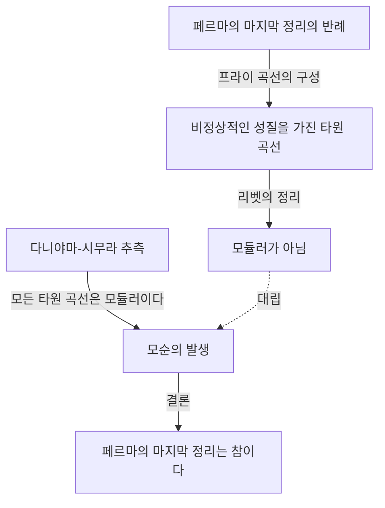

## 머리말

수학의 역사에서 이토록 극적이고 감동적인 이야기는 찾아보기 힘듭니다. 영국의 수학자 **[앤드루 와일즈](https://kenji.blog/ko/p/wiles/)** ([Andrew Wiles](https://kenji.blog/ko/p/wiles/))는 350년 이상 아무도 풀지 못했던 '[페르마의 마지막 정리](https://kenji.blog/ko/p/fermats-last-theorem/)'를 증명하는 위업을 달성했습니다.

그의 인생은 어린 시절의 낭만적인 꿈에서 시작되어 7년간의 고독하고 비밀스러운 연구, 그리고 절망적인 결함의 발견에서 기적적인 부활에 이르기까지 그야말로 영화 같은 궤적을 그리고 있습니다. 본 기사에서는 와일즈의 생애에 얽힌 에피소드와 그가 이룩한 수학적 업적에 대해 자세히 해설합니다.

## 소년 시절의 꿈: 10세 때의 만남

[앤드루 와일즈](https://kenji.blog/ko/p/wiles/)는 1953년 4월 11일 영국 케임브리지에서 태어났습니다. 그의 운명이 결정된 것은 그가 불과 10살 때였습니다. 동네 도서관에서 한 권의 수학책, '수학의 거인들'(에릭 템플 벨 저)을 집어 든 것입니다.

그 책 속에서 그는 수학 역사상 최대의 수수께끼로 여겨지던 '[페르마의 마지막 정리](https://kenji.blog/ko/p/fermats-last-theorem/)'를 만났습니다. 프랑스의 수학자 [피에르 드 페르마](https://kenji.blog/ko/p/fermat/)가 책의 여백에 "나는 이 명제의 참으로 놀라운 증명을 가지고 있지만, 여백이 너무 좁아 여기에 적을 수는 없다"라고 남긴 그 유명한 정리입니다.

10살 소년이었던 와일즈는 이 정리가 얼마나 단순해 보이는지, 그러나 그것이 수세기에 걸쳐 위대한 수학자들의 도전을 어떻게 물리쳐 왔는지를 알고 강한 매력을 느꼈습니다. "내가 이 정리를 증명하는 첫 번째 사람이 되겠다"고 소년은 마음속으로 맹세했습니다. 이 **순수한 열정** 이 그의 이후 인생을 움직이는 원동력이 되었습니다.

## [페르마의 마지막 정리](https://kenji.blog/ko/p/fermats-last-theorem/)란

[페르마의 마지막 정리](https://kenji.blog/ko/p/fermats-last-theorem/)는 다음과 같은 매우 단순한 수식으로 표현됩니다.

$$
x^n + y^n = z^n \quad (\text{단, } n \ge 3 \text{ 인 정수})
$$

이 방정식을 만족하는 양의 정수 쌍 $(x, y, z)$ 는 존재하지 않는다는 것입니다. $n = 2$ 인 경우는 피타고라스의 정리로 잘 알려져 있으며, 무수히 많은 해(피타고라스 수)가 존재합니다. 그러나 $n$ 이 3 이상인 경우에는 결코 성립하지 않는다는 것이 페르마의 주장이었습니다.

언뜻 보면 중학생도 이해할 수 있을 것 같은 이 명제는 오일러나 소피 제르맹, 쿠머와 같은 역사에 이름을 남긴 천재 수학자들을 상대로도 완전한 증명에 이르지 못했습니다.

## 타원 곡선과 모듈러 형식의 가교: 다니야마-시무라 추측

와일즈가 케임브리지 대학교와 옥스퍼드 대학교에서 연구를 진행하고, 이윽고 미국 프린스턴 대학교의 교수가 된 1980년대, [페르마의 마지막 정리](https://kenji.blog/ko/p/fermats-last-theorem/)를 풀기 위한 완전히 새로운 접근 방식이 수학계에 등장했습니다. 그것이 '다니야마-시무라 추측'과의 연결 고리입니다.

다니야마-시무라 추측이란 "모든 유리수체 상의 타원 곡선은 모듈러이다"라는, 언뜻 보기에 페르마의 정리와는 무관해 보이는 깊은 수학의 추측입니다. 그러나 1984년 게르하르트 프라이가 "만약 [페르마의 마지막 정리](https://kenji.blog/ko/p/fermats-last-theorem/)가 거짓이라면(즉 해가 존재한다면), 거기서 만들어지는 특수한 타원 곡선(프라이 곡선)은 모듈러가 아니기 때문에 다니야마-시무라 추측에 반한다"라는 아이디어를 제창했습니다.

그 후 1986년에 켄 리벳이 이 프라이의 아이디어를 엄밀하게 증명(리벳의 정리)함으로써 사태는 급변합니다. 즉, "다니야마-시무라 추측을 증명하면 자동으로 [페르마의 마지막 정리](https://kenji.blog/ko/p/fermats-last-theorem/)도 증명된다"라는 놀라운 사실이 확립된 것입니다.

이 소식을 들은 와일즈는 어릴 적 꿈을 실현할 때가 왔음을 깨달았습니다. 그는 그때까지의 자신의 연구를 모두 던져버리고 이 추측의 증명에 전력을 쏟기로 결심합니다.

## 비밀 연구: 7년간의 다락방

현대의 수학 연구는 일반적으로 여러 연구자가 협력하고 아이디어를 공유하며 진행됩니다. 그러나 와일즈는 전혀 반대의 길을 선택했습니다. 그는 자신의 연구를 완전히 비밀에 부치고, 자택의 다락방에 틀어박혀 단독으로 증명에 몰두한 것입니다.

그가 비밀주의를 고수한 이유는 몇 가지가 있습니다. 하나는 [페르마의 마지막 정리](https://kenji.blog/ko/p/fermats-last-theorem/)라는 너무나도 유명한 문제에 매달려 있다는 사실이 알려지면 언론이나 다른 연구자들로부터 끊임없는 간섭을 받게 되어 집중할 수 없을 것이라고 생각했기 때문입니다. 다른 하나는 경쟁자에게 아이디어를 빼앗기는 것을 막기 위해서였습니다.

7년이라는 엄청난 시간 동안 와일즈는 강의 등의 최소한의 직무를 소화하면서 나머지 모든 시간을 다락방에서의 사색에 바쳤습니다. 그의 가장 큰 무기는 암석의 균열 속으로 깊이 파고드는 것과 같은 압도적인 집중력과 집념이었습니다. 그는 콜리바긴-플라흐 방법이라 불리는 새로운 이론 등을 구사하며 조금씩 증명의 산을 올랐습니다.

## 케임브리지에서의 역사적 발표

1993년 6월, 케임브리지 대학교 뉴턴 연구소에서 열린 정수론 국제 회의에서 와일즈는 마침내 그 성과를 발표했습니다. 회의는 3일간 이어졌으며, 제목은 '모듈러 형식, 타원 곡선, 갈루아 표현'이라는 겉보기엔 평범한 것이었습니다.

그러나 그의 강연이 진행될수록 청중인 수학자들은 그가 무엇을 증명하려 하는지 눈치채기 시작했습니다. 교실의 공기는 점차 달아올랐고, 마지막 날의 강연에는 다 들어갈 수 없을 정도로 많은 청중이 몰려들었습니다.

그리고 강연의 마지막, 와일즈는 칠판에 [페르마의 마지막 정리](https://kenji.blog/ko/p/fermats-last-theorem/) 수식을 적고 "여기서 마치겠습니다"라고 조용히 선언했습니다. 그 순간, 강연장은 떠나갈 듯한 기립 박수에 휩싸였습니다. 전 세계 언론이 "[페르마의 마지막 정리](https://kenji.blog/ko/p/fermats-last-theorem/), 마침내 증명되다!"라고 대대적으로 보도했고, 와일즈는 일약 시대의 총아가 되었습니다.

## 악몽의 시작: 증명의 결함

그러나 환희의 시간은 오래가지 않았습니다. 발표 후의 엄밀한 심사 과정에서 증명의 중요한 부분에 치명적인 결함이 발견된 것입니다. 구체적으로는 콜리바긴-플라흐 방법을 특정 오일러 계에 적용하는 부분에서 상한의 평가가 불충분하다는 사실이 판명되었습니다.

당초 와일즈는 금방 수정할 수 있을 것이라 생각했지만, 문제는 상상 이상으로 깊었고 수학적인 근간과 관련된 것이었습니다. 전 세계의 수학자들이 그의 수정을 기다리는 가운데 시간은 무정하게 흘러갔습니다.

와일즈는 압박감과 절망에 짓눌릴 것 같으면서도 1년 이상 이 결함과 계속 씨름했습니다. "그때의 정신적 고통은 말로 다 표현할 수 없다"고 훗날 그는 회술했습니다. 마침내 그는 증명이 완전히 붕괴되었을지도 모른다는 공포와 직면하게 되었습니다.

## 리처드 테일러와의 공투, 그리고 기적의 번뜩임

고독한 싸움에 한계를 느낀 와일즈는 옛 제자이자 우수한 정수론 학자인 리처드 테일러를 불러들여 공동으로 결함의 수정에 착수했습니다. 그러나 두 사람이 수개월에 걸쳐 필사적으로 노력해도 벽을 허물 수는 없었습니다.

1994년 9월, 와일즈는 마침내 포기할 결심을 하고, 자신이 어디서 틀렸는지를 설명하는 논문을 쓴 뒤 이 문제에서 손을 떼려 하고 있었습니다. 마지막으로, 문제가 되었던 콜리바긴-플라흐 방법이 왜 작동하지 않았는지를 정리하려고 책상에 앉은 그 순간, 기적이 일어났습니다.

돌연 그의 뇌리에, 예전에 포기했던 이와사와 이론의 접근법과 이 콜리바긴-플라흐 방법을 결합한다는 아이디어가 번뜩인 것입니다. 한쪽의 약점을 다른 한쪽이 완벽하게 보완한다는, 그야말로 하늘의 계시와도 같은 순간이었습니다.

> "그것은 믿을 수 없는 번뜩임이었습니다. 너무나도 아름답고 너무나도 단순해서, 왜 지금까지 놓치고 있었는지 이해할 수 없을 정도였습니다." ([앤드루 와일즈](https://kenji.blog/ko/p/wiles/))

이 '마법의 순간'으로 인해 증명의 결함은 완전히 수정되었습니다. 1994년 10월, 와일즈와 테일러는 수정된 2편의 논문을 제출했고, 350년에 걸친 수학계 최대의 수수께끼는 마침내 완전히 종지부를 찍게 된 것입니다.

## 와일즈의 업적이 수학계에 가져온 것

와일즈에 의한 [페르마의 마지막 정리](https://kenji.blog/ko/p/fermats-last-theorem/) 증명은 단순히 하나의 난제를 해결한 것만이 아니었습니다. 그가 증명 과정에서 만들어 내고 발전시킨 수학적 수법은 현대의 정수론, 특히 '랭글랜즈 프로그램'이라 불리는 광대한 수학의 통일 이론에 다대한 공헌을 가져왔습니다.

그의 증명으로 인해 다니야마-시무라 추측(반안정적인 경우)이 옳다는 것이 밝혀졌고, 정수론의 전혀 다른 분야(모듈러 형식과 타원 곡선)가 깊은 수준에서 연결되어 있다는 것이 확정된 것입니다. 그 후 2001년에는 다른 수학자들에 의해 다니야마-시무라 추측의 완전한 증명도 달성되었습니다.

와일즈는 이 공적으로 필즈상 특별상, 아벨상 등 수많은 명예로운 상을 수상했으며, 영국 왕실로부터 기사 작위(Sir)를 수여받았습니다.

## 맺음말

[앤드루 와일즈](https://kenji.blog/ko/p/wiles/)의 이야기는 순수한 호기심과 불굴의 정신이 가져다주는 인간의 무한한 가능성을 보여줍니다. 10살 소년이 품었던 **무모하다고도 할 수 있는 꿈** 은 수십 년의 세월을 거쳐, 수많은 좌절을 극복하고 마침내 현실이 되었습니다.

[페르마의 마지막 정리](https://kenji.blog/ko/p/fermats-last-theorem/)는 풀렸지만, 와일즈가 개척한 새로운 수학의 옥야에서는 지금도 여전히 많은 수학자들이 다음 진리를 찾아 탐구를 계속하고 있습니다. 그의 이름은 [피에르 드 페르마](https://kenji.blog/ko/p/fermat/)와 함께 인류 지성의 역사에 영원히 새겨질 것입니다.
