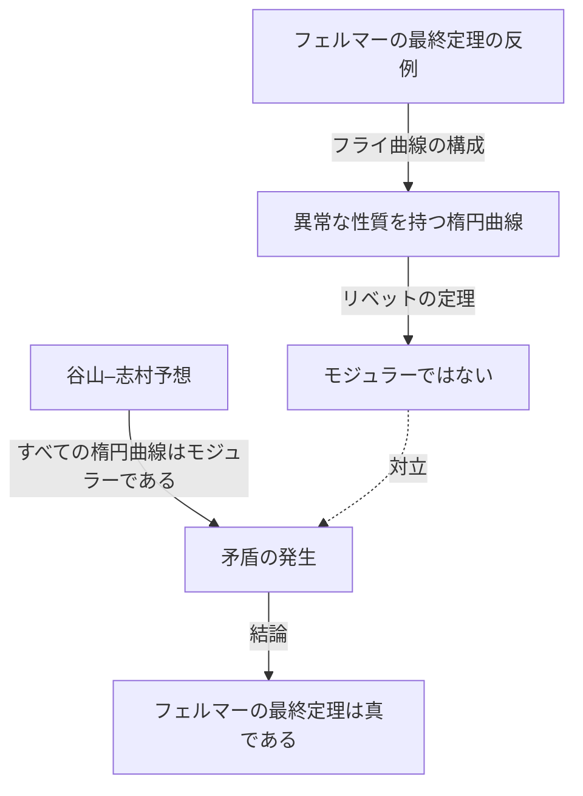

## はじめに

数学の歴史において、これほど劇的で感動的な物語は他に類を見ません。イギリスの数学者、 **アンドリュー・ワイルズ** （Andrew Wiles）は、350年以上にわたり誰にも解かれることのなかった「フェルマーの最終定理」を証明するという偉業を成し遂げました。

彼の人生は、幼少期のロマンチックな夢から始まり、7年間の孤独な秘密の研究、そして絶望的な欠陥の発覚から奇跡的な復活へと至る、まさに映画のような軌跡を描いています。本記事では、ワイルズの生涯のエピソードと、彼が取り組んだ数学的業績について、詳しく解説します。

## 少年時代の夢：10歳の出会い

アンドリュー・ワイルズは1953年4月11日、イギリスのケンブリッジに生まれました。彼の運命が決定づけられたのは、彼がわずか10歳の時でした。地元の図書館で一冊の数学書、『数学の巨人たち』（エリック・テンプル・ベル著）を手に取ったのです。

その本の中で彼は、数学史上最大の謎とされていた「フェルマーの最終定理」に出会います。フランスの数学者ピエール・ド・フェルマーが、本の余白に「私はこの命題の真に驚くべき証明をもっているが、余白が狭すぎるのでここに記すことはできない」と書き残した、あの有名な定理です。

10歳の少年であったワイルズは、この定理がいかにシンプルに見えるか、しかしそれがいかに何世紀にもわたって偉大な数学者たちの挑戦を退けてきたかを知り、強い魅力を感じました。「私はこの定理を証明する最初の人間になる」と、少年は心に誓ったのです。この **純粋な情熱** が、彼のその後の人生を動かす原動力となりました。

## フェルマーの最終定理とは

フェルマーの最終定理は、以下のような非常にシンプルな数式で表されます。

$$
x^n + y^n = z^n \quad (\text{ただし、} n \ge 3 \text{ の整数})
$$

この方程式を満たす正の整数の組 $(x, y, z)$ は存在しない、というものです。 $n = 2$ の場合はピタゴラスの定理としてよく知られており、無数の解（ピタゴラス数）が存在します。しかし、$n$ が3以上の場合は、決して成り立たないというのがフェルマーの主張でした。

一見すると中学生でも理解できそうなこの命題は、オイラーやソフィー・ジェルマン、クンマーといった歴史に名を残す天才数学者たちをもってしても、完全な証明には至りませんでした。

## 楕円曲線とモジュラー形式の架け橋：谷山–志村予想

ワイルズがケンブリッジ大学やオックスフォード大学で研究を進め、やがてアメリカのプリンストン大学の教授となった1980年代、フェルマーの最終定理を解き明かすための全く新しいアプローチが数学界に現れました。それが「谷山–志村予想」との結びつきです。

谷山–志村予想とは、「すべての有理数体上の楕円曲線はモジュラーである」という、一見するとフェルマーの定理とは無関係に見える深い数学の予想です。しかし、1984年にゲルハルト・フライが「もしフェルマーの最終定理が偽である（つまり解が存在する）ならば、そこから作られる特殊な楕円曲線（フライ曲線）は、モジュラーではないため谷山–志村予想に反する」というアイデアを提唱しました。

その後、1986年にケン・リベットがこのフライのアイデアを厳密に証明（リベットの定理）したことで、事態は急変します。つまり、「谷山–志村予想を証明すれば、自動的にフェルマーの最終定理も証明される」という驚くべき事実が確立されたのです。

このニュースを聞いたワイルズは、子供の頃の夢を実現する時が来たと悟りました。彼は、それまでの自分の研究をすべて投げ打ち、この予想の証明に全力を注ぐことを決意します。

## 秘密の研究：7年間の屋根裏部屋

現代の数学研究は、通常は複数の研究者が協力し合い、アイデアを共有しながら進められます。しかし、ワイルズは全く逆の道を選びました。彼は自分の研究を完全に秘密にし、自宅の屋根裏部屋にこもって単独で証明に取り組んだのです。

彼が秘密主義を貫いた理由はいくつかあります。一つは、フェルマーの最終定理というあまりにも有名な問題に取り組んでいることが知られれば、メディアや他の研究者からの絶え間ない干渉を受けることになり、集中できなくなると考えたためです。もう一つは、競争相手にアイデアを奪われることを防ぐためでした。

7年間という途方もない時間、ワイルズは講義などの最低限の職務をこなしながら、残りのすべての時間を屋根裏部屋での思索に費やしました。彼の最大の武器は、岩石の亀裂に深く入り込んでいくような、圧倒的な集中力と執念でした。彼はコリヴァギン＝フラッハ法と呼ばれる新しい理論などを駆使し、少しずつ証明の山を登っていきました。

## ケンブリッジでの歴史的発表

1993年6月、ケンブリッジ大学のニュートン研究所で開かれた数論の国際会議で、ワイルズはついにその成果を発表しました。会議は3日間にわたり、タイトルは「モジュラー形式、楕円曲線、ガロア表現」という一見地味なものでした。

しかし、彼の講演が進むにつれ、聴衆の数学者たちは彼が何を証明しようとしているのかに気づき始めました。教室の空気は次第に熱を帯び、最終日の講演には入りきれないほどの聴衆が押し寄せました。

そして講演の最後、ワイルズは黒板にフェルマーの最終定理の数式を書き、「ここで終わりにしたいと思います」と静かに宣言しました。その瞬間、会場は割れんばかりの拍手喝采に包まれました。世界中のメディアが「フェルマーの最終定理、ついに証明される！」と大々的に報じ、ワイルズは一躍時の人となりました。

## 悪夢の始まり：証明の欠陥

しかし、歓喜の時間は長くは続きませんでした。発表後の厳密な査読の過程で、証明の重要な部分に致命的な欠陥が発見されたのです。具体的には、コリヴァギン＝フラッハ法をある特定のオイラー系に適用する部分において、上限の評価が不十分であることが判明しました。

当初、ワイルズはすぐに修復できると考えていましたが、問題は想像以上に深く、数学的な根幹に関わるものでした。世界中の数学者が彼の修正を待ち望む中、時間は無情にも過ぎていきました。

ワイルズはプレッシャーと絶望に押しつぶされそうになりながら、1年以上にわたってこの欠陥と格闘し続けました。「あの時の精神的苦痛は、言葉では言い表せない」と後に彼は語っています。ついに彼は、証明が完全に崩壊したかもしれないという恐怖と直面することになりました。

## リチャード・テイラーとの共闘と「魔法の瞬間」

孤独な戦いに限界を感じたワイルズは、かつての教え子であり優秀な数論学者であるリチャード・テイラーを呼び寄せ、共同で欠陥の修復に取り掛かりました。しかし、二人が数ヶ月にわたって懸命に努力しても、壁を打ち破ることはできませんでした。

1994年9月、ワイルズはついに諦める決心をし、自分がどこで間違えたのかを説明する論文を書いて、この問題から手を引こうと考えていました。最後に、問題となっていたコリヴァギン＝フラッハ法がなぜ機能しなかったのかを整理しようと机に向かったその時、奇跡が起こりました。

突如として彼の脳裏に、かつて放棄した岩澤理論のアプローチと、このコリヴァギン＝フラッハ法を組み合わせるというアイデアが閃いたのです。一方の弱点をもう一方が完全に補うという、まさに天啓のような瞬間でした。

> 「それは信じられないような閃きでした。あまりにも美しく、あまりにもシンプルで、なぜこれまで見逃していたのか理解できないほどでした。」 （アンドリュー・ワイルズ）

この「魔法の瞬間」により、証明の欠陥は完全に修復されました。1994年10月、ワイルズとテイラーは修正された2編の論文を提出し、350年にわたる数学界の最大の謎は、ついに完全に終符を打たれたのです。

## ワイルズの業績が数学界にもたらしたもの

ワイルズによるフェルマーの最終定理の証明は、単に一つの難問を解決しただけではありませんでした。彼が証明の過程で生み出し、発展させた数学的手法は、現代の数論、特に「ラングランズ・プログラム」と呼ばれる広大な数学の統一理論に多大な貢献をもたらしました。

彼の証明により、谷山–志村予想（半安定な場合）が正しいことが示され、数論の全く異なる分野（モジュラー形式と楕円曲線）が深いレベルで結びついていることが確定したのです。その後、2001年には他の数学者たちによって谷山–志村予想の完全な証明も達成されました。

ワイルズはこの功績により、フィールズ賞の特別賞、アーベル賞など、数多くの名誉ある賞を受賞し、イギリス王室からはナイトの称号（Sir）を授与されました。

## おわりに

アンドリュー・ワイルズの物語は、純粋な好奇心と不屈の精神がもたらす人間の無限の可能性を示しています。10歳の少年が抱いた **無謀とも言える夢** は、数十年の時を経て、幾多の挫折を乗り越え、ついに現実のものとなりました。

フェルマーの最終定理は解かれましたが、ワイルズが切り拓いた新しい数学の沃野では、今もなお多くの数学者たちが次なる真理を求めて探求を続けています。彼の名は、ピエール・ド・フェルマーと共に、人類の知の歴史に永遠に刻まれることでしょう。
