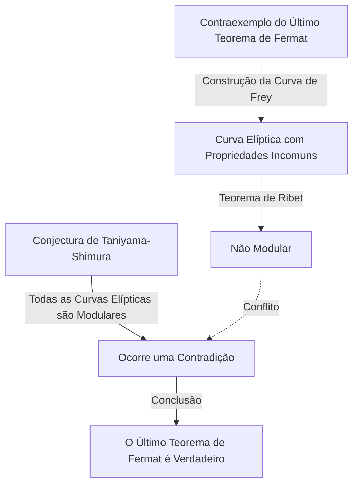

## Introdução

Na história da matemática, poucas histórias são tão dramáticas e inspiradoras como esta. O matemático britânico **Andrew Wiles** alcançou a façanha monumental de provar o "Último Teorema de Fermat", um problema que permaneceu sem solução por mais de 350 anos.

A jornada de sua vida parece um filme, começando com um sonho romântico de infância, seguido por sete anos de pesquisa solitária e secreta, a descoberta devastadora de uma falha e um retorno milagroso. Este artigo investiga os episódios da vida de Wiles e as profundas conquistas matemáticas que ele realizou.

## O sonho de um menino: Um encontro aos 10 anos

Andrew Wiles nasceu em 11 de abril de 1953 em Cambridge, Inglaterra. Seu destino foi traçado quando ele tinha apenas 10 anos. Em sua biblioteca local, ele pegou um livro de matemática intitulado "Homens da Matemática" (por E. T. Bell).

Nesse livro, ele encontrou o que era considerado o maior mistério da história da matemática: o Último Teorema de Fermat. É o famoso teorema em que o matemático francês Pierre de Fermat escreveu à margem de um livro: "Tenho uma demonstração verdadeiramente maravilhosa desta proposição, que esta margem é muito estreita para conter."

Quando menino de 10 anos, Wiles ficou profundamente fascinado por quão simples o teorema parecia, mas por como ele havia frustrado os esforços de grandes matemáticos durante séculos. "Serei a primeira pessoa a provar esse teorema", o menino jurou a si mesmo. Essa **paixão pura** se tornou a força motriz pelo resto de sua vida.

## O que é o Último Teorema de Fermat?

O Último Teorema de Fermat é expresso pela seguinte fórmula muito simples:

$$
x^n + y^n = z^n \quad (\text{onde } n \ge 3 \text{ é um número inteiro})
$$

Ele afirma que não existem soluções inteiras positivas $(x, y, z)$ que satisfaçam esta equação. Quando $n = 2$, é bem conhecido como o teorema de Pitágoras, e existem infinitas soluções (trios pitagóricos). No entanto, Fermat afirmou que quando $n$ é 3 ou maior, isso nunca se sustenta.

Embora a proposição pareça compreensível até para um aluno do ensino médio, ela resistiu a uma prova completa, mesmo por matemáticos geniais que deixaram sua marca na história, como Euler, Sophie Germain e Kummer.

## A ponte entre as curvas elípticas e as formas modulares: A conjectura de Taniyama-Shimura

Na década de 1980, quando Wiles havia avançado em sua pesquisa em Cambridge e Oxford e, finalmente, se tornou professor na Universidade de Princeton, nos Estados Unidos, uma abordagem completamente nova para resolver o Último Teorema de Fermat surgiu no mundo matemático. Era uma conexão com a "Conjectura de Taniyama-Shimura".

A conjectura de Taniyama-Shimura é uma conjectura matemática profunda afirmando que "todas as curvas elípticas sobre o corpo dos números racionais são modulares", o que, à primeira vista, parece não ter relação com o Teorema de Fermat. No entanto, em 1984, Gerhard Frey propôs a ideia de que "se o Último Teorema de Fermat for falso (o que significa que uma solução existe), a curva elíptica especial criada a partir dele (a curva de Frey) não seria modular, contradizendo assim a conjectura de Taniyama-Shimura".

A situação mudou dramaticamente em 1986, quando Ken Ribet provou rigorosamente a ideia de Frey (o Teorema de Ribet). Em outras palavras, estabeleceu-se o fato surpreendente de que "se você provar a conjectura de Taniyama-Shimura, o Último Teorema de Fermat é automaticamente provado".

Ao ouvir essa notícia, Wiles percebeu que havia chegado a hora de realizar seu sonho de infância. Ele decidiu abandonar todas as suas pesquisas anteriores e dedicar toda a sua energia para provar essa conjectura.

## Pesquisa secreta: 7 anos no sótão

A pesquisa matemática moderna geralmente é conduzida por vários pesquisadores colaborando e compartilhando ideias. No entanto, Wiles escolheu exatamente o caminho oposto. Ele manteve sua pesquisa em completo segredo, isolou-se no sótão de sua casa e trabalhou na prova inteiramente sozinho.

Havia várias razões para o seu segredo. Uma era que se soubessem que ele estava trabalhando em um problema tão famoso quanto o Último Teorema de Fermat, ele enfrentaria interferência constante da mídia e de outros pesquisadores, impedindo-o de se concentrar. Outra era para evitar que os concorrentes roubassem suas ideias.

Por surpreendentes sete anos, Wiles passou todo o seu tempo livre pensando em seu sótão, além de realizar tarefas mínimas, como dar palestras. Sua maior arma foi uma concentração e tenacidade avassaladoras, semelhantes a penetrar profundamente nas fendas de uma rocha. Ele escalou lentamente a montanha da prova, utilizando totalmente novas teorias, como o método de Kolyvagin-Flach.

## Anúncio histórico em Cambridge

Em junho de 1993, em uma conferência internacional de teoria dos números realizada no Instituto Newton da Universidade de Cambridge, Wiles finalmente apresentou seus resultados. A conferência durou três dias, e sua palestra teve o título aparentemente modesto de "Formas Modulares, Curvas Elípticas e Representações de Galois".

No entanto, à medida que a sua palestra progredia, os matemáticos na platéia começaram a perceber o que ele estava tentando provar. A atmosfera na sala gradualmente esquentou, e na palestra do último dia, uma multidão transbordante correu para dentro.

No final da palestra, Wiles escreveu a fórmula do Último Teorema de Fermat no quadro-negro e anunciou baixinho: "Acho que vou parar por aqui." Naquele momento, a sala explodiu em aplausos estrondosos. A mídia em todo o mundo relatou amplamente: "Último Teorema de Fermat finalmente provado!", tornando Wiles uma celebridade repentina.

## O pesadelo começa: Uma falha na prova

No entanto, o tempo de alegria não durou muito. Durante o rigoroso processo de revisão por pares após o anúncio, uma falha fatal foi descoberta em uma parte crucial da prova. Especificamente, descobriu-se que a estimativa do limite superior era insuficiente ao aplicar o método de Kolyvagin-Flach a um certo sistema de Euler específico.

Inicialmente, Wiles pensou que poderia consertá-lo rapidamente, mas o problema era muito mais profundo do que o imaginado e afetava o próprio fundamento matemático. Enquanto matemáticos de todo o mundo aguardavam ansiosamente sua correção, o tempo passava impiedosamente.

Wiles continuou a lutar contra essa falha por mais de um ano, quase esmagado pela pressão e pelo desespero. "A agonia mental daquela época é indescritível", relatou ele mais tarde. Ele finalmente teve que enfrentar a terrível possibilidade de que a prova pudesse ter desmoronado completamente.

## A aliança com Richard Taylor e o "Momento Mágico"

Sentindo os limites de lutar sozinho, Wiles convocou seu ex-aluno e brilhante teórico dos números, Richard Taylor, para trabalhar em conjunto no reparo da falha. No entanto, mesmo depois de meses de esforço desesperado por parte dos dois, eles não conseguiram quebrar a parede.

Em setembro de 1994, Wiles finalmente decidiu desistir e pensou em escrever um artigo explicando onde ele errou antes de se afastar do problema. Como última tentativa, ele se sentou à sua mesa para organizar exatamente por que o método problemático de Kolyvagin-Flach não havia funcionado, e então um milagre aconteceu.

De repente, uma ideia passou por sua mente para combinar a abordagem da teoria de Iwasawa anteriormente abandonada com este método de Kolyvagin-Flach. Foi um momento de pura revelação, onde a fraqueza de um complementava perfeitamente o outro.

> "Foi uma revelação inacreditável. Foi tão bonito, tão simples, e eu não conseguia entender como tinha deixado passar." (Andrew Wiles)

Graças a este "momento mágico", a falha na prova foi completamente reparada. Em outubro de 1994, Wiles e Taylor submeteram dois artigos corrigidos, pondo fim ao maior mistério do mundo matemático após 350 anos.

## O que a conquista de Wiles trouxe ao mundo matemático

A prova de Wiles do Último Teorema de Fermat não foi apenas a resolução de um único problema difícil. Os métodos matemáticos que ele criou e desenvolveu durante o processo de prova contribuíram imensamente para a moderna teoria dos números, especialmente para a vasta teoria matemática unificada conhecida como o "Programa de Langlands".

Sua prova mostrou que a conjectura de Taniyama-Shimura (no caso semiestável) estava correta, estabelecendo que campos completamente diferentes da teoria dos números (formas modulares e curvas elípticas) estão conectados em um nível profundo. Mais tarde, em 2001, outros matemáticos conseguiram a prova completa de toda a conjectura de Taniyama-Shimura.

Por essa conquista, Wiles recebeu vários prêmios de prestígio, incluindo o tributo especial da Medalha Fields e o Prêmio Abel, e recebeu o título de cavaleiro (Sir) pela família real britânica.

## Conclusão

A história de Andrew Wiles demonstra as infinitas possibilidades dos seres humanos provocadas pela pura curiosidade e um espírito indomável. O sonho aparentemente **imprudente** abrigado por um menino de 10 anos tornou-se realidade décadas depois, superando inúmeros contratempos.

Embora o Último Teorema de Fermat tenha sido resolvido, muitos matemáticos continuam a explorar os férteis novos campos da matemática abertos por Wiles em busca da próxima verdade. Seu nome, juntamente com Pierre de Fermat, ficará para sempre gravado na história do intelecto humano.
