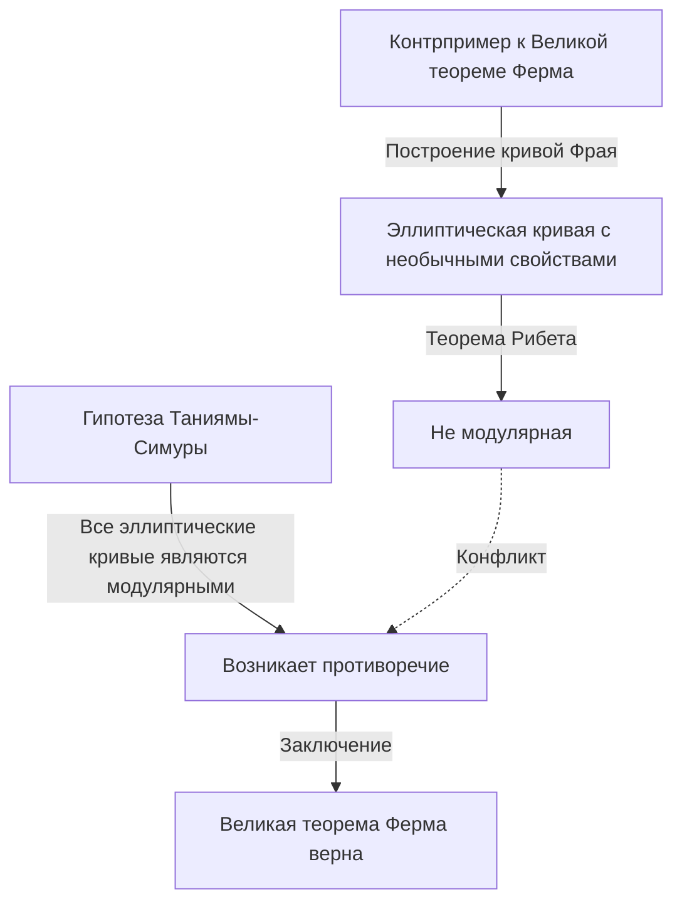

## Введение

В истории математики мало какие истории столь же драматичны и вдохновляющи, как эта. Британский математик **[Эндрю Уайлс](https://kenji.blog/ru/p/wiles/)** совершил монументальный подвиг, доказав «Великую теорему Ферма», проблему, которая оставалась нерешенной на протяжении более 350 лет.

Его жизненный путь читается как сценарий фильма: он начинается с романтической детской мечты, за которой следуют семь лет одиноких, тайных исследований, разрушительное обнаружение ошибки и чудесное возвращение. В этой статье рассматриваются эпизоды жизни Уайлса и его глубокие математические достижения.

## Мечта мальчика: встреча в 10 лет

[Эндрю Уайлс](https://kenji.blog/ru/p/wiles/) родился 11 апреля 1953 года в Кембридже, Англия. Его судьба была предрешена, когда ему было всего 10 лет. В местной библиотеке он взял книгу по математике под названием «Творцы математики» (автор Э. Т. Белл).

В этой книге он столкнулся с тем, что считалось величайшей загадкой в истории математики: Великой теоремой Ферма. Это знаменитая теорема, в которой французский математик [Пьер де Ферма](https://kenji.blog/ru/p/fermat/) написал на полях книги: «Я нашел этому поистине чудесное доказательство, но эти поля слишком узки для него».

Будучи 10-летним мальчиком, Уайлс был глубоко очарован тем, насколько простой выглядела теорема, и в то же время тем, как она веками сводила на нет усилия великих математиков. «Я буду первым, кто докажет эту теорему», — поклялся себе мальчик. Эта **чистая страсть** стала движущей силой всей его дальнейшей жизни.

## Что такое [Великая теорема Ферма](https://kenji.blog/ru/p/fermats-last-theorem/)?

[Великая теорема Ферма](https://kenji.blog/ru/p/fermats-last-theorem/) выражается следующей очень простой формулой:

$$
x^n + y^n = z^n \quad (\text{где } n \ge 3 \text{ — целое число})
$$

Она утверждает, что не существует положительных целых решений $(x, y, z)$, удовлетворяющих этому уравнению. Когда $n = 2$, это хорошо известно как теорема Пифагора, и существует бесконечно много решений (пифагоровы тройки). Однако Ферма утверждал, что когда $n$ равно 3 или больше, это никогда не выполняется.

Хотя утверждение кажется понятным даже ученику средней школы, оно сопротивлялось полному доказательству даже со стороны гениальных математиков, оставивших свой след в истории, таких как Эйлер, Софи Жермен и Куммер.

## Мост между эллиптическими кривыми и модулярными формами: гипотеза Таниямы-Симуры

В 1980-х годах, когда Уайлс продвинулся в своих исследованиях в Кембридже и Оксфорде и в конечном итоге стал профессором Принстонского университета в Соединенных Штатах, в математическом мире появился совершенно новый подход к решению Великой теоремы Ферма. Это была связь с «гипотезой Таниямы-Симуры».

Гипотеза Таниямы-Симуры — это глубокая математическая гипотеза, утверждающая, что «все эллиптические кривые над полем рациональных чисел являются модулярными», что на первый взгляд кажется не связанным с теоремой Ферма. Однако в 1984 году Герхард Фрай предложил идею о том, что «если [Великая теорема Ферма](https://kenji.blog/ru/p/fermats-last-theorem/) ложна (то есть существует решение), то созданная из нее специальная эллиптическая кривая (кривая Фрая) не будет модулярной, что противоречит гипотезе Таниямы-Симуры».

Ситуация резко изменилась в 1986 году, когда Кен Рибет строго доказал идею Фрая (теорема Рибета). Другими словами, был установлен поразительный факт, что «если вы докажете гипотезу Таниямы-Симуры, [Великая теорема Ферма](https://kenji.blog/ru/p/fermats-last-theorem/) будет доказана автоматически».

Услышав эту новость, Уайлс понял, что пришло время осуществить его детскую мечту. Он решил отказаться от всех своих предыдущих исследований и посвятить всю свою энергию доказательству этой гипотезы.

## Тайные исследования: 7 лет на чердаке

Современные математические исследования обычно проводятся несколькими исследователями, которые сотрудничают и делятся идеями. Однако Уайлс выбрал прямо противоположный путь. Он держал свои исследования в строжайшем секрете, уединился на чердаке своего дома и работал над доказательством совершенно один.

У его секретности было несколько причин. Одна из них заключалась в том, что если бы стало известно, что он работает над такой знаменитой проблемой, как [Великая теорема Ферма](https://kenji.blog/ru/p/fermats-last-theorem/), он столкнулся бы с постоянным вмешательством со стороны средств массовой информации и других исследователей, что мешало бы ему сосредоточиться. Другая причина заключалась в том, чтобы не дать конкурентам украсть его идеи.

На протяжении поразительных семи лет Уайлс проводил все свое свободное время в раздумьях на своем чердаке, за исключением выполнения минимальных обязанностей, таких как чтение лекций. Его величайшим оружием была ошеломляющая концентрация и упорство, сродни глубокому проникновению в трещины скалы. Он медленно взбирался на гору доказательств, в полной мере используя новые теории, такие как метод Колывагина-Флаха.

## Историческое объявление в Кембридже

В июне 1993 года на международной конференции по теории чисел, проходившей в Институте Исаака Ньютона при Кембриджском университете, Уайлс наконец представил свои результаты. Конференция длилась три дня, и его лекция носила, казалось бы, скромное название «Модулярные формы, эллиптические кривые и представления Галуа».

Однако по мере того, как его лекция продвигалась, математики в аудитории начали понимать, что он пытается доказать. Атмосфера в зале постепенно накалялась, и к лекции в последний день туда хлынула переполненная толпа.

В конце лекции Уайлс написал формулу Великой теоремы Ферма на доске и тихо объявил: «Думаю, на этом я остановлюсь». В тот момент зал взорвался громом аплодисментов. Средства массовой информации по всему миру широко сообщили: «[Великая теорема Ферма](https://kenji.blog/ru/p/fermats-last-theorem/) наконец доказана!», сделав Уайлса внезапно знаменитостью.

## Начало кошмара: ошибка в доказательстве

Однако время радости длилось недолго. В ходе строгого процесса рецензирования после объявления в важнейшей части доказательства была обнаружена фатальная ошибка. В частности, было обнаружено, что оценка верхней границы была недостаточной при применении метода Колывагина-Флаха к определенной системе Эйлера.

Сначала Уайлс думал, что сможет быстро исправить ошибку, но проблема оказалась намного глубже, чем он предполагал, и затрагивала саму математическую основу. Пока математики всего мира с нетерпением ждали его исправления, время безжалостно шло.

Уайлс продолжал бороться с этой ошибкой более года, почти раздавленный давлением и отчаянием. «Душевные муки того времени не поддаются описанию», — рассказывал он позже. Ему в конце концов пришлось столкнуться с ужасающей вероятностью того, что доказательство, возможно, полностью рухнуло.

## Союз с Ричардом Тейлором и «волшебный момент»

Почувствовав пределы борьбы в одиночку, Уайлс призвал своего бывшего студента и блестящего теоретика чисел Ричарда Тейлора для совместной работы над исправлением ошибки. Однако даже после нескольких месяцев отчаянных усилий обоих они не смогли пробить стену.

В сентябре 1994 года Уайлс окончательно решил сдаться и подумывал написать статью с объяснением того, где он ошибся, прежде чем отойти от проблемы. В качестве последней попытки он сел за свой стол, чтобы точно систематизировать, почему проблемный метод Колывагина-Флаха не сработал, и тут произошло чудо.

Внезапно в его мозгу промелькнула идея объединить ранее отвергнутый подход теории Ивасавы с этим методом Колывагина-Флаха. Это был момент чистого озарения, когда слабость одного идеально дополняла другое.

> «Это было невероятное озарение. Это было так красиво, так просто, и я не мог понять, как я мог это упустить». ([Эндрю Уайлс](https://kenji.blog/ru/p/wiles/))

Благодаря этому «волшебному моменту» ошибка в доказательстве была полностью устранена. В октябре 1994 года Уайлс и Тейлор представили две исправленные статьи, что окончательно положило конец величайшей загадке математического мира спустя 350 лет.

## Что достижение Уайлса принесло математическому миру

Доказательство Уайлсом Великой теоремы Ферма было не просто решением одной сложной проблемы. Математические методы, которые он создал и разработал в процессе доказательства, внесли огромный вклад в современную теорию чисел, особенно в обширную единую математическую теорию, известную как «Программа Ленглендса».

Его доказательство показало, что гипотеза Таниямы-Симуры (в полустабильном случае) была верна, установив, что совершенно разные области теории чисел (модулярные формы и эллиптические кривые) связаны на глубоком уровне. Позже, в 2001 году, другие математики добились полного доказательства всей гипотезы Таниямы-Симуры.

За это достижение Уайлс получил множество престижных наград, в том числе специальную награду Филдсовской премии и Абелевскую премию, а британская королевская семья пожаловала ему рыцарское звание (сэр).

## Заключение

История [Эндрю Уайлс](https://kenji.blog/ru/p/wiles/)а демонстрирует безграничные возможности людей, вызванные чистым любопытством и неукротимым духом. Казалось бы, **безрассудная мечта**, которую лелеял 10-летний мальчик, стала реальностью спустя десятилетия, преодолев многочисленные неудачи.

Хотя [Великая теорема Ферма](https://kenji.blog/ru/p/fermats-last-theorem/) была решена, многие математики продолжают исследовать новые плодородные области математики, открытые Уайлсом, в поисках следующей истины. Его имя, наряду с Пьером де Ферма, навсегда останется в истории человеческого интеллекта.
