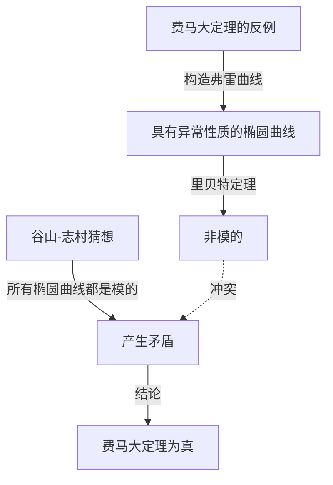

## 引言

在数学史上，几乎没有其他故事能像这样充满戏剧性和鼓舞人心。英国数学家 **[安德鲁·怀尔斯](https://kenji.blog/zh-cn/p/wiles/)** （[Andrew Wiles](https://kenji.blog/zh-cn/p/wiles/)）完成了证明“[费马大定理](https://kenji.blog/zh-cn/p/fermats-last-theorem/)”的伟大创举，这是一个350多年来无人能解的难题。

他的人生轨迹宛如一部电影，从童年时代浪漫的梦想开始，经历了7年孤独而秘密的研究，接着是发现致命缺陷时的绝望，最终迎来了奇迹般的复苏。本文将深入探讨怀尔斯生平的故事，以及他所取得的深远数学成就。

## 少年的梦想：10岁时的邂逅

[安德鲁·怀尔斯](https://kenji.blog/zh-cn/p/wiles/)于1953年4月11日出生在英国剑桥。他的命运在他仅10岁时便已注定。在当地的图书馆里，他拿起了一本名为《数学大师》（由E·T·贝尔著）的数学书。

在那本书中，他遇到了被认为是数学史上最大谜团的“[费马大定理](https://kenji.blog/zh-cn/p/fermats-last-theorem/)”。这就是著名的定理，法国数学家[皮埃尔·德·费马](https://kenji.blog/zh-cn/p/fermat/)在书的空白处写道：“我确信已发现了一种美妙的证法，可惜这里空白的地方太小，写不下。”

作为一个10岁的男孩，怀尔斯被这个定理看似简单，却在几个世纪里挫败了伟大数学家们努力的事实深深吸引。“我将成为第一个证明这个定理的人，”男孩在心里暗自发誓。这种 **纯粹的激情** 成为了他此后一生的原动力。

## 什么是[费马大定理](https://kenji.blog/zh-cn/p/fermats-last-theorem/)？

[费马大定理](https://kenji.blog/zh-cn/p/fermats-last-theorem/)可以用以下非常简单的公式来表达：

$$
x^n + y^n = z^n \quad (\text{其中 } n \ge 3 \text{ 为整数})
$$

它指出，不存在满足该方程的正整数解 $(x, y, z)$ 。当 $n = 2$ 时，它作为毕达哥拉斯定理（勾股定理）广为人知，并且存在无数个解（毕达哥拉斯数）。然而，费马主张，当 $n$ 为3或更大时，该方程永远不成立。

虽然这个命题看起来连中学生都能理解，但即使是在历史上留名的天才数学家，如欧拉、索菲·热尔曼和库默尔，也未能给出完整的证明。

## 椭圆曲线与模形式的桥梁：谷山-志村猜想

20世纪80年代，当怀尔斯在剑桥大学和牛津大学推进研究，并最终成为美国普林斯顿大学教授时，数学界出现了一种解决[费马大定理](https://kenji.blog/zh-cn/p/fermats-last-theorem/)的全新方法。那就是与“谷山-志村猜想”的联系。

谷山-志村猜想是一个深刻的数学猜想，指出“所有有理数域上的椭圆曲线都是模的”，乍一看似乎与费马定理无关。然而，在1984年，格哈德·弗雷提出了一种观点，即“如果[费马大定理](https://kenji.blog/zh-cn/p/fermats-last-theorem/)是假的（即存在解），那么由此产生的特殊椭圆曲线（弗雷曲线）就不是模的，从而违背了谷山-志村猜想。”

情况在1986年发生了戏剧性的变化，肯·里贝特严格证明了弗雷的想法（里贝特定理）。换句话说，确立了这样一个惊人的事实：“如果你证明了谷山-志村猜想，[费马大定理](https://kenji.blog/zh-cn/p/fermats-last-theorem/)就会自动得到证明。”

听到这个消息，怀尔斯意识到实现童年梦想的时候到了。他决定放弃之前所有的研究，倾注全部精力来证明这个猜想。

## 秘密研究：阁楼里的7年

现代数学研究通常是由多名研究人员合作和分享想法来进行的。然而，怀尔斯选择了完全相反的道路。他将自己的研究完全保密，将自己关在家里的阁楼上，独自一人致力于证明。

他保密有几个原因。其一是，如果人们知道他正在研究像[费马大定理](https://kenji.blog/zh-cn/p/fermats-last-theorem/)这样著名的问题，他将面临媒体和其他研究人员不断的干扰，使他无法集中注意力。另一个原因是为了防止竞争对手窃取他的想法。

在长达7年的惊人时间里，怀尔斯除了履行讲课等最基本的职责外，把所有的时间都花在了阁楼上的沉思。他最大的武器是压倒性的注意力和执着，就像深深钻入岩石裂缝一样。他充分利用了科利瓦金-弗莱切方法等新理论，慢慢地攀登着证明的高山。

## 剑桥的历史性发表

1993年6月，在剑桥大学牛顿研究所举行的数论国际会议上，怀尔斯终于展示了他的成果。会议持续了三天，他的演讲题目看似不起眼，名为《模形式、椭圆曲线和伽罗瓦表示》。

然而，随着演讲的进行，听众中的数学家们开始意识到他试图证明什么。教室里的气氛逐渐升温，在最后一天演讲时，挤满了溢出的人群。

在演讲的最后，怀尔斯在黑板上写下了[费马大定理](https://kenji.blog/zh-cn/p/fermats-last-theorem/)的公式，并平静地宣布：“我想我就在这里结束吧。”那一刻，全场爆发出雷鸣般的掌声。世界各地的媒体纷纷大肆报道：“[费马大定理](https://kenji.blog/zh-cn/p/fermats-last-theorem/)终于被证明了！”，使怀尔斯一跃成为时代的宠儿。

## 噩梦的开始：证明中的缺陷

然而，喜悦的时光并没有持续太久。在发表后严格的同行评审过程中，证明的一个关键部分被发现存在致命缺陷。具体来说，当将科利瓦金-弗莱切方法应用于特定的欧拉系统时，发现上限估计不足。

最初，怀尔斯以为他可以很快修复它，但问题比想象的要深得多，涉及数学的基础。在全世界数学家热切等待他修正的同时，时间无情地流逝。

怀尔斯在长达一年多的时间里继续与这个缺陷作斗争，几乎被压力和绝望压垮。“那时候的精神痛苦，是无法用语言表达的，”他后来回忆道。他最终不得不面对一种可怕的可能性，即证明可能已经完全崩溃。

## 与理查德·泰勒的并肩作战与“神奇时刻”

怀尔斯感到孤军奋战的极限，于是请来了他以前的学生、杰出的数论学家理查德·泰勒，共同致力于修复缺陷。然而，即使经过两人几个月的绝望努力，他们仍然无法打破这堵墙。

1994年9月，怀尔斯终于决定放弃，并考虑写一篇论文解释他在哪里犯了错误，然后退出这个问题。作为最后的尝试，他坐在书桌前，试图准确梳理为什么有问题的科利瓦金-弗莱切方法不起作用，这时，奇迹发生了。

突然，他的脑海中闪过一个念头，将以前放弃的岩泽理论方法与这个科利瓦金-弗莱切方法结合起来。那是一个纯粹的启示时刻，一方的弱点完美地补充了另一方。

> “那是一个难以置信的顿悟时刻。它太美了，太简单了，我无法理解我怎么会忽略它。”（[安德鲁·怀尔斯](https://kenji.blog/zh-cn/p/wiles/)）

多亏了这个“神奇时刻”，证明中的缺陷被彻底修复。1994年10月，怀尔斯和泰勒提交了两篇修改后的论文，经过350年的时间，终于为数学界最大的谜团画上了圆满的句号。

## 怀尔斯的成就给数学界带来了什么

怀尔斯对[费马大定理](https://kenji.blog/zh-cn/p/fermats-last-theorem/)的证明不仅仅解决了一个难题。他在证明过程中创造和发展的数学方法对现代数论做出了巨大贡献，特别是被称为“朗兰兹纲领”的庞大统一数学理论。

他的证明表明，谷山-志村猜想（在半稳定情况下）是正确的，确立了数论中完全不同的领域（模形式和椭圆曲线）在深层次上是相连的。后来，在2001年，其他数学家完成了整个谷山-志村猜想的完整证明。

凭借这一成就，怀尔斯获得了许多声望很高的奖项，包括菲尔兹奖特别奖和阿贝尔奖，并被英国皇室授予骑士爵位（Sir）。

## 结语

[安德鲁·怀尔斯](https://kenji.blog/zh-cn/p/wiles/)的故事展示了纯粹的好奇心和不屈不挠的精神所带来的人类无限可能性。一个10岁男孩怀抱的看似 **鲁莽的梦想** ，在经历了无数挫折之后，几十年后成为了现实。

虽然[费马大定理](https://kenji.blog/zh-cn/p/fermats-last-theorem/)已经解开，但许多数学家继续在怀尔斯开辟的肥沃数学新领域中探索，以寻找下一个真理。他的名字，将与[皮埃尔·德·费马](https://kenji.blog/zh-cn/p/fermat/)一起，永远铭刻在人类智慧的史册中。
