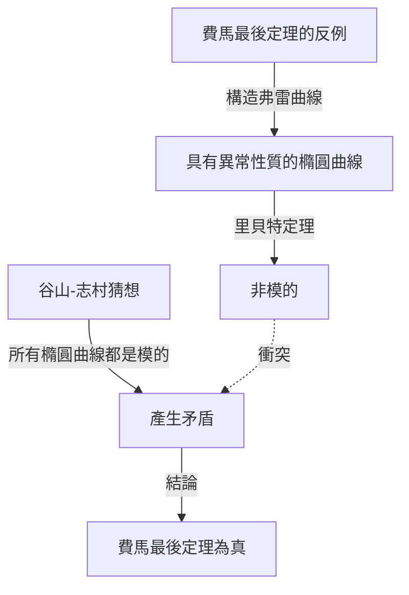

## 引言

在數學史上，幾乎沒有其他故事能像這樣充滿戲劇性和鼓舞人心。英國數學家 **[安德魯·懷爾斯](https://kenji.blog/zh-tw/p/wiles/)** （Andrew Wiles）完成了證明「[費馬最後定理](https://kenji.blog/zh-tw/p/fermats-last-theorem/)」的偉大創舉，這是一個350多年來無人能解的難題。

他的人生軌跡宛如一部電影，從童年時代浪漫的夢想開始，經歷了7年孤獨而秘密的研究，接著是發現致命缺陷時的絕望，最終迎來了奇蹟般的復甦。本文將深入探討懷爾斯生平的故事，以及他所取得的深遠數學成就。

## 少年的夢想：10歲時的邂逅

[安德魯·懷爾斯](https://kenji.blog/zh-tw/p/wiles/)於1953年4月11日出生在英國劍橋。他的命運在他僅10歲時便已註定。在當地的圖書館裡，他拿起了一本名為《數學大師》（由E·T·貝爾著）的數學書。

在那本書中，他遇到了被認為是數學史上最大謎團的「[費馬最後定理](https://kenji.blog/zh-tw/p/fermats-last-theorem/)」。這就是著名的定理，法國數學家[皮埃爾·德·費馬](https://kenji.blog/zh-tw/p/fermat/)在書的空白處寫道：「我確信已發現了一種美妙的證法，可惜這裡空白的地方太小，寫不下。」

作為一個10歲的男孩，懷爾斯被這個定理看似簡單，卻在幾個世紀裡挫敗了偉大數學家們努力的事實深深吸引。「我將成為第一個證明這個定理的人，」男孩在心裡暗自發誓。這種 **純粹的激情** 成為了他此後一生的原動力。

## 什麼是[費馬最後定理](https://kenji.blog/zh-tw/p/fermats-last-theorem/)？

[費馬最後定理](https://kenji.blog/zh-tw/p/fermats-last-theorem/)可以用以下非常簡單的公式來表達：

$$
x^n + y^n = z^n \quad (\text{其中 } n \ge 3 \text{ 為整數})
$$

它指出，不存在滿足該方程的正整數解 $(x, y, z)$ 。當 $n = 2$ 時，它作為畢氏定理（勾股定理）廣為人知，並且存在無數個解（畢氏數）。然而，費馬主張，當 $n$ 為3或更大時，該方程永遠不成立。

雖然這個命題看起來連中學生都能理解，但即使是在歷史上留名的天才數學家，如歐拉、索菲·熱爾曼和庫默爾，也未能給出完整的證明。

## 橢圓曲線與模形式的橋樑：谷山-志村猜想

20世紀80年代，當懷爾斯在劍橋大學和牛津大學推進研究，並最終成為美國普林斯頓大學教授時，數學界出現了一種解決[費馬最後定理](https://kenji.blog/zh-tw/p/fermats-last-theorem/)的全新方法。那就是與「谷山-志村猜想」的聯繫。

谷山-志村猜想是一個深刻的數學猜想，指出「所有有理數域上的橢圓曲線都是模的」，乍一看似乎與費馬定理無關。然而，在1984年，格哈德·弗雷提出了一種觀點，即「如果[費馬最後定理](https://kenji.blog/zh-tw/p/fermats-last-theorem/)是假的（即存在解），那麼由此產生的特殊橢圓曲線（弗雷曲線）就不是模的，從而違背了谷山-志村猜想。」

情況在1986年發生了戲劇性的變化，肯·里貝特嚴格證明了弗雷的想法（里貝特定理）。換句話說，確立了這樣一個驚人的事實：「如果你證明了谷山-志村猜想，[費馬最後定理](https://kenji.blog/zh-tw/p/fermats-last-theorem/)就會自動得到證明。」

聽到這個消息，懷爾斯意識到實現童年夢想的時候到了。他決定放棄之前所有的研究，傾注全部精力來證明這個猜想。

## 秘密研究：閣樓裡的7年

現代數學研究通常是由多名研究人員合作和分享想法來進行的。然而，懷爾斯選擇了完全相反的道路。他將自己的研究完全保密，將自己關在家裡的閣樓上，獨自一人致力於證明。

他保密有幾個原因。其一是，如果人們知道他正在研究像[費馬最後定理](https://kenji.blog/zh-tw/p/fermats-last-theorem/)這樣著名的問題，他將面臨媒體和其他研究人員不斷的干擾，使他無法集中注意力。另一個原因是為了防止競爭對手竊取他的想法。

在長達7年的驚人時間裡，懷爾斯除了履行講課等最基本的職責外，把所有的時間都花在了閣樓上的沉思。他最大的武器是壓倒性的注意力和執著，就像深深鑽入岩石裂縫一樣。他充分利用了科利瓦金-弗萊切方法等新理論，慢慢地攀登著證明的高山。

## 劍橋的歷史性發表

1993年6月，在劍橋大學牛頓研究所舉行的數論國際會議上，懷爾斯終於展示了他的成果。會議持續了三天，他的演講題目看似不起眼，名為《模形式、橢圓曲線和伽羅瓦表示》。

然而，隨著演講的進行，聽眾中的數學家們開始意識到他試圖證明什麼。教室裡的氣氛逐漸升溫，在最後一天演講時，擠滿了溢出的人群。

在演講的最後，懷爾斯在黑板上寫下了[費馬最後定理](https://kenji.blog/zh-tw/p/fermats-last-theorem/)的公式，並平靜地宣佈：「我想我就在這裡結束吧。」那一刻，全場爆發出雷鳴般的掌聲。世界各地的媒體紛紛大肆報導：「[費馬最後定理](https://kenji.blog/zh-tw/p/fermats-last-theorem/)終於被證明了！」，使懷爾斯一躍成為時代的寵兒。

## 噩夢的開始：證明中的缺陷

然而，喜悅的時光並沒有持續太久。在發表後嚴格的同行評審過程中，證明的一個關鍵部分被發現存在致命缺陷。具體來說，當將科利瓦金-弗萊切方法應用於特定的歐拉系統時，發現上限估計不足。

最初，懷爾斯以為他可以很快修復它，但問題比想像的要深得多，涉及數學的基礎。在全世界數學家熱切等待他修正的同時，時間無情地流逝。

懷爾斯在長達一年多的時間裡繼續與這個缺陷作鬥爭，幾乎被壓力和絕望壓垮。「那時候的精神痛苦，是無法用語言表達的，」他後來回憶道。他最終不得不面對一種可怕的可能性，即證明可能已經完全崩潰。

## 與理查德·泰勒的並肩作戰與「神奇時刻」

懷爾斯感到孤軍奮戰的極限，於是請來了他以前的學生、傑出的數論學家理查德·泰勒，共同致力於修復缺陷。然而，即使經過兩人幾個月的絕望努力，他們仍然無法打破這堵牆。

1994年9月，懷爾斯終於決定放棄，並考慮寫一篇論文解釋他在哪裡犯了錯誤，然後退出這個問題。作為最後的嘗試，他坐在書桌前，試圖準確梳理為什麼有問題的科利瓦金-弗萊切方法不起作用，這時，奇蹟發生了。

突然，他的腦海中閃過一個念頭，將以前放棄的岩澤理論方法與這個科利瓦金-弗萊切方法結合起來。那是一個純粹的啟示時刻，一方的弱點完美地補充了另一方。

> 「那是一個難以置信的頓悟時刻。它太美了，太簡單了，我無法理解我怎麼會忽略它。」（[安德魯·懷爾斯](https://kenji.blog/zh-tw/p/wiles/)）

多虧了這個「神奇時刻」，證明中的缺陷被徹底修復。1994年10月，懷爾斯和泰勒提交了兩篇修改後的論文，經過350年的時間，終於為數學界最大的謎團畫上了圓滿的句號。

## 懷爾斯的成就給數學界帶來了什麼

懷爾斯對[費馬最後定理](https://kenji.blog/zh-tw/p/fermats-last-theorem/)的證明不僅僅解決了一個難題。他在證明過程中創造和發展的數學方法對現代數論做出了巨大貢獻，特別是稱為「朗蘭茲綱領」的龐大統一數學理論。

他的證明表明，谷山-志村猜想（在半穩定情況下）是正確的，確立了數論中完全不同的領域（模形式和橢圓曲線）在深層次上是相連的。後來，在2001年，其他數學家完成了整個谷山-志村猜想的完整證明。

憑藉這一成就，懷爾斯獲得了許多聲望很高的獎項，包括菲爾茲獎特別獎和阿貝爾獎，並被英國皇室授予騎士爵位（Sir）。

## 結語

[安德魯·懷爾斯](https://kenji.blog/zh-tw/p/wiles/)的故事展示了純粹的好奇心和不屈不撓的精神所帶來的人類無限可能性。一個10歲男孩懷抱的看似 **魯莽的夢想** ，在經歷了無數挫折之後，幾十年後成為了現實。

雖然[費馬最後定理](https://kenji.blog/zh-tw/p/fermats-last-theorem/)已經解開，但許多數學家繼續在懷爾斯開闢的肥沃數學新領域中探索，以尋找下一個真理。他的名字，將與[皮埃爾·德·費馬](https://kenji.blog/zh-tw/p/fermat/)一起，永遠銘刻在人類智慧的史冊中。
