## المقدمة: ما هو جوهر نظام التشغيل؟ — «التصميم الأنيق النقي» أم «الواقعية البراغماتية في التشغيل»؟

حين تفتح كتب علوم الحاسوب الأكاديمية أو مراجع هندسة البرمجيات الكلاسيكية، تجد صفحاتها تتغنى دائمًا بمُثُلٍ نظرية ساحرة: «التجريد المصقول»، «فصل الاهتمامات (Separation of Concerns)»، و«التصميم المتعامد الخالي من التناقض لواجهات برمجة التطبيقات (APIs)». وبحسب هذا المنظور، ينبغي لنظام التشغيل (OS) أن يكون حَكَمًا نزيهًا ووسيطًا مقدسًا يخفي تعقيدات العتاد ويوفر للتطبيقات واجهات برمجية موحدة وبديهية وفائقة النقاء.

ولكن بمجرد أن يغادر المرء الأبراج العاجية للجامعات ويضع قدمه في ساحة المعركة الشرسة لأنظمة تشغيل الحواسيب الشخصية التجارية، تتفتت تلك المُثُل النقية إلى هباء. والسبب في ذلك هو أن نظام التشغيل الأكثر نجاحًا من الناحية التجارية في تاريخ الحوسبة الشخصية، والذي هيمن على مليارات الحواسيب حول كوكب الأرض — نظام Windows — قد بنى صرحه على فلسفة تقف على النقيض تمامًا من الجمال الأكاديمي: **«الواقعية البراغماتية المتطرفة والصارمة (Pragmatism)»**.

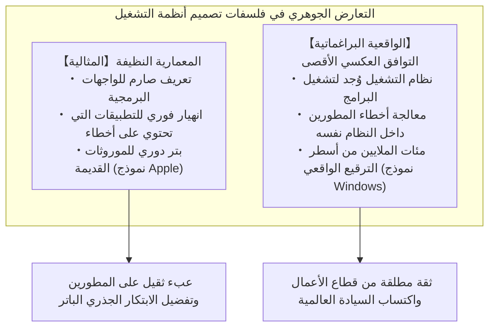

من بين كافة أنظمة التشغيل الموجودة في العالم، لا يوجد نظام أحاط «موروثات الماضي البرمجية» بمثل هذا الهوس والشغف الأسطوري كما فعل Windows. فأقراص الألعاب المدمجة (CD-ROM) الصادرة في عام 1995، وبرمجيات المحاسبة المؤسسية المكتوبة بلغة Visual Basic 3.0 أو C++ في مطلع التسعينيات، وبقايا عصر نظام DOS، والأدوات القديمة التي كانت تعتمد على استغلال سلوكيات النظام غير الموثقة عبر حيل ملتوية — كل هذه البرمجيات تعمل اليوم في منتصف عقد العشرينيات من القرن الحادي والعشرين فوق أحدث أنظمة التشغيل «Windows 11»، حيث تقلع وتعمل بكفاءة تامة وكأن شيئًا لم يكن.

ينظر معظم الناس إلى هذا المشهد على أنه مجرد «برنامج يعمل كما ينبغي»، ويعتبرونه أمرًا بديهيًا ومسلمًا به في حياتهم الرقمية اليومية. إلا أن مبرمجي الأنظمة الذين خاضوا في غمار الهندسة العكسية لشفرات نظام Windows وتأملوا أغواره العميقة يقفون مذهولين ومشدوهين. فهناك، وتحت الغطاء، تتراكم طبقات جيولوجية لا حصر لها من الشفرات البرمجية التي كرس مهندسو مايكروسوفت أكثر من 30 عامًا لكتابتها، والتي تتضمن **«عشرات الآلاف من الأسطر المخصصة لمعالجة الحالات الاستثنائية، والتزييف الديناميكي للواجهات البرمجية، وآليات مخصصة يكذب فيها نظام التشغيل عمدًا (Shims)»**، وكل ذلك بهدف إنقاذ برمجيات الطرف الثالث من أخطائها البرمجية، وانتهاكاتها للمعايير، وتدميرها للذاكرة، وسلوكياتها غير المحددة.

لماذا تكبدت مايكروسوفت كل هذا العناء لتحمل على كاهلها شفرات برمجية رديئة كتبها مطورون آخرون، وتعمل باستمرار على معالجة تناقضاتها داخل النظام؟
ولماذا لم تسلك طريق شركة Apple باختيار «البتر الجراحي الواضح للماضي»؟
وكيف تمكنت هذه الهندسة البرمجية الصارمة من رفع نظام Windows إلى مكانته الحالية كأقوى منصة برمجية لا يمكن زعزعتها في العالم؟

يغوص هذا التقرير الشامل والمفصل في أعماق تاريخ استراتيجيات منصات تقنية المعلومات، مستندًا إلى شهادات حية لمبرمجين أسطوريين عملوا في مايكروسوفت، وبيانات الهندسة العكسية المستخرجة من أعماق ملفات PE الثنائية ونواة NT Kernel، ليكشف النقاب عن «الأمر المطلق» الحاكم لنظام Windows: **«إياك وكسر التطبيقات القديمة (Don't break old apps)»**.

---

## الفصل الأول: المصدران التاريخيان يكشفان «الأمر المطلق (The Prime Directive)»

إن هوس فريق تطوير Windows بالتوافق العكسي لم يكن مجرد خيال أو أسطورة يتناقلها المراقبون من خارج أسوار مايكروسوفت، بل تم توثيقه وتأكيده بصورة حية من قِبل اثنين من أبرز المهندسين الأسطوريين الذين خطوا الشفرات بأنفسهم وحددوا معالم المعمارية التقنية للنظام.

### 1.1 ريموند تشن (Raymond Chen) ومدونة «The Old New Thing»

في فريق تطوير Windows في مايكروسوفت، يبرز رجل يحمل لقب «الأسطورة الحية» لأكثر من ثلاثة عقود. إنه **ريموند تشن (Raymond Chen)**، كبير مهندسي البرمجيات (Principal Software Engineer)، الذي انضم إلى الشركة عام 1992 وتولى تطوير وصيانة قلب واجهة المستخدم لنظام Windows 95، ومكتبة User32، والأعماق الدقيقة لنظام Win32 الفرعي.

بدأ تشن بكتابة مدونة داخلية في مايكروسوفت تحولت لاحقًا إلى سلسلة مقالات تقنية شهيرة ومستمرة على البوابة الرسمية لمايكروسوفت بعنوان **«The Old New Thing»** (والتي جُمعت لاحقًا في كتاب أصبح بمثابة إنجيل مبرمجي النظم). وتُعد هذه المدونة أرشيفًا مذهلاً يسجل كيف خاض Windows معارك طاحنة وواقعية لحل مشكلات التوافقية البرمجية.

يلخص تشن المبدأ الأساسي الحاكم لفريق تطوير Windows ببساطة باردة وحاسمة:

> «نظام تشغيل Windows وُجد لغرض واحد أساسي: تشغيل البرامج. المستخدم لا يشتري حاسوبًا ليستمتع بجمال نظام التشغيل، بل يشتريه لأنه يريد استخدام تطبيقات وبرامج معينة تعمل عليه.
> 
> والواقع الأكثر قسوة هو هذا: **حين يقوم المستخدم بالترقية إلى إصدار جديد من Windows، ويتوقف تطبيقه المفضل عن العمل، فإن المستخدم لن يلوم أبدًا مطور ذلك التطبيق. بل سيلقي باللوم بنسبة 100% على مايكروسوفت قائلًا: "لقد تعطل Windows!" أو "نظام Windows الجديد مليء بالعيوب!"**»

من منطلق كبرياء المبرمجين الأكاديمي، قد يرغب المرء في القول: «الخلل موجود في كود التطبيق نفسه، ومن الطبيعي أن ينهار البرنامج، وعلى الشركة المطورة للتطبيق إصدار تحديث لإصلاحه». ولكن في السوق التجارية لأنظمة التشغيل، لا قيمة لهذا المنطق النظري على الإطلاق. فبالنسبة للمستخدم العادي، الحقيقة الوحيدة الملموسة هي: «هذا البرنامج كان يعمل بالأمس بكفاءة، وبمجرد ترقية Windows اليوم، توقف عن العمل».

لو ردت مايكروسوفت على المستخدمين بنبرة التعالي قائلة: «هذا خطأ مطور التطبيق وليس خطأنا»، لرفض المستخدمون الترقية، وظلوا متمسكين بالإصدارات القديمة، أو ربما فكروا في الانتقال إلى منصات منافسة. ولذا، وبدافع الضرورة التجارية الحتمية، فُرضت على فريق تطوير Windows هذه المهمة الشاقة:

**«مهما بلغت فداحة الأخطاء ومخالفة المعايير وسوء الشفرة التي كتبها مطورو التطبيقات، يجب على نظام التشغيل اكتشاف ذلك، وتصحيح الأمور من وراء الكواليس، وتشغيل التطبيق وكأن شيئًا لم يكن.»**

وتوثق مدونة تشن بالتفصيل عددًا لا يحصى من الحيل الذكية والمضنية التي اضطر هو وزملاؤه لتنفيذها فداءً لهذا المبدأ.

### 1.2 شهادة جويل سبولسكي (Joel Spolsky): «كيف خسرت مايكروسوفت حرب واجهات البرمجة»

الشخص الذي نقل عظمة هذه الفلسفة إلى مجتمع مهندسي الويب ورواد الأعمال التقنيين حول العالم بشكل قاطع هو **جويل سبولسكي (Joel Spolsky)**. عمل سبولسكي كمدير برامج لفريق Microsoft Excel في مطلع التسعينيات، وأسس لاحقًا منصة الأسئلة والأجوبة الشهيرة للمبرمجين «Stack Overflow» وأداة إدارة المشاريع «Trello»، ليصبح أحد أشهر كتاب المقالات البرمجية في العالم.

في عام 2004، نشر سبولسكي مقالته التاريخية الشهيرة بعنوان «How Microsoft Lost the API War (كيف خسرت مايكروسوفت حرب واجهات برمجة التطبيقات)». وفي تلك المقالة، استرجع القيادة الصارمة التي فرضها رئيس فريق Windows آنذاك، جون ديفان (Jon DeVaan)، وكتب قائلاً:

> "In the Windows team, the prime directive was: **don't break old apps.**"  
> (في فريق Windows، كان التوجيه الأساسي والأمر المطلق هو: **إياك وكسر التطبيقات القديمة**.)

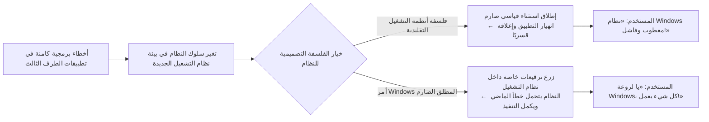

يوضح سبولسكي هذا المفهوم مستشهدًا بمسلسل الخيال العلمي الشهير «Star Trek»؛ فكما أن أعلى قانون عسكري لا يجوز لضباط أسطول الفضاء خرقه أبدًا هو «التوجيه الأساسي للاتحاد (The Prime Directive)» (الذي يحظر التدخل في التطور الطبيعي للحضارات الفضائية)، فإن «التوجيه الأساسي» لمبرمجي فريق Windows كان الحفاظ التام والمطلق على عمل التطبيقات الموجودة دون أي خلل.

إذا قام أحد مهندسي Windows بإعادة هيكلة كود النواة (Kernel) أو الواجهات البرمجية (APIs) بأسلوب أنيق ضاعف من سرعة النظام مرتين، ولكن نتج عن هذا التعديل الأنيق انهيار برنامج محاسبي مغمور واحد مستخدم في شركة ما حول العالم، فإن تلك التعديلات كانت تُرفض على الفور وتُلغى. ففي فريق Windows، كان جمال الكود ونقاء المعمارية أمرًا ثانويًا، بينما كان **«ضمان تشغيل الملفات الثنائية القديمة بنسبة 100%» هو الفضيلة والمجد الأسمى**.

### 1.3 «حتى الأخطاء تصبح مواصفات قياسية»: قانون هايروم (Hyrum's Law) واللاعودة في واجهات البرمجة

في هندسة البرمجيات، توجد قاعدة تجريبية شهيرة صاغها مهندس البرمجيات في Google هايروم رايت (Hyrum Wright)، وتعرف باسم **«قانون هايروم (Hyrum's Law)»**:

> **قانون هايروم**:  
> «عندما يكون لواجهة برمجة التطبيقات (API) عدد كافٍ من المستخدمين، فإنه لا يهم ما تعد به في وثائقك الرسمية ومواصفاتك القياسية؛ فكل سلوك يمكن ملاحظته في نظامك — بما في ذلك الأخطاء البرمجية والآثار الجانبية غير الموثقة — سيعتمد عليه كود شخص ما عاجلًا أو آجلًا.»

ويُعد Windows المنصة البرمجية التي جسدت «قانون هايروم» على أوسع نطاق وبأقسى صورة عرفها تاريخ التقنية.

لنفترض، على سبيل المثال، أن وثائق إحدى واجهات Windows API تنص صراحة على ما يلي: «يجب تمرير مقبض نافذة (HWND) صالح في المعامل الثالث. وسلوك النظام غير محدد (Undefined Behavior) في حال تمرير قيمة غير صالحة». ولكن لنفترض أن مبرمجًا مهملاً أخطأ ومرر مؤشرًا فارغًا `NULL` أو مقبضًا تالفًا، ولحسن حظه، كان تطبيق Windows 3.1 في ذلك الوقت يتجاهل هذا الخطأ بالمصادفة البحتة ويمرر العملية دون إصدار أي تنبيه.

بعد توزيع مئات الآلاف من النسخ من ذلك البرنامج في الأسواق، يقرر فريق تطوير Windows 95 أو Windows NT تحسين جودة الشفرة والتحقق من صحة المعاملات بدقة، فإذا كان المقبض غير صالح، يتم إرجاع رمز الخطأ القياسي `ERROR_INVALID_PARAMETER`. ماذا يحدث حينها؟

تنهار تلك البرامج القديمة فجأة في عشرات الآلاف من المكاتب وتطلق نوافذ الخطأ وتتوقف عن العمل. ويثور المستخدمون غضبًا، وتنهال المكالمات الساخطة على مراكز دعم مايكروسوفت: «لقد قمنا بترقية النظام وتوقفت أعمالنا تمامًا!».

ونتيجة لذلك، يضطر مهندسو مايكروسوفت إلى التراجع عن الشفرة «الصحيحة» التي كتبوها، وكتابة أكواد تنازلية واقعية تشبه النموذج التالي:

```c
// نموذج تصوري يوضح كيفية معالجة التوافق داخل دوال Windows API
BOOL WINAPI DoSomething(HWND hWnd, UINT uMsg, WPARAM wParam, LPARAM lParam)
{
    // التحقق القياسي والأكاديمي السليم من صحة المدخلات
    if (!IsWindow(hWnd)) {
        // نظريًا، ينبغي إنهاء الدالة فورًا وإرجاع رمز خطأ هنا:
        // SetLastError(ERROR_INVALID_WINDOW_HANDLE);
        // return FALSE;

        // 【حيلة اضطرارية لضمان التوافق العكسي】
        // أحد التطبيقات الشهيرة القديمة (AppX) يمرر مقبضًا فارغًا NULL أثناء التهيئة.
        // إرجاع خطأ هنا سيتسبب في انهيار التطبيق AppX تمامًا،
        // لذا نستبدل المقبض ضمنيًا بمقبض نافذة سطح المكتب (Desktop Window) لتمرير العملية بصمت.
        if (IsTargetBadApplication("AppX.exe")) {
            hWnd = GetDesktopWindow();
        } else {
            SetLastError(ERROR_INVALID_WINDOW_HANDLE);
            return FALSE;
        }
    }

    // متابعة المعالجة الأصلية...
    return InternalDoSomething(hWnd, uMsg, wParam, lParam);
}
```

بمجرد إطلاق نظام التشغيل وتحوله إلى معيار واقعي مهيمن في السوق (De facto standard)، تتوقف مواصفات واجهات البرمجة عن كونها «مجرد نصوص مكتوبة في الوثائق»، وتتحول إلى **«المجموع الكلي لكافة السلوكيات الواقعية التي أظهرها التطبيق الفعلي، بما في ذلك عيوبه وأخطاؤه البرمجية»**. وقد استوعب فريق Windows هذا الواقع القاسي، وعقدوا العزم على تحمل أخطاء مطوري البرمجيات حول العالم واعتبارها جزءًا لا يتجزأ من مواصفات النظام إلى الأبد.

---

## الفصل الثاني: بداية الأسطورة — الحقيقة التقنية لحادثة «سيم سيتي (SimCity)»

توجد في تاريخ الحوسبة حادثة شهيرة تلخص إصرار فريق Windows الخارق على حماية التوافق العكسي، وهي الحادثة المعروفة باسم **«أزمة لعبة SimCity»** أثناء اللحظات الحاسمة لتطوير Windows 95.

### 2.1 Use-After-Free (الوصول إلى الذاكرة بعد تحريرها)

في عام 1989، أطلقت شركة Maxis بقيادة ويل رايت (Will Wright) لعبة بناء وإدارة المدن الشهيرة «SimCity»، والتي أصبحت علامة فارقة في تاريخ ألعاب الحواسيب الشخصية وحققت انتشارًا أسطوريًا. وكان تشغيل SimCity بسلاسة على أجهزة الحواسيب مسألة بالغة الأهمية ليس فقط للمستخدمين المنزليين بل أيضًا للموظفين والمديرين في مكاتب الشركات للترويح عن أنفسهم.

إلا أن النسخة المخصصة لأنظمة DOS وWindows 3.1 من لعبة SimCity كانت تحتوي على خطأ برمجي خطير يصنف اليوم في معايير الأمن السيبراني كثغرة أمنية فادحة؛ ألا وهو خطأ **«الاستخدام بعد التحرير (Use-After-Free)»**.

كانت شفرة لعبة SimCity، وأثناء معالجة الرسوم وحسابات محاكاة المدينة، تطلب تخصيص كتل من الذاكرة من مدير الذاكرة في النظام (Heap Allocator)، وبعد الانتهاء من استخدامها تقوم بتحريرها وإعادتها للنظام عبر دوال مثل `free` أو `GlobalFree`. ولكن المأساة تكمن في أن مؤشرات الذاكرة داخل اللعبة لم تكن تُصفّر بعد التحرير، بل **«كان البرنامج يستمر بكل بساطة في قراءة وكتابة البيانات في نفس مساحة الذاكرة التي أعادها لنظام التشغيل!»**.

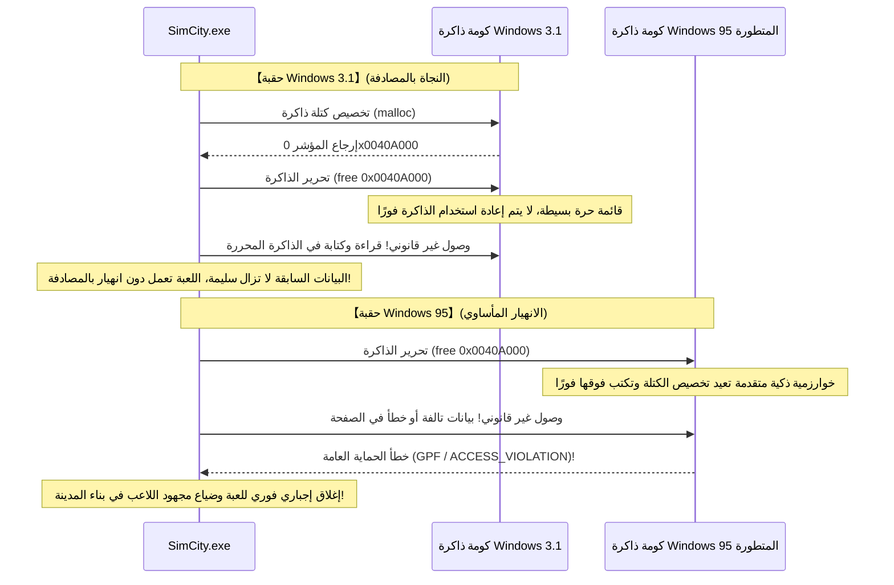

في نظام Windows 3.1 (الذي كان يعمل بنمط 16 بت)، كانت إدارة الذاكرة بدائية للغاية. فعندما يحرر التطبيق كتلة من الذاكرة، لم تكن تلك المساحة تُعاد جدولتها لاستخدام آخر على الفور بسبب بساطة هيكل القائمة الحرة (Free List). وبالتالي، ورغم أن شفرة SimCity كانت «معطوبة برمجياً بشكل كامل»، فإنها **«كانت تعمل وتنجو من الانهيار بمحض الصدفة، لأن إدارة الذاكرة في Windows 3.1 كانت ساذجة وبطيئة في إعادة التدوير»**.

### 2.2 هندسة البرمجيات التقليدية مقابل جنون فريق Windows

ولكن في عام 1995، وصل نظام «Windows 95» المتقدم ذو معمارية 32 بت ليحدث ثورة جذرية في عالم الحوسبة الشخصية.

تميز Windows 95 بتعدد مهام حقيقي ذي أسبقية (Preemptive Multitasking)، ومدير ذاكرة افتراضية متطور، ومدير كومة ذاكرة (Heap Allocator) فائق السرعة صُمم لمنع تشتت الذاكرة وزيادة كفاءة التخزين المؤقت. هذا النظام الجديد كان مصممًا بحيث بمجرد أن يعيد التطبيق كتلة من الذاكرة، يقوم النظام فورًا **بإعادة استخدامها لأغراض أخرى وتصفير بياناتها وإعادة ترتيبها لتحقيق أقصى كفاءة ممكنة**.

ما الذي حدث حين شُغلت لعبة SimCity فوق هذا النظام الحديث؟  
حاولت SimCity قراءة الذاكرة التي حررتها للتو، لتصطدم ببيانات تخص عمليات أخرى، أو بقيم مصفرة خالية. وفي اللحظة التالية، انفجرت نافذة الخطأ الشهيرة والمخيفة **«خطأ الحماية العامة (General Protection Fault: GPF)»**، وانهارت اللعبة في رمشة عين، لتتبخر المدن الكبرى التي بناها اللاعبون لساعات طويلة في العدم.

أمام هذه المعضلة، ما هو القرار الذي كانت ستتخذه أي شركة أنظمة تشغيل عادية تحترم المعايير الهندسية التقليدية؟

الإجابة واضحة تمامًا: «هذا خطأ برمجي بنسبة 100% تتحمله شركة Maxis. إدارة الذاكرة في نظام التشغيل تعمل بدقة تامة ومطابقة للمواصفات. يجب إخطار شركة Maxis بالخطأ حتى تقوم بتوزيع قرص مرن يحتوي على ترقيع تصحيحي (SimCity 1.01) للمستخدمين» — هذا هو المنطق السليم والمقبول أكاديميًا وعمليًا.

ولكن القرار الذي اتخذته قيادات مايكروسوفت وفريق تطوير Windows 95 كان قرارًا يفوق حدود الخيال والمنطق التقليدي:

**«يجب ألا تنهار لعبة SimCity أبدًا. ليس لدينا وقت لانتظار شركة الألعاب حتى تصدر تحديثًا. قوموا بزرع ترقيع خاص داخل مدير ذاكرة النواة في Windows 95 ذاته لتعديل سلوك النظام من أجل SimCity!»**

### 2.3 تفاصيل الترقيع الخاص بـ SimCity في مدير الذاكرة

يروي جويل سبولسكي تفاصيل تلك اللحظة التاريخية في مقالته قائلاً:

> «أثناء الاختبارات التجريبية لنظام Windows 95، لاحظوا أن SimCity لا تعمل بشكل صحيح. ماذا فعلت مايكروسوفت؟  
> لم يطاردوا مؤلف لعبة SimCity لإجباره على تصحيح خطئه. بل قام المهندس المسؤول عن مدير الذاكرة في Windows 95 بكتابة شفرة خاصة إضافية داخل النظام: **"إذا كان البرنامج قيد التشغيل حاليًا هو SimCity، فلا تقم بإعادة تخصيص الذاكرة المحررة على الفور، بل احتفظ بها دون تغيير لبعض الوقت"**».

يُعد الجوهر التقني لهذه الحيلة هو النواة الأولى لما يُعرف اليوم بـ «عزل كومة الذاكرة (Quarantine Heap)» أو «التحرير المؤجل (Delayed Free)».

كان مدير الذاكرة في Windows 95 يفحص اسم الملف التنفيذي (`SIMCITY.EXE`) وبيانات رأس الملف عند بدء التشغيل، وإذا تبين أن التطبيق هو SimCity، حوّل سلوك تخصيص الذاكرة من النمط الافتراضي إلى «نمط إنقاذ SimCity». فبينما كانت كتل الذاكرة المحررة في الحالات الطبيعية تُدمج وتُعاد فورًا إلى تجمع الذاكرة المتاحة، كان النظام عند تشغيل SimCity يضع مؤشرات الذاكرة المحررة في مخزن مؤقت حلقي (Ring Buffer)، مع الحفاظ على سلامة محتوياتها لفترة كافية لمنع تدمير بيانات اللعبة عند قراءتها غير القانونية.

بفضل هذه التضحية البرمجية الاستثنائية التي حطمت قيود الكتب النظرية، استطاع ملايين المستخدمين حول العالم في يوم إطلاق Windows 95 إدخال أقراص SimCity ومتابعة إدارة مدنهم دون أدنى خطأ.

وهتف المستخدمون بإعجاب: «نظام Windows 95 رائع ومذهل! كل برامجنا القديمة تعمل عليه مباشرة!». ولم يكن أحد من هؤلاء يعلم شيئًا عن الابتسامات المريرة لمهندسي مايكروسوفت الذين حشروا داخل نواتهم الجديدة المتقدمة ترقيعًا لعلاج أخطاء الآخرين.

---

## الفصل الثالث: سجل حافل من «ترقيعات التوافق الواقعية الصارمة» عبر التاريخ

لم تكن حادثة SimCity سوى قمة جبل الجليد. فتاريخ نظام Windows على مدار أكثر من ثلاثين عامًا كان سلسلة لا تنقطع من حيل التوافق الخارقة لإنقاذ برمجيات العالم من تصرفاتها العشوائية.

### 3.1 علة السنة الكبيسة لعام 1900 في Lotus 1-2-3 وExcel

توجد في حسابات التقويم الحاسوبي علة برمجية هي الأشهر عالميًا، والتي لا تزال حية حتى اليوم في كل حاسوب حول العالم: **«اعتبار عام 1900 سنة كبيسة بالخطأ»**.

وفقًا للتقويم الغريغوري الصارم، تُحدد قواعد السنوات الكبيسة كالتالي:
1. كل عام يقبل القسمة على 4 هو سنة كبيسة.
2. باستثناء الأعوام التي تقبل القسمة على 100، فهي سنوات بسيطة (ليست كبيسة).
3. باستثناء الأعوام التي تقبل القسمة على 400، فهي سنوات كبيسة.

وبناءً عليه، فإن عام 1900 يقبل القسمة على 100 ولا يقبل القسمة على 400، وبالتالي فهو **سنة بسيطة، ولا وجود إطلاقًا ليوم 29 فبراير 1900**.

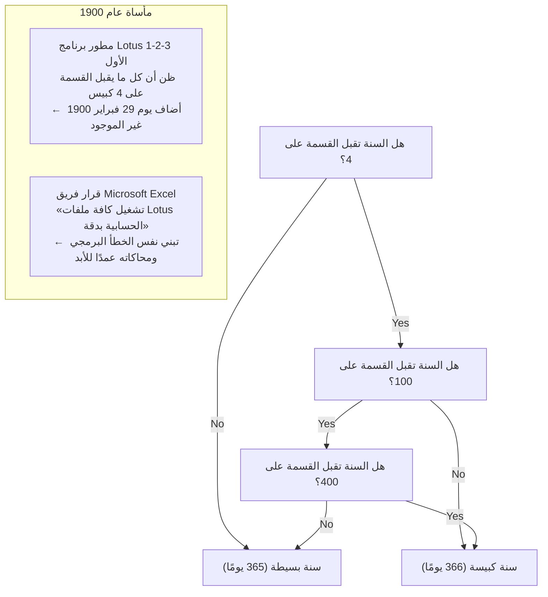

ومع ذلك، فإن مطوري برنامج الجداول الحسابية الشهير «Lotus 1-2-3» الذي سيطر على بيئة DOS في مطلع الثمانينيات أغفلوا شرط الاستثناء الخاص بالرقم 100، واعتبروا عام 1900 كبيسًا في الشفرة البرمجية. ونتيجة لذلك، احتوى Lotus 1-2-3 على تاريخ وهمي هو «29 فبراير 1900»، مما جعل الأرقام التسلسلية للتواريخ تزحف بيوم واحد.

وعندما دخلت مايكروسوفت حلبة المنافسة ببرنامج «Excel»، واجه فريق التطوير خيارًا حاسمًا: هل يطبقون التقويم الصحيح رياضيًا وفلكيًا، أم يضمنون التطابق الحسابي المطلق مع عشرات الملايين من جداول الحسابات والبيانات المالية التي أنشأتها الشركات باستخدام Lotus 1-2-3؟

وجاء قرار مايكروسوفت بقيادة بيل غيتس حاسمًا: اختار فريق Excel **«تنفيذ نفس الخطأ البرمجي بوعي كامل وجعل يوم 29 فبراير 1900 موجودًا في برنامجهم»** لضمان الانتقال السلس وغير المنقوص لبيانات العملاء.

والآن، إذا فتحت أحدث إصدارات Microsoft 365 Excel على حاسوبك وكتبت في أي خلية `=DATE(1900, 2, 29)`، ستفاجأ بأن البرنامج المدعوم بأحدث تقنيات الذكاء الاصطناعي في القرن الحادي والعشرين يعرض لك التاريخ الوهمي «1900/2/29» دون أي اعتراض! إن قرار تبني أخطاء الآخرين إذا اتُخذ مرة، يستحيل التراجع عنه لعقود وربما لقرون قادمة.

### 3.2 لماذا تم تخطي الاسم «Windows 9»؟

في عام 2014، أعلنت مايكروسوفت عن خليفة نظام «Windows 8.1». وكان الجميع يترقب بطبيعة الحال إطلاق اسم «Windows 9»، إلا أن مسؤولي الشركة فاجأوا العالم بإعلان القفز مباشرة إلى **«Windows 10»**.

لماذا تم شطب الرقم «9» وتجاهله تمامًا؟ بعيدًا عن التبريرات التسويقية الرسمية لإعطاء انطباع بالتجديد، كشف خبراء الهندسة العكسية وموظفون سابقون عن «لغم توافقي برمجى» كان السبب الحقيقي وراء هذا القرار.

فقد اكتُشف أن عددًا لا يُحصى من البرمجيات القديمة، ومكتبات Java، وحزم تثبيت البرامج المنتشرة حول العالم، كانت تحتوي على شفرات فحص مختصرة وكسولة لتحديد إصدار نظام التشغيل، كُتبت بالشكل التالي:

```java
// نمط كود انتشر في آلاف البرمجيات القديمة حول العالم
String osName = System.getProperty("os.name");

if (osName.startsWith("Windows 9")) {
    // تنفيذ المعالجة القديمة المخصصة لنظام Windows 95 أو Windows 98!
    // استخدام مسارات السجل القديمة وتفعيل وضع 16-بت التوافقي
    enableLegacyWin9xMode();
} else {
    // معالجة الأنظمة الحديثة المعتمدة على نواة NT (مثل Windows NT, 2000, XP, 7, 8)
    enableModernNTMode();
}
```

كان المبرمجون يستخدمون التعبير `startsWith("Windows 9")` كطريقة سهلة ومختصرة للتحقق مما إذا كان النظام هو Windows 95 أو Windows 98 في آن واحد.

فلو أطلقت مايكروسوفت رسميًا نظامًا باسم «Windows 9»، ماذا كان سيحدث؟  
بمجرد تثبيت Windows 9 على حاسوب فائق المواصفات، كانت عشرات الآلاف من البرمجيات المؤسسية ستعتقد خطأً أن الحاسوب يعمل بنظام Windows 95 الصادر عام 1995، وستحاول تنفيذ أوامر قديمة لعصر DOS وتتجاهل واجهات نواة NT الحديثة، لتنهار على الفور!

«لا يمكننا المخاطرة بانهيار برمجيات العالم من أجل مجرد اسم رقمي» — وهكذا دفع الرعب الفطري من كسر التوافق مايكروسوفت إلى دفن الاسم «Windows 9» في غياهب النسيان.

### 3.3 الواجهات البرمجية غير الموثقة (Undocumented APIs) وأداة Norton Utilities

في التسعينيات، كانت حزمة صيانة وفحص النظام «Norton Utilities» التي طورتها شركة Symantec أداة أساسية لا غنى عنها لكل مستخدم حاسوب. ولكن بالنسبة لفريق تطوير Windows، كانت Norton Utilities كابوسًا مستمرًا ومثالاً صارخًا على «البرمجيات سيئة السلوك».

فبرمجيات الصيانة منخفضة المستوى مثل Norton لم تكن تكتفي باستخدام واجهات Win32 API الرسمية الموثقة من مايكروسوفت، بل **«كانت تتسلل مباشرة إلى هياكل البيانات غير الموثقة داخل Windows، وتستدعي دوال خفية، بل وتتعامل مع إزاحات ذاكرة محددة (Memory Offsets) داخل ملفات DLL»**.

يروي ريموند تشن المعارك الطاحنة التي خاضها فريقه مع Norton Utilities أثناء تطوير Windows 95. فعندما حُدثت معمارية النظام وتغيرت هياكل إدارة الذاكرة والمهام بمقدار بايت واحد فقط، كانت Norton تنهار وتتسبب في إطلاق شاشة الموت الزرقاء (BSoD).

ولم يكن رد مايكروسوفت أيضًا هو حظر Norton أو معاقبتها على سوء استخدام النظام؛ بل قام مهندسوها بتفكيك ملفات Norton الثنائية وهندستها عكسيًا بدقة لمعرفة «أي الإزاحات بالتحديد تحاول Norton قراءتها من الذاكرة»، ثم **قاموا ببناء طبقة توافق داخل Windows تبقي على هياكل بيانات وهمية غير موثقة في نفس عناوين الذاكرة القديمة تمامًا التي تتوقعها Norton**.

### 3.4 اليوم الذي ظهر فيه بيل غيتس ببندقية صيد: أسطورة DOOM وميلاد DirectX وWinG

قبيل إطلاق Windows 95، كانت مكانة Windows في سوق ألعاب الحواسيب بائسة ومثيرة للشفقة. كان مطورو الألعاب ينظرون إلى Windows على أنه «نظام مكتبي بطيء مثقل بواجهات الرسوم لا يصلح إطلاقًا لألعاب الحركة السريعة»، وكانت كافة الألعاب الضخمة تُكتب خصيصًا لنظام MS-DOS عبر التحكم المباشر بمنافذ عتاد بطاقات الرسوميات والصوت (Sound Blaster).

وكان الرمز الأكبر لتلك الحقبة هو لعبة إطلاق النار الأسطورية «DOOM» من شركة id Software. فقد تحولت DOOM إلى ظاهرة عالمية نُصبت خلسة على حواسيب المكاتب وقيل إنها خفضت إنتاجية الشركات في أمريكا.

استشعر بيل غيتس الخطر وقال: «إذا اضطر المستخدمون لإعادة تشغيل الحواسيب على وضع DOS للعب الألعاب، فلن يكتب لـ Windows 95 النصر الكامل. يجب أن تعمل DOOM فوق Windows 95 وبسرعة تفوق نسختها على DOS».

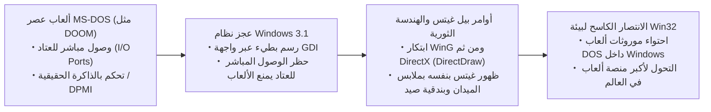

أعطى غيتس توجيهاته لنخبة المهندسين لتطوير مكتبة رسومية تدعى «WinG»، والتي تطورت سريعًا لتصبح واجهات «DirectX» (وكانت تحمل الاسم الكودي: مشروع مانهاتن Manhattan Project) بهدف محاكاة وصول ألعاب DOS إلى العتاد وتسريعها فوق Windows.

بل وظهر بيل غيتس بنفسه في فيديو ترويجي أسطوري مرتديًا معطفًا طويلاً وهو يحمل بندقية صيد داخل عالم لعبة DOOM، ليعلن للعالم أن «Windows 95 هو منصة الألعاب القصوى». وكانت الخبرات التي اكتسبها المهندسون في ترويض هجمات برامج DOS المباشرة على العتاد وجعلها تعمل داخل نمط الحماية (Protected Mode) في Windows هي حجر الزاوية الذي بنيت عليه أسطورة توافق الوسائط المتعددة في Windows.

---

## الفصل الرابع: الحصن العملاق الذي يحمي Windows الحديث — نظام «AppCompat (توافق التطبيقات)»

في حقبة Windows 95، كانت ترقيعات التوافق تُنثر كأكواد شرطية مخصصة وموزعة داخل وحدات النظام المختلفة. ولكن مع الانفجار الهائل في أعداد البرمجيات في عصر Windows 2000 وWindows XP، بلغت تلك الطريقة حدودها القصوى؛ إذ امتلأت شفرة النواة بتفريعات شرطية لإنقاذ برامج الآخرين مما جعل صيانة النظام كابوسًا مستحيلاً.

وهنا ابتكر عباقرة المعمارية في مايكروسوفت أقوى محرك توافق عرفه العالم، والذي لا يزال ينبض داخل Windows 11 اليوم — **النظام الفرعي لتوافق التطبيقات «Application Compatibility (AppCompat)»**.

### 4.1 البنية الهيكلية الشاملة لنظام AppCompat الفرعي

يمكن تعريف نظام AppCompat ببساطة بأنه **«منظومة اعتراض ذكية تراقب تحميل الملفات التنفيذية في الذاكرة لحظة بلحظة، وتقوم ديناميكيًا بحقن طبقات تزييف شفافة (Shims) بين التطبيق ونواة النظام لعزله في بيئة افتراضية ملائمة»**.

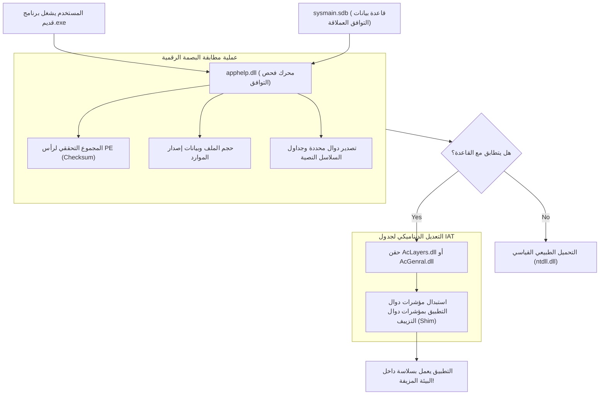

عندما ينقر المستخدم نقرًا مزدوجًا على ملف تنفيذي (EXE)، فإن إجراءات إنشاء العمليات في Windows (الموجودة داخل `ntdll.dll`) لا تباشر تنفيذ الكود فورًا، بل تستدعي أولاً مكتبة **`apphelp.dll`**.

تقوم `apphelp.dll` بفحص قاعدة بيانات التوافق الضخمة المخزنة في النظام **`sysmain.sdb`**، وتتحقق بدقة مما إذا كان هذا الملف التنفيذي مسجلاً كبرنامج يحتاج إلى إنقاذ خاص. فإذا كان الأمر كذلك، يقوم محمل النظام وقبل تحميل مكتبات النظام الرسمية (مثل `kernel32.dll` أو `user32.dll`) بحقن مكتبات طبقة التوافق مثل **`AcLayers.dll`** أو **`AcGenral.dll`** قسريًا داخل مساحة عناوين العملية.

### 4.2 محرك Shim: آلية استبدال الدوال عبر اعتراض جدول عناوين الاستيراد (IAT Hooking)

كيف تخدع هذه الطبقات (Shims) التطبيق المستهدف؟ تعتمد التقنية الجوهرية هنا على ما يُعرف بـ **«اعتراض جدول عناوين الاستيراد (Import Address Table - IAT Hooking)»** في بنية ملفات Windows التنفيذية (PE).

حين يستدعي برنامج Windows دالة من مكتبة خارجية (مثل `GetVersionEx` أو `GetDiskFreeSpace`)، فإن كود لغة الآلة المترجم لا يحتوي على عنوان الذاكرة الحقيقي للدالة داخل مكتبة DLL بشكل مباشر. بل عندما يبدأ البرنامج، يفحص محمل النظام العناوين الحقيقية لمكتبات DLL ويكتب عناوين الدوال في جدول مصفوفي داخل مساحة ذاكرة البرنامج يُعرف باسم «IAT». والبرنامج يستدعي الدوال دائمًا بشكل غير مباشر عبر هذا الجدول.

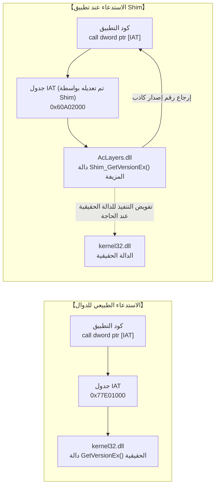

يستغل محرك Shim هذه البنية بذكاء؛ فقبل أن يبدأ البرنامج في تنفيذ شفرته، يتدخل محرك Shim ويغير سمات حماية الذاكرة لجدول IAT مؤقتًا إلى `PAGE_READWRITE`، ثم **«يقوم باستبدال مؤشرات عناوين دوال النظام الحقيقية المخزنة في IAT بمؤشرات دوال التزييف (Shim Functions) الخاصة به»**.

ويمكن توضيح هذا المفهوم بالشفرة التوضيحية التالية بلغة C/C++:

```c
// شفرة توضيحية تجسد كيفية حقن طبقات Shim عبر IAT Hooking
#include <windows.h>
#include <imagehlp.h>

// دالة فحص الإصدار المزيفة (جوهر عمل الـ Shim)
BOOL WINAPI Shim_GetVersionExA(LPOSVERSIONINFOA lpVersionInformation)
{
    // استدعاء الدالة الحقيقية للحصول على البيانات الأساسية أولاً
    typedef BOOL (WINAPI *PFN_GETVER)(LPOSVERSIONINFOA);
    HMODULE hKernel = GetModuleHandleA("kernel32.dll");
    PFN_GETVER pfnRealGetVer = (PFN_GETVER)GetProcAddress(hKernel, "GetVersionExA");
    
    BOOL bResult = pfnRealGetVer(lpVersionInformation);
    
    // 【عملية التمويه والتزييف】
    // نكذب على التطبيق عمدًا ونخبره بأن النظام هو Windows 95 (Major: 4, Minor: 0)
    lpVersionInformation->dwMajorVersion = 4;
    lpVersionInformation->dwMinorVersion = 0;
    lpVersionInformation->dwBuildNumber = 950;
    lpVersionInformation->dwPlatformId = VER_PLATFORM_WIN32_WINDOWS;
    strcpy(lpVersionInformation->szCSDVersion, "");

    return TRUE; // يصدق التطبيق الكذبة تمامًا ويعمل وكأنه في بيئة Windows 95!
}

// دالة فحص ملف PE واعتراض جدول IAT لزرع الـ Shim
void InstallShimHook(HMODULE hAppModule, LPCSTR targetDll, LPCSTR targetFunc, PVOID newFuncAddress)
{
    ULONG size;
    // الحصول على دليل الاستيراد من رأس ملف PE
    PIMAGE_IMPORT_DESCRIPTOR pImportDesc = (PIMAGE_IMPORT_DESCRIPTOR)
        ImageDirectoryEntryToData(hAppModule, TRUE, IMAGE_DIRECTORY_ENTRY_IMPORT, &size);

    while (pImportDesc->Name) {
        LPCSTR dllName = (LPCSTR)((PBYTE)hAppModule + pImportDesc->Name);
        if (_stricmp(dllName, targetDll) == 0) {
            // البحث داخل جدول Thunk التابع للـ DLL المستهدفة (مثل kernel32.dll)
            PIMAGE_THUNK_DATA pThunk = (PIMAGE_THUNK_DATA)((PBYTE)hAppModule + pImportDesc->FirstThunk);
            while (pThunk->u1.Function) {
                PROC* ppfn = (PROC*)&pThunk->u1.Function;
                // عند العثور على مؤشر الدالة المستهدفة، نستبدل العنوان
                DWORD oldProtect;
                VirtualProtect(ppfn, sizeof(PROC), PAGE_READWRITE, &oldProtect);
                *ppfn = (PROC)newFuncAddress; // استبدال المؤشر بعنوان الدالة المزيفة!
                VirtualProtect(ppfn, sizeof(PROC), oldProtect, &oldProtect);
                break;
            }
        }
        pImportDesc++;
    }
}
```

تتيح هذه الآلية الفذة لمايكروسوفت حبس التطبيقات القديمة داخل بيئة ماضية افتراضية محكمة، دون تعديل بايت واحد في الملف التنفيذي للتطبيق على القرص، ودون تلويث نواة Windows بشفرات استثنائية مشوهة.

### 4.3 الملف الثنائي الغامض `sysmain.sdb` (قاعدة بيانات التوافق)

يقبع في المسار `C:\Windows\AppPatch\` داخل كل نظام Windows ملف ثنائي غامض يدعى **`sysmain.sdb`**.

هذا الملف عبارة عن قاعدة بيانات ثنائية مخصصة صممتها مايكروسوفت (بنسق SDB)، وتحتوي داخلها على **«وصفات إنقاذ مخصصة لمئات الآلاف من البرمجيات والألعاب والأدوات التجارية القديمة من جميع أنحاء العالم»**.

ولكي لا يتم تطبيق الترقيعات بالخطأ على برامج حديثة بمجرد تشابه الأسماء (مثل اسم `setup.exe`)، يستخدم محرك المطابقة في `sysmain.sdb` بصمة متعددة الأبعاد للتعرف على الملف بدقة متناهية:

1. **اسم الملف ومساره الكامل**
2. **حجم الملف بالبايت بدقة**
3. **الطابع الزمني في رأس ملف PE (Linker Timestamp)**
4. **المجموع التحققي للملف (PE CheckSum)**
5. **معلومات موارد الإصدار (CompanyName, ProductName, FileVersion, LegalCopyright)**
6. **بصمات التجزئة (Hash) لأقسام محددة وهيكل جدول تصدير الدوال**

فإذا أدخل مستخدم قرصًا مدمجًا لموسوعة تعليمية صدرت عام 2001 في حاسوب يعمل بنظام Windows 11، تفحص مكتبة `apphelp.dll` بصمة البرنامج وتطابقها في أجزاء من الثانية مع سجلاتها، لتستخرج ملف تشخيص حالته: «هذا البرنامج صُمم لنظام Windows 2000، ويعتمد على ترتيب محاذاة محدد في كومة الذاكرة، ويحاول الكتابة في مسارات سجل تتطلب صلاحيات المدير»، ومن ثم يطبق النظام فورًا عشرات الترقيعات (Shims) المخصصة له ليعمل بمنتهى الاستقرار.

---

## الفصل الخامس: دليل تقنيات الخداع والإنقاذ — أشهر طبقات التوافق (Shims)

تتضمن مكتبة Windows مئات الأنواع المختلفة من طبقات التوافق (Shims)، والتي تمثل دليلاً شاملاً لحيل التمويه والإنقاذ التي ابتكرها المهندسون لعلاج كل خطأ ارتكبه المبرمجون في الماضي.

### 5.1 `VersionLie`: عندما يكذب النظام قائلاً «أنا Windows 95 تمامًا كما تطلب»

تُعد **`VersionLie`** الحيلة الكلاسيكية الأكثر استخدامًا على الإطلاق.

يستدعي المبرمجون دالة `GetVersion` أو `GetVersionEx` عند بدء تشغيل البرنامج للتحقق مما إذا كان النظام بيئة مدعومة. ولكن للأسف، كانت الكثير من البرامج تُكتب بهذا الأسلوب الساذج:

```c
// نموذج للفحص البرمجي الكارثي لإصدار النظام
OSVERSIONINFO vi;
GetVersionEx(&vi);

// افتراض خاطئ بأن النظام يجب أن يكون Windows 95 فقط
if (vi.dwMajorVersion == 4 && vi.dwMinorVersion == 0) {
    // إقلاع طبيعي
} else {
    MessageBox(NULL, "هذا البرنامج مخصص لنظام Windows 95 فقط ولا يعمل على الأنظمة الأحدث.", "خطأ", MB_OK);
    ExitProcess(1); // إنهاء البرنامج قسريًا بقرار ذاتي!
}
```

مثل هذا البرنامج سيرفض العمل تمامًا على الأنظمة الأحدث مثل Windows XP (الإصدار 5) أو Windows 7 (الإصدار 6) أو Windows 10/11 (الإصدار 10)، لمجرد أن رقم الإصدار الرئيسي ليس 4!

وهنا تتدخل طبقة `VersionLie`؛ فعندما يستدعي البرنامج دالة `GetVersionEx`، تعيد له نواة Windows 11 بملامح جادة هيكل بيانات كاذب يقول: **«أنت تعمل على Windows 95 (Major: 4, Minor: 0)»**. ويشعر البرنامج بالرضا التام، ويبدأ عمله بكل حيوية فوق معالج حديث متعدد الأنوية وقرص NVMe فائق السرعة، متوهماً أنه في تسعينيات القرن الماضي.

### 5.2 `EmulateGetDiskFreeSpace`: إنقاذ البرامج من طفحان السعات التخزينية التي تتجاوز 2 جيجابايت

في منتصف التسعينيات، كانت السعات التخزينية للأقراص الصلبة تُقاس بمئات الميغابايت أو نحو غيغابايت واحد. وكانت دالة `GetDiskFreeSpace` في Win32 تعيد عدد القطاعات لكل عنقود، وعدد البايتات لكل قطاع، وعدد العناقيد الحرة كأعداد صحيحة ذات إشارة بحجم 32 بت (Signed 32-bit Integer).

وكان المبرمجون يحسبون المساحة الحرة بالمعادلة التالية:

$$ \text{FreeBytes} = \text{SectorsPerCluster} \times \text{BytesPerSector} \times \text{NumberOfFreeClusters} $$

ولكن بمجرد أن تجاوزت سعات الأقراص الصلبة حاجز **2 غيغابايت ($2^{31} - 1$ بايت)**، تعرضت حسابات الأعداد الصحيحة 32-بت للطفحان الحسابي (Integer Overflow)، وانقلبت النتيجة الرياضية فجأة إلى **قيمة سالبة (مثل سالب 500 ميغابايت)**!

ونتيجة لذلك، حين حاول المستخدمون تثبيت برامج مكتبية أو ألعاب قديمة على حواسيب بأقراص حديثة، كانت برامج التثبيت تتوقف وتصرخ قائلة: «المساحة المتبقية على قرصك هي -500 ميغابايت فقط! لا توجد مساحة كافية للتثبيت».

وجاءت طبقة التوافق **`EmulateGetDiskFreeSpace`** لتنقذ الموقف؛ فعندما يستفسر البرنامج عن المساحة المتاحة، ومهما بلغت سعة القرص الحالية بالتيرابايت، تكذب هذه الطبقة على البرنامج وتقول له: **«المساحة الحرة المتاحة حاليًا هي 2,147,151,872 بايت بالضبط (نحو 1.99 غيغابايت)»**، وهي أعلى قيمة ممكنة لا تتسبب في طفحان الأعداد 32-بت. فيقتنع البرنامج بوجود مساحة كافية ويكمل التثبيت بنجاح.

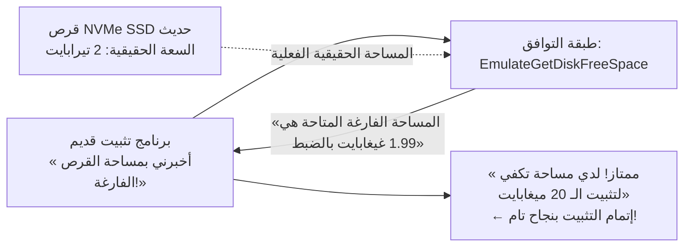

### 5.3 `VirtualRegistry` و `VirtualStore`: إعادة التوجيه الافتراضي عند إطلاق نظام UAC

في عام 2006، شهد نظام Windows Vista تحولاً أمنيًا جذريًا مع تقديم ميزة **«التحكم في حساب المستخدم (User Account Control - UAC)»**.

فقبل ذلك في Windows 95/98 وXP، كان المستخدمون يعملون بصلاحيات المدير (Administrator) طوال الوقت تقريبًا، وكانت التطبيقات تكتب ملفات إعداداتها وحفظ بياناتها داخل المجلدات المحمية مثل `C:\Program Files`، أو داخل مسار السجل الحساس `HKEY_LOCAL_MACHINE\Software` دون أي حرج.

ولكن معايير الأمان في Vista أصبحت تحظر على المستخدمين العاديين الكتابة في تلك المجلدات الحساسة وتعيد خطأ `ACCESS_DENIED`. وكان تطبيق هذه المعايير بشكل صارم كفيلاً بتعطيل ملايين البرامج القديمة التي ستفشل في حفظ إعداداتها وتنهار فجأة.

ولحل هذه الكارثة، ابتكرت مايكروسوفت تقنية **«VirtualStore (الافتراضية للملفات والسجل)»**.

فعندما يحاول برنامج قديم يفتقر لصلاحيات المدير الكتابة في `C:\Program Files\Game\save.dat`، لا يرجع نظام الإدخال والإخراج خطأً، بل يقوم بنقل عملية الكتابة بصمت وسرية تامة إلى مجلد آمن وخاص بالمستخدم:  
`C:\Users\<UserName>\AppData\Local\VirtualStore\Program Files\Game\save.dat`.

وعندما يحاول البرنامج قراءة الملف لاحقًا، يجلبه النظام من مجلد VirtualStore. ويظل البرنامج مقتنعًا بأنه يتعامل مع مجلد Program Files الحقيقي، بينما هو في الواقع معزول داخل صندوق رملي آمن دون أن يمس استقرار النظام بسوء.

### 5.4 `DXPrimaryBltPunt`: معالجة انهيار لوحة الألوان ومعدل الإطارات في ألعاب DirectDraw القديمة

اعتمدت ألعاب الرسوم ثنائية الأبعاد في عصر Windows 95 وXP (مثل لعبة «Age of Empires» والعديد من ألعاب RPG الكلاسيكية) على واجهة «DirectDraw» للرسم على الشاشة. وكانت تلك الألعاب مصممة لتعمل بنمط 256 لونًا (لوحة ألوان 8-بت)، وتقوم بتغيير تدرجات الإضاءة والمؤثرات عبر تعديل لوحة ألوان السطح الأساسي (Primary Surface) لذاكرة الرسوميات (VRAM) مباشرة.

إلا أن معالجات الرسوميات الحديثة ونظام إدارة النوافذ في Windows (DWM: Desktop Window Manager) يتعامل مع الشاشة كنسيج ثلاثي الأبعاد بألوان حقيقية 32-بت (TrueColor). وأصبح التعديل المباشر على لوحات 256 لونًا شيئًا من الماضي السحيق غير مدعوم عتاديًا ولا برمجيًا.

ولو شغلت لعبة DirectDraw قديمة على حاسوب حديث دون حماية، لانهار تناغم لوحة الألوان وتحولت الشاشة إلى فسيفساء بصرية مجنونة من الألوان الصارخة غير المفهومة، أو لانطلقت اللعبة بمعدل مئات الإطارات في الثانية لتصبح غير قابلة للعب تمامًا بسبب عدم توافق التردد.

وتحل طبقات مثل **`DXPrimaryBltPunt`** و **`ForceDirectDrawEmulation`** هذه المعضلة؛ حيث تعترض أوامر رسم الأسطح القديمة في DirectDraw، وتحولها في الذاكرة لحظيًا وبشكل فوري إلى أنسجة رسومية حديثة متوافقة مع Direct3D، لتعرض بسلاسة وأمان عبر محرك DWM. إن المعجزة التي تجعل لعبة بكسل عتيقة كُتبت قبل 30 عامًا تظهر بألوانها الأصلية الدافئة على شاشات 4K الحديثة هي ثمرة هذه الهندسة التزييفية البارعة.

---

## الفصل السادس: الإبحار نحو معماريتي 64 بت وARM — روائع WOW64 والمحاكاة الثنائية

حين تتغير معمارية المعالجات المركزية من جذورها، تعجز حيل اعتراض الواجهات البرمجية البسيطة عن حل المشكلة بمفردها. وهنا واجه Windows الانقطاعات التاريخية عبر بناء «أنظمة تشغيل متكاملة داخل نظام التشغيل نفسه».

### 6.1 من NTVDM إلى WOW64: العالم المزدوج لنظام الملفات والسجل

في مرحلة الانتقال من 16-بت إلى 32-بت، وفر نظام Windows NT بيئة **NTVDM (NT Virtual DOS Machine)** التي استغلت نمط Virtual 8086 في معالجات إنتل لتشغيل تطبيقات DOS وWin16.

وفي منتصف العقد الأول من الألفية، ومع ظهور معمارية AMD64 (x64) والانتقال من 32-بت إلى 64-بت، أطلقت مايكروسوفت نظامها الفرعي المذهل **«WOW64 (Windows 32-bit On Windows 64-bit)»**.

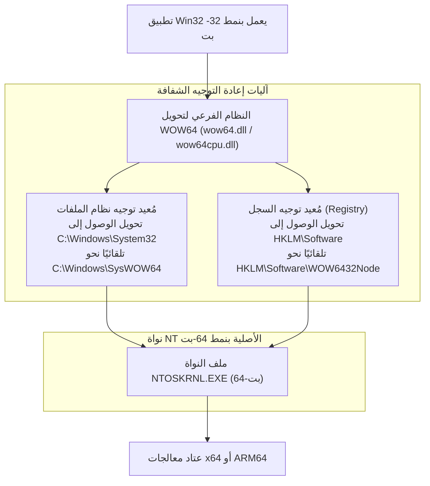

يكمن السحر الأكبر في نظام WOW64 في قدرته على تقديم **«عالم موازٍ ومزدوج بالكامل لنظام الملفات وسجل النظام (Registry)»** أمام التطبيقات ذات الـ 32 بت:

- **مُعيد توجيه نظام الملفات (File System Redirector)**:  
  في أنظمة 64-بت، توجد ملفات DLL الأصلية الخاصة بالنواة في المجلد `C:\Windows\System32`. ولكن عندما يحاول برنامج قديم 32-بت الوصول إلى هذا المجلد، يقوم النظام خفية وبشكل شفاف بتحويل المسار نحو `C:\Windows\SysWOW64` (وهو المجلد الذي يحتوي، على عكس ما يوحي به اسمه ظاهريًا، على مكتبات 32-بت!).
- **انعكاس السجل (Registry Reflection and Redirection)**:  
  بالمثل، عندما يحاول تطبيق 32-بت الكتابة في مسار السجل `HKEY_LOCAL_MACHINE\Software`، يقوم WOW64 بعزل تلك المفاتيح وتحويلها تلقائيًا إلى المسار الفرعي `HKEY_LOCAL_MACHINE\Software\WOW6432Node`.

وبفضل هذا العالم الموازي الدقيق، يستطيع برنامج 32-بت أُنتج عام 1998 العمل اليوم دون أن يدرك إطلاقًا أنه يعمل فوق نظام 64-بت حديث، ويستمر في القراءة والكتابة في مسارات System32 والسجل التي ألفها منذ ربع قرن.

### 6.2 الانتقال إلى معمارية ARM64 ومحاكي Prism

المعركة الأكثر شراسة اليوم تدور حول التحول من معالجات x86/x64 نحو **معالجات ARM64 (مثل معالجات Qualcomm Snapdragon X Elite)**.

في عام 2012، حاولت مايكروسوفت طرح نظام «Windows RT»، وحاولت حينها تطبيق سياسة «بتر الماضي على طريقة Apple»، رافضة تشغيل برامج Win32 التقليدية على معالجات ARM. وماذا كانت النتيجة؟ رفض السوق نظام Windows RT رفضًا قاطعًا، وتكبدت مايكروسوفت خسائر مليارية فادحة في تلك المغامرة الفاشلة. علّم هذا الدرس القاسي فريق Windows حقيقة راسخة: «أي نظام Windows لا يستطيع تشغيل برامج Win32 القديمة ليس نظام Windows حقيقيًا، حتى وإن كان يعمل على معالجات ARM».

واليوم، يحتوي نظام Windows 11 on ARM على محاكي ترجمة ثنائية متقدم يدعى **«Prism»**. يقوم محرك Prism بتحليل تعليمات لغة الآلة لـ x86/x64 في الوقت الفعلي وترجمتها ديناميكيًا (JIT Compilation) إلى تعليمات متوافقة مع معمارية ARM64، مع تخزين الكتل المترجمة في ذاكرة وسيطة محسنة للوصول إلى أداء يقارب سرعة التشغيل الأصلية.

فمهما اختلفت بنية المعالجات، تظل تجربة المستخدم مقدسة: «انقر نقرًا مزدوجًا، وسيعمل البرنامج القديم فورًا». وهذا هو العهد الصارم الذي لا رجعة فيه لمايكروسوفت بعد عقود من التجارب والدروس.

---

## الفصل السابع: ثلاث فلسفات تصميمية متباينة — مقارنة شاملة: Windows مقابل Apple (macOS) مقابل Linux

في مواجهة السؤال الجوهري: «كيف نتعامل مع البرمجيات القديمة؟»، قدمت أنظمة التشغيل الكبرى الثلاثة في العالم إجابات متباينة جذريًا. والمقارنة بين هذه الفلسفات تكشف بوضوح عن التفرد الاستثنائي والمكانة الفريدة لنظام Windows.

### 7.1 Apple (القطيعة الجراحية): حرق الماضي من أجل التقدم نحو المستقبل

منذ أيام ستيف جوبز وحتى عهد تيم كوك الحالي، كانت فلسفة Apple دائمًا تقوم على **«التدمير الجراحي للماضي في سبيل تجربة المستقبل (Scorched Earth Policy)»**.

تاريخ Apple عبارة عن سلسلة متتالية من الانقطاعات المعمارية الحادة:
- **التخلي التام عن نظام Classic Mac OS**: الانتقال الإجباري من Mac OS 9 إلى Mac OS X (المعتمد على Unix وNeXT)، وتوفير واجهة «Carbon» لفترة مؤقتة فقط ثم إعدامها نهائيًا.
- **التحولات العتادية العنيفة**: الانتقال من 680x0 إلى PowerPC، ثم إلى Intel x86، وأخيرًا إلى Apple Silicon (عائلة M). ومع كل تحول تطرح Apple محاكيًا مؤقتًا (محاكي 68K، ثم Rosetta، ثم Rosetta 2)، ولكن بعد 3 إلى 5 سنوات، تحذف Apple المحاكي بالكامل من النظام لتقتل كافة الملفات الثنائية القديمة للأبد.
- **الإبادة الكاملة لتطبيقات 32-بت في macOS Catalina**: في عام 2019، أزالت Apple بيئة تشغيل 32-بت نهائيًا من macOS Catalina. وتوقفت آلاف الإضافات الصوتية والألعاب التي استثمر فيها المستخدمون عن العمل بين ليلة وضحاها.

موقف Apple صريح لا لبس فيه: «على المطورين دائمًا استخدام أحدث إصدارات Xcode، وإعادة كتابة برامجهم بلغة Swift، وإعادة تصريفها لأحدث إصدار من macOS. والبرمجيات القديمة الكسولة التي تعجز عن ذلك تستحق الطرد من نظامنا البيئي». يمنح هذا النهج macOS ميزة الحفاظ على شفرة نقية وحديثة ونظام رشيق وسريع، ولكنه يفرض على المطورين والمستخدمين ضريبة باهظة من التحديث المستمر الإجباري.

### 7.2 Linux (وصية لينوس): «إياك وكسر مساحة المستخدم (Never break userspace!)» — بريقها وظلالها

في عالم المصادر المفتوحة، يفرض مبتكر نواة Linux، لينوس تورفالدس (Linus Torvalds)، قاعدة مقدسة صارمة تشبه إلى حد مذهل مبدأ فريق Windows: **«Never break userspace! (إياك وكسر مساحة المستخدم أبداً!)»**.

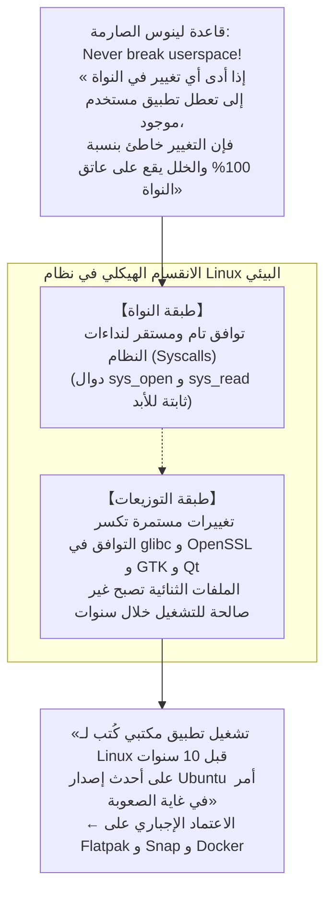

إذا تسبب أي تعديل في نواة Linux في تعطيل تطبيق موجود في مساحة المستخدم، ومهما كان ذلك التعديل أنيقًا وجميلًا من الناحية البرمجية، فإن لينوس يثور غضبًا في القوائم البريدية للمطورين ويقوم بإلغاء ذلك التعديل فورًا. وفي هذا الجانب، تتفق نواة Linux تمامًا مع فلسفة Windows.

ولكن على صعيد سطح المكتب (Desktop Linux)، لا يوجد وسيط مهيمن وموحد كما هو الحال في Windows. ورغم ثبات واجهات نداءات النواة، فإن طبقات التوزيعات والمكتبات المشتركة (مثل `glibc` و `OpenSSL` ومكتبات الواجهات الرسومية) تكسر التوافق العكسي باستمرار. ونتيجة لذلك، فإن **«تشغيل ملف تنفيذي تم بناؤه بربط ديناميكي قبل 10 سنوات على أحدث إصدارات Ubuntu يُعد مهمة بالغة الصعوبة والتعقيد»**. لقد حمى Linux التوافق على مستوى النواة، ولكن تشتت النظام البيئي حال دون وصوله إلى مستوى تشغيل برامج تعود إلى 30 عامًا مضت بسهولة.

### 7.3 Windows (الاحتواء التراكمي): جنون الطبقات المتراكمة

في المقابل، اختار نظام Windows نهج **«الاحتواء التراكمي (Cumulative Inclusion)»**.

لم تتخلص مايكروسوفت أبدًا من واجهة برمجية أو نظام فرعي قديم، بل ظلت تراكم الطبقات الجديدة فوق القديمة تمامًا كطبقات الصخور الجيولوجية: بنيت Win32 فوق Win16، ثم بنيت دوت نت (.NET) فوق Win32، ثم بنيت WinRT/UWP فوقها، وعندما تعثرت UWP، عادت وبنت Windows App SDK (WinUI 3) فوق أساسات Win32 المتينة من جديد.

صحيح أن هذا النهج جعل Windows أضخم نظام يمتلك أكثر الشفرات تعقيدًا على كوكب الأرض، ولكنه حقق في المقابل المعجزة الكبرى: **«بيئة رقمية فريدة في تاريخ البشرية تتعايش فيها برمجيات كافة الحقب التاريخية وتعمل في سلام جنبًا إلى جنب»**.

| وجه المقارنة | مايكروسوفت (Windows) | أبل (macOS) | لينكس (Linux Desktop) |
| :--- | :--- | :--- | :--- |
| **فلسفة التوافق الأساسية** | **الاحتواء التراكمي (Accumulation)**<br/>احتضان الماضي بكامل تفاصيله | **القطيعة الجراحية (Disruption)**<br/>بتر موروثات الماضي دوريًا | **حماية النواة وحرية التوزيعات**<br/>ثبات النواة وتشتت الطبقات العليا |
| **الأمر المطلق (Prime Directive)** | "Don't break old apps" | "Embrace the modern platform" | "Never break userspace" (النواة) |
| **المدى الزمني للتوافق** | **أكثر من 30 عامًا** (Win32 / DOS) | **من 3 إلى 5 سنوات** (حذف المحاكيات) | طويل جدًا للنواة، وقصير لتطبيقات GUI |
| **مصير برامج 32-بت حاليًا** | **تعمل بالكامل في Win11** (عبر WOW64) | **أُبيدت تمامًا في Catalina (2019)** | تتطلب مكتبات معمارية متعددة معقدة |
| **المطلوب من المطورين** | لا شيء تقريبًا (تستمر البرامج بالعمل) | إعادة التصريف وإعادة كتابة الكود دوريًا | إعادة بناء الحزم لكل توزيعة ونظام |
| **نقاء المعمارية البرمجية** | معقدة وضخمة بمئات ملايين الأسطر | نقية جدًا وحديثة ورشيقة | نواة معيارية ولكن مساحة المستخدم مشتتة |

---

## الفصل الثامن: اقتصاديات المنصات — لماذا يعد التوافق العكسي «أقوى خندق اقتصادي (Moat)»؟

لماذا فرض بيل غيتس وإدارات مايكروسوفت المتعاقبة مثل هذه الهندسة المضنية والقاسية على فرق التطوير؟ تكمن الإجابة ليس في الرؤى الجمالية الهندسية، بل في **«اقتصاديات المنصات ونماذج الأعمال التجارية الصارمة»**.

### 8.1 نموذج أعمال بيل غيتس: قيمة نظام التشغيل هي «المجموع الكلي للبرمجيات التي تعمل عليه»

أدرك بيل غيتس منذ اللحظة الأولى لتأسيس مايكروسوفت جوهر أعمال المنصات الرقمية:

> **نظرية قيمة المنصة**:  
> لا تُحدد قيمة نظام التشغيل البرمجي بميزاته الذاتية المستقلة،  
> بل تُحدد بـ **«المجموع الكلي لكافة الأصول البرمجية والتطبيقات في العالم القادرة على العمل فوق تلك المنصة»**.

مهما بلغت حداثة نظام التشغيل، ومهما كانت واجهته أنيقة واستهلاكه للذاكرة منخفضًا، فإنه إذا عجز عن تشغيل البرامج التي يعتمد عليها المستخدم في إنجاز مهامه اليومية، فإن قيمته السوقية تساوي صفرًا. فالمستخدم لا يشتري نظام التشغيل كصندوق معزول، بل يشتري البرمجيات التي تعمل بداخله والإنتاجية التي تحققها تلك البرمجيات.

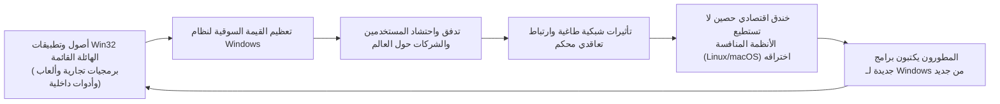

طالما ظلت مايكروسوفت تحافظ على التوافق العكسي بنسبة 100%، فإن كل سطر كود كتبه مبرمجو العالم لنظام Windows على مدار ثلاثين عامًا — وهي استثمارات برمجية تُقدر بمئات المليارات أو التريليونات من الدولارات — **تُضاف تلقائيًا وفورًا كرصيد قيمة مضافة للجيل الجديد من Windows**.

ومهما حاولت الأنظمة المنافسة مثل macOS أو Linux إبراز تفوقها التقني، فإن صفقة المبيعات كانت تنتهي دائمًا بكلمة واحدة من مديري الشركات: «برنامج إدارة المستودعات والطلبيات الذي صممته شركتنا قبل 20 عامًا لا يعمل على نظامكم». لقد كان التوافق العكسي هو الخندق الاقتصادي الحصين (Economic Moat) الذي عجزت الشركات المنافسة عن ردمه أو تجاوزه مهما فعلت.

### 8.2 القفل المحكم على سوق المؤسسات والشركات الكبرى (Enterprise Lock-in)

تجلت القوة الطاغية لهذه الاستراتيجية على وجه الخصوص في أسواق الشركات والمؤسسات الضخمة.

ففي كبرى الشركات، والمؤسسات الحكومية، ومصانع الإنتاج، والبنوك والمؤسسات المالية، تعمل آلاف الأنظمة الداخلية الحساسة (مثل برامج Visual Basic 6 أو أدوات C++ ActiveX) التي كلف بناؤها ملايين الدولارات عبر عقود. والشركات البرمجية التي صممت تلك الأنظمة إما أفلست منذ زمن طويل، أو ضاعت وثائقها الفنية، لتتحول تلك البرمجيات إلى «أصول تشغيلية حية لا يجرؤ أحد على لمسها».

فلو أقدمت مايكروسوفت على كسر التوافق وقالت للشركات: «هذه البرامج لن تعمل بعد اليوم؛ عليكم إنفاق ملايين الدولارات لإعادة برمجتها بتقنيات الويب الحديثة»، لثار مسؤولو تكنولوجيا المعلومات (CIOs)، وجمدوا ترقيات النظام إلى أجل غير مسمى، وربما بحثوا عن بدائل أخرى.

ولكن Windows لوّح بعصا نظام AppCompat السحرية وهمس للشركات قائلاً: «لا داعي لتعديل أي شيء. اشتروا أحدث الحواسيب، وستعمل برامجكم كما هي تمامًا». وبالنسبة للمديرين الماليين والتنفيذيين، كان هذا العرض هو الأكثر أمانًا وعقلانية واقتصادية. وهكذا وقعت مؤسسات العالم الكبرى في أسر بيئة Windows إلى الأبد.

### 8.3 «فخ النجاح (Success Trap)» الذي عرقل الابتكار الجذري

ولكن هذا النجاح الساحق تحول مع مرور الوقت وبسخرية القدر إلى **«فخ النجاح (Success Trap)»** الذي كبل مايكروسوفت من الداخل.

فعندما انفجرت ثورة الهواتف الذكية في العقد الثاني من القرن الحادي والعشرين وصعدت منصتا iOS وAndroid، حاولت مايكروسوفت تحديث Windows عبر إطلاق منصة التطبيقات العالمية «UWP (Universal Windows Platform)»، والتي صُممت بنظام معزول وآمن، في محاولة للتخلص التدريجي من تطبيقات Win32 الكلاسيكية.

ولكن المطورين والشركات تجاهلوا UWP تمامًا: «لماذا نعيد كتابة برامجنا لمنصة جديدة مقيدة الميزات لا تدعم وظائفنا القديمة؟ برامجنا المبنية على Win32 تعمل بكل كفاءة وسرعة على Windows 10 وWindows 11 دون أي عناء!».

والمفارقة المؤلمة هي أن **«Win32 كانت قوية وراسخة وتعمل في كل مكان لدرجة أن مايكروسوفت نفسها لم تعد قادرة على التخلص منها أو استبدالها»**. وفي نهاية المطاف، تراجعت مايكروسوفت عمليًا عن UWP، وسمحت بتغليف برامج Win32 ونشرها عبر متجر التطبيقات، وأعادت بناء واجهاتها الحديثة WinUI 3 فوق صرح Win32 ذاته. لقد أصبح التوافق العكسي الأسطوري الذي بنته مايكروسوفت بمثابة الحصن المنيع الذي وقف حائلاً أمام محاولاتها هي ذاتها للتغيير الجذري.

---

## الفصل التاسع: ثمن المجد والسيادة — تضخم الديون التقنية ومأزق الأمان

لم يكن تحمل أخطاء الآخرين وحماية موروثات الماضي مجانيًا أبدًا؛ بل دفعت مايكروسوفت في مقابله الثمن من خلال أعظم تراكم «للديون التقنية (Technical Debt)» عرفه أي مشروع برمجي في التاريخ.

### 9.1 مئات الملايين من أسطر الكود ومصفوفة اختبارات فلكية

يُقدر حجم الشفرة المصدرية لنظام Windows اليوم بـ **مئات الملايين من الأسطر**. ولكن الجانب الأكثر إثارة للرعب يكمن في مصفوفة الاختبارات المعقدة ذات الأبعاد الفلكية التي يجب تشغيلها مع كل بناء جديد للنظام:

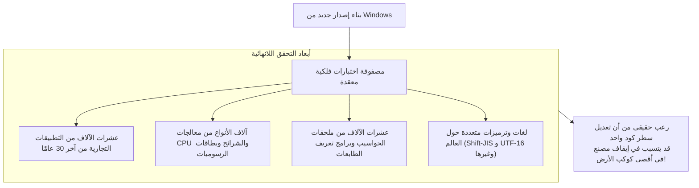

إن مجرد إضافة فحص لمؤشر ذاكرة، أو تعديل بسيط في ترتيب أقفال التزامن (Locks) في قلب نواة Windows، يحمل خطر التسبب في تعليق (Deadlock) برنامج يتحكم في خط إنتاج بمصنع ضخم في قارة أخرى كُتب كوده قبل 30 عامًا. ولمواجهة هذا الرعب، تدير مايكروسوفت مختبرات عملاقة تضم عشرات الآلاف من الحواسيب الفعلية وآلاف الخوادم الافتراضية، التي تقوم آليًا بإقلاع برمجيات تعود لعقود مضت للتأكد من ظهور نوافذها وتشغيلها بسلام مع كل تحديث.

### 9.2 الثغرات الأمنية الناتجة عن واجهات البرمجة العتيقة (Legacy APIs)

يمثل **الأمن السيبراني** الوجه الأكثر خطورة لتلك الديون التقنية.

فالعديد من واجهات Win32 API التي صممت في التسعينيات وُلدت في حقبة بريئة سبقت انتشار الإنترنت، وكانت مفاهيم التحقق من طفحان الذاكرة الوسيطة (Buffer Overflow) وصلاحيات الوصول فيها ساذجة وضعيفة للغاية. ولكن من أجل حماية التوافق العكسي، يُحظر على مايكروسوفت حذف تلك الواجهات الخطيرة.

ويستغل المهاجمون ومخترقو الأنظمة على وجه التحديد هذه الواجهات البرمجية العتيقة وتصدعات طبقات التوافق لتصعيد الصلاحيات والهروب من بيئات الصناديق الرملية (Sandbox Escapes). وهكذا تحولت الطيبة الهندسية التي هدفت لإنقاذ برامج الماضي إلى سبب مباشر في توسيع رقعة الهجوم (Attack Surface) على النظام بأكمله.

### 9.3 الانهيار الداخلي لمشروع Longhorn وإعادة الهيكلة عبر «MinWin»

وصل التراكم اللانهائي للتوافق والميزات الجديدة إلى نقطة الانفجار في مطلع الألفية أثناء تطوير **«مشروع Longhorn»**.

كان مشروع Longhorn (الذي كان يُفترض أن يكون خليفة Windows XP) طموحًا للغاية، لكن تداخل الشفرات المتضخمة والاعتماديات المعقدة حوله إلى كتلة ضخمة وغير قابلة للسيطرة من الشفرات المعقدة (Spaghetti Code). وكانت نسخ النظام تفشل في البناء يوميًا، وتوقف معدل التطوير تمامًا، ليصل المشروع إلى حافة الانهيار الكارثي.

وفي عام 2004، اتخذت قيادة مايكروسوفت القرار الجريء بإلغاء مشروع Longhorn وإعادة ضبطه بالكامل. وتخلص آلاف المهندسين من شفرات كُتبت على مدار سنوات، وبدأوا العمل من جديد انطلاقًا من الشفرة الأكثر صلابة لنظام «Windows Server 2003 SP1» (وهو ما تمخض لاحقًا عن نظام Windows Vista).

وبعد هذه التجربة القاسية، نفذ فريق Windows إعادة هيكلة ضخمة لنواة النظام فصلوا فيها الطبقات الأساسية لنواة النظام إلى وحدة صغيرة مستقلة سُميت **«MinWin»**، مما قلل من الارتباط الوثيق بين النواة وطبقات التوافق العليا. وإذا كان Windows لا يزال قادرًا على العمل والاستقرار اليوم، فالفضل يعود إلى ترسيم هذه الحدود المعمارية الصارمة بعد النجاة من كارثة Longhorn.

---

## الخاتمة: نشيد إجلال للمهندسين الواقعيين — حضارة رقمية بُنيت على معجزة الاستمرار في العمل

في حواسيب المكاتب التي نستخدمها يوميًا، وفي شاشات السجلات الطبية بالمستشفيات، وأجهزة الصراف الآلي بالبنوك، وأنظمة التحكم بحركة القطارات، وماكينات التصنيع الآلي في المصانع — ينبض نظام Windows في أعماق البنية التحتية لحضارتنا المعاصرة دون استثناء تقريبًا.

فلو كانت مايكروسوفت شركة تتبع «المُثُل الأكاديمية النقية للتصميم البرمجي» ككتب الجامعات، ولو سلكت نهج Apple في حرق أصول الماضي كل بضع سنوات، كيف كان سيبدو عالمنا اليوم؟

لتوقفت آلاف المصانع عن العمل، ولأفلست الشركات الصغيرة والمتوسطة تحت وطأة تكاليف إعادة بناء أنظمتها دوريًا، ولعمت الفوضى قطاعات الرعاية الصحية والبنية التحتية المجتمعية. إن السبب الحقيقي وراء استمرار الاقتصاد العالمي والمجتمع الرقمي في التقدم بسلاسة ودون انقطاع هو أن نظام Windows **«حمل على عاتقه بصبر وصمت كافة أخطاء وسوء فهم وعيوب المبرمجين عبر التاريخ، وتكفل بتسوية الفوضى نيابة عن الجميع»**.

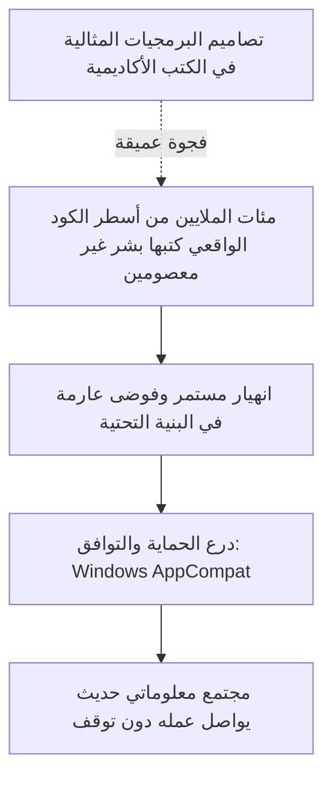

بالنسبة لريموند تشن وأجيال المهندسين الذين تعاقبوا على تطوير Windows، لم تكن مهمة تلويث كودهم النقي بالترقيعات والسهر لكتابة حيل Shim لإصلاح أخطاء الآخرين عملاً براقًا أو شاعريًا. لم تكن خوارزميات رنانة تُنشر في الأوراق البحثية، ولا ابتكارات ذكية تتسابق شركات وادي السيليكون الناشئة للاستعراض بها.

ولكن، أليس هذا هو التجسيد الأسمى والأصدق **«للهندسة الاحترافية الحقيقية (Professional Engineering)»**؟

فالهندسة الحقيقية ليست التغني بالمعادلات الجميلة في غرف المختبرات المعقمة؛ بل هي النزول إلى الميدان الموحل، وتحمل أعباء عالم بشري غير كامل صنعه بشر غير معصومين، وضمان استمرار تلك المعجزة اليومية: **«أن ما كان يعمل بالأمس، سيظل يعمل اليوم وغدًا وبعد عشر سنوات دون انقطاع»**.

«إياك وكسر التطبيقات القديمة» — على هذا التوجيه الصارم، وعلى التضحيات الصامتة لأولئك المهندسين المجهولين، يستند صرح مجتمعنا الرقمي الحديث اليوم، ويواصل عمله بكل هدوء وأمان، وكأن ذلك هو الشيء الأكثر طبيعية وبداهة في الوجود.
