## Einleitung: Das wahre Wesen eines Betriebssystems — „Elegantes Design“ oder „hartgesottene Realität“?

Schlägt man Vorlesungsunterlagen der Informatik oder Lehrbücher des Software-Engineerings auf, stößt man unweigerlich auf makellose Ideale: „saubere Abstraktionen“, „Trennung der Zuständigkeiten (Separation of Concerns)“ und „orthogonales API-Design“. Ein Betriebssystem, so die akademische Doktrin, habe ein ehrwürdiger Schlichter zu sein, der die raue Komplexität der physischen Hardware verbirgt und Anwendungen eine elegante, intuitive und mathematisch konsistente Schnittstelle bereitstellt.

Verlässt man jedoch den akademischen Elfenbeinturm und betritt das Schlachtfeld kommerzieller Desktop-Betriebssysteme, zerbrechen diese reinen Ideale augenblicklich. Denn Microsoft Windows – der unangefochtene Gigant der PC-Geschichte, der Milliarden von Rechnern rund um den Globus beherrscht – verkörpert eine Philosophie, die dem Lehrbuchideal diametral gegenübersteht: **einen geradezu fanatischen, hartgesottenen Pragmatismus**.

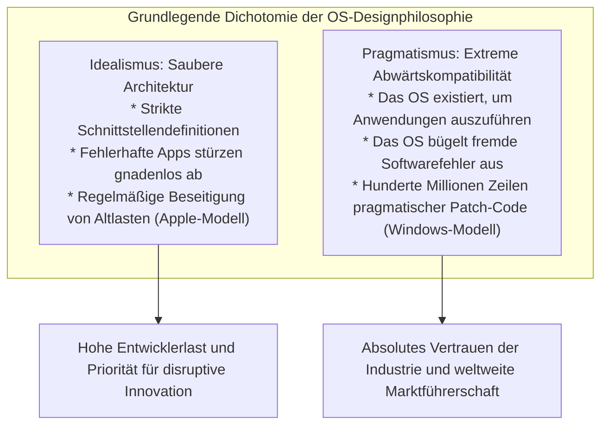

Unter allen Betriebssystemen der Welt existiert keines, das ein so obsessives Bekenntnis zu historischen Altlasten an den Tag legt wie Windows. Eine Spiele-CD-ROM aus dem Jahr 1995, eine in Visual Basic 3.0 oder 16-Bit-C++ geschriebene Buchhaltungssoftware aus den frühen 1990er-Jahren, uralte DOS-Relikte oder Dienstprogramme, die seinerzeit undokumentierte Kernel-Interna manipulierten – die überwältigende Mehrheit dieser Programme startet und funktioniert im Jahr 2026 auf dem modernen Windows 11 völlig reibungslos.

Die meisten Endanwender betrachten dies als Selbstverständlichkeit und nehmen es einfach als „Software, die funktioniert“ hin. Doch Systemprogrammierer, die den internen Quellcode und die Tiefen des NT-Kernels analysiert haben, erstarren vor Ehrfurcht und Schrecken zugleich. Tief im Inneren des Systems verbirgt sich eine geologische Schicht aus drei Jahrzehnten: **Zehntausende Zeilen von Ausnahmeregelungen, dynamischer API-Verschleierung und spezialisierten Täuschungsmechanismen (Shims)**, die Microsoft-Ingenieure akribisch anhäuften, um die Bugs, Spezifikationsverstöße, Speicherzerstörungen und undefinierten Zustände von Drittanbieter-Code abzufangen.

Warum hat Microsoft die Last fehlerhafter Software fremder Entwickler auf die eigenen Schultern genommen und das Betriebssystem verbogen, um deren Fehler zu kaschieren?
Warum wählte Microsoft nicht den Weg von Apple, alte Zöpfe rigoros abzuschneiden?
Und wie formte dieses unerbittliche Engineering Windows zu einer uneinnehmbaren Festung und der mächtigsten Plattform der Wirtschaftsgeschichte?

Auf der Grundlage von Augenzeugenberichten legendärer früherer Microsoft-Entwickler, Reverse-Engineering-Daten aus Windows-Binärdateien, der Tiefenarchitektur von PE-Dateien und des NT-Kernels sowie der Ökonomie von Plattformstrategien beleuchtet dieser Leitfaden die eiserne Direktive von Windows: **„Mache niemals alte Apps kaputt (Don't break old apps).“**

---

## Kapitel 1: Die oberste Direktive zweier Branchen-Ikonen

Die Besessenheit der Windows-Entwicklerteams von Abwärtskompatibilität war kein Mythos Außenstehender. Sie wurde von zwei legendären Software-Pionieren dokumentiert, die an vorderster Front Code schrieben und über Systemarchitekturen entschieden.

### 1.1 Raymond Chen und *The Old New Thing*

Innerhalb der Windows-Entwicklungsmannschaft von Microsoft existiert eine lebende Legende, die seit über dreißig Jahren im Dienst ist. Seit seinem Einstieg bei Microsoft im Jahr 1992 hat Principal Software Engineer **Raymond Chen** die Windows 95 Shell, User32 und die tiefsten Schichten des Win32-Subsystems mitgestaltet und gewartet.

Sein Blog ***The Old New Thing*** – ursprünglich als interner Kommunikationskanal gestartet, später zu einer Säule des Microsoft-Entwicklerportals herangewachsen und als Buch erschienen – ist die Bibel für Systemprogrammierer und ein unschätzbares Archiv darüber, wie Windows jahrzehntelange Kompatibilitätskrisen meisterte.

Chen formulierte das Grundaxiom der Windows-Entwicklung mit schonungsloser Härte:

> „Ein Betriebssystem existiert, um Programme auszuführen. Niemand kauft einen Computer, um das Betriebssystem zu bewundern. Die Menschen kaufen Computer, um bestimmte Anwendungen auszuführen, mit denen sie ihre Arbeit erledigen.
> 
> Und die bittere Realität lautet: **Wenn Benutzer auf ein neues Windows aktualisieren und ihre Lieblingsanwendung nicht mehr startet, geben sie niemals dem Hersteller der Anwendung die Schuld. Zu 100 % werfen sie Microsoft vor: ‚Windows ist kaputt‘ oder ‚Das neue Windows taugt nichts‘.**“

Aus Sicht des Programmiererstolzes möchte man entgegnen: „Wenn der Anwendungscode fehlerhaft ist, ist ein Absturz vollkommen gerechtfertigt; der Hersteller muss einen Patch veröffentlichen.“ Im kommerziellen Betriebssystemmarkt bedeutet diese Haltung jedoch den wirtschaftlichen Ruin. Für Kunden zählt einzig die Tatsache: „Gestern funktionierte das Programm; heute habe ich Windows aktualisiert, und nun funktioniert es nicht mehr.“

Würde Microsoft mit technischer Rechthaberei reagieren und sagen: „Das ist ein Fehler der Drittanbieter“, würden Unternehmen Upgrades blockieren, auf uralten Systemen verharren oder zur Konkurrenz abwandern. Folglich ergab sich für das Windows-Team eine gnadenlose Maxime:

**„Ganz gleich, wie chaotisch, standardschädigend und fehlerhaft der Code einer Drittanwendung auch sein mag: Das Betriebssystem muss dies erkennen, im Hintergrund geradebiegen und die Anwendung so ausführen, als wäre nie etwas geschehen.“**

In Chens Schriften finden sich zahllose tragikomische und geniale Hacks, die er und seine Kollegen entwickeln mussten, um dieses Versprechen einzulösen.

### 1.2 Die Enthüllung von Joel Spolsky: *How Microsoft Lost the API War*

Die fundamentale Tragweite dieser Philosophie wurde der weltweiten Entwickler- und IT-Wirtschaft durch **Joel Spolsky** ins Bewusstsein gerufen. Spolsky, der in den frühen 1990er-Jahren als Program Manager im Excel-Team bei Microsoft arbeitete und später die Entwicklerplattform Stack Overflow sowie das Projektmanagement-Werkzeug Trello mitgründete, gehört zu den renommiertesten Software-Essayisten unserer Zeit.

In seinem historischen Essay von 2004, *How Microsoft Lost the API War*, blickte er auf die Führungsprinzipien der damaligen Windows-Chefs wie Jon DeVaan zurück:

> „In the Windows team, the prime directive was: **don't break old apps.**“
> (Im Windows-Team lautete die oberste Direktive: **Zerstöre niemals alte Anwendungen.**)

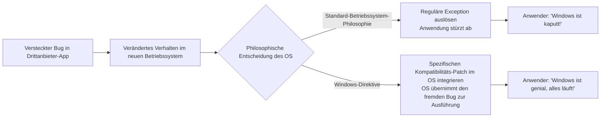

Spolsky zieht den Vergleich zu *Star Trek*: So wie Offiziere der Sternenflotte die „Oberste Direktive“ (das Verbot der Einmischung in fremde Zivilisationen) niemals brechen dürfen, so galt für die Windows-Entwickler: Es ist unter keinen Umständen erlaubt, das Funktionieren bestehender Anwendungen zu gefährden.

Selbst wenn ein Windows-Ingenieur einen Kernel-Treiber oder eine API-Routine elegant überarbeitete und deren Geschwindigkeit verdoppelte: Führte diese Änderung dazu, dass auch nur eine einzige obskure Unternehmenssoftware irgendwo auf der Welt abstürzte, wurde das Refactoring sofort und unerbittlich abgelehnt. Code-Eleganz und architektonische Reinheit waren zweitrangig; **dass bestehende Binärdateien zu 100 % lauffähig blieben, war das oberste Gesetz**.

### 1.3 „Selbst Fehler werden zur Spezifikation“: Hyrums Gesetz und die Irreversibilität von APIs

In der Softwaretechnik existiert ein von Google-Ingenieur Hyrum Wright formuliertes Erfahrungswissen, das als **Hyrums Gesetz (Hyrum's Law)** Weltruhm erlangte:

> **Hyrums Gesetz**:
> „Ab einer ausreichenden Anzahl von Nutzern einer API ist es völlig unerheblich, was der Entwickler im Vertrag (in der Dokumentation) garantiert: Jedes beobachtbare Verhalten des Systems (einschließlich Fehlern und Nebeneffekten) wird irgendwann von irgendeinem Code vorausgesetzt.“

Windows ist die Plattform, die Hyrums Gesetz im größten und unbarmherzigsten Maßstab der Menschheitsgeschichte bestätigt hat.

Angenommen, in der Dokumentation einer Win32-API steht unmissverständlich: *„Der dritte Parameter muss ein gültiges Fenster-Handle sein. Das Verhalten bei ungültigen Werten ist undefiniert.“* Ein unachtsamer Entwickler übergab jedoch versehentlich `NULL` oder einen defekten Zeiger, und in der historischen Implementierung von Windows 3.1 wurde der Aufruf glücklicherweise ohne Fehlermeldung ignoriert.

Wenn nun Hunderttausende Exemplare dieser fehlerhaften Software weltweit im Einsatz sind und das Team von Windows 95 oder Windows NT eine korrekte Parameterprüfung einbaut, die bei ungültigen Handles sauber `ERROR_INVALID_WINDOW_HANDLE` zurückgibt – was geschieht dann?

In zehntausenden Büros quittiert die alte Software den Dienst mit einer Fehlermeldung. Erzürnte Kunden belagern die Microsoft-Hotlines: *„Seit dem Update können wir nicht mehr arbeiten!“*

Folglich mussten die Microsoft-Ingenieure ihren technisch sauberen Code widerwillig zurückziehen und stattdessen Konstrukte wie dieses verfassen:

```c
// Konzeptionelle Rekonstruktion interner Windows-API-Kompatibilitätslogik
BOOL WINAPI DoSomething(HWND hWnd, UINT uMsg, WPARAM wParam, LPARAM lParam)
{
    // Aus Lehrbuchsicht saubere Validierung
    if (!IsWindow(hWnd)) {
        // Eigentlich müsste hier sofort abgebrochen werden:
        // SetLastError(ERROR_INVALID_WINDOW_HANDLE);
        // return FALSE;

        // [Kompatibilitäts-Workaround]
        // Die historische Anwendung "AppX.exe" übergibt bei der Initialisierung ein NULL-Handle.
        // Ein Fehler würde AppX zum Absturz bringen.
        // Daher ersetzen wir das Handle stillschweigend durch das Desktop-Fenster.
        if (IsTargetBadApplication("AppX.exe")) {
            hWnd = GetDesktopWindow();
        } else {
            SetLastError(ERROR_INVALID_WINDOW_HANDLE);
            return FALSE;
        }
    }

    // Reguläre Verarbeitung fortsetzen...
    return InternalDoSomething(hWnd, uMsg, wParam, lParam);
}
```

Sobald ein Betriebssystem den Markt beherrscht, ist die API-Spezifikation nicht mehr der gedruckte Text im Handbuch, sondern **die Gesamtheit aller beobachtbaren Verhaltensweisen und Eigenheiten der historischen Implementierung**. Das Windows-Team stellte sich dieser Realität und akzeptierte die Bürde, die Programmierfehler der ganzen Welt als Systembestandteil mitzuschleppen.

---

## Kapitel 2: Der Beginn der Legende — Die technischen Hintergründe des „SimCity-Vorfalls“

Die wohl berühmteste Anekdote über die Hingabe des Windows-Teams an die Abwärtskompatibilität trug sich 1995 während der heißen Endphase der Entwicklung von Windows 95 zu: der legendäre **SimCity-Vorfall**.

### 2.1 Die Mechanik von Use-After-Free

Das 1989 von Will Wright und dem Studio Maxis geschaffene *SimCity* war ein Meilenstein der Videospielgeschichte und weltweit ein gigantischer Verkaufsschlager. Für Heimanwender ebenso wie für Büroangestellte war die Lauffähigkeit von SimCity ein entscheidendes Kriterium für die Brauchbarkeit eines PCs.

Die damals für DOS und Windows 3.1 vertriebene Binärdatei von SimCity enthielt jedoch einen gravierenden Programmierfehler, der nach heutigen Sicherheitsmaßstäben eine kritische Schwachstelle darstellt: einen **Use-After-Free (Zugriff auf bereits freigegebenen Speicher)**.

SimCity forderte während der Simulationsberechnung und Grafikdarstellung Speicherblöcke vom Heap-Allokator des Systems an und gab sie nach Gebrauch mittels `free` oder `GlobalFree` wieder frei. Doch die internen Zeiger wurden nach der Freigabe nicht genullt. **Das Spiel las und schrieb munter weiter in Speicherbereiche, die es zuvor offiziell an das Betriebssystem zurückgegeben hatte.**

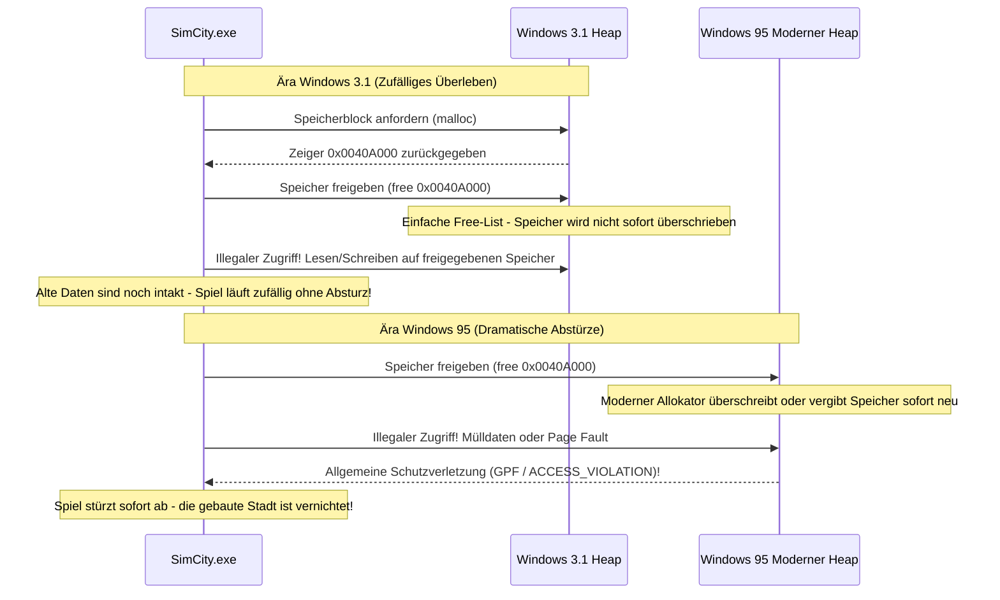

Unter dem 16-Bit-System Windows 3.1 war die Speicherverwaltung rudimentär. Wenn eine Anwendung Speicher freigab, wurde dieser aufgrund der primitiven Free-List-Struktur selten sofort wiederverwendet oder überschrieben. Das bedeutete: Obwohl der SimCity-Code grundlegend fehlerhaft war, **funktionierte das Spiel rein zufällig, weil der Speicherallokator von Windows 3.1 so träge und simpel gestrickt war**.

### 2.2 Klassisches Software-Engineering versus die Besessenheit des Windows-Teams

1995 läutete Microsoft mit Windows 95 eine neue Ära ein: ein 32-Bit-Betriebssystem mit echtem präemptivem Multitasking, fortschrittlicher virtueller Speicherverwaltung und einem modernen, schnellen Heap-Allokator, der Fragmentierung minimierte.

Dieser moderne Allokator war darauf ausgelegt, zurückgegebenen Speicher **sofort für andere Zwecke bereitzustellen, neu zu organisieren oder mit Nullen zu überschreiben**, um die Speichereffizienz zu maximieren.

Als SimCity auf diesem modernen System ausgeführt wurde, geschah die Katastrophe:
Das Spiel griff auf soeben freigegebenen Speicher zu, traf dort auf Daten anderer Prozesse oder genullte Speicherseiten, und im nächsten Moment zerriss eine **Allgemeine Schutzverletzung (General Protection Fault, GPF)** den Bildschirm. Die über Stunden erbaute Metropole war augenblicklich vernichtet.

Wie hätte eine herkömmliche Entwicklungsabteilung reagiert?
Die Antwort liegt auf der Hand: „Das ist zu 100 % ein Programmierfehler von Maxis. Die Speicherverwaltung unseres Betriebssystems arbeitet absolut vorschriftsmäßig. Wir informieren Maxis, damit sie einen Disketten-Patch (SimCity 1.01) herausbringen.“

Doch für die Microsoft-Führung und das Windows 95-Team stand fest, dass Windows 95 unter keinen Umständen als inkompatibel gelten durfte:

**„SimCity darf nicht abstürzen. Wir können nicht warten, bis Maxis Patches verteilt. Baut eine Ausnahme in den Kernel-Speichermanager von Windows 95 ein, damit SimCity läuft!“**

### 2.3 Die Details des SimCity-spezifischen Allokator-Hacks

Joel Spolsky beschrieb diese historische Entscheidung folgendermaßen:

> „Während der Betatests von Windows 95 stellten sie fest, dass SimCity nicht funktionierte. Was tat Microsoft?
> Sie versuchten nicht, die Entwickler von SimCity zur Reparatur zu zwingen. Ein Entwickler des Speichermanagers von Windows 95 schrieb stattdessen eine Spezialfunktion: **‚Wenn das aktuell ausgeführte Programm SimCity ist, gib den Speicher nicht sofort wieder frei, sondern halte ihn eine Zeit lang unberührt vor.‘**“

Aus heutiger Sicht war dieser Hack nichts Geringeres als der Vorläufer eines **Quarantäne-Heaps (Quarantine Heap)** bzw. einer **verzögerten Freigabe (Delayed Free)**.

Beim Prozessstart prüfte der Speichermanager den Programmnamen (`SIMCITY.EXE`) und die PE-Header. Wurde SimCity identifiziert, wechselte der Heap-Allokator in einen speziellen „SimCity-Rettungsmodus“. Anstatt freigegebene Blöcke sofort mit Nachbarblöcken zu verschmelzen (Coalescing), wurden die Zeiger in einem Puffer zwischengelagert, sodass der Speicherbereich für eine Weile vor Überschreibung geschützt blieb.

Dank dieses unkonventionellen Eingriffs ins Herz des Betriebssystems legten Millionen Nutzer am Erscheinungstag von Windows 95 ihre SimCity-Disketten ein – und bauten ohne den Hauch einer Fehlermeldung ihre Städte weiter.

Die Welt jubelte: *„Windows 95 ist fantastisch! Jedes alte Programm läuft darauf!“* Niemand ahnte, dass tief im hochmodernen Kernel ein Rettungsanker lag, der eigens für die Programmierfehler eines Computerspiels geschmiedet worden war.

---

## Kapitel 3: Eine Chronik historischer Kompatibilitäts-Hacks

Der SimCity-Vorfall war nur die Spitze des Eisbergs. Die Geschichte von Windows ist eine Kette von schier unglaublichen Eingriffen zur Rettung schlecht programmierter Software.

### 3.1 Lotus 1-2-3 und Excels „Schaltjahr-Bug von 1900“

In der Geschichte der Kalenderberechnung existiert ein Fehler, der weltweit bis heute unkorrigiert in Milliarden Rechnern schlummert: **die Einstufung des Jahres 1900 als Schaltjahr**.

Im gregorianischen Kalender gelten strikte Regeln:
1. Ein Jahr ist ein Schaltjahr, wenn es durch 4 teilbar ist.
2. Ist es jedoch durch 100 teilbar, ist es kein Schaltjahr.
3. Ist es jedoch durch 400 teilbar, ist es dennoch ein Schaltjahr.

Da 1900 durch 100, aber nicht durch 400 teilbar ist, **war 1900 ein gewöhnliches Jahr mit 365 Tagen; ein 29. Februar 1900 existierte nicht**.

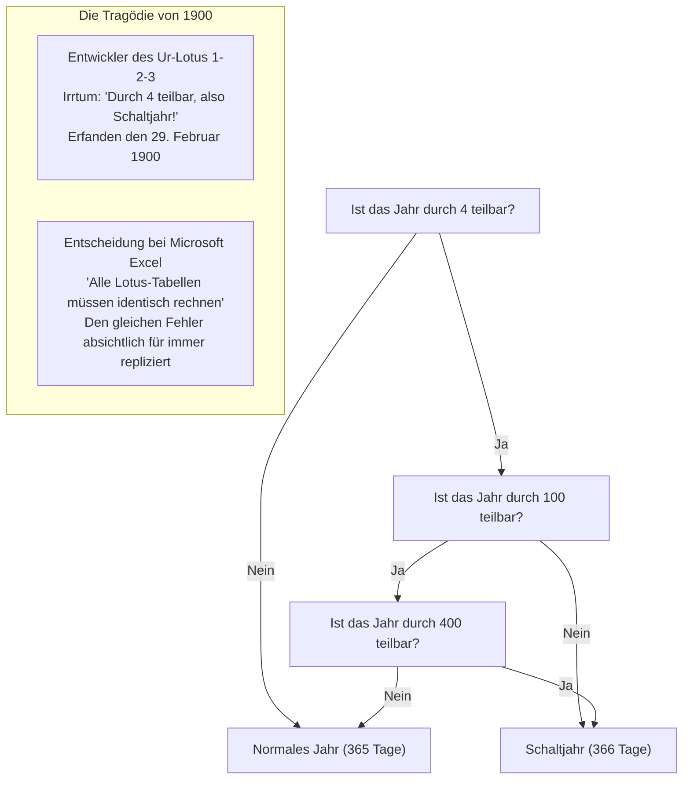

Die Entwickler des seinerzeit marktbeherrschenden Tabellenkalkulationsprogramms *Lotus 1-2-3* vergaßen die Ausnahmeregel und implementierten 1900 als Schaltjahr. Dadurch existierte in Lotus 1-2-3 der fiktive 29. Februar 1900, wodurch alle fortlaufenden Tageszählungen ab dem 1. März 1900 um genau einen Tag verschoben waren.

Als Microsoft mit *Excel* antrat, um Lotus vom Thron zu stoßen, standen die Entwickler vor einem Dilemma: Sollten sie einen astronomisch korrekten Kalender implementieren oder die 100-prozentige Kompatibilität mit den Abermillionen existierenden Finanztabellen der Unternehmen wahren?

Bill Gates entschied zugunsten der Kompatibilität. Excel **übernahm den Fehler bewusst und bildete den 29. Februar 1900 exakt nach**.

Öffnen Sie heute das modernste Microsoft 365 Excel und tippen Sie in eine Zelle `=DATUM(1900; 2; 29)` ein: Excel liefert anstandslos „29.02.1900“. Wenn eine Plattform einmal beschließt, den Bug eines Mitbewerbers mitzutragen, bindet diese Entscheidung Generationen über Jahrhunderte hinweg.

### 3.2 Warum „Windows 9“ übersprungen wurde

Im Jahr 2014 kündigte Microsoft den Nachfolger von Windows 8.1 an. Die Fachwelt erwartete fest „Windows 9“, doch auf der Bühne präsentierte die Konzernspitze überraschend den Namen **Windows 10**.

Hinter dem Marketing-Deckmantel, einen riesigen Versionssprung zu symbolisieren, verbarg sich ein handfester technischer Grund, den Entwickler und Ex-Mitarbeiter bald lüfteten: **ein verheerendes Kompatibilitätsrisiko**.

In zahllosen Java-Bibliotheken, Setup-Routinen und Drittanbieter-Anwendungen rund um den Globus fand sich seit den 1990er-Jahren ein bequemer, aber fataler Code-Schnipsel zur Versionserkennung:

```java
// Weit verbreitetes Fehlermuster in Altanwendungen
String osName = System.getProperty("os.name");

if (osName.startsWith("Windows 9")) {
    // Führe Altcode für Windows 95 oder Windows 98 aus!
    // Greift auf 16-Bit-Kompatibilitätsmodi oder veraltete Registry-Pfade zu
    enableLegacyWin9xMode();
} else {
    // Moderner NT-Zweig (Windows NT, 2000, XP, 7, 8 etc.)
    enableModernNTMode();
}
```

Faulheit verleitete Entwickler dazu, mit `startsWith("Windows 9")` in einem Rutsch sowohl Windows 95 als auch Windows 98 zu identifizieren.

Hätte Microsoft das System „Windows 9“ getauft, hätten tausende Unternehmensprogramme angenommen, sie liefen auf einem DOS-basierten Betriebssystem von 1995. Sie hätten moderne NT-Kernel-Funktionen ignoriert, versucht, 16-Bit-Treiberstrukturen anzusprechen, und wären auf modernen Mehrkern-PCs sofort kollabiert.

Microsoft opferte lieber eine Versionsnummer, als das Funktionieren zehntausender Geschäftsanwendungen zu gefährden.

### 3.3 Undokumentierte APIs und Norton Utilities

In den 1990er-Jahren gehörte *Norton Utilities* von Symantec zur Grundausstattung fast jedes Rechners. Für das Windows-Team war das Programm jedoch ein ständiger Albtraum.

Tief im System operierende Dienstprogramme wie Norton begnügten sich nicht mit den offiziellen Win32-APIs. Sie **lasen undokumentierte interne Datenstrukturen aus, riefen unpublizierte Kernel-Funktionen auf und griffen direkt auf feste Offsets in DLL-Speicherbereichen zu**.

Raymond Chen berichtete, dass bei der Umstellung interner Datenstrukturen in Windows 95 jede Verschiebung um auch nur ein einziges Byte Norton Utilities mit einem Bluescreen abstürzen ließ.

Microsoft reagierte nicht etwa mit rechtlichen Schritten. Stattdessen disassemblierten die Ingenieure Norton Utilities, analysierten die Speicherzugriffe und **platzierten im Betriebssystem an genau den erwarteten Speicheradressen Dummy-Strukturen**, damit Norton Utilities nicht abstürzte.

### 3.4 Der Tag, an dem Bill Gates zur Schrotflinte griff: DOOM und DirectX

Vor Windows 95 galt Windows in der Gaming-Branche als unbrauchbar. Entwickler verachteten das System wegen seines hohen GUI-Overheads und setzten für Action-Titel ausnahmslos auf MS-DOS, wo sie direkt auf Grafikchips und Soundkarten (Sound Blaster) zugreifen konnten.

Die Krönung dieser Ära war id Softwares Meisterwerk *DOOM*. Das Spiel lief auf zahllosen Büro-PCs und galt als regelrechter Produktivitätskiller der US-Wirtschaft.

Bill Gates sah die Bedrohung: Wenn Anwender ihren Rechner jedes Mal in DOS neu starten mussten, um zu spielen, würde Windows 95 den PC-Markt niemals vollständig beherrschen. DOOM musste auf Windows 95 laufen – und zwar schneller als unter DOS.

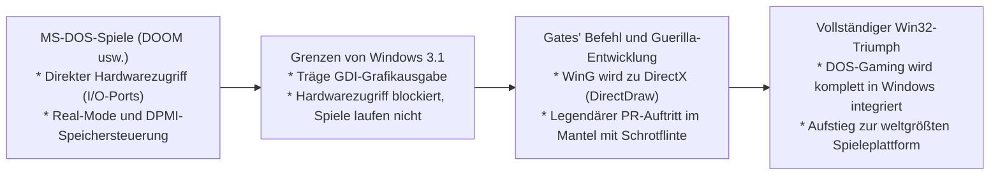

Gates beauftragte die besten Ingenieure mit der Entwicklung von „WinG“ und anschließend **DirectX** (Codename: *Manhattan Project*). DirectX ermöglichte geschützten Programmen einen extrem schnellen, direkten Zugriff auf Hardware-Ressourcen.

In einem legendären Werbevideo trat Gates im Ledermantel mit einer Schrotflinte mitten in der virtuellen Kulisse von DOOM auf, um Windows 95 als ultimative Spieleplattform zu proklamieren. Die Fähigkeit, ungestüme DOS-Spiele in einer geschützten 32-Bit-Umgebung zu zähmen, schuf das Fundament für die bis heute anhaltende Vormachtstellung von Windows im Gaming-Sektor.

---

## Kapitel 4: Die Festung des modernen Windows: „AppCompat“ (Application Compatibility)

Unter Windows 95 waren Kompatibilitäts-Hacks noch als punktuelle Sonderfälle im Code verteilt. Mit dem explosionsartigen Anstieg von Software unter Windows 2000 und XP stieß dieses Vorgehen an seine Grenzen; der Quellcode drohte unter endlosen Sonderabfragen unpflegbar zu werden.

Daraufhin schufen die Microsoft-Architekten das hochentwickelte **Application Compatibility (AppCompat)**-Subsystem, das bis heute in Windows 11 seinen Dienst tut.

### 4.1 Die Gesamtarchitektur des AppCompat-Subsystems

Das AppCompat-Subsystem ist ein **intelligentes Abfangsystem: Sobald eine Binärdatei in den Speicher geladen wird, erkennt das OS deren Identität und schiebt dynamisch eine transparente Täuschungsschicht (Shim) zwischen die Anwendung und den Betriebssystem-Kernel**.

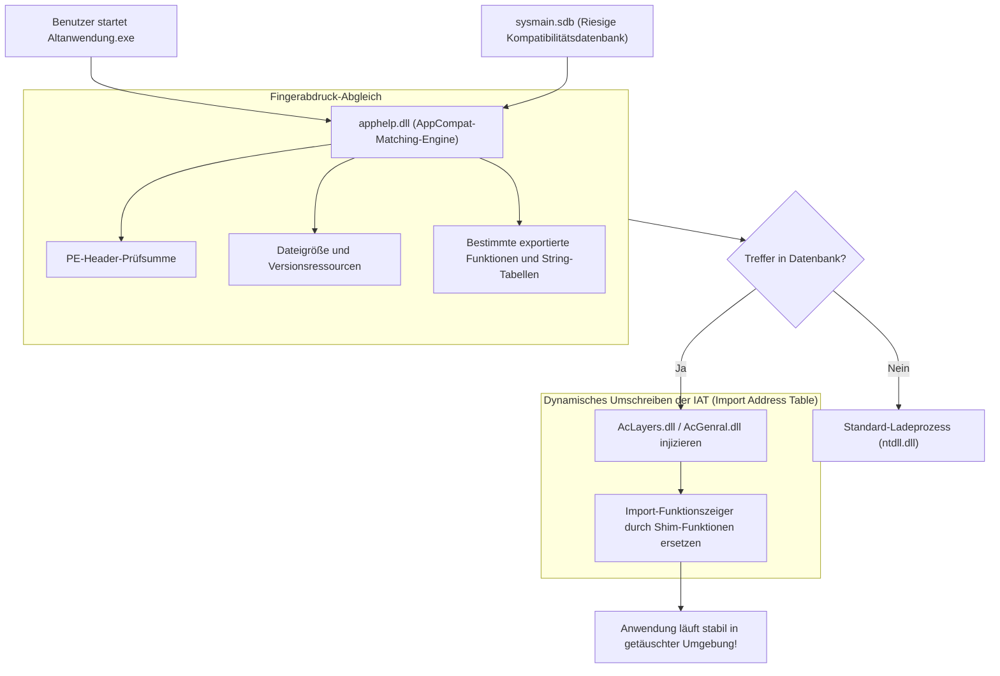

Wird eine ausführbare Datei (`.exe`) gestartet, übergibt die Prozesserzeugung in `ntdll.dll` die Kontrolle nicht sofort an den Programmeinstiegspunkt, sondern ruft **`apphelp.dll`** auf.

`apphelp.dll` durchsucht die interne Kompatibilitätsdatenbank **`sysmain.sdb`**. Wird die Datei als Altanwendung mit bekanntem Reparaturbedarf identifiziert, injiziert der OS-Loader spezielle Kompatibilitätsbibliotheken (**`AcLayers.dll`**, **`AcGenral.dll`**) in den Adressraum des Prozesses, noch bevor reguläre System-DLLs aufgerufen werden.

### 4.2 Die Shim-Engine: API-Manipulation über IAT-Hooking

Wie manipuliert die Shim-Engine das Verhalten der Anwendung, ohne die Programmdatei auf der Festplatte zu verändern? Das Schlüsselverfahren ist das **IAT-Hooking (Import Address Table Hooking)** in PE-Dateien (Portable Executable).

Ruft ein Win32-Programm eine Systemfunktion (wie `GetVersionEx` oder `GetDiskFreeSpace`) auf, enthält der Maschinencode keine fest verdrahtete Speicheradresse der Ziel-DLL. Stattdessen liest der Lader beim Start die Import-Tabellen aus und schreibt die tatsächlichen Funktionsadressen in ein Zeiger-Array im Speicher: die Import Address Table (IAT). Das Programm springt stets indirekt über diese Tabelle.

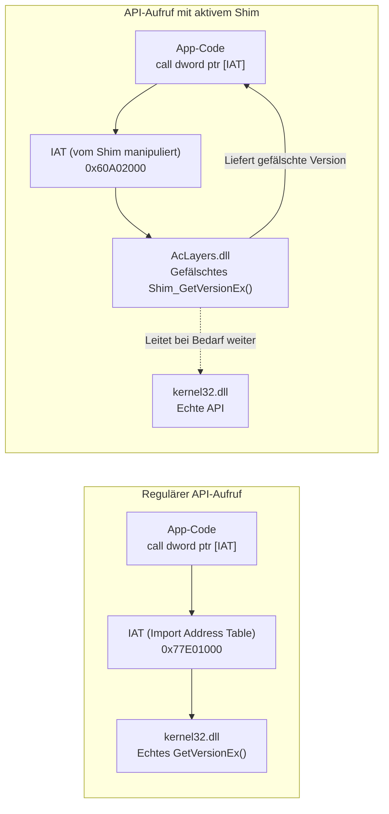

Die Shim-Engine nutzt diesen Mechanismus aus: Bevor der Hauptthread der Anwendung anläuft, setzt sie die Speicherberechtigung der IAT auf `PAGE_READWRITE` und **überschreibt die echten Funktionszeiger mit den Adressen ihrer eigenen Täuschungsfunktionen (Shims)**.

Folgender C/C++-Pseudocode verdeutlicht das Prinzip:

```c
// Anschauungsbeispiel für IAT-Hooking zur Shim-Injektion
#include <windows.h>
#include <imagehlp.h>

// Gefälschte GetVersionEx-Funktion (das eigentliche Shim)
BOOL WINAPI Shim_GetVersionExA(LPOSVERSIONINFOA lpVersionInformation)
{
    // Echte API für Basiswerte aufrufen
    typedef BOOL (WINAPI *PFN_GETVER)(LPOSVERSIONINFOA);
    HMODULE hKernel = GetModuleHandleA("kernel32.dll");
    PFN_GETVER pfnRealGetVer = (PFN_GETVER)GetProcAddress(hKernel, "GetVersionExA");
    
    BOOL bResult = pfnRealGetVer(lpVersionInformation);
    
    // [Die Täuschung]
    // Wir spiegeln der Anwendung vor, sie laufe auf Windows 95 (Major: 4, Minor: 0)
    lpVersionInformation->dwMajorVersion = 4;
    lpVersionInformation->dwMinorVersion = 0;
    lpVersionInformation->dwBuildNumber = 950;
    lpVersionInformation->dwPlatformId = VER_PLATFORM_WIN32_WINDOWS;
    strcpy(lpVersionInformation->szCSDVersion, "");

    return TRUE; // Die Anwendung wähnt sich glücklich auf Windows 95
}

// Durchsucht die IAT und biegt Funktionszeiger um
void InstallShimHook(HMODULE hAppModule, LPCSTR targetDll, LPCSTR targetFunc, PVOID newFuncAddress)
{
    ULONG size;
    PIMAGE_IMPORT_DESCRIPTOR pImportDesc = (PIMAGE_IMPORT_DESCRIPTOR)
        ImageDirectoryEntryToData(hAppModule, TRUE, IMAGE_DIRECTORY_ENTRY_IMPORT, &size);

    while (pImportDesc->Name) {
        LPCSTR dllName = (LPCSTR)((PBYTE)hAppModule + pImportDesc->Name);
        if (_stricmp(dllName, targetDll) == 0) {
            PIMAGE_THUNK_DATA pThunk = (PIMAGE_THUNK_DATA)((PBYTE)hAppModule + pImportDesc->FirstThunk);
            while (pThunk->u1.Function) {
                PROC* ppfn = (PROC*)&pThunk->u1.Function;
                DWORD oldProtect;
                VirtualProtect(ppfn, sizeof(PROC), PAGE_READWRITE, &oldProtect);
                *ppfn = (PROC)newFuncAddress; // Zeiger auf Shim-Funktion verbiegen!
                VirtualProtect(ppfn, sizeof(PROC), oldProtect, &oldProtect);
                break;
            }
        }
        pImportDesc++;
    }
}
```

Dank dieses Verfahrens bleibt die Originaldatei auf der Festplatte unverändert, während die Anwendung zur Laufzeit in einer maßgeschneiderten virtuellen Vergangenheit operiert.

### 4.3 Die geheimnisvolle Riesendatei: `sysmain.sdb` (Shim-Datenbank)

Das organisatorische Herz des AppCompat-Systems ist die Datei `C:\Windows\AppPatch\sysmain.sdb`.

In diesem proprietären Microsoft-Binärformat sind **Reparaturprofile für hunderttausende kommerzielle Programme, Spiele und Firmenanwendungen** hinterlegt.

Um zu verhindern, dass Shims wahllos greifen (etwa bei einem modernen `setup.exe`), nutzt die Matching-Engine detaillierte digitale Fingerabdrücke:

1. **Dateiname und Pfadstruktur**
2. **Exakte Dateigröße in Bytes**
3. **Linker-Zeitstempel im PE-Header**
4. **PE-Prüfsumme (CheckSum)**
5. **Versionsressourcen (CompanyName, ProductName, FileVersion etc.)**
6. **Kryptografische Abschnitthashes und Exporttabellen**

Legt man eine alte Enzyklopädie-CD-ROM von 2001 in ein Windows 11-System ein, gleicht `apphelp.dll` den Fingerabdruck mit `sysmain.sdb` ab, erkennt Abhängigkeiten zu Windows 2000-Heaps oder unerlaubte Schreibversuche in Systemverzeichnisse und aktiviert automatisch Dutzende passende Shims.

---

## Kapitel 5: Katalog typischer Shims (Die Kunst der Täuschung)

In Windows schlummern hunderte spezialisierte Shims – ein eindrucksvolles Kompendium zur Korrektur historischer Programmierfehler.

### 5.1 `VersionLie`: Das System flunkert — „Sie befinden sich auf Windows 95“

Das am weitesten verbreitete Shim ist **`VersionLie`**.

Viele alte Programme prüften beim Start mit `GetVersion` oder `GetVersionEx` die Betriebssystemversion – häufig mit fatal primitiven Bedingungen:

```c
// Beispiel einer fehlerhaften Versionsprüfung
OSVERSIONINFO vi;
GetVersionEx(&vi);

// Rigider Check auf exakt Windows 95
if (vi.dwMajorVersion == 4 && vi.dwMinorVersion == 0) {
    // Normaler Programmstart
} else {
    MessageBox(NULL, "Diese Anwendung erfordert Windows 95.", "Fehler", MB_OK);
    ExitProcess(1); // Selbstmord des Prozesses!
}
```

Auf Windows XP (Major: 5), Windows 7 (Major: 6) oder Windows 10/11 (Major: 10) verweigert dieses Programm den Dienst, schlicht weil die Hauptversionsnummer nicht 4 ist.

`VersionLie` fängt den Aufruf ab und meldet dem Programm eiskalt: „Das System ist Windows 95 (Major: 4, Minor: 0)“. Beruhigt setzt die Software ihre Ausführung fort.

### 5.2 `EmulateGetDiskFreeSpace`: Rettung vor dem 2-GB-Ganzzahlüberlauf

Mitte der 1990er-Jahre lagen Festplattengrößen im Bereich von wenigen hundert Megabyte. Die Win32-API `GetDiskFreeSpace` lieferte Sektoren, Cluster und freie Speicherwerte als vorzeichenbehaftete 32-Bit-Ganzzahlen zurück.

Entwickler errechneten den freien Speicherplatz damals häufig nach der Formel:

$$\text{FreeBytes} = \text{SectorsPerCluster} \times \text{BytesPerSector} \times \text{NumberOfFreeClusters}$$

Sobald eine Festplatte mehr als **2 Gigabyte ($2^{31} - 1$ Bytes)** freien Speicher aufwies, lief die 32-Bit-Zahl über und kippte in einen **negativen Wert** (z. B. -500 MB).

Installationsprogramme brachen daraufhin panisch ab: *„Nicht genügend Festplattenspeicher! Es sind minus 500 MB verfügbar.“*

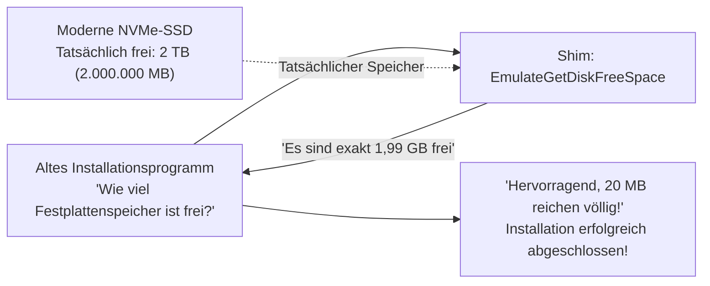

Das Shim **`EmulateGetDiskFreeSpace`** rettet diese Situation: Egal wie viele Terabyte eine moderne SSD besitzt, es meldet der Anwendung maximal **2.147.151.872 Bytes (~1,99 GB)**. Das Installationsprogramm sieht genügend Speicher und installiert die Anwendung fehlerfrei.

### 5.3 `VirtualRegistry` und `VirtualStore`: Umleitung für die Benutzerkontensteuerung (UAC)

Mit Windows Vista führte Microsoft 2006 die **Benutzerkontensteuerung (User Account Control, UAC)** ein.

Zuvor arbeiteten Anwender unter Windows 95 bis XP faktisch stets mit uneingeschränkten Administratorrechten. Anwendungen schrieben Einstellungen und Spielstände bedenkenlos in `C:\Program Files` oder in den systemweiten Registrierungsschlüssel `HKEY_LOCAL_MACHINE\Software`.

Unter Vista wurden Schreibzugriffe von Standardbenutzern auf diese geschützten Bereiche strikt blockiert (`ACCESS_DENIED`). Hätte man diese Regel hart durchgesetzt, wären Millionen Programme sofort unbrauchbar geworden.

Die Lösung war **VirtualStore**: Versucht eine Altanwendung ohne Administratorrechte in geschützte Systempfade zu schreiben, lenkt das Betriebssystem die Operation unbemerkt in ein isoliertes Benutzerverzeichnis um: `C:\Users\<Benutzer>\AppData\Local\VirtualStore\Program Files\...`.

Liest die Anwendung die Datei später wieder ein, wird sie nahtlos aus dem VirtualStore geliefert. Die Anwendung glaubt, sie schreibe in Systemverzeichnisse, während das Gesamtsystem unangetastet bleibt.

### 5.4 `DXPrimaryBltPunt`: Rettung für Farbpaletten und Bildwiederholraten in DirectDraw

Klassische 2D-Spiele der späten 1990er-Jahre (*Age of Empires*, alte Rollenspiele) bauten auf frühe DirectDraw-Komponenten auf. Sie nutzten 256-Farben-Paletten (8 Bit) und manipulierten die Farbpaletten direkt im Grafikspeicher (VRAM).

Moderne Grafikkarten und der Desktop Window Manager (DWM) von Windows rendern Bildschirminhalte jedoch ausschließlich in 32-Bit-TrueColor über 3D-Pipelines.

Ohne Anpassung führten solche Spiele auf modernen Systemen zu psychedelischen Farbverfälschungen oder rasten aufgrund unbegrenzter Bildraten mit unspielbarer Geschwindigkeit dahin.

Grafik-Shims wie **`DXPrimaryBltPunt`** und **`ForceDirectDrawEmulation`** fangen die alten DirectDraw-Befehle ab, übersetzen sie in Echtzeit in Direct3D-Texturen und binden sie in den DWM ein. Dadurch erstrahlen 30 Jahre alte Pixel-Klassiker auch auf 4K-Monitoren im Originalglanz.

---

## Kapitel 6: Der Übergang zu 64-Bit und ARM — WOW64 und Emulation

Wechselt die zugrundeliegende CPU-Architektur, reichen einfache API-Hooks nicht mehr aus. Windows begegnete diesen Brüchen, indem es vollständige Gastbetriebssystem-Umgebungen in sich selbst integrierte.

### 6.1 Von NTVDM zu WOW64: Gespiegelte Dateisysteme und Registrierungen

Beim Schritt von 16 auf 32 Bit stellte Windows NT die **NTVDM (NT Virtual DOS Machine)** bereit, die den Virtual-8086-Modus der x86-CPUs nutzte.

Als Mitte der 2000er-Jahre der Umstieg auf 64-Bit (x64) erfolgte, implementierte Microsoft **WOW64 (Windows 32-bit On Windows 64-bit)**.

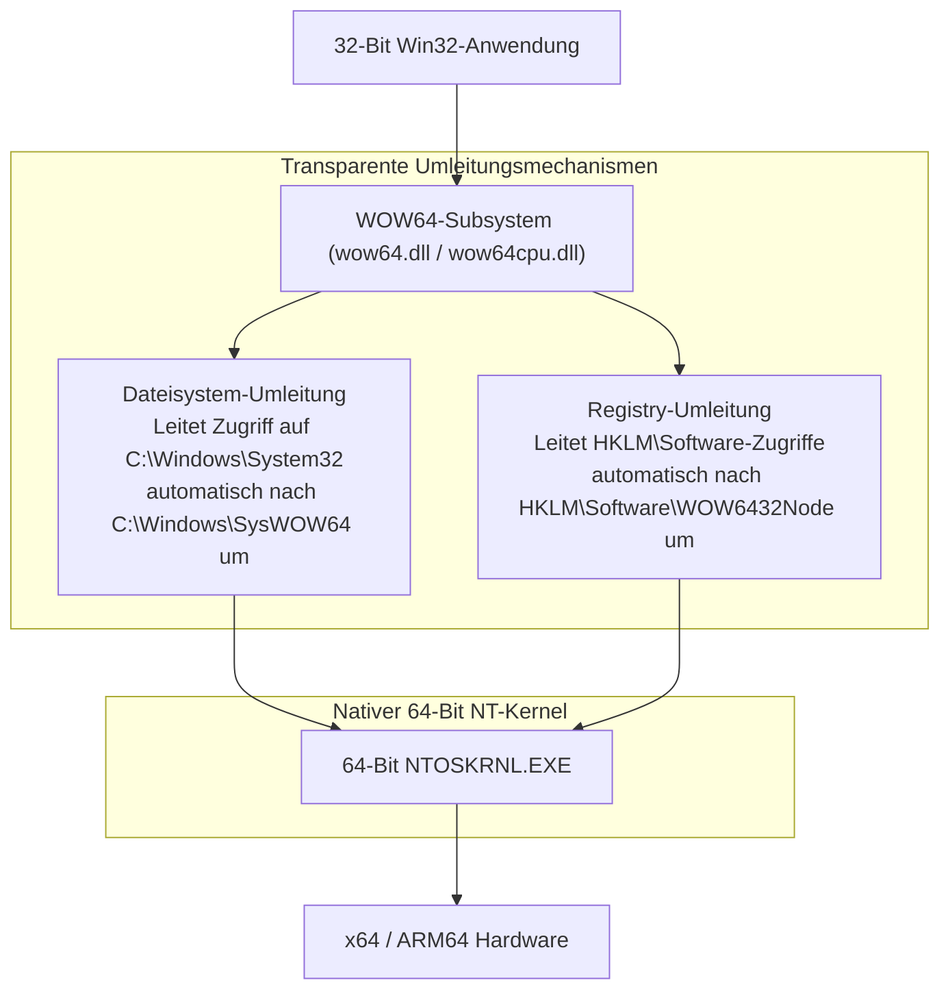

WOW64 spiegelt 32-Bit-Anwendungen eine **parallele Realität von Dateisystem und Registry** vor:

- **Dateisystem-Umleitung**:
  Im 64-Bit-Windows liegen die nativen 64-Bit-System-DLLs in `C:\Windows\System32`. Greift ein 32-Bit-Programm darauf zu, leitet WOW64 den Zugriff transparent nach `C:\Windows\SysWOW64` um (wo sich die 32-Bit-Bibliotheken befinden).
- **Registry-Umleitung**:
  Schreibt ein 32-Bit-Programm nach `HKEY_LOCAL_MACHINE\Software`, landet der Eintrag automatisch in `HKEY_LOCAL_MACHINE\Software\WOW6432Node`.

Dank dieser Konstruktion weiß eine 1998 kompilierte 32-Bit-Anwendung nicht einmal, dass sie auf einem 64-Bit-Betriebssystem läuft.

### 6.2 Der Sprung auf ARM64 und der Prism-Emulator

Die aktuelle technologische Hürde ist der Übergang von x86/x64 zu **ARM64 (Qualcomm Snapdragon X Elite usw.)**.

Bereits 2012 versuchte Microsoft mit „Windows RT“, Altlasten abzuschneiden und keine herkömmlichen Win32-Anwendungen auf ARM zuzulassen. Das Resultat war ein Debakel mit Milliardenverlusten. Microsoft lernte die Lektion: Ein Windows, das die existierenden Win32-Anwendungen nicht ausführen kann, wird vom Markt nicht akzeptiert.

Windows 11 on ARM beinhaltet daher den hochmodernen Binäremulator **Prism**. Prism übersetzt x86- und x64-Befehle zur Laufzeit via Just-In-Time (JIT)-Kompilierung in ARM64-Befehle und speichert optimierte Codeblöcke im Cache, um nahezu native Ausführungsgeschwindigkeiten zu erreichen.

Egal wie stark sich die Prozessorarchitektur wandelt: Der Doppelklick auf die EXE-Datei muss funktionieren.

---

## Kapitel 7: Drei Philosophien im Vergleich — Windows versus Apple (macOS) versus Linux

Auf die Frage, wie mit älterer Software umzugehen sei, haben die drei führenden Betriebssystemwelten völlig gegensätzliche Antworten gefunden.

### 7.1 Apple (Chirurgischer Bruch): Verbrannte Erde im Namen des Fortschritts

Von Steve Jobs bis Tim Cook verfolgt Apple eine Philosophie der **„Politik der verbrannten Erde“**: Für ein optimiertes Benutzererlebnis der Zukunft wird die Vergangenheit ohne Zögern geopfert.

Die Apple-Historie ist eine Kette radikaler Brüche:
- **Aufgabe des klassischen Mac OS**: Der harte Wechsel von Mac OS 9 auf Mac OS X. Die Übergangs-API „Carbon“ wurde nach einer Schonfrist komplett eliminiert.
- **Hardware-Wechsel im Eiltempo**: 680x0 → PowerPC → Intel x86 → Apple Silicon (M-Serie). Emulatoren wie Rosetta und Rosetta 2 werden nach wenigen Jahren ersatzlos aus dem Betriebssystem entfernt.
- **Vollständiges Aus für 32-Bit mit macOS Catalina**: 2019 strich Apple jegliche Unterstützung für 32-Bit-Binärdateien.

Apples Standpunkt ist glasklar: Entwickler haben stets das neueste Xcode zu nutzen, ihren Code auf Swift umzustellen und regelmäßig neu zu kompilieren. Wer nicht mitzieht, scheidet aus dem Ökosystem aus. Dies hält macOS schlank und modern, bürdet Anwendern und Entwicklern jedoch ständige Anpassungskosten auf.

### 7.2 Linux (Linus' Gebot): Licht und Schatten von „Never break userspace!“

Im Open-Source-Lager vertritt Linux-Schöpfer Linus Torvalds eine eiserne Regel, die der Philosophie von Windows verblüffend ähnelt: **„Never break userspace! (Zerstöre niemals den Userspace!)“**

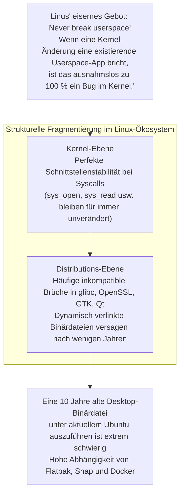

Führt ein noch so eleganter Kernel-Patch dazu, dass ein bestehendes Anwenderprogramm nicht mehr läuft, wird der Patch von Torvalds im Kernel-Mailinglist-Verteiler zornig abgewiesen.

Auf dem Linux-Desktop fehlt jedoch eine zentrale Kontrollinstanz wie Microsoft. Während Systemaufrufe des Kernels unveränderlich sind, brechen Shared Libraries der Distributionen (`glibc`, `libssl`, Desktop-Toolkits) regelmäßig die Kompatibilität. **Eine vor zehn Jahren dynamisch kompilierte Linux-Desktop-Binärdatei auf einem aktuellen Ubuntu zu starten, ist oft ein Ding der Unmöglichkeit.**

### 7.3 Windows (Kumulative Inklusion): Schichten über Schichten

Windows entschied sich für das Prinzip der **„Kumulativen Inklusion (Cumulative Inclusion)“**.

Keine Schnittstelle wird je weggeworfen. Über Win16 legte man Win32, darauf das .NET Framework, darauf WinRT und UWP, und als UWP scheiterte, setzte man das Windows App SDK (WinUI 3) wieder direkt auf das Fundament von Win32.

Dadurch entstand eine der gewaltigsten Codebasen der Welt – doch zugleich das einzige Ökosystem, in dem **Software aus allen Epochen der PC-Ära friedlich nebeneinander koexistiert**.

| Kriterium | Microsoft (Windows) | Apple (macOS) | Linux (Desktop) |
| :--- | :--- | :--- | :--- |
| **Philosophie** | **Kumulative Inklusion**<br/>Bewahrt alle historischen Schichten | **Chirurgischer Bruch**<br/>Regelmäßige Tabula Rasa | **Stabiler Kernel, dynamischer Userspace**<br/>Kernel unveränderlich, Bibliotheken volatil |
| **Oberste Direktive** | „Don't break old apps“ | „Embrace the modern platform“ | „Never break userspace“ (nur Kernel) |
| **Kompatibilitätshorizont** | **Über 30 Jahre** (Win32 / DOS) | **3 bis 5 Jahre** (dann Cut) | Jahrzehnte im Kernel, kurzlebig bei GUI-Apps |
| **32-Bit-Unterstützung** | **Voll funktionsfähig in Win 11** (WOW64) | **Mit Catalina (2019) komplett beendet** | Nur über Multi-Arch-Pakete |
| **Anforderung an Entwickler** | Binärdateien laufen ohne Zutun weiter | Regelmäßige Neukompilierung und Anpassung | Regelmäßige Neu-Paketierung für Distributionen |
| **Architektur-Reinheit** | Gewaltig, pragmatisch, hunderte Mio. Zeilen | Äußerst sauber, schlank und modern | Modular, aber stark zersplittert |

---

## Kapitel 8: Plattform-Ökonomie — Warum Abwärtskompatibilität der stärkste Burggraben (Moat) ist

Warum nahmen Bill Gates und Generationen von Managern diese enorme technische Bürde auf sich? Die Antwort liegt nicht in programmiertechnischer Ästhetik, sondern in der **Ökonomie von Plattformmärkten**.

### 8.1 Das Geschäftsmodell von Bill Gates: Der Wert eines Betriebssystems ist die Summe der Software

Bill Gates erkannte früh ein Grundgesetz:

> **Das Plattform-Werttheorem**:
> Der ökonomische Wert eines Betriebssystems bemisst sich nicht nach seinen internen Funktionen, sondern nach der **Gesamtheit aller weltweiten Anwendungen, die darauf lauffähig sind**.

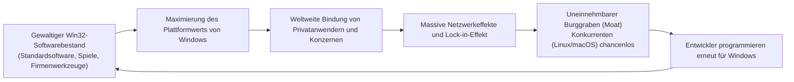

Ein Betriebssystem kann noch so fortschrittlich, speichereffizient und schön gestaltet sein: Kann der Anwender seine gewohnten Werkzeuge nicht ausführen, ist sein wirtschaftlicher Wert gleich null.

Solange Windows 100 % abwärtskompatibel bleibt, fließt jede Zeile Code, die in den letzten 30 Jahren für Windows geschrieben wurde, **automatisch als Mehrwert in jede neue Windows-Version ein**.

Verhandlungen über Betriebssystemwechsel in Unternehmen endeten stets abrupt mit dem Satz: *„Unsere zwanzig Jahre alte Auftragsabwicklung läuft auf Ihrem System nicht.“* Abwärtskompatibilität schuf einen gigantischen wirtschaftlichen Burggraben, den kein Konkurrent überwinden konnte.

### 8.2 Der unauflösbare Lock-in-Effekt der Unternehmenswelt

In Großkonzernen, Behörden, Krankenhäusern und Industrieanlagen laufen unternehmenskritische Anwendungen, in die einst Millionenbeträge flossen – oft entwickelt in Visual Basic 6 oder mit proprietären ActiveX-Steuerelementen. Viele ursprüngliche Softwarehäuser existieren längst nicht mehr; Quellcodes und Dokumentationen sind oft verschollen.

Hätte Windows diese Kompatibilität aufgegeben und verlangt, diese Software für Unsummen neu zu schreiben, hätten Vorstände Upgrades auf unabsehbare Zeit verweigert oder Alternativen gesucht.

Stattdessen trat Windows mit AppCompat an und versprach: *„Kaufen Sie neue Hardware, Ihre Software läuft einfach weiter.“* Kein Angebot ist für Manager verlockender. Auf diese Weise kettete Windows die weltweite Unternehmenslandschaft untrennbar an sich.

### 8.3 Die „Erfolgsfalle“: Wie Kompatibilität eigene Innovationen bremste

Dieser Erfolg barg jedoch eine **Erfolgsfalle (Success Trap)** für Microsoft selbst.

Als in den 2010er-Jahren iOS und Android den Markt eroberten, versuchte Microsoft, Windows mit der **Universal Windows Platform (UWP)** zu modernisieren – einer isolierten, sicheren Sandbox-Architektur, die Win32 ablösen sollte.

Doch Unternehmen und Entwickler ignorierten UWP weitgehend: Warum sollten sie ihre mächtigen Programme mühsam für eine restriktive Sandbox umschreiben, wenn ihre Win32-Programme auf Windows 10 und 11 makellos liefen?

Weil Win32 so unzerstörbar stabil funktionierte, konnte Microsoft seine eigene Alt-Architektur nicht mehr ablösen. Schließlich musste Microsoft einlenken: UWP wurde zurückgefahren, Win32-Apps zogen in den Microsoft Store ein, und moderne Frameworks wie WinUI 3 wurden wieder auf das Win32-Fundament aufgesetzt.

---

## Kapitel 9: Der Preis des Erfolgs — Technische Schulden und Sicherheitsrisiken

Drittanbieter-Fehler auszubügeln und 30 Jahre Software-Historie mitzuschleppen, forderte einen hohen Tribut. Das Windows-Team ringt mit den gewaltigsten technischen Schulden der IT-Branche.

### 9.1 Hunderte Millionen Codezeilen und astronomische Testmatrizen

Der Windows-Quellcode umfasst heute geschätzt **hunderte Millionen Zeilen**. Die größte Herausforderung liegt in der gigantischen Testmatrix, die für jeden neuen Build bewältigt werden muss.

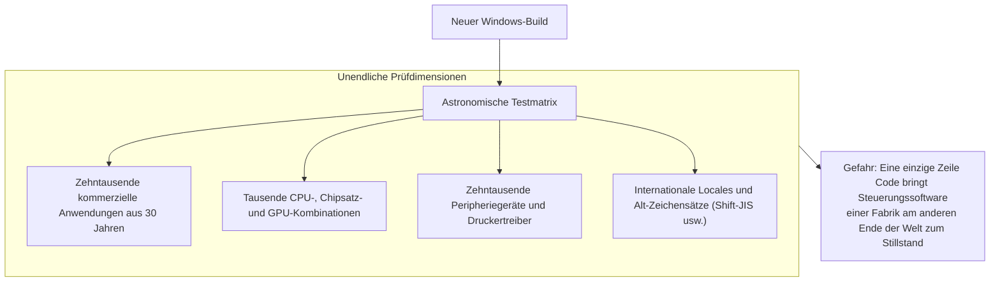

Ändert ein Entwickler im NT-Kernel eine einzige Synchronisationslogik, besteht das Risiko, dass eine Industrieanlage am anderen Ende der Welt einfriert. Um dieses Risiko zu beherrschen, betreibt Microsoft gigantische Testlabore mit zehntausenden physischen Rechnern und virtuellen Maschinen, die historische Software automatisiert testen.

### 9.2 Sicherheitsrisiken durch Alt-APIs

Die gravierendste Kehrseite der Abwärtskompatibilität ist die **IT-Sicherheit**.

Viele Win32-APIs aus den 1990er-Jahren stammen aus einer Ära vor der weltweiten Vernetzung. Sie weisen aus heutiger Sicht unzureichende Puffergrenzenprüfungen und laxe Rechtekonzepte auf. Sie dürfen jedoch nicht entfernt werden, ohne Unternehmenssoftware lahmzulegen.

Angreifer nutzen mit Vorliebe diese historischen Schnittstellen und die Lücken in den Kompatibilitätsschichten für Rechteausweitungen und Sandbox-Ausbrüche aus. Die Hilfsbereitschaft gegenüber alten Programmen vergrößert unausweichlich die Angriffsfläche des Gesamtsystems.

### 9.3 Der Zusammenbruch des Projekts Longhorn und das „MinWin“-Refactoring

Diese wachsende Komplexität führte Anfang der 2000er-Jahre zum Beinahe-Kollaps: dem Scheitern des **Projekts Longhorn**.

Longhorn, als revolutionärer Nachfolger von Windows XP geplant, verfing sich in einem undurchdringlichen Netz aus Code-Abhängigkeiten und Altlasten. Tägliche Builds waren defekt, die Entwicklungsgeschwindigkeit brach ein, das Projekt geriet außer Kontrolle.

2004 zog Microsoft die Notbremse: Man verwarf jahrelange Entwicklungsarbeit, setzte auf der soliden Basis von Windows Server 2003 neu auf und leitete eine radikale architektonische Bereinigung ein, aus der **MinWin** hervorging (die Basis für Windows Vista und Windows 7).

MinWin zerlegte den Kern des NT-Betriebssystems in ein kompaktes, modulares Zentrum und trennte die Basisfunktionen strikt von den darüberliegenden Kompatibilitätsschichten. Nur dank dieses schmerzhaften Befreiungsschlags existiert Windows heute noch.

---

## Fazit: Eine Hommage an die Ingenieure des Pragmatismus — Das Fundament unserer modernen Welt

Ganz gleich, ob Büro-Rechner, digitale Krankenakten im Krankenhaus, Geldautomaten, Zugleitsysteme oder CNC-Maschinen in Werkshallen: Die kritische Infrastruktur unserer Zivilisation ruht fast ausnahmslos auf Windows.

Man stelle sich vor, Microsoft hätte sich der akademischen Reinheit verschrieben und wie Apple alle paar Jahre alte Software rigoros ausgesperrt:

Fabriken weltweit hätten stillgestanden, mittelständische Unternehmen wären an permanenten Software-Neuentwicklungskosten zerbrochen, Krankenhäuser und Logistikketten wären im Chaos versunken. Dass die moderne Weltwirtschaft und Informationsgesellschaft über drei Jahrzehnte hinweg unterbrechungsfrei florieren konnten, ist dem Umstand zu verdanken, dass Windows **die Fehler, Missverständnisse, Bugs und Altlasten unzähliger Entwickler auf die eigenen Schultern geladen hat**.

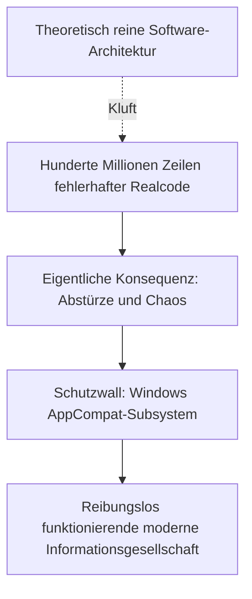

Für Raymond Chen und Generationen von Windows-Ingenieuren war das Disassemblieren fremder Binärdateien und das Verfassen endloser Shims keine glamouröse Arbeit. Es brachte weder akademischen Ruhm noch den Beifall der Start-up-Szene im Silicon Valley ein.

Doch genau darin liegt die Essenz **wahren, professionellen Engineerings**.

Echtes Engineering verharrt nicht im keimfreien Elfenbeinturm mathematischer Eleganz. Es krempelt die Ärmel hoch, stellt sich dem Schmutz und der Unvollkommenheit der realen Welt und sorgt unerbittlich dafür, dass **das, was gestern funktionierte, auch heute, morgen und in zwanzig Jahren noch zuverlässig seinen Dienst verrichtet**.

„Mache niemals alte Apps kaputt“ – auf diesem pragmatischen Grundsatz und dem unermüdlichen Einsatz der Ingenieure, die ihn mit Leben füllten, steht das unsichtbare Fundament unserer heutigen digitalen Zivilisation.
