## Introduction: The True Essence of an Operating System — "Clean Architecture" vs "Gritty Pragmatism"

Open any computer science textbook or software engineering treatise, and you will invariably find an ode to pristine ideals: "clean abstractions," "separation of concerns," and "orthogonal API design." An operating system, according to academic doctrine, ought to be a sacred arbiter—an entity that conceals the messy idiosyncrasies of physical hardware behind a unified, intuitive, and mathematically sound interface for applications.

Yet, the moment one steps outside the ivory tower of academia and onto the commercial desktop battlefield, these pristine ideals shatter. The defining philosophy of Microsoft Windows—the dominant force in personal computing that has powered billions of PCs across the globe—stands in stark opposition to textbook purity: it is governed by an **almost fanatical, gritty pragmatism**.

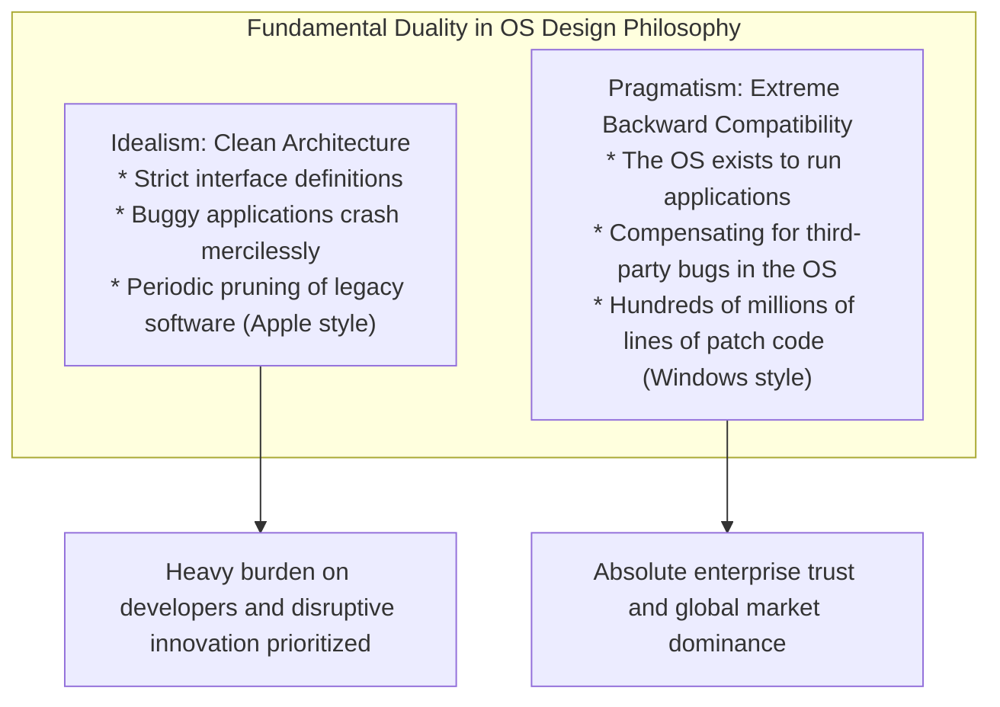

Among all operating systems ever conceived, none has exhibited such an obsessive dedication to legacy compatibility as Windows. A video game shipped on a CD-ROM in 1995, an enterprise accounting suite written in Visual Basic 3.0 or 16-bit C++ in the early 1990s, relic tools from the MS-DOS era, and ancient utilities that relied on undocumented kernel quirks—a staggering majority of them still launch and execute flawlessly on Windows 11 in the mid-2020s.

Most end users take this for granted, viewing it as nothing more than "software doing what it is supposed to do." Yet systems programmers who have reverse-engineered the inner sanctum of the Windows NT kernel and Win32 subsystem react with awe and dread. Deep inside the OS lies an astonishing, layered geological stratum accumulated over three decades: **tens of thousands of lines of special-case exceptions, dynamic API impersonations, and specialized deception frameworks (Shims)** engineered by Microsoft to forgive the bugs, standard violations, memory corruptions, and undefined behaviors of third-party software.

Why did Microsoft shoulder the burden of buggy code written by other companies, going so far as to contort the operating system itself to make things work?
Why did Microsoft refuse to take the path chosen by Apple—periodically severing ties with the past?
And how did this relentless engineering discipline transform Windows into the most unassailable commercial platform in computing history?

Drawing on testimonies from legendary former Microsoft engineers, reverse-engineered internal structures, the architecture of the PE binary format and the NT kernel, and the history of platform economics, this document dissects the supreme prime directive that has governed Windows for decades: **"Never break old apps."**

---

## Chapter 1: The Prime Directive According to Two Industry Titans

The obsession with compatibility inside the Windows development teams was not an external myth or urban legend. It was laid bare by two legendary programmers who wrote the code, guided the architecture, and fought on the front lines of Microsoft's software battles.

### 1.1 Raymond Chen and *The Old New Thing*

Within the Windows engineering organization at Microsoft, one engineer stands as a living legend spanning over thirty years. Having joined Microsoft in 1992, **Raymond Chen** has spent decades designing, developing, and maintaining the Windows 95 Shell, User32, and the deepest corners of the Win32 subsystem as a Principal Software Engineer.

His blog, ***The Old New Thing***—which began as an internal Microsoft communication channel before becoming a cornerstone of Microsoft's developer portal and later a celebrated book—serves as an unparalleled technical chronicle of how Windows resolved decades of messy compatibility dilemmas.

Chen articulated the foundational axiom of the Windows engineering group with ruthless clarity:

> "An operating system exists to run programs. Users do not purchase computers to admire the operating system. They buy computers to run specific applications that get their work done.
> 
> And here is the brutal reality: **When users upgrade to a new version of Windows and their favorite application breaks, they never blame the application developer. 100% of the time, they blame Microsoft: 'Windows is broken,' or 'The new Windows is defective.'**"

From an ivory-tower programming standpoint, one might insist: "If the application contains bugs, it deserves to crash; the software vendor must release a patch." In the cutthroat commercial OS market, however, this academic purism is commercial suicide. To an end user, the only tangible fact is: "This application worked yesterday; I upgraded Windows, and today it is dead."

If Microsoft were to dismiss users with technical righteousness—"that is a bug in third-party code"—users would simply refuse to upgrade, remain marooned on legacy operating systems, or migrate to competitor ecosystems. Consequently, business survival dictated an unforgiving mandate for the Windows team:

**"No matter how outrageous, invalid, non-compliant, or fundamentally broken the third-party code may be, the operating system must detect it, compensate under the hood, and ensure it runs as if nothing were amiss."**

Chen's writings document the tragic, humorous, and astonishing hacks that he and his fellow engineers were forced to invent to uphold this creed.

### 1.2 Joel Spolsky's Exposure: *How Microsoft Lost the API War*

The profound commercial and cultural significance of this engineering philosophy was brought to international prominence by **Joel Spolsky**, a prominent software essayist, former Microsoft Program Manager on the Excel team in the early 1990s, and later co-founder of Stack Overflow and Trello.

In his celebrated 2004 essay, *How Microsoft Lost the API War*, Spolsky reflected on the uncompromising leadership of Windows engineering executives such as Jon DeVaan, writing:

> "In the Windows team, the prime directive was: **don't break old apps.**"

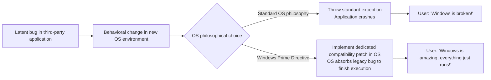

Spolsky noted that just as Starfleet officers in *Star Trek* are bound by Starfleet's Prime Directive (prohibiting interference with the development of alien civilizations), the non-negotiable Prime Directive for Windows kernel and subsystem engineers was: **never break existing applications**.

If a Windows engineer elegantly refactored a kernel routine or an API implementation, doubling its throughput, yet that refactoring caused a single obscure business application somewhere in the world to crash, the change was unconditionally rejected. Code elegance and architectural purity were subordinate; **ensuring existing compiled binaries continued to execute without failure was the ultimate good**.

### 1.3 "Bugs Become Specifications": Hyrum's Law and the Irreversibility of APIs

In software engineering, there is an empirical principle formulated by Google software engineer Hyrum Wright known as **Hyrum's Law**:

> **Hyrum's Law**:
> "With a sufficient number of users of an API, it does not matter what you promise in the contract: all observable behaviors of your system will be depended on by somebody."

Windows has served as the grandest, most grueling testing ground for Hyrum's Law in the history of computing.

Suppose the documentation for a Win32 API explicitly states: *"The third parameter must be a valid window handle. Passing an invalid value results in undefined behavior."* Now suppose a careless developer accidentally passed `NULL` or an invalid pointer to that API, and in the legacy Windows 3.1 implementation, the function happened to fail silently without generating a fault.

Once hundreds of thousands of copies of that third-party software have shipped across the globe, what happens when the Windows 95 or Windows NT team cleans up the validation logic to return `ERROR_INVALID_WINDOW_HANDLE` upon encountering an invalid handle?

The legacy application promptly throws an error dialog and crashes across tens of thousands of corporate offices. Furious enterprise customers flood Microsoft customer support lines with furious complaints: *"We upgraded our workstations and our business has ground to a halt!"*

Faced with this commercial fallout, Microsoft engineers were forced to retract their technically correct code and write humiliating workarounds like the following:

```c
// Conceptual recreation of internal Windows API compatibility logic
BOOL WINAPI DoSomething(HWND hWnd, UINT uMsg, WPARAM wParam, LPARAM lParam)
{
    // Textbook-correct validation logic
    if (!IsWindow(hWnd)) {
        // In an ideal world, the function should fail immediately:
        // SetLastError(ERROR_INVALID_WINDOW_HANDLE);
        // return FALSE;

        // [Compatibility Workaround]
        // Legacy application "AppX.exe" mistakenly passes a NULL handle during startup.
        // Returning an error causes AppX to crash.
        // Therefore, we silently substitute the desktop window handle and proceed.
        if (IsTargetBadApplication("AppX.exe")) {
            hWnd = GetDesktopWindow();
        } else {
            SetLastError(ERROR_INVALID_WINDOW_HANDLE);
            return FALSE;
        }
    }

    // Proceed with genuine internal logic...
    return InternalDoSomething(hWnd, uMsg, wParam, lParam);
}
```

The moment an operating system achieves widespread commercial dominance, an API specification ceases to be the text printed in the documentation; it becomes **the sum total of every observable behavior—including bugs, edge cases, and side effects—exhibited by the legacy implementation**. The Windows engineering team accepted this irreversible reality and resolved to absorb the programming mistakes of the world into the operating system itself.

---

## Chapter 2: The Genesis of a Legend — The Technical Truth Behind the "SimCity Incident"

Among all the anecdotes illustrating the Windows team's fanatical devotion to backward compatibility, one stands supreme in computer history: **The SimCity Incident** during the development of Windows 95.

### 2.1 The Physics of Use-After-Free

Created in 1989 by Will Wright and Maxis, *SimCity* was a monumental triumph in computer gaming history, boasting enormous worldwide popularity. Running SimCity reliably was a major selling point for home users and enterprise workers taking breaks on corporate PCs alike.

However, the PC release of SimCity, built for MS-DOS and Windows 3.1, harbored a severe defect that modern security analyzers would instantly classify as a critical memory safety vulnerability: a **Use-After-Free (UAF)** bug.

During simulation calculations and graphical rendering, SimCity allocated memory blocks from the operating system heap and subsequently deallocated them via `free` or `GlobalFree`. Unfortunately, the application logic failed to clear its internal pointers after deallocation and **continued to read from and write to the freed memory buffers as if it still owned them**.

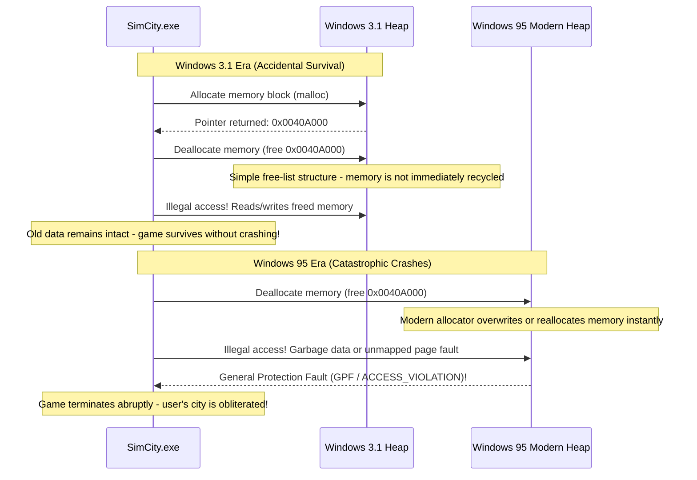

Under the 16-bit architecture of Windows 3.1, the memory management subsystem was primitive. When an application freed a memory segment, the basic free-list implementation rarely recycled or scrubbed that memory block immediately. Consequently, despite SimCity running fundamentally broken code, **it functioned purely by accident because the underlying memory allocator was simplistic and unaggressive**.

### 2.2 Standard Software Engineering vs The Windows Team's Relentless Obsession

In 1995, Microsoft prepared to launch Windows 95—a transformative 32-bit operating system boasting true preemptive multitasking, a sophisticated virtual memory manager, and an advanced heap allocator designed to minimize fragmentation and maximize caching throughput.

When an application returned memory to this modern allocator, the system **immediately cleared, coalesced, or reassigned that memory block to other processes** to optimize system performance.

When SimCity ran on top of this modern allocator, disaster struck.
SimCity attempted to access memory it had just released, only to find zeroed pages or foreign data belonging to other processes. A fraction of a second later, a catastrophic **General Protection Fault (GPF)** terminated the process, wiping out hours of city-building progress.

What would conventional software engineering principles dictate in such a scenario?

The answer is obvious: "This is a severe bug in Maxis's code. The operating system's memory manager is adhering strictly to specifications. Maxis must be notified and requested to ship a patch (SimCity 1.01) on floppy disk."

Yet for Microsoft's executive leadership and the Windows 95 team, failure was not an option. Their response was radical:

**"SimCity must not crash. We cannot wait for Maxis to distribute patches. Modify the Windows 95 kernel memory manager itself to ensure SimCity runs."**

### 2.3 Deep Dive into the SimCity-Specific Memory Allocator Hack

Joel Spolsky chronicled this pivotal engineering decision:

> "During the Windows 95 beta cycle, they found that SimCity would not run reliably. Did Microsoft track down the makers of SimCity and demand they fix their code? No.
> Instead, an engineer working on the Windows 95 memory manager added special code: **'If the program currently executing is SimCity, do not reallocate freed memory immediately; preserve it untouched for a while.'**"

From a modern systems perspective, this hack was an early prototype of what is now known as a **Quarantine Heap** or **Delayed Free mechanism**.

Upon process initialization, the Windows 95 memory manager inspected the binary name (`SIMCITY.EXE`) and header metadata. If SimCity was detected, the allocator dynamically switched from standard allocation to a specialized "SimCity rescue mode." Instead of immediately coalescing freed blocks into the global allocation pool, the allocator diverted recently deallocated pointers into an internal quarantine ring buffer, shielding the underlying memory blocks from being overwritten for an extended period.

Thanks to this gritty, unorthodox concession by the operating system, on launch day in August 1995, millions of users around the world inserted their SimCity floppy disks into brand-new Windows 95 PCs, and the game ran flawlessly.

Users praised Microsoft: *"Windows 95 is incredible! It runs every piece of old software without a hitch!"* None of them knew that inside the shiny new 32-bit kernel lay an intricate patch explicitly engineered to forgive the memory safety violations of a third-party game.

---

## Chapter 3: The Chronicle of Historic "Gritty Compatibility Hacks"

The SimCity rescue was merely the opening act. The thirty-year evolution of Windows has been an unbroken sequence of extraordinary engineering accommodations designed to keep poorly behaved legacy software alive.

### 3.1 Lotus 1-2-3 and Excel's "1900 Leap Year Bug"

In computer calendaring systems, one bug stands as the most famous—and deliberately preserved—defect on Earth: **treating the year 1900 as a leap year**.

Under the Gregorian calendar, leap years are governed by three precise rules:
1. A year divisible by 4 is a leap year.
2. However, a year divisible by 100 is a common year.
3. However, a year divisible by 400 is a leap year.

Because 1900 is divisible by 100 but not by 400, **1900 was a common year; February 29, 1900, did not exist**.

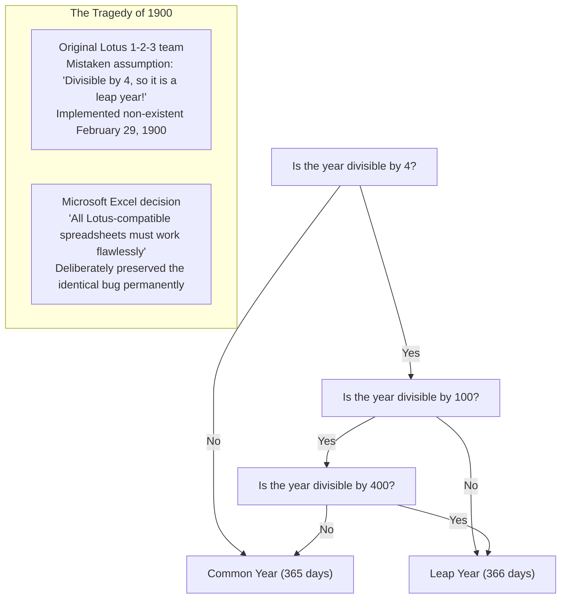

In the early 1980s, the dominant DOS spreadsheet software was *Lotus 1-2-3*. Its developers failed to account for the century exception, writing code that treated 1900 as a leap year. Consequently, Lotus 1-2-3 introduced the fictitious date "February 29, 1900," offsetting its serial date numbering system by one day for all subsequent dates.

When Microsoft engineered *Excel* to challenge Lotus 1-2-3, the Excel engineering team faced a crucial crossroads: should they implement a mathematically correct calendar, or should they ensure complete computational compatibility with millions of existing corporate spreadsheets created in Lotus 1-2-3?

Bill Gates and Microsoft chose compatibility. Excel **intentionally replicated the bug, permanently incorporating February 29, 1900, into its date engine**.

Launch the latest version of Microsoft 365 Excel today and enter `=DATE(1900, 2, 29)` into a cell. Even in an application infused with cutting-edge cloud and AI capabilities, Excel will return "1900/2/29" without an error. Once a platform absorbs another vendor's bug, that decision remains locked in for centuries.

### 3.2 Why Was "Windows 9" Skipped?

In 2014, Microsoft unveiled the successor to Windows 8.1. While the industry universally anticipated "Windows 9," the presenter surprised the world by skipping directly to **Windows 10**.

While marketing executives cited a desire to emphasize a monumental generational leap, engineers in the developer community and former Microsoft staff revealed the underlying technical reality: **a massive compatibility trap**.

For two decades, countless third-party applications, installation packages, and Java libraries had determined the host operating system using lazy substring checks like this:

```java
// Ubiquitous pattern found in legacy software across the globe
String osName = System.getProperty("os.name");

if (osName.startsWith("Windows 9")) {
    // Legacy handling for Windows 95 or Windows 98!
    // Triggers 16-bit compatibility hacks or obsolete registry paths
    enableLegacyWin9xMode();
} else {
    // Modern NT-based OS path (Windows NT, 2000, XP, 7, 8, etc.)
    enableModernNTMode();
}
```

Developers had used `startsWith("Windows 9")` as a quick shorthand to identify both Windows 95 and Windows 98 simultaneously.

Had Microsoft named the new OS "Windows 9," thousands of enterprise applications would have inspected the OS string, assumed they were running on a 1995-era operating system, bypassed modern NT APIs, invoked obsolete Win9x compatibility routines, and crashed instantly on high-end hardware.

Microsoft refused to risk breaking tens of thousands of business applications over a branding convention, consigning "Windows 9" to the archives of history.

### 3.3 Undocumented APIs and Norton Utilities

During the 1990s, Symantec's *Norton Utilities* was an indispensable system diagnostic and repair suite. For the Windows engineering team, however, it was an unending nightmare and the quintessential example of ill-behaved software.

Low-level utilities like Norton were never content with using official, documented Win32 APIs. Instead, they routinely **inspected undocumented Windows internal data structures, invoked unexported kernel functions, and read hardcoded memory offsets inside system DLLs**.

Raymond Chen recalled the intense struggle with Norton Utilities during the creation of Windows 95. Whenever the internal architecture of Windows was revised and an internal task structure shifted by even a single byte, Norton Utilities would immediately trigger a Blue Screen of Death (BSOD), taking down the entire machine.

Microsoft did not simply chastise Symantec for probing private structures. Instead, Microsoft engineers disassembled Norton Utilities, reverse-engineered its internal logic, mapped out every memory offset Norton was attempting to access, and **retained dummy data structures at the exact memory addresses Norton expected**, preserving machine stability through remarkable engineering contortions.

### 3.4 The Day Bill Gates Held a Shotgun: The Genesis of DOOM, WinG, and DirectX

Prior to the launch of Windows 95, Windows was dismissed by the game development industry. Game developers viewed Windows as a slow, bloated business graphical user interface wholly incapable of running high-performance action titles. All major games were built for MS-DOS, where programmers could directly manipulate video hardware and sound cards (such as the Sound Blaster) via raw I/O port writes.

The pinnacle of this era was id Software's legendary first-person shooter, *DOOM*. DOOM was installed on workplace PCs worldwide, famously blamed for denting national office productivity across the United States.

Bill Gates recognized a critical threat: if PC users had to reboot into DOS to play games, Windows 95 would never achieve total market dominance. DOOM had to run on Windows 95—and it had to run faster than in DOS.

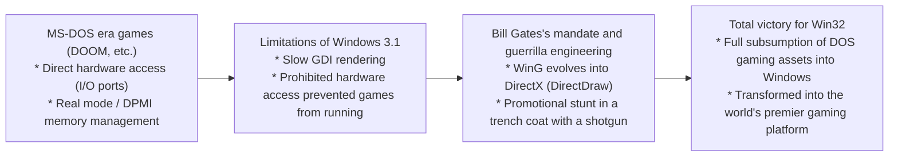

Gates marshaled elite internal engineering talent to accelerate the creation of "WinG," a high-performance graphics library, which quickly evolved into **DirectX** (codenamed the *Manhattan Project*). DirectX gave applications low-overhead, direct access to graphics and audio hardware while remaining safely within the protected memory model of Windows.

To drive the message home, Gates appeared in a legendary promotional video wearing a trench coat and holding a shotgun inside a digital recreation of DOOM, declaring Windows 95 the premier gaming platform. Taming raw DOS hardware access under protected mode laid the foundation for Windows' unrivaled multimedia ecosystem.

---

## Chapter 4: The Citadel Powering Modern Windows: "AppCompat" (Application Compatibility)

During the Windows 95 era, compatibility hacks were scattered throughout the operating system as ad-hoc exceptions in various modules. By the time Windows 2000 and Windows XP arrived, with the software ecosystem exploding, this approach reached its breaking point. OS source code was becoming choked with hardcoded conditional branches, making maintainability impossible.

To solve this, Microsoft's system architects designed the most sophisticated compatibility engine in computing history—the **Application Compatibility (AppCompat)** subsystem.

### 4.1 Overall Architecture of the AppCompat Subsystem

The AppCompat subsystem is an **intelligent interception system that inspects application binaries as they are loaded into memory, dynamically interposing a transparent deception layer (Shim) between the application and the OS kernel**.

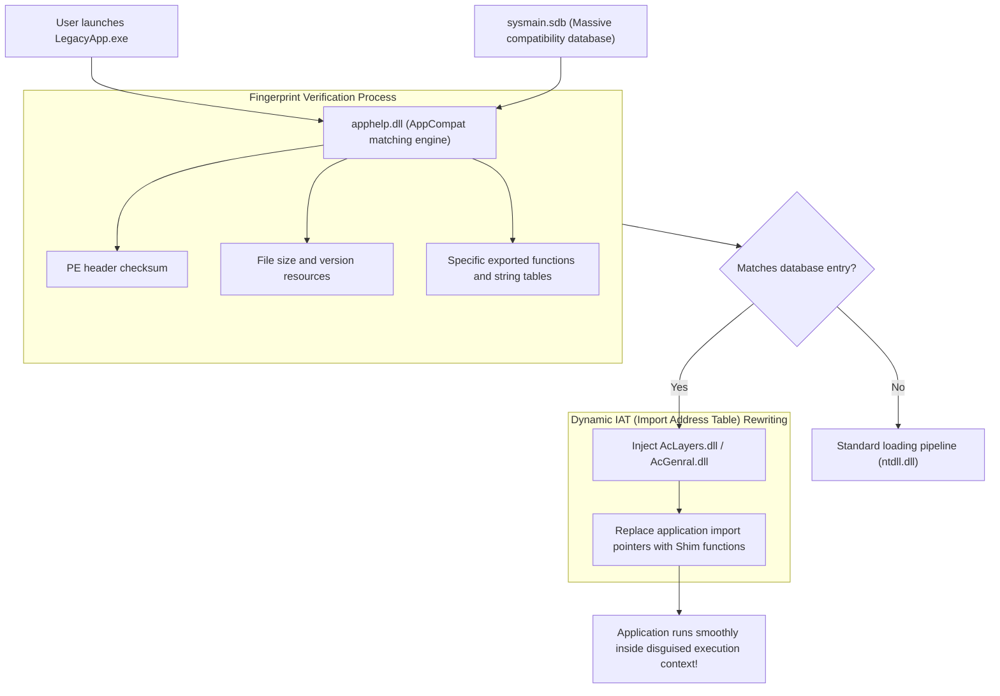

When an executable (`.exe`) is launched, the Windows process creation routine inside `ntdll.dll` does not immediately transfer control to the application entry point. Instead, it invokes **`apphelp.dll`**.

`apphelp.dll` queries **`sysmain.sdb`**, an internal database of compatibility definitions, to verify whether the binary matches a known application requiring mitigation. If a match is found, the operating system loader injects compatibility shim libraries (such as **`AcLayers.dll`** or **`AcGenral.dll`**) into the process's virtual address space before standard system libraries (`kernel32.dll`, `user32.dll`, etc.) are linked.

### 4.2 The Shim Engine: API Interception via IAT Hooking

How does the injected Shim engine alter application behavior without modifying the binary on disk? Its primary weapon is **Import Address Table (IAT) Hooking** within the Portable Executable (PE) image.

When a Win32 executable invokes a routine from a system DLL (such as `GetVersionEx` or `GetDiskFreeSpace`), the compiled machine code does not hardcode the virtual memory address of the target DLL function. Instead, when the program loads, the Windows PE loader inspects the application's import descriptors, locates the target functions in their respective DLLs, and writes their live memory addresses into a function pointer table known as the Import Address Table (IAT). All external API calls branch indirectly through pointers in this table.

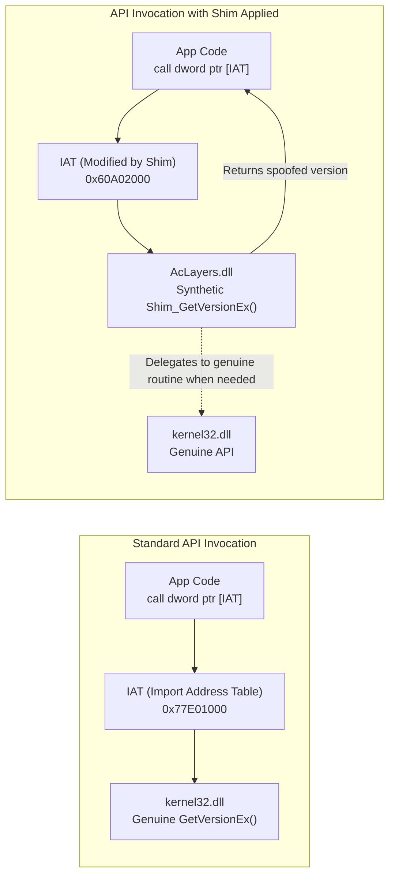

The Shim engine exploits this architectural indirection. Prior to the execution of the application's main thread, the Shim engine temporarily alters the memory protection flags of the IAT to `PAGE_READWRITE` and **replaces the pointer to the real API function with the address of a synthetic compatibility wrapper (Shim function)**.

The following C/C++ conceptual code demonstrates this dynamic hooking mechanism:

```c
// Conceptual demonstration of IAT hooking for Shim injection
#include <windows.h>
#include <imagehlp.h>

// Synthetic GetVersionEx wrapper (The Shim)
BOOL WINAPI Shim_GetVersionExA(LPOSVERSIONINFOA lpVersionInformation)
{
    // Retrieve genuine system information as a baseline
    typedef BOOL (WINAPI *PFN_GETVER)(LPOSVERSIONINFOA);
    HMODULE hKernel = GetModuleHandleA("kernel32.dll");
    PFN_GETVER pfnRealGetVer = (PFN_GETVER)GetProcAddress(hKernel, "GetVersionExA");
    
    BOOL bResult = pfnRealGetVer(lpVersionInformation);
    
    // [The Deception]
    // Lie to the application: report that the host OS is Windows 95 (Major: 4, Minor: 0)
    lpVersionInformation->dwMajorVersion = 4;
    lpVersionInformation->dwMinorVersion = 0;
    lpVersionInformation->dwBuildNumber = 950;
    lpVersionInformation->dwPlatformId = VER_PLATFORM_WIN32_WINDOWS;
    strcpy(lpVersionInformation->szCSDVersion, "");

    return TRUE; // The application assumes it is executing on Windows 95
}

// Scans the PE binary's IAT and replaces target function pointers
void InstallShimHook(HMODULE hAppModule, LPCSTR targetDll, LPCSTR targetFunc, PVOID newFuncAddress)
{
    ULONG size;
    // Retrieve import directory descriptor from the PE header
    PIMAGE_IMPORT_DESCRIPTOR pImportDesc = (PIMAGE_IMPORT_DESCRIPTOR)
        ImageDirectoryEntryToData(hAppModule, TRUE, IMAGE_DIRECTORY_ENTRY_IMPORT, &size);

    while (pImportDesc->Name) {
        LPCSTR dllName = (LPCSTR)((PBYTE)hAppModule + pImportDesc->Name);
        if (_stricmp(dllName, targetDll) == 0) {
            // Traverse the thunk table for the target DLL (e.g., kernel32.dll)
            PIMAGE_THUNK_DATA pThunk = (PIMAGE_THUNK_DATA)((PBYTE)hAppModule + pImportDesc->FirstThunk);
            while (pThunk->u1.Function) {
                PROC* ppfn = (PROC*)&pThunk->u1.Function;
                // If matching function pointer is found, overwrite it
                DWORD oldProtect;
                VirtualProtect(ppfn, sizeof(PROC), PAGE_READWRITE, &oldProtect);
                *ppfn = (PROC)newFuncAddress; // Divert execution to the Shim wrapper!
                VirtualProtect(ppfn, sizeof(PROC), oldProtect, &oldProtect);
                break;
            }
        }
        pImportDesc++;
    }
}
```

Through this mechanism, Windows preserves the integrity of the binary on disk while insulating the application inside a bespoke, virtualized legacy execution environment.

### 4.3 The Enigmatic Giant Binary: `sysmain.sdb` (Shim Database)

The brain of the AppCompat engine is a proprietary binary file located in `C:\Windows\AppPatch\sysmain.sdb`.

Structured in Microsoft's proprietary SDB format, this database houses **remediation profiles for hundreds of thousands of commercial applications, games, and internal enterprise tools**.

To avoid applying shims indiscriminately to unrelated binaries (such as a generic `setup.exe`), `sysmain.sdb` uses multi-attribute "fingerprints" to identify target binaries with surgical precision:

1. **File name and relative directory path**
2. **File size in bytes**
3. **PE Linker Timestamp**
4. **PE Image CheckSum**
5. **Version resource metadata (CompanyName, ProductName, FileVersion, LegalCopyright)**
6. **Hashes of specific PE code sections and export tables**

When an old CD-ROM application from 2001 is launched on Windows 11, `apphelp.dll` scans its cryptographic and structural fingerprint, matches it against `sysmain.sdb`, identifies that the software relies on Windows 2000 heap semantics and attempts illegal writes to administrative registry hives, and activates dozens of tailored shims simultaneously.

---

## Chapter 5: Catalog of Archetypal Shims (The Art of Deception)

Windows includes hundreds of distinct shims, forming an extensive catalog of automated mitigations for virtually every programming mistake in PC history.

### 5.1 `VersionLie`: The OS Lies — "You Are Running Windows 95 Just as You Desired"

The most classic and frequently invoked shim is **`VersionLie`**.

Historically, developers invoked `GetVersion` or `GetVersionEx` during program startup to verify compatibility, frequently writing brittle checks like this:

```c
// Example of fragile version-checking logic
OSVERSIONINFO vi;
GetVersionEx(&vi);

// Rigid check assuming Windows 95
if (vi.dwMajorVersion == 4 && vi.dwMinorVersion == 0) {
    // Normal startup
} else {
    MessageBox(NULL, "This application requires Windows 95.", "Fatal Error", MB_OK);
    ExitProcess(1); // Self-termination!
}
```

When run on Windows XP (Major: 5), Windows 7 (Major: 6), or Windows 10/11 (Major: 10), this code deliberately aborts execution simply because the major version number is not 4.

`VersionLie` intercepts these calls. When the application queries `GetVersionEx`, the Windows 11 kernel returns a spoofed structure indicating Windows 95 (`Major: 4, Minor: 0`). Satisfied, the legacy application proceeds to execute on high-frequency multi-core CPUs and NVMe drives without incident.

### 5.2 `EmulateGetDiskFreeSpace`: Rescuing Applications that Overflow on Disks Larger Than 2 GB

In the mid-1990s, hard disk capacities hovered between several hundred megabytes and one gigabyte. The standard Win32 API `GetDiskFreeSpace` reported sectors per cluster, bytes per sector, and total free clusters as signed 32-bit integers.

Application developers commonly calculated available disk space using the formula:

$$\text{FreeBytes} = \text{SectorsPerCluster} \times \text{BytesPerSector} \times \text{NumberOfFreeClusters}$$

When storage volumes exceeded **2 gigabytes ($2^{31} - 1$ bytes)**, this 32-bit arithmetic suffered an integer overflow, wrapping into a **negative number** (e.g., -500 MB).

Installers for software and games would evaluate the negative value, conclude that the disk was full, and display fatal errors: *"Insufficient disk space. Installation requires 50 MB, but drive has -500 MB available."*

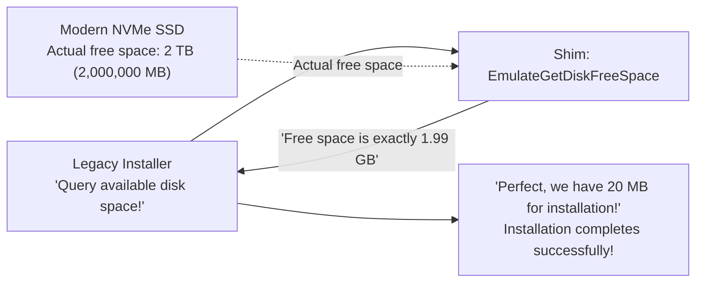

To resolve this, Microsoft implemented **`EmulateGetDiskFreeSpace`**. Regardless of whether the actual drive has multiple terabytes of free space, the shim caps the reported value at **2,147,151,872 bytes (~1.99 GB)**. Convinced that plenty of disk space is available, the installer completes successfully.

### 5.3 `VirtualRegistry` and `VirtualStore`: Silent Redirection in the Era of UAC

With the introduction of Windows Vista in 2006, Windows overhauled its security paradigm through **User Account Control (UAC)**.

Under Windows 95, 98, and XP, users ran with full administrative rights by default. Applications routinely stored user settings, high scores, and temporary data inside the `C:\Program Files` directory or the `HKEY_LOCAL_MACHINE\Software` registry hive.

In Vista and subsequent releases, unprivileged write operations to protected system directories and machine-wide registry hives were strictly denied (`ACCESS_DENIED`). Applying this security rule unconditionally would have caused millions of legacy applications to fail immediately.

To prevent this catastrophe, Microsoft engineered **VirtualStore** (file and registry virtualization).

When an unprivileged legacy process attempts to write to `C:\Program Files\Game\save.dat`, the Windows I/O manager intercepts the request and silently redirects it to a per-user sandbox directory: `C:\Users\<Username>\AppData\Local\VirtualStore\Program Files\Game\save.dat`.

When the application subsequently reads the file, the operating system transparently retrieves it from the VirtualStore. The application believes it is writing to `Program Files`, while the integrity of the underlying system remains fully protected.

### 5.4 `DXPrimaryBltPunt`: Resolving 8-bit Palette Corruption and Unchecked Refresh Rates in Legacy DirectDraw

Classic 2D games from the late 1990s (such as *Age of Empires* and classic RPGs) relied on early DirectDraw components. Designed around 256-color (8-bit) indexed color palettes, these titles manipulated hardware color lookup tables directly on the primary display surface to achieve fade-in effects and color cycling.

Modern GPUs and the Windows Desktop Window Manager (DWM) render the display via 32-bit TrueColor textures inside a 3D compositing pipeline. Hardware-level 8-bit palette manipulation has long been obsolete.

Running an unmitigated legacy DirectDraw title on a modern PC would typically produce garbled psychedelic colors or cause the game loop to race at hundreds of frames per second due to mismatched monitor refresh rates.

Graphics shims such as **`DXPrimaryBltPunt`** and **`ForceDirectDrawEmulation`** solve this dilemma. They intercept obsolete DirectDraw surface operations, translate them in real time into modern Direct3D texture updates, and pipe the output into the DWM compositing engine. This enables 30-year-old pixel art to render with pixel-perfect accuracy on modern 4K displays.

---

## Chapter 6: Navigating the Sea Change to 64-bit and ARM — WOW64 and the Virtuosity of Emulation

When underlying CPU architectures change, API-level interception alone is no longer sufficient. Windows met these architectural shifts by embedding entire guest operating system environments within itself.

### 6.1 From NTVDM to WOW64: Bifurcated File Systems and Registries

During the 16-bit to 32-bit transition, Windows NT introduced **NTVDM (NT Virtual DOS Machine)**, leveraging the Virtual 8086 mode of x86 processors to execute DOS and 16-bit Windows software.

When AMD64 (x64) sparked the migration from 32-bit to 64-bit computing in the mid-2000s, Microsoft unveiled **WOW64 (Windows 32-bit On Windows 64-bit)**.

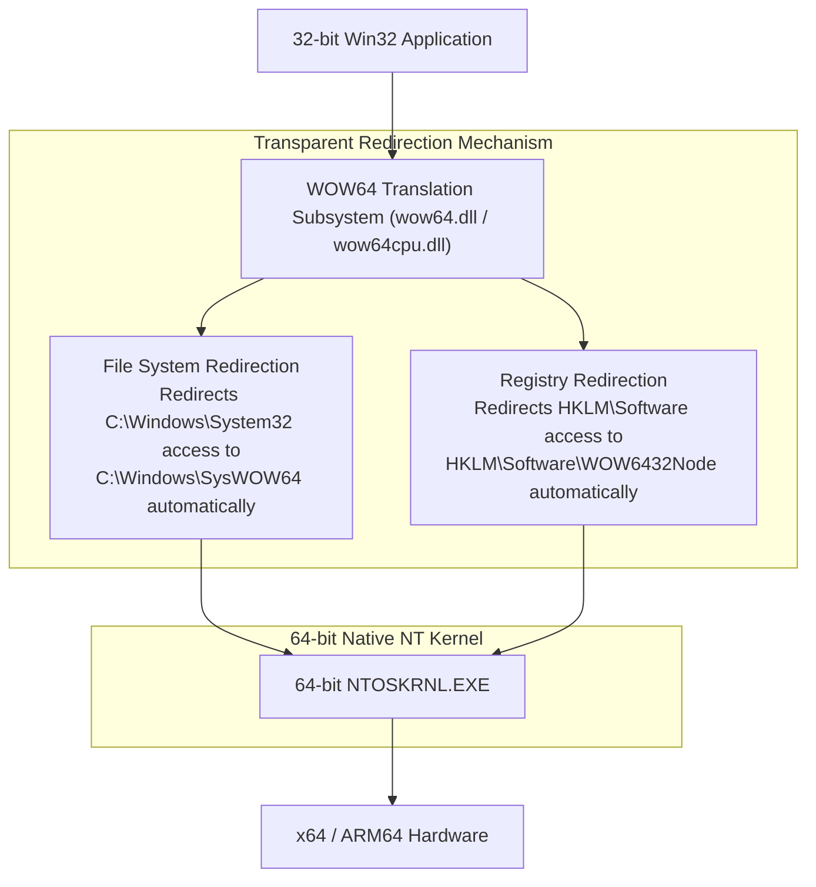

The core innovation of WOW64 is presenting 32-bit applications with a **bifurcated, parallel view of the file system and registry**:

- **File System Redirection**:
  On 64-bit Windows, native 64-bit system DLLs reside in `C:\Windows\System32`. When a 32-bit application accesses this path, WOW64 intercepts the request and silently routes it to `C:\Windows\SysWOW64` (which, contrary to intuition, houses 32-bit binaries).
- **Registry Redirection**:
  Similarly, write operations directed to `HKEY_LOCAL_MACHINE\Software` by a 32-bit program are transparently isolated in `HKEY_LOCAL_MACHINE\Software\WOW6432Node`.

Thanks to this dual-world architecture, a 32-bit application compiled in 1998 can read from and write to what it believes is `System32` without ever realizing it is executing within a 64-bit environment.

### 6.2 The Pivot to ARM64 and the Prism Binary Translator

Today, the newest computing frontier is the transition from x86/x64 to **ARM64 (such as Qualcomm Snapdragon X Elite)**.

In 2012, Microsoft launched "Windows RT," an ARM-based OS that severed compatibility with legacy Win32 applications—a strategy reminiscent of Apple's clean-slate transitions. The market rejected Windows RT violently, resulting in a nearly billion-dollar writedown. This painful failure reinforced a foundational lesson: an operating system that cannot run the existing Win32 software catalog is not Windows.

Windows 11 on ARM now features an advanced binary emulation engine called **Prism**. Prism analyzes x86 and x64 machine instructions on the fly, performing Just-In-Time (JIT) compilation into native ARM64 instructions while saving optimized code blocks into a persistent cache to deliver near-native performance.

Regardless of how radically underlying CPU instruction sets evolve, the promise remains inviolable: double-click an executable, and the application runs.

---

## Chapter 7: Three Divergent Philosophies — Windows vs Apple (macOS) vs Linux

When answering the question of how to treat legacy software, the world's three major operating system ecosystems have adopted starkly different philosophies. Examining these contrasts illuminates Windows' unique position.

### 7.1 Apple (Surgical Disruption): Scorched Earth for the Sake of Progress

From Steve Jobs to Tim Cook, Apple's design philosophy has embodied a **"Scorched Earth Policy"**—fearlessly discarding legacy systems to deliver an uncompromised future vision.

Apple's history is defined by recurring, surgical breaks with the past:
- **Abandonment of Classic Mac OS**: The forced migration from Mac OS 9 to Mac OS X (NeXT-based Unix). The transitional "Carbon" API was temporarily provided, then completely eradicated.
- **Hardware Architectural Migrations**: 680x0 → PowerPC → Intel x86 → Apple Silicon (M-series). During each transition, Apple provided emulation technologies (Mac 68K emulator, Rosetta, Rosetta 2), only to delete them from the OS after several years, terminating support for legacy binaries.
- **Elimination of 32-bit Support in macOS Catalina**: In 2019, Apple stripped all 32-bit execution capabilities from macOS Catalina, rendering older audio plugins, games, and creative tools instantly unrunnable.

Apple's posture is unambiguous: developers are expected to adopt the latest version of Xcode, modernize their codebases with Swift, and continuously recompile for the latest OS release. Binaries that fail to keep pace are pruned. This preserves a lean, modern codebase for macOS, but imposes a recurring maintenance burden on developers and users.

### 7.2 Linux (Linus's Commandment): The Light and Shadows of "Never break userspace!"

Linus Torvalds, the creator and maintainer of the Linux kernel, enforces an absolute directive that mirrors the Windows ethos: **"Never break userspace!"**

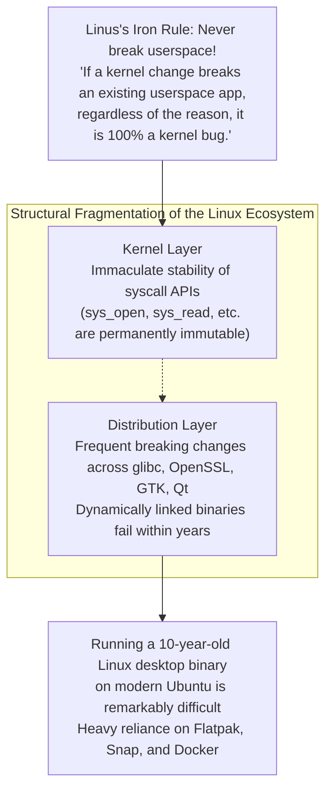

No matter how elegant an upstream kernel patch may be, if it induces a behavioral regression in an existing user-space program, Torvalds will promptly reject or revert it. At the kernel boundary, Linux's commitment to stability matches Windows.

On the Linux desktop, however, there is no single unifying authority. While the kernel system call ABI remains immutable, user-space shared libraries across distributions (`glibc`, `OpenSSL`, and GUI toolkits like GTK and Qt) break backward compatibility on a regular basis. As a result, **running a dynamically linked Linux desktop binary built ten years ago on a modern Ubuntu installation is exceptionally challenging**. Linux protects compatibility at the kernel level, but fragmentation in user space prevents it from achieving the seamless 30-year application continuity of Windows.

### 7.3 Windows (Cumulative Inclusion): The Audacity of Layering

In contrast to Apple's surgical cuts and Linux's fragmented layers, Windows chose **"Cumulative Inclusion."**

Windows never discards an older API or subsystem; it layers new abstractions directly on top of the old foundation. Win16 was subsumed by Win32; Win32 was augmented with the .NET Framework; WinRT and UWP were built atop that stack; and when UWP failed to supplant Win32, Microsoft returned to Win32 to construct the Windows App SDK (WinUI 3).

Consequently, Windows possesses one of the largest and most complex codebases on Earth, but in exchange, it provides an environment where **software from every historical era coexists and executes harmoniously**.

| Feature | Microsoft (Windows) | Apple (macOS) | Linux (Desktop) |
| :--- | :--- | :--- | :--- |
| **Core Philosophy** | **Cumulative Inclusion**<br/>Preserve all historical layers | **Surgical Disruption**<br/>Regularly prune legacy systems | **Kernel Stability and User-Space Flux**<br/>Stable kernel, fragmented user space |
| **Prime Directive** | "Don't break old apps" | "Embrace the modern platform" | "Never break userspace" (Kernel only) |
| **Compatibility Horizon** | **30+ years** (Win32 / DOS) | **3 to 5 years** (sunset after transition) | Decades for kernel, short-lived for GUI apps |
| **32-bit Binary Support** | **Full execution on Windows 11** (WOW64) | **Terminated in Catalina (2019)** | Supported via multi-arch libraries |
| **Expectation on Developers** | Binaries run indefinitely without intervention | Periodic rewrites and recompilations required | Frequent re-packaging across distributions |
| **Architectural Purity** | Layered, massive, hundreds of millions of lines | Clean, unified, modern | Modular, but fragmented across distros |

---

## Chapter 8: Platform Economics — Why Backward Compatibility Is the Ultimate "Moat"

Why did Bill Gates and successive generations of Microsoft leadership demand such extraordinary engineering acrobatics from their teams? The explanation lies not in engineering aesthetics, but in the cold realities of **platform economics and competitive strategy**.

### 8.1 Bill Gates's Business Model: An OS's Value Is the Sum of Running Software

From Microsoft's inception, Bill Gates recognized the foundational law of platform strategy:

> **The Platform Value Theorem**:
> An operating system's value is not determined by its internal features.
> It is determined by **the aggregate economic value of all applications that can run upon it**.

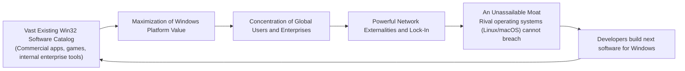

A platform vendor may create an operating system that is mathematically elegant, memory-efficient, and visually stunning, but if it cannot execute the tools users rely on to do their jobs, its market value is zero. Users do not buy an operating system for its own sake; they buy it to harness the utility of application software.

By guaranteeing unbroken backward compatibility, the trillions of dollars and billions of lines of code invested in Windows applications over three decades **automatically compound into the enterprise value of every future release of Windows**.

No matter how compelling rival platforms might appear, commercial negotiations evaporate the moment an enterprise realizes: *"Our twenty-year-old internal dispatch system will not run on your platform."* Backward compatibility forged an insurmountable economic moat that no competitor could cross.

### 8.2 The Ironclad Lock-In of the Enterprise Market

This dynamic proved devastatingly potent in enterprise and industrial sectors.

Global corporations, healthcare institutions, government agencies, and manufacturing facilities depend on mission-critical applications developed decades ago through massive capital expenditures. Many of these legacy tools—built in Visual Basic 6 or utilizing proprietary ActiveX controls—lack source code, documentation, or surviving vendors. They are functioning operational artifacts that cannot be replaced without immense business risk.

Had Windows broken compatibility and insisted that enterprises rebuild their custom software from scratch using modern web stacks, Chief Information Officers would have revolted, freezing upgrades or evaluating alternatives.

Instead, Windows arrived armed with the magic of AppCompat, assuring enterprises: *"Change nothing. Upgrade your hardware, and your software will continue to run."* No corporate proposal is more compelling than one that eliminates operational disruption. Through this promise, the global enterprise market became permanently tethered to the Windows ecosystem.

### 8.3 The "Success Trap" That Constrained Radical Innovation

Yet this extraordinary triumph eventually created a **Success Trap** that constrained Microsoft from within.

During the 2010s, as mobile computing surged with iOS and Android, Microsoft attempted to modernize Windows by introducing the **Universal Windows Platform (UWP)**—a secure, containerized, sandboxed application framework intended to phase out legacy Win32 software.

Enterprise customers and independent software developers overwhelmingly rejected UWP. Why rewrite sophisticated, unconstrained applications for a restricted sandbox when their existing Win32 binaries already ran with exceptional speed and reliability across Windows 10 and 11?

The very perfection of Win32 compatibility made it impossible for Microsoft to retire it. Ultimately, Microsoft pivoted: UWP was de-emphasized, Win32 applications were integrated directly into the Microsoft Store, and modern UI frameworks like WinUI 3 were re-architected on top of Win32. The supreme compatibility engine Microsoft built had become an unyielding barrier to its own architectural reinvention.

---

## Chapter 9: The Price of Glory — Ballooning Technical Debt and the Security Minefield

Shouldering the world's programming mistakes and carrying three decades of history forward did not come without immense costs. It saddles Windows engineers with the most challenging technical debt in modern software engineering.

### 9.1 Hundreds of Millions of Lines of Code and an Astronomical Test Matrix

The Windows source code is estimated to encompass **hundreds of millions of lines**. More daunting still is the unfathomable test matrix required to validate every new Windows build.

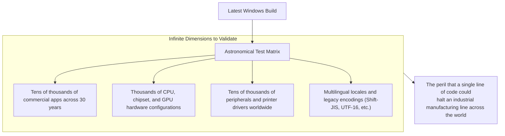

A minor modification to a core synchronization primitive or a pointer check in an executive subsystem risks deadlocking an industrial control application built thirty years ago that governs an active factory line. To mitigate this catastrophic risk, Microsoft maintains automated testing laboratories containing tens of thousands of physical machines and virtual environments, running automated test suites that launch decades of software to verify stability.

### 9.2 Security Vulnerabilities Spawned by Legacy APIs

The most acute risk of perpetual backward compatibility is **cybersecurity**.

Win32 APIs designed in the 1990s were conceived in an era before pervasive network connectivity, often lacking modern boundary checking and principle-of-least-privilege designs. Because removing these legacy interfaces would break business software, they must be preserved.

Malicious actors routinely target these legacy APIs and compatibility seams to achieve privilege escalation or escape security sandboxes. The engineering benevolence that keeps old applications functioning inadvertently enlarges the operating system's overall attack surface.

### 9.3 The Implosion of Project Longhorn and the "MinWin" Architectural Refactoring

This compounding technical debt culminated in a historic crisis during the early 2000s: the **Longhorn Project**.

Intended as the ambitious successor to Windows XP, Longhorn became entangled in an unmanageable web of circular dependencies, feature creep, and legacy code bloat. Daily builds broke consistently, development velocity plummeted, and the project collapsed under its own weight.

In 2004, Microsoft made the painful decision to hit the reset button. Engineers discarded years of experimental code, returned to the battle-tested Windows Server 2003 codebase, and initiated a rigorous architectural decoupling known as **MinWin** (which eventually shipped as Windows Vista and matured in Windows 7).

MinWin partitioned the fundamental NT kernel into a compact, self-contained core, establishing strict architectural boundaries between base kernel components and higher-level compatibility subsystems. Windows survives today because its engineers experienced this near-fatal collapse and rebuilt their architectural foundations.

---

## Conclusion: A Hymn to the Gritty Engineers — Modern Society Built Upon the Miracle of "It Just Works"

Modern civilization relies quietly on Windows. It powers office workstations, electronic medical record terminals in hospitals, automated teller machines, rail transport monitoring networks, and computerized numerical control machinery on factory floors.

Consider what would have transpired had Microsoft been an academic purist devoted strictly to textbook elegance, discarding legacy software every few years in the manner of consumer device makers.

Industrial assembly lines would have stalled, small businesses would have gone bankrupt facing relentless software redevelopment costs, and critical infrastructure would have descended into operational paralysis. The global digital economy advanced steadily over the past thirty years because Windows **bore the weight of every programmer's mistakes, misunderstandings, corner cases, and legacy code on its own shoulders**.

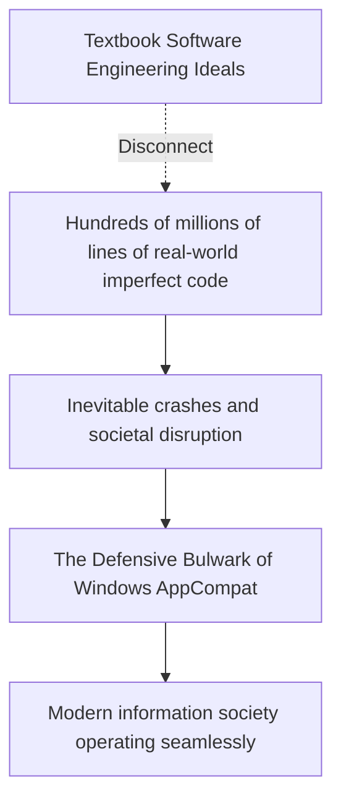

For Raymond Chen and generations of Windows engineers, spending nights reverse-engineering third-party binaries and writing shims to forgive outside bugs was never glamorous work. It yielded no prestigious academic accolades or Silicon Valley startup hype.

Yet it represents the pinnacle of **professional software engineering**.

True engineering is not about admiring elegant mathematical abstractions inside a sterile vacuum. It is about rolling up one's sleeves, confronting the messy complexities of the physical world, and ensuring that **what worked yesterday will work today, tomorrow, and decades into the future**.

"Never break old apps." It is upon this relentless, gritty prime directive—and the tireless dedication of the engineers who defended it—that our modern digital civilization quietly thrives.
