## Introducción: ¿Cuál es la esencia de un sistema operativo? —¿«Diseño elegante» o «pragmatismo visceral»?

Si uno abre un libro de texto universitario de ciencias de la computación o un tratado clásico sobre ingeniería de software, siempre encontrará ideales seductores: «abstracciones limpias», «separación de responsabilidades», «diseño ortogonal de APIs». Se nos enseña que un sistema operativo (SO) debe ser un árbitro sagrado e impoluto, cuyo propósito fundamental es ocultar la complejidad del hardware y ofrecer a las aplicaciones una interfaz homogénea, intuitiva y conceptualmente pura.

Sin embargo, en el instante en que uno abandona la torre de marfil académica y pisa el campo de batalla de los sistemas operativos comerciales para ordenadores de sobremesa, ese ideal virginal salta en mil pedazos. En la historia de la informática personal, el titán que alcanzó el mayor éxito comercial y llegó a dominar miles de millones de ordenadores en todo el planeta —Windows— encarnó una filosofía que se sitúa en las antípodas de la estética académica: **un pragmatismo descarnado llevado hasta los límites de la demencia**.

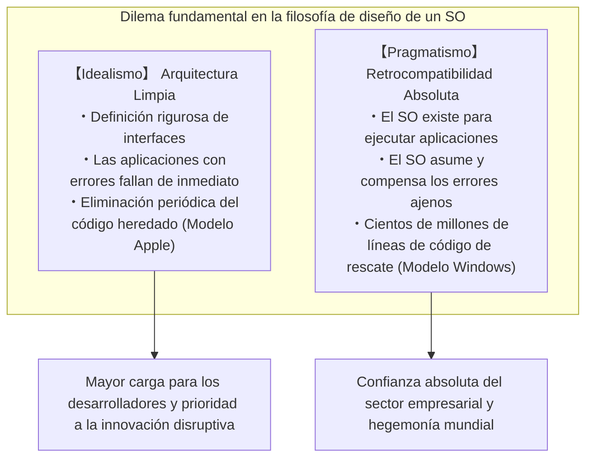

Entre todos los sistemas operativos existentes en el mundo, ninguno ha mantenido una obsesión tan visceral y desmedida por el legado del pasado como Windows. Juegos en CD-ROM lanzados en 1995, software de contabilidad empresarial programado a principios de los noventa en Visual Basic 3.0 o C++, utilidades que sobrevivieron a la era de MS-DOS hackeando comportamientos internos indocumentados... una asombrosa cantidad de ellos se inicia y se ejecuta hoy en día en pleno siglo XXI, sobre el modernísimo Windows 11, con absoluta naturalidad y sin inmutarse.

Para el gran público, esto se percibe como algo trivial: «el software simplemente funciona». Sin embargo, cualquier programador de sistemas que haya hecho ingeniería inversa del código interno de Windows y se haya asomado a sus abismos queda atónito y sobrecogido. Lo que yace allí no es magia, sino **estratos geológicos acumulados a lo largo de más de 30 años: cientos de miles de líneas de parches excepcionales, falsificaciones dinámicas de APIs y mecanismos mediante los cuales el propio sistema operativo miente a las aplicaciones (los denominados Shims)**, todo ello creado por los ingenieros de Microsoft para absorber errores ajenos, violaciones flagrantes de especificaciones, corrupciones de memoria y comportamientos indefinidos de desarrolladores externos.

¿Por qué Microsoft llegó a tales extremos para cargar sobre las espaldas del sistema operativo el código defectuoso escrito por terceros y mantenerlo a flote a cualquier precio?  
¿Por qué no adoptó el camino de Apple, consistente en amputar sin piedad el pasado en nombre de la modernidad?  
Y, sobre todo, ¿cómo convirtió esta ingeniería casi desquiciada a Windows en una fortaleza inexpugnable, en la plataforma más dominante de la historia de la tecnología?

Este ensayo es un documento técnico exhaustivo y definitivo que examina los testimonios de los programadores legendarios de Microsoft, los datos de ingeniería inversa de las entrañas de Windows, la estructura profunda del formato PE (Portable Executable) y el núcleo NT, así como la historia estratégica de las plataformas de TI, para desentrañar la directiva suprema que ha gobernado Windows desde sus orígenes: **«Nunca rompas las aplicaciones antiguas (Don't break old apps)»**.

---

## Capítulo 1: La «Directiva Primordial» contada por dos fuentes legendarias

La obsesión por la compatibilidad que definió al equipo de desarrollo de Windows no es una elucubración teórica ideada desde el exterior. Fue descrita con crudeza por dos figuras fundamentales que escribieron código en primera línea y moldearon la arquitectura misma del sistema.

### 1.1 Raymond Chen y *The Old New Thing*

En el equipo de desarrollo de Windows en Microsoft existe un hombre que ha sido considerado durante más de tres décadas como una auténtica leyenda viva. Se trata de **Raymond Chen**, ingeniero principal de software que ingresó en Microsoft en 1992 y que desde entonces ha participado en el desarrollo y mantenimiento del shell de Windows 95, User32 y los rincones más profundos del subsistema Win32.

Chen comenzó a publicar en un blog interno que más tarde se transformó en la columna técnica oficial de Microsoft titulada **«The Old New Thing»** (posteriormente recopilada en un libro fundamental que se convirtió en la biblia de los programadores de sistemas). Esta obra constituye un archivo histórico fascinante sobre las insólitas soluciones que Windows debió implementar para solventar problemas de compatibilidad en el mundo real.

El axioma básico del equipo de Windows, recordado una y otra vez por Chen, es de una frialdad y sencillez implacables:

> «Un sistema operativo como Windows existe con el único propósito de ejecutar programas. Los usuarios no compran un PC para contemplar la belleza del sistema operativo. Compran un PC porque necesitan utilizar aplicaciones concretas que corren sobre él.
> 
> Y la realidad más cruel es la siguiente: **cuando un usuario actualiza a una nueva versión de Windows y su aplicación favorita deja de funcionar, jamás culpa a los desarrolladores de dicha aplicación. Culpa al 100% a Microsoft, exclamando: "¡Windows se ha roto!" o "¡La nueva versión de Windows es defectuosa!"**»

Desde el orgullo de un ingeniero de software puro, la reacción instintiva sería afirmar: «Si la aplicación tiene un error en su código, es lógico que falle; la empresa responsable de la aplicación debería publicar un parche correctivo». Pero en el mercado comercial de sistemas operativos, ese argumento carece de validez práctica. Para el usuario final, la única realidad tangible es que el programa que funcionaba perfectamente ayer dejó de funcionar en el momento en que se actualizó Windows.

Si Microsoft respondiera con una postura purista diciendo «ese fallo es responsabilidad de la empresa de software», los usuarios rechazarían la actualización, se atrincherarían en la versión antigua del sistema operativo o considerarían migrar a una plataforma competidora. Por consiguiente, como una necesidad inexorable de negocio, se impuso sobre el equipo de Windows una exigencia colosal:

**«No importa cuán descabellado, contrario a los estándares o defectuoso sea el código de una aplicación: el sistema operativo debe ser capaz de detectarlo, compensarlo internamente entre bastidores y hacer que funcione como si nada hubiera ocurrido.»**

El blog de Raymond Chen está repleto de testimonios minuciosos sobre los incontables hacks, tan ingeniosos como desgarradores, que él y sus colegas tuvieron que programar para cumplir con este mandato.

### 1.2 La denuncia de Joel Spolsky: *How Microsoft Lost the API War*

Quien divulgó con mayor impacto esta filosofía ante la comunidad global de ingenieros web y líderes de la industria tecnológica fue **Joel Spolsky**. A principios de los años noventa, Spolsky fue gestor de programas en Microsoft para el equipo de Excel, y años más tarde se consagraría como uno de los ensayistas tecnológicos más influyentes del mundo, cofundando plataformas como Stack Overflow y Trello.

En 2004, Spolsky publicó en su sitio web un célebre ensayo histórico titulado *How Microsoft Lost the API War* («Cómo Microsoft perdió la guerra de las APIs»). En él, rememorando el férreo liderazgo ejercido por figuras como Jon DeVaan al frente del equipo de Windows, escribió:

> "In the Windows team, the prime directive was: **don't break old apps.**"  
> (En el equipo de Windows, la directiva suprema —la prime directive— era: **no rompas las aplicaciones antiguas**).

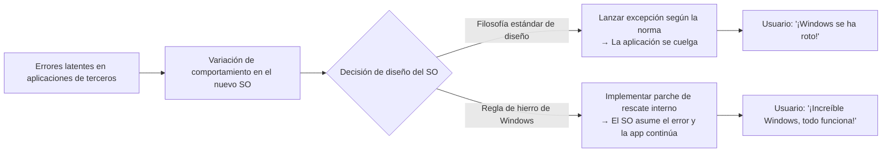

Spolsky explicaba que, del mismo modo que en la serie de ciencia ficción *Star Trek* la regla máxima de la Flota Estelar es la «Primera Directiva» (la no interferencia en el desarrollo natural de civilizaciones alienígenas), para los programadores de Windows la directiva primordial e inquebrantable era no romper jamás el funcionamiento de las aplicaciones existentes.

Si un ingeniero de Windows optimizaba de forma impecable el código del núcleo o de una API, duplicando su velocidad de ejecución, pero dicho cambio provocaba el fallo de un oscuro programa de contabilidad utilizado en alguna empresa del mundo, la optimización era rechazada de inmediato. En el equipo de Windows, la belleza del código y la pureza arquitectónica eran consideraciones secundarias; **la garantía de que los binarios existentes siguieran funcionando al 100% constituía el bien supremo y absoluto**.

### 1.3 «Incluso los errores se convierten en especificaciones»: La Ley de Hyrum y la irreversibilidad de las APIs

En la ingeniería de software existe una célebre regla empírica formulada por Hyrum Wright, ingeniero de software en Google, conocida como la **Ley de Hyrum**:

> **Ley de Hyrum**:  
> «Cuando una API tiene un número suficiente de usuarios, carece de importancia lo que el creador de la API haya estipulado en el contrato formal (la documentación). Cualquier comportamiento observable del sistema —incluyendo errores y efectos secundarios indocumentados— terminará siendo asumido como una dependencia por el código de alguien.»

Windows ha sido el banco de pruebas más gigantesco y severo del planeta en corroborar la Ley de Hyrum.

Imaginemos, por ejemplo, que la documentación oficial de una API de Windows especifica taxativamente: *«El tercer argumento debe ser un manejador de ventana (HWND) válido. El comportamiento ante un valor inválido es indefinido»*. Sin embargo, un programador descuidado pasa por error un puntero nulo (`NULL`) o corrupto en dicho parámetro, y resulta que en la implementación concreta de Windows 3.1 el sistema operativo, por pura casualidad, pasaba por alto el error sin generar una excepción visible.

Años después, cuando esa aplicación ya ha distribuido decenas de miles de copias en el mercado, el equipo de desarrollo de Windows 95 o Windows NT decide sanear la implementación: «Vamos a validar estrictamente los argumentos y devolver `ERROR_INVALID_WINDOW_HANDLE` si se recibe un identificador no válido». ¿Qué sucede en ese instante?

En decenas de miles de oficinas, esa aplicación heredada lanza un cuadro de diálogo de error crítico y se cierra inesperadamente. Los usuarios enfurecidos colapsan las líneas de soporte técnico de Microsoft gritando: «¡He actualizado Windows y ya no puedo trabajar!».

Ante este escenario, los ingenieros de Microsoft no tenían más remedio que retirar su código canónico y escribir soluciones insólitas y pragmáticas como la siguiente:

```c
// Recreación conceptual del comportamiento interno de una API de Windows
BOOL WINAPI DoSomething(HWND hWnd, UINT uMsg, WPARAM wParam, LPARAM lParam)
{
    // Validación canónica de libro de texto
    if (!IsWindow(hWnd)) {
        // En un mundo ideal, aquí se debería devolver un error de inmediato:
        // SetLastError(ERROR_INVALID_WINDOW_HANDLE);
        // return FALSE;

        // 【HACK DE COMPATIBILIDAD】
        // La célebre aplicación comercial 'AppX' pasa un manejador NULL durante su inicialización.
        // Si devolvemos un error aquí, AppX se cierra abruptamente.
        // Por ello, detectamos si el proceso es AppX y sustituimos silenciosamente el identificador
        // por el manejador de la ventana del escritorio (Desktop Window).
        if (IsTargetBadApplication("AppX.exe")) {
            hWnd = GetDesktopWindow();
        } else {
            SetLastError(ERROR_INVALID_WINDOW_HANDLE);
            return FALSE;
        }
    }

    // Continuar con el procesamiento real de la API...
    return InternalDoSomething(hWnd, uMsg, wParam, lParam);
}
```

En el momento en que un sistema operativo se difunde masivamente y se convierte en el estándar de facto del mercado, la especificación de una API deja de ser el texto impreso en la documentación técnica; pasa a ser **la totalidad de comportamientos observables que exhibió la implementación original, incluyendo todos y cada uno de sus errores y peculiaridades accidentales**. El equipo de Windows asumió esta maldición con total determinación, aceptando cargar de por vida con los fallos de software ajenos como si fuesen especificaciones inmutables del propio sistema operativo.

---

## Capítulo 2: El inicio de la leyenda — La verdad técnica tras el «Incidente de SimCity»

Si existe un episodio en la historia de la computación que personifique de forma paradigmática la demencial devoción del equipo de Windows por la retrocompatibilidad, es el recordado **«Incidente de SimCity»**, acontecido en 1995 durante las fases culminantes del desarrollo de Windows 95.

### 2.1 La física del Use-After-Free (acceso a memoria tras su liberación)

En 1989, la compañía Maxis, fundada por Will Wright, lanzó al mercado el simulador de gestión urbana *SimCity*. El título se convirtió de inmediato en un clásico indiscutible y en un fenómeno comercial arrollador. Para millones de usuarios domésticos y ejecutivos corporativos que aprovechaban los descansos laborales para supervisar sus urbes virtuales, la posibilidad de ejecutar SimCity sin contratiempos en su ordenador personal era una cuestión de máxima relevancia.

Sin embargo, el binario comercial de *SimCity* para MS-DOS y Windows 3.1 contenía un error de programación gravísimo que, bajo los estándares modernos de auditoría de seguridad, habría sido catalogado de inmediato como una vulnerabilidad crítica: un **Use-After-Free (UAF)**, es decir, el acceso ilegítimo a bloques de memoria previamente liberados.

En su rutina de simulación y renderizado gráfico, *SimCity* solicitaba periódicamente bloques de memoria al asignador del montón (heap allocator) del sistema y, tras utilizarlos, los liberaba formalmente mediante llamadas a funciones como `free` o `GlobalFree`. No obstante, los punteros internos de la aplicación no eran limpiados tras la liberación, de modo que el programa continuaba **leyendo y escribiendo con total impunidad en regiones de memoria que ya habían sido devueltas formalmente al sistema operativo**.

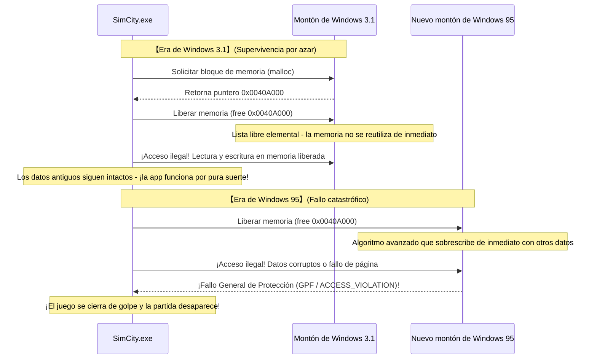

En el entorno de 16 bits de Windows 3.1, la gestión de memoria era extraordinariamente rudimentaria. Cuando un programa liberaba un bloque de memoria, la estructura básica de la lista de bloques libres hacía improbable que esa misma porción de memoria fuera reasignada de inmediato a otro proceso o sobrescrita en el acto. En consecuencia, aunque el código de *SimCity* estaba objetivamente corrompido, **continuaba funcionando por pura coincidencia gracias a la ingenuidad del gestor de memoria de Windows 3.1**.

### 2.2 Ingeniería de software convencional vs la demencia del equipo de Windows

En 1995 hizo su aparición Windows 95, el sistema operativo de 32 bits llamado a revolucionar por completo la informática personal.

Windows 95 incorporaba multitarea apropiativa real, un sofisticado gestor de memoria virtual y un asignador de memoria en el montón de alto rendimiento, diseñado para mitigar la fragmentación y maximizar la eficiencia del subsistema de caché. Este asignador moderno operaba bajo una premisa elemental de optimización: en cuanto una aplicación liberaba memoria, el bloque quedaba disponible para ser **inmediatamente reutilizado, reorganizado o sobrescrito con estructuras internas o datos de otros procesos**.

Cuando los probadores ejecutaron *SimCity* sobre este nuevo gestor de memoria, el resultado fue devastador:  
SimCity intentaba acceder a la memoria que acababa de liberar y se topaba con datos ajenos pertenecientes a otro hilo o con una página de memoria invalidada. Al instante estallaba en pantalla el temido cuadro de diálogo de **«Fallo General de Protección (General Protection Fault: GPF)»**, cerrando el juego fulminantemente y vaporizando en milisegundos las megalópolis que los usuarios habían construido durante decenas de horas.

Ante esta situación, ¿cuál habría sido la resolución adoptada bajo los cánones ortodoxos de la ingeniería de software o por cualquier otro fabricante de sistemas operativos?

La respuesta es obvia: «Este es un error imputable en un 100% a la programación deficiente de Maxis. La gestión de memoria del nuevo sistema operativo cumple de forma intachable con las especificaciones. Lo correcto es notificar el fallo a Maxis y esperar a que distribuyan un disco con la actualización correctiva (SimCity 1.01)». Esa era la postura técnicamente irreprochable.

Sin embargo, para la cúpula directiva de Microsoft y para el equipo de Windows 95 —cuyo lanzamiento no podía permitirse la más mínima sombra de duda o fricción—, la decisión fue insólita:

**«SimCity no puede fallar bajo ningún concepto. No hay tiempo para esperar a que una empresa externa publique un parche. Modificad el gestor de memoria del propio núcleo de Windows 95 para que reconozca a SimCity y garantice su funcionamiento.»**

### 2.3 Detalles del hack dedicado a SimCity en el asignador de memoria

En su célebre ensayo ya citado, Joel Spolsky rememoró aquel hito técnico con las siguientes palabras:

> «Durante las pruebas beta de Windows 95, descubrieron que SimCity no funcionaba adecuadamente. ¿Qué hizo Microsoft?  
> No intentaron presionar a los creadores de SimCity para que lo corrigieran. El responsable del gestor de memoria de Windows 95 añadió un bloque de código específico: **"Si el programa que se está ejecutando es SimCity, no reasignes inmediatamente la memoria que acaba de liberar; mantenla intacta durante un tiempo razonable"**».

En términos de arquitectura de software contemporánea, la esencia de este hack representó un antecedente pionero de lo que hoy denominamos «montón en cuarentena (Quarantine Heap)» o «liberación retardada (Delayed Free)».

Al inicializarse un proceso, el asignador del montón de Windows 95 cotejaba el nombre del ejecutable (`SIMCITY.EXE`) y ciertos atributos de sus cabeceras. Si se verificaba que se trataba de SimCity, el gestor conmutaba su lógica de asignación a un modo especial de contingencia. En condiciones normales, un bloque liberado se fusionaba inmediatamente con bloques contiguos (coalescing) y se reintegraba al grupo de memoria disponible. Bajo la ejecución de SimCity, en cambio, los punteros liberados se colocaban temporalmente en una estructura de amortiguación circular (ring buffer), evitando que sus datos fueran alterados o reutilizados durante un número suficiente de ciclos.

Gracias a este sacrificio de pureza arquitectónica en el seno del sistema operativo, el día del lanzamiento mundial de Windows 95 millones de personas pudieron insertar sus disquetes de *SimCity* y continuar gestionando sus ciudades sin experimentar una sola anomalía ni un solo mensaje de error.

Los usuarios aclamaban unánimes: «¡Windows 95 es prodigioso! ¡Todo el software antiguo sigue funcionando a la perfección!». Y entretanto, ninguno de ellos sospechó jamás que en lo más íntimo del flamante núcleo de 32 bits latía un fragmento de código sacrificado por los ingenieros de Microsoft para subsanar un error de memoria cometido seis años atrás por una empresa externa.


---

## Capítulo 3: La genealogía de los «hacks viscerales de compatibilidad» que marcaron la historia

El rescate de SimCity no fue un hecho aislado; apenas representó la punta del iceberg. Los más de treinta años de historia que han forjado el Windows actual constituyen una sucesión ininterrumpida de intervenciones de compatibilidad extraordinarias, diseñadas para prolongar indefinidamente la vida útil de infinidad de programas rebeldes e imperfectos.

### 3.1 Lotus 1-2-3 y el «error del año bisiesto de 1900» en Excel

En el ámbito del cálculo cronológico y calendárico por ordenador existe un error universalmente conocido que, a día de hoy, continúa latiendo en miles de millones de ordenadores sin haber sido jamás corregido: **la consideración del año 1900 como año bisiesto**.

En el calendario gregoriano, las reglas astronómicas y matemáticas para determinar los años bisiestos son de una precisión matemática absoluta:
1. Todo año divisible por 4 es bisiesto.
2. Sin embargo, todo año divisible por 100 es común (no bisiesto).
3. Con la excepción de que todo año divisible por 400 vuelve a ser bisiesto.

Por consiguiente, dado que el año 1900 es divisible por 100 pero no por 400, **es inequívocamente un año común; el día 29 de febrero de 1900 jamás existió**.

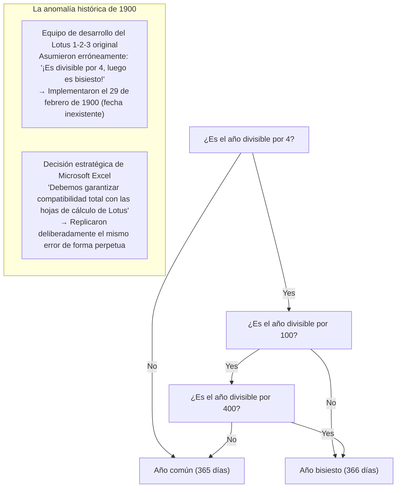

Sin embargo, a comienzos de los años ochenta, los desarrolladores de *Lotus 1-2-3* —la indiscutible hoja de cálculo reina que dominaba de forma hegemónica el mercado de MS-DOS— pasaron por alto la regla centenaria y programaron el año 1900 como bisiesto. A consecuencia de ello, Lotus 1-2-3 reconoció internamente la fecha ficticia del 29 de febrero de 1900, desplazando en un día el valor ordinal de las fechas subsiguientes.

Cuando el equipo de Microsoft emprendió el desarrollo de *Excel* para competir en el floreciente mercado ofimático, se topó con un dilema crítico: ¿debían implementar un cómputo cronológico matemáticamente impoluto, o debían priorizar la coherencia numérica con las decenas de millones de hojas de cálculo de Lotus 1-2-3 que gestionaban la contabilidad de las corporaciones más influyentes del planeta?

La respuesta dictada por Bill Gates fue rotunda: en aras de posibilitar una migración transparente y sin fricciones desde Lotus 1-2-3, **Excel incorporó de manera deliberada y exacta el mismo error, admitiendo formalmente la existencia del 29 de febrero de 1900**.

Si hoy mismo abre Microsoft 365 Excel en su equipo de última generación e introduce la fórmula `=FECHA(1900, 2, 29)`, comprobará con asombro que, lejos de arrojar un error de argumento, la aplicación devuelve imperturbable la fecha ficticia «29/02/1900». Una vez tomada la decisión de cargar con los errores de terceros en pos de la adopción masiva, esa hipoteca histórica deviene irrevocable a través de las décadas e incluso de los siglos.

### 3.2 ¿Por qué se omitió «Windows 9»?

En otoño de 2014, Microsoft convocó a los medios para desvelar el sucesor de Windows 8.1. La industria entera aguardaba con certeza la presentación de «Windows 9». No obstante, para desconcierto global, los ejecutivos sobre el estrado proclamaron el lanzamiento de **«Windows 10»**.

¿Por qué se descartó el número 9? Más allá de los comunicados de mercadotecnia que aludían a la necesidad de simbolizar un salto cuántico generacional, ingenieros retirados de Microsoft y analistas de ingeniería inversa de la comunidad destaparon un motivo técnico infinitamente más prosaico y tangible: un auténtico campo de minas de compatibilidad heredada.

En incontables programas comerciales, instaladores legados y librerías de entornos como Java distribuidos por todo el planeta, los programadores solían comprobar la versión del sistema operativo en el que se estaban ejecutando mediante atajos de código tan descuidados como el siguiente:

```java
// Patrón de código sumamente extendido en software empresarial heredado
String osName = System.getProperty("os.name");

if (osName.startsWith("Windows 9")) {
    // ¡Se asume erróneamente que se trata de Windows 95 o Windows 98!
    // Se activan rutas de compatibilidad de 16 bits y claves de registro obsoletas de la rama Win9x
    enableLegacyWin9xMode();
} else {
    // Rutas modernas optimizadas para sistemas NT (Windows NT, 2000, XP, 7, 8, etc.)
    enableModernNTMode();
}
```

Aquellos desarrolladores habían empleado `startsWith("Windows 9")` como un mecanismo rápido y perezoso para englobar conjuntamente a Windows 95 y Windows 98.

Si Microsoft hubiese bautizado formalmente a su nuevo sistema operativo como «Windows 9», miles de programas corporativos y herramientas críticas habrían diagnosticado erróneamente que se hallaban ante un entorno arcaico de la familia Win9x de 1995. Como consecuencia inmediata, habrían desactivado las APIs contemporáneas del núcleo NT para intentar ejecutar rutinas obsoletas de la época de DOS, colapsando instantáneamente.

El temor reverencial a que una simple decisión de nomenclatura desatara el caos en el ecosistema mundial de software determinó que el número 9 fuese desterrado para siempre de la cronología de Windows.

### 3.3 APIs indocumentadas (Undocumented APIs) y Norton Utilities

A lo largo de la década de 1990, el paquete de diagnóstico y optimización *Norton Utilities*, desarrollado por Symantec, era un componente imprescindible en los ordenadores de millones de usuarios. Para los ingenieros del sistema operativo, en cambio, representaba una pesadilla constante: el arquetipo definitivo de software indisciplinado.

El motivo radicaba en que las utilidades de bajo nivel como las de Norton desdeñaban con frecuencia el catálogo oficial de APIs documentadas de Win32, optando deliberadamente por **manipular estructuras de datos internas indocumentadas, invocar funciones privadas y acceder directamente a direcciones de memoria concretas dentro de las DLL del sistema**.

Raymond Chen relató en diversas ocasiones las batallas titánicas libradas durante la creación de Windows 95 contra Norton Utilities. Si una actualización en los mecanismos internos de protección de memoria o en la tabla de control de procesos desplazaba las variables indocumentadas apenas un solo byte respecto a versiones previas, Norton provocaba de inmediato un pantallazo azul (BSoD) fulminante que congelaba el equipo.

La respuesta de Microsoft no fue emprender una cruzada pública contra Symantec ni desentenderse del problema. Por el contrario, los ingenieros de Microsoft desensamblaron minuciosamente los ejecutables de Norton Utilities mediante ingeniería inversa, identificaron las direcciones exactas y los desplazamientos (offsets) de memoria a los que accedían sus rutinas, e **incorporaron en el núcleo del sistema operativo estructuras de datos señuelo (dummy) exactamente en las mismas posiciones de memoria esperadas**, con el único propósito de satisfacer las expectativas ilegítimas de Norton y evitar el colapso del sistema.

### 3.4 El día en que Bill Gates empuñó una escopeta: DOOM y la génesis de DirectX / WinG

En vísperas del advenimiento de Windows 95, la posición de Windows en la industria del videojuego para PC era marginal y desalentadora. Los desarrolladores de juegos desdeñaban Windows, calificándolo de plataforma ofimática pesada, lenta y lastrada por la sobrecarga estructural de su interfaz gráfica (GDI). Todos los videojuegos punteros de la época se programaban exclusivamente para MS-DOS, accediendo de forma directa y sin intermediarios a los puertos de entrada/salida (I/O) de las tarjetas de vídeo y de sonido (como las Sound Blaster).

El estandarte indiscutible de aquella era era *DOOM*, la revolucionaria obra maestra de id Software. DOOM se había propagado de manera tan masiva por los ordenadores de los entornos de trabajo que se convirtió en un fenómeno social al que se acusaba de reducir la productividad empresarial en los Estados Unidos.

Bill Gates comprendió con perspicacia la gravedad del dilema: «Si los usuarios se ven forzados a reiniciar sus ordenadores en modo MS-DOS cada vez que desean jugar, Windows 95 jamás alcanzará la hegemonía total. Debemos lograr que DOOM se ejecute sobre Windows 95, y que lo haga con mayor fluidez y velocidad que bajo DOS».

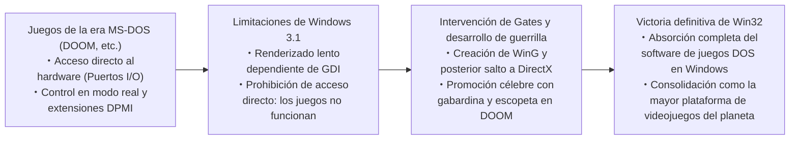

Gates movilizó a un selecto grupo de ingenieros con la instrucción de desarrollar contrarreloj bibliotecas gráficas capaces de emular y acelerar sobre Windows el acceso salvaje al hardware característico de DOS: así nacieron la biblioteca intermedia «WinG» y, posteriormente, «DirectX» (bautizada originariamente en clave interna como *Manhattan Project*).

El propio Gates protagonizó un vídeo promocional legendario en el que aparecía ataviado con una gabardina negra y portando una escopeta dentro del escenario digital de DOOM, proclamando ante el sector que Windows 95 sería la plataforma lúdica por excelencia. La pericia adquirida al domesticar e integrar aquel software intrusivo bajo la protección de memoria de Windows sentó los cimientos de la indiscutible hegemonía gráfica y multimedia que Windows ostenta hasta el presente.

---

## Capítulo 4: El colosal bastión de la Windows moderna: «AppCompat (Application Compatibility)»

Durante la era de Windows 95 y 98, las excepciones y parches de compatibilidad estaban dispersos de manera empírica e individualizada por todo el código fuente del sistema. No obstante, al sobrevenir la explosión masiva del software comercial con la llegada de Windows 2000 y Windows XP, dicho esquema artesanal devino insostenible: el núcleo del sistema amenazaba con tornarse ingobernable debido a la proliferación incesante de bifurcaciones condicionales destinadas a salvar programas específicos.

Ante este reto, los arquitectos de sistemas de Microsoft concibieron una infraestructura formal que perdura hasta el actual Windows 11: **el subsistema de compatibilidad de aplicaciones, conocido universalmente como «AppCompat»**.

### 4.1 Estructura global del subsistema AppCompat

El subsistema AppCompat puede definirse en esencia como **un mecanismo de intercepción sumamente inteligente que, en el instante preciso en que un binario es cargado en la memoria de un proceso, identifica su identidad y entreteje dinámicamente entre la aplicación y el núcleo del sistema operativo una capa transparente de enmascaramiento y suplantación denominada «Shim»**.

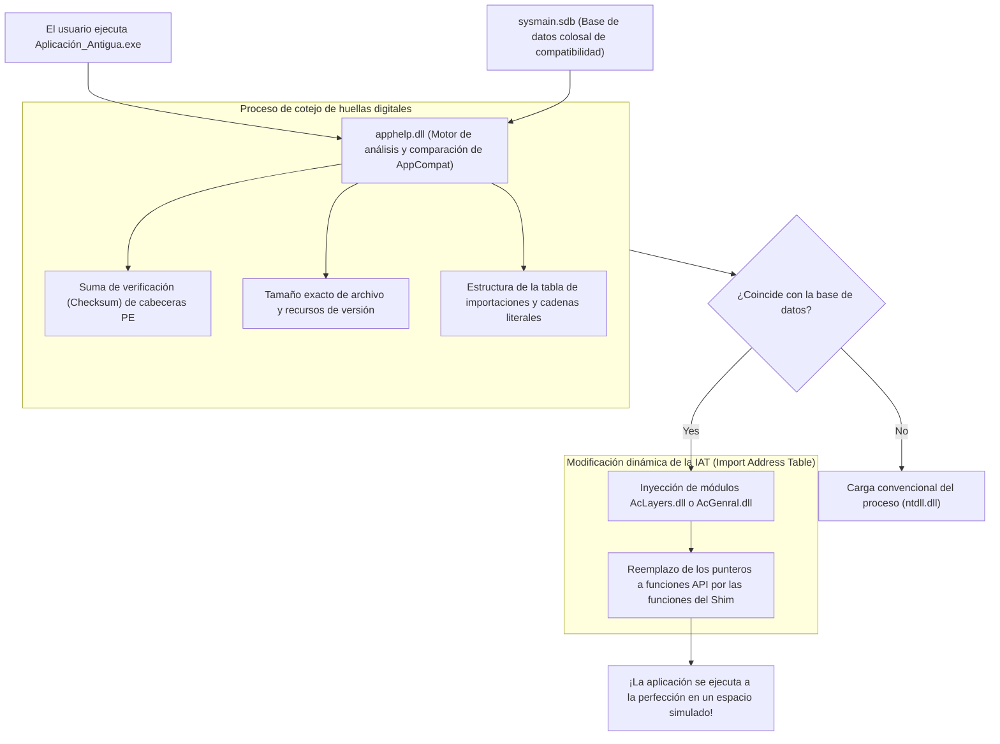

Cuando un usuario hace doble clic sobre un ejecutable (`.exe`), la rutina de creación de procesos de Windows (controlada por `ntdll.dll`) pospone la inicialización habitual y efectúa una llamada preliminar a la biblioteca **`apphelp.dll`**.

`apphelp.dll` consulta minuciosamente la gigantesca base de datos de compatibilidad **`sysmain.sdb`** para verificar si el archivo entrante coincide con algún perfil previamente catalogado que requiera medidas de auxilio técnico. En caso afirmativo, el cargador del sistema operativo inyecta forzosamente en el espacio de memoria virtual del proceso las bibliotecas del motor de compatibilidad —primordialmente **`AcLayers.dll`** y **`AcGenral.dll`**— antes de que las librerías oficiales del sistema (`kernel32.dll`, `user32.dll`, etc.) concluyan su enlace.

### 4.2 El motor de Shims: Mecanismo de sustitución de APIs mediante IAT Hooking

¿De qué manera engaña este motor a una aplicación sin necesidad de modificar un solo byte de su código original en el disco? La técnica predilecta consiste en la **interceptación o manipulación de la Tabla de Direcciones de Importación (IAT Hooking)** en las cabeceras PE (Portable Executable) del binario.

Cuando un ejecutable de Windows invoca una función situada en una biblioteca dinámica externa (por ejemplo, `GetVersionEx` o `GetDiskFreeSpace`), el código de máquina generado por el compilador no contiene direcciones fijas de memoria. Por el contrario, el cargador de Windows examina durante el inicio las DLL requeridas y rellena un arreglo de punteros a funciones ubicado dentro de la sección de datos del ejecutable: la IAT (Import Address Table). Todas las llamadas a las APIs del sistema se realizan de manera indirecta consultando esta tabla.

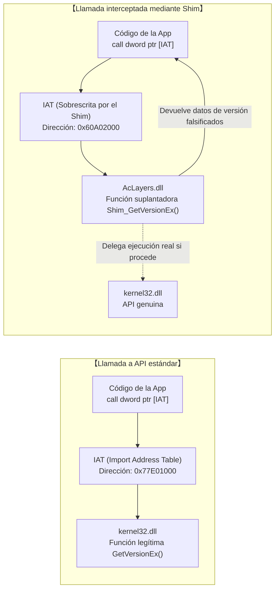

El motor de Shims explota esta arquitectura a su favor. Apenas inyectado en el proceso, recorre la IAT de la aplicación objetivo, altera temporalmente los atributos de protección de memoria mediante `VirtualProtect` para otorgar permisos de escritura (`PAGE_READWRITE`), y **sobrescribe los punteros que apuntaban a las funciones legítimas del sistema, sustituyéndolos por las direcciones de las rutinas de emulación (Shim functions)**.

A continuación se ilustra este mecanismo mediante un pseudocódigo conceptual en C/C++:

```c
// Prueba de concepto simplificada de inyección de Shim mediante IAT Hooking
#include <windows.h>
#include <imagehlp.h>

// Función falsa de GetVersionEx (el Shim propiamente dicho)
BOOL WINAPI Shim_GetVersionExA(LPOSVERSIONINFOA lpVersionInformation)
{
    // Obtener la dirección original de la API auténtica en kernel32.dll
    typedef BOOL (WINAPI *PFN_GETVER)(LPOSVERSIONINFOA);
    HMODULE hKernel = GetModuleHandleA("kernel32.dll");
    PFN_GETVER pfnRealGetVer = (PFN_GETVER)GetProcAddress(hKernel, "GetVersionExA");
    
    // Ejecutar la llamada legítima para poblar la estructura básica
    BOOL bResult = pfnRealGetVer(lpVersionInformation);
    
    // 【LABOR DE ENGAÑO】
    // Mentir deliberadamente al programa informándole que se ejecuta sobre Windows 95 (Major: 4, Minor: 0)
    lpVersionInformation->dwMajorVersion = 4;
    lpVersionInformation->dwMinorVersion = 0;
    lpVersionInformation->dwBuildNumber = 950;
    lpVersionInformation->dwPlatformId = VER_PLATFORM_WIN32_WINDOWS;
    strcpy(lpVersionInformation->szCSDVersion, "");

    return TRUE; // La aplicación queda satisfecha creyendo que corre bajo Windows 95
}

// Rutina de escaneo e intercepción de la IAT en el ejecutable principal
void InstallShimHook(HMODULE hAppModule, LPCSTR targetDll, LPCSTR targetFunc, PVOID newFuncAddress)
{
    ULONG size;
    // Localizar el descriptor del directorio de importaciones en la cabecera PE
    PIMAGE_IMPORT_DESCRIPTOR pImportDesc = (PIMAGE_IMPORT_DESCRIPTOR)
        ImageDirectoryEntryToData(hAppModule, TRUE, IMAGE_DIRECTORY_ENTRY_IMPORT, &size);

    while (pImportDesc->Name) {
        LPCSTR dllName = (LPCSTR)((PBYTE)hAppModule + pImportDesc->Name);
        if (_stricmp(dllName, targetDll) == 0) {
            // Localizar la tabla de punteros (Thunk Table) correspondiente a la DLL objetivo
            PIMAGE_THUNK_DATA pThunk = (PIMAGE_THUNK_DATA)((PBYTE)hAppModule + pImportDesc->FirstThunk);
            while (pThunk->u1.Function) {
                PROC* ppfn = (PROC*)&pThunk->u1.Function;
                // Si coincide con la función objetivo, sobrescribir el puntero en memoria
                DWORD oldProtect;
                VirtualProtect(ppfn, sizeof(PROC), PAGE_READWRITE, &oldProtect);
                *ppfn = (PROC)newFuncAddress; // ¡Sustitución por la dirección del Shim!
                VirtualProtect(ppfn, sizeof(PROC), oldProtect, &oldProtect);
                break;
            }
        }
        pImportDesc++;
    }
}
```

Gracias a este sofisticado mecanismo de suplantación en memoria, el binario almacenado en disco permanece inmaculado, el código fuente del núcleo de Windows se mantiene aislado de excepciones ad-hoc y, al mismo tiempo, el software desactualizado es envuelto en un microentorno virtual que simula con absoluta fidelidad las condiciones exactas de los sistemas operativos del pasado.

### 4.3 El enigmático binario colosal `sysmain.sdb` (Shim Database)

El corazón de este ecosistema de compatibilidad es el archivo binario **`sysmain.sdb`**, emplazado discretamente en el directorio del sistema `C:\Windows\AppPatch\`.

Estructurado en un formato binario propietario de Microsoft (SDB), este archivo atesora **cientos de miles de recetas de compatibilidad para prácticamente cualquier software comercial, suite ofimática, juego o aplicación corporativa relevante distribuida a lo largo de las últimas cuatro décadas**.

Para evitar aplicar Shims a ejecutables modernos que casualmente compartan nombres genéricos (como `setup.exe` o `install.exe`), el motor de `apphelp.dll` realiza una rigurosa identificación multidimensional basada en un conjunto exhaustivo de «huellas digitales»:

1. **Nombre de archivo y ruta canónica de instalación**
2. **Tamaño del archivo binario medido al byte exacto**
3. **Marca de tiempo del enlazador en la cabecera PE (Linker Timestamp)**
4. **Suma de comprobación del ejecutable (PE CheckSum)**
5. **Metadatos de la tabla de recursos de versión (CompanyName, ProductName, FileVersion, LegalCopyright, etc.)**
6. **Hashes de secciones de código específicas y configuración de la tabla de exportaciones**

Si un usuario introduce en una flamante máquina con Windows 11 el CD-ROM de una enciclopedia interactiva editada en 2001, `apphelp.dll` analiza instantáneamente su firma binaria, consulta su registro en `sysmain.sdb` y dictamina de inmediato:  
*«Este software fue diseñado para Windows 2000; requiere alineación laxa en la memoria del montón y pretende escribir directamente en claves protegidas del registro»*.  
Acto seguido, el sistema activa de forma transparente y simultánea una veintena de Shims específicos, garantizando una ejecución impecable sin requerir la más mínima intervención del usuario.


---

## Capítulo 5: Catálogo de Shims representativos (El arte de engañar para salvar)

El repertorio de Shims implementados en las profundidades de Windows abarca cientos de variantes. Constituyen un auténtico catálogo de ardides técnicos, concebidos meticulosamente para subsanar cada uno de los errores imaginables en los que incurrieron los desarrolladores a lo largo de las décadas.

### 5.1 `VersionLie`: «Usted está en el Windows 95 que deseaba», susurra el sistema operativo

Uno de los Shims más elementales pero cuantitativamente más indispensables es **`VersionLie`** (suplantación de versión).

Históricamente, al inicializarse una aplicación, los programadores solían consultar la versión del entorno llamando a las APIs `GetVersion` o `GetVersionEx` para cerciorarse de que el sistema cumplía con los requisitos mínimos. Sin embargo, una asombrosa cantidad de código se redactó con comprobaciones de una ingenuidad letal:

```c
// Ejemplo arquetípico de comprobación de versión catastrófica
OSVERSIONINFO vi;
GetVersionEx(&vi);

// El código asume dogmáticamente que sólo debe ejecutarse en Windows 95
if (vi.dwMajorVersion == 4 && vi.dwMinorVersion == 0) {
    // Inicialización normal
} else {
    MessageBox(NULL, "Este software está diseñado exclusivamente para Windows 95. No puede ejecutarse en versiones posteriores.", "Error", MB_OK);
    ExitProcess(1); // ¡Autodestrucción voluntaria de la aplicación!
}
```

Al ejecutarse en iteraciones posteriores como Windows XP (Major: 5), Windows 7 (Major: 6) o Windows 10/11 (Major: 10), el programa advertía que `dwMajorVersion` no era 4 y procedía de inmediato a abortar su ejecución y clausurarse a sí mismo, a pesar de que la infraestructura moderna subyacente ofrecía plena compatibilidad funcional.

Para neutralizar este comportamiento autodestructivo interviene `VersionLie`. Cuando el proceso interceptado ejecuta `GetVersionEx`, el núcleo de Windows 11 responde imperturbable entregando una estructura falseada: **«Usted se encuentra en Windows 95 (Major: 4, Minor: 0, Build: 950)»**. La aplicación, plenamente satisfecha en su ignorancia, procede a ejecutarse con total fluidez sobre microprocesadores multinúcleo de última hornada y unidades SSD NVMe ultrarrápidas.

### 5.2 `EmulateGetDiskFreeSpace`: Salvando aplicaciones que desbordan ante discos duros superiores a 2 GB

A mediados de la década de 1990, los discos duros habituales en los ordenadores de consumo oscilaban entre unos pocos cientos de megabytes y, a lo sumo, un gigabyte. La API estándar de Win32 para consultar el espacio disponible, `GetDiskFreeSpace`, devolvía parámetros como sectores por clúster, bytes por sector y número de clústeres libres mediante enteros de 32 bits con signo (`signed 32-bit integer`).

Los desarrolladores de la época realizaban habitualmente el cálculo del espacio libre total mediante la fórmula:

$$\text{FreeBytes} = \text{SectorsPerCluster} \times \text{BytesPerSector} \times \text{NumberOfFreeClusters}$$

Sin embargo, en cuanto la capacidad libre de las unidades de almacenamiento superó los **2 gigabytes ($2^{31} - 1$ bytes)**, la multiplicación con signo de 32 bits sufrió un **desbordamiento aritmético (integer overflow)** instantáneo, transformando el valor resultante en **un número negativo (por ejemplo, -500 megabytes)**.

Como consecuencia directa, cuando un usuario pretendía instalar un juego clásico o una versión antigua de Microsoft Office en un ordenador moderno equipado con un disco espacioso, el instalador abortaba bruscamente el proceso proclamando: *«Espacio insuficiente en disco: dispone de -500 MB libres»*.

Para conjurar este absurdo se implementó el Shim **`EmulateGetDiskFreeSpace`**. Cuando una aplicación catalogada interroga al sistema sobre la capacidad libre, el Shim intercepta la respuesta y, con independencia de que el disco disponga de varios terabytes libres, miente con precisión matemática afirmando: **«El espacio libre disponible es exactamente 2.147.151.872 bytes (aproximadamente 1,99 GB)»**, el umbral máximo absoluto antes de que acontezca el desbordamiento de 32 bits con signo. La aplicación comprueba aliviada que dispone de suficiente holgura y concluye su instalación exitosamente.

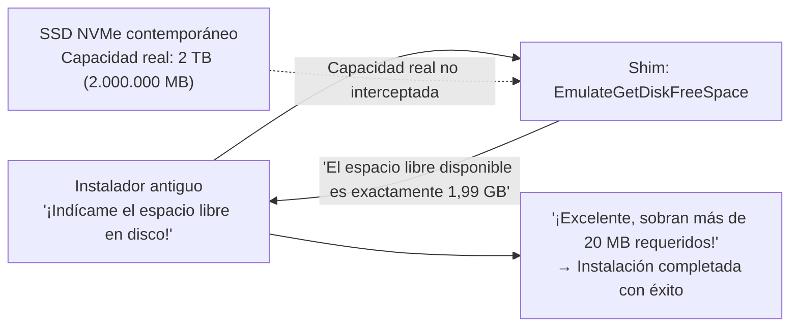

### 5.3 `VirtualRegistry` y `VirtualStore`: Redirección forzada por la llegada de UAC

Con la llegada de Windows Vista en 2006 se produjo la transformación más profunda en la arquitectura de seguridad del sistema operativo: la incorporación del **Control de Cuentas de Usuario (User Account Control: UAC)**.

Bajo Windows 95, 98 y XP, los usuarios operaban de manera cotidiana con privilegios de Administrador completo. Las aplicaciones tenían por costumbre depositar sus archivos de configuración, bases de datos internas o partidas guardadas directamente en el directorio protegido `C:\Program Files` y en la rama del registro `HKEY_LOCAL_MACHINE\Software`.

En el paradigma de seguridad de Vista y sus sucesores, cualquier intento de escritura por parte de un proceso estándar sin privilegios elevados en dichas áreas del sistema es tajantemente denegado (`ACCESS_DENIED`). De haberse aplicado esta regla de forma implacable, millones de programas existentes en el tejido empresarial habrían colapsado al instante al no poder guardar sus preferencias.

La solución arquitectónica ideada fue la virtualización mediante **`VirtualStore`**.

Cuando un programa heredado no privilegiado intenta escribir en `C:\Program Files\App\config.ini`, el subsistema de E/S de Windows no devuelve un error de permisos; en su lugar, redirige silenciosamente la operación hacia un directorio seguro aislado por usuario: `C:\Users\<Usuario>\AppData\Local\VirtualStore\Program Files\App\config.ini`. De igual modo, las escrituras en `HKLM\Software` se desvían de forma transparente a `HKCU\Software\Classes\VirtualStore`.

En lecturas posteriores, el sistema operativo consulta prioritariamente el VirtualStore. La aplicación cree ciegamente estar modificando el núcleo del sistema operativo en `Program Files`, cuando en realidad opera de forma inocua en una caja de arena (sandbox) privada y aislada.

### 5.4 `DXPrimaryBltPunt`: Corrupción de paletas de 256 colores y tasas de refresco en DirectDraw clásico

Las producciones multimedia y videojuegos para PC gestados entre 1995 y los primeros años de Windows XP (como *Age of Empires* o innumerables títulos de rol clásicos) dependían íntimamente del componente «DirectDraw» de DirectX. Aquellos motores gráficos operaban de forma nativa en resoluciones de 256 colores (paleta indexada de 8 bits), logrando transiciones y efectos visuales mediante la reescritura directa de los registros de la paleta en la superficie primaria de la memoria de vídeo (VRAM).

Sin embargo, los procesadores gráficos (GPU) modernos y el gestor de ventanas de Windows (Desktop Window Manager: DWM) componen el escritorio global íntegramente en color verdadero de 32 bits a través de tuberías aceleradas en 3D. El soporte físico por hardware para la alteración directa de paletas de 8 bits sobre la superficie de vídeo principal desapareció hace décadas.

Si se ejecuta uno de aquellos juegos en un sistema actual sin intermediación, la falta de sincronización de la paleta transforma la imagen en un mosaico psicodélico de tonalidades fluorescentes ininteligibles, o bien el desajuste en el control de sincronización vertical dispara la tasa de refresco a miles de cuadros por segundo, volviendo el juego incontrolable.

Shims de renderizado como **`DXPrimaryBltPunt`** y **`ForceDirectDrawEmulation`** solventan esta incompatibilidad capturando las instrucciones arcaicas de DirectDraw, traduciéndolas al vuelo en texturas poligonales modernas de Direct3D y proyectándolas sobre la tubería de composición de DWM. El hecho de que un título con gráficos de píxeles de hace 30 años luzca sus colores exactos en una pantalla 4K moderna es consecuencia directa de esta magistral emulación gráfica.

---

## Capítulo 6: La gran travesía hacia los 64 bits y ARM — WOW64 y la maestría de la emulación

Cuando lo que muta no es únicamente la interfaz de programación (API), sino la arquitectura física del conjunto de instrucciones del microprocesador, la retrocompatibilidad no puede sostenerse únicamente con interceptaciones funcionales en memoria. Ante estas transiciones tectónicas, Windows optó por una solución audaz: **albergar un sistema operativo completo dentro de otro**.

### 6.1 De NTVDM a WOW64: El desdoblamiento del sistema de archivos y del registro

Durante el paso de los 16 a los 32 bits, Windows NT implementó **NTVDM (NT Virtual DOS Machine)**, valiéndose del modo virtual 8086 de los procesadores Intel para ejecutar código DOS y Win16 de forma aislada.

A mediados de los años 2000, con la llegada de la arquitectura AMD64 (x64), se produjo el trascendental salto a los 64 bits. Para salvaguardar el gigantesco patrimonio de aplicaciones existentes de 32 bits, Microsoft diseñó el subsistema **«WOW64 (Windows 32-bit On Windows 64-bit)»**.

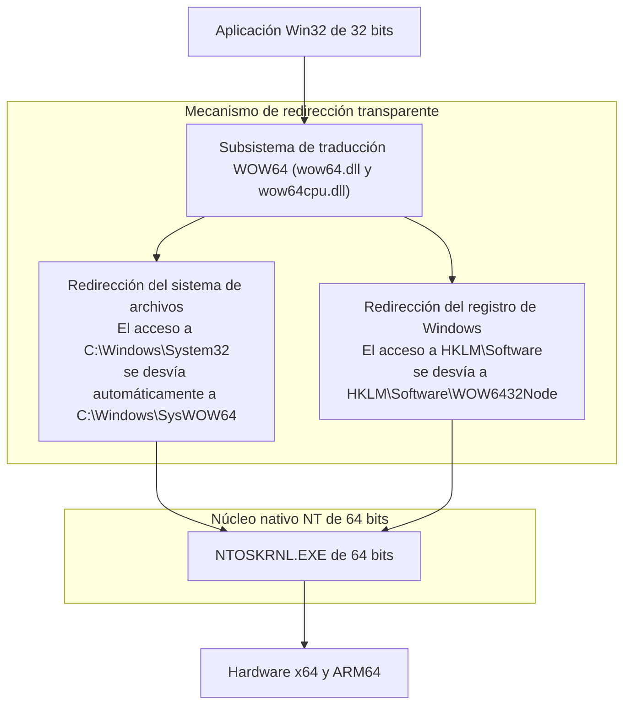

El prodigio de WOW64 reside en crear una **ilusión de universo paralelo bidimensional** en el sistema de archivos y el registro para las aplicaciones de 32 bits:

- **Redirección del sistema de archivos**:  
  En un Windows de 64 bits, las bibliotecas nativas de 64 bits residen paradójicamente en `C:\Windows\System32`. Cuando un proceso de 32 bits solicita acceder a dicha carpeta, WOW64 intercepta la llamada y la reconduce entre bastidores a `C:\Windows\SysWOW64` (donde residen en realidad los binarios de 32 bits, en contra de lo que su denominación sugeriría).
- **Redirección y reflexión del registro**:  
  De igual forma, cuando una aplicación de 32 bits escribe en `HKEY_LOCAL_MACHINE\Software`, el subsistema confina automáticamente las claves a la rama `HKEY_LOCAL_MACHINE\Software\WOW6432Node`.

Gracias a esta recreación meticulosa, una aplicación compilada en 1998 ignora por completo que se ejecuta sobre un sistema operativo de 64 bits, encontrando en las rutas habituales exactamente los componentes y bibliotecas con los que fue concebida.

### 6.2 La transición hacia ARM64 y el emulador Prism

El escenario más exigente del panorama actual radica en la migración desde la arquitectura tradicional x86/x64 hacia **ARM64** (encarnada en procesadores como los Qualcomm Snapdragon X Elite).

En 2012, Microsoft intentó con el lanzamiento de «Windows RT» una estrategia disruptiva al estilo de Apple: prohibir la ejecución de binarios Win32 tradicionales sobre hardware ARM y forzar a los desarrolladores a programar bajo un nuevo modelo. La respuesta del mercado fue un rechazo frontal y demoledor que causó a la compañía pérdidas multimillonarias cercanas a mil millones de dólares. Aquella amarga derrota grabó una lección indeleble en el ADN de Microsoft: **un Windows incapaz de ejecutar el catálogo histórico de aplicaciones de Windows no es considerado Windows por los usuarios**.

Con el actual Windows 11 sobre ARM, Microsoft estrenó su motor de traducción binaria de vanguardia bautizado como **«Prism»**. Prism analiza dinámicamente las instrucciones de máquina x86 y x64 de los ejecutables convencionales, compilándolas al vuelo (Just-In-Time: JIT) en código optimizado para ARM64. Además, almacena los bloques traducidos en cachés avanzadas de ejecución, permitiendo que las aplicaciones legadas alcancen un rendimiento que rivaliza con el código nativo.

Por radical que sea la metamorfosis del silicio, la experiencia inviolable del usuario debe mantenerse incólume: hacer doble clic sobre un ejecutable y que este funcione al instante.

---

## Capítulo 7: Tres mundos, tres filosofías de diseño — Windows vs Apple (macOS) vs Linux

Ante el dilema de cómo gestionar el patrimonio de software heredado, los tres principales ecosistemas operativos del mundo adoptaron soluciones conceptualmente antagónicas. Al contrastar estas visiones se comprende la singularidad irrepetible de Windows en la historia de la informática.

### 7.1 Apple (Ruptura quirúrgica): Arrasar con el pasado para avanzar hacia el futuro

Desde la visión fundacional de Steve Jobs hasta la directiva actual de Tim Cook, Apple se ha guiado por una política de **«tierra quemada quirúrgica»**: sacrificar sin vacilación el pasado en pos de optimizar la experiencia y el rendimiento futuros.

La cronología de Apple es una sucesión continua de rupturas arquitectónicas radicales:
- **Abandono total del Classic Mac OS**: La transición imperativa desde Mac OS 9 hacia Mac OS X (basado en NeXT y Unix). La API intermedia de transición («Carbon») fue mantenida de forma temporal para terminar siendo erradicada por completo.
- **Mutaciones recurrentes de microarquitectura**: Del Motorola 680x0 al PowerPC, del PowerPC a Intel x86, y de Intel a Apple Silicon (chips serie M). En cada coyuntura Apple proporcionó emuladores excelentes (el emulador Mac 68K, la primera versión de Rosetta y Rosetta 2), pero retiró cada emulador del sistema operativo a los pocos años, eliminando de golpe la compatibilidad con los binarios históricos.
- **Exterminio de los 32 bits en macOS Catalina (2019)**: Apple abolió unilateralmente el soporte para ejecutar cualquier binario de 32 bits. Infinidad de complementos de producción de audio profesional, herramientas científicas y videojuegos clásicos quedaron inservibles de la noche a la mañana.

El mandato de Apple hacia los desarrolladores es inexorable: *«Utilizad la última versión de Xcode, refactorizad vuestro código en el Swift contemporáneo y recompilad para la última versión del sistema operativo. Si una aplicación no se actualiza, carece de derecho a pervivir en nuestro ecosistema»*. Esta política asegura un sistema operativo extraordinariamente esbelto, limpio y moderno, a expensas de trasladar a desarrolladores y clientes el coste de una continua reescritura.

### 7.2 Linux (El mandamiento de Linus): «Never break userspace!» — Luces y sombras

En el universo del código abierto, Linus Torvalds impuso una directiva para el desarrollo del núcleo Linux que guarda una asombrosa correlación con la disciplina de Microsoft: **«Never break userspace!» (¡Jamás rompas el espacio de usuario!)**.

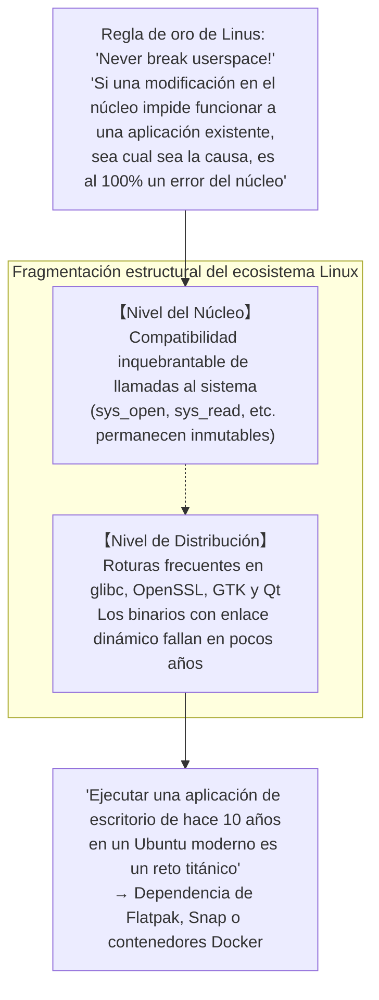

Si un parche del núcleo, por elegante o bien estructurado que resulte, genera una regresión que desestabiliza un programa en espacio de usuario, Linus Torvalds exige su inmediata revocación. En este nivel fundamental, el núcleo Linux comparte plenamente la obsesión pragmática de Windows.

No obstante, en el escritorio de Linux no existe una autoridad central unificada que gobierne el conjunto del sistema. Aunque las llamadas al sistema del núcleo sean eternas, las bibliotecas compartidas del entorno de distribución (`glibc`, `libssl`, bibliotecas gráficas de GTK o Qt) alteran con frecuencia sus interfaces y dependencias. En consecuencia, **lograr que un binario compilado dinámicamente hace diez años se ejecute sin modificaciones en una distribución reciente de Linux suele ser una tarea extraordinariamente ardua**. Linux preserva la compatibilidad en el núcleo, pero la fragmentación de su espacio de usuario le impidió alcanzar la retrocompatibilidad integral que ostenta Windows.

### 7.3 Windows (Inclusión acumulativa): La estratificación demencial

Frente a la amputación deliberada de Apple y la fragmentación distributiva de Linux, Windows adoptó el camino de la **«Inclusión acumulativa»**.

El sistema no destruye los cimientos del pasado; por el contrario, superpone nuevas capas de abstracción como estratos geológicos superpuestos. Sobre Win16 se construyó Win32; sobre Win32 se depositó .NET Framework; sobre este se proyectó WinRT y la plataforma UWP, y cuando UWP no logró desplazar a sus predecesores, Microsoft volvió a cimentar Windows App SDK (WinUI 3) directamente sobre el veterano Win32.

Esta acumulación ininterrumpida ha transformado a Windows en uno de los artefactos de software más complejos y titánicos jamás construidos por el ser humano. Sin embargo, a cambio de esa monstruosa complejidad, ha hecho realidad un logro único en la historia tecnológica: **un ecosistema donde el software escrito hace cuarenta años coexiste pacíficamente en la misma máquina con aplicaciones basadas en inteligencia artificial de última generación**.

| Criterio de comparación | Microsoft (Windows) | Apple (macOS) | Linux (Escritorio) |
| :--- | :--- | :--- | :--- |
| **Filosofía fundamental** | **Inclusión acumulativa**<br/>Absorber y preservar todo el pasado | **Ruptura quirúrgica**<br/>Demolición periódica del legado | **Defensa del núcleo y autonomía superior**<br/>Núcleo inmutable, capas superiores cambiantes |
| **Directiva suprema** | "Don't break old apps" | "Embrace the modern platform" | "Never break userspace" (Sólo en el núcleo) |
| **Horizonte temporal de compatibilidad** | **Más de 30 o 40 años** (Win32 y DOS) | **3 a 5 años** (Eliminación tras el periodo de gracia) | El núcleo es centenario, las apps GUI son efímeras |
| **Estado actual de ejecutables de 32 bits** | **Pleno soporte en Windows 11** (vía WOW64) | **Erradicación absoluta** en macOS Catalina (2019) | Requiere librerías multilib opcionales |
| **Exigencia impuesta a desarrolladores** | Mínima: las aplicaciones siguen operativas | Alta: reescritura periódica obligatoria | Empaquetado recurrente para cada distribución |
| **Pureza de la arquitectura interna** | Cientos de millones de líneas en estratos | Extraordinariamente esbelta y moderna | Modular en el núcleo, fragmentada en la superficie |


---

## Capítulo 8: Economía de plataformas — Por qué la retrocompatibilidad es el «foso inexpugnable (Moat)» definitivo

¿Por qué Bill Gates y las sucesivas generaciones de líderes ejecutivos de Microsoft impusieron de forma implacable esta agotadora disciplina a sus ingenieros? La respuesta definitiva no responde a un ideal estético, sino a la fría **economía de las plataformas informáticas y a la dinámica comercial del software**.

### 8.1 El modelo de negocio de Bill Gates: El valor de un SO es la «suma total del software ejecutable»

Desde la fundación misma de Microsoft, Bill Gates entendió con meridiana claridad la esencia del negocio de plataformas:

> **Teorema del valor de una plataforma**:  
> El valor intrínseco de un sistema operativo no reside en las funcionalidades que este ofrece de manera aislada.  
> Se define por **«la suma total de los activos de software creados en todo el mundo que son capaces de ejecutarse sobre él»**.

No importa cuán elegante, eficiente o vanguardista sea una nueva plataforma operativa: si no es capaz de ejecutar las herramientas de trabajo cotidiano de las que dependen las empresas y los usuarios, su valor de mercado es nulo. Los consumidores no compran el envoltorio del sistema operativo en sí; adquieren las aplicaciones que corren sobre él y la productividad que estas generan.

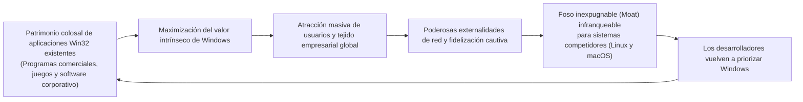

Al consagrar una retrocompatibilidad del 100%, los cientos de millones de líneas de código producidas durante más de tres décadas por programadores de todo el mundo **se incorporan automáticamente, sin coste adicional, como valor añadido para la siguiente generación de Windows**.

Por persuasivos que fueran los argumentos técnicos presentados por alternativas como macOS o Linux para seducir al sector corporativo, cualquier negociación comercial quedaba zanjada con una sola objeción incontestable: *«En ese sistema no puede ejecutarse el programa de logística interna que desarrollamos hace veinte años»*. La retrocompatibilidad se consolidó así como el foso competitivo más infranqueable jamás concebido en la industria tecnológica.

### 8.2 El bloqueo absoluto del mercado corporativo (Enterprise Lock-in)

En el sector de las grandes corporaciones y las administraciones públicas, este principio desplegó una fuerza imbatible.

Empresas de la lista Fortune 500, hospitales, entidades bancarias y fábricas de manufactura operan infinidad de sistemas de gestión internos concebidos hace lustros mediante inversiones millonarias en tecnologías como Visual Basic 6 o controles ActiveX en C++. En innumerables casos, las empresas desarrolladoras originales se disolvieron, el código fuente se extravió y no quedan especificaciones técnicas vigentes: son auténticos monumentos funcionales que nadie se atreve a modificar.

Si una nueva versión de Windows rompiese la compatibilidad exigiendo a las empresas rediseñar sus sistemas corporativos desde cero con arquitecturas web modernas, los directores de tecnología (CIO) habrían congelado indefinidamente la renovación de equipos o evaluado plataformas alternativas.

Windows, en cambio, blandió la varita mágica de AppCompat asegurando a los comités directivos: *«No precisan modificar una sola línea de código; renueven su parque de ordenadores con total tranquilidad, sus aplicaciones seguirán funcionando con total fidelidad»*. Para cualquier líder financiero, esta garantía representaba la decisión más rentable y segura posible. De este modo, el tejido empresarial mundial quedó irrevocablemente arraigado en el ecosistema Windows.

### 8.3 La «trampa del éxito»: El freno a la innovación disruptiva

Sin embargo, este triunfo titánico encerraba una paradoja perversa: se transformó con el tiempo en la **«trampa del éxito (Success Trap)»**, limitando la capacidad de la propia Microsoft para acometer saltos evolutivos disruptivos.

A comienzos de la década de 2010, ante el auge fulgurante de los ecosistemas móviles personificados por iOS y Android, Microsoft intentó modernizar de raíz la arquitectura de Windows promoviendo la Plataforma Universal de Windows (UWP). UWP aspiraba a reemplazar paulatinamente el modelo clásico de Win32 por un entorno rigurosamente aislado en cajas de arena (sandboxed), enfocado en la seguridad y la eficiencia energética.

No obstante, tanto los desarrolladores como el tejido corporativo ignoraron de forma abrumadora la propuesta de UWP: *«¿Por qué deberíamos asumir el inmenso coste de reescribir nuestro catálogo de software en un marco restringido, cuando nuestras aplicaciones Win32 tradicionales continúan funcionando con absoluta solvencia y libertad tanto en Windows 10 como en Windows 11?»*.

El propio éxito de Win32 —su descomunal robustez y ubicuidad— devino en un estándar tan arraigado que **ni siquiera la propia Microsoft fue capaz de desmantelarlo**. Finalmente, la compañía tuvo que replegar su estrategia: abrió la tienda oficial a ejecutables Win32 tradicionales empaquetados y reconstruyó su biblioteca gráfica contemporánea, WinUI 3 (Windows App SDK), sobre los cimientos inmutables de Win32. La formidable muralla de compatibilidad construida por la compañía se convirtió en el mayor obstáculo contra sus propias ambiciones de reinvención.

---

## Capítulo 9: El precio de la gloria — Deuda técnica descomunal y laberintos de seguridad

Preservar intacto el patrimonio del pasado y asumir sobre las espaldas del sistema operativo los defectos de código ajenos no fue un regalo gratuito. La contrapartida ha sido una de las mayores cargas de deuda técnica y complejidad arquitectónica que jamás haya soportado un proyecto informático.

### 9.1 Cientos de millones de líneas de código y una matriz de pruebas astronómica

Se calcula que el volumen actual del código fuente de Windows supera holgadamente los **cientos de millones de líneas de código**. Sin embargo, el desafío más sobrecogedor para el equipo de desarrollo radica en la colosal matriz combinatoria de pruebas de validación requerida para cada nueva compilación del sistema.

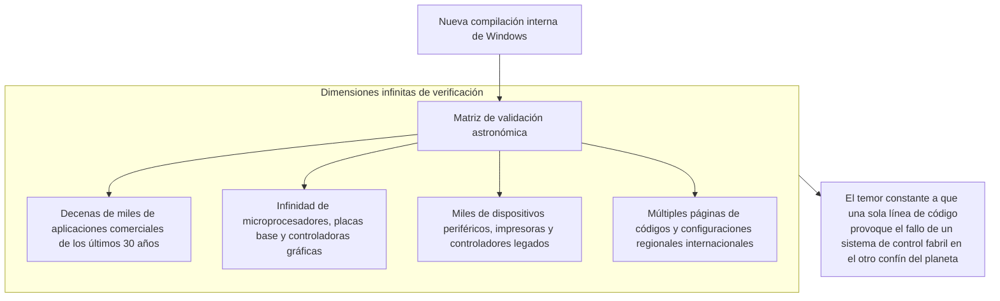

Cualquier ajuste aparentemente trivial en el núcleo —como una comprobación preventiva adicional en la validación de un puntero o una reordenación en las primitivas de sincronización de hilos— entraña el riesgo latente de bloquear un programa fabril de hace tres décadas que controle una cadena de montaje en el otro extremo del mundo. Para sortear esta pesadilla, Microsoft mantiene instalaciones colosales equipadas con decenas de miles de ordenadores reales y servidores de virtualización donde baterías automatizadas ejecutan sin descanso software de todas las épocas para verificar si sus ventanas principales continúan desplegándose con normalidad.

### 9.2 Brechas de seguridad propiciadas por APIs heredadas

La vertiente más crítica de esta hipoteca técnica afecta de lleno a la **seguridad informática**.

Numerosas APIs del catálogo primigenio de Win32 fueron concebidas en la era previa a la universalización de Internet, cuando la prioridad residía en el rendimiento local y no existían nociones rigurosas de aislamiento contra desbordamientos de búfer o escalada de privilegios. Pese a su vulnerabilidad conceptual, el imperativo de la retrocompatibilidad prohíbe taxativamente su extirpación.

Los atacantes informáticos y analistas de seguridad explotan precisamente estos recovecos históricos: las interfaces legadas y las sutiles fisuras que median entre las capas de Shims son objetivos predilectos para eludir mecanismos de seguridad contemporáneos, elevar privilegios o escapar de cajas de arena. La benevolencia del sistema operativo con el software pretérito se traduce inevitablemente en una superficie de ataque (attack surface) estructuralmente más extensa.

### 9.3 El colapso del proyecto Longhorn y la refactorización hacia «MinWin»

La tensión acumulada entre la incorporación incesante de novedades y el mantenimiento de las capas de compatibilidad desembocó a principios de los años 2000 en una crisis histórica de gobernabilidad: **el colapso del proyecto «Longhorn»**.

Proyectado como el sucesor directo de Windows XP, Longhorn sucumbió a una maraña inabarcable de interdependencias cruzadas entre componentes experimentales y código heredado. El código fuente devino en un laberinto intratable: las compilaciones fallaban diariamente, el rendimiento colapsaba y el proyecto se vio sumido en una parálisis absoluta.

En el verano de 2004, la dirección de Microsoft tomó la drástica decisión de ejecutar el denominado «reinicio de Longhorn» (*Longhorn Reset*): desecharon miles de horas de trabajo y reanudaron el desarrollo partiendo de la base de código probada y estable de Windows Server 2003 SP1 (germen que culminaría en Windows Vista).

A raíz de aquel colapso, el equipo de ingeniería emprendió una profunda reconversión arquitectónica, segregando las funciones nucleares del sistema en un estrato basal depurado y autocontenido denominado **«MinWin»**. Gracias a este desacoplamiento metódico entre el núcleo esencial y los subsistemas superiores de compatibilidad, la infraestructura de Windows pudo subsistir y conservar su agilidad operativa sin desmoronarse bajo su propio peso.

---

## Conclusión: Elogio de los ingenieros pragmáticos — La sociedad contemporánea erigida sobre el milagro de «lo que funciona»

Los ordenadores que gestionan las estaciones ferroviarias, los terminales hospitalarios que custodian historiales clínicos, los cajeros automáticos del sistema financiero, las líneas de ensamblaje robotizadas y las pantallas de los despachos donde se toman decisiones cruciales para la economía mundial comparten un denominador común silencioso: en sus cimientos más recónditos late el corazón incombustible de Windows.

Si Microsoft hubiese actuado como un heraldo dogmático de la pureza teórica de la ciencia computacional y, al estilo de Apple, hubiese demolido el software heredado cada pocos años, ¿cuál habría sido el destino de nuestra infraestructura global?

Infinidad de factorías habrían detenido su producción, medianas empresas habrían sucumbido a los costes astronómicos de reescribir periódicamente sus herramientas operativas, y los servicios esenciales habrían padecido continuos episodios de inestabilidad. Si la economía y la sociedad digital han podido avanzar de manera continuada e ininterrumpida a lo largo de las últimas cuatro décadas, ha sido porque Windows **asumió con estoicismo la carga de soportar sobre sus propios hombros las imperfecciones, los errores de bulto y los descuidos de generaciones enteras de programadores**.

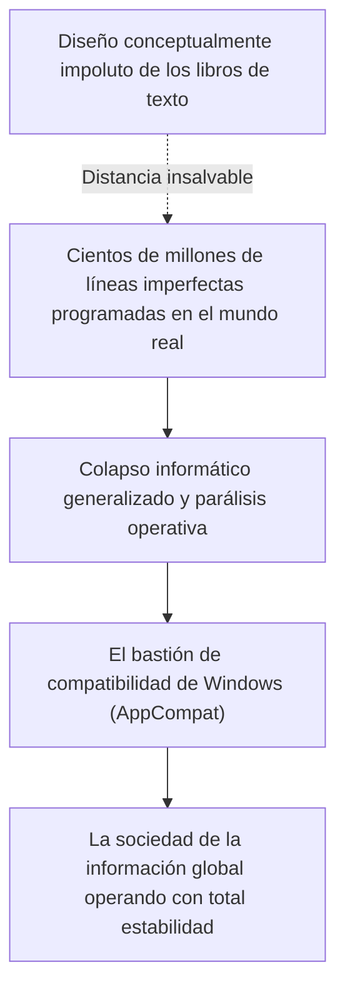

Para Raymond Chen y las generaciones de ingenieros anónimos que custodiaron el núcleo de Windows, pasar noches en vela depurando ensamblador para concebir un Shim que salvase el error de memoria cometido por una empresa desconocida años atrás distaba mucho de ser una tarea glamurosa. No había allí teoremas elegantes dignos de premios académicos ni discursos de vanguardia publicitaria.

Sin embargo, ese sacrificio silencioso encarna la máxima expresión de la **auténtica ingeniería profesional**.

La verdadera ingeniería no consiste en refugiarse en una sala blanca para maravillarse con abstracciones impecables que se desmoronan al primer contacto con la realidad. Consiste en sumergirse en el fango de un mundo imperfecto construido por seres humanos imperfectos, solventar los desajustes con ingenio pragmático y garantizar con lealtad inquebrantable que **aquello que funcionaba ayer continúe funcionando hoy, mañana y dentro de varias décadas**.

«Nunca rompas las aplicaciones antiguas»: sobre los hombros de esta consigna casi demencial y del talento perseverante de quienes la convirtieron en realidad, el mundo tecnológico moderno sigue despertando cada mañana y funcionando con total normalidad, como si ningún obstáculo hubiese existido jamás.
