## Introduction : L'essence d'un système d'exploitation — « Conception élégante » ou « pragmatisme d'acier » ?

Ouvrez n'importe quel manuel de science informatique ou traité de génie logiciel, et vous y trouverez toujours l'éloge d'idéaux immaculés : « abstractions élégantes », « séparation des préoccupations (Separation of Concerns) » et « conception orthogonale des API ». Un système d'exploitation (OS), selon la doctrine académique, se doit d'être un arbitre souverain et bienveillant, dissimulant la complexité désordonnée du matériel pour offrir aux applications une interface limpide, unifiée et mathématiquement cohérente.

Pourtant, dès que l'on quitte la tour d'ivoire universitaire pour pénétrer sur le champ de bataille commercial des OS de bureau, ces nobles idéaux volent en éclats. Car le colosse qui a régné sans partage sur l'histoire de la micro-informatique et dominé des milliards de PC à travers le monde — Microsoft Windows — incarne une philosophie diamétralement opposée à la pureté académique : **un pragmatisme d'acier, poussé jusqu'à l'obsession**.

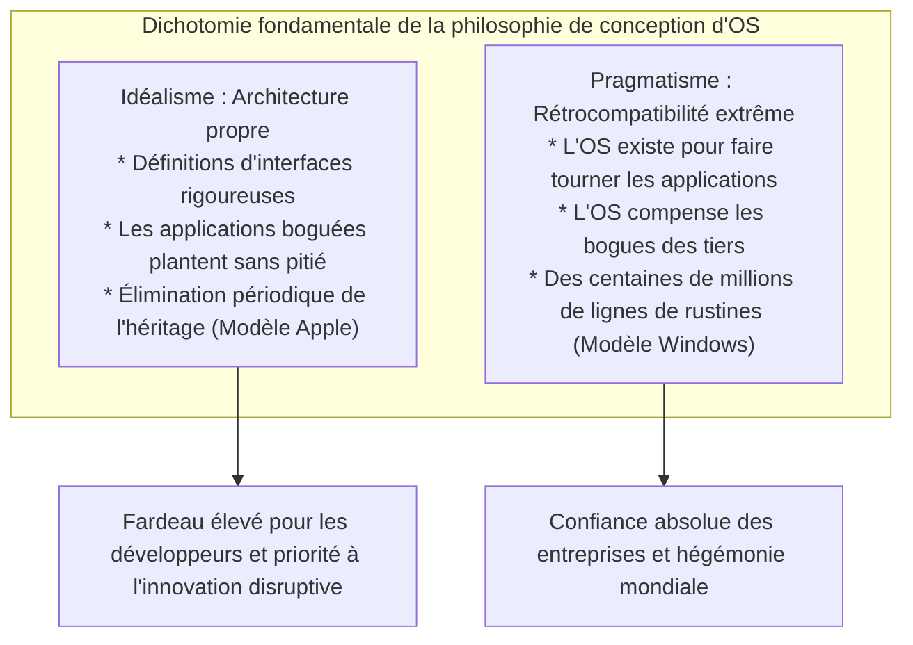

Parmi tous les systèmes d'exploitation ayant jamais vu le jour, aucun n'a manifesté un attachement aussi viscéral au passé que Windows. Un jeu vidéo sur CD-ROM commercialisé en 1995, un logiciel de comptabilité d'entreprise codé au début des années 1990 en Visual Basic 3.0 ou en C++ 16 bits, des utilitaires issus de l'ère MS-DOS détournant des comportements non documentés du noyau — la quasi-totalité de ces binaires démarre et s'exécute parfaitement sur un Windows 11 moderne en 2026.

La plupart des utilisateurs considèrent cela comme une évidence, réduisant ce prodige à un simple « logiciel qui fonctionne ». Mais les programmeurs système qui ont désassemblé les entrailles de l'OS et plongé dans les abysses du noyau NT demeurent saisis d'effroi et d'admiration. Sous le capot s'étend une véritable strate géologique accumulée sur plus de trente ans : **des dizaines de milliers de lignes de cas d'exception, d'usurpation dynamique d'API et de mécanismes où l'OS ment délibérément à l'application (les Shims)**, forgés par les ingénieurs de Microsoft pour pardonner les violations de spécifications, corruptions de mémoire et comportements indéfinis écrits par des tiers.

Pourquoi Microsoft s'est-elle infligé le fardeau de compenser le code défaillant des autres en contorsionnant son propre système d'exploitation ?
Pourquoi n'a-t-elle pas choisi la voie d'Apple, consistant à couper régulièrement les ponts avec le passé ?
Et comment cette discipline d'ingénierie impitoyable a-t-elle transformé Windows en la plateforme commerciale la plus inexpugnable de l'histoire industrielle ?

En s'appuyant sur les témoignages de développeurs légendaires de Microsoft, sur les données issues du rétro-ingénierie des binaires PE et du noyau NT, ainsi que sur l'histoire de la stratégie de plateforme, ce document dissèque le dogme absolu qui gouverne l'empire Windows : **« Ne cassez jamais les anciennes applications » (Don't break old apps)**.

---

## Chapitre 1 : La Directive Première selon deux géants de l'industrie

L'obsession de la compatibilité au sein des équipes de développement de Windows n'est pas une légende inventée de l'extérieur. Elle a été révélée au grand jour par deux figures emblématiques qui ont écrit le code, façonné l'architecture et mené les batailles logicielles de Microsoft en première ligne.

### 1.1 Raymond Chen et *The Old New Thing*

Au sein de la division Windows de Microsoft, un ingénieur fait figure de légende vivante depuis plus de trente ans : **Raymond Chen**. Arrivé chez Microsoft en 1992, ce Principal Software Engineer a conçu, développé et maintenu le shell de Windows 95, User32 et les strates les plus profondes du sous-système Win32.

Son blog, ***The Old New Thing*** — qui a débuté comme une tribune interne avant de devenir une référence publique incontournable sur le portail technique de Microsoft et d'être adapté en livre culte — constitue les annales sacrées de la résolution des crises de compatibilité les plus épineuses de Windows.

Chen formule l'axiome fondamental de l'équipe Windows avec un réalisme implacable :

> « Un système d'exploitation existe pour exécuter des programmes. Les utilisateurs n'achètent pas un ordinateur pour contempler le système d'exploitation. Ils l'achètent pour faire tourner des applications précises dont ils ont besoin au quotidien.
> 
> Et voici la cruelle réalité : **lorsqu'un utilisateur met à jour Windows et que son application favorite refuse de démarrer, il ne blâme jamais l'auteur du logiciel. À 100 %, il accuse Microsoft : ‹ Windows est cassé › ou ‹ Le nouveau Windows est défectueux ›.** »

Du point de vue de l'orgueil du programmeur, la tentation est grande de rétorquer : « Si l'application comporte des bogues, il est normal qu'elle plante ; c'est à son éditeur de fournir un correctif ». Mais sur le marché impitoyable des systèmes d'exploitation grand public et d'entreprise, ce purisme est suicidaire. Pour l'utilisateur final, seul compte un fait brut : « Ce logiciel marchait hier ; j'ai mis Windows à jour, et il ne marche plus aujourd'hui ».

Si Microsoft s'était retranchée derrière des justifications techniques en déclarant que « la faute incombe aux tiers », les clients auraient refusé les mises à jour, seraient restés figés sur d'anciennes versions ou auraient fui vers la concurrence. La survie commerciale a donc imposé à l'équipe Windows un impératif d'airain :

**« Même si le code d'une application tierce est aberrant, non conforme aux normes et profondément corrompu, le système d'exploitation doit l'intercepter, adapter son comportement en coulisses et assurer son exécution comme si de rien n'était. »**

Le blog de Raymond Chen consigne en détail les astuces stupéfiantes et les contorsions héroïques auxquelles ses collègues et lui ont dû consentir pour tenir ce serment.

### 1.2 Le réquisitoire de Joel Spolsky : *How Microsoft Lost the API War*

L'ampleur historique de cette doctrine a été révélée au monde des développeurs web et des stratèges de la tech par **Joel Spolsky**. Chef de produit pour l'équipe Excel chez Microsoft au début des années 1990, il est devenu plus tard l'un des essayistes logiciels les plus influents au monde et le cofondateur de Stack Overflow et de Trello.

Dans son essai magistral de 2004, *How Microsoft Lost the API War*, Spolsky analyse la rigueur de fer imposée par les dirigeants de l'ingénierie de Windows, tels que Jon DeVaan :

> « In the Windows team, the prime directive was: **don't break old apps.** »
> (Au sein de l'équipe Windows, la directive première était : **ne cassez jamais les anciennes applications.**)

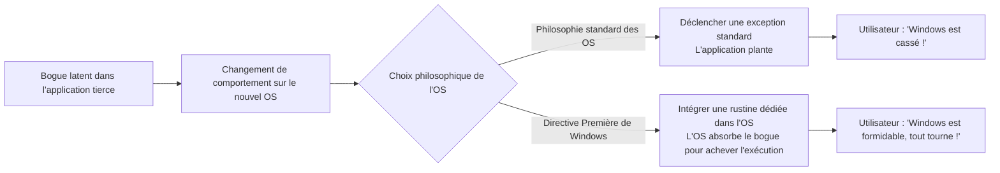

Spolsky souligne l'analogie avec *Star Trek* : tout comme les officiers de Starfleet sont soumis à la « Directive Première » (qui interdit d'interférer avec le développement naturel des civilisations extraterrestres), la Directive Première absolue des ingénieurs du noyau Windows était de ne jamais altérer le fonctionnement des applications existantes.

Si un développeur de Windows réécrivait une routine du noyau de manière éclatante en doublant ses performances, mais que cette modification entraînait le plantage d'un obscur logiciel de gestion commerciale à l'autre bout de la planète, son travail était immédiatement et sans appel rejeté. Chez Windows, la beauté du code et la pureté architecturale s'effaçaient devant un impératif supérieur : **garantir que 100 % des binaires compilés continuent de tourner**.

### 1.3 « Quand le bogue devient spécification » : La loi de Hyrum et l'irréversibilité des API

Il existe en génie logiciel une observation empirique formulée par Hyrum Wright, ingénieur chez Google, connue sous le nom de **Loi de Hyrum** :

> **Loi de Hyrum** :
> « Avec un nombre suffisant d'utilisateurs d'une API, peu importe ce que vous promettez dans le contrat (la documentation) : tous les comportements observables de votre système (y compris les bogues et les effets secondaires non documentés) finiront par être exploités par le code de quelqu'un. »

Windows est la plateforme qui a validé la loi de Hyrum à la plus gigantesque échelle de l'histoire informatique.

Supposons que la documentation officielle d'une API Win32 indique expressément : *« Le troisième paramètre doit être un handle de fenêtre valide. L'envoi d'une valeur invalide provoque un comportement indéfini. »* Mais un développeur négligent passe malencontreusement un pointeur `NULL`, et par pure chance, l'implémentation originelle de Windows 3.1 ignorait l'erreur sans broncher.

Une fois que cette application a été distribuée à des centaines de milliers d'exemplaires dans le monde, qu'arrive-t-il lorsque l'équipe de Windows 95 ou Windows NT nettoie le code et renvoie scrupuleusement `ERROR_INVALID_WINDOW_HANDLE` en cas de handle invalide ?

Dans des dizaines de milliers d'entreprises, l'ancienne application affiche un dialogue d'erreur et se ferme brutalement. Des clients furieux submergent alors le support de Microsoft : *« Notre entreprise est à l'arrêt depuis la mise à jour ! »*

Face à cette réalité commerciale, les ingénieurs de Microsoft n'ont eu d'autre choix que de retirer leur code rigoureux pour écrire des compromis techniques de ce genre :

```c
// Reconstitution conceptuelle de la logique interne de compatibilité d'une API Windows
BOOL WINAPI DoSomething(HWND hWnd, UINT uMsg, WPARAM wParam, LPARAM lParam)
{
    // Validation théoriquement parfaite selon les règles de l'art
    if (!IsWindow(hWnd)) {
        // En toute rigueur académique, il faudrait échouer immédiatement :
        // SetLastError(ERROR_INVALID_WINDOW_HANDLE);
        // return FALSE;

        // [Rustine de compatibilité]
        // L'ancienne application renommée "AppX.exe" transmet un handle NULL à l'initialisation.
        // Renvoyer une erreur ferait planter AppX.
        // Par conséquent, nous substituons silencieusement le handle de la fenêtre de bureau.
        if (IsTargetBadApplication("AppX.exe")) {
            hWnd = GetDesktopWindow();
        } else {
            SetLastError(ERROR_INVALID_WINDOW_HANDLE);
            return FALSE;
        }
    }

    // Poursuite de l'exécution normale...
    return InternalDoSomething(hWnd, uMsg, wParam, lParam);
}
```

Dès lors qu'un système d'exploitation devient le standard de fait planétaire, la véritable spécification d'une API n'est plus ce qui est écrit dans la documentation officielle, mais **la somme globale de tous les comportements observables, bogues inclus, affichés par l'implémentation historique**. L'équipe Windows a accepté ce destin inéluctable et s'est résolue à porter éternellement les erreurs du monde entier comme des spécifications de son OS.

---

## Chapitre 2 : La naissance d'une légende — La vérité technique sur « l'incident SimCity »

Parmi toutes les chroniques illustrant la ferveur de l'équipe Windows pour la rétrocompatibilité, un épisode se détache et demeure gravé dans les annales : **l'affaire SimCity** survenue en 1995 lors de la finalisation de Windows 95.

### 2.1 La physique du Use-After-Free (accès à la mémoire libérée)

Conçu en 1989 par Will Wright et le studio Maxis, *SimCity* a marqué un tournant dans l'histoire des jeux vidéo sur ordinateur, rencontrant un succès planétaire retentissant. Pour les particuliers comme pour les employés de bureau se détendant entre deux réunions, s'assurer que SimCity tournait parfaitement était un argument décisif pour l'achat d'un PC.

Or, le binaire de SimCity distribué à l'époque pour DOS et Windows 3.1 contenait un vice de programmation majeur qui, selon les critères modernes d'audit de sécurité, constitue une vulnérabilité critique : une faille de type **Use-After-Free (utilisation de mémoire après libération)**.

Au cours du calcul de la simulation urbaine et du rendu graphique, le code de SimCity allouait des blocs de mémoire sur le tas de l'OS, puis les libérait via `free` ou `GlobalFree`. Hélas, le programme ne réinitialisait pas ses pointeurs internes et **continuait à lire et écrire sans vergogne dans des zones de mémoire qu'il venait officiellement de restituer au système d'exploitation**.

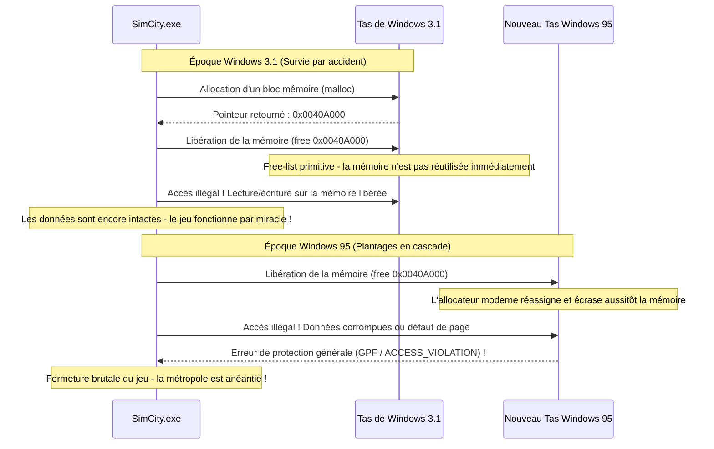

Sous l'architecture 16 bits de Windows 3.1, la gestion de la mémoire était rudimentaire. Lorsqu'une application libérait un bloc, la structure simpliste de la liste des blocs libres (*free-list*) faisait qu'il était exceptionnel que cette mémoire soit immédiatement réaffectée à d'autres tâches ou écrasée. Ainsi, bien que le code de SimCity fût structurellement corrompu, **il fonctionnait par pur hasard grâce à la simplicité passive de l'allocateur de Windows 3.1**.

### 2.2 Génie logiciel classique contre la folie de l'équipe Windows

En 1995, Microsoft s'apprête à lancer Windows 95, un OS 32 bits révolutionnaire doté d'un véritable multitâche préemptif, d'un gestionnaire de mémoire virtuelle avancé et d'un allocateur de tas moderne optimisé pour limiter la fragmentation et maximiser la mise en cache.

Cet allocateur moderne était conçu pour **réutiliser, compacter ou remettre à zéro instantanément tout bloc de mémoire libéré** afin de garantir une efficacité maximale.

Lorsque SimCity fut exécuté sur ce nouveau système, le verdict fut immédiat.
SimCity tenta d'accéder aux données qu'il venait de libérer, tomba sur des pages réallouées à d'autres processus ou remises à zéro, et l'instant d'après, la redoutée boîte de dialogue d'**Erreur de protection générale (General Protection Fault, GPF)** foudroyait l'écran, détruisant des heures d'aménagement urbain.

Quelle aurait été la réaction normale de n'importe quelle entreprise de logiciels respectueuse des règles académiques ?

La réponse est évidente : « Il s'agit à 100 % d'une faute de programmation de Maxis. La gestion mémoire de notre OS respecte scrupuleusement les spécifications. Nous devons avertir Maxis et attendre qu'ils distribuent une disquette de mise à jour (SimCity 1.01). »

Mais pour l'état-major de Microsoft et les architectes de Windows 95, dont le lancement ne souffrait aucun faux pas, la décision prise défiait l'orthodoxie :

**« SimCity ne doit pas planter. Nous n'avons pas le temps d'attendre un correctif de l'éditeur. Modifiez le gestionnaire de mémoire du noyau de Windows 95 pour y intégrer un traitement de faveur permettant à SimCity de tourner. »**

### 2.3 Détails techniques de la rustine dédiée à SimCity dans l'allocateur de mémoire

Joel Spolsky relate ce moment fondateur de l'histoire informatique :

> « Durant les tests bêta de Windows 95, ils ont découvert que SimCity ne fonctionnait plus correctement. Qu'a fait Microsoft ?
> Ont-ils traqué les auteurs de SimCity pour les contraindre à réparer leur code ? Non.
> Le responsable du gestionnaire de mémoire de Windows 95 a ajouté du code spécialisé : **‹ Si le programme en cours d'exécution est SimCity, ne réallouez pas la mémoire libérée immédiatement ; conservez-la intacte pendant un certain laps de temps. ›** »

Sur le plan technique, cette modification préfigure ce que l'on appelle aujourd'hui un **tas de quarantaine (Quarantine Heap)** ou un **mécanisme de libération différée (Delayed Free)**.

Au lancement d'un processus, l'allocateur de mémoire vérifiait le nom du binaire (`SIMCITY.EXE`) et les en-têtes du fichier. S'il reconnaissait SimCity, il basculait en « mode de sauvetage SimCity ». Au lieu de fusionner immédiatement les blocs libérés (*coalescing*) dans le pool disponible, l'OS plaçait les pointeurs restitués dans un tampon circulaire temporaire, empêchant toute réécriture sur ces zones durant un intervalle suffisant pour laisser au jeu le temps de terminer ses accès illégaux.

Grâce à ce sacrifice des principes académiques par le système d'exploitation, le jour du lancement de Windows 95, des millions d'utilisateurs ont inséré leur disquette de SimCity dans leur nouveau PC et ont pu gérer leur ville sans le moindre accroc ni message d'erreur.

Le public a applaudi : *« Windows 95 est merveilleux ! Tout fonctionne immédiatement ! »* Personne ne se doutait qu'au cœur de ce joyau technologique reposait une rustine secrète forgée uniquement pour tolérer les erreurs de programmation d'un jeu vidéo.

---

## Chapitre 3 : La chronique des rustines historiques de compatibilité

L'affaire SimCity n'était qu'un prélude. Les trente années de règne de Windows ont été jalonnées d'ingénieuses contorsions pour maintenir en vie des logiciels récalcitrants.

### 3.1 Lotus 1-2-3 et le « bogue de l'année bissextile 1900 » dans Excel

Dans les algorithmes de calcul calendaire, il existe un bogue légendaire qui continue de sommeiller dans des milliards de PC à travers la planète : **l'erreur consistant à considérer l'année 1900 comme une année bissextile**.

Dans le calendrier grégorien, les règles relatives aux années bissextiles sont rigoureuses :
1. Une année divisible par 4 est bissextile.
2. Cependant, une année divisible par 100 est commune.
3. Cependant, une année divisible par 400 redevient bissextile.

Puisque 1900 est divisible par 100 mais pas par 400, **l'année 1900 était une année commune ; le 29 février 1900 n'a jamais existé**.

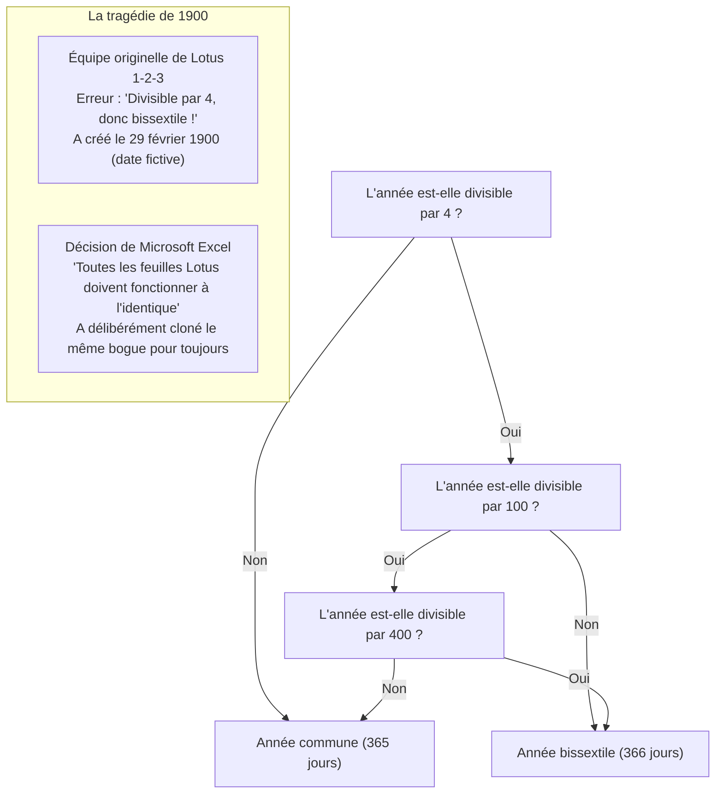

Au début des années 1980, le tableur tout-puissant dominant le monde DOS était *Lotus 1-2-3*. Ses développeurs ont omis la règle séculaire des 100 ans et ont codé 1900 comme bissextile, introduisant une date imaginaire — le 29 février 1900 — et décalant de fait la numérotation séquentielle des jours d'une journée pour toutes les dates ultérieures.

Lorsque Microsoft développa *Excel* pour rivaliser avec Lotus, ses ingénieurs se heurtèrent à un choix cornélien : respecter les mathématiques et l'astronomie, ou garantir une concordance parfaite des calculs avec les millions de feuilles financières existantes créées sous Lotus 1-2-3 ?

La réponse de Bill Gates fut sans ambiguïté. Pour garantir une migration indolore, Excel a fait le choix délibéré de **reproduire intentionnellement le bogue du 29 février 1900 dans son moteur de calcul**.

Lancez aujourd'hui le dernier Excel de Microsoft 365 et saisissez dans une cellule `=DATE(1900; 2; 29)`. Sans ciller, le logiciel affiche « 29/02/1900 ». Lorsqu'une plateforme décide d'absorber le bogue d'un concurrent, cette décision la lie pour des siècles.

### 3.2 Pourquoi « Windows 9 » a-t-il été sauté ?

En 2014, Microsoft présenta le successeur de Windows 8.1. Alors que l'industrie attendait « Windows 9 », la direction monta sur scène pour dévoiler à la stupeur générale le nom de **Windows 10**.

Au-delà des justifications marketing visant à signifier une rupture majeure, les experts de la communauté et les anciens de Microsoft révélèrent la contrainte sous-jacente : **un immense piège de compatibilité logicielle**.

Dans une multitude de bibliothèques Java, de routines d'installation et de logiciels développés depuis les années 1990, la détection de la version de l'OS reposait sur une simplification paresseuse :

```java
// Modèle de code omniprésent dans les logiciels anciens
String osName = System.getProperty("os.name");

if (osName.startsWith("Windows 9")) {
    // Exécuter le code ancien pour Windows 95 ou Windows 98 !
    // Active les modes de compatibilité 16 bits ou des registres obsolètes
    enableLegacyWin9xMode();
} else {
    // Branche pour OS modernes basés sur NT (Windows NT, 2000, XP, 7, 8, etc.)
    enableModernNTMode();
}
```

Les programmeurs avaient pris l'habitude d'écrire `startsWith("Windows 9")` pour cibler d'un coup à la fois Windows 95 et Windows 98.

Si Microsoft avait nommé son système « Windows 9 », des dizaines de milliers d'applications professionnelles auraient cru s'exécuter sur un OS grand public de 1995, auraient désactivé les API NT modernes pour tenter d'appeler des structures Win9x obsolètes, et se seraient effondrées au démarrage sur des machines ultra-performantes.

Microsoft préféra rayer un chiffre de l'histoire plutôt que de risquer de briser son écosystème logiciel.

### 3.3 Les API non documentées et Norton Utilities

Dans les années 1990, la suite *Norton Utilities* de Symantec était indispensable à tout utilisateur de PC pour diagnostiquer et réparer le système. Mais pour l'équipe de développement de Windows, elle représentait le pire cauchemar imaginable.

Les utilitaires bas niveau comme Norton ne se contentaient pas des API Win32 officielles. Ils **lisaient des structures de données internes non documentées, appelaient des fonctions privées du noyau et accédaient directement à des adresses mémoire codées en dur au sein des DLL système**.

Raymond Chen a souvent évoqué les combats titanesques menés lors du développement de Windows 95 face à Norton Utilities. Dès qu'une mise à jour de l'architecture interne déplaçait une variable d'un seul octet dans une structure de tâche, Norton Utilities provoquait un écran bleu (BSOD) immédiat.

Microsoft ne s'est pas contentée de reprocher à Symantec ses pratiques hasardeuses. Ses ingénieurs ont désassemblé Norton Utilities, cartographié tous les décalages mémoire accédés par le logiciel, et ont **maintenu des structures factices exactement aux adresses mémoire attendues par Norton**, assurant la stabilité de la machine au prix d'une prouesse d'ingénierie invisible.

### 3.4 Le jour où Bill Gates a empoigné un fusil : La naissance de DOOM et de DirectX

À la veille de la sortie de Windows 95, Windows était méprisé par les développeurs de jeux vidéo. Il était considéré comme une interface graphique bureautique beaucoup trop lente et lourde pour faire tourner des jeux d'action. Tous les grands titres étaient conçus pour MS-DOS, où les développeurs pilotaient directement les puces graphiques et cartes son (Sound Blaster) via des registres d'entrée/sortie (I/O ports).

Le chef-d'œuvre de cette époque était *DOOM*, créé par id Software, un phénomène culturel installé clandestinement sur les machines des entreprises et accusé de faire chuter la productivité américaine.

Bill Gates comprit le danger : si les utilisateurs devaient redémarrer leur PC sous DOS pour jouer, Windows 95 ne dominerait jamais totalement le marché. DOOM devait tourner sous Windows 95 — et plus vite que sous DOS.

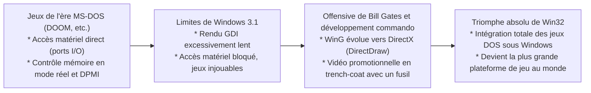

Gates mobilisa ses meilleurs talents pour concevoir « WinG », puis rapidement **DirectX** (nom de code : *Manhattan Project*). DirectX permettait aux applications d'accéder au matériel à grande vitesse tout en restant sous la protection du mode protégé de Windows.

Gates alla jusqu'à tourner dans une vidéo promotionnelle culte, vêtu d'un trench-coat et armé d'un fusil de chasse au milieu des monstres de DOOM incrustés sur fond vert, proclamant que Windows 95 était la plateforme de jeu ultime. La domestication du code sauvage des jeux DOS dans un environnement multitâche posa les bases de la domination sans partage de Windows dans le domaine multimédia.

---

## Chapitre 4 : La forteresse du Windows moderne : « AppCompat » (Application Compatibility)

Sous Windows 95, les rustines de compatibilité étaient disséminées sous forme d'exceptions ad-hoc au sein du système. Avec l'explosion du volume logiciel sous Windows 2000 et XP, cette approche atteignit ses limites : le code source de l'OS menaçait de devenir illisible sous le poids des embranchements conditionnels.

C'est alors que les architectes de Microsoft conçurent le moteur de compatibilité le plus sophistiqué de l'industrie : le **sous-système AppCompat (Application Compatibility)**.

### 4.1 Architecture globale du sous-système AppCompat

Le sous-système AppCompat est **un système d'interception intelligent qui analyse les exécutables dès leur chargement en mémoire et insère dynamiquement une couche d'illusion transparente (Shim) entre l'application et le noyau**.

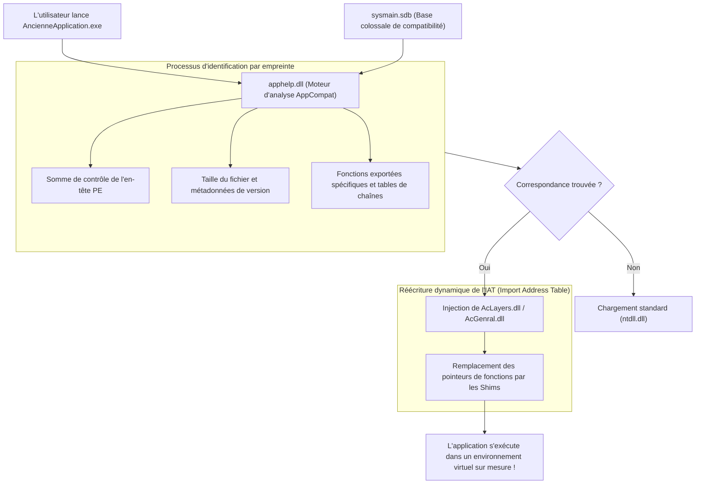

Lorsqu'un exécutable (`.exe`) est lancé, la routine de création de processus de Windows dans `ntdll.dll` ne passe pas immédiatement la main au point d'entrée de l'application. Elle invoque d'abord **`apphelp.dll`**.

`apphelp.dll` interroge la base de données interne **`sysmain.sdb`** pour vérifier si le binaire correspond à un profil nécessitant une remédiation. Si c'est le cas, le chargeur de l'OS injecte des bibliothèques de compatibilité spécialisées (**`AcLayers.dll`**, **`AcGenral.dll`**) directement dans l'espace d'adressage virtuel du processus, avant même la liaison des DLL système (`kernel32.dll`, `user32.dll`, etc.).

### 4.2 Le moteur de Shim : Interception d'API via le détournement d'IAT (IAT Hooking)

Comment le moteur de Shim modifie-t-il le comportement d'une application sans toucher à son binaire sur le disque ? L'arme maîtresse employée est le **détournement de l'IAT (Import Address Table Hooking)** dans l'en-tête PE (Portable Executable).

Lorsqu'un programme Win32 fait appel à une fonction d'une DLL système (comme `GetVersionEx` ou `GetDiskFreeSpace`), le code machine compilé ne contient pas l'adresse mémoire absolue de cette fonction. Au moment du lancement, le chargeur PE de Windows lit la table des importations et inscrit les adresses réelles des fonctions dans un tableau de pointeurs : l'IAT. L'application saute toujours indirectement via cette table.

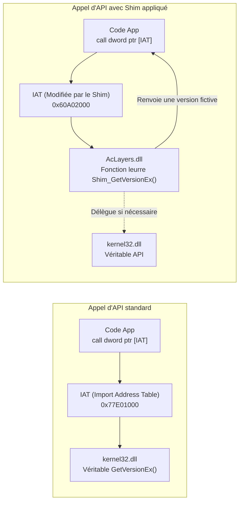

Le moteur de Shim exploite cette indirection : avant le démarrage du thread principal, il bascule temporairement les protections mémoire de l'IAT en `PAGE_READWRITE` et **remplace l'adresse de l'API authentique par celle de sa propre fonction leurre (la fonction Shim)**.

Voici une illustration en pseudo-code C/C++ de ce mécanisme :

```c
// Exemple conceptuel de détournement d'IAT pour l'injection de Shim
#include <windows.h>
#include <imagehlp.h>

// Fonction leurre GetVersionEx (le Shim)
BOOL WINAPI Shim_GetVersionExA(LPOSVERSIONINFOA lpVersionInformation)
{
    // Appel de la véritable API pour obtenir les informations réelles de base
    typedef BOOL (WINAPI *PFN_GETVER)(LPOSVERSIONINFOA);
    HMODULE hKernel = GetModuleHandleA("kernel32.dll");
    PFN_GETVER pfnRealGetVer = (PFN_GETVER)GetProcAddress(hKernel, "GetVersionExA");
    
    BOOL bResult = pfnRealGetVer(lpVersionInformation);
    
    // [La mystification]
    // Nous affirmons sans scrupule à l'application que le système est Windows 95 (Major: 4, Minor: 0)
    lpVersionInformation->dwMajorVersion = 4;
    lpVersionInformation->dwMinorVersion = 0;
    lpVersionInformation->dwBuildNumber = 950;
    lpVersionInformation->dwPlatformId = VER_PLATFORM_WIN32_WINDOWS;
    strcpy(lpVersionInformation->szCSDVersion, "");

    return TRUE; // L'application est convaincue d'être sous Windows 95 et fonctionne
}

// Routine d'installation du hook IAT dans le binaire PE
void InstallShimHook(HMODULE hAppModule, LPCSTR targetDll, LPCSTR targetFunc, PVOID newFuncAddress)
{
    ULONG size;
    PIMAGE_IMPORT_DESCRIPTOR pImportDesc = (PIMAGE_IMPORT_DESCRIPTOR)
        ImageDirectoryEntryToData(hAppModule, TRUE, IMAGE_DIRECTORY_ENTRY_IMPORT, &size);

    while (pImportDesc->Name) {
        LPCSTR dllName = (LPCSTR)((PBYTE)hAppModule + pImportDesc->Name);
        if (_stricmp(dllName, targetDll) == 0) {
            PIMAGE_THUNK_DATA pThunk = (PIMAGE_THUNK_DATA)((PBYTE)hAppModule + pImportDesc->FirstThunk);
            while (pThunk->u1.Function) {
                PROC* ppfn = (PROC*)&pThunk->u1.Function;
                DWORD oldProtect;
                VirtualProtect(ppfn, sizeof(PROC), PAGE_READWRITE, &oldProtect);
                *ppfn = (PROC)newFuncAddress; // Redirection vers notre fonction Shim !
                VirtualProtect(ppfn, sizeof(PROC), oldProtect, &oldProtect);
                break;
            }
        }
        pImportDesc++;
    }
}
```

Grâce à cette prouesse, le binaire reste strictement inchangé sur le disque tout en s'exécutant dans une bulle temporelle sur mesure.

### 4.3 Le binaire colossal : `sysmain.sdb` (Base de données de Shims)

Le centre névralgique de ce dispositif réside dans le fichier `C:\Windows\AppPatch\sysmain.sdb`.

Cette base de données binaire propriétaire renferme les **profils de correction de centaines de milliers de logiciels du commerce, jeux vidéo et outils métiers d'entreprises**.

Afin d'éviter d'appliquer des Shims à tort (par exemple à un installateur moderne nommé `setup.exe`), le moteur de correspondance s'appuie sur une empreinte multidimensionnelle :

1. **Nom du fichier et arborescence relative**
2. **Taille exacte du fichier en octets**
3. **Horodatage de l'éditeur de liens dans l'en-tête PE**
4. **Somme de contrôle PE (CheckSum)**
5. **Ressources de version (CompanyName, ProductName, FileVersion, etc.)**
6. **Condensats cryptographiques de sections et structure des tables d'exportation**

Si un utilisateur insère un CD-ROM d'encyclopédie de 2001 sous Windows 11, `apphelp.dll` identifie son empreinte, consulte `sysmain.sdb`, découvre que le programme requiert l'alignement mémoire de Windows 2000 et tente d'écrire indûment dans la base de registre, et déclenche instantanément la combinaison de Shims requise.

---

## Chapitre 5 : Catalogue des Shims emblématiques (L'art de l'illusion)

Windows intègre des centaines de Shims distincts formant un inventaire exhaustif destiné à réparer toutes les bévues de l'histoire du développement logiciel.

### 5.1 `VersionLie` : L'OS ment — « Vous êtes sous Windows 95 comme vous le vouliez »

Le Shim le plus ancien et le plus fréquent est **`VersionLie`**.

Nombreux étaient les développeurs vérifiant la compatibilité au lancement via `GetVersion` ou `GetVersionEx`, souvent avec un code excessivement rigide :

```c
// Exemple de test de version désastreux
OSVERSIONINFO vi;
GetVersionEx(&vi);

// Condition bloquée sur Windows 95
if (vi.dwMajorVersion == 4 && vi.dwMinorVersion == 0) {
    // Démarrage normal
} else {
    MessageBox(NULL, "Cette application requiert Windows 95.", "Erreur", MB_OK);
    ExitProcess(1); // Suicide du processus !
}
```

Lancé sur Windows XP (version 5), Windows 7 (version 6) ou Windows 10/11 (version 10), ce logiciel refuse tout simplement de démarrer parce que le numéro majeur n'est pas 4.

`VersionLie` intercepte l'appel et renvoie imperturbablement une structure indiquant Windows 95 (`Major: 4, Minor: 0`). Rassurée, l'application démarre sans encombre sur des processeurs multi-cœurs modernes et des disques NVMe ultra-rapides.

### 5.2 `EmulateGetDiskFreeSpace` : Sauvetage du dépassement d'entier au-delà de 2 Go

Au milieu des années 1990, les disques durs faisaient quelques centaines de mégaoctets. L'API Win32 `GetDiskFreeSpace` renvoyait le nombre de secteurs par cluster, d'octets par secteur et de clusters libres sous forme d'entiers signés de 32 bits.

Les développeurs calculaient l'espace disponible selon la formule :

$$\text{FreeBytes} = \text{SectorsPerCluster} \times \text{BytesPerSector} \times \text{NumberOfFreeClusters}$$

Dès lors que l'espace libre dépassait **2 gigaoctets ($2^{31} - 1$ octets)**, le calcul sur un entier 32 bits signé provoquait un dépassement arithmétique (*integer overflow*), basculant vers une **valeur négative** (par exemple -500 Mo).

Les programmes d'installation s'arrêtaient alors net, paniqués : *« Espace disque insuffisant ! L'installation requiert 50 Mo, mais vous ne disposez que de -500 Mo libres. »*

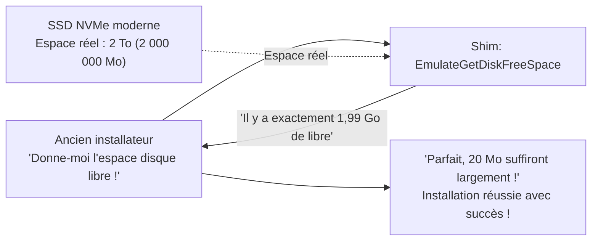

Le Shim **`EmulateGetDiskFreeSpace`** contourne le problème : quelle que soit la capacité réelle du support, il plafonne l'espace rapporté à **2 147 151 872 octets (~1,99 Go)**. L'installateur constate un espace suffisant et termine l'installation sans heurts.

### 5.3 `VirtualRegistry` et `VirtualStore` : Redirection sous le contrôle de compte d'utilisateur (UAC)

En 2006, Windows Vista bouleverse la sécurité avec le **Contrôle de compte d'utilisateur (UAC)**.

Auparavant, sous Windows 95, 98 et XP, les utilisateurs disposaient en permanence de droits administrateur effectifs. Les logiciels écrivaient couramment leurs fichiers de configuration et scores de jeux dans `C:\Program Files` ou dans la ruche système `HKEY_LOCAL_MACHINE\Software`.

Avec Vista, toute écriture d'un compte standard dans ces zones protégées fut strictement rejetée (`ACCESS_DENIED`). Une application stricte de cette règle aurait rendu inopérantes des millions d'applications existantes.

Microsoft a donc déployé **VirtualStore** : lorsqu'un programme ancien sans privilèges tente d'écrire dans `C:\Program Files\Game\save.dat`, le gestionnaire d'E/S détourne l'opération en toute transparence vers un répertoire isolé propre à l'utilisateur : `C:\Users\<Nom>\AppData\Local\VirtualStore\Program Files\Game\save.dat`.

Lorsque l'application relit le fichier, l'OS le charge depuis le VirtualStore. L'application croit écrire au cœur du système, tandis que l'intégrité de l'OS est préservée.

### 5.4 `DXPrimaryBltPunt` : Sauvetage des palettes de couleurs et des fréquences de rafraîchissement sous DirectDraw

Les jeux 2D de la fin des années 1990 (*Age of Empires*, classiques du jeu de rôle) s'appuyaient sur les premières versions de DirectDraw. Ils fonctionnaient en mode 256 couleurs (8 bits) et modifiaient directement les palettes de la surface primaire de la carte graphique dans la mémoire vidéo (VRAM).

Or, les GPU modernes et le moteur de composition de fenêtres de Windows (DWM) gèrent l'affichage sous forme de textures 32 bits TrueColor au sein d'un pipeline 3D.

Sans intervention, ces jeux affichaient des couleurs psychédéliques aberrantes ou s'emballaient à des vitesses vertigineuses de plusieurs centaines d'images par seconde en raison de l'incompatibilité des fréquences de rafraîchissement.

Les Shims graphiques tels que **`DXPrimaryBltPunt`** et **`ForceDirectDrawEmulation`** interceptent les commandes DirectDraw et les convertissent en temps réel en textures Direct3D compatibles avec le DWM, permettant aux graphismes d'époque de s'afficher avec une fidélité parfaite sur des écrans 4K modernes.

---

## Chapitre 6: Le passage au 64 bits et à l'architecture ARM — WOW64 et les prouesses de l'émulation

Lorsque l'architecture des processeurs change radicalement, les rustines d'API ne suffisent plus. Windows a franchi ces étapes historiques en intégrant des systèmes d'exploitation entiers à l'intérieur de lui-même.

### 6.1 De NTVDM à WOW64 : Deux mondes parallèles pour les fichiers et le registre

Lors du passage du 16 au 32 bits, Windows NT a fourni **NTVDM (NT Virtual DOS Machine)**, s'appuyant sur le mode Virtual 8086 des processeurs x86 pour exécuter les programmes DOS et Win16.

Puis, au milieu des années 2000, lorsque AMD64 (x64) a amorcé la transition vers le 64 bits, Microsoft a inauguré **WOW64 (Windows 32-bit On Windows 64-bit)**.

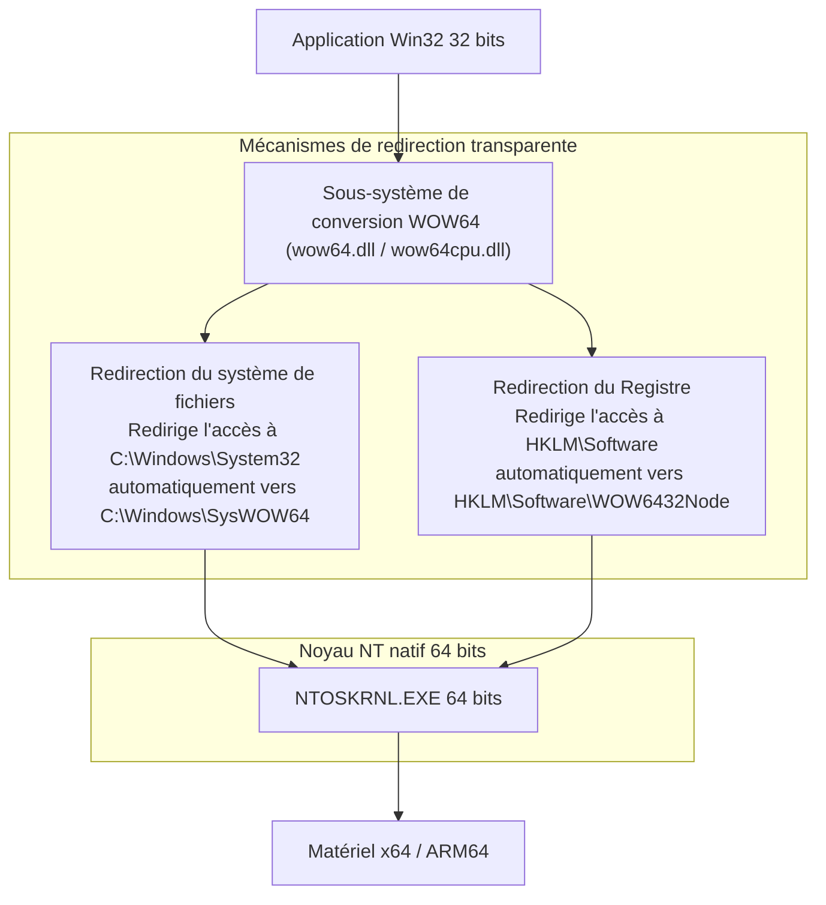

La force de WOW64 est d'offrir aux logiciels 32 bits **une vision double et parallèle du système de fichiers et de la base de registre** :

- **Redirection du système de fichiers** :
  Sous un OS 64 bits, les DLL système 64 bits natives résident dans `C:\Windows\System32`. Lorsqu'une application 32 bits sollicite ce dossier, WOW64 intercepte l'appel et la redirige vers `C:\Windows\SysWOW64` (qui abrite les bibliothèques 32 bits).
- **Redirection du Registre** :
  De même, lorsqu'une application 32 bits tente d'écrire dans `HKEY_LOCAL_MACHINE\Software`, l'opération est isolée dans `HKEY_LOCAL_MACHINE\Software\WOW6432Node`.

Grâce à ce dédoublement, une application 32 bits compilée en 1998 manipule ce qu'elle croit être System32 sans se douter qu'elle opère au sein d'un environnement 64 bits moderne.

### 6.2 La transition vers ARM64 et l'émulateur Prism

La nouvelle frontière technologique est le basculement de x86/x64 vers **ARM64 (Qualcomm Snapdragon X Elite, etc.)**.

En 2012, Microsoft avait lancé « Windows RT », qui interdisait l'exécution des applications Win32 classiques sur processeurs ARM — adoptant une rupture nette à la manière d'Apple. Le rejet du marché fut brutal et coûta près d'un milliard de dollars de dépréciations. Cet échec cuisant rappela à Microsoft une vérité fondamentale : un système incapable d'exécuter la logithèque Win32 n'est pas un vrai Windows aux yeux des clients.

Windows 11 sur ARM intègre désormais **Prism**, un émulateur de pointe. Prism traduit le code machine x86/x64 en instructions ARM64 à la volée via une compilation Just-In-Time (JIT) et conserve les blocs optimisés dans un cache persistant pour offrir des performances proches du natif.

Peu importe la nature du jeu d'instructions du processeur : le double-clic sur le programme doit fonctionner.

---

## Chapitre 7 : Trois visions du monde — Windows contre Apple (macOS) contre Linux

Face à la question du traitement des logiciels anciens, les trois grands écosystèmes informatiques mondiaux ont adopté des philosophies résolument divergentes.

### 7.1 Apple (La rupture chirurgicale) : La politique de la terre brûlée

De Steve Jobs à Tim Cook, la philosophie d'Apple repose sur une **« politique de la terre brûlée »** : pour bâtir l'expérience utilisateur du futur, le passé doit être éliminé sans regret.

L'histoire d'Apple est jalonnée de ruptures brutales :
- **Abandon du Classic Mac OS** : Transition forcée de Mac OS 9 à Mac OS X. L'API de transition « Carbon » a été tolérée temporairement avant d'être totalement éradiquée.
- **Mutations matérielles successives** : 680x0 → PowerPC → Intel x86 → Apple Silicon (série M). À chaque fois, des émulateurs (Mac 68K, Rosetta, Rosetta 2) sont proposés, puis supprimés au bout de quelques années.
- **Suppression du 32 bits dans macOS Catalina** : En 2019, Apple supprime définitivement l'exécution des binaires 32 bits, rendant obsolètes des milliers de plugins audio, jeux et utilitaires.

La position d'Apple est sans ambiguïté : les développeurs doivent utiliser le dernier Xcode, réécrire leur code en Swift et recompiler régulièrement. Ceux qui ne suivent pas sont exclus de l'écosystème. Cela permet à macOS de rester léger et moderne, mais impose un fardeau de maintenance perpétuel aux utilisateurs et développeurs.

### 7.2 Linux (Le commandement de Linus) : Lumières et ombres de « Never break userspace! »

Linus Torvalds, créateur du noyau Linux, applique une règle absolue qui ressemble étonnamment à la doctrine de Windows : **« Never break userspace! » (Ne jamais casser l'espace utilisateur !)**.

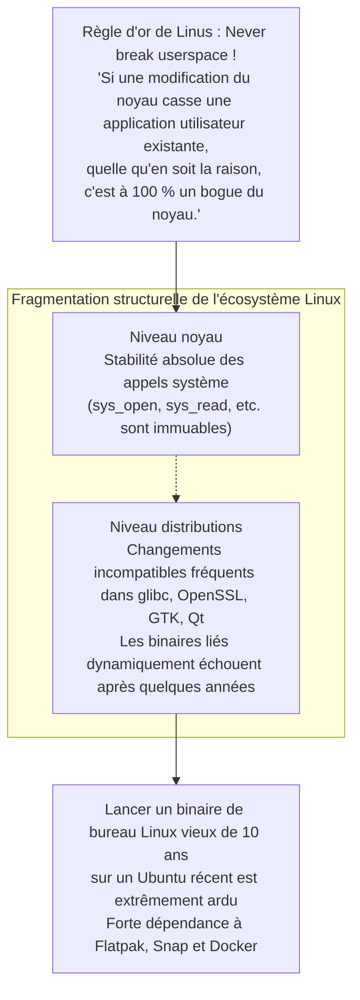

Si un correctif du noyau Linux, aussi élégant soit-il, empêche une application existante de tourner, Torvalds le rejette avec virulence. Sur ce point, la philosophie du noyau Linux s'aligne parfaitement sur celle de Windows.

Cependant, le bureau Linux ne possède pas d'autorité centrale régulatrice. Bien que les appels système du noyau soient immuables, les bibliothèques partagées des distributions (`glibc`, `libssl`, environnements graphiques) rompent continuellement la rétrocompatibilité. Par conséquent, **faire tourner un binaire de bureau Linux lié dynamiquement il y a dix ans sur une distribution Ubuntu moderne s'avère extraordinairement complexe**. Linux protège son noyau, mais la fragmentation de l'espace utilisateur l'empêche d'égaler la continuité trentenaire de Windows.

### 7.3 Windows (L'inclusion cumulative) : L'audace de l'empilement

Face à ces deux voies, Windows a choisi **l'inclusion cumulative**.

Aucune interface n'est abandonnée. Win32 s'est superposé à Win16, le framework .NET s'est superposé à Win32, WinRT et UWP ont été bâtis par-dessus, et après l'échec d'UWP, le SDK Windows App (WinUI 3) s'est réenraciné directement sur les fondations de Win32.

Windows est ainsi devenu l'un des logiciels les plus colossaux et complexes de la planète, mais en contrepartie, il offre un écosystème où **des logiciels de toutes les époques cohabitent et fonctionnent harmonieusement**.

| Critère | Microsoft (Windows) | Apple (macOS) | Linux (Desktop) |
| :--- | :--- | :--- | :--- |
| **Philosophie centrale** | **Inclusion cumulative**<br/>Conserver toutes les strates passées | **Rupture chirurgicale**<br/>Faire table rase régulièrement | **Noyau immuable, espace utilisateur instable**<br/>Noyau stable, bibliothèques changeantes |
| **Directive Première** | « Don't break old apps » | « Embrace the modern platform » | « Never break userspace » (Noyau uniquement) |
| **Horizon de compatibilité** | **Plus de 30 ans** (Win32 / DOS) | **3 à 5 ans** (puis suppression) | Plusieurs décennies pour le noyau, bref pour les GUI |
| **Support des binaires 32 bits** | **Opérationnel sur Win 11** (WOW64) | **Supprimé avec Catalina (2019)** | Possible via bibliothèques multi-arch |
| **Exigence pour les développeurs** | Les binaires continuent de tourner sans action | Réécritures et recompilations régulières | Re-paquetage régulier selon les distributions |
| **Pureté architecturale** | Massive, complexe, des centaines de millions de lignes | Épurée, moderne et unifiée | Modulaire, mais fortement fragmentée |

---

## Chapitre 8 : Économie de plateforme — Pourquoi la compatibilité est la douve ultime (Moat)

Pourquoi Bill Gates et les dirigeants successifs de Microsoft ont-ils imposé un tel tour de force d'ingénierie à leurs équipes ? La réponse ne réside pas dans l'esthétique du code, mais dans la froide réalité de **l'économie de plateforme et des barrières à l'entrée**.

### 8.1 Le modèle économique de Bill Gates : La valeur d'un OS est la somme de ses logiciels

Dès les origines, Bill Gates a perçu la loi fondamentale des plateformes :

> **Le théorème de la valeur de plateforme** :
> La valeur économique d'un système d'exploitation n'est pas mesurée par ses caractéristiques intrinsèques.
> Elle est égale à **la somme de la valeur de tous les logiciels qui peuvent s'exécuter dessus**.

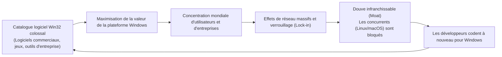

Un éditeur peut concevoir l'OS le plus élégant, économe en mémoire et esthétiquement parfait : si l'utilisateur ne peut y faire tourner les outils nécessaires à son travail, sa valeur marchande est nulle. L'utilisateur n'achète pas un OS pour lui-même, mais pour les applications qui lui permettent de produire de la valeur.

En garantissant une compatibilité totale, chaque ligne de code écrite au cours des trente dernières années pour Windows **vient automatiquement bonifier la valeur de chaque nouvelle version de Windows**.

Face aux arguments techniques de macOS ou Linux, les négociations en entreprise s'arrêtaient court sur cette seule phrase : *« Notre logiciel de gestion des commandes vieux de vingt ans ne fonctionne pas sur votre système. »* La rétrocompatibilité a constitué une douve économique infranchissable pour les rivaux.

### 8.2 Le verrouillage absolu du marché des entreprises

C'est sur le marché des grandes organisations que cette stratégie a manifesté toute sa puissance.

Les grands groupes industriels, banques, hôpitaux et administrations exploitent des outils sur mesure développés pour des dizaines de millions d'euros au fil des décennies (en Visual Basic 6 ou via des contrôles ActiveX propriétaires). Les éditeurs initiaux ont souvent disparu et le code source n'est plus maintenu : ce sont des artefacts indispensables que nul n'ose toucher.

Si Windows avait brisé la compatibilité et exigé la réécriture de ces applications sous des technologies web modernes, les directeurs des systèmes d'information auraient gelé les mises à jour et exploré d'autres pistes.

Mais Windows est arrivé avec le bouclier AppCompat, affirmant : *« Ne changez rien. Achetez de nouveaux ordinateurs, vos applications fonctionneront sans modification. »* Aucune promesse n'est plus irrésistible pour un dirigeant soucieux de la continuité de ses opérations. C'est ainsi que les entreprises mondiales sont devenues indissociables de l'écosystème Windows.

### 8.3 Le « piège du succès » entravant l'innovation radicale

Cependant, cette réussite sans égale s'est muée en un **piège du succès (Success Trap)** pour Microsoft elle-même.

Dans les années 2010, face à l'avènement des smartphones sous iOS et Android, Microsoft a tenté de moderniser Windows avec la **plateforme Windows universelle (UWP)** — un modèle d'application sécurisé et cloisonné en bac à sable (*sandbox*), pensé pour remplacer à terme Win32.

Mais les entreprises comme les développeurs ont boudé UWP : pourquoi s'astreindre à réécrire des logiciels complexes pour un environnement restreint alors que leurs exécutables Win32 tournaient déjà à pleine vitesse et avec une fiabilité exemplaire sur Windows 10 et 11 ?

Parce que Win32 fonctionnait trop bien et partout, Microsoft n'a pas pu s'en défaire. L'entreprise a dû se résoudre à faire marche arrière : UWP a été relégué au second plan, les applications Win32 ont été intégrées au Microsoft Store, et les frameworks récents comme WinUI 3 ont été réancrés sur Win32. La formidable rétrocompatibilité qu'elle avait érigée s'est transformée en son propre carcan d'innovation.

---

## Chapitre 9 : Le prix de la gloire — Dette technique colossale et risques de sécurité

Porter sur ses épaules les erreurs de programmation de la planète entière n'est pas sans contrepartie. L'équipe d'ingénierie de Windows supporte la dette technique la plus lourde de l'histoire du logiciel.

### 9.1 Des centaines de millions de lignes de code et une matrice de test astronomique

On estime que le code source de Windows compte aujourd'hui **plusieurs centaines de millions de lignes**. Mais le défi le plus titanesque réside dans la matrice de test requise pour valider chaque nouvelle version du système.

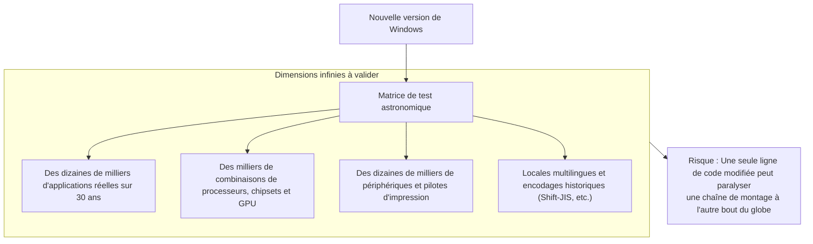

Modifier une seule vérification de pointeur ou l'ordonnancement d'un verrou dans le noyau NT peut geler un automate industriel conçu il y a trente ans au sein d'une usine en activité. Pour parer à cette hantise, Microsoft déploie d'immenses fermes de test composées de dizaines de milliers de machines réelles et virtuelles qui exécutent en continu des logiciels historiques pour s'assurer que leurs fenêtres s'ouvrent sans anomalie.

### 9.2 Les failles de sécurité induites par les API héritées

L'impact le plus critique de cette dette technique concerne la **cybersécurité**.

Conçues dans les années 1990 avant la démocratisation massive d'Internet, de nombreuses API Win32 ont été imaginées dans un climat de confiance, avec des contrôles de limites de mémoire insuffisants et des gestions de privilèges permissives. Mais pour préserver le fonctionnement des applications critiques, la suppression de ces API historiques est inenvisageable.

Les attaquants ciblent préférentiellement ces interfaces anciennes et les interstices des couches de compatibilité pour accomplir des élévations de privilèges ou s'échapper de bacs à sable. La bienveillance envers les applications du passé élargit inévitablement la surface d'attaque globale du système d'exploitation.

### 9.3 L'explosion du projet Longhorn et le refactoring « MinWin »

Cette accumulation de complexité atteignit son paroxysme au début des années 2000 avec le naufrage retentissant du **projet Longhorn**.

Conçu pour succéder à Windows XP, Longhorn s'est retrouvé englué dans des interdépendances inextricables entre nouvelles fonctionnalités et code hérité. Les compilations quotidiennes échouaient, le développement s'enlisait et le projet finit par s'effondrer sous son propre poids.

En 2004, Microsoft prit la décision radicale de réinitialiser le projet. Les ingénieurs jetèrent des années de code expérimental pour repartir du socle éprouvé de Windows Server 2003 SP1, entamant une refonte architecturale profonde connue sous le nom de **MinWin** (qui donna naissance à Windows Vista, puis Windows 7).

MinWin a scindé le cœur du noyau NT en un module compact et isolé, réduisant drastiquement son couplage avec les couches de compatibilité supérieures. C'est en surmontant cette crise existentielle que Windows a pu asseoir la stabilité de son architecture moderne.

---

## Conclusion : Une ode aux ingénieurs du réel — Une société moderne bâtie sur le miracle du « Ça marche »

Qu'il s'agisse des ordinateurs de bureau, des terminaux hospitaliers de dossiers médicaux, des distributeurs de billets, des postes de signalisation ferroviaire ou des machines-outils numériques dans les usines, les infrastructures névralgiques de la civilisation moderne reposent presque toutes sur Windows.

Imaginez ce qui se serait produit si Microsoft avait adopté le dogme de la pureté académique pour éliminer périodiquement les logiciels anciens à la manière des fabricants de smartphones :

Des usines entières se seraient arrêtées, d'innombrables PME auraient fait faillite sous le coût des refontes logicielles successives, et les services publics auraient basculé dans le chaos. Si l'économie mondiale informatisée a pu croître sans interruption pendant plus de trente ans, c'est parce que Windows **a consenti à porter sur ses épaules les négligences, incompréhensions, bogues et héritages de tous les développeurs du monde**.

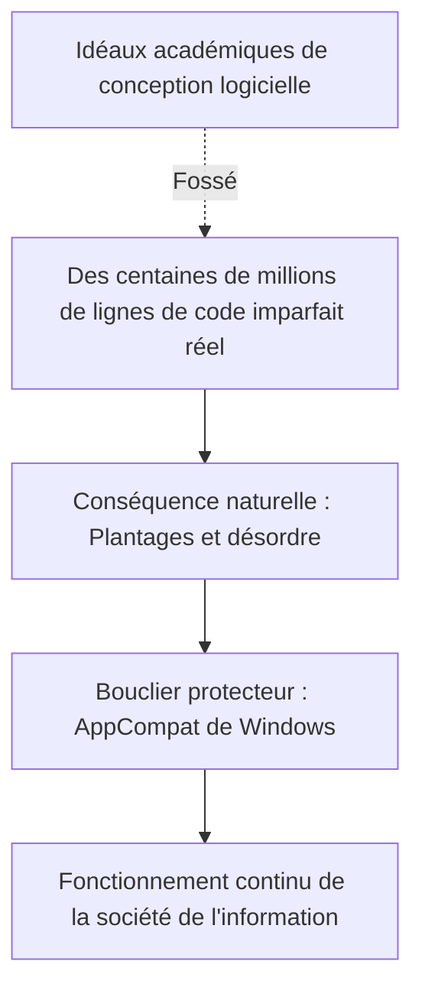

Pour Raymond Chen et des générations d'ingénieurs Windows, passer des nuits blanches à désassembler des binaires tiers et à coder des Shims pour pardonner les bogues d'autrui n'était guère prestigieux. Cette besogne ne valait ni prix académiques ni louanges de la Silicon Valley.

Mais c'est là que réside la quintessence du **véritable génie logiciel professionnel**.

Le véritable génie logiciel ne consiste pas à contempler de superbes équations dans un laboratoire aseptisé. Il consiste à retrousser ses manches, à affronter la boue et l'imperfection du monde réel, et à garantir envers et contre tout que **ce qui fonctionnait hier fonctionnera encore aujourd'hui, demain et dans vingt ans**.

« Ne cassez jamais les anciennes applications » — c'est sur cette directive intransigeante et sur le dévouement héroïque de programmeurs de l'ombre que continue de tourner, sans bruit, le monde numérique moderne.
